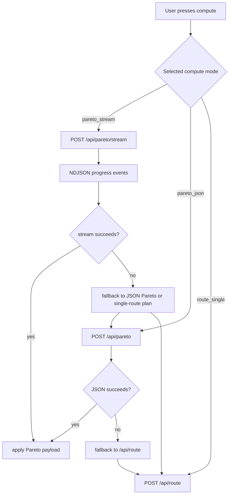
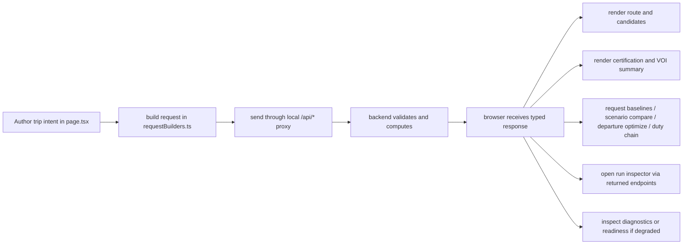
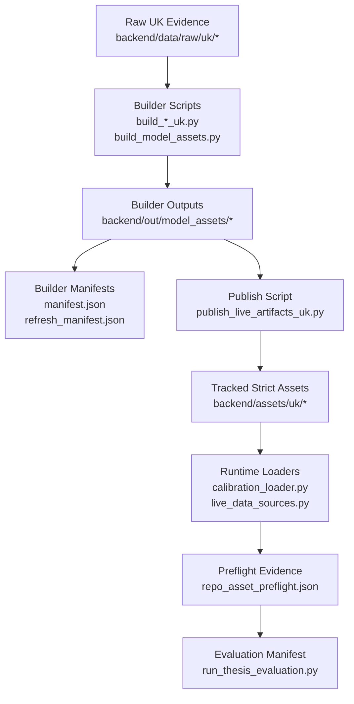

# Thesis-Grade Codebase Report: whatif-freight-router

Date: April 1, 2026

Repository basis: current local working tree at `c:\Users\jmend\Documents\GitHub\whatif-freight-router`

Evidence policy: repo-local evidence only.

## Abstract

`whatif-freight-router` is a UK-focused freight-routing decision system that combines a custom route-graph search layer, an OSRM geometry engine, a FastAPI backend, a Next.js frontend, and a calibrated asset stack for time, money, emissions, terrain, tolls, weather, scenario pressure, and uncertainty. The system does not treat routing as a shortest-path problem alone. It evaluates which feasible UK freight route is the better operational decision once multiple objectives and context signals are considered together.

The current thesis pipeline is organized around three named contributions:

- `DCCS`, the decision-critical candidate screening stage that decides which raw graph candidates deserve refinement
- `REFC`, the route evidence fragility certification stage that certifies or characterizes the strict frontier under bounded stress worlds
- `VOI-AD2R`, the value-of-information controller that decides whether to refine, refresh, or stop based on expected gain per action

These stages are wired into a single end-to-end pipeline that moves from raw candidate generation to strict frontier certification and then to controller-mediated stopping. The document below explains that pipeline as a complete system rather than as isolated modules.

The repository is also intentionally strict about unsupported states. Many subsystems prefer explicit refusal, readiness gating, or diagnostic evidence over silent fallback. That includes graph warmup, live-data readiness, terrain coverage, toll and carbon provenance, signature checks, and route evidence validation. The result is a routing system that is designed to be auditable rather than merely permissive.

## How To Read This Report

This report is organized as a thesis reference rather than a quick README. The first chapters explain the repository structure, runtime flow, and contribution roles in plain language. Later chapters expand into routing mechanics, selection math, physics, calibration, evidence certification, value-of-information control, artifacts, and evaluation outputs.

If the goal is thesis or paper writing, the most useful reading order is:

1. Project overview and contribution definitions
2. Full stack and deployment architecture
3. Frontend capability chapter
4. Backend request-flow and routing mechanics
5. Math and algorithms
6. Physics and cost model
7. Live data and calibration
8. DCCS, REFC, and VOI chapters
9. Baselines, evaluation, and results
10. Test, artifact, and appendix coverage

## Scope And Evidence Hierarchy

### Scope

The repository currently contains the following major surfaces:

- `backend/app`: FastAPI runtime modules and routing logic
- `backend/scripts`: asset builders, data collectors, evaluators, benchmark runners, and reporting scripts
- `backend/tests`: behavioral, regression, and pipeline tests
- `backend/assets/uk`: bundled UK calibration and model assets
- `backend/data/raw/uk` and `backend/data/eval`: raw evidence and evaluation corpora
- `frontend/app`: the Next.js application, components, and API proxy routes
- `docs`: support documents that explain pipeline semantics, benchmarks, and artifact formats
- `osrm`: the OSRM profile and helper scripts
- `scripts`: root operational helpers
- `backend/out`: generated manifests, artifacts, provenance, logs, and thesis outputs

The local working tree also contains current untracked additions that materially affect the codebase view, including the baseline comparison UI and supporting test coverage around route baselines and Pareto backfill.

### Repository map

| Area | Main path(s) | Role in the system |
| --- | --- | --- |
| Runtime backend | `backend/app` | Core route generation, selection, certification, provenance, and readiness logic |
| Builders and evaluators | `backend/scripts` | Asset generation, corpus construction, benchmark runs, and thesis-suite report composition |
| Backend tests | `backend/tests` | Locks in API behavior, routing mechanics, selection math, artifacts, evaluation scripts, and pipeline contracts |
| Frontend shell | `frontend/app/page.tsx`, `frontend/app/layout.tsx`, `frontend/app/global.css` | Main analyst-facing entry point, app shell, and visual styling |
| Frontend UI components | `frontend/app/components` | Map, charts, comparison panels, planners, dashboards, and devtools |
| Frontend API proxies | `frontend/app/api` | Request forwarding, timeout handling, stream relaying, and reason-code mapping |
| UK assets | `backend/assets/uk` | UK-specific calibration inputs for vehicles, scenario profiles, fuel, carbon, tolls, terrain, and stochastic regimes |
| Evaluation corpora | `backend/data/eval` | Canonical OD corpora used by broad, focused, probe, and hot-rerun runs |
| Generated outputs | `backend/out/artifacts`, `backend/out/manifests`, `backend/out/provenance`, `backend/out/logs` | Run outputs, manifests, provenance, and evaluation evidence |
| Routing engine | `osrm` and the Docker Compose wiring | Baseline geometry, via-path refinement, and OSRM-backed comparison routes |

### Evidence hierarchy used in this report

Primary truth:

- backend runtime code in `backend/app`
- frontend runtime code in `frontend/app`

Secondary truth:

- backend tests in `backend/tests`
- repository docs in `docs`

Tertiary truth:

- generated outputs already present locally under `backend/out`
- CI workflow under `.github/workflows`
- supporting scripts under `backend/scripts` and `scripts`

When docs and code differ, code is treated as authoritative. When multiple current outputs exist, the report favors the newest thesis-suite and focused-run artifacts that match the current evaluation pipeline.

### Citation And Reference-Key Convention

This report uses stable reference keys so that borrowed methods, external engines, external datasets or services, local artifact families, internal documentation pages, and code anchors can be cited consistently without repeating a long pathname or bibliography entry each time.

| Key family | Meaning | Typical target |
| --- | --- | --- |
| `SCH-*` | scholarly or methodological source | journal paper, conference paper, monograph |
| `ENG-*` | external engine or API documentation | OSRM, openrouteservice, Carbon Intensity API |
| `DAT-*` | external dataset, publication, or empirical feed | Geofabrik extract, WebTRIS, DfT counts, GOV.UK fuel series |
| `ART-*` | local artifact family | `thesis_summary.csv`, `evaluation_manifest.json`, `methods_appendix.md` |
| `DOC-*` | internal repository documentation | `docs/model-assets-and-data-sources.md` |
| `CODE-*` | code anchor in the repository | `backend/app/decision_critical.py`, `backend/app/voi_controller.py` |

The registry for all keys lives in `## Appendix AI: Source Registry And Citation Keys`. Full external bibliography entries for `SCH-*`, `ENG-*`, and `DAT-*` live in the terminal `## References` section. Internal `ART-*`, `DOC-*`, and `CODE-*` keys resolve inside the registry so the thesis report can cite repository evidence and external provenance using one consistent scheme.

### What this report does not assume

The repository contains route-comparison machinery for OSRM and ORS-style reference routes, but this report only states what the local code, artifacts, and evaluation outputs support. It presents the comparison pipeline, the reported metrics, and the result families neutrally, without inventing universal win rates or unsupported aggregate claims.

## Project Overview

### What problem the project solves

The system helps a user choose freight routes between UK origin and destination points when the relevant decision criteria are broader than path length. A freight operator can care about time, money, CO2, toll exposure, weather, incident sensitivity, scenario policy, and uncertainty. The repository turns those competing concerns into a multi-objective routing workflow that supports both a single recommended route and a frontier of trade-off routes.

### Canonical contribution trio

The three current thesis-facing contributions work together as follows:

- `DCCS` is the candidate-screening stage. It ranks raw graph candidates before expensive refinement and keeps the search budget focused on candidates that are plausible, distinct, and decision-relevant.
- `REFC` is the certification stage. It samples bounded stress worlds over the strict frontier and records how fragile, supported, or certified each route is under evidence-family perturbations.
- `VOI-AD2R` is the controller stage. It chooses whether another refinement, refresh, or sampling action is worth paying for, and it stops when the expected gain no longer justifies the next action.

These stages define the thesis pipeline vocabulary used by the current codebase and evaluation scripts.

### End-to-end runtime flow

The current pipeline flow is:

`K_raw -> DCCS -> R -> F -> REFC -> VOI-AD2R -> stop certificate`

The terms mean:

- `K_raw`: the raw candidate set produced by graph-led exploration and prefiltering
- `DCCS`: screening and ledger construction for candidates before refinement
- `R`: the set of refined routes after OSRM realization and cost/model enrichment
- `F`: the strict Pareto frontier extracted from the refined set
- `REFC`: route evidence fragility certification over bounded evidence worlds
- `VOI-AD2R`: value-of-information controller actions that refine, refresh, or stop
- `stop certificate`: the final decision summary that records why the controller stopped and what evidence it accepted

In practical terms, the system first builds a candidate pool, then narrows it, then refines and scores it, then certifies the strict frontier, and finally decides whether more evidence is worth the cost.

### What a user can do from the frontend

A user can:

- place an origin, destination, and optional intermediate stops on a UK map
- request either a single recommended route or a full Pareto set of trade-off routes
- compare routes under different scenario modes
- inspect segment-level breakdowns for distance, duration, cost, emissions, tolls, and incidents
- optimize departure time across a time window
- build duty chains across multiple stops
- run experiments and save scenario-comparison bundles
- inspect live-source diagnostics and readiness state
- view baseline comparisons against OSRM and ORS-style reference routing [ENG-OSRM] [ENG-ORS]
- inspect artifact manifests, provenance, signatures, and quality dashboards
- define custom vehicles in addition to built-in profiles

### UK-only scope

This is a UK-centered system. The code and assets are explicitly organized around UK road, terrain, toll, and policy data. The main UK-specific surfaces include the Geofabrik United Kingdom OpenStreetMap extract [DAT-GEOFABRIK-OSM-UK], UK calibration assets, the UK terrain coverage policy and DEM support [DAT-ELEVATION-TILES-PROD], UK departure and GOV.UK bank-holiday logic [DAT-GOVUK-BANK-HOLIDAYS], UK toll evidence, and UK scenario corpora. Non-UK terrain behavior is handled explicitly rather than assumed away.

## Full Stack And Deployment Architecture

### System architecture at a glance

The repository is organized as four cooperating layers:

1. A route-graph and evidence layer that creates candidate corridors and encodes UK-specific calibration assets.
2. A backend decision layer that refines candidates, scores them, certifies the frontier, and writes reproducible artifacts.
3. A frontend analyst layer that exposes routing, comparison, scenario, and diagnostic workflows.
4. A reporting and evaluation layer that composes thesis-suite outputs, benchmark summaries, and run manifests.

The routing engine remains hybrid. OSRM [ENG-OSRM] provides realized road geometry and baseline reference routes through the documented OSRM project and HTTP API, while the custom graph layer provides feasibility checks, corridor diversification, and candidate generation. The system uses both because each is strongest at a different part of the route-decision problem.

### Runtime components

Backend runtime modules under `backend/app` provide:

- request models and validation
- route graph warmup and feasibility checks
- k-shortest and rescue-style candidate generation
- OSRM [ENG-OSRM] and openrouteservice / ORS [ENG-ORS] baseline integration
- Pareto and scalar selection
- DCCS, REFC, and VOI controller logic
- live-data adapters and provenance
- metrics, run storage, signatures, and artifact writing

The frontend under `frontend/app` provides:

- the main map and route workspace
- the scenario editor and comparison panels
- Pareto visualization and segment breakdowns
- departure optimization and duty-chain planning
- experiments, run inspection, and signature verification tools
- oracle-quality and live-call diagnostics

The evaluation and reporting path under `backend/scripts` provides:

- corpus construction and ambiguity enrichment
- broad, focused, probe, and hot-rerun evaluation lanes
- thesis-suite report composition
- benchmark and quality scripts
- artifact validation and publishing helpers

### Deployment shape

The default local architecture is a seven-service Docker Compose pipeline plus local frontend tooling:

1. `osrm_download` downloads the configured region PBF from the Geofabrik United Kingdom OpenStreetMap feed [DAT-GEOFABRIK-OSM-UK].
2. `osrm` self-hosts OSRM through `ghcr.io/project-osrm/osrm-backend:v6.0.0` [ENG-OSRM], prepares cached data if needed, and serves routing on port 5000.
3. `osrm_ready` waits for OSRM readiness.
4. `ors` self-hosts openrouteservice through `openrouteservice/openrouteservice:v9.7.1` [ENG-ORS] and serves ORS on port 8082 using the same provider family documented by the official usage and API-reference material.
5. `ors_ready` waits for the ORS health endpoint before backend startup.
6. `backend` serves the FastAPI API on port 8000.
7. `frontend` serves the Next.js app on port 3000.

The root `docker-compose.yml` wires these together. The scripts under `osrm/scripts` manage PBF download caching and OSRM preprocessing reuse.

### Repository layout and artifact surfaces

Tracked source directories:

- `backend/app`: runtime backend
- `backend/assets/uk`: bundled UK model assets
- `backend/data/eval`: evaluation corpora and OD scenario inputs
- `backend/data/raw/uk`: raw evidence used to build assets
- `backend/scripts`: model builders, fetchers, validators, benchmarks, and evaluation/reporting scripts
- `backend/tests`: behavioral lock-in
- `frontend/app`: full Next.js app
- `docs`: supporting documentation and thesis-facing specs
- `osrm`: OSRM profile and scripts
- `scripts`: root operational helpers

Generated/runtime directories present locally:

- `backend/out/model_assets`
- `backend/out/artifacts`
- `backend/out/manifests`
- `backend/out/provenance`
- `backend/out/logs`
- `backend/out/oracle_quality`
- `backend/out/analysis`
- `backend/out/capsule`
- `backend/out/experiments`
- `backend/out/thesis`

The artifact tree contains current thesis-suite and probe families, including broad, focused, hot-rerun, DCCS, REFC, and VOI outputs. Those outputs are part of the evidence base for later chapters in this report.

## Frontend Capability Chapter

### Frontend Shell

The frontend is a single-page analyst workbench built around `frontend/app/page.tsx`. It is not a thin route form. The page owns the main route-computation session, the selected route and alternatives, the map focus state, tutorial progress, the experiment catalog, the run inspector, and the devtools panels that expose provenance and signatures.

The top-level flow is:

1. build a request from the current origin, destination, stops, weights, and advanced controls;
2. send the request through local proxy handlers such as `frontend/app/api/route/route.ts` and `frontend/app/api/pareto/stream/route.ts`;
3. stream or fetch route, Pareto, scenario, departure, duty, or baseline responses;
4. normalize the response into typed frontend state; and
5. render the map, comparison cards, charts, and diagnostics panels from that state.

That design makes the frontend a control surface for the backend pipeline rather than a passive viewer.

### State And Data Flow

The shell uses React state and transition boundaries to keep route recomputation usable while requests are in flight. `page.tsx` owns the high-level state, while the shared helpers in `frontend/app/lib/` keep payload construction and transport handling separate from presentation.

The main helpers are:

- `frontend/app/lib/requestBuilders.ts` for route, Pareto, scenario-compare, departure-optimize, and duty-chain payload assembly
- `frontend/app/lib/api.ts` for JSON, text, and NDJSON fetch wrappers
- `frontend/app/lib/backendFetch.ts` for timeout, retry, and reason-code handling
- `frontend/app/lib/types.ts` for mirrored request/response contracts
- `frontend/app/lib/baselineComparison.ts` for presentation-layer comparison summaries

Representative request construction is centralized rather than duplicated in panels.

Source: `frontend/app/lib/requestBuilders.ts`. Purpose: convert the shared `ODRoutingInput` state into the concrete request objects consumed by route and Pareto endpoints.

```ts
// frontend/app/lib/requestBuilders.ts
export function buildRouteRequest(input: ODRoutingInput): RouteRequest {
  return {
    origin: input.origin,
    destination: input.destination,
    waypoints: input.waypoints,
    vehicle_type: input.vehicle_type,
    scenario_mode: input.scenario_mode,
    max_alternatives: input.max_alternatives,
    weights: input.weights,
    ...input.advanced,
  };
}

export function buildParetoRequest(input: ODRoutingInput): ParetoRequest {
  return {
    origin: input.origin,
    destination: input.destination,
    waypoints: input.waypoints,
    vehicle_type: input.vehicle_type,
    scenario_mode: input.scenario_mode,
    max_alternatives: input.max_alternatives,
    weights: input.weights,
    ...input.advanced,
  };
}
```

The shared builders guarantee that the route, Pareto, scenario, departure, and duty panels all serialize OD state in the same field order and with the same advanced controls. Transport handling then happens one layer lower in the proxy and NDJSON helpers described in [Proxy And Streaming Pattern](#proxy-and-streaming-pattern).

### Why The Frontend Is A Single Analyst Workbench

The frontend keeps these workflows in one client shell because the repository treats them as different views over the same analyst session, not as unrelated products. `frontend/app/page.tsx` owns one shared bundle of origin/destination geometry, waypoints, vehicle profile, weights, advanced controls, active diagnostics, baseline overlays, certification state, and run-inspector state. That same bundle feeds route compute, Pareto exploration, scenario comparison, departure optimization, duty-chain planning, baseline comparison, and artifact inspection.

Splitting the UI into many isolated pages would duplicate four things the repository deliberately keeps centralized:

- OD-state ownership and mutation
- request serialization into the backend contract family
- transport failure handling and request-ID propagation
- cross-workflow comparison between route answers, baselines, certificates, and artifacts

The result is a workbench rather than a sequence of forms. A user can compute a route, inspect the Pareto set, compare against OSRM or ORS, inspect the certificate summary, open the run artifacts, and check readiness or live-data diagnostics without re-entering the same OD specification or reconstructing state from query strings.

This design is visible directly in the shared request-builders layer.

| Shared analyst state | Reused by | Why one shell is preferable |
| --- | --- | --- |
| `origin`, `destination`, `waypoints` | `/route`, `/pareto`, `/scenario/compare`, `/departure/optimize` | keeps all route-analysis workflows aligned to the same OD session |
| `vehicle_type`, `scenario_mode`, `weights`, `advanced` | route, Pareto, scenario, duty-chain, baseline comparison | avoids drift between panels that should be analyzing the same operating assumptions |
| run metadata, signatures, manifest state | certification panel, run inspector, artifact preview | lets the user move from answer inspection to provenance inspection without a second application state |
| health/readiness diagnostics | compute hints, ops diagnostics, strict/live visibility | turns backend state into actionable operator guidance in the same workflow surface |

### Primary Interaction Surfaces

The root page composes the core workbench panels directly. The most important surfaces are:

- `MapView.tsx` for origin/destination selection, stop placement, alternative routes, baseline overlays, incident overlays, and tutorial focus
- `ScenarioParameterEditor.tsx` for scenario mode, weights, Pareto method, epsilon thresholds, departure time, cost toggles, stochastic controls, terrain profile, weather, and incident simulation
- `RouteCertificationPanel.tsx` for certification summary, active evidence families, top competitor, top refresh family, and VOI stop summary
- `RouteBaselineComparison.tsx` for baseline deltas and the derived presentation-tier label
- `ParetoChart.tsx` for multi-objective trade-off visualization
- `ScenarioComparison.tsx` for cross-scenario comparison
- `DepartureOptimizerChart.tsx` for departure-slot exploration
- `EtaTimelineChart.tsx` for stage-wise ETA decomposition
- `DutyChainPlanner.tsx` for multi-stop chain construction
- `CounterfactualPanel.tsx` for what-if changes to fuel, carbon, or departure context
- `SegmentBreakdown.tsx` for per-segment accounting
- `ScenarioTimeLapse.tsx` for time-based playback
- `ExperimentManager.tsx` for saved experiment bundles and replay
- `OracleQualityDashboard.tsx` for feed quality and freshness
- `TutorialOverlay.tsx` for guided workflow support
- devtools panels for batch runs, custom vehicles, ops diagnostics, run inspection, and signature verification

The map is the main geographic surface. It is UK-bounded, supports origin/destination and stop markers, and layers selected route geometry, alternatives, baseline routes, route failures, segment tooltips, incident markers, and time-lapse position playback. That makes the geography visible enough to explain route choice and not just compute it.

At implementation level, `MapView.tsx` uses the `leaflet` and `react-leaflet` frontend dependencies to render a CARTO-hosted dark basemap tile layer with the built-in OpenStreetMap and CARTO attribution string [DAT-CARTO-BASEMAPS] [DAT-OSM-COPYRIGHT]. That matters because the frontend is not drawing routes over an abstract canvas; it is binding the route overlays to a named public tile and attribution surface.

### Baseline Comparison

The baseline-comparison view is a presentation layer over backend comparison outputs. It does not recompute routes locally. Instead, it displays the difference between the selected route and comparator routes using the same data model the backend returned.

The comparison panel exposes:

- ETA delta
- cost delta
- CO2 delta
- distance delta
- a balanced improvement score
- qualitative labels such as `Epic`, `Strong`, `Positive`, and `Limited gain`

That gives the frontend a thesis-friendly way to show how a chosen route performs against simpler comparator engines while keeping the scoring logic centralized.

### Proxy And Streaming Pattern

The frontend never calls backend logic directly from components. It calls local route handlers under `frontend/app/api/*/route.ts`, which forward the request to FastAPI and normalize the response shape for the browser.

The proxy layer handles:

- `no-store` fetch semantics for live compute
- request and response forwarding
- transport-level timeouts
- streaming NDJSON relays for Pareto progress
- diagnostic request IDs such as `x-route-request-id`
- transport reason codes such as `backend_headers_timeout`, `backend_body_timeout`, `backend_connection_reset`, and `backend_unreachable`

This pattern is what lets the shell support both short JSON responses and long-running streamed Pareto runs without special-casing each panel.

Source: `frontend/app/api/pareto/stream/route.ts`. Purpose: relay a browser request to the FastAPI streaming endpoint and translate transport failures into stable browser-visible reason codes.

```ts
// frontend/app/api/pareto/stream/route.ts
export async function POST(req: Request): Promise<Response> {
  const body = await req.text();

  let resp: Response;
  try {
    resp = await fetchBackend('/api/pareto/stream', {
      method: 'POST',
      headers: { 'content-type': 'application/json' },
      body,
      requestSignal: req.signal,
      timeoutMs: computeAttemptTimeoutMs(),
    });
  } catch (error: unknown) {
    const classified = classifyBackendTransportError(error);
    return new Response(
      JSON.stringify({
        detail: {
          message: 'Unable to reach backend streaming endpoint.',
          reason_code: classified.reasonCode,
          cause: classified.cause || classified.detail,
        },
      }),
      {
        status: 502,
        headers: {
          'content-type': 'application/json',
          'cache-control': 'no-store',
        },
      },
    );
  }
```

That proxy keeps browser code insulated from backend URL management, timeout policy, and the taxonomy of transport reason codes.

Source: `frontend/app/lib/api.ts`. Purpose: consume NDJSON progress streams with an explicit stall timeout so long Pareto runs surface partial progress and deterministic timeout failures instead of hanging the UI.

```ts
// frontend/app/lib/api.ts
export async function postNDJSON<TEvent extends object>(
  path: string,
  body: unknown,
  options: PostNDJSONOptions<TEvent>,
): Promise<void> {
  const res = await fetch(path, {
    method: 'POST',
    headers: { 'Content-Type': 'application/json', ...(options.headers ?? {}) },
    body: JSON.stringify(body),
    cache: 'no-store',
    signal: options.signal,
  });

  if (!res.ok) {
    const text = await res.text();
    throw new Error(extractErrorMessage(text));
  }

  if (!res.body) {
    throw new Error('Streaming response was empty');
  }

  const reader = res.body.getReader();
  const decoder = new TextDecoder();
  let buffer = '';
  const stallTimeoutMs =
    typeof options.stallTimeoutMs === 'number' && options.stallTimeoutMs > 0
      ? Math.floor(options.stallTimeoutMs)
      : 0;

  async function readWithOptionalTimeout(): Promise<ReadableStreamReadResult<Uint8Array>> {
    if (stallTimeoutMs <= 0) {
      return reader.read();
    }
    return new Promise<ReadableStreamReadResult<Uint8Array>>((resolve, reject) => {
      const timeoutId = setTimeout(() => {
        reject(new Error(`Streaming response stalled for ${stallTimeoutMs}ms`));
      }, stallTimeoutMs);
      void reader
        .read()
        .then((result) => {
          clearTimeout(timeoutId);
          resolve(result);
        })
        .catch((err) => {
          clearTimeout(timeoutId);
          reject(err);
        });
    });
  }
```

The page-level workbench uses that helper to surface streamed frontier progress while keeping transport policy centralized in one module.

### Why Local Proxy Routes Exist

The local route handlers under `frontend/app/api/*` are not just a convenience shim. They are the place where browser-facing workflow guarantees are enforced before a request touches FastAPI.

The proxies exist for four concrete reasons visible in the code:

1. deployment insulation: `frontend/app/lib/backendFetch.ts` resolves `BACKEND_INTERNAL_URL` and `NEXT_PUBLIC_BACKEND_URL` so components never hard-code backend addresses
2. transport policy centralization: timeout, abort propagation, and failure classification are implemented once and then reused across route, Pareto, baseline, health, and debug flows
3. browser-safe normalization: reason codes such as `backend_headers_timeout` and `backend_unreachable` are converted into stable JSON payloads that the UI can turn into recovery hints
4. controlled exposure of backend evidence: run-artifact routes and debug endpoints are proxied through explicit allow-lists rather than exposing the backend path space directly to the browser

This is why `frontend/app/api/route/route.ts` and `frontend/app/api/pareto/stream/route.ts` preserve `x-route-request-id` while also normalizing transport failures. The frontend is expected to inspect and explain backend behavior, so the proxy layer preserves trace identity instead of collapsing everything into a generic HTTP failure.

The same rationale explains the run-artifact proxy. `frontend/app/api/runs/[runId]/[...subpath]/route.ts` exposes only core manifest/signature endpoints plus a bounded artifact-file set. That design gives the Run Inspector a stable browser contract without turning the frontend into a raw filesystem browser for the backend run store.

| Proxy responsibility | Evidence in repo | Why it lives in the frontend route layer |
| --- | --- | --- |
| backend URL resolution and timeout policy | `frontend/app/lib/backendFetch.ts` | keeps deployment-specific transport rules out of UI components |
| request-ID propagation | `frontend/app/api/route/route.ts`, `frontend/app/api/pareto/stream/route.ts` | lets diagnostics and live-call tracing survive the browser hop |
| streamed NDJSON relay | `frontend/app/api/pareto/stream/route.ts`, `frontend/app/lib/api.ts` | allows progress events, stall handling, and cancellation from browser code |
| artifact allow-listing | `frontend/app/api/runs/[runId]/[...subpath]/route.ts` | exposes inspectable evidence while still constraining the accessible file family |

### Run Inspector And Artifact Proxying

The same frontend shell also exposes stored run evidence rather than treating artifacts as backend-only files. The proxy route under `frontend/app/api/runs/[runId]/[...subpath]/route.ts` whitelists core manifest/signature endpoints and a bounded set of artifact filenames, then relays the selected backend file with `no-store` semantics.

Source: `frontend/app/api/runs/[runId]/[...subpath]/route.ts`. Purpose: expose run manifests, provenance, signatures, and selected artifacts to the browser through a controlled whitelist rather than an unrestricted filesystem-style passthrough.

```ts
// frontend/app/api/runs/[runId]/[...subpath]/route.ts
const CORE_ALLOWED = new Set([
  'manifest',
  'scenario-manifest',
  'provenance',
  'signature',
  'scenario-signature',
  'artifacts',
]);

function isAllowedSubpath(subpath: string[]): boolean {
  if (subpath.length === 0) return false;
  if (subpath.length === 1) return CORE_ALLOWED.has(subpath[0]);
  if (subpath[0] !== 'artifacts') return false;
  if (subpath.length !== 2) return false;
  return ARTIFACT_ALLOWED.has(subpath[1]);
}

export async function GET(_req: Request, ctx: Ctx): Promise<Response> {
  const { runId, subpath } = await ctx.params;
  if (!isAllowedSubpath(subpath)) {
    return new Response(JSON.stringify({ detail: 'unsupported run artifact path' }), {
      status: 404,
      headers: { 'content-type': 'application/json' },
    });
  }
```

This matters for thesis use because the UI can inspect the same manifest, provenance, and artifact bundle that the backend writes during evaluation. The Run Inspector component then turns those proxied payloads into readable manifest/signature panes and artifact previews rather than forcing the reader back to the filesystem.

### Frontend Contract Surface

`frontend/app/lib/types.ts` mirrors backend request and response models closely enough that the panels can render detailed route options, certification summaries, run artifacts, quality dashboards, and strict reason codes without ad hoc casting. In practice, that means the frontend is typed against the same decision objects that the backend writes to artifacts and exposes through run endpoints.

That mirroring is a deliberate contract choice. The report, the run store, and the browser all talk about the same route option, certificate summary, provenance bundle, and run manifest fields. The frontend therefore does not invent a second presentation-only schema for the important backend decision objects; it mirrors them closely enough to render the same objects that the backend persists.

### Why Frontend Weights And Selection Profiles Mirror Backend Scalarisation

`frontend/app/lib/weights.ts` mirrors the backend scalarisation family on purpose. The browser is not choosing routes independently of the backend, but it does need to explain how different scalarisation profiles would rank an already returned frontier and how the baseline-comparison labels are derived from the same objective trade-offs.

The selection-profile names in the frontend are therefore aligned to the backend mathematical families rather than to arbitrary UI labels:

- `academic_reference` mirrors the weighted-sum reference score
- `academic_tchebycheff` mirrors the augmented Tchebycheff form
- `academic_vikor` mirrors the compromise-ranking view
- `modified_hybrid`, `modified_distance_aware`, and `modified_vikor_distance` mirror the repository's practical engineering blends for picking one representative option from a computed frontier

Source: `frontend/app/lib/weights.ts`. Purpose: declare that the browser-side selection profiles intentionally mirror backend scalarisation families rather than inventing a separate UI-only ranking taxonomy.

```ts
// frontend/app/lib/weights.ts
export type SelectionMathProfile =
  | 'academic_reference'
  | 'academic_tchebycheff'
  | 'academic_vikor'
  | 'modified_hybrid'
  | 'modified_distance_aware'
  | 'modified_vikor_distance';

// Academic and modified selection formulas mirrored from backend.
// The modified profiles are practical engineering blends for selecting one
// representative route from an existing Pareto set.
```

This mirroring solves two problems at once. First, it keeps the frontend explanation layer consistent with backend route-choice semantics implemented in `backend/app/objectives_selection.py`, `backend/app/pareto_methods.py`, and the route-selection helpers in `backend/app/main.py`. Second, it lets the UI compare or relabel already computed route options without forcing the browser to re-run graph search, refinement, or certification logic. The backend remains authoritative for route generation and run logging; the frontend mirrors the scalarisation family so that the selection rationale shown to the user is mathematically aligned with the backend.

### Why Some Controls Are Deliberately Browser-Visible While Others Stay Backend-Only

The control boundary in the repository is not accidental. The browser exposes the controls that a human analyst can reasonably interpret as route-intent or scenario-intent parameters, while the backend models retain additional evaluator and pipeline controls that affect search economics, certification budgets, or reproducibility rather than the human meaning of a route request.

The exposed controls come from `ScenarioParameterEditor.tsx` and the shared request builders. They include Pareto method, epsilon thresholds, departure time, toll and carbon toggles, terrain profile, stochastic configuration, optimization mode, risk aversion, weather, incident simulation, and emissions context. Those fields change what kind of route the user is asking for.

The backend models in `backend/app/models.py` expose a wider contract: `pipeline_mode`, `refinement_policy`, `pipeline_seed`, `search_budget`, `evidence_budget`, `cert_world_count`, `certificate_threshold`, `tau_stop`, and `evaluation_lean_mode` exist because the same application also supports thesis evaluation, controlled ablations, reproducible reruns, and budget-sensitive certification workflows. Those knobs are part of the backend schema because batch runners, evaluators, and tests need them, but the normal analyst editor omits them so the day-to-day route UI is not overloaded with thesis-only orchestration parameters.

| Contract field family | Visible in normal browser editor? | Why |
| --- | --- | --- |
| `pareto_method`, `epsilon`, `departure_time_utc`, `cost_toggles`, `terrain_profile`, `stochastic`, `optimization_mode`, `risk_aversion`, `emissions_context`, `weather`, `incident_simulation` | yes | these are analyst-meaningful route and scenario controls |
| `pipeline_mode` | partially | displayed and carried through the response flow, but not treated as a normal route-tuning knob in the main analyst form |
| `refinement_policy`, `search_budget`, `evidence_budget`, `cert_world_count`, `certificate_threshold`, `tau_stop`, `evaluation_lean_mode`, `pipeline_seed` | no in the normal UI | these steer backend search, certification, evaluation, or reproducibility machinery rather than user-facing route intent |

This boundary also explains why `frontend/app/lib/types.ts` still mirrors some fields that the main editor does not expose: the frontend needs to understand run metadata and response payloads from batch, certification, and evaluation workflows even when the main operator interface does not offer those controls directly.

## Backend Request-Flow Chapter

### Request Lifecycle

The backend is a staged compute pipeline. A route request does not jump from coordinates to a single answer; it passes through validation, readiness checks, live-data refresh, graph feasibility, candidate search, OSRM refinement, option assembly, multi-objective selection, and artifact persistence.

The pipeline is easiest to read as a sequence:

| Stage | What happens | Why it exists |
| --- | --- | --- |
| Validation | Request models validate coordinates, weights, and advanced controls | reject malformed inputs early |
| Readiness | `/health/ready` can enforce graph and strict-live prerequisites | keep strict behavior explicit |
| Refresh | live scenario, fuel, carbon, departure, stochastic, toll, and terrain inputs are refreshed when required | ensure route compute uses the expected data state |
| Feasibility | the route graph checks OD coverage and connectivity | avoid wasted candidate search when the OD is impossible |
| Candidate generation | the graph engine produces K-shortest and rescued corridors | explore structurally distinct alternatives |
| Diversification | candidates are deduplicated and grouped by signatures and corridor family | prevent near-duplicates from dominating the frontier |
| Refinement | OSRM realises candidates into geometry and annotations | convert graph corridors into road-shaped routes |
| Option build | candidate geometry becomes a rich `RouteOption` with cost, emissions, uncertainty, terrain, toll, and incident summaries | produce decision-ready route objects |
| Pareto filtering | dominance or epsilon-constraint filtering keeps the trade-off set | preserve multi-objective structure |
| Scalar selection | a representative route can be chosen from the frontier | support single-answer workflows |
| Persistence | manifests, provenance, signatures, and artifacts are written to disk | keep runs inspectable and reproducible |

Source: `backend/app/main.py`. Purpose: show the exact entry point for `POST /route`, including request ID creation, live-call tracing, alternative-count clamping, pipeline-mode resolution, waypoint-triggered legacy fallback, and warmup fail-fast.

```py
# backend/app/main.py
@app.post("/route", response_model=RouteResponse)
async def compute_route(
    req: RouteRequest,
    response: Response,
    osrm: OSRMDep,
    ors: ORSDep,
    _: UserAccessDep,
) -> RouteResponse:
    request_id = str(uuid.uuid4())
    t0 = time.perf_counter()
    has_error = False
    trace_status = "ok"
    trace_error: str | None = None
    trace_token = start_live_call_trace(
        request_id,
        endpoint="/route",
        expected_calls=_route_compute_expected_live_calls(),
    )
    response.headers["x-route-request-id"] = request_id
    requested_alternatives = max(1, int(req.max_alternatives))
    route_alternatives = max(
        1,
        min(requested_alternatives, int(settings.route_candidate_alternatives_max)),
    )
    effective_pipeline_mode = _resolve_pipeline_mode(req.pipeline_mode)
    actual_pipeline_mode = effective_pipeline_mode
    legacy_mode_warning: str | None = None
    if req.waypoints and effective_pipeline_mode != "legacy":
        actual_pipeline_mode = "legacy"
        legacy_mode_warning = (
            "VOI pipeline currently supports single-leg OD requests only; using legacy routing for waypoint requests."
        )
    run_seed = _resolve_pipeline_seed(req)
    log_event(
        "route_request_started",
        request_id=request_id,
        requested_max_alternatives=requested_alternatives,
        effective_max_alternatives=route_alternatives,
        waypoint_count=len(req.waypoints or []),
        pipeline_mode=actual_pipeline_mode,
        refinement_policy=str(req.refinement_policy or ""),
        run_seed=int(run_seed),
    )
    try:
        warmup_detail = _routing_graph_warmup_failfast_detail()
        if warmup_detail is not None:
```

This is the critical request-flow joint in the backend: every later graph, refinement, certification, and artifact-writing stage inherits the request ID, pipeline mode, and trace state established here.

### Endpoint Surface

The main backend endpoints are declared directly in `backend/app/main.py`. The most important ones for the report are:

- `GET /health` and `GET /health/ready`
- `GET /metrics`
- `GET /cache/stats`, `DELETE /cache`, and `POST /cache/hot-rerun/restore`
- `GET /vehicles`, `GET /vehicles/custom`, `POST /vehicles/custom`, `PUT /vehicles/custom/{vehicle_id}`, `DELETE /vehicles/custom/{vehicle_id}`
- `POST /route`
- `POST /pareto`
- `POST /pareto/stream` and `POST /api/pareto/stream`
- `POST /route/baseline`
- `POST /route/baseline/ors`
- `POST /scenario/compare`
- `POST /departure/optimize`
- `POST /duty/chain`
- `GET /experiments`, `POST /experiments`, `GET /experiments/{experiment_id}`, `PUT /experiments/{experiment_id}`, `DELETE /experiments/{experiment_id}`, and `POST /experiments/{experiment_id}/compare`
- `POST /batch/import/csv`
- `POST /batch/pareto`
- `GET /runs/{run_id}/manifest`, `/scenario-manifest`, `/provenance`, `/signature`, `/scenario-signature`, and `/artifacts`
- `POST /verify/signature`
- `POST /oracle/quality/check`
- `GET /oracle/quality/dashboard` and `GET /oracle/quality/dashboard.csv`
- `GET /debug/live-calls/{request_id}`

Representative declarations show how the backend is organized as one application-level router:

```py
# backend/app/main.py
@app.get("/health")
@app.get("/health/ready")
@app.post("/pareto", response_model=ParetoResponse)
@app.post("/pareto/stream")
@app.post("/route", response_model=RouteResponse)
@app.post("/route/baseline", response_model=RouteBaselineResponse)
@app.post("/route/baseline/ors", response_model=RouteBaselineResponse)
@app.post("/departure/optimize", response_model=DepartureOptimizeResponse)
@app.post("/duty/chain", response_model=DutyChainResponse)
```

### Why The Backend Uses Separate Endpoint Families

The backend does not collapse all routing behavior into one polymorphic endpoint because the repository supports several different workflow classes with different latency, persistence, and response-shape requirements.

| Endpoint family | Representative endpoints | Why a separate family exists |
| --- | --- | --- |
| interactive single-answer routing | `POST /route` | returns one decision-ready answer plus run metadata for the main analyst workflow |
| frontier exploration | `POST /pareto`, `POST /pareto/stream`, `POST /api/pareto/stream` | exposes the full trade-off set, with a streaming variant because frontier generation can be long-running and progress-visible |
| baseline comparison | `POST /route/baseline`, `POST /route/baseline/ors` | isolates comparator-engine semantics from the smart-router pipeline while keeping comparison outputs explicit |
| scenario and schedule analysis | `POST /scenario/compare`, `POST /departure/optimize`, `POST /duty/chain` | reuse the same OD contract family but return different analysis products, not just another route answer |
| batch and corpus execution | `POST /batch/import/csv`, `POST /batch/pareto` | support multi-OD or imported workloads that would be awkward to express as repeated interactive single calls |
| persisted evidence and audit | `GET /runs/{run_id}/manifest`, `.../provenance`, `.../signature`, `.../artifacts` | let the UI and evaluation tooling inspect a completed run without recomputing it |
| health, cache, and debug | `GET /health`, `GET /health/ready`, `GET /metrics`, `GET /cache/stats`, `GET /debug/live-calls/{request_id}` | separate operational readiness and debugging from route-compute semantics |

This separation avoids a less stable alternative in which one oversized endpoint would need many optional payload branches and many mode flags just to distinguish interactive routing, baseline routing, batch execution, and artifact retrieval. The codebase instead keeps the request families near the workflows they serve, while still sharing models and internal helpers underneath.

### Why Diagnostics, Signatures, And Run Evidence Are User-Visible

The repository treats diagnostics and provenance as part of the analyst workflow, not as hidden backend internals. This is visible on both sides of the contract.

On the backend side, `backend/app/main.py` exposes readiness, metrics, cache, live-call debugging, oracle-quality, signature-verification, and run-artifact endpoints as first-class routes. On the frontend side, `page.tsx` converts readiness and transport reason codes into recovery hints, `OpsDiagnosticsPanel.tsx` renders health and metrics snapshots, `RouteCertificationPanel.tsx` surfaces certificate and VOI stop summaries, `RunInspector.tsx` inspects manifests and artifacts, and `SignatureVerifier.tsx` verifies signed payloads directly in the browser.

Those surfaces are user-visible for three code-backed reasons:

1. route computation is audit-oriented, so the same run that produced a chosen route also produces inspectable manifests, provenance, signatures, and artifacts
2. strict and live-data failures are operationally actionable, so the UI needs the reason codes and readiness data rather than a generic "try again later" message
3. evaluation and interactive use share the same backend, so exposing signatures, manifests, and artifact previews in the UI keeps the human workflow aligned with the artifact workflow instead of splitting them into separate tools

| User-visible evidence surface | Backend contract behind it | Why it is shown to the user |
| --- | --- | --- |
| readiness and strict/live failure hints | `/health/ready`, route reason codes, live-call traces | helps the user distinguish OD impossibility from warmup, coverage, or live-source failure |
| certification summary and VOI stop summary | route response certification fields plus run artifacts | makes the confidence and evidence state part of route interpretation |
| run inspector and artifact preview | `/runs/{run_id}/manifest`, `/provenance`, `/signature`, `/artifacts` | lets the user inspect the persisted evidence bundle without leaving the application |
| signature verification | `/verify/signature` | supports integrity checks on exported or persisted run documents |
| ops diagnostics and oracle quality | `/metrics`, `/cache/stats`, `/oracle/quality/dashboard` | exposes data freshness and runtime health that affect how results should be interpreted |

The result is a backend contract that is intentionally explainable from the browser. The frontend is expected to show why a route was produced, why a strict request failed, what evidence bundle was written, and which backend diagnostics were active at compute time.

### Runtime Orchestration

`backend/app/main.py` acts as the integration point for the runtime. It wires together the graph engine, the OSRM and ORS clients, live-data loaders, cache layers, the oracle-quality store, and the artifact writers. The request path uses those modules to build a route result, while the readiness path uses them to decide whether the system may serve strict requests.

The orchestration behavior that matters most for the thesis is:

- graph warmup is part of app lifespan, not a separate manual step;
- strict readiness is enforced through `/health/ready`;
- cache layers exist for route results, route options, route state, certification, and K-raw candidate traces;
- hot rerun reuse has a dedicated restore endpoint and dedicated comparison outputs;
- live-source loading is centralized in the calibration loader and related helper modules;
- the backend records live-call traces, metrics, provenance, and signed manifests alongside the route answer.

### Artifact Writing

Artifact output is a first-class backend concern. `backend/app/run_store.py` defines the artifact names the system knows how to write and serve. The central artifact families include:

- route outputs: `results.json`, `results.csv`, `metadata.json`, `routes.geojson`, `results_summary.csv`
- DCCS outputs: `dccs_candidates.jsonl`, `dccs_summary.json`, `refined_routes.jsonl`, `strict_frontier.jsonl`
- REFC outputs: `winner_summary.json`, `certificate_summary.json`, `route_fragility_map.json`, `competitor_fragility_breakdown.json`, `sampled_world_manifest.json`, `evidence_snapshot_manifest.json`
- VOI outputs: `value_of_refresh.json`, `voi_action_trace.json`, `voi_controller_state.jsonl`, `voi_action_scores.csv`, `voi_stop_certificate.json`, `final_route_trace.json`
- corpus and evaluation outputs: `od_corpus.csv`, `od_corpus.json`, `od_corpus_summary.json`, `od_corpus_rejected.json`, `ors_snapshot.json`, `thesis_results.csv`, `thesis_results.json`, `thesis_summary.csv`, `thesis_summary.json`, `thesis_metrics.json`, `thesis_plots.json`, `methods_appendix.md`, `thesis_report.md`, `evaluation_manifest.json`

That file-level contract is important because the report, the frontend run inspector, and the thesis evaluation scripts all refer to the same artifact names.

### Representative Code

The artifact writer is intentionally explicit about the file families it knows how to emit:

```py
# backend/app/run_store.py
ARTIFACT_FILES: tuple[str, ...] = (
    "results.json",
    "results.csv",
    "metadata.json",
    "routes.geojson",
    "results_summary.csv",
    "dccs_candidates.jsonl",
    "dccs_summary.json",
    "refined_routes.jsonl",
    "strict_frontier.jsonl",
    "winner_summary.json",
    "certificate_summary.json",
    "route_fragility_map.json",
    "competitor_fragility_breakdown.json",
    "value_of_refresh.json",
    "sampled_world_manifest.json",
    "evidence_snapshot_manifest.json",
    "voi_action_trace.json",
    "voi_controller_state.jsonl",
    "voi_action_scores.csv",
    "voi_stop_certificate.json",
    "final_route_trace.json",
    "od_corpus.csv",
    "od_corpus.json",
    "od_corpus_summary.json",
    "od_corpus_rejected.json",
    "ors_snapshot.json",
    "thesis_results.csv",
    "thesis_results.json",
    "thesis_summary.csv",
    "thesis_summary.json",
    "thesis_metrics.json",
    "thesis_plots.json",
    "methods_appendix.md",
    "thesis_report.md",
    "evaluation_manifest.json",
)
```

The same module writes signed manifests and a predictable run directory under `backend/out/artifacts/<run_id>/`, which is why the frontend run inspector and the backend run endpoints can agree on how to locate a run’s evidence.

## Routing Mechanics Chapter

### The hybrid routing design

The repo uses two routing layers:

1. Route graph layer
2. OSRM refinement layer [ENG-OSRM]

The route graph layer answers:

- Is there a plausible path?
- Are origin and destination within covered graph reach?
- What are several structurally different corridor candidates?

The OSRM layer answers:

- What is the concrete road geometry?
- What are the leg-level duration and distance annotations?
- What is the simple baseline route if we do not want enriched modeling?

### Why the repository uses graph search before OSRM realization

The repository does not ask OSRM to generate the entire decision set directly. It first asks the route graph whether the OD pair is covered, connected, and rich enough to support several corridor families, and only then asks OSRM to realize the surviving candidates as concrete road geometry. That separation is visible in `backend/app/routing_graph.py`, which owns coverage checks, warmup state, hop budgets, and corridor enumeration, and in `backend/app/routing_osrm.py`, which owns route realization and engine-level HTTP behavior.

The graph layer carries the decision logic that the engine baseline does not expose at the thesis level:

- endpoint coverage and connected-component checks decide whether the OD pair is even supportable in the loaded graph;
- adaptive hop budgeting scales search effort with straight-line distance instead of using one fixed path-depth cap for all trips;
- A* is used as an admissible lower-bound pruning rule when the configured graph state supports it;
- binary cache and warmup state let the runtime distinguish "graph not yet fully hydrated" from "searched and no path found";
- candidate-family enumeration happens before geometry realization so the selector can reason about corridor diversity rather than one provider route at a time.

The adaptive-hop helper shows why the graph stage is a search controller, not just a thin prefilter:

```python
# backend/app/routing_graph.py
scaled_hops = int(
    math.ceil((straight_line_m / 1000.0) * max(0.1, float(settings.route_graph_hops_per_km)))
)
hop_floor = int(math.ceil((straight_line_m / edge_len_estimate_m) * hops_safety_factor))
return max(base_hops, min(cap_hops, max(scaled_hops, hop_floor)))
```

This means the graph search budget grows with trip geometry, configured detour allowance, and an explicit safety floor. The same file enables the A* lower-bound heuristic and explicitly attributes it to Hart et al. (1968) [SCH-HART-1968], so the thesis should describe A* as a cited borrowed method while describing the hop-budget policy around it as repository-defined runtime control.

The graph layer is also a performance boundary. `backend/app/routing_graph.py` caches adjacency-cost views because rebuilding them per request is `O(|E|)` in the edge count and can dominate latency on UK-scale assets. That is a design-choice argument, not a micro-optimization footnote: the repository needs graph search because it wants corridor diversity, feasibility, and explicit search-state diagnostics before it spends OSRM work on route realization.

### Route graph behavior

`backend/app/routing_graph.py` contains the graph engine. Important features visible in the code and tests:

- warmup state machine
- binary cache support
- giant-component and fragmentation checks
- nearest-node distance validation
- adaptive maximum hops based on trip length
- optional A* heuristic
- OD feasibility precheck
- candidate-budget control
- state-space rescue logic
- long-corridor bypass rules

The A* heuristic is explicitly cited in code comments as Hart et al. (1968) [SCH-HART-1968].

### K-shortest path generation

`backend/app/k_shortest.py` implements a Yen-style K-shortest route search with:

- deadlines
- state budgets
- detour caps
- repeat control
- heuristic support

The code explicitly cites Yen (1971) [SCH-YEN-1971]. In thesis language, the repository is using a recognizable K-shortest-path family, but with practical runtime-budget constraints added for a production-like setting.

### Candidate diversification

The backend does not blindly keep every route returned by the search. It performs route-family and corridor prefiltering. The reason is simple: five tiny variations of the same motorway path do not form a meaningful Pareto set for a user.

Relevant controls from `.env.example` include:

- `ROUTE_CANDIDATE_PREFILTER_MULTIPLIER=3`
- `ROUTE_CANDIDATE_PREFILTER_MULTIPLIER_LONG=2`
- `ROUTE_CANDIDATE_PREFILTER_LONG_DISTANCE_THRESHOLD_KM=180`
- `ROUTE_GRAPH_LONG_CORRIDOR_MAX_PATHS=4`

In non-jargon terms, the system intentionally spends more search effort than it finally shows, then compresses those raw candidates into a more diverse decision set.

### Why the selector and Pareto stack mixes cited methods with repository-defined heuristics

The routing and selection stack is intentionally mixed rather than pretending to be one imported algorithm. Several building blocks are standard and explicitly cited in source comments:

| Element | Where it appears | Provenance |
| --- | --- | --- |
| A* lower-bound pruning | `backend/app/routing_graph.py` | Hart et al. (1968) [SCH-HART-1968] |
| Yen-style K-shortest enumeration | `backend/app/k_shortest.py` | Yen (1971) [SCH-YEN-1971] |
| Epsilon-constraint filtering | `backend/app/pareto_methods.py` | Haimes, Lasdon, and Wismer (1971) |
| Closest-to-ideal knee heuristic | `backend/app/pareto_methods.py` | Branke et al. (2004) |
| Crowding-style diversity truncation in non-strict mode | `backend/app/pareto_methods.py` | Deb et al. (2002) [SCH-DEB-2002] |

The surrounding decision rules are repository-defined and should be written that way in the thesis:

- `_improvement_cone_gap(...)` rewards candidates that still look plausibly frontier-competitive instead of merely novel;
- `_mechanism_distance(...)` and `corridor_signature` encode structural corridor difference rather than only objective-space difference;
- `BASELINE_SELECTION_POLICIES = ("first_n", "random_n", "uniform_corridor_n", "corridor_uniform")` define the repo's own baseline-candidate policies;
- the DCCS bootstrap score adds corridor reuse, corridor diversity, and comparator-seed penalties that are designed in-repo for auditable behavior rather than copied from a canonical paper implementation.

The strict-frontier tests make the intended boundary explicit. `backend/tests/test_pareto_strict_frontier.py` checks that strict frontier mode returns only the true Pareto set and does not inject a diversity fallback into dominated-only sets. Non-strict mode may still use crowding-style truncation to preserve spread, but only after the Pareto pass. The reviewer-facing point is that the repository borrows recognizable search and multi-objective primitives while keeping the screening, corridor-diversity, and budget-allocation rules transparent and repo-defined.

### Long-corridor rescue logic

Several settings show explicit concern for long trips:

- `ROUTE_GRAPH_FAST_STARTUP_LONG_CORRIDOR_BYPASS_KM=120`
- `ROUTE_GRAPH_LONG_CORRIDOR_THRESHOLD_KM=150`
- `ROUTE_GRAPH_SKIP_INITIAL_SEARCH_LONG_CORRIDOR=true`
- `ROUTE_GRAPH_REDUCED_INITIAL_FOR_LONG_CORRIDOR=true`

This indicates an engineering lesson already learned in the repo: long freight corridors need different search tactics than short urban trips. The code therefore treats long corridors as a special regime rather than assuming one search budget fits all.

### Why long-corridor and reliability-corridor search rules are explicit

The repository does not hide long-haul exceptions as incidental timeout workarounds. `backend/app/routing_graph.py` names a dedicated `_fast_startup_long_corridor_bypass_allowed(...)` gate and only activates it when fast-startup metadata is ready and the straight-line distance exceeds the configured threshold. When that path is taken, the graph layer returns an explicit deferred-load or long-corridor reason instead of pretending a full corridor search already happened.

That distinction matters because the runtime supports at least three different states that a reviewer might otherwise conflate:

1. the graph is fully loaded and a bounded search was genuinely attempted;
2. the graph is only in fast-startup metadata mode, so long-corridor search is skipped before full hydration;
3. the graph search budget was exhausted or deliberately fail-opened, so OSRM fallback is used as the bounded recovery path.

The tests name those states directly. `backend/tests/test_route_graph_reliability_budget_and_rescue.py` checks warnings and diagnostics such as:

- `routing_graph_search_exhausted_osrm_fallback`
- `routing_graph_long_corridor_osrm_fallback`
- `skipped_long_corridor_graph_search`
- `skipped_reliability_corridor_fast_fallback`
- `routing_graph_legacy_corridor_uniform_osrm_fallback`

These machine-facing labels are evidence that the special cases are deliberate and auditable. The long-corridor path exists because the same exhaustive corridor search that is reasonable on short and medium OD pairs can become a poor startup policy on long freight corridors, especially when the graph is only partially ready. The reliability-corridor path exists for the same reason from a different angle: if the system already knows a corridor class is in a bounded rescue regime, it is better to emit a named fast fallback than to spend more search budget pretending the situation is normal.

### Search budgets and fail-fast semantics

The graph search is strongly budgeted:

- max state budget
- per-hop state budget
- retry multiplier and cap
- initial, retry, and rescue timeouts
- OD feasibility timeout
- status check timeout

This is not only about speed. It is about bounded failure. Instead of hanging indefinitely, the backend tries to fail with a recognizable reason code.

### Route caching

`backend/app/route_cache.py` implements an in-memory TTL and LRU-like ordered cache with:

- configurable TTL
- max entry count
- hits/misses/evictions statistics
- deep-copy get/set behavior

This supports repeated route exploration in the frontend and exposes cache diagnostics through `/cache/stats`.

### OSRM client behavior

`backend/app/routing_osrm.py` wraps the self-hosted OSRM service [ENG-OSRM] with:

- route API fetches
- support for boolean or numeric alternatives
- optional via points
- optional `exclude`
- bounded retry logic

The wrapper also compensates for practical issues such as alternative parameter compatibility and docker/host addressing hints. This is another example of the project being engineering-focused rather than purely theoretical.

### Baseline route mechanics

The current backend includes two explicit baseline endpoints:

- `POST /route/baseline`
- `POST /route/baseline/ors`

`/route/baseline`:

- uses OSRM [ENG-OSRM] directly
- bypasses strict enriched route-building logic
- returns a quick baseline note and realism multipliers

`/route/baseline/ors`:

- uses openrouteservice / ORS [ENG-ORS] if configured
- can fall back to an OSRM proxy baseline if ORS is unavailable and proxy fallback is enabled
- returns method labels such as `ors_reference` or `ors_proxy_baseline`

The repo-local test `backend/tests/test_route_baseline_api.py` explicitly checks that:

- OSRM baseline supports waypoints
- the OSRM baseline bypasses strict graph warmup gate
- ORS baseline can require an API key when proxy fallback is disabled
- ORS baseline can fall back to proxy mode when allowed

### Why the baseline endpoints are intentionally asymmetric

The two baseline endpoints are not symmetric wrappers around two engines. They serve different evidential roles in the repository.

`POST /route/baseline` is the quick OSRM reference path. In `backend/app/main.py` it fetches one OSRM route with `alternatives=False`, preserves via points, bypasses the strict enriched route-building pipeline, and returns method labels such as `osrm_quick_baseline` or `osrm_engine_baseline`. `backend/tests/test_route_baseline_api.py` verifies that this path keeps waypoint support and bypasses the route-graph warmup gate. The intended role is a cheap, stable provider baseline.

`POST /route/baseline/ors` is a provenance-aware ORS comparator rather than a mere second engine alias. In `local_service` mode it returns `ors_local_engine_baseline`, records `provider_mode=local_service`, and uses `baseline_policy=engine_shortest_path`. The same test file verifies that this mode reports ORS engine identity fields and fails closed on provider mismatch. In `repo_local` mode the endpoint does not pretend to be a raw ORS engine result; it becomes a repository-controlled secondary baseline realized through route-graph candidate selection plus OSRM geometry realization, with policy labels such as `corridor_alternative`.

This asymmetry exists because the repository is comparing against two different kinds of reference instrument:

- a quick direct OSRM engine baseline;
- an ORS comparator that is either independently realized by the self-hosted ORS engine or reconstructed through the repository's own graph-selection policy when that is the configured audit mode.

For thesis writing, the defensible claim is therefore not that the two baselines are identical objects. The defensible claim is that the repository exposes two explicit comparator instruments, labels them differently, and tests their provenance boundaries instead of collapsing them into one vague "provider route."

### Why this can outperform plain OSRM or ORS

In structural terms, the smart route can outperform base OSRM/ORS because it is optimizing a larger decision objective:

- not just shortest path
- not just one provider's notion of duration
- not just distance

It adds:

- scenario pressure
- departure-time contextualization
- terrain uplift
- toll topology and tariffs
- fuel and carbon pricing
- stochastic uncertainty and robust ranking
- Pareto selection instead of single-criterion shortest-path commitment

This does not guarantee every smart route is always faster or shorter. It means the system is capable of selecting routes that are operationally better once those extra costs and risks matter.

## Math And Algorithm Chapter

### DCCS: Decision-Critical Candidate Screening

DCCS is the first thesis contribution and the stage that decides which raw graph candidates deserve expensive refinement. The repo uses the canonical spelling `DCCS` throughout code, tests, and evaluation artifacts. The functional meaning is a decision-critical candidate screening stage, not a separate acronym expansion stated in the repository text.

The DCCS pipeline sits between the raw candidate set and the refined route set:

`K_raw -> DCCS -> R -> F`

where:

- `K_raw` is the raw candidate set coming out of graph-led search
- `R` is the refined route set
- `F` is the strict Pareto frontier extracted from `R`

The implementation is in `backend/app/decision_critical.py`, is wired into route handling in `backend/app/main.py`, and is exercised by `backend/tests/test_dccs.py` and `backend/tests/test_voi_dccs_cache.py`.

The DCCS score construction itself is repository-defined: the bootstrap/challenger split, the support gate, the predicted-versus-observed refine-cost ledger, corridor-family reuse accounting, and the decision-critical yield summaries are designed in-repo rather than imported from a standard screening algorithm. The source comment in `backend/app/decision_critical.py` explicitly states that DCCS borrows normalized nearest-neighbour spacing and NSGA-II-style crowding and diversification intuition from Deb et al. (2002) [SCH-DEB-2002], but the implemented score is not a stock NSGA-II survival operator.

### Objective Space And Candidate Record

DCCS works in the repo’s three-objective thesis space:

`z(route) = [time, money, co2]`

In code, the vector is stored on each candidate as `proxy_objective` and is derived from `time`, `money`, `co2`, or from `metrics.duration_s`, `metrics.monetary_cost`, and `metrics.emissions_kg` when a route already carries realized metrics. The selection code keeps `distance_km` as a diagnostic quantity, but not as one of the three core objective axes.

Each candidate is normalized into a `DCCSCandidateRecord` with fields that matter for later selection and evaluation:

| Field | Meaning |
| --- | --- |
| `candidate_id` | Stable identifier used for ledgers, caching, and result rows |
| `graph_path` | Node sequence for the candidate corridor |
| `proxy_objective` | Three-objective proxy vector `[time, money, co2]` |
| `mechanism_descriptor` | Normalized structural descriptor used to compare corridor mechanism, not just objective values |
| `overlap` | Jaccard overlap against peer paths |
| `stretch` | `graph_length_km / straight_line_km` |
| `detour` | `max(0, stretch - 1)` |
| `objective_gap` | Repository-defined frontier-relative improvement score |
| `mechanism_gap` | Repository-defined structural diversity score in descriptor space |
| `time_regret_gap` | Normalized time regret against the reference pool |
| `time_preservation_bonus` | `1 - time_regret_gap`, clipped at zero |
| `predicted_refine_cost` | Deterministic cost forecast for refinement |
| `flip_probability` | Repository-defined logistic budget-allocation score for whether refinement may flip a decision or frontier membership |
| `score_terms` | Auditable per-term contribution dictionary |
| `decision` / `decision_reason` | Final selection decision and explanation |
| `corridor_signature` | Corridor-family key used for diversity accounting |

The current DCCS implementation also tracks a candidate envelope around each row, including the envelope bounds, the certificate-critical estimate, the safe-elimination reason when a row drops out, and the cache state used when a previously seen envelope is reused instead of recomputed.

The ledger builder is the main bridge from raw rows to thesis-readable evidence:

```python
# backend/app/decision_critical.py
def build_candidate_record(
    candidate: Mapping[str, Any],
    *,
    frontier: Sequence[Mapping[str, Any]] = (),
    refined: Sequence[Mapping[str, Any]] = (),
    candidate_pool: Sequence[Mapping[str, Any]] = (),
    config: DCCSConfig | None = None,
) -> DCCSCandidateRecord:
    ...
    objective_gap = _improvement_cone_gap(objective, objective_reference_pool) if objective_reference_pool else 1.0
    mechanism_gap = 0.0 if (refined_items and not refined_pool) else _mechanism_distance(mechanism, refined_pool)
    time_regret_gap = _time_regret_gap(objective, objective_reference_pool)
    time_preservation_bonus = _time_preservation_bonus(time_regret_gap)
    predicted_cost = _predicted_refine_cost(candidate, config=cfg)
    flip_probability = _flip_probability(...)
    ...
```

### Core Math

The DCCS score is a ratio of benefit to cost, but the benefit and cost are different in bootstrap mode and challenger mode.

The helper functions define the geometry of the screening problem:

`d_norm(x, P) = min_{p in P} sqrt(sum_i ((x_i - p_i) / s_i)^2)`

where the scale `s_i` comes from the spread of the candidate pool so the result is dimensionless and comparable across objectives.

This nearest-neighbour spacing term is the point where DCCS most clearly borrows NSGA-II-style crowding and diversification intuition [SCH-DEB-2002]. The repository uses that idea only as a local spread surrogate; the screening ledger, budget logic, and later score compositions are repository-defined.

`gap_improve(x, F)` measures how much a candidate improves over frontier points in the favorable direction. The implementation uses a frontier-relative improvement cone:

`relative_delta_i = (p_i - x_i) / max(|p_i|, scale_i, 1)`

`improvement_mass = (1/3) * sum_i max(0, relative_delta_i)`

`dominance_bonus = max(0, min_i relative_delta_i)`

`downside_mass = (1/3) * sum_i max(0, -relative_delta_i)`

`gap_improve = max(0, max_p (improvement_mass + 0.5 * dominance_bonus - 0.85 * downside_mass))`

This matters because DCCS should reward plausible frontier-relative improvement, not novelty that is uniformly worse.

That frontier-relative cone is repository-defined DCCS math, not a stock external lower-attainment metric. The code comment in `backend/app/decision_critical.py` explicitly frames it as an approximation to the frontier's lower attainment surface rather than a direct implementation of a named imported algorithm.

Mechanism distance is computed in a normalized descriptor space:

`d_mech(g, G) = min_{h in G} sqrt(sum_j ((g_j - h_j) / S)^2)`

where `g` is the candidate’s mechanism descriptor, `G` is the reference pool, and `S` is a shared normalization scale derived from the largest descriptor magnitude in the comparison set.

That descriptor-space distance is likewise repository-defined. It uses a plain normalized Euclidean form, but the descriptor vocabulary, shared scale choice, and its use as a corridor-diversity signal are specific to DCCS rather than borrowed from a standalone published screening rule.

Path overlap is measured with the classical Jaccard similarity coefficient in the sense of Jaccard (1912) [SCH-JACCARD-1912]:

`overlap(path, peer) = |path ∩ peer| / |path ∪ peer|`

and `stretch` is:

`stretch = graph_length_km / max(straight_line_km, 1e-6)`

The time-specific terms are:

`time_regret_gap = max(0, (candidate_time - best_time) / max(worst_time - best_time, |best_time|, 1))`

`time_preservation_bonus = max(0, 1 - min(1, time_regret_gap))`

`time_bonus_scale = min(1, 0.10 + 0.20 * flip_probability + 0.85 * objective_gap + 0.55 * mechanism_gap)`

The flip score is a deterministic logistic transform, not a learned classifier:

`flip_probability = sigmoid(scale * (bias + w_o*objective_gap + w_m*mechanism_gap + w_ov*(1-overlap) + w_s*max(0, stretch-1) + w_c*confidence + viability))`

where `viability` is a positive bonus if the candidate improves the objective space and a penalty if it does not.

That logistic mapping is still repository-defined DCCS scoring logic. The repository uses a logistic-shaped transform as an auditable ranking surrogate over objective gap, mechanism gap, overlap relief, and stretch burden; it is not presented as an imported probabilistic classifier or a borrowed uncertainty model.

The implementation comment makes that boundary explicit:

```python
# backend/app/decision_critical.py
def _flip_probability(...):
    # Thesis heuristic: turn challenger advantages into a probability-like
    # budget-allocation score via a logistic link. This is not claimed as a
    # learned probability model; it is an auditable deterministic transform.
    ...
    return 1.0 / (1.0 + math.exp(-config.flip_logistic_scale * raw))
```

### Predicted Refine Cost

DCCS uses a deterministic refine-cost model so the ledger can estimate refinement effort before the expensive stage runs. The code has two layers:

- a legacy linear model used as the fallback baseline
- a pipeline-specific log-linear model keyed by `dccs`, `dccs_refc`, or `voi`

The canonical pipeline key is resolved through `_REFINE_COST_PIPELINE_ALIASES`, and `voi_ad2r` is normalized to `voi`.

The prediction path is:

1. Extract `graph_length_km`, `motorway_share`, `urban_share`, `toll_share`, `terrain_burden`, `path_nodes`, and mechanism features such as `slow_segment_share`, `speed_variability`, and `shape_detour_factor`.
2. Compute a legacy cost fallback.
3. If the candidate has a known source label, apply the label-conditioned model for the active pipeline variant.
4. Blend in any `seed_observed_refine_cost_ms` for direct fallback candidates.
5. Clamp to the configured `refinement_cost_floor`.

The label-conditioned model is log-linear:

`log(cost) = intercept + sum_k beta_k * x_k + label_weight`

and the final cost is:

`predicted_refine_cost = exp(log(cost))`

The source-label logic matters because the repo explicitly distinguishes supported fallback candidates from unlabeled graph-only candidates, and the tests confirm that `dccs`, `dccs_refc`, and `voi` produce distinct predictions.

### Bootstrap Mode

Bootstrap mode is used when the system is still seeding a useful set of candidates. It prioritizes coverage, diversity, plausibility, and corridor variety.

The bootstrap score is:

`score_bootstrap = benefit / cost`

with:

`benefit = w_cov*coverage + w_ext*extremeness + w_div*mechanism_gap + w_cor*corridor_diversity + w_plaus*plausibility + w_sup*objective_support + w_time*time_preservation + w_ov*(1-overlap_to_selected)`

`cost = 1 + w_cost*predicted_refine_cost + w_decay*overlap_to_selected + w_regret*time_regret_gap + w_corridor*corridor_reuse_count + w_seed*comparator_seeded`

The practical meanings are:

- `coverage`: nearest-neighbour spacing in normalized objective space against the selected set, reusing the crowding-style spread intuition discussed above [SCH-DEB-2002]
- `extremeness`: repository-defined maximum normalized objective deviation from the pool minima
- `mechanism_gap`: repository-defined structural diversity in corridor descriptors
- `corridor_diversity`: `1 / (1 + corridor_reuse_count)`
- `plausibility`: `1 / max(1, stretch)`
- `objective_support`: the candidate’s own repository-defined frontier-relative improvement mass
- `time_preservation`: the reward for not throwing away time performance
- `overlap_to_selected`: best path overlap against the already selected set

The bootstrap selector greedily chooses the highest-scoring remaining candidate, updates the selected set, and repeats until the search budget is exhausted.

The code path is compact enough to quote directly:

```python
# backend/app/decision_critical.py
def _bootstrap_score(record: DCCSCandidateRecord, *, selected, candidate_pool, config) -> float:
    coverage = record.objective_gap if not selected else _normalised_distance(...)
    extremeness = _extremeness_score(record.proxy_objective, pool_objectives)
    diversity = record.mechanism_gap if not selected else _mechanism_distance(...)
    plausibility = 1.0 / max(1.0, record.stretch)
    overlap_penalty = _overlap_to_selected(record, selected=selected)
    corridor_reuse_count = sum(1 for item in selected if item.corridor_signature == record.corridor_signature)
    benefit = ...
    cost = 1.0 + ...
    return benefit / max(1e-9, cost)
```

### Challenger Mode

Challenger mode is the steady-state DCCS policy. It is less about seeding breadth and more about allocating budget to candidates that plausibly flip outcomes or add frontier value.

The challenger score is:

`score_challenger = gain / penalty`

with:

`gain = w_o*objective_gap + w_m*mechanism_gap*support_gate + w_f*flip_probability*support_gate + 0.25*(1-overlap) + w_t*time_preservation_bonus*time_bonus_scale`

`penalty = w_ov*overlap + w_stretch*max(0, stretch-1) + w_cost*predicted_refine_cost + w_seed*comparator_seeded`

`support_gate = min(1, max(0, objective_gap + 0.45 * time_preservation_bonus))`

The support gate is important: mechanism novelty alone should not consume budget if the candidate is not supported by objective-space evidence. The tests in `backend/tests/test_dccs.py` explicitly check this behavior by preferring objective-supported challengers over more decorative but weaker detours.

The selected challenger candidates are the highest-scoring records under the current budget. Duplicate graph signatures are skipped, and the summary reports how many selected records are frontier additions, decision flips, or both.

### Baseline Policies

The repo also exposes baseline selection policies for comparator runs and ablation-style analysis:

- `first_n`
- `random_n`
- `uniform_corridor_n`
- `corridor_uniform`

These policies are not DCCS proper, but they matter because the thesis evaluation compares DCCS against simpler selection rules that do not score candidates by objective gap, mechanism gap, and predicted refine cost.

The baseline summary still reports the same ledger-shaped outputs, but with zeroed DCCS-specific effectiveness terms and an explicit `selection_policy`.

### Ledger Outputs And Evaluation Metrics

The DCCS result object carries `selected`, `skipped`, `candidate_ledger`, and `summary`. That summary is what the thesis runner surfaces in `dccs_summary.json`, `dccs_candidates.jsonl`, and the thesis-wide CSV/JSON tables.

The evaluation layer tracks the following DCCS families:

| Metric | Meaning |
| --- | --- |
| `dc_yield` / `mean_dccs_dc_yield` | Share of selected candidates that are decision-critical, meaning they either add frontier value or predict a decision flip |
| `challenger_hit_rate` | Share of selected candidates whose flip probability clears the decision-critical threshold |
| `frontier_gain_per_refinement` | Frontier additions per refined candidate |
| `decision_flips` | Count of selected candidates expected to change the winner/frontier outcome |
| `frontier_additions` | Count of selected candidates expected to add a frontier point |
| `selected_corridor_count` | Number of distinct corridor signatures among selected candidates |
| `selected_mean_overlap` | Average path overlap among the selected set |
| `selected_mean_predicted_refine_cost` | Average predicted refinement cost among selected candidates |
| `predicted_dc_yield` / `observed_dc_yield` | Predicted versus realized decision-critical yield |
| `predicted_challenger_hit_rate` / `observed_challenger_hit_rate` | Predicted versus realized challenger productivity |
| `predicted_frontier_gain_per_refinement` / `observed_frontier_gain_per_refinement` | Predicted versus realized frontier gain rate |
| `refine_cost_mape` | Mean absolute percentage error of refine-cost prediction |
| `refine_cost_mae_ms` | Mean absolute refine-cost error in milliseconds |
| `refine_cost_rank_correlation` | Rank correlation between predicted and observed refine costs |
| `mean_dccs_frontier_recall_at_budget` | Share of relevant frontier-bearing candidates recovered within the budget |
| `mean_dccs_corridor_family_recall` | Share of relevant corridor families recovered within the budget |

The summary fields are not decorative; they are produced by the runtime and then consumed by the evaluation scripts. In the thesis report, the most important distinction is between prediction-time summaries and realized post-refinement summaries.

### Observed Outcomes And Calibration

Once refinement completes, DCCS records observed costs and outcome labels back onto the ledger. The post-refinement summary computes:

`observed_dc_yield = (decision_flips + frontier_additions) / refined_count`

`observed_challenger_hit_rate = challenger_hits / refined_count`

`observed_frontier_gain_per_refinement = frontier_additions / refined_count`

`refine_cost_error = observed_refine_cost - predicted_refine_cost`

`refine_cost_ratio = observed_refine_cost / predicted_refine_cost`

`refine_cost_mape = mean(|observed - predicted| / observed)` over positive observed costs

`refine_cost_mae_ms = mean(|observed - predicted|)`

`refine_cost_rank_correlation` is the rank correlation between predicted and observed costs, so it checks ordering as well as magnitude.

The tests cover both positive calibration and negative space. They verify that:

- candidate ledgers are stable and auditable
- bootstrap selection prefers diverse, useful representatives
- challenger selection prefers high flip probability per cost
- objective-supported challengers outrank mechanism-only novelty
- refine-cost summaries report sane deterministic metrics
- pipeline variants `dccs`, `dccs_refc`, and `voi` produce distinct cost predictions
- unlabeled direct-fallback cases use the pipeline-specific legacy shrink factor

### Runtime Wiring

`backend/app/main.py` wires DCCS into the runtime through `_dccs_runtime_config(...)`, which reads the live settings for bootstrap count, overlap threshold, and flip weights. The route pipeline then emits DCCS rows and summaries alongside the route result:

```python
# backend/app/main.py
def _dccs_runtime_config(*, mode: str, pipeline_variant: str, search_budget: int) -> DCCSConfig:
    return DCCSConfig(
        mode=mode,
        pipeline_variant=pipeline_variant,
        search_budget=max(0, int(search_budget)),
        bootstrap_seed_size=max(1, int(settings.route_dccs_bootstrap_count)),
        near_duplicate_threshold=float(settings.route_dccs_overlap_threshold),
        flip_bias=float(settings.route_dccs_pflip_bias),
        flip_objective_weight=float(settings.route_dccs_pflip_gap_weight),
        flip_mechanism_weight=float(settings.route_dccs_pflip_mechanism_weight),
        flip_overlap_weight=float(settings.route_dccs_pflip_overlap_weight),
        flip_stretch_weight=float(settings.route_dccs_pflip_detour_weight),
    )
```

The same runtime path populates these route-level fields:

- `dccs_summary`
- `dccs_batches`
- `dccs_candidates.jsonl`
- `dccs_summary.json`
- `voi_dccs_cache_stats`

The selected route also carries `_dccs_candidate_id` and `_dccs_candidate_ids` so the final route trace can be linked back to the screening ledger.

### Borrowed Standard Methods Around The DCCS Stack

The surrounding search, ranking, and risk stack deliberately reuses standard methods where they fit, while keeping the thesis-specific screening and controller logic separate. The report should therefore distinguish borrowed mathematical building blocks from the repository-defined compositions that sit on top of them.

| Standard ingredient | Where it appears | Provenance note |
| --- | --- | --- |
| A* lower-bound path search | `backend/app/k_shortest.py`, `backend/app/routing_graph.py` | The admissible heuristic framing follows Hart, Nilsson, and Raphael (1968) [SCH-HART-1968]. The repository uses it as a bounded acceleration device inside freight-routing search rather than as a separate thesis contribution. |
| Loopless `k`-shortest enumeration | `backend/app/k_shortest.py` | The spur-path loop follows Yen (1971) [SCH-YEN-1971]. The repository adds deterministic candidate-pool caps, repeat limits, and deadline handling around that baseline. |
| Epsilon-constraint filtering | `backend/app/pareto_methods.py` | The filter uses the classical bicriterion and epsilon-constraint framing of Haimes, Lasdon, and Wismer (1971) [SCH-HAIMES-LASDON-WISMER-1971]: some objectives become hard upper bounds before selection continues inside the feasible subset. |
| Scalar route-ranking baselines | `backend/app/main.py`, `backend/app/objectives_selection.py` | The academic reference profiles reuse weighted-sum scalarization in the sense discussed by Marler and Arora [SCH-MARLER-ARORA-2010], augmented Tchebycheff scalarization in the sense of Steuer and Choo (1983) [SCH-STEUER-CHOO-1983], and VIKOR-style compromise ranking in the sense of Opricovic and Tzeng (2004) [SCH-OPRICOVIC-TZENG-2004]. The modified distance-aware selectors also borrow distance-as-objective influence in the sense of Martins (1984) [SCH-MARTINS-1984]. |
| Path-overlap similarity | `backend/app/decision_critical.py` | The overlap coefficient is the Jaccard similarity coefficient in the sense of Jaccard (1912) [SCH-JACCARD-1912]. Using that coefficient as a bootstrap/challenger penalty and corridor-deduplication signal is repository-defined DCCS logic. |
| Spread, knee, and diversity heuristics | `backend/app/decision_critical.py`, `backend/app/pareto_methods.py`, `backend/app/main.py` | The code explicitly borrows NSGA-II-style crowding intuition from Deb et al. (2002) [SCH-DEB-2002], closest-to-ideal and knee-region discussion from Branke et al. (2004) [SCH-BRANKE-2004], and Shannon entropy from Shannon (1948) [SCH-SHANNON-1948]. The actual `modified_*` route-ranking profiles, DCCS spacing ledger, and frontier-curation rules are repository-defined engineering blends, not copies of any single external method. |
| Tail summaries for robust scoring | `backend/app/risk_model.py` | Quantiles follow the Hyndman and Fan (1996) type-7 convention [SCH-HYNDMAN-FAN-1996], and empirical CVaR follows the Rockafellar and Uryasev (2000) expected-shortfall construction [SCH-ROCKAFELLAR-URYASEV-2000]. The `entropic` and `downside_semivariance` branches are explicitly documented in code as thesis-defined tail penalties rather than canonical textbook risk measures. |
| Monte Carlo variance reduction | `backend/app/uncertainty_model.py` | The stochastic sampler uses antithetic variates in the sense of Hammersley and Morton (1956) [SCH-HAMMERSLEY-MORTON-1956] to stabilize route-summary estimates. The covariance calibration, sigma-clipping controls, and freight-facing summary fields remain repository-defined. |

### DCCS As Thesis Material

In thesis terms, DCCS is the stage that turns a large candidate pool into a small, auditable, and decision-relevant refinement budget. Its contribution is not just “find good routes.” It is:

- preserve plausibly useful frontier members
- avoid wasting budget on uniformly worse detours
- keep corridor families diverse enough to matter
- forecast refinement effort before paying for it

That emphasis on materially different but still plausible candidates matches the alternative-route literature of Abraham, Delling, Goldberg, and Werneck [SCH-ABRAHAM-2013]. The repository does not implement their via-vertex construction directly. It borrows the decision premise that alternative-route quality depends on preserving low-stretch structural diversity before downstream selection collapses the candidate set.
- record both predicted and realized effectiveness

That combination is what makes the chapter useful later in the thesis: the math supports the runtime, the runtime produces the metrics, and the metrics tie directly to the evaluation tables.

### Bridge To Later Chapters

REFC and VOI build on this DCCS ledger. REFC certifies the refined frontier over sampled worlds, and VOI uses the resulting evidence state to decide whether another refine or refresh step is worth the budget. The details belong in their own sections; the key point here is that DCCS supplies the candidate set, the score semantics, and the refine-cost calibration that those later stages consume.

### What The Tests Prove

The DCCS tests are not merely smoke tests. They assert the intended semantics of the contribution:

- selection is stable under fixed candidate input
- objective-space novelty is bounded and finite
- bootstrap mode can recover diverse representatives under budget
- challenger mode favors productive flips rather than cost-heavy novelty
- time-preserving candidates can outrank worse detours when otherwise similar
- mechanism diversity still matters when time is tied
- predicted refine cost changes across pipeline variants and source labels
- observed outcomes are recorded without pretending missing samples are calibrated

Those test invariants are the practical proof that the chapter’s formulas are the live behavior of the repo rather than commentary around it.
- utility mean, utility q95, utility cvar95
- robust score
- sample count and sigma clipping diagnostics

This is much more than "ETA +/- some number." The backend tracks how much sampling itself had to be clipped or normalized.

### Scenario context similarity math

`backend/app/scenario.py` builds context keys using:

- geohash5 / corridor bucket
- local hour
- day kind
- road mix
- vehicle class
- weather regime

The scenario profile asset records a weighted L1 similarity design with weights:

- geo distance 0.34
- hour distance 0.12
- day penalty 0.12
- weather penalty 0.12
- road penalty 0.16
- vehicle penalty 0.10
- road-mix distance 0.04

This is how the system decides which empirical context is "similar enough" to apply when an exact identity match is absent.

## Physics And Cost-Model Chapter

### Plain-English summary

The project tries to make route metrics physically meaningful. Distance and ETA come from routing, but cost and emissions are rebuilt from more specific drivers:

- vehicle profile
- segment speed
- grade/terrain
- fuel or electricity
- tolls
- carbon pricing
- departure-time uplift
- weather
- incidents

The important thesis distinction is that these layers are not all the same kind of model. Some are empirical fits over compiled assets, some are bounded heuristics wrapped around standard engineering formulas, and some are strict provenance policies. The code keeps those categories separate. It does not present every constant as if it were learned from data, and it does not present every heuristic as if it were a physical law.

### Vehicle model

`backend/app/vehicles.py` defines the vehicle-profile schema. Built-in UK vehicle profiles include:

- `van`
- `rigid_hgv`
- `artic_hgv`
- `ev_hgv`

Each profile includes:

- mass
- cost per km
- cost per hour
- idle emissions
- powertrain
- toll class and axle class
- fuel surface class
- risk bucket
- stochastic bucket
- terrain parameters

This matters because the route is not scored in the abstract. It is scored for a specific freight vehicle.

The report should make one implementation choice explicit here: `backend/app/vehicles.py` requires every profile to carry toll, fuel-surface, risk, stochastic, and terrain bucket identities, not just one top-level vehicle label. That answers an obvious reviewer question. The repo does not let "vehicle type" drift independently across modules. It uses one freight profile object to synchronize toll class lookup, fuel-surface lookup, uncertainty regime lookup, terrain defaults, and economics.

| Built-in vehicle | Terrain default in code | Why the bucket split exists |
| --- | --- | --- |
| `van` | `mass_kg=3500`, `c_rr=0.0095`, `drag_area_m2=3.9`, `drivetrain_efficiency=0.89`, `regen_efficiency=0.18` | light-commercial route scoring needs lighter toll, fuel, and uncertainty semantics than HGV routing |
| `rigid_hgv` | `mass_kg=26000`, `c_rr=0.0082`, `drag_area_m2=7.3`, `drivetrain_efficiency=0.88`, `regen_efficiency=0.14` | default freight reference profile across routing, fuel, risk, and uncertainty |
| `artic_hgv` | `mass_kg=38000`, `c_rr=0.0075`, `drag_area_m2=8.2`, `drivetrain_efficiency=0.86`, `regen_efficiency=0.12` | heavier axle, toll, terrain, and stochastic semantics for articulated freight |
| `ev_hgv` | `mass_kg=18000`, `c_rr=0.0085`, `drag_area_m2=6.7`, `drivetrain_efficiency=0.91`, `regen_efficiency=0.40` | keeps electric freight on an explicit energy and grid-intensity path rather than an ICE proxy |

This is also why the built-in family is deliberately small. A compact freight taxonomy is easier to propagate consistently through every asset family than a long list of under-supported classes.

### Fuel and energy model

`backend/app/fuel_energy_model.py` uses:

- fuel consumption surfaces
- uncertainty surfaces
- live fuel snapshot
- fuel type and ambient temperature
- load, speed, grade, and temperature interpolation

Hard-coded emissions constants visible in code include:

- diesel: 2.68 kg CO2 per liter
- petrol: 2.31 kg CO2 per liter
- LNG: 1.51 kg CO2 per liter

The liquid-fuel-to-CO2 conversion is a standard emissions-accounting move rather than a repository invention, and the EV path uses the carbon-intensity asset family already documented elsewhere in this report as `DAT-CARBON-INTENSITY-SITE` and `DAT-CARBON-INTENSITY-API`. What is repository-defined here is the blend logic around those ingredients: the multidimensional interpolation over load, speed, grade, and temperature, the uncertainty surfaces, the region and price multipliers, and the way fuel, electricity, emissions, and carbon-schedule outputs are folded back into route scoring.

EVs are handled through:

- kWh per km
- grid CO2 intensity

This is a strong engineering choice: the project does not force EVs into an ICE emissions model.

Several reviewer-style "why" questions should be answered directly in the report.

| Repository choice | What the code does | Why it exists |
| --- | --- | --- |
| domain clipping | clamps `load_factor`, `speed_kmh`, `grade_pct`, and `ambient_temp_c` to the compiled surface axes before interpolation | the compiled surfaces are only calibrated on a bounded domain, so clipping avoids invented support outside that grid |
| explicit surface-class mapping | raises `vehicle_profile_invalid` when a vehicle cannot be mapped cleanly to a fuel surface in strict mode | strict runtime should fail on an underspecified vehicle instead of silently using the wrong surface |
| regional price lookup | prefers geohash5, then `geohash4:*`, then `uk_default`; coarse region fallback is disabled when strict live policy is active | preserves locality first and only broadens the match when evidence policy is relaxed |
| separate EV path | uses energy-per-100km and grid-intensity semantics rather than liters-per-100km tables | prevents electric freight from being mislabeled as a liquid-fuel route |

This is the methodological reason the code clips rather than extrapolates. The router treats the compiled surface as the supported evidence envelope. Interpolation stays inside that envelope; extrapolation would create precise-looking outputs that the calibration assets do not actually justify.

### Terrain mechanics

`backend/app/terrain_physics.py` is where the repo becomes explicitly physical. It includes:

- gravity
- air density
- rolling resistance
- aerodynamic drag
- grade force
- drivetrain efficiency
- regenerative efficiency

At segment level, the duration multiplier is driven by force terms that depend on:

- vehicle mass
- rolling resistance coefficient
- drag area
- speed
- slope

In simplified form, the physics being approximated is:

- rolling force proportional to `m g c_rr`
- grade force proportional to `m g sin(theta)`
- aerodynamic force proportional to `0.5 rho CdA v^2`

These forms are borrowed standard road-load mechanics [SCH-GILLESPIE-1992] rather than new physical laws introduced by the repository. The repository-defined part is the routing adaptation around them: downhill grade is clipped so negative slope cannot dominate unrealistically, terrain profiles impose minimum multiplier floors, the segment burden is converted into a weighted duration multiplier through drivetrain and regenerative assumptions, and route-level uphill/downhill summaries are converted into a route-emissions multiplier. The repo therefore borrows standard mechanics vocabulary but uses local shaping heuristics to make those terms tractable for route ranking.

Representative code from `backend/app/terrain_physics.py`; purpose: convert road-load terms into a bounded routing multiplier rather than an ungoverned simulation output.

```python
def segment_duration_multiplier(
    *,
    grade: float,
    speed_kmh: float,
    terrain_profile: str,
    params: VehicleTerrainParams,
) -> float:
    if terrain_profile == "flat":
        return 1.0
    v_ms = max(1.0, float(speed_kmh) / 3.6)
    rolling_force = params.mass_kg * G_MPS2 * params.c_rr
    aero_force = 0.5 * AIR_DENSITY_KG_M3 * params.drag_area_m2 * (v_ms ** 2)
    grade_force = params.mass_kg * G_MPS2 * grade
    baseline_force = max(250.0, rolling_force + aero_force)
    raw_force = rolling_force + aero_force + max(grade_force, -0.85 * baseline_force)
    uplift = raw_force / baseline_force
    if grade < 0.0:
        downhill_recovery = min(abs(grade) * params.regen_efficiency, 0.32)
        uplift = max(0.72, uplift + downhill_recovery)
    weight = _profile_weight(terrain_profile)
    # Profile weighting controls how strongly terrain profile intent applies.
    if uplift >= 1.0:
        weighted = 1.0 + ((uplift - 1.0) * weight)
    else:
        downhill_relief = 1.0 - uplift
        weighted = 1.0 - (downhill_relief * (1.0 - (0.5 * weight)))
    floor_by_profile = {"flat": 1.0, "rolling": 1.02, "hilly": 1.05}
    return _clamp(
        max(floor_by_profile.get(terrain_profile, 1.0), weighted / max(0.70, params.drivetrain_efficiency)),
        0.85,
        1.65,
    )
```

The thesis-relevant reading of this snippet is that the repository exposes exactly where bounded heuristics enter:

| Bounded choice | Code value | Why it is there |
| --- | --- | --- |
| minimum denominator | `baseline_force = max(250.0, ...)` | avoids unstable ratios on very low-burden segments |
| downhill force cap | `max(grade_force, -0.85 * baseline_force)` | prevents negative grade from dominating route ranking unrealistically |
| regenerative relief cap | `min(abs(grade) * regen_efficiency, 0.32)` | keeps downhill benefit bounded even for EV-like profiles |
| terrain floors | `flat=1.0`, `rolling=1.02`, `hilly=1.05` | encodes modeling intent about how strongly each terrain profile should matter |
| final duration clamp | `0.85..1.65` | keeps segment multipliers tractable and auditable for routing |
| route emissions clamp | `1.0..1.85` in `route_emissions_multiplier(...)` | keeps grade-driven emissions uplift inside the model's intended support |

These are repository heuristics, not imported physical constants. They are there because the route engine chooses bounded realism over brittle pseudo-precision.

### Terrain coverage and fail-closed policy

`backend/app/terrain_dem.py` and `backend/app/terrain_dem_index.py` show several important design decisions:

- the route is densified into samples
- samples are taken from a terrain manifest or live DEM tiles
- UK coverage ratio is computed
- in strict mode, insufficient UK coverage raises a structured error
- non-UK routes can become `terrain_region_unsupported`

Defaults from `.env.example`:

- `TERRAIN_DEM_FAIL_CLOSED_UK=true`
- `TERRAIN_DEM_COVERAGE_MIN_UK=0.96`
- sample spacing 180 m
- longer routes use larger spacing and sample caps

In plain English, terrain is not optional decoration. If the system says terrain matters, it insists on actually having enough terrain data.

Several implementation details deserve to be explicit in thesis prose.

| Code or asset choice | Current implementation surface | Why the report should say it plainly |
| --- | --- | --- |
| UK coverage envelope | the DEM fetch script defaults to `lat_min=49.75`, `lat_max=61.10`, `lon_min=-8.75`, `lon_max=2.25`; the current `backend/out/model_assets/terrain_manifest.json` reports a UK-covering compiled local DEM | the terrain layer is intentionally scoped to a UK freight deployment envelope rather than claiming global elevation support |
| fail-closed coverage rule | `.env.example` defaults include `TERRAIN_DEM_FAIL_CLOSED_UK=true` and `TERRAIN_DEM_COVERAGE_MIN_UK=0.96` | if the system claims terrain awareness, it insists on enough support to justify that claim |
| route densification | routes are sampled at approximately 180 m by default, with larger spacing and sample caps for longer routes | densification is a controlled approximation that balances elevation fidelity against runtime cost |
| structured terrain errors | `terrain_dem_coverage_insufficient`, `terrain_region_unsupported`, and `terrain_dem_asset_unavailable` are explicit runtime failures | the policy is designed to fail visibly rather than silently erase terrain burden |

The reviewer-facing answer is that terrain would be less defensible if sparse or non-UK support were treated as "close enough." The repository chooses to be narrower and more explicit instead.

### Weather modifiers

`backend/app/weather_adapter.py` applies profile-based multipliers:

- clear: speed 1.00, incidents 1.00
- rain: speed 1.08, incidents 1.15
- storm: speed 1.20, incidents 1.50
- snow: speed 1.28, incidents 1.80
- fog: speed 1.12, incidents 1.25

These are scaled by intensity. They are not weather forecasts themselves; they are weather-to-routing impact transforms.

That simplification should be described directly rather than defensively. `backend/app/weather_adapter.py` is not a meteorological simulator. It is a bounded pressure layer:

- intensity is clamped to `0.0..2.0`
- speed and incident multipliers are floored at `0.5`
- the weather profile changes route burden indirectly rather than rewriting the terrain or energy equations

This is why the weather layer is useful for routing. It conditions ETA and incident pressure without claiming high-fidelity atmospheric dynamics.

### Incident simulation

`backend/app/incident_simulator.py` supports synthetic events:

- dwell
- accident
- closure

using:

- rates per 100 km
- delay sizes
- seeded randomness by route key

Important strict-runtime nuance: synthetic incident simulation is disabled inside strict live route construction. That is a strong evidence point for the thesis. The project allows simulation as an experiment tool, but avoids mixing it into strict live operational outputs.

The design choices in `backend/app/incident_simulator.py` are compact and auditable rather than deep:

| Choice | What the code does | Why it exists |
| --- | --- | --- |
| deterministic replay | seeds the RNG from `sha1(base_seed|route_key)` | the same route context can be reproduced across runs and tests |
| compact event family | models only `dwell`, `accident`, and `closure` | enough variety for stress tests without pretending to be a full traffic-operations ontology |
| per-100 km event law | uses `min(0.98, rate_per_100km * weather_factor * distance_km / 100)` | keeps event probability interpretable and distance-scaled |
| bounded delay noise | samples delay scale in `0.75..1.25` | avoids claiming exact incident duration knowledge |
| route-level event cap | truncates to `max_events_per_route` | prevents synthetic perturbations from overwhelming the route signal |

The methodological distinction is important: this simulator is an analysis instrument. Strict live routing does not relabel these synthetic incidents as observations.

### Tolls

`backend/app/toll_engine.py` matches route geometry against UK toll-segment seeds and tariff rules. The system does not merely apply a flat toll multiplier. It uses:

- toll topology
- tariff rule tables
- route geometry matching
- confidence calibration

The toll confidence asset is explicitly empirical and logistic-calibrated, with reliability bins. This means the toll subsystem is trying to measure not just predicted toll cost, but how trustworthy that toll inference is.

The toll layer should be presented as a heuristic-plus-calibration stack, because that is what the code actually implements.

| Toll choice | Current implementation detail | Why it is shaped this way |
| --- | --- | --- |
| weighted tariff matching | rule-score weights are `operator=4`, `crossing_id=5`, `road_class=3`, `direction=2`, `vehicle_class=3`, `axle_class=2`, `payment_class=1` | toll inference depends on several partially overlapping clues rather than one exact key |
| geometry overlap threshold | route/seed overlap uses `threshold_m = 140.0` | gives the matcher a bounded spatial tolerance instead of pretending route geometry is exact at sub-segment scale |
| runtime dependency fallback | if `pyproj` or `shapely` is unavailable, the engine continues with heuristic overlap logic | preserves toll awareness in constrained environments without hiding the reduced certainty |
| confidence calibration | raw confidence is blended with empirical reliability bins using `0.65 * p + 0.35 * calibrated` | the output should communicate trust, not just cost |
| explicit user-rate fallback | class-based fallback cost is allowed only when an explicit user fallback rate exists | strict runtime does not silently invent a tariff when no tariff asset matches |

The calibration asset makes this governance visible: `backend/out/model_assets/toll_confidence_calibration_uk.json` is currently versioned `uk-toll-confidence-v2-empirical`.

### Carbon pricing

`backend/app/carbon_model.py` loads carbon schedule payloads and applies strict provenance checks. It rejects non-empirical provenance labels in strict mode if they contain terms such as:

- synthetic
- heuristic
- legacy
- interpolated
- simulated
- wobble

This is a clear example of the repo preferring no answer over a weak answer when strict policy is active.

That stricter policy is worth naming explicitly. Carbon is both an environmental accounting layer and a policy-cost layer, so the repository treats weak provenance more harshly here than in some softer heuristic subsystems. Signed repo-local or live payloads are acceptable when they are fresh enough and carry the required uncertainty structure; loose labels are not.

### Runtime asset families and provenance

The physical and economic layer is only as credible as its runtime assets. The current repository state contains separate evidence families in `backend/out/model_assets` rather than one merged world-state bundle.

| Runtime asset family | Current file(s) | How it is obtained | Why it is separate |
| --- | --- | --- | --- |
| DEM support | `terrain_manifest.json`, `terrain_dem_grid_uk.json`, `terrain_seed_uk.json` | DEM tiles are fetched through `backend/scripts/fetch_public_dem_tiles_uk.py`, then compiled into repo-local terrain assets | terrain coverage, checksums, and source bounds need their own provenance trail |
| fuel prices | `fuel_prices_uk_compiled.json` | `backend/scripts/fetch_fuel_history_uk.py` normalizes empirical history, enforces a strict minimum history depth, clamps regional multipliers, and signs the payload | fuel economics update on a different cadence from routing or terrain assets |
| fuel and uncertainty surfaces | `fuel_consumption_surface_uk_compiled.json`, `fuel_uncertainty_surface_uk_compiled.json` | compiled model assets loaded by the fuel-energy layer | route energy should be driven by bounded calibrated surfaces rather than flat per-km constants |
| carbon schedules and intensity | `carbon_price_schedule_uk.json`, `carbon_intensity_hourly_uk.json` | repo-local or live carbon payloads loaded under strict policy in `backend/app/carbon_model.py` | carbon accounting and carbon pricing are governed evidence families, not convenience scalars |
| toll support | `osm_toll_assets.geojson`, `toll_segments_seed_compiled.json`, `toll_tariffs_uk_compiled.json`, `toll_confidence_calibration_uk.json` | geometry seeds and tariff tables are combined with labeled-fixture calibration from `backend/scripts/fetch_toll_truth_uk.py` | toll exposure, tariff matching, and trust need separate support files |
| vehicle defaults | `vehicle_profiles_uk_compiled.json` | signed built-in and custom profile handling in `backend/app/vehicles.py` | every downstream subsystem needs a shared freight-profile contract |

This asset split is itself part of the design rationale. The router does not keep one monolithic realism file. It keeps separate signed or compiled families so that terrain, prices, carbon, tolls, and vehicles can each be refreshed, validated, and rejected on their own terms.

### Counterfactuals

`build_option()` in `backend/app/main.py` generates counterfactual analyses such as:

- fuel +10%
- carbon price +0.10 per kg
- departure +2 hours
- scenario shift

This means the output is not only "here is the route." It is also "here is how sensitive this route is to plausible policy or market changes."

## Live/Strict Data Chapter

### Plain-English summary

The live/strict system is one of the central contributions of this repository. Many route planners quietly fall back to defaults when live feeds fail. This one is designed to expose, log, and often refuse that fallback.

### Strict fail-closed policy

The backend's reason-code contract in `backend/app/model_data_errors.py` includes frozen codes such as:

- `routing_graph_unavailable`
- `routing_graph_fragmented`
- `routing_graph_disconnected_od`
- `routing_graph_coverage_gap`
- `routing_graph_no_path`
- `routing_graph_precheck_timeout`
- `routing_graph_warming_up`
- `routing_graph_warmup_failed`
- `live_source_refresh_failed`
- `departure_profile_unavailable`
- `holiday_data_unavailable`
- `stochastic_calibration_unavailable`
- `scenario_profile_unavailable`
- `scenario_profile_invalid`
- `risk_normalization_unavailable`
- `risk_prior_unavailable`
- `terrain_region_unsupported`
- `terrain_dem_asset_unavailable`
- `terrain_dem_coverage_insufficient`
- `toll_topology_unavailable`
- `toll_tariff_unavailable`
- `toll_tariff_unresolved`
- `fuel_price_auth_unavailable`
- `fuel_price_source_unavailable`
- `vehicle_profile_unavailable`
- `vehicle_profile_invalid`
- `carbon_policy_unavailable`
- `carbon_intensity_unavailable`
- `epsilon_infeasible`
- `no_route_candidates`
- `baseline_route_unavailable`
- `baseline_provider_unconfigured`
- `model_asset_unavailable`

This frozen set is thesis-significant because it formalizes failure semantics as part of the public interface.

### Live source matrix

The live-source labels below refer either to public upstream services or to repo-published signed assets served through GitHub Raw. In the checked-in runtime settings, the configured public upstreams include the WebTRIS site and daily-report APIs [DAT-WEBTRIS], the Traffic England `getByRoad` events feed [DAT-TRAFFIC-ENGLAND], the DfT raw-counts API and documentation surface [DAT-DFT-ROAD-TRAFFIC], the Open-Meteo forecast and archive APIs [DAT-OPENMETEO], the GOV.UK bank-holidays feed and API catalogue [DAT-GOVUK-BANK-HOLIDAYS], and the `elevation-tiles-prod` DEM tile template on S3 [DAT-ELEVATION-TILES-PROD]. The runtime also pins repo-published signed assets on GitHub Raw [DAT-RAW-GITHUB-ASSETS] for scenario, fuel, carbon, departure, stochastic, and toll inputs. The upstream Carbon Intensity API family [DAT-CARBON-INTENSITY-UK] is used by the carbon collector scripts that build the published carbon schedule rather than by the checked-in live runtime settings directly.

| Source family | Purpose | Repo evidence | Freshness / strict policy | Failure style |
| --- | --- | --- | --- | --- |
| WebTRIS [DAT-WEBTRIS] | live traffic pressure | `live_scenario_context`, preflight summary | required for strict scenario context unless partial-source strictness is allowed | scenario/live refresh failure |
| Traffic England [DAT-TRAFFIC-ENGLAND] | incident/congestion pressure | `live_scenario_context`, preflight summary | required in strict live scenario context | scenario/live refresh failure |
| DfT raw counts [DAT-DFT-ROAD-TRAFFIC] | contextual traffic grounding and empirical departure building | live context plus raw/asset scripts | required for strict scenario/departure evidence | scenario/departure failure |
| Open-Meteo [DAT-OPENMETEO] | current weather severity and regime | live scenario context | required for strict live scenario context | scenario/live refresh failure |
| GOV.UK bank holidays [DAT-GOVUK-BANK-HOLIDAYS] | day-kind correctness | bank-holiday loader and preflight | strict holiday source required | `holiday_data_unavailable` |
| GitHub Raw published scenario profiles [DAT-RAW-GITHUB-ASSETS] | live scenario coefficients | `.env.example`, preflight summary | strict URL and freshness enforced | `scenario_profile_unavailable` or invalid |
| GitHub Raw published fuel prices [DAT-RAW-GITHUB-ASSETS] [DAT-GOVUK-FUEL-ASSETS] | live fuel snapshot | `.env.example`, preflight | strict signature and max-age enforced | `fuel_price_source_unavailable` or auth failure |
| GitHub Raw published carbon schedule [DAT-RAW-GITHUB-ASSETS] [DAT-CARBON-INTENSITY-UK] | policy price schedule and carbon-intensity-derived context | `.env.example`, carbon model | strict URL, uncertainty distribution, freshness, provenance checks | `carbon_policy_unavailable` |
| GitHub Raw published departure profiles [DAT-RAW-GITHUB-ASSETS] | contextual time-of-day multipliers | `.env.example`, departure loader | strict URL/fallback policy | `departure_profile_unavailable` |
| GitHub Raw published stochastic regimes [DAT-RAW-GITHUB-ASSETS] | route uncertainty regimes | `.env.example`, stochastic loader | strict URL/fallback policy | `stochastic_calibration_unavailable` |
| GitHub Raw published toll topology/tariffs [DAT-RAW-GITHUB-ASSETS] | toll route matching and pricing | `.env.example`, toll loader | strict URL/fallback policy | `toll_topology_unavailable`, `toll_tariff_unavailable` |
| S3 terrain tiles from `elevation-tiles-prod` [DAT-ELEVATION-TILES-PROD] | live DEM fallback/request-time terrain sampling | `.env.example`, terrain live loader | strict host allow-list and tile freshness; fallback disabled by default | terrain DEM failures |

### Why two strict source policies exist

The repository uses two strict source-policy modes because it separates two different questions:

1. Must the runtime remain fail-closed about freshness, provenance, and admissibility?
2. Must every strict input be fetched from an external URL at request time?

The code answers the first question with "yes" in both policies. It answers the second question differently.

| Policy dimension | `repo_local_fresh` | `strict_external` | Code-backed effect |
| --- | --- | --- | --- |
| Strict runtime enabled | yes | yes | `strict_live_data_required` remains `true` in both modes |
| Full graph and route-feasibility gates | yes | yes | graph readiness and route-graph strictness remain on |
| Signature requirements | yes where configured | yes where configured | scenario and fuel signatures remain required in strict runtime |
| Repo-local generated or tracked asset may satisfy strict runtime | yes | no, external URL becomes mandatory for the affected family | loaders first accept validated repo-local assets only in `repo_local_fresh` |
| Scenario partial-source strictness | allowed | disallowed | source-count threshold becomes `3` instead of `4` and overall coverage floor becomes `0.75` instead of `1.0` |
| External URL requirement for departure, stochastic, toll, fuel, carbon, scenario, and terrain | only if separately configured | forced on | `*_REQUIRE_URL_IN_STRICT` flips with policy |
| Provenance deny tokens in preflight | reject `synthetic`, `legacy`, `fallback` | reject `synthetic`, `proxy`, `fallback`, `legacy`, `bootstrap`, `fixture` | preflight uses different deny-token sets by policy |

This split is important for thesis interpretation. `repo_local_fresh` is not a permissive mode. It is a strict runtime policy that treats freshly rebuilt or freshly published repository assets as admissible evidence. `strict_external` raises the bar further by requiring live external bindings and complete scenario-source coverage. The repository therefore distinguishes "strict about provenance and freshness" from "strictly dependent on request-time upstream URLs."

### Why published strict assets exist

The strict runtime does not point browser or request-time code directly at `backend/out/model_assets/*`. Instead, the repository promotes selected builder outputs into tracked payloads under `backend/assets/uk/` and then serves those tracked payloads through strict runtime URLs or repo-local loaders.

| Stage | Representative files | What is enforced there | Why the stage exists |
| --- | --- | --- | --- |
| raw evidence collection | `backend/data/raw/uk/*` | source-family-specific collection and retention | preserve raw observations and truth corpora separately from fitted assets |
| strict builder outputs | `backend/out/model_assets/*.json` | fitted outputs, source-validation annotations, holdout metrics, and generated timestamps | create normalized model assets from raw evidence and calibration logic |
| builder manifest layer | `backend/out/model_assets/manifest.json`, `backend/out/model_assets/refresh_manifest.json` | asset checksums, source policy, raw-input hashes, and input `as_of_utc` values | record exactly what the builder produced and from which raw inputs |
| publication layer | `backend/scripts/publish_live_artifacts_uk.py`, `backend/out/model_assets/live_publish_summary.json` | top-level `as_of_utc`, required signatures, sanitized payload shape, publication summary | promote only the runtime-safe surface into tracked strict payloads |
| tracked strict payloads | `backend/assets/uk/*.json` | stable paths, reviewable diffs, and repo-hosted publication URLs | give the strict runtime and GitHub Raw a durable artifact surface |
| runtime loading | `backend/app/calibration_loader.py` | freshness checks, signature validation, empirical-only rules, schema checks | ensure the published or repo-local payload is admissible at request time |
| run evidence | `backend/out/artifacts/<run_id>/repo_asset_preflight.json`, `evaluation_manifest.json` | preflight pass/fail status and strict-runtime evidence links | carry the source-governance result into evaluation artifacts |

This publication step exists because the runtime needs a stable contract surface, not just a build workspace. The publish script normalizes top-level timestamps, repairs or verifies signatures where required, sanitizes toll payloads into strict runtime form, and emits a summary that records which generated files were promoted. That makes the published strict payloads reviewable, reproducible, and URL-addressable without exposing every intermediate builder artifact as a runtime dependency.

### Preflight evidence currently present locally

`backend/out/model_assets/preflight_live_runtime.json` records a local strict preflight run at `2026-03-05T02:10:00Z` with:

- `required_ok: true`
- zero required failures
- scenario live context overall coverage 1.0
- scenario profile contexts: 192
- toll tariff rule count: 220
- toll topology segment count: 28
- stochastic regimes: 18
- departure profile region count: 11
- bank holiday count: 134
- carbon price per kg: 0.101

This is a valuable evidence artifact because it shows the strict runtime design was not only coded; it was exercised locally.

### Request-time live diagnostics

`backend/app/live_call_trace.py` records:

- expected external/live calls
- actual call entries
- cache hits and stale-cache usage
- request and response headers
- retry counts and backoff totals
- blocked stages and unmet expectations

The frontend can fetch this with `/debug/live-calls/{request_id}` and expose it in ops diagnostics.

This is one of the most thesis-worthy operational features in the repo. It turns "the route used live data" from a vague claim into inspectable evidence.

### Freshness and retry behavior

Important global retry settings in `.env.example`:

- max attempts = 6
- retry deadline = 30,000 ms
- backoff base = 200 ms
- backoff max = 2500 ms
- jitter = 150 ms
- retryable status codes = `429,500,502,503,504`

Important scenario strictness settings:

- `LIVE_SCENARIO_ALLOW_PARTIAL_SOURCES_STRICT=false`
- `LIVE_SCENARIO_MIN_SOURCE_COUNT_STRICT=4`
- `LIVE_SCENARIO_MIN_COVERAGE_OVERALL_STRICT=1.0`

Important terrain strictness settings:

- live terrain URL required in strict mode
- signed fallback disallowed by default
- allowed host list restricted to S3
- tile max age 7 days

### Why the repo is designed this way

The strict/live subsystem suggests a clear project rationale:

- freight decisions are high-cost enough that silent fallback behavior is dangerous
- the user needs explicit reason codes, not ambiguous degraded behavior
- reproducibility matters, so feeds are paired with signatures, manifests, and provenance
- the thesis needs defensible claims about what data was or was not available

That design rationale is internally consistent across code, tests, docs, and artifacts.

## Data And Calibration Chapter

### Plain-English summary

This chapter explains the repository’s evidence layer: how OD corpora are built, how ambiguity is attached to those corpora, how scenario profiles are fitted, and how the runtime turns a route request into a context-specific scenario policy. The repository keeps these concerns separate:

- OD corpus construction creates the route-evaluation rows.
- Ambiguity enrichment turns those rows into evidence-rich evaluation inputs.
- Scenario-profile calibration turns observed contextual data into mode-specific multipliers.
- Runtime scenario resolution turns a request context into the exact profile used by routing, certification, and evaluation.

The result is a pipeline that remains readable from the artifacts alone: raw evidence becomes a corpus, the corpus becomes a calibrated scenario input, and the evaluation run records the exact corpus hash and scenario bundle used for the thesis outputs.

### Evidence Families And Corpus Variants

The repository uses several corpus families, each with a distinct role:

| Corpus family | File / location | Construction intent | Typical use |
| --- | --- | --- | --- |
| `thesis_broad` | `backend/data/eval/uk_od_corpus_thesis_broad.csv` | broad, mixed corpus with scenario and ambiguity fields present | default thesis-wide evaluation corpus |
| representative | `backend/data/eval/uk_od_corpus_representative_expanded.csv` | bin-stratified median-ambiguity selection with corridor balance | representative cohort and baseline comparisons |
| ambiguity-curated | `backend/data/eval/uk_od_corpus_ambiguity_curated.csv` | bin-stratified high-ambiguity selection | hard-case and ambiguity-sensitive runs |
| repo-local curated | `backend/data/eval/uk_od_corpus_repo_local_curated.csv` | compact corpus built from repository-local geometry backfill and local curation hooks | small controlled evaluation and backfill checks |
| DCCS probe | `backend/data/eval/uk_od_corpus_dccs_probe_20260331_h2.csv` | focused probe corpus for DCCS tracing and metric validation | DCCS probe runs and metric spot-checks |

The row shape is stable across these corpora, which lets the evaluator reuse the same field dictionary while changing only the selection policy and evidence density.

The corpus builder emits the same families as artifacts under `backend/out/artifacts/<run>/`:

- `od_corpus.csv`
- `od_corpus.json`
- `od_corpus_summary.json`
- `evaluation_manifest.json`
- `metadata.json`
- `thesis_metrics.json`
- `thesis_summary.csv/json`
- `thesis_summary_by_cohort.csv/json`
- `cohort_composition.json`
- `methods_appendix.md`

### OD Corpus Construction

The corpus builder is `backend/scripts/build_od_corpus_uk.py`. It samples random origin/destination pairs inside a UK bounding box over the Geofabrik/OpenStreetMap-derived UK graph base [DAT-GEOFABRIK-OSM-UK], bins them by straight-line distance, and accepts only rows that satisfy the route-graph feasibility gate. When the builder runs in graph-candidate mode, it also requires a successful candidate probe before a row is admitted.

The main gate is explicit in code:

```python
mode = str(acceptance_mode).strip().lower() or "graph_candidates"
if mode not in {"feasibility_only", "graph_candidates"}:
    raise ValueError(...)
```

The distance used for binning is the standard haversine great-circle distance rather than a repo-defined distance heuristic:

`d = 2R asin(sqrt(sin^2((phi2 - phi1)/2) + cos(phi1) cos(phi2) sin^2((lambda2 - lambda1)/2)))`

with `R = 6371 km`. The builder then assigns the row to one of four distance bins:

- `0-30 km`
- `30-100 km`
- `100-250 km`
- `250+ km`

This binning matters because the thesis corpora are not merely random point samples; they are stratified by trip length so that short-haul, mid-haul, and long-haul behavior each appear in the evidence set.

The builder summary records:

- `accepted_count`
- `rejected_count`
- `accept_rate`
- `accepted_by_bin`
- `accepted_by_corridor`
- `reject_stats`
- `rejected_samples_preview`
- `corpus_hash`
- `distance_bins`

The corpus hash is the stable identifier that the evaluator stores in the run manifest and uses to tie the thesis outputs back to the exact corpus rows.

### Ambiguity Ranking And Selection

The OD builder uses a compact ambiguity score to rank rows for the representative and ambiguous corpora. The score is computed from the row-level evidence features:

`score = clamp(0.34 b + 0.18 a + 0.16 h + 0.12 e + 0.10 s + 0.06 H + 0.04 p + 0.02 r, 0, 1)`

where:

- `b` = `ambiguity_budget_prior` or `od_ambiguity_index`
- `a` = `od_ambiguity_index`
- `h` = `hard_case_prior`
- `e` = `candidate_probe_engine_disagreement_prior`
- `s` = `od_ambiguity_support_ratio`
- `H` = `od_ambiguity_source_entropy`
- `p` = `candidate_probe_path_sufficiency`
- `r` = `od_ambiguity_source_support_strength`

The ranking is then used in two different ways:

- representative corpora choose rows near the median ambiguity score while also balancing corridor frequency;
- ambiguity-curated corpora choose the highest-scoring rows first.

The corpus-selection code is explicit about this:

```python
if corpus_kind == "ambiguous":
    ordered = sorted(candidates, key=lambda row: (-_amb_score(row), ...))
else:
    ordered = sorted(candidates, key=lambda row: (abs(_amb_score(row) - median), ...))
```

This is the key difference between `representative` and `ambiguity` corpora: one centers the middle of the evidence distribution, the other concentrates on high-ambiguity rows.

### Ambiguity Enrichment

`backend/scripts/enrich_od_corpus_with_ambiguity.py` adds ambiguity priors and metadata to rows that were already accepted into a corpus. Its job is to make the corpus evaluation-ready rather than merely route-feasible.

The enrichment path can draw from four sources:

- `routing_graph_probe`
- `engine_augmented_probe`
- `repo_local_geometry_backfill`
- `historical_results_bootstrap`

The enrichment logic fills or repairs fields such as:

- `od_ambiguity_index`
- `od_ambiguity_confidence`
- `od_ambiguity_source_count`
- `od_ambiguity_source_mix`
- `od_ambiguity_source_mix_count`
- `od_ambiguity_source_entropy`
- `od_ambiguity_support_ratio`
- `od_ambiguity_prior_strength`
- `od_ambiguity_family_density`
- `od_ambiguity_margin_pressure`
- `od_ambiguity_spread_pressure`
- `od_ambiguity_toll_instability`
- `od_ambiguity_source_support`
- `od_ambiguity_source_support_strength`
- `ambiguity_budget_prior`
- `ambiguity_budget_prior_gap`
- `budget_prior_exceeds_raw`
- `candidate_probe_path_count`
- `candidate_probe_corridor_family_count`
- `candidate_probe_objective_spread`
- `candidate_probe_nominal_margin`
- `candidate_probe_toll_disagreement_rate`
- `candidate_probe_family_diversity`
- `candidate_probe_engine_disagreement_prior`
- `hard_case_prior`

The derived ambiguity budget is support-gated rather than a raw copy of the ambiguity prior. In code, the helper blends support ratio, source entropy, source count, source mix count, prior strength, family density, margin pressure, spread pressure, toll instability, engine prior, and hard-case prior before assigning the effective budget prior.

The practical meaning of the enrichment fields is:

- `od_ambiguity_index` measures upstream ambiguity at the OD level.
- `od_ambiguity_confidence` estimates how reliable that ambiguity signal is.
- `od_ambiguity_source_count` and `od_ambiguity_source_mix_count` count how many evidence sources contributed.
- `od_ambiguity_source_entropy` measures how mixed those sources are.
- `od_ambiguity_support_ratio` and `od_ambiguity_source_support_strength` summarize support quality.
- `od_ambiguity_family_density`, `od_ambiguity_margin_pressure`, and `od_ambiguity_spread_pressure` describe how crowded or fragile the candidate set is.
- `ambiguity_budget_prior` is the decision prior used by the evaluator and controller.
- `ambiguity_budget_prior_gap` is the excess of the effective prior over the raw upstream value when support-gating lifts it.

The enrichment summary artifact records the aggregate shape of those columns, including means for ambiguity, support strength, source count, and engine-disagreement priors.

### Scenario Profile Calibration

`backend/scripts/build_scenario_profiles_uk.py` builds the scenario profile tensor from observed JSONL evidence assembled from the repository's free-live-source family, especially WebTRIS [DAT-WEBTRIS], Traffic England [DAT-TRAFFIC-ENGLAND], DfT road-traffic counts [DAT-DFT-ROAD-TRAFFIC], and Open-Meteo [DAT-OPENMETEO]. The provider URLs for those sources are fixed in repo settings rather than discovered dynamically, which makes the data contract explicit and testable. The key input row type is `ScenarioObservation`, which stores:

- `context_key`
- `corridor_bucket`
- `corridor_geohash5`
- `hour_slot_local`
- `road_mix_bucket`
- `road_mix_vector`
- `vehicle_class`
- `day_kind`
- `weather_bucket`
- `weather_regime`
- `mode`
- `factors`
- `as_of_utc`

The calibrated scenario factors are exactly the six `SCENARIO_FIELDS`:

- `duration_multiplier`
- `incident_rate_multiplier`
- `incident_delay_multiplier`
- `fuel_consumption_multiplier`
- `emissions_multiplier`
- `stochastic_sigma_multiplier`

The builder splits the observed data using a temporal-forward plus corridor-block holdout strategy:

- the most recent portion of the timeline is held out;
- a corridor block is also held out to prevent corridor memorization;
- the remaining rows are used to fit per-context, per-mode quantiles.

For each context and each mode (`no_sharing`, `partial_sharing`, `full_sharing`), the builder computes empirical `p10`, `p50`, and `p90` quantiles. This is a repo-defined quantile-fitting step over observed rows rather than an imported probabilistic model. Those quantiles are then repaired so the mode order remains monotone:

- `full_sharing.p50 <= partial_sharing.p50 <= no_sharing.p50`
- `p10 <= p50 <= p90` for every field

The build output records:

- `version = scenario_profiles_uk_v2_live`
- `source = free_live_apis+holdout_fit`
- `calibration_basis = empirical_live_fit`
- `split_strategy = temporal_forward_plus_corridor_block`
- `holdout_metrics`
- `holdout_split_meta`
- `transform_params`
- `contexts`
- `profiles`
- `signature`

The holdout metrics are meaningful on their own:

- `mode_separation_mean` measures how separated the sharing modes remain after calibration.
- `duration_mape`, `monetary_mape`, and `emissions_mape` measure holdout relative error for the fitted multipliers.
- `coverage` measures how much of the holdout signal is represented.
- `full_identity_share` measures how often `full_sharing.p50` collapses to exactly 1.0.
- `projection_dominant_context_share` and `observed_mode_context_share` distinguish synthesized from observed contexts.

A short code excerpt from the builder shows the quantile logic:

```python
q10, q50, q90 = _quantiles(train_values)
mode_payload_observed[mode][field] = {"p10": ..., "p50": ..., "p90": ...}
```

### Runtime Scenario Resolution

`backend/app/scenario.py` turns a live route request into a concrete `ScenarioPolicy`. The runtime context is built from route geometry, road-class counts, vehicle class, departure time, and weather:

- `corridor_geohash5` from the route centroid
- `hour_slot_local` from UK-local departure time
- `day_kind` from weekday/weekend status
- `road_mix_bucket` and `road_mix_vector` from road-class composition
- `vehicle_class` from the request
- `weather_regime` from the request

The runtime then resolves the scenario profile in this order:

1. exact context match;
2. nearest context by weighted similarity;
3. paired-day fallback when the exact context is too collapsed and the paired day carries richer uncertainty.

The similarity metric is a weighted L1-style blend:

`dist = 0.34 g + 0.12 h + 0.12 d + 0.12 w + 0.16 r + 0.10 v + 0.04 m`

where:

- `g` = geographic prefix distance on the corridor geohash
- `h` = hour difference / 24
- `d` = day-kind mismatch penalty
- `w` = weather mismatch penalty
- `r` = road-bucket mismatch penalty
- `v` = vehicle-class mismatch penalty
- `m` = road-mix vector distance

This weighted blend is repo-defined rather than a named external metric-learning routine.

The selected profile is then converted to a live policy by blending the calibrated profile with live pressure values from `load_live_scenario_context`. The per-field adjustment uses the same formula for every multiplier:

`adjusted = clamp(base * (1 + (pressure - 1) * gain * sensitivity), low, high)`

A compact code excerpt from the runtime resolver makes the behavior explicit:

```python
if exact_context is not None and exact_profile is not None:
    paired_fallback = _support_richer_paired_day_context(...)
```

The resolved `ScenarioPolicy` exposes:

- `duration_multiplier`
- `incident_rate_multiplier`
- `incident_delay_multiplier`
- `fuel_consumption_multiplier`
- `emissions_multiplier`
- `stochastic_sigma_multiplier`
- `source`
- `version`
- `context_key`
- `live_source_set`
- `live_as_of_utc`
- `live_coverage`
- `live_traffic_pressure`
- `live_incident_pressure`
- `live_weather_pressure`
- `scenario_edge_scaling_version`
- `mode_observation_source`
- `mode_projection_ratio`

These are the exact values the runtime uses when it adjusts ETA, incident rates, fuel, emissions, and uncertainty spread for a specific request.

### Request And Artifact Surfaces

The request models in `backend/app/models.py` carry the corpus and scenario fields into the runtime:

- `AmbiguityContextFields` adds `od_ambiguity_index`, `od_ambiguity_confidence`, `od_ambiguity_source_count`, `od_ambiguity_source_mix`, `od_ambiguity_source_support`, `od_ambiguity_source_support_strength`, `od_ambiguity_source_entropy`, `od_ambiguity_support_ratio`, `od_ambiguity_prior_strength`, `od_ambiguity_family_density`, `od_ambiguity_margin_pressure`, `od_ambiguity_spread_pressure`, `od_ambiguity_toll_instability`, `od_candidate_path_count`, `od_corridor_family_count`, `od_objective_spread`, `od_nominal_margin_proxy`, `od_toll_disagreement_rate`, `ambiguity_budget_prior`, and `ambiguity_budget_band`.
- `RouteRequest`, `ParetoRequest`, `BatchParetoRequest`, and `BatchCSVImportRequest` all accept the same ambiguity fields plus routing controls such as `scenario_mode`, `search_budget`, `evidence_budget`, `cert_world_count`, `certificate_threshold`, `tau_stop`, `max_alternatives`, and `pipeline_mode`.

The evaluation runner carries the corpus into the thesis artifacts and records:

- `corpus_source_path`
- `corpus_source_format`
- `corpus_hash`
- `repo_asset_preflight_required_ok`
- `backend_ready_summary`
- `strict_evidence_policy`
- `ors_baseline_policy`
- `od_corpus.csv`
- `od_corpus.json`
- `od_corpus_summary.json`
- `thesis_results.csv/json`
- `thesis_summary.csv/json`
- `thesis_summary_by_cohort.csv/json`

In the current thesis manifest, those values are paired with the run’s corpus hash, so every report row can be traced back to the exact OD corpus and scenario bundle used for the run.

### Field And Metric Dictionary

The most important corpus fields and their meanings are:

| Field | Meaning |
| --- | --- |
| `profile_id` | human-readable row label for the OD scenario |
| `corpus_group` | broad source family, such as representative or ambiguity |
| `corpus_kind` | selection class assigned by the builder |
| `distance_bin` | straight-line length bucket |
| `corridor_bucket` | corridor family derived from origin and destination geometry |
| `scenario_mode` | `no_sharing`, `partial_sharing`, or `full_sharing` |
| `weather_profile`, `weather_intensity` | weather inputs attached to the row |
| `departure_time_utc` | time-of-day context for scenario calibration |
| `stochastic_enabled`, `stochastic_samples` | stochastic sampling controls |
| `search_budget`, `evidence_budget` | bounded-search and evidence-budget controls |
| `world_count`, `certificate_threshold`, `tau_stop` | certification controls used downstream |
| `ambiguity_index` / `od_ambiguity_index` | upstream ambiguity prior for the OD row |
| `candidate_probe_path_count` | number of paths found during candidate probing |
| `candidate_probe_corridor_family_count` | corridor-family count among probe candidates |
| `candidate_probe_objective_spread` | normalized spread of objective values |
| `candidate_probe_nominal_margin` | best-versus-runner-up margin in the probe set |
| `candidate_probe_toll_disagreement_rate` | fraction of candidate disagreement attributable to toll structure |
| `od_ambiguity_confidence` | confidence in the upstream ambiguity prior |
| `od_ambiguity_support_ratio` | support ratio behind the prior |
| `od_ambiguity_source_entropy` | entropy of the source mix |
| `od_ambiguity_source_support_strength` | combined source-support strength |
| `od_ambiguity_prior_strength` | strength of the derived ambiguity prior |
| `od_ambiguity_family_density` | density of corridor families among candidates |
| `od_ambiguity_margin_pressure` | margin pressure around the best candidate |
| `od_ambiguity_spread_pressure` | overall spread pressure in the candidate set |
| `od_ambiguity_toll_instability` | instability attributable to toll differences |
| `ambiguity_budget_prior` | effective budget-shaping ambiguity prior |
| `ambiguity_budget_prior_gap` | gap between effective and raw ambiguity prior |
| `budget_prior_exceeds_raw` | boolean indicator that support-gating lifted the prior |
| `accepted` | route-graph feasibility outcome for the row |

The most important scenario metrics exposed by the evaluator are:

- `mean_od_ambiguity_index`
- `mean_od_ambiguity_confidence`
- `mean_od_ambiguity_source_count`
- `mean_od_ambiguity_source_mix_count`
- `mean_od_ambiguity_source_support_strength`
- `mean_od_ambiguity_source_entropy`
- `mean_od_ambiguity_support_ratio`
- `mean_od_ambiguity_prior_strength`
- `mean_od_ambiguity_family_density`
- `mean_od_ambiguity_margin_pressure`
- `mean_od_ambiguity_spread_pressure`
- `mean_ambiguity_budget_prior`
- `mean_ambiguity_budget_prior_gap`
- `upstream_nonzero_od_ambiguity_rate`
- `mean_observed_ambiguity_index`
- `mean_ambiguity_alignment`
- `ambiguity_prior_realized_correlation`
- `mean_ambiguity_absolute_error`
- `mean_supported_ambiguity_alignment`
- `ambiguity_prior_top_k_precision`
- `ambiguity_prior_overtrigger_rate`
- `mean_graph_low_ambiguity_fast_path_rate`
- `mean_graph_supported_ambiguity_fast_fallback_rate`
- `controller_activation_on_high_ambiguity_rate`
- `scenario_profile_unavailable_rate`

### Calibration Matrix

| Calibration family | Current value or rule | Practical effect |
| --- | --- | --- |
| OD corpus distance bins | `0-30`, `30-100`, `100-250`, `250+` km | keeps short, medium, and long trips in view |
| OD representative policy | bin-stratified median ambiguity with corridor balance | preserves central tendency while avoiding corridor domination |
| OD ambiguity policy | bin-stratified high ambiguity descending | concentrates the hardest cases |
| OD probe mode | graph-candidate acceptance with bounded path probing | validates the route graph before admitting a row |
| scenario mode effect scale | `no_sharing = 1.0`, `partial_sharing = 0.569279`, `full_sharing = 0.05` | controls how strongly the sharing modes compress penalties |
| scenario transform gain | `0.05` in the fitted transform blocks | scales how live pressures move multipliers |
| scenario context similarity weights | geo `0.34`, hour `0.12`, day `0.12`, weather `0.12`, road `0.16`, vehicle `0.10`, road-mix `0.04` | determines nearest-context matching |
| strict scenario source coverage | `webtris`, `traffic_england`, `dft`, `open_meteo` each in `[0, 1]` | enforces valid live scenario context |
| scenario holdout strategy | temporal forward plus corridor block | reduces leakage across fit and holdout |
| scenario holdout thresholds | `mode_separation_mean >= 0.03`, `MAPE <= 0.08`, `coverage >= 0.90` | keeps the scenario tensor calibrated |
| profile fallback rule | paired-day fallback when the exact context is collapsed but the paired day is richer | avoids low-support quantile collapse |
| multiplier clamp | `0.50` to `2.80` in the fitted tensor | keeps fitted values within a bounded operational range |
| runtime policy clamp | field-specific min/max from `policy_adjustment` | keeps live pressure adjustment within the calibrated envelope |
| corpus manifest link | `corpus_hash` recorded in the evaluation manifest | makes the thesis run reproducible from artifacts alone |

### How Parameters Are Determined And Fine-Tuned

The repository does not treat every number as the same kind of parameter. In practice the codebase uses four distinct parameter pathways, and the thesis report should describe them separately rather than flattening them into a single "tuned constants" bucket.

| Parameter class | Representative fields | How the value is determined | Where the value is checked |
| --- | --- | --- | --- |
| Empirically fitted calibration parameters | scenario `policy_adjustment.weights`, `policy_adjustment.gain`, `live_feature_transform`, stochastic `sigma_floor`, departure envelopes, toll logit coefficients | learned from observed corpora, residual files, empirical minute-count series, or labelled toll fixtures | strict loaders in `backend/app/calibration_loader.py` and downstream runtime checks |
| Bounded thesis policy defaults | DCCS overlap and flip weights, REFC world-count and threshold defaults, VOI lambda weights and stop thresholds | set explicitly in code to express an auditable decision policy, then retained because the thesis artifact families report useful realized behavior under those settings | evaluation outputs under `backend/out/artifacts/**`, plus unit and regression tests |
| Strict acceptance thresholds | scenario holdout gates, stochastic holdout gates, freshness windows, observed-mode-share and diversity minima | chosen as minimum admissibility conditions rather than performance maxima | fail-closed validation in `backend/app/calibration_loader.py` and strict runtime tests |
| Non-strict continuity fallbacks | synthetic stochastic priors, synthetic departure profiles, fallback toll coefficients | only used when a builder script is explicitly allowed to generate heuristic continuity assets outside strict runtime | blocked or rejected in strict runtime; documented here only so the fallback boundary is explicit |

The practical consequence is that "fine tuning" in this repository means three different things:

1. fitting parameters from observed data where a corpus exists,
2. selecting bounded controller and screening weights where the thesis contribution is policy rather than estimation,
3. and setting fail-closed acceptance bands that prevent weak calibrations from silently entering strict runtime.

#### Scenario Profile Fitting

The scenario calibration path is implemented in `backend/scripts/build_scenario_profiles_uk.py` and then enforced in `backend/app/calibration_loader.py` and `backend/app/scenario.py`.

The scenario builder uses three nested fitting stages.

First, it fits live-pressure transforms for `traffic_pressure`, `incident_pressure`, and `weather_pressure` from live features such as `flow_index`, `speed_inverse`, `delay_pressure`, `severity_index`, and `weather_severity_index`. Each pressure transform needs at least `30` live-feature samples. The fitted bias and feature weights are then bounded by empirical quantiles:

- `min = clamp(0.95 * Q_0.05, 0.5, 3.5)`
- `max = clamp(1.05 * Q_0.95, max(min, 0.8), 3.5)`

Second, for each scenario output field `f` in

- `duration_multiplier`
- `incident_rate_multiplier`
- `incident_delay_multiplier`
- `fuel_consumption_multiplier`
- `emissions_multiplier`
- `stochastic_sigma_multiplier`

the builder estimates pressure weights from absolute covariance magnitudes and then fits a scalar gain. The code is explicit:

```python
# backend/scripts/build_scenario_profiles_uk.py
strengths[name] = abs(float(cov))
...
return {
    name: float(value) / total_strength
    for name, value in strengths.items()
}
...
gain = cov / var
return _clamp(float(gain), 0.05, 1.5)
```

Mathematically, if `x_j` is pressure feature `j` and `y_f` is the fitted multiplier field for outcome `f`, the script computes

`w_{f,j} = |Cov(x_j - 1, y_f - 1)| / sum_k |Cov(x_k - 1, y_f - 1)|`

and then forms a blended pressure projection

`p_f = sum_j w_{f,j} x_j`

followed by a scalar gain

`g_f = clip(Cov(p_f - 1, y_f - 1) / Var(p_f - 1), 0.05, 1.5)`

The runtime multiplier is then applied in `backend/app/scenario.py` as

`m_f = clip(b_f * (1 + (p_f - 1) g_f s_mode), low_f, high_f)`

where:

- `b_f` is the base multiplier from the selected context profile,
- `s_mode` is the sharing-mode sensitivity from `mode_effect_scale`,
- `low_f` and `high_f` are the calibrated field bounds.

The implementation is again direct:

```python
# backend/app/scenario.py
adjusted = base * (1.0 + ((pressure - 1.0) * gain * sensitivity))
return _clamp(adjusted, low, high)
```

Third, the builder estimates the sharing-mode sensitivity coefficients themselves. It aggregates the mean excess above `1.0` under each mode and then computes:

- `s_no = 1.0`
- `s_partial = clip(excess_partial / excess_no, 0.20, 1.00)`
- `s_full = clip(excess_full / excess_no, 0.05, 1.00)`

This is why the current scenario profile artifact records a neutral `no_sharing` scale, a reduced `partial_sharing` scale, and a compressed `full_sharing` scale rather than arbitrary manually entered multipliers.

The builder also hard-checks physically meaningful ordering before it will write an artifact:

- `no_sharing.p50 >= partial_sharing.p50 >= full_sharing.p50`
- `full_sharing.p50 <= 1.0`
- every quantile remains positive

The strict loader then enforces the quality gates that determine whether those fitted parameters are admissible at all:

- `split_strategy` must be `temporal_forward_plus_corridor_block`
- `mode_separation_mean >= 0.03`
- `duration_mape <= 0.08`
- `monetary_mape <= 0.08`
- `emissions_mape <= 0.08`
- `coverage >= 0.90`
- `full_identity_share <= 0.70`
- `observed_mode_row_share >= 0.20`
- `projection_dominant_context_share <= 0.80`
- `hour_slot_coverage >= 6`
- `corridor_coverage >= 8`

These are not optimizer targets. They are minimum admissibility standards. A scenario artifact that misses them is rejected rather than accepted with a warning.

#### Stochastic Residual Calibration

The stochastic calibration path in `backend/scripts/build_stochastic_calibration_uk.py` is even more explicit about what is fitted and what is gated.

If an empirical residual CSV is present, the script builds posterior regime probabilities and residual priors using the declared split strategy

`temporal_forward_plus_corridor_block`

and then extracts per-context residual floors as

`sigma_floor = clamp(Q_0.30(|residual|), 0.02, 0.28)`

The strict validator later accepts any serialized prior only if `sigma_floor` remains inside the loader-safe range `[0.005, 0.75]` and `sample_count >= 1`, but the empirical builder itself writes the tighter `[0.02, 0.28]` range. That distinction matters: the builder defines the target fit, while the loader defines the broadest admissible envelope for reading a persisted artifact.

The empirical stochastic branch is kept only if the holdout metrics remain inside strict bounds:

- `coverage >= 0.90`
- `pit_mean in [0.35, 0.65]`
- `crps_mean <= 0.55`
- `duration_mape <= 0.15`
- posterior hour-slot diversity `>= 6`
- posterior corridor diversity `>= 8`

If those conditions do not hold, the empirical asset is invalid for strict runtime. The code does define a synthetic fallback branch with `calibration_version = v3-uk-synthetic`, `sigma_floor = 0.08`, and `sample_count = 24`, but that branch only exists for explicit non-strict generation. The strict runtime path expects the empirical `v4-uk-residual-fit` basis and will fail if it is absent or stale.

#### Departure Profile Smoothing And Envelope Selection

The departure profile builder in `backend/scripts/build_departure_profiles_uk.py` fits minute-level departure multipliers from grouped empirical counts keyed by

- `region`
- `road_bucket`
- `day_kind`
- `minute`

The fitted mean profile is not a step function. Sparse observed points are interpolated over all `1440` minutes of the day. The uncertainty band is then derived from empirical dispersion:

- if multiple observations exist for a minute bucket, the script uses the sample standard deviation;
- if only one observation exists, it falls back to `max(0.01, abs(mean - 1.0) * 0.08)`;
- the stored band for empirical profiles is `max(0.01, min(0.65, 1.64 * max(0.005, sigma)))` around the interpolated mean.

This produces a route-time context artifact that is empirically smoothed rather than manually sketched. Missing `weekend` or `holiday` day kinds are filled from the nearest richer weekday-based series so the artifact remains structurally complete.

The code also contains a synthetic fallback profile generator, but its role is intentionally narrow:

- weekend scaling `0.98`
- holiday scaling `0.99`
- synthetic envelope spread `0.10`

Those synthetic values are continuity defaults for explicit fallback generation, not the thesis calibration target when empirical counts are available.

#### Toll Confidence Calibration

The toll-confidence asset is not a hand-authored JSON file. It is fitted from labelled toll classification fixtures in `backend/scripts/fetch_toll_truth_uk.py`.

The script forms a compact logistic model with feature vector

`x = [1, class_signal, seed_signal, segment_signal]`

where:

- `class_signal` indicates whether the fixture carries class-based toll evidence,
- `seed_signal` indicates topology or overlap support,
- `segment_signal` is a normalized version of the fixture weight.

The coefficients are then learned by `500` iterations of gradient descent with learning rate `0.08` and L2 regularization `0.02`:

```python
# backend/scripts/fetch_toll_truth_uk.py
w = [0.0, 0.0, 0.0, 0.0]  # intercept, class_signal, seed_signal, segment_signal
lr = 0.08
l2 = 0.02
for _ in range(500):
    grad = [0.0, 0.0, 0.0, 0.0]
    ...
    for idx in range(1, 4):
        grad[idx] += l2 * w[idx]
    for idx in range(4):
        w[idx] -= lr * (grad[idx] / n)
```

After the logit fit, the script computes two additive reliability bonuses:

- `bonus_class = clip(class_rate - prevalence, 0.0, 0.25)`
- `bonus_both = clip(both_rate - prevalence, 0.0, 0.35)`

and then writes five reliability bins over `[0.0, 1.0]`:

- `[0.0, 0.2]`
- `[0.2, 0.4]`
- `[0.4, 0.6]`
- `[0.6, 0.8]`
- `[0.8, 1.0]`

The strict runtime loader requires all of these coefficients and bins to be present and numeric. The fallback literals in `backend/app/calibration_loader.py`

- `intercept = -1.05`
- `class_signal = 1.85`
- `seed_signal = 2.10`
- `segment_signal = 0.55`
- `source_bonus_both = 0.06`
- `source_bonus_class = 0.02`

are therefore continuity defaults for non-strict reading, not the fitted thesis asset.

#### DCCS, REFC, And VOI Parameter Selection

The three headline contributions combine fitted inputs with bounded policy defaults. Their central parameters are therefore determined in different ways.

For DCCS, the route pipeline does not rely only on the raw dataclass defaults in `backend/app/decision_critical.py`. The live route path in `backend/app/main.py` overwrites the screening config from request and settings values:

- `search_budget` defaults to `ROUTE_PIPELINE_SEARCH_BUDGET = 6` when the request omits it,
- `bootstrap_seed_size` comes from `ROUTE_DCCS_BOOTSTRAP_COUNT = 3`,
- `near_duplicate_threshold` comes from `ROUTE_DCCS_OVERLAP_THRESHOLD = 0.82`,
- the challenger flip model uses `ROUTE_DCCS_PFLIP_BIAS = -0.15`, objective-gap weight `2.1`, mechanism-gap weight `1.2`, overlap weight `1.4`, and detour/stretch weight `0.9`.

These values encode a very specific screening bias: favor candidates that plausibly change the frontier or winner, but penalize near-duplicates, long detours, and low-value refinements. The more detailed internal DCCSConfig defaults still matter because they define bootstrap diversity pressure, overlap decay, time-regret penalty, and refine-cost shaping. In particular, `_seed_refine_cost_blend_weight(...)` uses pipeline-dependent blend weights of `0.58` for `dccs`, `0.68` for `dccs_refc`, and `0.52` for `voi`, then adjusts those weights by source labels such as `via`, `exclude`, `alternatives`, and `support_fallback`, finally clamping the blend into `[0.25, 0.82]`. The tuning goal is to reuse observed refine-cost evidence when it is informative, but not let one noisy seed dominate.

For REFC, the repository deliberately mixes one route-pipeline default with one helper-level default. The route pipeline defaults to

- `cert_world_count = 64`
- `certificate_threshold = 0.70`

from `backend/app/settings.py`, while the helper dataclass in `backend/app/evidence_certification.py` retains

- `world_count = 64`
- `threshold = 0.67`

as a generic internal default for direct helper use and unit tests. The evidence-family sensitivity tuples are not fitted by a statistical learner. They are thesis-defined bounded perturbation priors:

- `scenario = (0.82, 0.34, 0.24)`
- `toll = (0.05, 1.00, 0.12)`
- `terrain = (0.52, 0.22, 0.78)`
- `fuel = (0.12, 0.94, 0.30)`
- `carbon = (0.00, 0.90, 0.78)`
- `weather = (0.72, 0.18, 0.18)`
- `stochastic = (0.68, 0.62, 0.52)`

The tuning objective here is interpretability and replayability rather than statistical estimation. REFC is intentionally a bounded stress-world system, so its main parameters are chosen to keep the world family explicit and auditable.

For VOI-AD2R, the same distinction appears again. The `VOIConfig` dataclass carries compact internal defaults such as

- `certificate_threshold = 0.67`
- `stop_threshold = 0.02`
- `search_budget = 3`
- `evidence_budget = 2`

but the actual route runtime overrides the main operating values from request/settings:

- `certificate_threshold` defaults to `ROUTE_PIPELINE_CERTIFICATE_THRESHOLD = 0.70`,
- `stop_threshold` defaults to `ROUTE_PIPELINE_TAU_STOP = 0.03`,
- `search_budget` defaults to `ROUTE_PIPELINE_SEARCH_BUDGET = 6`,
- `evidence_budget` defaults to `ROUTE_PIPELINE_EVIDENCE_BUDGET = 3`,
- `resample_increment` defaults to `ROUTE_PIPELINE_WORLD_INCREMENT = 32`,
- `search_completeness_threshold` defaults to `0.84`,
- `search_completeness_action_bonus` defaults to `0.22`.

The remaining controller weights stay in the dataclass unless explicitly overridden. Their structure shows the intended policy directly:

- `lambda_certificate = 0.60`
- `lambda_margin = 0.25`
- `lambda_frontier = 0.15`

The weights sum to `1.0`, so the controller clearly prefers certificate lift over runner-up gap lift, and runner-up gap lift over frontier-size lift. That is a policy design choice rather than a learned optimum. The same is true of `near_tie_threshold = 0.03` and `evidence_uncertainty_threshold = 0.08`: they mark bounded honesty thresholds for when the controller should still treat uncertainty as decision-relevant.

The search-completeness formula in `backend/app/voi_controller.py` makes the tuning philosophy even more obvious. The largest risk weights are attached to pending challenger mass (`0.32`) and best pending flip probability (`0.22`), followed by frontier recall loss (`0.17`) and corridor-family recall loss (`0.10`). These coefficients are not produced by a fitting script. They are encoded metareasoning priorities that tell the controller what kind of incompleteness matters most.

Finally, the academic selector parameters are retained as literature-style control knobs rather than corpus-fitted values:

- `ROUTE_SELECTION_TCHEBYCHEFF_RHO = 0.001`
- `ROUTE_SELECTION_VIKOR_V = 0.5`

They exist so the thesis can compare the repository-defined screening and control logic against standard scalarization and compromise-selection profiles without hiding the compromise coefficients.

#### Which Results Are Used To Keep Or Reject Defaults

The repository does not contain a single black-box hyperparameter search script that rewrites all of these values automatically. Instead, the parameter families are retained or revised against the artifact metrics already documented elsewhere in this report.

| Parameter family | Result families that matter most | Where those results appear |
| --- | --- | --- |
| Scenario fit and strict gates | holdout `coverage`, `mode_separation_mean`, `duration_mape`, `monetary_mape`, `emissions_mape`, observed-mode-share, projection-dominant-context-share, hour-slot/corridor diversity | scenario profile artifacts and strict loader checks; summarized through evaluation manifests and scenario diagnostics |
| Stochastic residual fit | `coverage`, `pit_mean`, `crps_mean`, `duration_mape`, posterior hour coverage, posterior corridor coverage | stochastic calibration artifacts and runtime loader diagnostics |
| DCCS screening weights | `predicted_dc_yield`, `observed_dc_yield`, `challenger_hit_rate`, `frontier_gain_per_refinement`, `refine_cost_mape`, `refine_cost_mae_ms`, corridor recall, frontier recall | `dccs_summary.json`, thesis summaries, and route-level thesis CSVs under `backend/out/artifacts/**` |
| REFC world count, threshold, and family priors | `mean_certificate`, `mean_certificate_margin`, `mean_fragility_entropy`, `mean_top_refresh_gain`, `mean_refc_unique_world_count`, `mean_world_count_efficiency`, world reuse metrics | `thesis_summary.json`, `thesis_summary_by_cohort.json`, REFC row fields in `thesis_results.csv` |
| VOI budgets and stop thresholds | `productive_voi_action_rate`, `voi_controller_engagement_rate`, `mean_voi_realized_certificate_lift`, `mean_voi_realized_margin_lift`, `controller_cost_per_certificate_point`, budget-utilization rates, refresh honesty/persistence metrics | focused, broad, hot-rerun, and thesis-suite artifact families under `backend/out/artifacts/**` |

The thesis-safe interpretation is therefore:

- corpus-backed parameters are fitted from observed data and then accepted only if they pass strict holdout gates;
- controller and screening defaults are explicit policy choices whose usefulness is judged by the evaluation artifacts already stored in `backend/out`;
- fallback constants exist only to preserve non-strict continuity and are intentionally excluded from strict thesis runtime.

#### Route Graph, Candidate Generation, And Discretisation Parameters

The previous subsections explain how the repository fits data-backed parameters. The routing layer contains a different class of numbers: search budgets, path caps, discretisation bins, and long-corridor thresholds. For these values, the visible repository does not contain a corpus fitter or a hyperparameter search script. The report should therefore describe them honestly as bounded engineering defaults whose rationale is inferred from how the code uses them.

The main candidate-search and route-shaping controls come directly from `backend/app/settings.py`:

```python
# backend/app/settings.py
route_candidate_alternatives_max: int = Field(default=24, ge=1, le=60)
route_candidate_prefilter_multiplier: int = Field(default=3, ge=1, le=12)
route_candidate_prefilter_multiplier_long: int = Field(default=2, ge=1, le=12)
route_candidate_prefilter_long_distance_threshold_km: float = Field(default=180.0, ge=0.0, le=5000.0)
route_candidate_via_budget: int = Field(default=48, ge=4, le=200)
route_option_segment_cap: int = Field(default=160, ge=32, le=5000)
route_option_segment_cap_long: int = Field(default=40, ge=32, le=5000)
route_option_long_distance_threshold_km: float = Field(default=160.0, ge=20.0, le=5000.0)
route_option_tod_bucket_s: int = Field(default=900, ge=0, le=3600)
route_option_energy_speed_bin_kph: float = Field(default=3.0, ge=0.0, le=80.0)
route_option_energy_grade_bin_pct: float = Field(default=0.5, ge=0.0, le=20.0)
```

These values define a layered route-search policy:

- raw alternatives are allowed to overshoot the final displayed count, but only up to `24` candidates;
- short and medium trips are oversampled by a prefilter multiplier of `3`, while long trips above `180 km` are oversampled less aggressively at `2`;
- via-point exploration is capped by `ROUTE_CANDIDATE_VIA_BUDGET = 48`, which keeps diversity search broad without allowing via-point combinatorics to explode;
- route summaries are compressed to at most `160` segments in the general case and `40` segments for long routes above `160 km`;
- departure-time reuse is discretized into `900 s` buckets, and energy-cache reuse is discretized into `3.0 kph` speed bins and `0.5%` grade bins.

The code reveals why these values exist. Candidate generation intentionally spends more effort than the final route set preserves, then collapses raw search output into a smaller, more decision-relevant set. Segment and energy discretisation are used for cache reuse and bounded route tracing rather than for route choice itself. The bins are therefore computational granularity choices, not physical laws.

The graph layer also defines a separate long-corridor regime. The active settings surface includes:

- `ROUTE_GRAPH_FAST_STARTUP_LONG_CORRIDOR_BYPASS_KM = 120`
- `ROUTE_GRAPH_LONG_CORRIDOR_THRESHOLD_KM = 150`
- `ROUTE_GRAPH_LONG_CORRIDOR_MAX_PATHS = 4`
- `ROUTE_GRAPH_REDUCED_INITIAL_FOR_LONG_CORRIDOR = true`
- `ROUTE_GRAPH_SKIP_INITIAL_SEARCH_LONG_CORRIDOR = true`
- `ROUTE_GRAPH_MAX_STATE_BUDGET = 1,200,000`
- `ROUTE_GRAPH_STATE_BUDGET_PER_HOP = 1,600`
- `ROUTE_GRAPH_STATE_BUDGET_RETRY_MULTIPLIER = 2.5`
- `ROUTE_GRAPH_STATE_BUDGET_RETRY_CAP = 8,000,000`
- `ROUTE_GRAPH_SEARCH_INITIAL_TIMEOUT_MS = 30,000`
- `ROUTE_GRAPH_SEARCH_RETRY_TIMEOUT_MS = 120,000`
- `ROUTE_GRAPH_SEARCH_RESCUE_TIMEOUT_MS = 150,000`
- `ROUTE_GRAPH_WARMUP_TIMEOUT_S = 1200`
- `ROUTE_GRAPH_STATUS_CHECK_TIMEOUT_MS = 1000`
- `ROUTE_GRAPH_OD_FEASIBILITY_TIMEOUT_MS = 30,000`
- `ROUTE_GRAPH_MIN_NODES = 100,000`
- `ROUTE_GRAPH_MIN_ADJACENCY = 100,000`

These are not fitted from OD labels. They are bounded failure and scale-management parameters. The visible design rule is:

1. long freight corridors are a special regime;
2. graph search must remain bounded by time and state-space;
3. graph readiness must be validated before route selection proceeds;
4. candidate diversity matters more than raw path count.

One more routing choice is especially important for thesis interpretation: `ROUTE_GRAPH_SEARCH_APPLY_SCENARIO_EDGE_COSTS = false` by default. That means graph search remains anchored to the base routing graph while scenario, terrain, toll, fuel, carbon, and stochastic adjustments are applied later in the enriched route-build and ranking stages. The parameter is therefore a design boundary between graph reachability search and enriched decision scoring.

The route-candidate budget also influences a second subsystem: toll matching. In `backend/app/toll_engine.py`, the route corridor padding and overlap corridor width are functions of `ROUTE_CANDIDATE_VIA_BUDGET`. A larger via budget therefore broadens not only route-family exploration but also the geometric search envelope used to recognize toll-seed overlap. That coupling is important to state explicitly because it means one routing knob affects both candidate diversity and toll detection tolerance.

#### Baseline Alignment And Route-Selection Parameters

The baseline and selector parameters form a third provenance class: the code uses standard academic formulas, but the actual compromise weights are repository-selected engineering defaults.

The current baseline alignment multipliers are:

- OSRM baseline duration multiplier `1.16`
- OSRM baseline distance multiplier `1.13`
- ORS baseline duration multiplier `1.24`
- ORS baseline distance multiplier `1.18`

The visible repository does not expose a script that fits these four multipliers from an external baseline-calibration corpus. In the code they are bounded in `[1.0, 2.0]` and are applied only when the baseline endpoints are asked to return realism-adjusted outputs. The thesis-safe interpretation is therefore that these are engineering alignment constants: they bring raw provider baselines closer to the enriched model’s notion of operational route cost, but they are not presented as statistically estimated transport coefficients.

The route selector has a similar structure. The repository implements weighted-sum, augmented Tchebycheff, VIKOR, and modified hybrid profiles, but the active compromise weights are chosen in settings:

- `ROUTE_SELECTION_MATH_PROFILE = modified_vikor_distance`
- `ROUTE_SELECTION_MODIFIED_REGRET_WEIGHT = 0.35`
- `ROUTE_SELECTION_MODIFIED_BALANCE_WEIGHT = 0.10`
- `ROUTE_SELECTION_MODIFIED_DISTANCE_WEIGHT = 0.22`
- `ROUTE_SELECTION_MODIFIED_ETA_DISTANCE_WEIGHT = 0.18`
- `ROUTE_SELECTION_MODIFIED_ENTROPY_WEIGHT = 0.08`
- `ROUTE_SELECTION_MODIFIED_KNEE_WEIGHT = 0.12`
- `ROUTE_SELECTION_TCHEBYCHEFF_RHO = 0.001`
- `ROUTE_SELECTION_VIKOR_V = 0.5`

The implementation makes the design intent readable:

```python
# backend/app/main.py
elif math_profile == "modified_vikor_distance":
    score = (
        vikor_q
        + (balance_weight * balance_penalty)
        + (distance_weight * n_distance)
        + (eta_distance_weight * eta_distance_penalty)
        + (knee_weight * knee_penalty)
        - (entropy_weight * entropy_reward)
        + time_preservation_penalty
    )
```

This is not a learned selector. It is a transparent compromise policy built from standard ingredients. The relative sizes of the weights tell the reader what the repository currently values:

- regret and VIKOR compromise remain the core ranking signal;
- route distance and ETA-distance penalties matter materially but not overwhelmingly;
- entropy reward and knee preference are secondary tie-shaping terms;
- `rho = 0.001` keeps the Tchebycheff epsilon term truly small;
- `v = 0.5` makes the academic VIKOR profile an even utility-versus-regret compromise rather than heavily favoring either one.

The selector layer also contains a safety fallback in `backend/app/objectives_selection.py`: if the user supplies non-positive objective weights, the repo normalizes to `(1/3, 1/3, 1/3)`. That is not a tuned optimum. It is a guardrail preventing degenerate requests from collapsing the selector into undefined behavior.

#### Physics, Weather, Incident, And Toll Parameters

The physics and operational-effect layers mix borrowed equations with repository-defined bounding constants. The report should therefore separate the borrowed mechanics from the local shaping parameters that make those mechanics usable at route scale.

For terrain, the visible vehicle defaults in `backend/app/terrain_physics.py` are:

- default freight profile: `mass_kg = 26,000`, `c_rr = 0.0082`, `drag_area_m2 = 7.3`, `drivetrain_efficiency = 0.88`, `regen_efficiency = 0.14`
- `artic_hgv`: `38,000`, `0.0075`, `8.2`, `0.86`, `0.12`
- `van`: `3,500`, `0.0095`, `3.9`, `0.89`, `0.18`
- `ev` / `ev_hgv`: `18,000`, `0.0085`, `6.7`, `0.91`, `0.40`

The code does not expose a calibration builder that derives these from a telemetry corpus. They are therefore profile defaults chosen to represent distinct vehicle classes. The thesis can honestly say that the mechanics borrow standard road-load physics, but the vehicle-profile constants and clamps are repository-selected operational defaults.

The terrain shaping constants are especially important:

- terrain-profile weights: `flat = 0.2`, `rolling = 0.7`, `hilly = 1.0`
- downhill grade contribution is clipped at `-0.85 * baseline_force`
- downhill recovery is capped at `0.32`
- duration floor by profile is `flat 1.0`, `rolling 1.02`, `hilly 1.05`
- final segment-duration multiplier is clamped to `[0.85, 1.65]`
- route-emissions multiplier is clamped to `[1.0, 1.85]`

These numbers are not new physics. They are stability and monotonicity controls. Their role is to stop terrain uplift from becoming numerically extreme or directionally implausible at route scale.

Weather is more straightforward: the repo encodes a hand-authored scenario-semantics table rather than fitting multipliers from a live weather-performance corpus:

- speed multipliers: `clear 1.00`, `rain 1.08`, `storm 1.20`, `snow 1.28`, `fog 1.12`
- incident multipliers: `clear 1.00`, `rain 1.15`, `storm 1.50`, `snow 1.80`, `fog 1.25`
- intensity is clamped into `[0.0, 2.0]`
- scaling is linear above neutral, with a lower floor of `0.5`

That means the weather layer is a scenario-control surface. It is designed to express plausible stress semantics, not to serve as a forecast-calibration model.

The incident simulator is also policy-shaped, and the defaults are visible in `backend/app/models.py`:

- `dwell_rate_per_100km = 0.8`
- `accident_rate_per_100km = 0.25`
- `closure_rate_per_100km = 0.05`
- `dwell_delay_s = 120`
- `accident_delay_s = 480`
- `closure_delay_s = 900`
- `max_events_per_route = 12`

At runtime the event probability is

`p(event on segment) = min(0.98, rate_per_100km * weather_factor * distance_km / 100)`

and delays are randomized only within a bounded `0.75` to `1.25` scale band around the base delay. Because synthetic incident simulation is disabled inside strict live route construction, these values function as experimental stress-test parameters rather than as thesis-runtime calibration results.

The toll subsystem combines empirical confidence calibration with geometric heuristics. The confidence model is fitted as described earlier. The geometric recognizer, however, is hand-shaped:

- route bbox corridor padding: `corridor_m = clamp(400 + 3 * via_budget, 600, 2500)`
- overlap corridor width: `corridor_m = clamp(60 + 0.15 * via_budget, 40, 140)`
- direction matching uses axis tolerances of `55` degrees for cardinal directions
- geometric fallback proximity threshold is `140 m`
- overlap heading weight floors at `0.30`
- overlap coverage weight floors at `0.20`
- fallback proximity and heading floors are `0.15` and `0.35`

The visible repository does not include a separate toll-geometry optimizer that learns these thresholds from labeled route traces. These thresholds are bounded map-matching heuristics. Their role is to produce a stable candidate toll-overlap signal, after which the fitted toll-confidence model decides how trustworthy that signal is.

#### Freshness, Retry, Cache, And Frontend-Control Parameters

The live-data, cache, and frontend-control surfaces are another area where policy defaults must be kept separate from fitted values.

The retry layer is explicitly bounded, not learned:

- `LIVE_HTTP_MAX_ATTEMPTS = 6`
- `LIVE_HTTP_RETRY_DEADLINE_MS = 30,000`
- `LIVE_HTTP_RETRY_BACKOFF_BASE_MS = 200`
- `LIVE_HTTP_RETRY_BACKOFF_MAX_MS = 2,500`
- `LIVE_HTTP_RETRY_JITTER_MS = 150`
- retryable status codes `429,500,502,503,504`

These numbers are transport and availability policy choices. They balance strict evidence collection against bounded latency. The visible repo does not include a script that optimizes them statistically against upstream failure logs.

The same is true of cache and prefetch budgets:

- route cache TTL `3600 s`
- `k_raw` cache TTL `1800 s`
- certification cache TTL `1800 s`
- route-state cache TTL `1200 s`
- route-option cache TTL `1800 s`
- VOI-DCCS cache TTL `1800 s`
- live-data cache TTL `3600 s`
- live route-compute prefetch timeout `300,000 ms`
- live route-compute prefetch concurrency `8`

These are capacity-management envelopes. They are operating-budget defaults chosen to keep repeated route exploration responsive without letting reused state persist indefinitely.

Freshness windows are source-specific and clearly encode perceived source volatility:

- departure max age `30 days`
- stochastic max age `30 days`
- toll topology max age `30 days`
- toll tariffs max age `30 days`
- fuel max age `7 days`
- carbon max age `180 days`
- scenario asset max age `30 days`
- live scenario cache TTL `300 s`
- live scenario runtime context max age `120 min`
- live scenario coefficient max age `4320 min`

These windows are policy settings rather than fitted parameters. The visible repository does not include a numerical optimizer that tunes them against outage logs or downstream route regret. Instead, the settings encode how quickly each evidence class is expected to drift and how expensive it is to rebuild:

| Evidence class | Representative source or asset | Freshness envelope | Repository interpretation |
| --- | --- | --- | --- |
| request-time scenario context | WebTRIS, Traffic England, DfT counts, Open-Meteo live context | `300 s` cache TTL, `120 min` max age | fast-moving contextual evidence that is useful only when close to real request time |
| fitted scenario coefficients | `scenario_profiles_uk.json` and live scenario coefficient payload | `4320 min` for coefficient freshness, `30 days` asset age envelope | calibrated policy asset that changes more slowly than the live context it summarizes |
| empirical operational profiles | departure profiles, stochastic regimes, toll topology, toll tariffs | `30 days` | calibrated operational assets expected to remain valid across many runs but still require rebuild governance |
| short-horizon price-like inputs | fuel snapshot, terrain tile cache | `7 days` | sources that the repo treats as materially time-sensitive or replacement-prone |
| long-horizon policy schedule | carbon schedule | `180 days` | policy-like input family that changes less frequently than operational feeds |

The strongest proof that these are policy settings rather than accidents is the `LIVE_SOURCE_POLICY` post-processing in `backend/app/settings.py`. The repo defaults to `repo_local_fresh`, then mutates several strictness rules accordingly:

- strict freshness remains enabled,
- signatures remain required where relevant,
- scenario partial-source strictness is allowed,
- `LIVE_SCENARIO_MIN_SOURCE_COUNT_STRICT` becomes `3` instead of `4`,
- `LIVE_SCENARIO_MIN_COVERAGE_OVERALL_STRICT` becomes `0.75` instead of `1.0`,
- many `*_REQUIRE_URL_IN_STRICT` flags become true only for `strict_external`.

This is a strong design statement: the repository separates "strict about freshness and provenance" from "must always hit an external upstream URL at request time." The runtime can therefore remain fail-closed while still accepting repo-published signed assets, provided those assets remain fresh, signed where required, and provenance-clean under the active source policy.

The transport layer is equally explicit. `backend/app/live_data_sources.py` restricts live fetches to HTTPS, applies host allow-lists, disables Raw-GitHub edge-cache reuse with `Cache-Control: no-cache` when strict assets are fetched from `raw.githubusercontent.com`, and records whether a live request used a fresh cache hit, stale cache reuse, or a bounded retry path. Those rules are not tuning artifacts. They are operational contract rules that keep source provenance inspectable and make failure modes visible in traces.

The reason-code layer is frozen for the same reason. `backend/app/model_data_errors.py` admits only a fixed set of public-facing codes and normalizes unknown values back to `model_asset_unavailable`. That turns strict failures into a stable contract rather than an open-ended exception vocabulary. A stale scenario payload, an unverified toll topology, and a disconnected routing graph remain distinguishable because the frontend, run artifacts, and evaluation summaries need those failures to stay semantically separate.

The frontend surface has a different provenance again. The visible frontend does not contain a parameter fitter or decision-policy tuner. It mainly:

- validates and serializes user controls,
- maps UI controls to backend request fields,
- renders returned diagnostic values and metrics,
- inherits backend defaults when the user leaves a field unspecified.

That means the frontend is a control surface, not a calibration surface. Appendix C records the field mapping; the important provenance point here is that backend settings remain authoritative for most defaults, and several advanced pipeline knobs still remain backend-only unless explicitly sent through advanced request payloads.

## REFC Certification And Fragility

REFC is the route evidence fragility certification stage. It sits after candidate refinement and before VOI, and it answers three practical questions for the thesis system:

1. Which route wins under the bounded evidence worlds?
2. How fragile is that win if one evidence family is stressed?
3. Which evidence family would be most valuable to refresh next?

The implementation is centered in `backend/app/evidence_certification.py`, wired through `backend/app/main.py`, validated by `backend/tests/test_refc.py`, and surfaced in the thesis runner outputs produced under `backend/out/artifacts/...` and `backend/out/thesis/...`.

The report now treats support-aware certification as explicit state: `support_summary.json`, `support_trace.jsonl`, `support_provenance.json`, `certified_set.json`, `certified_set_routes.jsonl`, `abstention_summary.json`, `witness_summary.json`, and `witness_routes.jsonl` are part of the same evidence chain as `certificate_summary.json`, not hidden side artifacts.

Its mathematical framing is partly borrowed and partly thesis-defined. The code comment in `backend/app/evidence_certification.py` states that REFC’s bounded stress-world construction is closer to global sensitivity analysis and explicit stress testing in the sense of Saltelli et al. [SCH-SALTELLI-2007], while the certificate itself is treated as an empirical winner-frequency estimate in the sample-average stochastic-programming sense described by Shapiro, Dentcheva, and Ruszczynski [SCH-SHAPIRO-DENTCHEVA-RUSZCZYNSKI-2009]. The concrete evidence families, replayable stress states, single-frontier cap logic, recoverable winner floor, fragility maps, and value-of-refresh ranking are repository-defined constructions layered on top of that framing.

### REFC In The Runtime Flow

The runtime path is:

`DCCS -> frontier certification -> REFC certificate/fragility -> controller overlay -> VOI`

At a high level, REFC receives the selected frontier, a bounded set of sampled worlds, and the active evidence families. It evaluates the selector over those worlds, counts winner frequencies, computes fragility by family stress and refresh counterfactuals, then exports both machine-facing manifests and human-facing summary fields.

The key runtime properties are:

- certification is over a bounded world set, not an unconstrained posterior;
- the winner is the route with the highest sample-average certificate, with deterministic tie-breaking;
- fragility is family-local and counterfactual, not a global noise score;
- refresh value is derived from empirical counterfactual recovery first, then filtered so the controller does not invent actionable gain where the family is already fully refreshed;
- cache reuse is explicit and is written into the manifest rather than hidden.

### Certification Workflow

The certification path in `backend/app/evidence_certification.py` is:

1. Normalize the route set and infer the active evidence families.
2. Reuse an evaluated world bundle when available; otherwise score all routes across the sampled worlds.
3. Count how often each route wins across the bounded world set.
4. Convert those counts into a certificate vector.
5. Select the winner by certificate mass, with deterministic tie-breaking on route id.
6. Emit a world manifest that records world count, unique world count, reuse rate, stress-pack counts, and cache-reuse flags.

The certificate is therefore an empirical frequency over the sampled evidence worlds. The code comments state the intent directly: the winner frequency over the bounded world set is a sample-average robustness certificate, not a claim about the unknown global optimum.

Code anchor:

```python
def compute_certificate(...):
```

### Certificate Math

Let `R` be the route set and `W` the bounded world set. For each world `w in W`, the selector yields a winning route

`winner(w) = argmin_r s(r, w)`

where `s(r, w)` is the selector score of route `r` in world `w`. The certificate for route `r` is the win frequency:

`c(r) = (1 / |W|) * sum_{w in W} 1[winner(w) = r]`

The chosen winner is the route with the largest `c(r)`. If multiple routes share the same certificate mass, the implementation breaks ties lexicographically by route id through the sorted `min` over `(-c(r), route_id)`.

The report-facing threshold is `tau`. The internal certificate helper defaults to `0.67`, but the route pipeline's current default comes from `ROUTE_PIPELINE_CERTIFICATE_THRESHOLD = 0.70` in `backend/app/settings.py` unless a request overrides it. A route is certified when

`c(r*) >= tau`

where `r*` is the selected route id.

Two derived certificate metrics matter in the report:

- `certificate_margin = c(r*) - tau`
- `certificate_runner_up_gap = c(r*) - max_{j != r*} c(j)`

The evaluation helper in `backend/scripts/evaluation_metrics.py` computes these directly and rounds them to six decimal places.

Code anchor:

```python
return round(float(certificate) - float(threshold), 6)
```

### Runner-Up Gap And Margin Stability

REFC does not stop at the winner frequency. It also tracks how close the runner-up comes in each world.

For route `r` in world `w`, define the per-world runner-up gap:

`g(r, w) = min_{j != r} s(j, w) - s(r, w)`

The implementation summarises the gap distribution with:

- `world_count`: number of worlds where the route had a finite score and at least one competitor existed
- `mean_runner_up_gap`
- `min_runner_up_gap`
- `max_runner_up_gap`
- `positive_world_share`
- `margin_stability_signal = max(0, mean_runner_up_gap + 0.5 * (max_runner_up_gap - min_runner_up_gap))`

That last quantity is the controller-facing margin signal used when REFC wants a single scalar that grows when the route is not only ahead on average but also stable across the sampled worlds.

Source: `backend/app/evidence_certification.py`. Purpose: summarize the per-world runner-up gaps for one route into the exact REFC margin-stability fields that later appear in route artifacts and evaluation outputs.

```python
# backend/app/evidence_certification.py
gaps: list[float] = []
for score_map in evaluated.score_maps:
    selected_score = score_map.get(route_id)
    if selected_score is None or not math.isfinite(float(selected_score)):
        continue
    competitor_scores = [
        float(score)
        for competitor_id, score in score_map.items()
        if competitor_id != route_id and math.isfinite(float(score))
    ]
    if not competitor_scores:
        continue
    gaps.append(float(min(competitor_scores) - float(selected_score)))
if not gaps:
    return {
        "world_count": 0.0,
        "mean_runner_up_gap": 0.0,
        "min_runner_up_gap": 0.0,
        "max_runner_up_gap": 0.0,
        "positive_world_share": 0.0,
        "margin_stability_signal": 0.0,
    }
positive_count = sum(1 for gap in gaps if gap > 0.0)
mean_gap = sum(gaps) / float(len(gaps))
min_gap = min(gaps)
max_gap = max(gaps)
stability_signal = max(0.0, mean_gap + (0.5 * (max_gap - min_gap)))
return {
    "world_count": float(len(gaps)),
    "mean_runner_up_gap": round(mean_gap, 6),
    "min_runner_up_gap": round(min_gap, 6),
    "max_runner_up_gap": round(max_gap, 6),
    "positive_world_share": round(positive_count / float(len(gaps)), 6),
    "margin_stability_signal": round(stability_signal, 6),
}
```

The snippet makes the field mapping explicit. The local variables `mean_gap`, `min_gap`, and `max_gap` are returned as `mean_runner_up_gap`, `min_runner_up_gap`, and `max_runner_up_gap`; the fraction of worlds with a strictly positive gap becomes `positive_world_share`; and the controller-facing summary scalar `stability_signal` becomes `margin_stability_signal`. In other words, the report's machine-facing REFC names are direct rounded exports of this helper rather than derived labels added later in the evaluation layer.

### Fragility And Refresh Counterfactuals

Fragility is computed by stressing one evidence family at a time and then recomputing the certificate. The implementation uses a fixed stress state and compares three bundles for each family:

- `baseline`: the original sampled world bundle
- `stressed`: the bundle where one family is forced into the stressed state
- `refreshed`: the bundle where that family is forced into the refreshed state

The core route-level quantities are:

- `absolute_drop = baseline_certificate - stressed_certificate`
- `normalized_drop = absolute_drop / baseline_certificate` when the baseline certificate is positive
- `margin_fragility = runner_up_gap_lift(stressed, baseline)`
- `margin_refresh_gain = runner_up_gap_lift(baseline, refreshed)`
- `certificate_refresh_gain = friction_from_certificates(baseline_certificate, refreshed_certificate)`
- `certificate_stress_recovery = friction_from_certificates(stressed_certificate, refreshed_certificate)`
- `margin_stress_recovery = runner_up_gap_lift(stressed, refreshed)`

The route-level fragility map stores the maximum of the direct certificate fragility and the margin fragility, with a recoverable floor added only when the route is the selected route and the measured fragility is effectively zero. That keeps explanatory fragility visible without turning a heuristic floor into an action signal.

The route-level detail map also stores:

- `baseline_certificate`
- `stressed_certificate`
- `refreshed_certificate`
- `baseline_margin_summary`
- `stressed_margin_summary`
- `refreshed_margin_summary`
- `winner_recoverable_floor`
- `family_fully_refreshed`
- `raw_refresh_gain`
- `refresh_gain`

Code anchor:

```python
def compute_fragility_maps(...):
```

### Value Of Refresh

REFC’s `value_of_refresh` ranking is the most important bridge to VOI. For each evidence family, the code computes the empirical refresh gain from certificate lift and margin recovery. The ranking is then sorted by descending gain and stable route-family ordering.

Source: `backend/app/evidence_certification.py`. Purpose: assemble the `value_of_refresh` object that REFC writes into route artifacts and that VOI later consumes as its refresh-ordering input.

```python
# backend/app/evidence_certification.py
ranked = sorted(vor.items(), key=lambda item: (-item[1], item[0]))
controller_scores = {family: _as_float(vor.get(family)) for family in families}
controller_ranking_basis = "empirical_vor"
if controller_scores and all(value <= 1e-12 for value in controller_scores.values()):
    controller_ranking_basis = "raw_refresh_gain_fallback"
    controller_scores = {
        family: max(
            0.0,
            _as_float(
                route_fragility_details.get(target_route_id, {}).get(family, {}).get("raw_refresh_gain")
            ),
        )
        for family in families
    }
controller_ranked = sorted(controller_scores.items(), key=lambda item: (-item[1], item[0]))
controller_top_family = (
    controller_ranked[0][0]
    if controller_ranked and controller_ranked[0][1] > 1e-12
    else None
)
controller_top_gain = (
    controller_ranked[0][1]
    if controller_ranked and controller_ranked[0][1] > 1e-12
    else 0.0
)
return FragilityResult(
    route_fragility_map=route_fragility_map,
    competitor_fragility_breakdown=competitor_breakdown,
    value_of_refresh={
        "selected_route_id": target_route_id,
        "baseline_certificate": refresh_baseline.certificate.get(target_route_id, 0.0),
        "baseline_margin_summary": _runner_up_gap_summary(refresh_baseline_bundle, target_route_id),
        "fragility_stress_state": stress_state,
        "per_family_certificate": {
            family: target_route_refresh_certificates[family].certificate.get(target_route_id, 0.0)
            for family in families
        },
        "per_family_margin_summary": {
            family: _runner_up_gap_summary(target_route_refresh_bundles[family], target_route_id)
            for family in families
        },
        "ranking": [
            {"family": family, "vor": value}
            for family, value in ranked
        ],
        "top_refresh_family": ranked[0][0] if ranked else None,
        "top_refresh_gain": ranked[0][1] if ranked else 0.0,
        "controller_ranking_basis": controller_ranking_basis,
        "controller_ranking": [
            {
                "family": family,
                "controller_score": value,
                "empirical_vor": _as_float(vor.get(family)),
                "raw_refresh_gain": _as_float(
                    route_fragility_details.get(target_route_id, {}).get(family, {}).get("raw_refresh_gain")
                ),
                "basis": controller_ranking_basis,
            }
            for family, value in controller_ranked
        ],
        "top_refresh_family_controller": controller_top_family,
        "top_refresh_gain_controller": controller_top_gain,
    },
```

The returned structure includes:

- `selected_route_id`
- `baseline_certificate`
- `baseline_margin_summary`
- `fragility_stress_state`
- `per_family_certificate`
- `per_family_margin_summary`
- `ranking`
- `top_refresh_family`
- `top_refresh_gain`
- `controller_ranking_basis`
- `controller_ranking`
- `top_refresh_family_controller`
- `top_refresh_gain_controller`

The snippet shows two separate orderings. `ranking` and `top_refresh_family` come from the empirical `vor` scores that directly summarize certificate and margin improvement under refresh counterfactuals. `controller_ranking_basis`, `controller_ranking`, and `top_refresh_family_controller` show the controller-facing ordering that VOI will actually consume. When empirical VOR carries usable signal, both orderings use `empirical_vor`. When every empirical gain is effectively zero, the controller side switches to `raw_refresh_gain_fallback`, preserving a defensible explanatory ordering without rewriting the empirical REFC record itself.

The controller basis defaults to `empirical_vor`. If every empirical family gain is effectively zero, the fallback switches to `raw_refresh_gain_fallback`, which uses the explanatory floor and raw recovery signal so the controller still has a defensible ordering. This fallback is visible in the returned structure and should be reported as a separate controller semantics, not as the same thing as empirical VOR.

The top refresh family is therefore the family that most improves the selected route’s empirical certification state under a refresh counterfactual.

### Single-Frontier Behavior, Cap Logic, And Cache Reuse

REFC has a special single-frontier path for routes that collapse to one frontier member. If the frontier has one route and full-stress worlds are not required, the code takes a shortcut and records a `single_frontier_shortcut` world manifest with a one-world certificate value. If full-stress is required, the code expands to the requested or adaptive world count and writes the resulting evidence into the manifest.

The single-frontier cap path records:

- `single_frontier_empirical_certificate`
- `single_frontier_certificate_cap`
- `single_frontier_certificate_cap_applied`
- `single_frontier_requires_full_stress`
- `single_frontier_observed_coverage_ratio`
- `single_frontier_observed_coverage_relief`
- `single_frontier_observed_coverage_ceiling`
- `single_frontier_observed_stress_fraction`
- `selected_certificate_basis`

Those same fields are copied into `selector_config`, `value_of_refresh`, and `evidence_snapshot_manifest` so the controller and the artifact layer agree on the selected certificate basis.

Cache reuse is also explicit. The manifest records `certification_cache_reuse_origin` as `miss`, `global`, or `local`, and `certification_cache_reuse_applied` is true when a reusable result was actually consumed. The cache endpoint is exposed through `backend/app/certification_cache.py` and the main app stats route.

Source: `backend/app/main.py`. Purpose: apply the single-frontier structural cap and then copy the resulting certificate-basis and coverage fields into the manifest, selector configuration, controller-facing `value_of_refresh` payload, and evidence snapshot manifest.

```python
# backend/app/main.py
manifest_payload["effective_world_count"] = effective_world_count
manifest_payload["single_frontier_empirical_certificate"] = round(empirical_value, 6)
manifest_payload["single_frontier_certificate_cap"] = round(cap_value, 6)
manifest_payload["single_frontier_certificate_cap_applied"] = bool(cap_applied)
manifest_payload["single_frontier_requires_full_stress"] = bool(full_stress_required)
manifest_payload["single_frontier_observed_coverage_ratio"] = observed_coverage_ratio
manifest_payload["single_frontier_observed_coverage_relief"] = round(coverage_relief, 6)
manifest_payload["single_frontier_observed_coverage_ceiling"] = round(observed_coverage_ceiling, 6)
manifest_payload["single_frontier_observed_stress_fraction"] = observed_stress_fraction
manifest_payload["selected_certificate_basis"] = (
    "single_frontier_structural_cap" if cap_applied else "empirical"
)

selector_config = dict(certificate.selector_config)
selector_config["single_frontier_empirical_certificate"] = round(empirical_value, 6)
selector_config["single_frontier_certificate_cap"] = round(cap_value, 6)
selector_config["single_frontier_certificate_cap_applied"] = bool(cap_applied)
selector_config["single_frontier_requires_full_stress"] = bool(full_stress_required)
selector_config["single_frontier_observed_coverage_ratio"] = observed_coverage_ratio
selector_config["single_frontier_observed_coverage_relief"] = round(coverage_relief, 6)
selector_config["single_frontier_observed_coverage_ceiling"] = round(observed_coverage_ceiling, 6)
selector_config["single_frontier_observed_stress_fraction"] = observed_stress_fraction
selector_config["selected_certificate_basis"] = manifest_payload["selected_certificate_basis"]

value_of_refresh = copy.deepcopy(fragility.value_of_refresh)
if isinstance(value_of_refresh, Mapping):
    value_of_refresh = dict(value_of_refresh)
    value_of_refresh["empirical_baseline_certificate"] = float(
        value_of_refresh.get("baseline_certificate", empirical_value)
    )
    value_of_refresh["controller_baseline_certificate"] = adjusted_value
    value_of_refresh["single_frontier_certificate_cap"] = round(cap_value, 6)
    value_of_refresh["single_frontier_certificate_cap_applied"] = bool(cap_applied)
    value_of_refresh["single_frontier_requires_full_stress"] = bool(full_stress_required)
    value_of_refresh["single_frontier_observed_coverage_ratio"] = observed_coverage_ratio
    value_of_refresh["single_frontier_observed_coverage_relief"] = round(coverage_relief, 6)
    value_of_refresh["single_frontier_observed_coverage_ceiling"] = round(observed_coverage_ceiling, 6)
    value_of_refresh["single_frontier_observed_stress_fraction"] = observed_stress_fraction

evidence_snapshot_manifest = copy.deepcopy(fragility.evidence_snapshot_manifest)
if isinstance(evidence_snapshot_manifest, Mapping):
    evidence_snapshot_manifest = dict(evidence_snapshot_manifest)
    evidence_snapshot_manifest["single_frontier_certificate_cap"] = round(cap_value, 6)
    evidence_snapshot_manifest["single_frontier_certificate_cap_applied"] = bool(cap_applied)
    evidence_snapshot_manifest["single_frontier_requires_full_stress"] = bool(full_stress_required)
    evidence_snapshot_manifest["single_frontier_observed_coverage_ratio"] = observed_coverage_ratio
    evidence_snapshot_manifest["single_frontier_observed_coverage_relief"] = round(coverage_relief, 6)
    evidence_snapshot_manifest["single_frontier_observed_coverage_ceiling"] = round(observed_coverage_ceiling, 6)
    evidence_snapshot_manifest["single_frontier_observed_stress_fraction"] = observed_stress_fraction
```

The snippet shows that the same single-frontier fields are written into four synchronized views of the decision state. `single_frontier_empirical_certificate` records the uncapped empirical certificate; `single_frontier_certificate_cap` and `single_frontier_certificate_cap_applied` record the structural-cap adjustment; `single_frontier_requires_full_stress`, `single_frontier_observed_coverage_ratio`, `single_frontier_observed_coverage_relief`, `single_frontier_observed_coverage_ceiling`, and `single_frontier_observed_stress_fraction` record why the cap was or was not needed; and `selected_certificate_basis` records whether the controller should treat the selected certificate as `empirical` or `single_frontier_structural_cap`. Because those exact fields are copied into `selector_config`, `value_of_refresh`, and `evidence_snapshot_manifest`, the controller, artifact layer, and provenance snapshot all expose the same single-frontier semantics rather than recomputing their own versions later.

### Machine-Facing Fields And Artifact Map

The thesis runner emits REFC fields through `backend/scripts/run_thesis_evaluation.py`, which aggregates row-level metrics into cohort and variant summaries. The most important REFC-facing metrics are:

| Metric or field | Meaning |
| --- | --- |
| `mean_certificate` | Mean winner certificate over the row cohort |
| `mean_certificate_denominator` | Number of rows that contributed to `mean_certificate` |
| `mean_certificate_margin` | Mean `certificate_margin = certificate - threshold` |
| `mean_certificate_runner_up_gap` | Mean certificate gap between the winner and the best competitor |
| `mean_fragility_entropy` | Normalized entropy of the route fragility distribution |
| `mean_top_refresh_gain` | Mean top-family empirical refresh gain for the selected route |
| `mean_top_fragility_mass` | Mean mass assigned to the most fragile evidence family |
| `mean_refc_shortcut_rate` | Share of rows that used the single-frontier REFC shortcut |
| `mean_refc_cache_hits` | Mean certification-cache hits |
| `mean_refc_unique_world_count` | Mean unique world count after deduplication |
| `mean_refc_world_reuse_rate` | Mean reuse rate within the manifest |
| `mean_refc_hard_stress_pack_count` | Mean hard-case stress-pack count |
| `mean_refc_stress_world_fraction` | Mean fraction of worlds that were stress worlds |
| `mean_requested_cert_world_count` | Mean requested world count |
| `mean_effective_cert_world_count` | Mean effective world count after policy adjustment |
| `mean_world_count_efficiency` | Mean effective/requested world-count ratio |
| `mean_refc_ms_per_effective_world` | Mean REFC runtime per effective world |

The corresponding row-level artifact fields are:

- `certificate_margin`
- `certificate_runner_up_gap`
- `fragility_entropy`
- `refc_world_count`
- `refc_unique_world_count`
- `refc_world_reuse_rate`
- `refc_hard_stress_pack_count`
- `refc_stress_world_fraction`
- `requested_cert_world_count`
- `effective_cert_world_count`
- `world_count_policy`
- `world_count_efficiency`
- `initial_refc_top_refresh_family`
- `final_refc_top_refresh_family`
- `refc_top_refresh_family`
- `refc_shortcut_used`
- `refc_cache_hits`
- `top_refresh_gain`
- `controller_top_refresh_family`
- `controller_top_refresh_gain`

The run-level artifact families that carry those fields are:

- `thesis_summary.json`
- `thesis_metrics.json`
- `thesis_results.json`
- `thesis_results.csv`
- `thesis_summary.csv`
- `thesis_summary_by_cohort.csv`
- `results.json`
- `thesis_report.md`
- `evaluation_manifest.json`

### Current Thesis-Run Evidence

The current sampled thesis run `refc_focus_20260331_h2` records the following REFC values in its summary artifact and report text.

| Variant | `mean_certificate` | `mean_certificate_margin` | `mean_certificate_runner_up_gap` | `mean_fragility_entropy` | `mean_top_refresh_gain` | `mean_top_fragility_mass` | `mean_refc_shortcut_rate` | `mean_refc_cache_hits` | `mean_refc_unique_world_count` | `mean_refc_world_reuse_rate` | `mean_refc_hard_stress_pack_count` | `mean_refc_stress_world_fraction` | `mean_requested_cert_world_count` | `mean_effective_cert_world_count` | `mean_world_count_efficiency` | `mean_refc_ms_per_effective_world` |
| --- | ---: | ---: | ---: | ---: | ---: | ---: | ---: | ---: | ---: | ---: | ---: | ---: | ---: | ---: | ---: | ---: |
| `B / dccs_refc` | 0.824254 | 0.007754 | 0.696942 | 0.855818 | 0.24102 | 0.295831 | 0.10 | 0.0 | 110.1 | 0.0 | 41.3 | 0.365355 | 75.9 | 67.3 | 0.903633 | 16.268286 |
| `C / voi` | 0.870634 | 0.054134 | 0.964828 | 0.684182 | 0.428571 | 0.295831 | 0.15 | 0.45 | 111.35 | 0.0 | 38.55 | 0.393386 | 85.35 | 89.45 | 1.006039 | 13.615577 |

These rows are useful because they expose the core thesis contrast:

- B shows a certified frontier with modest margin but substantial fragility tracking.
- C shows stronger certificate margin and larger refresh gain, with controller activity surfacing the family that the controller would actually refresh.
- Null or `NaN` values in V0/A rows are meaningful: they indicate that the REFC metric is not defined for those rows, not that the metric was computed and rounded away.

### Test Anchors

The unit tests in `backend/tests/test_refc.py` make the intended semantics concrete. One of the hand-checkable assertions is:

```python
assert certificate.certificate["route_a"] == 2 / 3
```

That test also checks that the fragility map exposes family-local drops, that the `top_refresh_family` is stable on the strongest family, and that the evidence snapshot manifest records the family snapshot hashes used by the certifier.

### How To Read This Chapter

This REFC chapter should be read as the bridge between candidate selection and controller behavior:

- the certificate tells you which route won in the bounded world set;
- the fragility map tells you which evidence family would most destabilize that win;
- the value-of-refresh ranking tells you which family the controller should refresh first;
- the single-frontier and cache fields tell you whether the number came from a shortcut, a full stress expansion, or a reused payload.

That is the body-level explanation required for the thesis narrative. The comparison chapter that follows can then treat OSRM, ORS, and the smart router as comparators against this same REFC-aware decision pipeline.

## Comparison Chapter: Base OSRM, ORS, And The Smart Router

### What the project adds beyond base OSRM

Base OSRM [ENG-OSRM] gives a strong road-geometry reference. In the local deployment it is self-hosted through `ghcr.io/project-osrm/osrm-backend:v6.0.0`, and the repo treats that service as the documented OSRM engine and API rather than as an opaque black box, so the comparison path is grounded in a pinned engine image rather than a vague external provider:

- shortest or fastest route geometry
- leg distance and duration annotations
- alternative route support

This repository keeps that engine and layers freight decision logic around it. The added capability is not a different road map, but a different decision model:

- graph-based corridor diversification before OSRM refinement
- UK-specific scenario multipliers
- departure-time contextualization
- terrain and grade effects
- fuel and carbon pricing
- toll topology and tariff reasoning
- route uncertainty distributions
- robust objective support
- Pareto filtering and compromise selection
- run artifacts, provenance, manifests, and signatures

The most accurate thesis summary is that OSRM supplies realized road geometry, while the repository supplies candidate generation, multi-objective selection, evidence handling, and reproducible comparison around that geometry.

### What the project adds beyond ORS

openrouteservice / ORS [ENG-ORS] is treated as a second comparator engine rather than as the system boundary. In the local deployment it is self-hosted through `openrouteservice/openrouteservice:v9.7.1`, and the repo's ORS integration comments point back to the official usage and API-reference material, so the ORS comparator is also source-grounded rather than informal:

- `backend/app/routing_ors.py` and `/route/baseline/ors` provide the ORS-facing reference path
- the repo can compare against an ORS reference or a controlled proxy fallback when that mode is enabled
- the decision pipeline still applies project-specific scoring, robustness, readiness checks, and diagnostics after the comparator route is obtained

The thesis point is therefore not "OSRM bad, ORS bad." It is that provider routes are comparators inside a larger freight decision system, not the system itself.

### How the baselines are computed

The repo uses explicit baseline realism multipliers from `.env.example` and the backend baseline endpoints:

- `ROUTE_BASELINE_DURATION_MULTIPLIER=1.16`
- `ROUTE_BASELINE_DISTANCE_MULTIPLIER=1.13`
- `ROUTE_ORS_BASELINE_DURATION_MULTIPLIER=1.24`
- `ROUTE_ORS_BASELINE_DISTANCE_MULTIPLIER=1.18`

These multipliers make the baseline comparison more operationally conservative. The comparison chapter should read them as a normalization frame, not as a claim that the baseline route is literal ground truth.

In plain language, the code assumes a direct provider route is a useful reference, but not the final freight decision.

### Why comparator-independent and engine-specific views both exist

The evaluator emits both views because the repository is answering two different questions at once.

The engine-specific question is: does the selected route beat the OSRM comparator or the ORS comparator under a named metric family? That is why the run schema carries separate `*_osrm` and `*_ors` fields for dominance, weighted wins, balanced gains, time-preserving wins, and frontier-coverage diagnostics.

The comparator-independent question is: does the thesis pipeline still look strong when the comparison is collapsed to the stronger available baseline for that row? That is why the artifacts also carry `*_best_baseline` fields and a separate comparator-independence flag. Without both views, two different problems become hard to detect:

- a route may look strong against one engine and weak against the other;
- a single collapsed baseline column may hide whether the win came from genuine route quality or from selecting a route that was already close to one comparator family.

The repository's own report artifacts surface this explicitly. The current broad-cold and thesis-suite reports include a `Comparator Honesty` section that states that `best_baseline` denotes the stronger of the self-hosted OSRM and self-hosted ORS comparators under the same fixed selector weights for that row. That artifact wording is the right thesis framing because it ties the comparison claim to the recorded evaluation contract rather than to an informal narrative.

### How `best_baseline`, time-preserving wins, and frontier metrics are actually defined

`backend/scripts/run_thesis_evaluation.py` computes the comparison fields row by row. The `best_baseline_provider` is whichever comparator has the stronger weighted reference for that row, and the same provider label is then reused for the `best_baseline` dominance and time-preserving checks. The time-preserving guard is not a vague "roughly similar ETA" rule. It is a direct predicate: a quality win is counted as time-preserving only when the corresponding duration delta is non-positive.

```python
# backend/scripts/run_thesis_evaluation.py
"time_preserving_win_best_baseline": _time_preserving_outcome(
    duration_delta_s=(
        round(selected_metrics["duration_s"] - osrm.metrics["duration_s"], 6)
        if best_baseline_provider == "osrm"
        else round(selected_metrics["duration_s"] - ors.metrics["duration_s"], 6)
    ),
    quality_win=(min(weighted_osrm, weighted_ors) < best_baseline_weighted_base),
),
"best_baseline_provider": best_baseline_provider,
"frontier_coverage_osrm": coverage_of_baseline(frontier_rows, osrm.metrics),
"frontier_epsilon_osrm": additive_epsilon_indicator(frontier_rows, osrm.metrics),
```

The frontier metrics come from `backend/scripts/evaluation_metrics.py` and have precise meanings:

- `frontier_coverage_osrm` and `frontier_coverage_ors` are binary coverage checks: they equal `1.0` if any frontier member dominates the baseline in duration, monetary cost, and emissions together, otherwise `0.0`;
- `frontier_epsilon_osrm` and `frontier_epsilon_ors` are additive epsilon indicators: they measure the smallest worst-objective excess needed for a frontier point to weakly cover the baseline, so values at or below zero indicate that the frontier already weakly covers the comparator in every objective;
- `time_preserving_win_rate_best_baseline` and `time_preserving_dominance_rate_best_baseline` use the same best-baseline provider selection rather than silently mixing OSRM and ORS outcomes after the fact.

The current broad-cold summary JSON exposes these fields directly, including `time_preserving_win_rate_best_baseline`, `mean_frontier_coverage_osrm`, and `mean_frontier_coverage_ors`, so the thesis can quote them as current machine-facing evidence rather than inventing informal equivalents.

### Comparator seeding, baseline identity, and why provenance honesty is surfaced as its own metric family

The repository does allow comparator routes to influence candidate generation, but only under named and bounded conditions. `backend/app/main.py` contains `_apply_preemptive_comparator_seeds()`, which is only enabled for the DCCS, DCCS+REFC, and VOI pipeline modes and only fires under conditions such as ambiguity pressure, engine disagreement, hard-case prior, or empty corridor coverage. When it does fire, the raw candidate is labeled `preemptive_comparator_seed` and the final route summary exports flags such as `selected_from_preemptive_comparator_seed` and `preemptive_comparator_seed_activated`.

That is why the evaluator keeps separate honesty fields instead of silently treating every selected route as comparator-independent. In the current row schema:

- `baseline_identity_verified` is only true when the ORS baseline is provenance-verified as a self-hosted local-service baseline with graph identity confirmation;
- `selected_from_comparator_engine` records whether the chosen route itself is a direct comparator-engine route;
- `comparator_independent` is true only when the chosen route is neither a direct comparator-engine selection nor a preemptive comparator seed.

The evaluator spells that boundary out directly:

```python
# backend/scripts/run_thesis_evaluation.py
"baseline_identity_verified": (
    str(args.ors_baseline_policy).strip().lower() == "local_service"
    and str((ors.engine_manifest or {}).get("identity_status") or ors.asset_freshness_status or "").strip()
    == "graph_identity_verified"
    and bool(str(osrm.method or "").strip())
) if str(args.ors_baseline_policy).strip().lower() == "local_service" else None,
"comparator_independent": (
    not selected_from_comparator_engine
    and not selected_from_preemptive_comparator_seed
),
```

The current broad-cold and thesis-suite artifacts show why those fields exist. They report `baseline_identity_verified_rate=1.0`, `selected_from_comparator_engine_rate=0.0`, and `selected_from_preemptive_comparator_seed_rate=0.0`, which means the present headline results are not relying on hidden direct-comparator selections. The point of these fields is therefore not decoration. They are the repository's mechanism for proving that a reported win is not secretly a mislabeled comparator route.

### What The Frontend Baseline Comparison Helper Does

The frontend helper `frontend/app/lib/baselineComparison.ts` is presentation logic, not route-generation logic. It takes a smart route and a baseline route and derives:

- ETA delta and ETA percentage change
- monetary-cost delta and percentage change
- CO2 delta and percentage change
- distance delta and percentage change
- a derived `epicScore`
- a qualitative tier label: `Epic`, `Strong`, `Positive`, or `Limited gain`

The helper computes the score from the normalized ETA, cost, and CO2 improvements only. It does not recompute routes, it does not choose the winner, and it does not replace the backend result families. Its job is to present backend-computed comparator data in a compact, user-facing summary.

That means the frontend "baseline comparison" view is a display layer over comparator outcomes, while the backend remains the source of truth for route selection, dominance, and artifact writing.

### Variant Lattice And Comparator Semantics

The thesis evaluation script defines a four-variant lattice:

| Variant | Pipeline mode | Meaning |
| --- | --- | --- |
| `V0` | `legacy` | matched-budget legacy comparator lane |
| `A` | `dccs` | DCCS-enabled lane |
| `B` | `dccs_refc` | DCCS plus REFC lane |
| `C` | `voi` | full thesis lane with DCCS, REFC, and VOI-AD2R |

The evaluation script maps those variants through `VARIANT_PIPELINE_MODE`, and the summary tables then compare their output using the same comparator families. The key point is that the thesis pipeline is layered:

- `V0` is the baseline comparator lane
- `A` adds DCCS
- `B` adds DCCS plus REFC
- `C` adds DCCS, REFC, and VOI-AD2R

The chapter should treat those variants as ablation semantics, not as unrelated evaluation labels.

### Result Families And What They Mean

The comparison logic in `backend/scripts/run_thesis_evaluation.py` reports several families that should be read separately:

- `strict-dominance` / `dominance_win_rate_*`: whether one route is no worse on every objective and better on at least one, under the relevant comparator
- `weighted-win` / `weighted_win_rate_*`: whether the selected route has a lower weighted score than the comparator route
- `balanced-win` / `balanced_win_rate_*`: whether the selected route has a positive balanced-gain score against the comparator route
- `time-preserving` / `time_preserving_win_rate_*`: whether the quality win occurs without an unacceptable duration loss, as encoded by the script’s time-preserving guard
- `time-preserving dominance` / `time_preserving_dominance_rate_*`: the same idea, but with dominance rather than weighted quality as the quality predicate
- `robust-win` / `robust_win_rate_*`: whether the selected route wins under the robust scoring path against OSRM or ORS
- `best_baseline`: the stronger of OSRM and ORS for that row, used as the comparator-independent reference when the report needs a single baseline column

The script also records denominators alongside the rates, so the reader can see how many rows actually contributed to each percentage.

### How To Read The Comparison Claim

The defensible thesis claim is that the repository provides explicit comparator machinery, explicit baseline presentation, and explicit variant-level ablations. It can show when the smart route wins under one comparator or another, and it can report which variant family produces those wins. It does not need a universal across-all-cases superiority claim to be useful.

The practical reading rule is:

1. use OSRM and ORS columns to inspect engine-specific behavior
2. use `best_baseline` when the comparison should collapse those two engines into a single stronger comparator
3. use `V0`/`A`/`B`/`C` to read the ablation progression from legacy comparator to the full thesis pipeline
4. use the frontend baseline card only as a presentation summary of the backend-computed comparison

This makes the comparison chapter a semantics chapter as well as a results chapter.

## VOI-AD2R Controller

VOI-AD2R is the controller layer that sits on top of the DCCS candidate search and the REFC refresh evidence ledger. It does not replace either subsystem. Instead, it converts their outputs into an explicit action menu, ranks those actions with a transparent value-per-cost score, and stops when certification is strong enough or no feasible action clears the configured utility floor.

The controller is designed to be auditable in three senses:

- the state object is explicit and serializable
- each action exposes its predicted certificate, margin, and frontier effect
- each stop certificate records the reason the controller halted and the budgets that remain

The source comment in `backend/app/voi_controller.py` makes the provenance explicit: the controller is inspired by decision-theoretic metareasoning and control-of-computation in the sense of Russell and Wefald (1991) [SCH-RUSSELL-WEFALD-1991] and Zilberstein's anytime-compilation work [SCH-ZILBERSTEIN-1993], together with one-step knowledge-gradient style ranking in the sense of Frazier, Powell, and Dayanik [SCH-FRAZIER-POWELL-DAYANIK-2009], *The Knowledge-Gradient Policy for Correlated Normal Beliefs*. The repository does not claim to implement a canonical knowledge-gradient solver or a learned RL policy. Its action menu, certificate-versus-margin-versus-frontier weighting, search and evidence budget split, refresh fallback rules, suppression heuristics, and stop certificates are repository-defined controller rules.

### VOI-AD2R State, Actions, and Output Fields

The canonical controller definitions live in `[backend/app/voi_controller.py](C:/Users/jmend/Documents/GitHub/whatif-freight-router/backend/app/voi_controller.py)`. The file defines the runtime config, action record, controller state, and stop certificate as frozen dataclasses:

| Object | Fields worth quoting | Meaning |
| --- | --- | --- |
| `VOIConfig` | `certificate_threshold`, `stop_threshold`, `search_budget`, `evidence_budget`, `max_iterations`, `top_k_refine`, `resample_increment`, `lambda_certificate`, `lambda_margin`, `lambda_frontier`, `epsilon`, `near_tie_threshold`, `search_completeness_threshold`, `search_completeness_action_bonus`, `evidence_uncertainty_threshold` | controller thresholds, budget caps, and scoring weights |
| `VOIAction` | `action_id`, `kind`, `target`, `cost_search`, `cost_evidence`, `predicted_delta_certificate`, `predicted_delta_margin`, `predicted_delta_frontier`, `q_score`, `feasible`, `preconditions`, `reason`, `metadata` | one candidate action in the menu |
| `VOIControllerState` | `iteration_index`, `frontier`, `certificate`, `winner_id`, `selected_route_id`, `remaining_search_budget`, `remaining_evidence_budget`, `action_trace`, `state_trace`, `active_evidence_families`, `refreshed_evidence_families`, `stochastic_enabled`, `ambiguity_context`, `near_tie_mass`, `certificate_margin`, `support_richness`, `ambiguity_pressure`, `search_completeness_score`, `search_completeness_gap`, `prior_support_strength`, `pending_challenger_mass`, `best_pending_flip_probability`, `corridor_family_recall`, `frontier_recall_at_budget`, `top_refresh_gain`, `top_fragility_mass`, `competitor_pressure`, `credible_search_uncertainty`, `credible_evidence_uncertainty`, `used_search_budget`, `used_evidence_budget` | the controller’s live decision state |
| `VOIStopCertificate` | `final_winner_route_id`, `final_winner_objective_vector`, `final_strict_frontier_size`, `certificate_value`, `certified`, `search_budget_used`, `search_budget_remaining`, `evidence_budget_used`, `evidence_budget_remaining`, `stop_reason` | terminal record emitted by the controller |

The controller-facing row schema is also explicit in `[backend/out/artifacts/thesis_eval_20260331_r2_focused_voi/thesis_results.csv](C:/Users/jmend/Documents/GitHub/whatif-freight-router/backend/out/artifacts/thesis_eval_20260331_r2_focused_voi/thesis_results.csv)`. The most important columns to define in prose are:

- `certificate`, `certified`, `certificate_threshold`
- `search_budget`, `evidence_budget`, `search_budget_used`, `evidence_budget_used`, `search_budget_utilization`, `evidence_budget_utilization`
- `voi_action_count`, `voi_refine_action_count`, `voi_refresh_action_count`, `voi_resample_action_count`
- `productive_voi_action_rate`, `voi_controller_engaged`
- `refresh_signal_persistence_rate`, `refresh_first_productive_rate`, `refresh_resolution_honesty_rate`
- `controller_refresh_fallback_activated`, `controller_empirical_vs_raw_refresh_disagreement`
- `mean_voi_realized_certificate_lift`, `mean_voi_realized_runner_up_gap_lift`, `mean_voi_realized_margin_lift`
- `controller_cost_per_certificate_point`, `mean_top_refresh_gain`

For naming clarity, the row-level artifact columns in `thesis_results.csv` use `controller_refresh_fallback_activated` and `controller_empirical_vs_raw_refresh_disagreement`, while the summary tables aggregate those row-level flags into `controller_refresh_fallback_activation_rate` and `controller_empirical_vs_raw_refresh_disagreement_rate`. The chapter should use the row-level names when explaining the per-OD record layout and the `_rate` names when quoting aggregated results.

The exact current artifact contract for the chapter is therefore:

| Artifact | What to quote from it |
| --- | --- |
| `[backend/out/artifacts/thesis_eval_20260331_r2_focused_voi/evaluation_manifest.json](C:/Users/jmend/Documents/GitHub/whatif-freight-router/backend/out/artifacts/thesis_eval_20260331_r2_focused_voi/evaluation_manifest.json)` | `run_id`, `variant_count`, `row_count`, `failure_count`, `strict_evidence_policy`, `evaluation_suite.label`, `evaluation_suite.scope`, `evaluation_suite.focus`, `corpus_source_path` |
| `[backend/out/artifacts/thesis_eval_20260331_r2_focused_voi/thesis_summary.json](C:/Users/jmend/Documents/GitHub/whatif-freight-router/backend/out/artifacts/thesis_eval_20260331_r2_focused_voi/thesis_summary.json)` | focused aggregate VOI metrics for variant `C` |
| `[backend/out/artifacts/thesis_eval_20260331_r2_focused_voi/thesis_summary_by_cohort.json](C:/Users/jmend/Documents/GitHub/whatif-freight-router/backend/out/artifacts/thesis_eval_20260331_r2_focused_voi/thesis_summary_by_cohort.json)` | cohort splits for `representative`, `ambiguity`, `hard_case`, and `controller_stress` |
| `[backend/out/artifacts/thesis_suite_20260329_postvoi_fix_b/thesis_summary.json](C:/Users/jmend/Documents/GitHub/whatif-freight-router/backend/out/artifacts/thesis_suite_20260329_postvoi_fix_b/thesis_summary.json)` | thesis-suite aggregate VOI metrics for variant `C` |
| `[backend/out/artifacts/thesis_suite_20260329_postvoi_fix_b/thesis_summary_by_cohort.json](C:/Users/jmend/Documents/GitHub/whatif-freight-router/backend/out/artifacts/thesis_suite_20260329_postvoi_fix_b/thesis_summary_by_cohort.json)` | thesis-suite cohort splits for the same four cohorts |

The controller config itself is compact and should be described directly because the names matter:

| Parameter | Value in code | Interpretation |
| --- | --- | --- |
| `certificate_threshold` | `0.67` | certificate level required for certification |
| `stop_threshold` | `0.02` | minimum q-score for continuing action selection |
| `search_budget` | `3` | maximum search-side action budget |
| `evidence_budget` | `2` | maximum evidence-side action budget |
| `max_iterations` | `8` | hard loop cap |
| `top_k_refine` | `2` | size cap for grouped DCCS refinement actions |
| `resample_increment` | `25` | additional stochastic samples per resample step |
| `lambda_certificate` | `0.60` | weight on predicted certificate lift |
| `lambda_margin` | `0.25` | weight on predicted margin lift |
| `lambda_frontier` | `0.15` | weight on predicted frontier lift |
| `epsilon` | `1e-9` | numeric stabilizer in the denominator |
| `near_tie_threshold` | `0.03` | near-tie mass threshold |
| `search_completeness_threshold` | `0.84` | score floor for sufficiently complete search |
| `search_completeness_action_bonus` | `0.22` | action bonus used when search completeness is still improving |
| `evidence_uncertainty_threshold` | `0.08` | lower bound for evidence uncertainty gating |

The table above lists the compact `VOIConfig` dataclass defaults. The live route pipeline then overwrites the main operating values from request/settings in `backend/app/main.py`, so the current route-runtime defaults are `search_budget = 6`, `evidence_budget = 3`, `certificate_threshold = 0.70`, `stop_threshold = 0.03`, and `resample_increment = 32` when a request does not specify them. The remaining weights stay as the controller defaults unless a caller changes them.

The action kinds are similarly direct:

- `refine_top1_dccs` and `refine_topk_dccs` consume search budget and score DCCS candidate groups
- `refresh_top1_vor` consumes evidence budget and re-evaluates the strongest VOR family
- `increase_stochastic_samples` consumes evidence budget and increases stochastic sampling depth
- `stop` is the terminal non-action

The state names are also meaningful in the thesis text:

- `certificate_margin` is the gap between the winner certificate and the threshold
- `search_completeness_score` is the controller’s normalized completeness estimate
- `search_completeness_gap` is the residual gap to the completeness threshold
- `top_refresh_gain` is the best VOR gain currently available
- `top_fragility_mass` is the mass attached to the strongest fragility family
- `competitor_pressure` captures how much rival routes remain threatening
- `credible_search_uncertainty` and `credible_evidence_uncertainty` are binary gates that keep the controller honest about whether more action is justified

### VOI-AD2R Scoring And Stop Logic

The controller ranks actions with a transparent weighted utility function. The implementation is a normalized weighted sum of the predicted certificate, margin, and frontier deltas:

```python
def score_action(action: VOIAction, *, config: VOIConfig | None = None) -> VOIAction:
    cfg = config or VOIConfig()
    cost = max(0.0, float(action.cost_search + action.cost_evidence))
    # Thesis controller heuristic: a deterministic value-per-cost ranking over
    # certificate gain, margin gain, and frontier gain. This is a transparent
    # metareasoning surrogate, not a claim of optimal VOI.
    q_score = (
        (cfg.lambda_certificate * action.predicted_delta_certificate)
        + (cfg.lambda_margin * action.predicted_delta_margin)
        + (cfg.lambda_frontier * action.predicted_delta_frontier)
    ) / (cost + cfg.epsilon)
    return replace(action, q_score=float(q_score))
```

In math form, for an action \(a\),

\[
q(a) =
\frac{\lambda_c \Delta c(a) + \lambda_m \Delta m(a) + \lambda_f \Delta f(a)}{\max(0, c_s(a) + c_e(a)) + \varepsilon}
\]

where:

- \(\Delta c(a)\) is predicted certificate lift
- \(\Delta m(a)\) is predicted margin lift
- \(\Delta f(a)\) is predicted frontier lift
- \(c_s(a)\) and \(c_e(a)\) are search and evidence costs
- \(\lambda_c = 0.60\), \(\lambda_m = 0.25\), \(\lambda_f = 0.15\), and \(\varepsilon = 10^{-9}\)

The provenance boundary matters here because the controller borrows VOI language without claiming a canonical VOI solver:

| Mathematical element | Borrowed framing | Repository-defined rule |
| --- | --- | --- |
| Information-acquisition viewpoint | decision-theoretic control-of-computation in Russell and Wefald (1991) [SCH-RUSSELL-WEFALD-1991] and one-step knowledge-gradient style ranking in Frazier, Powell, and Dayanik (2009) [SCH-FRAZIER-POWELL-DAYANIK-2009] | the concrete action grammar, state features, delta estimators, fixed weights, refresh fallbacks, and trace schema |
| \(q(a)\) numerator | no external closed form is imported here | \(\Delta c(a)\), \(\Delta m(a)\), and \(\Delta f(a)\) are repository-defined surrogates assembled from DCCS and REFC signals |
| \(q(a)\) denominator | no Bayesian posterior-variance, Bellman-value, or runtime-cost term is imported from the cited literature | \(c_s(a) + c_e(a)\) is a discrete action-budget cost in controller units |
| Stop rule | limited-rationality and metareasoning provide the motivation for deciding whether more computation is worthwhile | certification thresholding, uncertainty gates, budget exhaustion, and the `stop_threshold` floor are repository-defined admissibility heuristics rather than an imported optimal-stopping theorem |

The action constructors make the role split concrete:

```python
def _build_refine_action(...):
    # Search-action gains are deterministic surrogates from the DCCS ledger:
    # flip potential, objective gap, mechanism gap, and overlap reduction.
    ...
    return VOIAction(
        action_id=f"{kind}:{aggregate['cohort_signature']}",
        kind=kind,
        target=str(aggregate["cohort_signature"]),
        cost_search=cost_search,
        predicted_delta_certificate=predicted_delta_certificate,
        predicted_delta_margin=predicted_delta_margin,
        predicted_delta_frontier=predicted_delta_frontier,
        preconditions=("search_budget_available", "dccs_candidate_available"),
        reason="refine_candidate",
        metadata={
            "top_k": top_k,
            **aggregate,
            "normalized_objective_gap": normalized_gap,
            "normalized_mechanism_gap": normalized_mechanism,
            "normalized_overlap_reduction": normalized_overlap_reduction,
            "predicted_refine_cost": total_predicted_cost,
        },
    )
```

```python
def _build_refresh_action(...):
    # Refresh-action gains are derived directly from REFC's value-of-refresh
    # estimates so the controller stays aligned with the fixed certification
    # model.
    ...
    return VOIAction(
        action_id=f"refresh:{family}",
        kind="refresh_top1_vor",
        target=family,
        cost_evidence=1,
        predicted_delta_certificate=predicted_delta_certificate,
        predicted_delta_margin=predicted_delta_margin,
        predicted_delta_frontier=0.0,
        preconditions=("evidence_budget_available", "vor_available"),
        reason="refresh_evidence_family",
        metadata={
            "vor_gain": vor_gain,
            "route_fragility": route_fragility,
            "competitor_pressure": competitor_pressure,
            "normalized_competitor_pressure": normalized_pressure,
            "current_certificate": current_certificate,
            "evidence_stability_factor": evidence_stability_factor,
            "structured_refresh_signal": structured_refresh_signal,
            "empirical_refresh_certificate_uplift": ...,
            "empirical_refresh_certificate_delta": ...,
            "empirical_refresh_certificate_drop": ...,
        },
    )
```

Two different cost notions appear in the VOI stack and the report should keep them separate:

1. The live controller score uses budget units. For search actions, `cost_search` is the grouped search charge, with `_build_refine_action` setting `cost_search = max(1, int(top_k))`. For refresh and resample actions, the controller uses unit evidence charges such as `cost_evidence = 1`. That is the only cost term that enters `score_action`.
2. The evaluator also reports a runtime-efficiency metric,

\[
\text{controller\_cost\_per\_certificate\_point}
=
\frac{\text{controller\_runtime\_ms}}{\text{certificate\_lift}}
\]

when `certificate_lift > 0`, as implemented in `backend/scripts/evaluation_metrics.py`. This runtime ratio is an offline reporting metric, not a live control input. Likewise, `predicted_refine_cost` is DCCS audit metadata carried in action `metadata`; it is not the denominator in `score_action`.

The stop logic is explicit rather than implicit. The controller certifies when the current certificate clears the threshold and the uncertainty gates are satisfied, stops when both budgets are exhausted, and otherwise stops when the best feasible action falls below `stop_threshold`:

```python
if strong_certificate and (
    (state.search_completeness_score >= cfg.search_completeness_threshold or not credible_uncertainty)
    and not credible_evidence
):
    return VOIStopCertificate(..., certified=True, stop_reason="certified", ...)

if state.remaining_search_budget <= 0 and state.remaining_evidence_budget <= 0:
    return VOIStopCertificate(..., certified=False, stop_reason="budget_exhausted", ...)

top_action = feasible_actions[0]
if top_action.q_score < cfg.stop_threshold:
    return VOIStopCertificate(..., certified=False, stop_reason="search_incomplete_no_action_worth_it" if state.search_completeness_score < cfg.search_completeness_threshold else "no_action_worth_it", ...)
```

The supporting uncertainty helpers use the same thresholds in a more diagnostic form. `credible_search_uncertainty` is driven by certificate headroom, completeness gap, near-tie mass, corridor recall, and frontier recall, while `credible_evidence_uncertainty` combines refresh gain, fragility mass, competitor pressure, hard-case prior, support ratio, and source entropy. That is why the chapter should define the uncertainty fields together with the action fields rather than treating them as opaque booleans.

### VOI-AD2R Current Results

The current focused VOI artifact set is the best source for exact current chapter numbers:

- `[backend/out/artifacts/thesis_eval_20260331_r2_focused_voi/thesis_summary.json](C:/Users/jmend/Documents/GitHub/whatif-freight-router/backend/out/artifacts/thesis_eval_20260331_r2_focused_voi/thesis_summary.json)`
- `[backend/out/artifacts/thesis_eval_20260331_r2_focused_voi/thesis_summary_by_cohort.json](C:/Users/jmend/Documents/GitHub/whatif-freight-router/backend/out/artifacts/thesis_eval_20260331_r2_focused_voi/thesis_summary_by_cohort.json)`
- `[backend/out/artifacts/thesis_suite_20260329_postvoi_fix_b/thesis_summary.json](C:/Users/jmend/Documents/GitHub/whatif-freight-router/backend/out/artifacts/thesis_suite_20260329_postvoi_fix_b/thesis_summary.json)`
- `[backend/out/artifacts/thesis_suite_20260329_postvoi_fix_b/thesis_summary_by_cohort.json](C:/Users/jmend/Documents/GitHub/whatif-freight-router/backend/out/artifacts/thesis_suite_20260329_postvoi_fix_b/thesis_summary_by_cohort.json)`

The focused VOI run `thesis_eval_20260331_r2_focused_voi` contains 20 rows for variant `C`; the thesis-suite aggregate `thesis_suite_20260329_postvoi_fix_b` contains 19 rows for the same variant. The same metric family appears in both places, which makes the two runs useful as a cross-check rather than as competing narratives.

| Metric | Focused VOI `C` | Thesis-suite `C` | What it means |
| --- | --- | --- | --- |
| `certified_rate` | `0.35` | `0.210526` | share of rows certified by the controller |
| `mean_certificate` | `0.861459` | `0.788324` | average certificate value at termination |
| `mean_frontier_count` | `1.65` | `1.736842` | mean number of frontier routes retained |
| `mean_voi_action_count` | `1.3` | `1.578947` | mean total VOI actions per row |
| `mean_voi_refine_action_count` | `0.45` | `0.526316` | mean search-side refinement actions |
| `mean_voi_refresh_action_count` | `0.2` | `0.263158` | mean refresh actions |
| `mean_voi_resample_action_count` | `0.6` | `0.736842` | mean stochastic resample actions |
| `voi_controller_engagement_rate` | `0.8` | `0.684211` | fraction of rows where the controller actually acted |
| `productive_voi_action_rate` | `0.70625` | `0.881944` | share of VOI actions that produced useful change |
| `mean_search_budget_used` | `3.5` | `3.473684` | average search budget consumed |
| `mean_evidence_budget_used` | `0.8` | `1.0` | average evidence budget consumed |
| `mean_search_budget_utilization` | `0.660833` | `0.710652` | search budget used divided by budget available |
| `mean_evidence_budget_utilization` | `0.3` | `0.377193` | evidence budget used divided by budget available |
| `mean_controller_cost_per_certificate_point` | `24976.672691` | `24603.503259` | runtime milliseconds per certificate point gained |
| `mean_voi_realized_certificate_lift` | `0.097638` | `0.099115` | realized increase in the certificate after VOI actions |
| `mean_voi_realized_runner_up_gap_lift` | `0.294622` | `0.128483` | realized increase in the winner-versus-runner-up gap |
| `mean_voi_realized_margin_lift` | `0.160449` | `0.143558` | realized increase in the decision margin |
| `controller_refresh_fallback_activation_rate` | `0.466667` | `0.5` | fraction of rows where the controller used a fallback refresh ranking |
| `controller_empirical_vs_raw_refresh_disagreement_rate` | `0.2` | `0.1875` | fraction of rows where controller and raw refresh rankings differed |
| `mean_top_refresh_gain` | `0.144454` | `0.256559` | average gain of the strongest refresh family |
| `mean_initial_refc_top_vor` | `0.192605` | `0.304664` | initial best VOR signal before controller action |
| `mean_final_refc_top_vor` | `0.113814` | `0.188983` | final best VOR signal after controller action |
| `mean_initial_winner_fragility_mass` | `0.23698` | `0.335102` | initial fragility mass on the winner route |
| `mean_final_winner_fragility_mass` | `0.274069` | `0.312187` | final fragility mass on the winner route |

The same focused artifact also exposes the controller-admissibility family, which belongs in the VOI body chapter because it tells the reader when the controller should act at all:

| Metric | Focused VOI `C` | Meaning |
| --- | --- | --- |
| `initial_certificate_stop_rate` | `0.05` | fraction of rows that stop immediately because the initial certificate is already sufficient |
| `unnecessary_voi_refine_rate` | `0.15` | fraction of rows where refinement turns out unnecessary |
| `mean_controller_shortcut_rate` | `0.05` | fraction of rows where the controller uses a shortcut stop |
| `mean_time_to_certification_ms` | `515.83` | mean time until certification in milliseconds |
| `mean_voi_stop_after_certification_rate` | `0.2` | fraction of rows where the controller stops after reaching certification |
| `mean_controller_stress_rate` | `0.8` | fraction of rows classified as controller-stress rows |

The cohort split is the most useful way to explain controller behavior without overstating a single average. In the focused VOI run:

| Cohort | Rows | Share | Mean certificate | Mean VOI actions | Controller engagement | Productive action rate | Cost per certificate point | Refresh fallback activation | Refresh disagreement | Ambiguity prior realized correlation |
| --- | --- | --- | --- | --- | --- | --- | --- | --- | --- | --- |
| `representative` | `5` | `0.25` | `0.829784` | `1.2` | `0.6` | `0.666667` | `20282.629349` | `0.666667` | `0.0` | `-0.7701` |
| `ambiguity` | `15` | `0.75` | `0.872018` | `2.272727` | `0.909091` | `0.953704` | `25803.253747` | `0.4` | `0.3` | `0.453631` |

This contrast is useful because it shows the controller responding more often, and at higher cost, in the ambiguity cohort than in the representative cohort. The same artifact family also exposes the `hard_case` and `controller_stress` cohorts, which are the best places to quote stress-sensitive behavior:

- `hard_case`: `mean_certificate = 0.788324`, `mean_voi_action_count = 1.578947`, `voi_controller_engagement_rate = 0.684211`, `controller_empirical_vs_raw_refresh_disagreement_rate = 0.1875`
- `controller_stress`: `mean_certificate = 0.792225`, `mean_voi_action_count = 2.307692`, `voi_controller_engagement_rate = 1.0`, `controller_empirical_vs_raw_refresh_disagreement_rate = 0.230769`

### VOI-AD2R Code Anchors

The report should keep the following controller windows in view when explaining the section:

- `[backend/app/voi_controller.py](C:/Users/jmend/Documents/GitHub/whatif-freight-router/backend/app/voi_controller.py):680-806` for `VOIConfig`, `VOIAction`, `VOIControllerState`, `VOIActionHooks`, and `VOIStopCertificate`
- `[backend/app/voi_controller.py](C:/Users/jmend/Documents/GitHub/whatif-freight-router/backend/app/voi_controller.py):1359-1547` for `_build_refine_action` and `_build_refresh_action`
- `[backend/app/voi_controller.py](C:/Users/jmend/Documents/GitHub/whatif-freight-router/backend/app/voi_controller.py):5353-5364` for the q-score formula
- `[backend/app/voi_controller.py](C:/Users/jmend/Documents/GitHub/whatif-freight-router/backend/app/voi_controller.py):5367-6205` for action-menu construction, search/evidence gating, and q-score ranking
- `[backend/app/voi_controller.py](C:/Users/jmend/Documents/GitHub/whatif-freight-router/backend/app/voi_controller.py):6356-6393` for state refresh after action
- `[backend/app/voi_controller.py](C:/Users/jmend/Documents/GitHub/whatif-freight-router/backend/app/voi_controller.py):6396-6637` for search and evidence uncertainty
- `[backend/app/voi_controller.py](C:/Users/jmend/Documents/GitHub/whatif-freight-router/backend/app/voi_controller.py):6709-6960` for the full run loop and stop certificate emission

The matching evaluation-script definitions are here:

- `[backend/scripts/run_thesis_evaluation.py](C:/Users/jmend/Documents/GitHub/whatif-freight-router/backend/scripts/run_thesis_evaluation.py):305-346` for the VOI-focused summary fields
- `[backend/scripts/run_thesis_evaluation.py](C:/Users/jmend/Documents/GitHub/whatif-freight-router/backend/scripts/run_thesis_evaluation.py):476-582` for the split-table families, including `controller_refresh_split_vs_variant`, `gain_vs_v0`, `controller_density_vs_variant`, and `hard_case_transfer_vs_variant`
- `[backend/scripts/run_thesis_evaluation.py](C:/Users/jmend/Documents/GitHub/whatif-freight-router/backend/scripts/run_thesis_evaluation.py):4946-5493` for the exact aggregate calculations

### VOI-AD2R Test Coverage

The VOI controller tests in `[backend/tests/test_voi_controller.py](C:/Users/jmend/Documents/GitHub/whatif-freight-router/backend/tests/test_voi_controller.py)` protect the behaviors this chapter describes:

- budget-gated action menus
- structured refresh uplift versus revelation-only refresh
- certified and uncertified churn stops
- support-rich refresh preference
- winner-side refresh preference
- search-tail stop conditions
- resample preference handling

Those tests are important because they verify the same fields that the chapter now defines: budgets, thresholds, refresh fallback behavior, refresh honesty, and stop reasons.

## Thesis Synthesis And Report Reuse

This section ties the contribution chapters and evidence surfaces together so the report can be used directly as thesis or paper source material.

### What Each Contribution Adds

Purpose: summarize the role of `DCCS`, `REFC`, and `VOI-AD2R` in one place without repeating the detailed math.

`DCCS` turns a raw candidate pool into a bounded, auditable refinement set by prioritizing decision-critical candidates under budget. `REFC` certifies the refined frontier over bounded evidence worlds and quantifies fragility, runner-up gap, and refresh value. `VOI-AD2R` turns those search and evidence signals into a controller that chooses whether to refine, refresh, resample, or stop.

Cite back to: `## Math And Algorithm Chapter`, `## REFC Certification And Fragility`, `## VOI-AD2R Controller`, `backend/app/decision_critical.py`, `backend/app/evidence_certification.py`, `backend/app/voi_controller.py`.

### End-To-End Pipeline

Purpose: restate the system flow in the form a thesis reader can carry into the architecture and methods chapters.

The current runtime flow is:

`K_raw -> DCCS -> R -> F -> REFC -> VOI-AD2R -> stop certificate`

Read that chain as: raw graph candidates are screened into a refinement set, the refined set is reduced to a frontier, the frontier is certified against bounded evidence worlds, and the controller stops once the certificate is strong enough or no feasible action remains worth taking.

Cite back to: `## Math And Algorithm Chapter`, `## REFC Certification And Fragility`, `## VOI-AD2R Controller`, `backend/app/main.py`, `backend/app/voi_controller.py`.

### Neutral Evidence Summary

Purpose: name the result surfaces that support thesis claims without turning them into a verdict narrative.

The most reusable evidence surfaces are:

| Surface | What it summarizes |
| --- | --- |
| `quality_vs_best_baseline` | weighted, dominance, balanced, and time-preserving comparison against the stronger baseline comparator |
| `certificate_vs_cohort` | certificate summaries split by cohort |
| `runtime_vs_cohort` | runtime summaries split by cohort |
| `thesis_summary.csv` / `thesis_summary.json` | variant-level thesis metrics |
| `thesis_summary_by_cohort.csv` / `thesis_summary_by_cohort.json` | cohort-level thesis metrics |
| `thesis_metrics.json` | machine-readable aggregate metrics payload |
| `thesis_results.csv` / `thesis_results.json` | row-level evaluation results |
| `thesis_report.md` | generated human-readable thesis run report |
| `methods_appendix.md` | generated methods appendix for the run |
| `evaluation_manifest.json` | run metadata, corpus identity, and validation summary |
| `successful_variants` / `failed_variants` | variant outcome lists for the run |

The most useful current run families are `thesis_eval_20260331_r2_focused_voi`, `thesis_eval_20260331_r2_focused_refc`, `thesis_eval_20260331_r2_broad_cold`, `thesis_suite_20260329_postvoi_fix_b`, `dccs_probe_*`, `refc_focus_*`, `voi_focus_*`, and `thesis_suite_*`.

The body tables quote canonical current bundles rather than every exploratory rerun, but the named run-family census under `backend/out/artifacts` is still worth recording so the thesis report does not silently drop the surrounding probe and recovery evidence:

| Named run-family prefix observed on disk | Count | Typical role |
| --- | --- | --- |
| `dccs_broad` | `1` | broad DCCS diagnostic coverage |
| `dccs_probe` | `9` | focused DCCS probe and calibration runs |
| `hot_full` | `4` | full cold/hot cache-reuse benchmark pairs |
| `hot_probe` | `1` | hot-rerun probe lane |
| `hot_smoke` | `12` | smoke-scale hot-rerun and warm-cache checks |
| `refc_focus` | `15` | focused REFC proof and certificate sweeps |
| `refc_probe` | `3` | REFC probe runs |
| `subset_cold` | `9` | subset cold-recovery and recovery-fix lanes |
| `thesis_ambiguity` | `9` | ambiguity-focused thesis runs |
| `thesis_broad` | `3` | broad thesis sweeps |
| `thesis_debug` | `1` | targeted debug artifact family |
| `thesis_eval` | `10` | canonical thesis evaluation lanes |
| `thesis_longhaul` | `3` | long-haul reverse-calibration probes |
| `thesis_refc` | `2` | thesis-named REFC focus lanes |
| `thesis_reverse` | `1` | reverse-ambiguity probe |
| `thesis_suite` | `10` | thesis-suite bundle families |
| `thesis_targeted` | `13` | targeted OD or scenario probes |
| `voi_broad` | `2` | broad VOI waste probes |
| `voi_focus` | `4` | focused VOI sweeps |
| `voi_last` | `1` | last-waste ambiguity probe |

Cite back to: `backend/scripts/run_thesis_evaluation.py`, `backend/out/artifacts/**/thesis_summary.json`, `backend/out/artifacts/**/thesis_summary_by_cohort.json`, `backend/out/artifacts/**/thesis_results.csv`, `backend/out/artifacts/**/thesis_metrics.json`, `backend/out/artifacts/**/evaluation_manifest.json`.

### Comparator And Ablation Reading Guide

Purpose: explain how to read the comparator columns and the `V0` / `A` / `B` / `C` ladder as one ablation story.

`V0` maps to `legacy`, `A` maps to `dccs`, `B` maps to `dccs_refc`, and `C` maps to `voi`. The comparator chapter then reads the same rows through OSRM, ORS, and `best_baseline`, where `best_baseline` is the stronger of the two self-hosted comparator routes under the same scoring frame.

The most reusable comparator families are `dominance_win_rate_*`, `weighted_win_rate_*`, `balanced_win_rate_*`, `time_preserving_win_rate_*`, `time_preserving_dominance_rate_*`, and `robust_win_rate_*`. The frontend baseline card is only a presentation summary of the backend-computed comparison and should not be read as a route-selection engine.

Cite back to: `## Comparison Chapter: Base OSRM, ORS, And The Smart Router`, `backend/scripts/run_thesis_evaluation.py`, `frontend/app/lib/baselineComparison.ts`, `backend/app/models.py`.

### Chapter Reuse Map

Purpose: give the reader a direct map from thesis-writing tasks to the report chapters and artifact families that supply the supporting evidence.

| Thesis-writing use | Primary chapter or surface |
| --- | --- |
| explain candidate screening and refinement economy | `## Math And Algorithm Chapter` |
| explain certification, fragility, and refresh value | `## REFC Certification And Fragility` |
| explain controller actions, stop logic, and evidence refresh | `## VOI-AD2R Controller` |
| explain baseline comparison and ablation semantics | `## Comparison Chapter: Base OSRM, ORS, And The Smart Router` |
| explain quality, reproducibility, and artifact generation | `## Quality, Testing, And Reproducibility Chapter` |
| quote machine-facing current results | `thesis_summary.csv`, `thesis_summary_by_cohort.csv`, `thesis_metrics.json`, `thesis_results.csv`, `thesis_results.json` |
| quote human-readable generated summaries | `thesis_report.md`, `methods_appendix.md` |

For thesis prose, the cleanest sequence is to cite the mechanism chapters first, then the comparison chapter, then this synthesis section as the bridge from mechanisms to evidence reuse.

## Quality, Testing, And Reproducibility Chapter

### Quality Philosophy

The repository is built around scriptable, testable, artifact-backed workflows. That is visible in the separation between runtime code, test code, build scripts, and generated outputs. The same route or evaluation result can be exercised through a backend endpoint, inspected through run artifacts, verified by a test, and re-created by a named script.

### Test Families

The backend test tree is organized by behavior rather than by module count. The major families are:

| Family | Representative files | What they protect |
| --- | --- | --- |
| API and streaming | `test_api_streaming.py`, `test_app_smoke_all.py`, `test_app_test_matrix.py` | route/pareto responses, streamed NDJSON events, strict readiness errors, and request/response plumbing |
| Routing graph and caches | `test_k_shortest.py`, `test_routing_graph_*`, `test_route_cache.py`, `test_route_option_cache.py`, `test_route_state_cache.py`, `test_voi_dccs_cache.py` | candidate generation, warmup, coverage, connectivity, cache hits/misses, and reuse behavior |
| Pareto and selection | `test_pareto.py`, `test_pareto_epsilon_knee.py`, `test_pareto_strict_frontier.py`, `test_pareto_backfill.py`, `test_path_selection_logic.py`, `test_weights.py`, `test_models_weight_aliases.py` | dominance filtering, epsilon logic, knee selection, weighting, and frontier semantics |
| Scenario / departure / duty | `test_scenario_compare.py`, `test_departure_optimize.py`, `test_duty_chain.py`, `test_departure_profile_v2.py`, `test_traffic_profiles.py` | scenario sensitivity, departure-time search, and multileg planning |
| Risk, uncertainty, and physics | `test_stochastic_uncertainty.py`, `test_uncertainty_model_unit.py`, `test_robust_mode.py`, `test_cost_model.py`, `test_emissions_models.py`, `test_terrain_*`, `test_toll_engine_unit.py`, `test_weather_adapter.py` | stochastic calibration, robust scoring, fuel and emissions, terrain coverage, tolls, and weather impacts |
| Contribution-specific tests | `test_dccs.py`, `test_refc.py`, `test_voi_controller.py`, `test_voi_dccs_cache.py`, `test_explainability_compare_integration.py` | the three thesis contributions and their controller/certificate interactions |
| Artifact and reporting | `test_run_store_artifacts.py`, `test_oracle_quality.py`, `test_publish_live_artifacts.py`, `test_runtime_scripts.py`, `test_thesis_evaluation_runner.py`, `test_thesis_lane_script.py`, `test_hot_rerun_benchmark.py` | manifest writing, signatures, quality dashboards, run reports, evaluation runners, and hot-rerun outputs |
| Tooling and scripts | `test_tooling_scripts.py`, `test_scripts_*` | command-line behavior for builders, fetchers, quality checks, smoke runs, and test-matrix orchestration |

Those families protect the behaviors the thesis depends on: route correctness, deterministic reporting, cached reuse, strict failure modes, and the correspondence between runtime outputs and stored evidence.

### CI And Scripted Checks

The repository’s quality story is not only in `pytest`. It also lives in the named scripts that generate and validate artifacts:

- `backend/scripts/benchmark_model_v2.py`
- `backend/scripts/benchmark_batch_pareto.py`
- `backend/scripts/score_model_quality.py`
- `backend/scripts/run_sensitivity_analysis.py`
- `backend/scripts/run_robustness_analysis.py`
- `backend/scripts/check_eta_concept_drift.py`
- `backend/scripts/validate_graph_coverage.py`
- `backend/scripts/run_thesis_lane.py`
- `backend/scripts/run_thesis_evaluation.py`
- `backend/scripts/run_hot_rerun_benchmark.py`
- `backend/scripts/compose_thesis_suite_report.py`

The important point for the report is not just that these scripts exist, but that they produce the same artifact families the backend serves through run endpoints. That keeps evaluation, reporting, and interactive inspection aligned.

### Evaluation Orchestration

`backend/scripts/run_thesis_lane.py` is the narrowest thesis entry point. It runs the thesis-oriented pytest selection first, then optionally launches the evaluation pass, then validates the core artifact files before it writes its own lane report. `backend/scripts/run_thesis_evaluation.py` is the broader corpus evaluator: it reads the thesis corpus, runs the backend through a selected evaluation role, collects row-level results, and writes the thesis summary artifacts that the later report step consumes.

Source: `backend/scripts/run_thesis_evaluation.py`. Purpose: declare the named evaluation roles and the pipeline-specific artifact expectations that every thesis lane must satisfy.

The evaluator metadata now also carries `evaluation_suite` and `cohort_scaffolding` payloads, so the later suite composer can preserve cohort provenance in the final report bundle rather than flattening it away.

```py
# backend/scripts/run_thesis_evaluation.py
EVALUATION_SUITE_ROLE_DEFAULTS: dict[str, dict[str, str]] = {
    "generic_evaluation": {
        "family": "evaluation",
        "scope": "generic",
        "focus": "all",
        "label": "Generic evaluation",
    },
    "broad_cold_proof": {
        "family": "evaluation",
        "scope": "broad",
        "focus": "all",
        "label": "Broad cold thesis proof",
    },
    "focused_refc_proof": {
        "family": "evaluation",
        "scope": "focused",
        "focus": "refc",
        "label": "Focused REFC proof",
    },
    "focused_voi_proof": {
        "family": "evaluation",
        "scope": "focused",
        "focus": "voi",
        "label": "Focused VOI proof",
    },
    "dccs_diagnostic_probe": {
        "family": "evaluation",
        "scope": "probe",
        "focus": "dccs",
        "label": "DCCS diagnostic probe",
    },
    "hot_rerun_cold_source": {
        "family": "benchmark",
        "scope": "hot_rerun_source",
        "focus": "runtime_reuse",
        "label": "Hot rerun cold source",
    },
    "hot_rerun": {
        "family": "benchmark",
        "scope": "hot_rerun",
        "focus": "runtime_reuse",
        "label": "Hot rerun proof",
    },
    "composed_suite_report": {
        "family": "suite",
        "scope": "suite",
        "focus": "all",
        "label": "Composed thesis suite report",
    },
}
```

The evaluation roles are explicit and stable:

| Role | Scope | Use |
| --- | --- | --- |
| `broad_cold_proof` | broad | broad cold thesis proof over the main corpus |
| `focused_refc_proof` | focused | REFC-centered proof and certification summary |
| `focused_voi_proof` | focused | VOI-centered proof and controller behavior |
| `dccs_diagnostic_probe` | probe | DCCS diagnostic coverage and candidate behavior |
| `hot_rerun_cold_source` | hot rerun source | the cold source run that seeds reuse measurement |
| `hot_rerun` | hot rerun | the hot pass that measures reuse on the same backend instance |

Source: `backend/scripts/run_thesis_evaluation.py`. Purpose: define which artifact families must exist for each routing pipeline, so evaluation can fail fast when DCCS, REFC, or VOI evidence is missing.

```py
# backend/scripts/run_thesis_evaluation.py
REQUIRED_ARTIFACTS_BY_PIPELINE: dict[str, tuple[str, ...]] = {
    "legacy": ("metadata.json", FRONTIER_ARTIFACT, "final_route_trace.json"),
    "dccs": ("metadata.json", FRONTIER_ARTIFACT, "final_route_trace.json", "dccs_summary.json", "dccs_candidates.jsonl"),
    "dccs_refc": (
        "metadata.json",
        FRONTIER_ARTIFACT,
        "final_route_trace.json",
        "dccs_summary.json",
        "dccs_candidates.jsonl",
        "certificate_summary.json",
        "route_fragility_map.json",
        "competitor_fragility_breakdown.json",
        "value_of_refresh.json",
        "sampled_world_manifest.json",
    ),
    "voi": (
        "metadata.json",
        FRONTIER_ARTIFACT,
        "final_route_trace.json",
        "dccs_summary.json",
        "dccs_candidates.jsonl",
        "certificate_summary.json",
        "route_fragility_map.json",
        "competitor_fragility_breakdown.json",
        "value_of_refresh.json",
        "sampled_world_manifest.json",
        "voi_action_trace.json",
        "voi_stop_certificate.json",
    ),
}
```

Those roles determine which cohorts are evaluated and which artifact families are required. The evaluator emits `thesis_results.csv/json`, `thesis_summary.csv/json`, `thesis_summary_by_cohort.csv/json`, `thesis_metrics.json`, `thesis_plots.json`, `od_corpus.csv/json`, `od_corpus_summary.json`, `cohort_composition.json`, `cohort_scaffolding` payload metadata, `suite_sources.json`, `prior_coverage_summary.json`, `baseline_smoke_summary.json`, `methods_appendix.md`, `evaluation_manifest.json`, `metadata.json`, and a signed manifest for the run. The row-level files preserve case detail; the summary files compress that detail into thesis-ready aggregates such as certification rate, frontier coverage, reuse rate, and runtime ratio.

Source: `backend/scripts/run_thesis_lane.py`. Purpose: couple thesis-specific pytest selection to evaluation execution and explicit validation of the returned artifact paths.

```py
# backend/scripts/run_thesis_lane.py
def main(argv: list[str] | None = None) -> int:
    args = _parser().parse_args(argv)
    pytest_args = [
        "-c",
        str(ROOT / "pyproject.toml"),
        str(ROOT / "tests"),
        "-m",
        "thesis or thesis_results or thesis_modules",
        "-q",
        *list(args.pytest_args or []),
    ]
    pytest_exit = int(pytest.main(pytest_args))
    evaluation_payload: dict[str, Any] | None = None
    evaluation_exit = 0
    backend_lifecycle: dict[str, Any] | None = None
    backend_started_here = False
    if not args.skip_evaluation and (args.corpus_csv or args.corpus_json):
        try:
            eval_args = thesis_eval._build_parser().parse_args(
                [
                    *(
                        ["--corpus-csv", str(args.corpus_csv)]
                        if args.corpus_csv
                        else ["--corpus-json", str(args.corpus_json)]
                    ),
                    "--backend-url",
                    str(args.backend_url),
                    "--out-dir",
                    str(args.out_dir),
                    *list(args.evaluation_args or []),
                ]
            )
            in_process_backend = bool(getattr(eval_args, "in_process_backend", False))
            if bool(args.manage_local_backend):
                if in_process_backend:
                    raise RuntimeError("thesis_lane_invalid_backend_mode:manage_local_backend_with_in_process_backend")
                stop_result = _run_backend_script(
                    powershell_exe=str(args.powershell_exe),
                    script_path=Path(args.backend_stop_script),
                    port=int(args.backend_port),
                )
                start_result = _run_backend_script(
                    powershell_exe=str(args.powershell_exe),
                    script_path=Path(args.backend_start_script),
                    port=int(args.backend_port),
                )
                backend_started_here = True
                backend_lifecycle = {
                    "managed": True,
                    "port": int(args.backend_port),
                    "stop_before_run": stop_result,
                    "start_before_run": start_result,
                }
            if in_process_backend:
                from app.main import app

                with thesis_eval.TestClient(app) as client:
                    evaluation_payload = thesis_eval.run_thesis_evaluation(eval_args, client=client)
            else:
                evaluation_payload = thesis_eval.run_thesis_evaluation(eval_args)
            validated_paths = _validated_artifact_paths(evaluation_payload)
            evaluation_payload["validated_artifacts"] = {
                key: str(path) for key, path in validated_paths.items()
            }
```

The lane runner therefore acts as a quality gate, not just a convenience wrapper: a lane is only complete when both the targeted test slice and the expected evaluation artifacts succeed.

The fail-closed behavior is also locked in by tests rather than only by prose.

Source: `backend/tests/test_thesis_lane_script.py`. Purpose: prove that the thesis lane reports failure when the evaluator returns missing artifact paths, so the reporting pipeline cannot silently pass an incomplete run.

```py
# backend/tests/test_thesis_lane_script.py
def test_thesis_lane_script_fails_closed_when_evaluation_artifacts_are_missing(tmp_path: Path, monkeypatch) -> None:
    monkeypatch.setattr(thesis_lane.pytest, "main", lambda args: 0)
    monkeypatch.setattr(
        thesis_lane.thesis_eval,
        "run_thesis_evaluation",
        lambda args: {
            "run_id": "run-123",
            "results_csv": str(tmp_path / "missing-results.csv"),
            "summary_csv": str(tmp_path / "missing-summary.csv"),
            "thesis_report": str(tmp_path / "missing-report.md"),
            "methods_appendix": str(tmp_path / "missing-methods.md"),
            "evaluation_manifest": str(tmp_path / "missing-evaluation-manifest.json"),
            "manifest_path": str(tmp_path / "missing-manifest.json"),
        },
    )

    exit_code = thesis_lane.main([...])
    assert exit_code == 1
    payload = json.loads(report_json.read_text(encoding="utf-8"))
    assert payload["evaluation"]["error"] == "RuntimeError"
```

That test is valuable because it shows the thesis lane behaving as a real evidence gate: a run with missing `results_csv`, `summary_csv`, `thesis_report`, `methods_appendix`, `evaluation_manifest`, or `manifest_path` is treated as a failed evaluation rather than as a partially successful report.

### Suite Composition

`backend/scripts/compose_thesis_suite_report.py` turns a completed set of thesis runs into the final suite report. It merges representative and ambiguity corpora, composes the cohort summaries, writes `suite_sources.json`, `prior_coverage_summary.json`, `cohort_composition.json`, `thesis_results.csv/json`, `thesis_summary.csv/json`, `thesis_summary_by_cohort.csv/json`, `methods_appendix.md`, `evaluation_manifest.json`, `metadata.json`, and `thesis_report.md`, then writes a signed run manifest via `write_manifest(...)` to `backend/out/manifests/<run_id>.json` before validating the written outputs.

Source: `backend/scripts/compose_thesis_suite_report.py`. Purpose: merge the representative and ambiguity result sets, canonicalize them against the corpus index, and emit the final thesis-facing report bundle.

The composer preserves the evaluator-facing `evaluation_suite` and `cohort_scaffolding` metadata alongside the source manifest, so the composed report can still explain where each cohort summary came from.

```py
# backend/scripts/compose_thesis_suite_report.py
representative_base = _load_rows(str(args.representative_base))
representative_replacement = _load_rows(str(args.representative_replacement))
ambiguity_base = _load_rows(str(args.ambiguity_base))
ambiguity_replacement = _load_rows(str(args.ambiguity_replacement))
canonical_index = _load_canonical_corpus_index(str(args.canonical_corpus))

rows = _without_od(representative_base, str(args.representative_exclude_od))
rows.extend(_only_od(representative_replacement, str(args.representative_exclude_od)))
rows.extend(_without_od(ambiguity_base, str(args.ambiguity_exclude_od)))
rows.extend(_only_od(ambiguity_replacement, str(args.ambiguity_replacement_od)))
rows = _normalize_rows(rows)
rows = _canonicalize_rows(rows, canonical_index=canonical_index)
rows = _finalize_cross_variant_metrics(rows)
summary_rows = _summary_rows(rows)
cohort_summary_rows = _cohort_summary_rows(rows)
cohort_composition = _cohort_composition(rows)
prior_coverage = _prior_coverage_summary(rows, canonical_index=canonical_index)

run_id = str(args.run_id)
pair_count = len({_row_identity_key(row) for row in rows})
suite_hash = _suite_hash(rows)
source_manifest = {
    "row_count": len(rows),
    "pair_count": pair_count,
    "suite_hash": suite_hash,
    "representative_base_excluding": str(args.representative_exclude_od),
    "representative_replacement_od": str(args.representative_exclude_od),
    "ambiguity_base_excluding": str(args.ambiguity_exclude_od),
    "ambiguity_replacement_od": str(args.ambiguity_replacement_od),
    "sources": {
        "representative_base": {"path": str(args.representative_base)},
        "representative_replacement": {"path": str(args.representative_replacement)},
        "ambiguity_base": {"path": str(args.ambiguity_base)},
        "ambiguity_replacement": {"path": str(args.ambiguity_replacement)},
        "canonical_corpus": {"path": str(args.canonical_corpus)},
    },
    "ambiguity_prior_coverage": prior_coverage,
}

write_json_artifact(run_id, "suite_sources.json", source_manifest)
write_json_artifact(run_id, "prior_coverage_summary.json", prior_coverage)
write_json_artifact(run_id, "cohort_composition.json", cohort_composition)

results_csv = write_csv_artifact(run_id, "thesis_results.csv", fieldnames=RESULT_FIELDS, rows=rows)
write_json_artifact(run_id, "thesis_results.json", {"rows": rows})
summary_csv = write_csv_artifact(run_id, "thesis_summary.csv", fieldnames=SUMMARY_FIELDS, rows=summary_rows)
write_json_artifact(run_id, "thesis_summary.json", {"summary_rows": summary_rows})
cohort_summary_csv = write_csv_artifact(run_id, "thesis_summary_by_cohort.csv", fieldnames=COHORT_SUMMARY_FIELDS, rows=cohort_summary_rows)
write_json_artifact(run_id, "thesis_summary_by_cohort.json", {"summary_rows": cohort_summary_rows})

methods_text = _composed_methods_appendix(source_manifest)
methods_path = write_text_artifact(run_id, "methods_appendix.md", methods_text)
evaluation_manifest_path = write_json_artifact(
    run_id,
    "evaluation_manifest.json",
    {
        "run_id": run_id,
        "created_at": _now(),
        "composition": source_manifest,
        "ambiguity_prior_coverage": prior_coverage,
        "secondary_baseline_policy": "local_service",
        "snapshot_mode": "off",
    },
)
```

The composition step matters because it keeps the final thesis report grounded in named source runs rather than in an opaque re-run. The report can therefore describe the broad, focused, and probe cohorts as the product of a traceable aggregation step.

### Hot-Rerun Benchmarking

`backend/scripts/run_hot_rerun_benchmark.py` isolates cache reuse rather than route semantics. It clears the relevant cache scope, runs a cold source pass, restores the route cache, runs a hot pass, and then compares the two phases. The benchmark writes `hot_rerun_vs_cold_comparison.json`, `hot_rerun_vs_cold_comparison.csv`, `hot_rerun_gate.json`, `hot_rerun_report.md`, and a manifest for the benchmark run.

The comparison records the metrics that matter for reuse: algorithm runtime, route-cache hit rate, option-build cache hit rate, option-build reuse rate, and REFC-world reuse rate. The gate file then checks those metrics against explicit thresholds so the report can describe hot rerun as a measured reuse benchmark rather than a vague speed claim.

### Reproducibility And Provenance

Reproducibility is implemented through signed manifests, scenario manifests, provenance logs, and explicit artifact directories under `backend/out/artifacts/<run_id>/`. `backend/app/signatures.py` canonicalizes payloads before signing them, `backend/app/run_store.py` writes the artifact bundles, and `backend/app/provenance_store.py` records the event trail that led to the run.

The frontend run inspector relies on those same endpoints, so a user can move from a route answer to the exact manifest, signature, and artifact files that produced it.

### Readiness And Operational Quality

Operational quality is also tracked in backend stores and dashboard endpoints. `backend/app/oracle_quality_store.py` writes NDJSON check records, a JSON summary, and a CSV dashboard so feed freshness and schema/signature integrity can be reviewed programmatically. That matters because the system depends on live data sources and strict fallbacks, and the report should describe those checks as part of the implementation rather than as a separate ops concern.

## Design Rationale And Tradeoffs

### Why UK-only

The project is narrow by design. UK-only scope makes it feasible to:

- maintain stronger graph coverage checks
- use UK bank holidays
- calibrate departure profiles by UK corridor/region
- keep toll topology and tariff truth manageable
- make terrain fail-closed within a known bounding box

The tradeoff is obvious: geographical generality is sacrificed for model depth and reliability.

### Why strict/live-first

The repo repeatedly chooses explicit strictness over silent fallback. This reduces false confidence but increases the chance of surfacing an error instead of a route. For freight decision support, that is a reasonable tradeoff because a confident wrong answer can be worse than a visible failure.

### Why hybrid graph plus OSRM

Using only OSRM alternatives would make corridor diversification and early feasibility logic weaker. Using only a custom graph would make concrete road geometry and baseline comparison weaker. The hybrid model combines:

- graph-level exploration
- provider-level route realization

The tradeoff is architectural complexity, but the benefit is richer route-option generation.

### Why modify academic formulas

Pure academic scalarisation formulas are often too brittle for single-route product selection after Pareto generation. The repo adds distance, balance, knee, and entropy terms because real users need a representative route that looks operationally sensible, not only mathematically minimal under a single formula. The cost is theoretical purity. The benefit is better product behavior.

### Why so many diagnostics and artifacts

The project is trying to be explainable and auditable. That is why it stores:

- live call traces
- manifests
- signatures
- provenance
- reports
- quality dashboards
- artifact bundles

The tradeoff is more code and more moving parts. The benefit is stronger evidence and easier debugging.

### Known limitations

From the local evidence, the main limitations are:

- UK-only support
- heavy dependence on prepared assets and strict feed availability
- graph warmup and large graph size can dominate startup behavior
- no locally checked-in universal aggregate OSRM/ORS improvement percentage
- engineering blends in route selection are practical rather than formally optimal in a theorem-driven sense

## Thesis Results Overview

This chapter collects the highest-signal current outputs already emitted under `backend/out/artifacts/**`. To keep the body internally consistent, every thesis-suite figure in this chapter uses the same suite bundle: `backend/out/artifacts/thesis_suite_20260329_postvoi_fix_b/`. That choice matches the suite-level cross-check already used in the VOI chapter, while the broad-cold, focused-REFC, focused-VOI, hot-rerun, and DCCS-probe values below continue to quote their own current artifact families directly.

### Canonical Thesis-Suite Snapshot

Canonical body-level suite source:

- `backend/out/artifacts/thesis_suite_20260329_postvoi_fix_b/thesis_summary.json`
- `backend/out/artifacts/thesis_suite_20260329_postvoi_fix_b/thesis_summary_by_cohort.json`
- `backend/out/artifacts/thesis_suite_20260329_postvoi_fix_b/thesis_results.csv`

The suite contains `76` total variant rows (`19` per variant) with `0` failures. `n/a` means the metric is not defined for that pipeline stage.

| Variant | Pipeline mode | Rows | Failures | `weighted_win_rate_best_baseline` | `balanced_win_rate_best_baseline` | `dominance_win_rate_best_baseline` | `mean_weighted_margin_vs_best_baseline` | `mean_certificate` | `mean_certificate_margin` | `mean_certificate_runner_up_gap` | `mean_fragility_entropy` | `mean_voi_action_count` | `voi_controller_engagement_rate` | `mean_voi_realized_certificate_lift` |
| --- | --- | --- | --- | --- | --- | --- | --- | --- | --- | --- | --- | --- | --- | --- |
| `V0` | `legacy` | `19` | `0` | `0.947368` | `1.0` | `0.421053` | `2.378421` | `n/a` | `n/a` | `n/a` | `n/a` | `0.0` | `0.0` | `n/a` |
| `A` | `dccs` | `19` | `0` | `1.0` | `1.0` | `0.473684` | `2.817895` | `n/a` | `n/a` | `n/a` | `n/a` | `0.0` | `0.0` | `n/a` |
| `B` | `dccs_refc` | `19` | `0` | `1.0` | `1.0` | `0.421053` | `2.762632` | `0.740005` | `-0.071047` | `0.687772` | `0.706614` | `0.0` | `0.0` | `n/a` |
| `C` | `voi` | `19` | `0` | `1.0` | `1.0` | `0.473684` | `2.76` | `0.788324` | `-0.022729` | `0.816255` | `0.589948` | `1.578947` | `0.684211` | `0.099115` |

### Broad-Cold Headline Comparator Results

Current broad-cold comparator source:

- `backend/out/artifacts/thesis_eval_20260331_r2_broad_cold/thesis_report.md`
- `backend/out/artifacts/thesis_eval_20260331_r2_broad_cold/thesis_summary.json`

These are the exact headline comparator rows emitted by the current generated report. `best_baseline` is the stronger of the self-hosted OSRM and ORS comparators under the same scoring frame.

| Variant | `weighted_win_best_baseline` | `weighted_win_osrm` | `weighted_win_ors` | `balanced_win_best_baseline` | `time_preserving_win_best_baseline` | `dominance_win_best_baseline` | `mean_weighted_margin_vs_osrm` | `mean_weighted_margin_vs_ors` | `mean_weighted_margin_vs_best_baseline` |
| --- | --- | --- | --- | --- | --- | --- | --- | --- | --- |
| `V0 / legacy` | `1.0` | `0.894737` | `0.947368` | `1.0` | `0.473684` | `0.421053` | `2.024211` | `2.732632` | `2.378421` |
| `A / dccs` | `1.0` | `1.0` | `1.0` | `1.0` | `0.684211` | `0.473684` | `2.692632` | `2.943158` | `2.817895` |
| `B / dccs_refc` | `1.0` | `1.0` | `1.0` | `1.0` | `0.684211` | `0.473684` | `2.692632` | `2.943158` | `2.817895` |
| `C / voi` | `1.0` | `1.0` | `1.0` | `1.0` | `0.736842` | `0.526316` | `2.824211` | `2.943158` | `2.883684` |

### Baseline Smoke And Startup/Warmup

Current baseline and readiness sources:

- `backend/out/artifacts/thesis_eval_20260331_r2_broad_cold/baseline_smoke_summary.json`
- `backend/out/artifacts/thesis_eval_20260331_r2_broad_cold/repo_asset_preflight.json`
- `backend/out/artifacts/thesis_eval_20260331_r2_broad_cold/thesis_report.md`

The baseline smoke rows describe the comparator engines themselves. The startup and preflight rows are run-level service checks and should not be interpreted as per-route runtime.

| Surface | Exact values |
| --- | --- |
| OSRM smoke | `ok=true`, `method=osrm_engine_baseline`, `provider_mode=repo_local`, `compute_ms=2148.57`, `distance_km=189.471`, `duration_s=13533.31` |
| ORS smoke | `ok=true`, `method=ors_local_engine_baseline`, `provider_mode=local_service`, `baseline_policy=engine_shortest_path`, `compute_ms=1073.48`, `distance_km=203.868`, `duration_s=18898.8`, `graph_identity_status=graph_identity_verified`, `engine_image=openrouteservice/openrouteservice:v9.7.1` |
| Service startup | `backend_ready_wait_ms=285103.76`, `backend_ready_probe_ms=1694.01`, `route_graph_warmup_elapsed_ms=294000.0` |
| Asset preflight header | `checked_at_utc=2026-03-31T22:42:31Z`, `required_ok=true`, `required_failure_count=0`, `strict_live_data_required=true`, `source_policy=repo_local_fresh` |
| Scenario assets | `scenario_profiles.contexts=192`, `scenario_live_context.coverage.overall=1.0`, `scenario_live_context.coverage.webtris=1.0`, `scenario_live_context.coverage.traffic_england=1.0`, `scenario_live_context.coverage.dft=1.0`, `scenario_live_context.coverage.open_meteo=1.0` |
| Economic and policy assets | `fuel_snapshot.as_of=2026-03-23T00:00:00Z`, `toll_tariffs.rule_count=220`, `carbon_policy.price_per_kg=0.101`, `carbon_policy.scope_adjusted_emissions=1.121` |
| Additional calibrated assets | `stochastic_regimes.regime_count=18`, `departure_profiles.region_count=11`, `bank_holidays.count=134` |

### Broad-Cold Runtime, Cache, And Integrity For Variant C

Exact source:

- `backend/out/artifacts/thesis_eval_20260331_r2_broad_cold/thesis_summary.json`
- `backend/out/artifacts/thesis_eval_20260331_r2_broad_cold/thesis_report.md`

Positive `mean_runtime_speedup_vs_v0` means faster than `V0`; negative values mean slower than `V0`. The cache-hit and reuse metrics are proportions in `[0, 1]`.

| Metric | Exact value | Interpretation |
| --- | --- | --- |
| `row_count` | `19` | evaluated OD rows for the current broad-cold `C` run |
| `failure_count` | `0` | rows that failed to produce a usable result |
| `weighted_win_rate_best_baseline` | `1.0` | share of rows where `C` beats the stronger baseline under the weighted score |
| `time_preserving_win_rate_best_baseline` | `0.736842` | share of rows where `C` wins while preserving the time criterion |
| `time_preserving_dominance_rate_best_baseline` | `0.526316` | share of rows with both time preservation and dominance |
| `dominance_win_rate_best_baseline` | `0.526316` | share of rows where `C` strictly dominates the stronger baseline |
| `mean_runtime_ms` | `11907.361526` | end-to-end mean runtime for the broad-cold `C` lane |
| `mean_runtime_speedup_vs_v0` | `-0.403982` | runtime delta relative to `V0`; negative means slower |
| `mean_algorithm_runtime_speedup_vs_v0` | `-0.55945` | algorithm-only runtime delta relative to `V0` |
| `mean_runtime_p50_ms` | `4081.225` | median end-to-end runtime |
| `mean_runtime_p90_ms` | `37223.1664` | 90th percentile runtime |
| `mean_runtime_p95_ms` | `42636.6538` | 95th percentile runtime |
| `mean_algorithm_runtime_p50_ms` | `3082.259` | median algorithm-only runtime |
| `mean_algorithm_runtime_p90_ms` | `36631.1384` | 90th percentile algorithm-only runtime |
| `mean_algorithm_runtime_p95_ms` | `40825.8518` | 95th percentile algorithm-only runtime |
| `mean_route_request_ms` | `10825.668895` | mean backend route-request runtime |
| `mean_stage_dccs_ms` | `12.43` | mean DCCS stage runtime |
| `mean_stage_refc_ms` | `2730.446842` | mean REFC stage runtime |
| `mean_stage_voi_ms` | `2782.892105` | mean VOI controller stage runtime |
| `mean_option_build_cache_hit_rate` | `0.84528` | share of option-build lookups served from cache |
| `mean_option_build_reuse_rate` | `0.84528` | share of option-build work reused from prior state |
| `mean_k_raw_cache_hit_rate` | `0.842105` | share of raw candidate graph searches served from cache |
| `mean_voi_dccs_cache_hit_rate` | `0.209023` | share of VOI-side DCCS cache lookups that hit |
| `strict_live_readiness_pass_rate` | `1.0` | fraction of rows with a strict-live readiness pass |
| `baseline_identity_verified_rate` | `1.0` | fraction of rows where comparator identity was explicitly verified |
| `comparator_independence_rate` | `1.0` | fraction of rows where the selected route was not just a copied comparator route |

### Broad-Cold Cohort Highlights For Variant C

Exact source:

- `backend/out/artifacts/thesis_eval_20260331_r2_broad_cold/thesis_summary_by_cohort.json`

This table shows how the same `C` pipeline behaves across the main broad-cold cohorts.

| Cohort | Rows | Share of variant | `mean_certificate` | `mean_od_ambiguity_index` | `mean_observed_ambiguity_index` | `mean_runtime_ms` | `voi_controller_engagement_rate` | `mean_search_budget_utilization` | `mean_evidence_budget_utilization` |
| --- | --- | --- | --- | --- | --- | --- | --- | --- | --- |
| `representative` | `8` | `0.421053` | `0.835229` | `0.152437` | `0.248208` | `5756.26375` | `0.5` | `0.85625` | `0.25` |
| `ambiguity` | `11` | `0.578947` | `0.867269` | `0.303211` | `0.326055` | `16380.887182` | `1.0` | `0.704762` | `0.5` |
| `hard_case` | `19` | `1.0` | `0.853778` | `0.239727` | `0.293277` | `11907.361526` | `0.789474` | `0.768546` | `0.394737` |
| `controller_stress` | `15` | `0.789474` | `0.873358` | `0.271077` | `0.320901` | `14289.925133` | `1.0` | `0.723492` | `0.5` |

### Focused REFC, Focused VOI, And Hot-Rerun Snapshot

Exact sources:

- `backend/out/artifacts/thesis_eval_20260331_r2_focused_refc/thesis_summary.json`
- `backend/out/artifacts/thesis_eval_20260331_r2_focused_voi/thesis_summary.json`
- `backend/out/artifacts/hot_full_20260331_f2_hot/thesis_summary.json`

The focused lanes isolate certificate, fragility, and controller behavior. The hot-rerun lane keeps the same route-quality frame but adds warmed-cache reuse.

| Lane and variant | `mean_certificate_margin` | `mean_certificate_runner_up_gap` | `mean_fragility_entropy` | `mean_refc_cache_hits` | `mean_refc_world_reuse_rate` | `mean_refc_hard_stress_pack_count` | `mean_refc_stress_world_fraction` | `mean_refc_ms_per_effective_world` | `voi_controller_engagement_rate` | `productive_voi_action_rate` | `mean_controller_stress_rate` | `mean_time_to_certification_ms` |
| --- | --- | --- | --- | --- | --- | --- | --- | --- | --- | --- | --- | --- |
| `focused_refc / B` | `0.024902` | `0.731238` | `0.821088` | `0.0` | `0.0` | `40.85` | `0.358282` | `23.457486` | `0.0` | `n/a` | `0.0` | `n/a` |
| `focused_refc / C` | `0.05463` | `0.965821` | `0.648602` | `0.4` | `0.0` | `38.05` | `0.391385` | `28.852597` | `0.9` | `0.711111` | `0.9` | `993.804375` |
| `focused_voi / B` | `-0.033849` | `0.681899` | `0.924268` | `0.0` | `0.0` | `32.0` | `0.353631` | `21.502282` | `0.0` | `n/a` | `0.0` | `n/a` |
| `focused_voi / C` | `0.04596` | `0.976522` | `0.551653` | `0.35` | `0.0` | `30.1` | `0.321899` | `18.058965` | `0.8` | `0.70625` | `0.8` | `515.83` |
| `hot_rerun / B` | `-0.007677` | `0.684784` | `0.888872` | `1.0` | `1.0` | `42.684211` | `0.392966` | `0.41557` | `0.0` | `n/a` | `0.0` | `n/a` |
| `hot_rerun / C` | `0.014837` | `0.872218` | `0.625313` | `2.578947` | `1.0` | `40.263158` | `0.463397` | `n/a` | `0.842105` | `0.734375` | `0.842105` | `70.281944` |

### Hot-Rerun Gate Summary

Exact sources:

- `backend/out/artifacts/hot_full_20260331_f2_hot/hot_rerun_gate.json`
- `backend/out/artifacts/hot_full_20260331_f2_hot/hot_rerun_report.md`

The gate file records explicit threshold checks. The report then records the corresponding hot-versus-cold comparison rows.

| Gate metric | Threshold | `A` | `B` | `C` |
| --- | --- | --- | --- | --- |
| `mean_route_cache_hit_rate` | `0.5` | `1.0` | `1.0` | `1.0` |
| `mean_option_build_cache_hit_rate` | `0.7` | `1.0` | `1.0` | `1.0` |
| `mean_option_build_reuse_rate` | `0.7` | `1.0` | `1.0` | `1.0` |
| `mean_refc_world_reuse_rate` | `0.8` | `n/a` | `1.0` | `1.0` |

| Variant | `route_cache` hot `(cold)` | `option_cache` hot `(cold)` | `option_reuse` hot `(cold)` | `refc_world_reuse` hot `(cold)` | `runtime_ratio_vs_osrm` hot `(cold)` | `runtime_ratio_vs_ors` hot `(cold)` |
| --- | --- | --- | --- | --- | --- | --- |
| `B / dccs_refc` | `1.0 (0.0)` | `1.0 (0.542732)` | `1.0 (0.542732)` | `1.0 (0.0)` | `12.706232 (23.957432)` | `9.314374 (19.231539)` |
| `C / voi` | `1.0 (0.0)` | `1.0 (0.886299)` | `1.0 (0.886299)` | `1.0 (0.0)` | `11.878859 (33.427698)` | `8.884609 (24.808041)` |

### DCCS Diagnostic Probe Snapshot

Exact source:

- `backend/out/artifacts/dccs_probe_20260331_h2/thesis_summary.json`

The DCCS probe is the smallest current artifact family dedicated to DCCS-specific frontier and refine-cost behavior.

| Variant | Rows | `weighted_win_rate_best_baseline` | `mean_weighted_margin_vs_best_baseline` | `mean_dccs_dc_yield` | `mean_dccs_frontier_recall_at_budget` | `mean_dccs_corridor_family_recall` | `refine_cost_sample_count` | `refine_cost_positive_sample_count` | `refine_cost_zero_observed_count` | `refine_cost_mae_ms` | `refine_cost_mape` | `refine_cost_rank_correlation` | `mean_runtime_ms` | `mean_frontier_diversity_index` | `mean_frontier_entropy` |
| --- | --- | --- | --- | --- | --- | --- | --- | --- | --- | --- | --- | --- | --- | --- | --- |
| `A` | `4` | `1.0` | `2.0225` | `1.0` | `1.0` | `1.0` | `15` | `15` | `0` | `273.94572` | `0.72098` | `0.275` | `13995.6105` | `0.25` | `0.42322` |
| `B` | `4` | `1.0` | `2.0225` | `1.0` | `1.0` | `1.0` | `17` | `17` | `0` | `27.651591` | `0.238671` | `0.375` | `7516.0485` | `0.125` | `0.180482` |
| `C` | `4` | `1.0` | `2.0225` | `1.0` | `1.0` | `1.0` | `11` | `11` | `0` | `84.895463` | `1.015669` | `0.125` | `4454.3315` | `0.0` | `0.0` |

Taken together, these current artifacts show one consistent suite-level body snapshot, a separate broad-cold comparator surface, focused REFC and VOI drilldowns, a hot-rerun reuse benchmark, and a dedicated DCCS probe. The appendix sections that follow retain the denser artifact semantics and metric definitions.

## Appendix A: Backend Endpoint Inventory

| Method | Path | Purpose |
| --- | --- | --- |
| `GET` | `/` | basic root banner / smoke endpoint |
| `GET` | `/health` | simple health probe |
| `GET` | `/health/ready` | strict readiness, graph warmup, and live readiness detail |
| `GET` | `/debug/live-calls/{request_id}` | per-request live-call trace and expected-call rollup |
| `GET` | `/vehicles` | built-in vehicle list |
| `GET` | `/vehicles/custom` | locally stored custom vehicles |
| `POST` | `/vehicles/custom` | create custom vehicle |
| `PUT` | `/vehicles/custom/{vehicle_id}` | update custom vehicle |
| `DELETE` | `/vehicles/custom/{vehicle_id}` | delete custom vehicle |
| `GET` | `/metrics` | backend endpoint metrics snapshot |
| `GET` | `/cache/stats` | route-cache stats |
| `DELETE` | `/cache` | clear route cache |
| `POST` | `/oracle/quality/check` | record/check external-source quality |
| `GET` | `/oracle/quality/dashboard` | JSON oracle-quality dashboard |
| `GET` | /oracle/quality/dashboard.csv | CSV oracle-quality dashboard |
| `POST` | `/pareto` | compute Pareto routes as JSON |
| `POST` | `/pareto/stream` | stream Pareto events |
| `POST` | `/api/pareto/stream` | alternate streaming path |
| `POST` | `/route` | compute selected route and route set |
| `POST` | `/route/baseline` | OSRM quick baseline |
| `POST` | `/route/baseline/ors` | ORS reference or ORS-proxy baseline |
| `POST` | `/departure/optimize` | search best departure slot |
| `POST` | `/duty/chain` | multi-leg duty-chain composition |
| `POST` | `/scenario/compare` | compare route outputs across scenario modes |
| `GET` | `/experiments` | list experiment bundles |
| `POST` | `/experiments` | create experiment bundle |
| `GET` | `/experiments/{experiment_id}` | read one experiment bundle |
| `PUT` | `/experiments/{experiment_id}` | update one experiment bundle |
| `DELETE` | `/experiments/{experiment_id}` | delete experiment bundle |
| `POST` | `/experiments/{experiment_id}/compare` | run saved experiment comparison |
| `POST` | `/batch/import/csv` | parse/import batch OD CSV |
| `POST` | `/batch/pareto` | run batch Pareto over OD pairs |
| `GET` | `/runs/{run_id}/manifest` | signed run manifest |
| `GET` | `/runs/{run_id}/scenario-manifest` | signed scenario manifest |
| `GET` | `/runs/{run_id}/provenance` | provenance event log |
| `GET` | `/runs/{run_id}/signature` | run signature metadata |
| `GET` | `/runs/{run_id}/scenario-signature` | scenario signature metadata |
| `POST` | `/verify/signature` | verify payload signature |
| `GET` | `/runs/{run_id}/artifacts` | artifact listing |
| `GET` | `/runs/{run_id}/artifacts/results.json` | JSON batch results |
| `GET` | `/runs/{run_id}/artifacts/results.csv` | CSV batch results |
| `GET` | `/runs/{run_id}/artifacts/metadata.json` | run metadata |
| `GET` | `/runs/{run_id}/artifacts/routes.geojson` | route geometries |
| `GET` | `/runs/{run_id}/artifacts/results_summary.csv` | summarized metrics |
| `GET` | `/runs/{run_id}/artifacts/report.pdf` | generated PDF report |

## Appendix B: Frontend Proxy Endpoint Inventory

| Method | Path | Purpose |
| --- | --- | --- |
| `GET` | `/api/health` | proxy backend health |
| `GET` | `/api/health/ready` | proxy backend readiness |
| `GET` | `/api/vehicles` | proxy built-in vehicles |
| `GET` | `/api/vehicles/custom` | proxy custom vehicles list |
| `POST` | `/api/vehicles/custom` | proxy custom vehicle creation |
| `PUT` | `/api/vehicles/custom/[vehicleId]` | proxy custom vehicle update |
| `DELETE` | `/api/vehicles/custom/[vehicleId]` | proxy custom vehicle delete |
| `POST` | `/api/route` | proxy route compute |
| `POST` | `/api/route/baseline` | proxy OSRM baseline |
| `POST` | `/api/route/baseline/ors` | proxy ORS/proxy baseline |
| `POST` | `/api/pareto` | proxy JSON Pareto compute |
| `POST` | `/api/pareto/stream` | proxy NDJSON Pareto stream |
| `POST` | `/api/scenario/compare` | proxy scenario compare |
| `POST` | `/api/departure/optimize` | proxy departure optimizer |
| `POST` | `/api/duty/chain` | proxy duty-chain compute |
| `GET` | `/api/experiments` | proxy experiment list |
| `POST` | `/api/experiments` | proxy experiment create |
| `GET` | `/api/experiments/[experimentId]` | proxy experiment read |
| `PUT` | `/api/experiments/[experimentId]` | proxy experiment update |
| `DELETE` | `/api/experiments/[experimentId]` | proxy experiment delete |
| `POST` | `/api/experiments/[experimentId]/compare` | proxy saved experiment compare |
| `POST` | `/api/batch/import/csv` | proxy CSV import |
| `POST` | `/api/batch/pareto` | proxy batch Pareto |
| `GET` | `/api/cache/stats` | proxy cache stats |
| `DELETE` | `/api/cache` | proxy cache clear |
| `GET` | `/api/metrics` | proxy metrics snapshot |
| `POST` | `/api/oracle/quality/check` | proxy oracle quality check |
| `GET` | `/api/oracle/quality/dashboard` | proxy oracle-quality JSON |
| `GET` | /api/oracle/quality/dashboard.csv | proxy oracle-quality CSV |
| `GET` | `/api/debug/live-calls/[requestId]` | proxy request trace |
| `GET` | `/api/runs/[runId]/[...subpath]` | proxy manifests, provenance, and artifacts |
| `POST` | `/api/verify/signature` | proxy signature verification |

## Appendix C: Frontend Control To Backend Field Mapping

| Frontend control | Backend field or endpoint | Plain-English meaning |
| --- | --- | --- |
| origin pin | `origin` | where the trip starts |
| destination pin | `destination` | where the trip ends |
| stop pins | `waypoints` or `stops` | intermediate via points or duty-chain stops |
| vehicle selector | `vehicle_type` | choose which freight vehicle profile to price and simulate |
| scenario mode | `scenario_mode` | choose assumed collaboration / pressure regime |
| time weight | `weights.time` | how strongly ETA should matter |
| money weight | `weights.money` | how strongly monetary cost should matter |
| CO2 weight | `weights.co2` | how strongly emissions should matter |
| max alternatives | `max_alternatives` | how many route options to retain |
| Pareto method | `pareto_method` | dominance or epsilon-based filtering |
| epsilon fields | `epsilon.duration_s`, `epsilon.monetary_cost`, `epsilon.emissions_kg` | hard-ish ceiling values for acceptable routes |
| departure time | `departure_time_utc` | when the trip is assumed to start |
| cost toggles | `cost_toggles` | turn tolls on/off and adjust carbon/fuel cost assumptions |
| terrain profile | `terrain_profile` | assume flatter, rolling, or hillier response floor |
| stochastic enabled | `stochastic.enabled` | whether to sample uncertainty |
| stochastic seed | `stochastic.seed` | deterministic replay seed |
| stochastic sigma | `stochastic.sigma` | noise magnitude |
| stochastic samples | `stochastic.samples` | Monte Carlo sample count |
| optimization mode | `optimization_mode` | average-value versus robust decision mode |
| risk aversion | `risk_aversion` | how strongly bad-tail outcomes matter |
| fuel type | `emissions_context.fuel_type` | diesel, petrol, LNG, or EV context |
| Euro class | `emissions_context.euro_class` | emissions standards context |
| ambient temperature | `emissions_context.ambient_temp_c` | temperature-sensitive energy/fuel adjustment |
| weather enabled/profile/intensity | `weather.*` | weather scenario fed into speed and incident modifiers |
| incident simulation settings | `incident_simulation.*` | synthetic incident experiment parameters |
| route button | `POST /route` | compute selected route |
| Pareto button | `POST /pareto` or `/pareto/stream` | compute the trade-off set |
| baseline button | `POST /route/baseline` | compute plain OSRM-style comparison route |
| ORS baseline button | `POST /route/baseline/ors` | compute ORS or proxy reference route |
| scenario compare | `POST /scenario/compare` | compare outputs across scenario modes |
| departure optimize | `POST /departure/optimize` | search time window for a better departure |
| duty chain | `POST /duty/chain` | chain multiple legs into one duty |
| experiments UI | `/experiments*` endpoints | store and replay scenario comparison setups |

## Appendix D: Request And Response Models

### Core backend models

| Model | Role |
| --- | --- |
| `LatLng` | latitude/longitude pair |
| `Waypoint` | optional via point with label |
| `Weights` | time/money/CO2 preference vector |
| `CostToggles` | toll, fuel, and carbon pricing switches |
| `EpsilonConstraints` | epsilon thresholds for Pareto filtering |
| `EmissionsContext` | fuel type, Euro class, ambient temperature |
| `WeatherImpactConfig` | weather profile and intensity |
| `IncidentSimulatorConfig` | synthetic incident rates and delays |
| `SimulatedIncidentEvent` | one generated or carried incident event |
| `TimeWindowConstraints` | departure optimization constraints |
| `StochasticConfig` | uncertainty enable/seed/sigma/sample count |
| `GeoJSONLineString` | route geometry contract |
| `RouteRequest` | single-route compute request |
| `ParetoRequest` | Pareto compute request |
| `ODPair` | one origin-destination pair for batch jobs |
| `BatchParetoRequest` | multi-pair route analysis request |
| `BatchCSVImportRequest` | CSV import helper request |
| `RouteMetrics` | distance, duration, cost, emissions, speed |
| `TerrainSummaryPayload` | terrain evidence summary embedded in a route |
| `ScenarioSummary` | applied scenario context and multipliers |
| `ScenarioRouteContext` | route geometry, corridor bucket, hour slot, day kind, road mix, vehicle class, and weather context |
| `ScenarioObservation` | one calibrated scenario observation with context key, mode, factor quantiles, pressures, and provenance |
| `ScenarioPolicy` | resolved runtime scenario multipliers plus live source, coverage, and projection metadata |
| `RouteOption` | a fully modeled route alternative |
| `RouteResponse` | selected route plus alternative set and metadata |
| `RouteBaselineResponse` | baseline route plus baseline method metadata |
| `ParetoResponse` | Pareto route set and diagnostics |
| `ScenarioCompareRequest/Response` | compare results across scenario modes |
| `DepartureOptimizeRequest/Response` | departure-window search contract |
| `DutyChainRequest/Response` | multi-stop duty-chain contract |
| `OracleFeedCheckInput/Record` | quality-check submission and result |
| `OracleQualityDashboardResponse` | source-quality dashboard |
| `ExperimentBundle*` | saved experiment inputs and catalog |
| `SignatureVerification*` | signature verification contract |

### Frontend mirrored type surface

`frontend/app/lib/types.ts` mirrors the backend and adds frontend-specific helper types such as:

- `ComputeMode`
- `PinNodeKind`
- `MapFailureOverlay`
- `ParetoStream*` event types
- `LiveCallTraceResponse`
- `RunManifestSummary`
- `RunArtifactsListResponse`
- `StrictErrorDetail`

This mirror is important because it keeps the frontend honest about what the backend actually returns.

## Appendix E: Operational Modes And Profiles

### Scenario modes

| Mode | Meaning |
| --- | --- |
| `no_sharing` | assume no coordination benefit; keep route pressure near observed baseline |
| `partial_sharing` | assume partial coordination benefit; reduce pressure multipliers partway |
| `full_sharing` | assume near-ideal coordination benefit; push multipliers toward floor values |

### Optimization modes

| Mode | Meaning |
| --- | --- |
| `expected_value` | rank routes by average/central outcomes |
| `robust` | penalize routes with worse tail-risk behavior |

### Pareto methods

| Method | Meaning |
| --- | --- |
| `dominance` | keep non-dominated routes |
| `epsilon_constraint` | keep routes that satisfy epsilon thresholds, then rank/filter |

### Selection math profiles

| Profile | Meaning |
| --- | --- |
| `academic_reference` | plain weighted-sum reference |
| `academic_tchebycheff` | augmented Tchebycheff scalarisation |
| `academic_vikor` | VIKOR compromise ranking |
| `modified_hybrid` | weighted-sum plus regret and balance |
| `modified_distance_aware` | weighted-sum blend plus distance/knee/entropy terms |
| `modified_vikor_distance` | VIKOR blend plus distance/knee/entropy terms; default in local config |

### Terrain profiles

| Profile | Meaning |
| --- | --- |
| `flat` | assume flat-route response floor |
| `rolling` | moderate terrain uplift |
| `hilly` | stronger terrain uplift |

## Appendix F: Environment Variable Families

The `.env.example` file is large. The most useful way to document it is by operational family rather than by raw alphabetical order.

### Core runtime and retry controls

| Variables | Effect |
| --- | --- |
| `LIVE_RUNTIME_DATA_ENABLED`, `STRICT_LIVE_DATA_REQUIRED` | turn strict live mode on/off |
| `LIVE_ROUTE_COMPUTE_REFRESH_MODE` | choose cache refresh strategy for route compute |
| `LIVE_ROUTE_COMPUTE_REQUIRE_ALL_EXPECTED` | require all expected live calls in strict route compute |
| `LIVE_ROUTE_COMPUTE_FORCE_NO_CACHE_HEADERS`, `LIVE_ROUTE_COMPUTE_FORCE_UNCACHED` | force uncached live fetch behavior |
| `LIVE_ROUTE_COMPUTE_PREFETCH_TIMEOUT_MS`, `LIVE_ROUTE_COMPUTE_PREFETCH_MAX_CONCURRENCY` | cap live prefetch latency and parallelism |
| `LIVE_DATA_CACHE_TTL_S`, `LIVE_SCENARIO_CACHE_TTL_SECONDS`, `ROUTE_CACHE_TTL_S` | cache TTLs |
| `LIVE_HTTP_MAX_ATTEMPTS`, `LIVE_HTTP_RETRY_DEADLINE_MS`, `LIVE_HTTP_RETRY_BACKOFF_BASE_MS`, `LIVE_HTTP_RETRY_BACKOFF_MAX_MS`, `LIVE_HTTP_RETRY_JITTER_MS`, `LIVE_HTTP_RETRY_RESPECT_RETRY_AFTER`, `LIVE_HTTP_RETRYABLE_STATUS_CODES` | bounded retry policy |

### Route graph, warmup, and search budgets

| Variables | Effect |
| --- | --- |
| `ROUTE_GRAPH_WARMUP_ON_STARTUP`, `ROUTE_GRAPH_WARMUP_FAILFAST`, `ROUTE_GRAPH_WARMUP_TIMEOUT_S` | graph warmup behavior |
| `ROUTE_GRAPH_FAST_STARTUP_ENABLED`, `ROUTE_GRAPH_FAST_STARTUP_LONG_CORRIDOR_BYPASS_KM` | startup shortcuts for large graphs/long corridors |
| `ROUTE_GRAPH_STATUS_CHECK_TIMEOUT_MS`, `ROUTE_GRAPH_OD_FEASIBILITY_TIMEOUT_MS`, `ROUTE_GRAPH_PRECHECK_TIMEOUT_FAIL_CLOSED` | readiness and OD precheck policy |
| `ROUTE_GRAPH_BINARY_CACHE_ENABLED` | use binary graph cache |
| `ROUTE_GRAPH_MAX_STATE_BUDGET`, `ROUTE_GRAPH_STATE_BUDGET_PER_HOP`, `ROUTE_GRAPH_STATE_BUDGET_RETRY_MULTIPLIER`, `ROUTE_GRAPH_STATE_BUDGET_RETRY_CAP` | search state-space budget |
| `ROUTE_GRAPH_SEARCH_INITIAL_TIMEOUT_MS`, `ROUTE_GRAPH_SEARCH_RETRY_TIMEOUT_MS`, `ROUTE_GRAPH_SEARCH_RESCUE_TIMEOUT_MS` | search deadlines |
| `ROUTE_GRAPH_STATE_SPACE_RESCUE_ENABLED`, `ROUTE_GRAPH_STATE_SPACE_RESCUE_MODE` | rescue mode |
| `ROUTE_GRAPH_LONG_CORRIDOR_THRESHOLD_KM`, `ROUTE_GRAPH_LONG_CORRIDOR_MAX_PATHS`, `ROUTE_GRAPH_SKIP_INITIAL_SEARCH_LONG_CORRIDOR` | long-corridor strategy |
| `ROUTE_GRAPH_MIN_GIANT_COMPONENT_NODES`, `ROUTE_GRAPH_MIN_GIANT_COMPONENT_RATIO`, `ROUTE_GRAPH_MAX_NEAREST_NODE_DISTANCE_M` | graph coverage quality gates |
| `ROUTE_GRAPH_OD_CANDIDATE_LIMIT`, `ROUTE_GRAPH_OD_CANDIDATE_MAX_RADIUS`, `ROUTE_GRAPH_MAX_HOPS`, `ROUTE_GRAPH_ADAPTIVE_HOPS_ENABLED`, `ROUTE_GRAPH_HOPS_PER_KM`, `ROUTE_GRAPH_HOPS_DETOUR_FACTOR`, `ROUTE_GRAPH_EDGE_LENGTH_ESTIMATE_M`, `ROUTE_GRAPH_HOPS_SAFETY_FACTOR`, `ROUTE_GRAPH_MAX_HOPS_CAP` | path-search breadth control |
| `ROUTE_GRAPH_A_STAR_HEURISTIC_ENABLED`, `ROUTE_GRAPH_HEURISTIC_MAX_SPEED_KPH` | A* heuristic use |

### Route option and baseline controls

| Variables | Effect |
| --- | --- |
| `ROUTE_CANDIDATE_PREFILTER_MULTIPLIER`, `ROUTE_CANDIDATE_PREFILTER_MULTIPLIER_LONG`, `ROUTE_CANDIDATE_PREFILTER_LONG_DISTANCE_THRESHOLD_KM` | candidate diversification compression |
| `ROUTE_OPTION_SEGMENT_CAP`, `ROUTE_OPTION_SEGMENT_CAP_LONG`, `ROUTE_OPTION_LONG_DISTANCE_THRESHOLD_KM` | segment-breakdown truncation |
| `ROUTE_OPTION_REUSE_SCENARIO_POLICY`, `ROUTE_OPTION_TOD_BUCKET_S`, `ROUTE_OPTION_ENERGY_SPEED_BIN_KPH`, `ROUTE_OPTION_ENERGY_GRADE_BIN_PCT` | route-option modeling details |
| `ROUTE_BASELINE_DURATION_MULTIPLIER`, `ROUTE_BASELINE_DISTANCE_MULTIPLIER` | OSRM baseline realism adjustments |
| `ROUTE_ORS_BASELINE_DURATION_MULTIPLIER`, `ROUTE_ORS_BASELINE_DISTANCE_MULTIPLIER`, `ROUTE_ORS_BASELINE_ALLOW_PROXY_FALLBACK` | ORS baseline realism and fallback policy |
| `ORS_DIRECTIONS_API_KEY`, `ORS_DIRECTIONS_URL_TEMPLATE`, `ORS_DIRECTIONS_TIMEOUT_MS`, `ORS_DIRECTIONS_PROFILE_DEFAULT`, `ORS_DIRECTIONS_PROFILE_HGV` | ORS provider configuration |
| `ROUTE_PARETO_BACKFILL_ENABLED`, `ROUTE_PARETO_BACKFILL_MIN_ALTERNATIVES` | backfill beyond strict frontier when needed |

### Selection math controls

| Variables | Effect |
| --- | --- |
| `ROUTE_SELECTION_MATH_PROFILE` | choose academic or modified scalar ranking profile |
| `ROUTE_SELECTION_MODIFIED_REGRET_WEIGHT` | regret term weight |
| `ROUTE_SELECTION_MODIFIED_BALANCE_WEIGHT` | balance term weight |
| `ROUTE_SELECTION_MODIFIED_DISTANCE_WEIGHT` | distance penalty weight |
| `ROUTE_SELECTION_MODIFIED_ETA_DISTANCE_WEIGHT` | ETA-distance interaction weight |
| `ROUTE_SELECTION_MODIFIED_ENTROPY_WEIGHT` | entropy reward weight |
| `ROUTE_SELECTION_MODIFIED_KNEE_WEIGHT` | knee penalty weight |
| `ROUTE_SELECTION_TCHEBYCHEFF_RHO` | augmented Tchebycheff epsilon coefficient |
| `ROUTE_SELECTION_VIKOR_V` | VIKOR compromise factor |

### Compute timeout and frontend degrade controls

| Variables | Effect |
| --- | --- |
| `ROUTE_COMPUTE_ATTEMPT_TIMEOUT_S`, `ROUTE_COMPUTE_SINGLE_ATTEMPT_TIMEOUT_S` | backend attempt budget |
| `COMPUTE_ATTEMPT_TIMEOUT_MS`, `COMPUTE_ROUTE_FALLBACK_TIMEOUT_MS` | frontend/backend transport timeouts |
| `NEXT_PUBLIC_COMPUTE_ATTEMPT_TIMEOUT_MS`, `NEXT_PUBLIC_COMPUTE_ROUTE_FALLBACK_TIMEOUT_MS`, `NEXT_PUBLIC_COMPUTE_DEGRADE_STEPS`, `NEXT_PUBLIC_ROUTE_GRAPH_WARMUP_BASELINE_MS` | frontend timeout and degrade UX |

### Terrain controls

| Variables | Effect |
| --- | --- |
| `TERRAIN_DEM_FAIL_CLOSED_UK`, `TERRAIN_DEM_COVERAGE_MIN_UK` | fail-closed terrain policy |
| `TERRAIN_SAMPLE_SPACING_M`, `TERRAIN_LONG_ROUTE_THRESHOLD_KM`, `TERRAIN_LONG_ROUTE_SAMPLE_SPACING_M`, `TERRAIN_LONG_ROUTE_MAX_SAMPLES_PER_ROUTE`, `TERRAIN_MAX_SAMPLES_PER_ROUTE`, `TERRAIN_SEGMENT_BOUNDARY_PROBE_MAX_SEGMENTS` | terrain sampling budgets |
| `LIVE_TERRAIN_DEM_URL_TEMPLATE`, `LIVE_TERRAIN_REQUIRE_URL_IN_STRICT`, `LIVE_TERRAIN_ALLOW_SIGNED_FALLBACK`, `LIVE_TERRAIN_ALLOWED_HOSTS`, `LIVE_TERRAIN_TILE_ZOOM`, `LIVE_TERRAIN_TILE_MAX_AGE_DAYS`, `LIVE_TERRAIN_CACHE_DIR`, `LIVE_TERRAIN_CACHE_MAX_TILES`, `LIVE_TERRAIN_CACHE_MAX_MB`, `LIVE_TERRAIN_FETCH_RETRIES`, `LIVE_TERRAIN_MAX_REMOTE_TILES_PER_ROUTE`, `LIVE_TERRAIN_CIRCUIT_BREAKER_FAILURES`, `LIVE_TERRAIN_CIRCUIT_BREAKER_COOLDOWN_S`, `LIVE_TERRAIN_ENABLE_IN_TESTS`, `LIVE_TERRAIN_PREFETCH_PROBE_FRACTIONS`, `LIVE_TERRAIN_PREFETCH_MIN_COVERED_POINTS` | live terrain tile behavior |

### Scenario, fuel, carbon, departure, stochastic, and toll source controls

| Variables | Effect |
| --- | --- |
| `LIVE_SCENARIO_COEFFICIENT_URL`, `LIVE_SCENARIO_REQUIRE_URL_IN_STRICT`, `LIVE_SCENARIO_ALLOW_SIGNED_FALLBACK`, `LIVE_SCENARIO_ALLOWED_HOSTS` | strict scenario source control |
| `LIVE_SCENARIO_WEBTRIS_NEAREST_SITES`, `LIVE_SCENARIO_DFT_MAX_PAGES`, `LIVE_SCENARIO_DFT_NEAREST_LIMIT`, `LIVE_SCENARIO_DFT_MIN_STATION_COUNT`, `LIVE_SCENARIO_COEFFICIENT_MAX_AGE_MINUTES`, `LIVE_SCENARIO_ALLOW_PARTIAL_SOURCES_STRICT`, `LIVE_SCENARIO_MIN_SOURCE_COUNT_STRICT`, `LIVE_SCENARIO_MIN_COVERAGE_OVERALL_STRICT` | scenario coverage and freshness rules |
| `SCENARIO_MIN_OBSERVED_MODE_ROW_SHARE`, `SCENARIO_MAX_PROJECTION_DOMINANT_CONTEXT_SHARE`, `SCENARIO_REQUIRE_SIGNATURE` | scenario calibration acceptance rules |
| `LIVE_FUEL_PRICE_URL`, `LIVE_FUEL_AUTH_TOKEN`, `LIVE_FUEL_API_KEY`, `LIVE_FUEL_API_KEY_HEADER`, `LIVE_FUEL_REQUIRE_URL_IN_STRICT`, `LIVE_FUEL_ALLOW_SIGNED_FALLBACK`, `LIVE_FUEL_REQUIRE_SIGNATURE`, `LIVE_FUEL_ALLOWED_HOSTS`, `LIVE_FUEL_MAX_AGE_DAYS` | fuel snapshot source policy |
| `LIVE_CARBON_SCHEDULE_URL`, `LIVE_CARBON_REQUIRE_URL_IN_STRICT`, `LIVE_CARBON_ALLOW_SIGNED_FALLBACK`, `LIVE_CARBON_ALLOWED_HOSTS` | carbon schedule policy |
| `LIVE_BANK_HOLIDAYS_URL`, `LIVE_BANK_HOLIDAYS_ALLOWED_HOSTS` | UK holiday source policy |
| `LIVE_DEPARTURE_PROFILE_URL`, `LIVE_DEPARTURE_REQUIRE_URL_IN_STRICT`, `LIVE_DEPARTURE_ALLOW_SIGNED_FALLBACK`, `LIVE_DEPARTURE_ALLOWED_HOSTS` | departure profile source policy |
| `LIVE_STOCHASTIC_REGIMES_URL`, `LIVE_STOCHASTIC_REQUIRE_URL_IN_STRICT`, `LIVE_STOCHASTIC_ALLOW_SIGNED_FALLBACK`, `LIVE_STOCHASTIC_ALLOWED_HOSTS` | stochastic-regime source policy |
| `LIVE_TOLL_TOPOLOGY_URL`, `LIVE_TOLL_TOPOLOGY_REQUIRE_URL_IN_STRICT`, `LIVE_TOLL_TOPOLOGY_ALLOW_SIGNED_FALLBACK`, `LIVE_TOLL_TARIFFS_URL`, `LIVE_TOLL_TARIFFS_REQUIRE_URL_IN_STRICT`, `LIVE_TOLL_TARIFFS_ALLOW_SIGNED_FALLBACK`, `LIVE_TOLL_ALLOWED_HOSTS` | toll source policy |

### Dev/debug controls

| Variables | Effect |
| --- | --- |
| `DEV_ROUTE_DEBUG_CONSOLE_ENABLED`, `DEV_ROUTE_DEBUG_INCLUDE_SENSITIVE`, `DEV_ROUTE_DEBUG_MAX_CALLS_PER_REQUEST`, `DEV_ROUTE_DEBUG_TRACE_TTL_SECONDS`, `DEV_ROUTE_DEBUG_MAX_REQUEST_TRACES`, `DEV_ROUTE_DEBUG_RETURN_RAW_PAYLOADS`, `DEV_ROUTE_DEBUG_MAX_RAW_BODY_CHARS` | request-trace dev console behavior |
| `STRICT_RUNTIME_TEST_BYPASS` | deterministic test bypass switch |

## Appendix G: Strict Reason Codes

| Reason code | Meaning |
| --- | --- |
| `routing_graph_unavailable` | graph asset missing or unreadable |
| `routing_graph_fragmented` | graph giant-component quality gate failed |
| `routing_graph_disconnected_od` | origin and destination are disconnected in graph space |
| `routing_graph_coverage_gap` | nearest-node or coverage gap too large |
| `routing_graph_no_path` | graph search produced no usable path |
| `routing_graph_precheck_timeout` | OD feasibility precheck timed out |
| `routing_graph_deferred_load` | graph load postponed |
| `routing_graph_warming_up` | graph still loading |
| `routing_graph_warmup_failed` | graph warmup failed |
| `live_source_refresh_failed` | strict live refresh stage failed |
| `route_compute_timeout` | route compute exceeded allowed time |
| `departure_profile_unavailable` | departure profile missing/stale/invalid under strict policy |
| `holiday_data_unavailable` | holiday data missing/stale |
| `stochastic_calibration_unavailable` | stochastic regime asset unavailable |
| `scenario_profile_unavailable` | scenario profile feed/asset unavailable |
| `scenario_profile_invalid` | scenario profile failed validation |
| `risk_normalization_unavailable` | normalization references unavailable |
| `risk_prior_unavailable` | risk prior unavailable |
| `terrain_region_unsupported` | route is outside supported UK terrain region in strict mode |
| `terrain_dem_asset_unavailable` | terrain reader or assets unavailable |
| `terrain_dem_coverage_insufficient` | terrain coverage ratio below threshold |
| `toll_topology_unavailable` | toll topology missing |
| `toll_tariff_unavailable` | toll tariff source missing |
| `toll_tariff_unresolved` | route hit toll logic but tariff resolution failed |
| `fuel_price_auth_unavailable` | fuel source authentication failed |
| `fuel_price_source_unavailable` | fuel source missing/stale/invalid |
| `vehicle_profile_unavailable` | vehicle asset missing |
| `vehicle_profile_invalid` | vehicle profile failed schema or signature checks |
| `carbon_policy_unavailable` | carbon schedule missing/stale/invalid |
| `carbon_intensity_unavailable` | carbon intensity unavailable |
| `epsilon_infeasible` | epsilon constraints eliminate all options |
| `no_route_candidates` | no candidate routes survived |
| `baseline_route_unavailable` | baseline route provider failed |
| `baseline_provider_unconfigured` | ORS or other provider not configured |
| `model_asset_unavailable` | generic asset unavailability catch-all |

## Appendix H: Artifact Formats And Provenance

This appendix ties the thesis-evaluation pipeline to the concrete artifacts it writes under `backend/out/manifests/*`, `backend/out/artifacts/<run_id>/`, and the hot-rerun benchmark outputs. The naming in this report matches the script outputs so a reader can cross-check the repository directly.

### H1. Run-Scoped Provenance

| Artifact family | Representative path | Producer | Meaning |
| --- | --- | --- | --- |
| run manifest | `backend/out/manifests/<run_id>.json` | `run_store.write_manifest` | top-level signed record with `run_id`, `created_at`, `schema_version`, `type`, request payload, and readiness summaries |
| evaluation bundle manifest | `backend/out/artifacts/<run_id>/evaluation_manifest.json` | thesis evaluation runner or thesis suite composer | bundle-level manifest for the run that produced the thesis report, including the evaluator suite and cohort scaffolding |
| metadata | `backend/out/artifacts/<run_id>/metadata.json` | batch/run writer | run settings, suite role, evaluation suite, pipeline mode, cohort scaffolding, and cache behavior |
| results bundle | `backend/out/artifacts/<run_id>/results.json`, `results.csv` | batch/run writer | row-level outputs and tabular route metrics |
| thesis summaries | `backend/out/artifacts/<run_id>/thesis_summary.csv`, `thesis_summary.json`, `thesis_summary_by_cohort.csv`, `thesis_summary_by_cohort.json` | thesis evaluation runner or thesis suite composer | aggregate comparison tables by variant and cohort |
| machine-facing metrics | `backend/out/artifacts/<run_id>/thesis_metrics.json` | thesis evaluation runner or thesis suite composer | metric dictionary used for downstream summaries and tables |
| plot metadata | `backend/out/artifacts/<run_id>/thesis_plots.json` | thesis evaluation runner or thesis suite composer | plot payload and chart metadata |
| narrative report | `backend/out/artifacts/<run_id>/thesis_report.md`, `methods_appendix.md` | thesis evaluation runner or thesis suite composer | human-readable run narrative and methods appendix |
| corpus evidence | `backend/out/artifacts/<run_id>/od_corpus.csv`, `od_corpus.json`, `od_corpus_summary.json` | corpus builder | OD scenario surface used for the run |
| readiness evidence | `backend/out/artifacts/<run_id>/repo_asset_preflight.json`, `baseline_smoke_summary.json`, `cohort_composition.json` | preflight and suite assembly | local evidence that the run had the required assets and baselines |
| stage outputs | `dccs_candidates.jsonl`, `strict_frontier.jsonl`, `dccs_summary.json`, `certificate_summary.json`, `support_summary.json`, `support_trace.jsonl`, `support_provenance.json`, `certified_set.json`, `certified_set_routes.jsonl`, `abstention_summary.json`, `witness_summary.json`, `witness_routes.jsonl`, `route_fragility_map.json`, `competitor_fragility_breakdown.json`, `value_of_refresh.json`, `voi_action_trace.json`, `voi_controller_state.jsonl`, `voi_stop_certificate.json`, `final_route_trace.json` | thesis evaluation runner | stage-specific records for candidate selection, support handling, certification, fragility, refresh value, and controller behavior |
| initial stage outputs | `initial_certificate_summary.json`, `initial_route_fragility_map.json`, `initial_competitor_fragility_breakdown.json`, `initial_value_of_refresh.json`, `initial_sampled_world_manifest.json` | thesis evaluation runner | pre-action or baseline versions of the same stage records |
| hot-rerun benchmark outputs | `backend/out/artifacts/<run_id>/hot_rerun_vs_cold_comparison.json`, `hot_rerun_vs_cold_comparison.csv`, `hot_rerun_gate.json`, `hot_rerun_report.md` | hot-rerun benchmark script | cold-vs-hot comparison evidence and gate outcome |

### H2. Variant Lattice And Suite Roles

The thesis pipeline uses four canonical variants and a fixed suite-role vocabulary.

| Variant | Pipeline mode | Meaning |
| --- | --- | --- |
| `V0` | `legacy` | baseline pipeline without the DCCS, REFC, and VOI-AD2R layers |
| `A` | `dccs` | DCCS-enabled pipeline |
| `B` | `dccs_refc` | DCCS plus REFC |
| `C` | `voi` | DCCS plus REFC plus VOI-AD2R |

| Suite role | Meaning |
| --- | --- |
| `generic_evaluation` | normal evaluation lane with no special proof focus |
| `broad_cold_proof` | broader cold-start evidence lane |
| `focused_refc_proof` | REFC-centered proof lane |
| `focused_voi_proof` | VOI-AD2R-centered proof lane |
| `dccs_diagnostic_probe` | DCCS diagnostic lane used to inspect frontier behavior and candidate quality |
| `hot_rerun_cold_source` | source lane for the hot-rerun benchmark comparison |
| `hot_rerun` | hot-cache benchmark lane that reuses warmed state |
| `composed_suite_report` | suite-composition lane that merges representative and ambiguity runs |

### H3. Manifest Field Families

Current manifest files such as `backend/out/manifests/004197ef-b0f7-4ef8-a22d-f5034297f997.json` expose the following field families:

| Field family | Representative fields | Meaning |
| --- | --- | --- |
| ambiguity prior | `od_ambiguity_index`, `od_ambiguity_confidence`, `od_engine_disagreement_prior`, `od_hard_case_prior` | prior information about how ambiguous the OD request is |
| source mix | `od_ambiguity_source_count`, `od_ambiguity_source_mix`, `od_ambiguity_source_mix_count`, `od_ambiguity_source_entropy` | how many evidence sources contributed and how mixed they are |
| ambiguity pressure | `od_ambiguity_support_ratio`, `od_ambiguity_prior_strength`, `od_ambiguity_family_density`, `od_ambiguity_margin_pressure`, `od_ambiguity_spread_pressure` | geometry of the ambiguity prior and how much decision pressure it creates |
| candidate structure | `od_candidate_path_count`, `od_corridor_family_count`, `od_objective_spread`, `od_nominal_margin_proxy` | size and shape of the candidate set before refinement |
| controller budget | `ambiguity_budget_prior`, `ambiguity_budget_band`, `search_budget`, `evidence_budget`, `cert_world_count`, `certificate_threshold`, `tau_stop` | controller resource limits and stop policy |
| runtime context | `pipeline_mode`, `evaluation_suite`, `cohort_scaffolding`, `refinement_policy`, `pareto_method`, `evaluation_lean_mode`, `scenario_mode`, `optimization_mode`, `risk_aversion`, `emissions_context` | how the request is executed |
| cache behavior | `cache_mode`, `cache_reset_scope`, `cache_reset_policy`, `cache_reset_count`, `cache_carryover_expected` | whether the run reuses warmed state or resets it |
| readiness summary | `backend_ready_summary`, `baseline_smoke_summary` | live asset and baseline readiness evidence |

### H4. Why This Artifact Layer Matters

- The repository does not treat evaluation output as a single ad hoc report.
- It emits a layered bundle of manifests, stage artifacts, summary CSV/JSON files, and narrative report files.
- In plain English, the same run can be inspected as a machine bundle or as a thesis report.
- In thesis terms, this is what makes the evidence chain self-contained.
- It also makes the benchmark and contribution sections reproducible without source inspection.

### H5. High-Signal Artifact Files Reused Throughout This Report

The following files are the ones this report cites most often when it moves from mechanism to exact values.

| File | Primary structure | What the report uses it for |
| --- | --- | --- |
| `thesis_summary.json` | `summary_rows[]` keyed by `variant_id` | exact variant-level aggregates such as win rates, certificate fields, runtime, cache reuse, and controller summaries |
| `thesis_summary_by_cohort.json` | `summary_rows[]` keyed by `variant_id` and `cohort_label` | exact cohort splits such as `representative`, `ambiguity`, `hard_case`, and `controller_stress` |
| `thesis_results.csv` | one row per OD pair and variant | scenario-level values when the report needs concrete per-row evidence rather than aggregates |
| `thesis_report.md` | generated narrative sections such as `Headline Wins`, `Baseline Smoke`, `Startup And Warmup`, `Runtime Distribution`, and `Cohort Highlights` | exact human-readable lines for comparator summaries, smoke checks, and percentile/runtime summaries |
| `methods_appendix.md` | generated prose appendix tied to one run | run-specific methods phrasing and artifact inventory cross-check |
| `evaluation_manifest.json` | run metadata, timestamps, corpus identity, and composition metadata | provenance of the evaluated corpus and the exact run bundle |
| `baseline_smoke_summary.json` | `osrm`, `ors`, `required_ok`, probe payload | exact comparator-engine smoke evidence, including provider mode, compute time, and graph identity |
| `repo_asset_preflight.json` | `required_ok`, `required_failure_count`, `checks[]`, `effective_sources`, `configured_urls` | exact live-asset readiness, source coverage, and local source provenance |
| `thesis_plots.json` | top-level plot/table-family keys such as `certificate_vs_variant` and `controller_admissibility_vs_variant` | chart-ready tables that define the report's dense result families |
| `hot_rerun_vs_cold_comparison.json` | `cache_stats`, `comparison_rows`, `hot_gate` | raw cold-versus-hot cache counts, runtime-ratio deltas, and embedded gate summary |
| `hot_rerun_gate.json` | `metric_checks[]`, `runtime_improvement_checks[]`, `all_green` | explicit reuse thresholds and pass/fail outcomes |

### H6. Current Plot And Table Family Inventory

The current broad-cold `thesis_plots.json` file is a compact registry of the reportable result families that the evaluator already knows how to materialize.

| Plot or table family group | Current `thesis_plots.json` keys | What the family summarizes |
| --- | --- | --- |
| Variant-level quality | `certificate_vs_variant`, `runtime_vs_variant`, `win_rate_vs_variant`, `performance_vs_variant`, `quality_vs_best_baseline` | overall quality, speed, and comparator results by `V0/A/B/C` |
| Ambiguity and prior behavior | `ambiguity_vs_variant`, `ambiguity_prior_vs_variant`, `ambiguity_alignment_vs_variant` | ambiguity priors, observed ambiguity, and prior-realization alignment |
| Certificate and DCCS quality | `certificate_margin_vs_variant`, `dccs_quality_vs_variant`, `gain_vs_v0` | certificate margin, runner-up gap, DCCS quality, and gains relative to `V0` |
| Runtime decomposition | `runtime_split_vs_variant`, `runtime_distribution_vs_variant` | stage timings, percentile runtimes, and warmup/runtime decomposition |
| Controller behavior | `controller_admissibility_vs_variant`, `controller_density_vs_variant`, `controller_refresh_split_vs_variant` | initial-stop behavior, controller density, refresh behavior, and controller action structure |
| Cohort splits | `certificate_vs_cohort`, `runtime_vs_cohort`, `cohort_composition` | how the main metrics change across `representative`, `ambiguity`, `hard_case`, and `controller_stress` |
| Hard-case transfer | `hard_case_vs_variant`, `hard_case_transfer_vs_variant` | hard-case certificate selectivity, evidence-first behavior, productive VOI action rate, and REFC signal presence |
| Run validity and smoke | `run_validity`, `baseline_smoke`, `startup_and_warmup` | readiness, comparator smoke checks, and startup/warmup evidence |

## Appendix I: Vehicle And Custom-Profile Schema

### Built-in profile shape

The built-in and custom profile schema in `backend/app/vehicles.py` includes:

- `id`
- `label`
- `mass_tonnes`
- `emission_factor_kg_per_tkm`
- `cost_per_km`
- `cost_per_hour`
- `idle_emissions_kg_per_hour`
- `powertrain`
- `ev_kwh_per_km`
- `grid_co2_kg_per_kwh`
- `schema_version`
- `vehicle_class`
- `toll_vehicle_class`
- `toll_axle_class`
- `fuel_surface_class`
- `risk_bucket`
- `stochastic_bucket`
- `terrain_params`
- `aliases`
- `profile_source`
- `profile_as_of_utc`

### Terrain parameter sub-schema

Each profile carries terrain parameters:

- `mass_kg`
- `c_rr`
- `drag_area_m2`
- `drivetrain_efficiency`
- `regen_efficiency`

This is what allows the physics/terrain subsystem to differ across vans, rigid trucks, artics, and EV freight vehicles.

## Appendix J: File Inventory

Importance legend used below:

- `core`: essential to understanding or running the system; not background.
- `supporting`: important supporting implementation or operations; can be treated as secondary background after core files.
- `reference`: explanatory or setup material; safe as background.
- `test-only`: behavior lock-in rather than runtime logic.
- `generated/runtime`: runtime evidence or outputs; useful for evaluation, not source logic.

### Root, repo, and top-level config files

| File | Importance | Purpose |
| --- | --- | --- |
| `.env.example` | `core` | master runtime configuration surface; the most important non-code file for strict/live behavior |
| `.gitattributes` | `reference` | line-ending policy for shell scripts, Docker files, YAML, and PowerShell |
| `.gitignore` | `reference` | declares caches, OSRM data, and runtime outputs as non-tracked noise |
| `../.github/workflows/backend-ci.yml` | `supporting` | defines fast and strict-live CI lanes |
| `../.vscode/settings.json` | `reference` | local editor performance and interpreter settings |
| `../README.md` | `supporting` | top-level architecture, startup flow, and operations guidance |
| `docker-compose.yml` | `core` | service graph for OSRM, backend, and frontend |
| `project-dump.txt` | `reference` | archival/high-level directory snapshot; useful background, not authoritative over current code |
| `data/.gitkeep` | `reference` | keeps placeholder data directory in Git |

### Documentation files

| File | Importance | Purpose |
| --- | --- | --- |
| `docs/.gitkeep` | `reference` | keeps docs directory present in Git |
| `docs/DOCS_INDEX.md` | `supporting` | entry point into the docs set |
| `docs/api-cookbook.md` | `supporting` | example API usage patterns |
| `docs/appendix-graph-theory-notes.md` | `reference` | graph-theory background notes for the route graph |
| `docs/backend-api-tools.md` | `core` | backend endpoint and tooling documentation |
| `docs/co2e-validation.md` | `supporting` | CO2e validation notes |
| `docs/dissertation-math-overview.md` | `supporting` | thesis-oriented math summary |
| `docs/eta-concept-drift.md` | `supporting` | ETA drift monitoring concepts |
| `docs/frontend-accessibility-i18n.md` | `supporting` | accessibility and i18n behavior |
| `docs/frontend-dev-tools.md` | `supporting` | frontend devtools and diagnostics panels |
| `docs/map-overlays-tooltips.md` | `supporting` | UI map overlay semantics |
| `docs/math-appendix.md` | `supporting` | mathematical appendix beyond high-level overview |
| `docs/model-assets-and-data-sources.md` | `core` | asset families, provenance, and source descriptions |
| `docs/performance-profiling-notes.md` | `supporting` | performance measurement notes |
| `docs/quality-gates-and-benchmarks.md` | `core` | explicit quality thresholds and benchmark expectations |
| `docs/reproducibility-capsule.md` | `supporting` | reproducibility capsule workflow |
| `docs/run-and-operations.md` | `supporting` | runtime operations guide |
| `docs/sample-manifest.md` | `supporting` | manifest example and explanation |
| `docs/strict-errors-reference.md` | `core` | strict reason-code reference |
| `docs/synthetic-incidents-weather.md` | `supporting` | incident simulation and weather overlay behavior |
| `docs/tutorial-and-reporting.md` | `supporting` | tutorial UX and reporting outputs |
| `docs/examples/sample_batch_request.json` | `reference` | batch request example payload |
| `docs/examples/sample_batch_response.json` | `reference` | batch response example payload |
| `docs/examples/sample_manifest.json` | `reference` | manifest example payload |

### Backend runtime modules (`backend/app`)

| File | Importance | Purpose |
| --- | --- | --- |
| `backend/app/__init__.py` | `reference` | package marker |
| `backend/app/calibration_loader.py` | `core` | loads and validates scenario, departure, toll, fuel, stochastic, and holiday assets |
| `backend/app/carbon_model.py` | `core` | strict carbon schedule loading and pricing context |
| `backend/app/departure_profile.py` | `core` | contextual departure-time multiplier logic |
| `backend/app/experiment_store.py` | `supporting` | filesystem-backed CRUD for saved experiments |
| `backend/app/fuel_energy_model.py` | `core` | fuel/energy/emissions computation over calibrated surfaces |
| `backend/app/incident_simulator.py` | `supporting` | seeded synthetic incident generation for experiments |
| `backend/app/k_shortest.py` | `core` | Yen-style K-shortest path search with budgets |
| `backend/app/live_call_trace.py` | `core` | request-scoped live-call tracing and rollups |
| `backend/app/live_data_sources.py` | `core` | bounded retry, caching, host allow-lists, and live feed fetches |
| `backend/app/logging_utils.py` | `supporting` | structured JSON logging setup |
| `backend/app/main.py` | `core` | FastAPI app, endpoint surface, route pipeline, selection logic |
| `backend/app/metrics_store.py` | `supporting` | in-memory endpoint metrics store |
| `backend/app/model_data_errors.py` | `core` | frozen strict reason-code contract |
| `backend/app/models.py` | `core` | Pydantic API and payload contracts |
| `backend/app/multileg_engine.py` | `core` | multi-leg duty-chain aggregation logic |
| `backend/app/objectives_emissions.py` | `supporting` | simpler/demo emissions-speed objective helpers |
| `backend/app/objectives_selection.py` | `supporting` | simple weighted-sum selector helper |
| `backend/app/oracle_quality_store.py` | `supporting` | source-quality dashboard persistence |
| `backend/app/pareto.py` | `core` | Pareto dominance filter |
| `backend/app/pareto_methods.py` | `core` | epsilon filter, crowding truncation, knee annotation |
| `backend/app/provenance_store.py` | `supporting` | run provenance event persistence |
| `backend/app/rbac.py` | `reference` | disabled RBAC shim preserving endpoint signatures |
| `backend/app/reporting.py` | `supporting` | PDF report generation |
| `backend/app/risk_model.py` | `core` | quantiles, CVaR, normalized utility, robust objective math |
| `backend/app/route_cache.py` | `supporting` | in-memory route-result cache with stats |
| `backend/app/routing_graph.py` | `core` | route graph load, warmup, status, and candidate generation |
| `backend/app/routing_osrm.py` | `core` | OSRM client wrapper and retry logic |
| `backend/app/run_store.py` | `supporting` | manifests and artifact writer paths |
| `backend/app/scenario.py` | `core` | scenario modes, context keys, and scenario policy application |
| `backend/app/settings.py` | `core` | validated runtime settings surface |
| `backend/app/signatures.py` | `supporting` | canonical payload signing and verification |
| `backend/app/terrain_dem.py` | `core` | terrain sampling, coverage checks, and route summaries |
| `backend/app/terrain_dem_index.py` | `core` | terrain manifest/live-tile indexing and tile fetch diagnostics |
| `backend/app/terrain_physics.py` | `core` | grade, drag, rolling resistance, and terrain uplift formulas |
| `backend/app/toll_engine.py` | `core` | toll matching, tariff application, and confidence handling |
| `backend/app/uncertainty_model.py` | `core` | stochastic regime application and uncertainty summaries |
| `backend/app/vehicles.py` | `core` | built-in/custom vehicle schema and persistence |
| `backend/app/weather_adapter.py` | `supporting` | weather-to-speed and weather-to-incident transforms |

### Backend scripts (`backend/scripts`)

| File | Importance | Purpose |
| --- | --- | --- |
| `backend/scripts/__init__.py` | `reference` | package marker |
| `backend/scripts/benchmark_batch_pareto.py` | `supporting` | measures batch Pareto runtime and memory |
| `backend/scripts/benchmark_model_v2.py` | `supporting` | route-option benchmark and p95 gate checker |
| `backend/scripts/build_departure_profiles_uk.py` | `supporting` | builds contextual departure profiles |
| `backend/scripts/build_model_assets.py` | `core` | compiles full model asset set and manifest |
| `backend/scripts/build_pricing_tables_uk.py` | `supporting` | toll pricing table builder |
| `backend/scripts/build_routing_graph_uk.py` | `core` | builds routing graph asset |
| `backend/scripts/build_scenario_profiles_uk.py` | `core` | builds scenario policy profiles from evidence |
| `backend/scripts/build_stochastic_calibration_uk.py` | `core` | builds stochastic regimes and priors |
| `backend/scripts/build_terrain_tiles_uk.py` | `supporting` | terrain tile build pipeline |
| `backend/scripts/check_eta_concept_drift.py` | `supporting` | concept-drift check for ETA behavior |
| `backend/scripts/collect_carbon_intensity_raw_uk.py` | `supporting` | fetch raw carbon intensity inputs |
| `backend/scripts/collect_dft_raw_counts_uk.py` | `supporting` | fetch raw DfT counts |
| `backend/scripts/collect_fuel_history_raw_uk.py` | `supporting` | fetch raw fuel-history inputs |
| `backend/scripts/collect_scenario_mode_outcomes_proxy_uk.py` | `supporting` | collect proxy outcomes for scenario modes |
| `backend/scripts/collect_stochastic_residuals_raw_uk.py` | `supporting` | build raw residual corpus |
| `backend/scripts/collect_toll_truth_raw_uk.py` | `supporting` | collect raw toll truth corpus |
| `backend/scripts/extract_osm_tolls_uk.py` | `supporting` | extract toll assets from OSM |
| `backend/scripts/fetch_carbon_intensity_uk.py` | `supporting` | build asset-ready carbon intensity data |
| `backend/scripts/fetch_dft_counts_uk.py` | `supporting` | transform DfT raw counts into empirical departure asset |
| `backend/scripts/fetch_fuel_history_uk.py` | `supporting` | build asset-ready fuel history snapshot |
| `backend/scripts/fetch_public_dem_tiles_uk.py` | `supporting` | fetch public DEM tiles |
| `backend/scripts/fetch_scenario_live_uk.py` | `core` | gather live scenario evidence |
| `backend/scripts/fetch_stochastic_residuals_uk.py` | `supporting` | build empirical stochastic residual asset |
| `backend/scripts/fetch_toll_truth_uk.py` | `supporting` | build toll truth artifacts |
| `backend/scripts/generate_run_report.py` | `supporting` | generate run report artifacts |
| `backend/scripts/preflight_live_runtime.py` | `core` | strict live runtime preflight |
| `backend/scripts/publish_live_artifacts_uk.py` | `core` | promote compiled assets to live runtime assets and signatures |
| `backend/scripts/run_headless_scenario.py` | `supporting` | run scenario computations without UI |
| `backend/scripts/run_robustness_analysis.py` | `supporting` | multi-seed robustness study |
| `backend/scripts/run_sensitivity_analysis.py` | `supporting` | fuel/carbon/toll sensitivity study |
| `backend/scripts/score_model_quality.py` | `core` | compute subsystem quality scores and evidence checks |
| `backend/scripts/validate_graph_coverage.py` | `core` | graph coverage validation and reporting |

### Frontend shell, config, and app files

| File | Importance | Purpose |
| --- | --- | --- |
| `frontend/.dockerignore` | `reference` | excludes frontend build noise from Docker context |
| `frontend/Dockerfile` | `supporting` | container image for frontend runtime |
| `frontend/next-env.d.ts` | `reference` | Next.js TypeScript environment declarations |
| `frontend/next.config.mjs` | `supporting` | standalone output and build configuration |
| `frontend/package.json` | `supporting` | frontend package manifest and scripts |
| `frontend/pnpm-lock.yaml` | `reference` | exact frontend dependency lockfile |
| `frontend/postcss.config.mjs` | `reference` | PostCSS/Tailwind pipeline config |
| `frontend/public/.gitkeep` | `reference` | placeholder public directory |
| `frontend/tsconfig.json` | `reference` | TypeScript compiler settings |
| `frontend/app/global.css` | `supporting` | global visual style system |
| `frontend/app/layout.tsx` | `supporting` | root layout and fonts |
| `frontend/app/page.tsx` | `core` | main single-page orchestration surface |

### Frontend API proxy route handlers

| File | Importance | Purpose |
| --- | --- | --- |
| `frontend/app/api/batch/import/csv/route.ts` | `supporting` | proxy CSV import |
| `frontend/app/api/batch/pareto/route.ts` | `supporting` | proxy batch Pareto |
| `frontend/app/api/cache/route.ts` | `supporting` | proxy cache clear |
| `frontend/app/api/cache/stats/route.ts` | `supporting` | proxy cache stats |
| `frontend/app/api/debug/live-calls/[requestId]/route.ts` | `supporting` | proxy request trace |
| `frontend/app/api/departure/optimize/route.ts` | `supporting` | proxy departure optimizer |
| `frontend/app/api/duty/chain/route.ts` | `supporting` | proxy duty-chain compute |
| `frontend/app/api/experiments/route.ts` | `supporting` | proxy experiment list/create |
| `frontend/app/api/experiments/[experimentId]/route.ts` | `supporting` | proxy experiment read/update/delete |
| `frontend/app/api/experiments/[experimentId]/compare/route.ts` | `supporting` | proxy experiment compare |
| `frontend/app/api/health/route.ts` | `supporting` | proxy health |
| `frontend/app/api/health/ready/route.ts` | `supporting` | proxy readiness |
| `frontend/app/api/metrics/route.ts` | `supporting` | proxy metrics |
| `frontend/app/api/oracle/quality/check/route.ts` | `supporting` | proxy oracle check |
| `frontend/app/api/oracle/quality/dashboard/route.ts` | `supporting` | proxy oracle dashboard JSON |
| `frontend/app/api/oracle/quality/dashboard.csv/route.ts` | `supporting` | proxy oracle dashboard CSV |
| `frontend/app/api/pareto/route.ts` | `core` | proxy JSON Pareto |
| `frontend/app/api/pareto/stream/route.ts` | `core` | proxy NDJSON Pareto |
| `frontend/app/api/route/route.ts` | `core` | proxy selected-route compute |
| `frontend/app/api/route/baseline/route.ts` | `supporting` | local working-tree proxy for OSRM baseline |
| `frontend/app/api/route/baseline/ors/route.ts` | `supporting` | local working-tree proxy for ORS baseline |
| `frontend/app/api/runs/[runId]/[...subpath]/route.ts` | `supporting` | proxy artifacts/manifests/provenance |
| `frontend/app/api/scenario/compare/route.ts` | `supporting` | proxy scenario compare |
| `frontend/app/api/vehicles/route.ts` | `supporting` | proxy built-in vehicles |
| `frontend/app/api/vehicles/custom/route.ts` | `supporting` | proxy custom vehicle list/create |
| `frontend/app/api/vehicles/custom/[vehicleId]/route.ts` | `supporting` | proxy custom vehicle update/delete |
| `frontend/app/api/verify/signature/route.ts` | `supporting` | proxy signature verification |

### Frontend components

| File | Importance | Purpose |
| --- | --- | --- |
| `frontend/app/components/CollapsibleCard.tsx` | `supporting` | generic collapsible panel wrapper |
| `frontend/app/components/CounterfactualPanel.tsx` | `supporting` | renders what-if deltas |
| `frontend/app/components/DepartureOptimizerChart.tsx` | `supporting` | departure-window chart |
| `frontend/app/components/DutyChainPlanner.tsx` | `supporting` | duty-chain UI |
| `frontend/app/components/EtaTimelineChart.tsx` | `supporting` | ETA stage visualization |
| `frontend/app/components/ExperimentManager.tsx` | `supporting` | experiment CRUD UI |
| `frontend/app/components/FieldInfo.tsx` | `supporting` | field help text display |
| `frontend/app/components/MapView.tsx` | `core` | UK map and route overlay surface |
| `frontend/app/components/OracleQualityDashboard.tsx` | `supporting` | source-quality dashboard UI |
| `frontend/app/components/ParetoChart.tsx` | `core` | Pareto visualization |
| `frontend/app/components/PinManager.tsx` | `supporting` | origin/destination/stop pin management |
| `frontend/app/components/RouteBaselineComparison.tsx` | `supporting` | local working-tree baseline comparison panel |
| `frontend/app/components/ScenarioComparison.tsx` | `supporting` | compare scenario outputs |
| `frontend/app/components/ScenarioParameterEditor.tsx` | `core` | advanced routing control panel |
| `frontend/app/components/ScenarioTimeLapse.tsx` | `supporting` | time-lapse display |
| `frontend/app/components/SegmentBreakdown.tsx` | `supporting` | segment-level metrics panel |
| `frontend/app/components/Select.tsx` | `supporting` | shared select widget |
| `frontend/app/components/TutorialOverlay.tsx` | `supporting` | guided walkthrough overlay |
| `frontend/app/components/devtools/BatchRunner.tsx` | `supporting` | batch-run devtool |
| `frontend/app/components/devtools/CustomVehicleManager.tsx` | `supporting` | custom vehicle devtool |
| `frontend/app/components/devtools/OpsDiagnosticsPanel.tsx` | `supporting` | ops diagnostics UI |
| `frontend/app/components/devtools/RunInspector.tsx` | `supporting` | artifact/run inspector |
| `frontend/app/components/devtools/SignatureVerifier.tsx` | `supporting` | signature verification UI |

### Frontend libraries and helpers

| File | Importance | Purpose |
| --- | --- | --- |
| `frontend/app/lib/api.ts` | `supporting` | fetch wrappers including NDJSON reader |
| `frontend/app/lib/backendFetch.ts` | `supporting` | backend base URL, timeout, and transport error classification |
| `frontend/app/lib/baselineComparison.ts` | `supporting` | local working-tree baseline comparison math |
| `frontend/app/lib/format.ts` | `supporting` | display formatting helpers |
| `frontend/app/lib/i18n.ts` | `supporting` | locale and translation helpers |
| `frontend/app/lib/mapOverlays.ts` | `supporting` | map overlay generation for incidents, stops, and segments |
| `frontend/app/lib/requestBuilders.ts` | `core` | strongly typed request constructors |
| `frontend/app/lib/sidebarHelpText.ts` | `supporting` | non-jargon descriptions of controls |
| `frontend/app/lib/types.ts` | `core` | frontend mirror of backend contracts |
| `frontend/app/lib/weights.ts` | `core` | frontend mirror of scalar selection math |
| `frontend/app/lib/tutorial/prefills.ts` | `supporting` | tutorial prefilled scenarios |
| `frontend/app/lib/tutorial/progress.ts` | `supporting` | tutorial progress state |
| `frontend/app/lib/tutorial/steps.ts` | `supporting` | tutorial step definitions |
| `frontend/app/lib/tutorial/types.ts` | `supporting` | tutorial type helpers |

### OSRM, notebooks, and root operational scripts

| File | Importance | Purpose |
| --- | --- | --- |
| `osrm/data/osrm/.gitkeep` | `reference` | placeholder prepared OSRM data dir |
| `osrm/data/pbf/.gitkeep` | `reference` | placeholder raw PBF dir |
| `osrm/profiles/car.lua` | `supporting` | wrapper around OSRM car profile |
| `osrm/scripts/download_pbf.sh` | `supporting` | download/cached-region PBF bootstrap |
| `osrm/scripts/run_osrm.sh` | `supporting` | OSRM extract/partition/customize/serve wrapper |
| `notebooks/NOTEBOOKS_POLICY.md` | `reference` | notebook-free workflow policy |
| `scripts/check_docs.py` | `supporting` | markdown/link/path/endpoint consistency checker |
| `scripts/clean.ps1` | `supporting` | remove caches and reset generated folders |
| `scripts/collect_true_empirical_public_uk.ps1` | `supporting` | end-to-end empirical data collection and asset build pipeline |
| `scripts/demo_repro_run.ps1` | `supporting` | reproducibility capsule demo |
| `scripts/dev.ps1` | `core` | full local startup orchestration |
| `scripts/run_backend_tests_safe.ps1` | `supporting` | guarded backend test runner |
| `scripts/serve_docs.ps1` | `reference` | lightweight docs HTTP server |

### Backend tests (part 1)

| File | Importance | Purpose |
| --- | --- | --- |
| `backend/tests/test_api_streaming.py` | `test-only` | streaming API contract |
| `backend/tests/test_app_package_and_errors.py` | `test-only` | app packaging and error normalization |
| `backend/tests/test_app_smoke_all.py` | `test-only` | broad smoke coverage |
| `backend/tests/test_app_test_matrix.py` | `test-only` | app test matrix execution |
| `backend/tests/test_batch_flow_integration.py` | `test-only` | end-to-end batch flow |
| `backend/tests/test_batch_import_csv.py` | `test-only` | CSV batch import behavior |
| `backend/tests/test_cost_model.py` | `test-only` | cost model and strict-source mapping |
| `backend/tests/test_counterfactuals.py` | `test-only` | counterfactual output generation |
| `backend/tests/test_departure_optimize.py` | `test-only` | departure optimization endpoint |
| `backend/tests/test_departure_profile_v2.py` | `test-only` | contextual departure profile behavior |
| `backend/tests/test_dev_preflight.py` | `test-only` | dev/preflight startup checks |
| `backend/tests/test_duty_chain.py` | `test-only` | duty-chain composition |
| `backend/tests/test_emissions_context.py` | `test-only` | emissions context adjustments |
| `backend/tests/test_emissions_models.py` | `test-only` | emissions-model correctness |
| `backend/tests/test_experiments.py` | `test-only` | experiment CRUD and replay |
| `backend/tests/test_explainability_compare_integration.py` | `test-only` | explanation and comparison integration |
| `backend/tests/test_incident_simulator.py` | `test-only` | synthetic incident generator |
| `backend/tests/test_k_shortest.py` | `test-only` | K-shortest search behavior |
| `backend/tests/test_live_bank_holidays_strict.py` | `test-only` | strict bank-holiday feed behavior |
| `backend/tests/test_live_call_trace_rollup.py` | `test-only` | live-call trace aggregation |
| `backend/tests/test_live_retry_policy.py` | `test-only` | retry and bounded-backoff behavior |
| `backend/tests/test_metrics.py` | `test-only` | metrics snapshot behavior |
| `backend/tests/test_models_weight_aliases.py` | `test-only` | model aliases and weight validation |
| `backend/tests/test_multileg_engine.py` | `test-only` | multileg aggregation logic |
| `backend/tests/test_oracle_quality.py` | `test-only` | oracle quality storage and rollups |
| `backend/tests/test_pareto.py` | `test-only` | Pareto fundamentals |
| `backend/tests/test_pareto_backfill.py` | `test-only` | local working-tree Pareto backfill behavior |
| `backend/tests/test_pareto_epsilon_knee.py` | `test-only` | epsilon and knee annotations |
| `backend/tests/test_pareto_strict_frontier.py` | `test-only` | strict frontier behavior |
| `backend/tests/test_path_selection_logic.py` | `test-only` | scalar route selection logic |
| `backend/tests/test_property_invariants.py` | `test-only` | general invariants and regression properties |
| `backend/tests/test_publish_live_artifacts.py` | `test-only` | publish-live artifact flow |
| `backend/tests/test_rbac_logging_live_sources.py` | `test-only` | RBAC shim, logging, and live source hooks |
| `backend/tests/test_robust_mode.py` | `test-only` | robust optimization behavior |
| `backend/tests/test_route_baseline_api.py` | `test-only` | local working-tree baseline endpoint behavior |
| `backend/tests/test_route_cache.py` | `test-only` | route-cache semantics |

### Backend tests (part 2)

| File | Importance | Purpose |
| --- | --- | --- |
| `backend/tests/test_route_graph_no_path_mapping.py` | `test-only` | no-path reason-code mapping |
| `backend/tests/test_route_graph_precheck_timeout.py` | `test-only` | OD precheck timeout behavior |
| `backend/tests/test_route_graph_reliability_budget_and_rescue.py` | `test-only` | reliability budgets and rescue logic |
| `backend/tests/test_route_options_prefetch_gate.py` | `test-only` | route prefetch/live-gate behavior |
| `backend/tests/test_routing_graph_adaptive_hops.py` | `test-only` | adaptive hop calculation |
| `backend/tests/test_routing_graph_feasibility.py` | `test-only` | graph feasibility checks |
| `backend/tests/test_routing_graph_loader.py` | `test-only` | graph loader behavior |
| `backend/tests/test_routing_graph_streaming_parse.py` | `test-only` | streaming graph parse behavior |
| `backend/tests/test_run_store_reporting.py` | `test-only` | artifact storage and reporting |
| `backend/tests/test_scenario_compare.py` | `test-only` | scenario compare endpoint |
| `backend/tests/test_scenario_context_probe_timeout.py` | `test-only` | scenario context probe timeout behavior |
| `backend/tests/test_scenario_profile_strict_thresholds.py` | `test-only` | strict scenario coverage thresholds |
| `backend/tests/test_scripts_builders_extended.py` | `test-only` | builder-script coverage |
| `backend/tests/test_scripts_fetchers_extended.py` | `test-only` | fetcher-script coverage |
| `backend/tests/test_scripts_quality_extended.py` | `test-only` | quality-script coverage |
| `backend/tests/test_scripts_smoke_all.py` | `test-only` | broad script smoke tests |
| `backend/tests/test_scripts_test_matrix.py` | `test-only` | script test matrix |
| `backend/tests/test_segment_breakdown.py` | `test-only` | segment-breakdown payloads |
| `backend/tests/test_signatures_api.py` | `test-only` | signature verification APIs |
| `backend/tests/test_stochastic_uncertainty.py` | `test-only` | stochastic uncertainty pipeline |
| `backend/tests/test_stores_and_terrain_index_unit.py` | `test-only` | store helpers and terrain index units |
| `backend/tests/test_strict_reason_code_contract.py` | `test-only` | frozen reason-code contract |
| `backend/tests/test_terrain_dem_coverage.py` | `test-only` | terrain coverage checks |
| `backend/tests/test_terrain_dem_index_live_sampling.py` | `test-only` | live tile sampling/index behavior |
| `backend/tests/test_terrain_fail_closed_uk.py` | `test-only` | UK fail-closed terrain policy |
| `backend/tests/test_terrain_non_uk_fallback.py` | `test-only` | non-UK terrain behavior |
| `backend/tests/test_terrain_physics_unit.py` | `test-only` | terrain-physics unit behavior |
| `backend/tests/test_terrain_physics_uplift.py` | `test-only` | terrain uplift effects |
| `backend/tests/test_terrain_runtime_budget.py` | `test-only` | terrain runtime-budget enforcement |
| `backend/tests/test_terrain_segment_grades.py` | `test-only` | grade extraction and segment behavior |
| `backend/tests/test_toll_engine_unit.py` | `test-only` | toll-engine correctness |
| `backend/tests/test_tooling_scripts.py` | `test-only` | root/tooling script behavior |
| `backend/tests/test_traffic_profiles.py` | `test-only` | traffic/departure/scenario profile behavior |
| `backend/tests/test_uncertainty_model_unit.py` | `test-only` | uncertainty-model unit coverage |
| `backend/tests/test_vehicle_custom.py` | `test-only` | custom vehicle CRUD and validation |
| `backend/tests/test_weather_adapter.py` | `test-only` | weather multiplier behavior |
| `backend/tests/test_weights.py` | `test-only` | selection-weight logic |

### Grouped repetitive file families

| Pattern / family | Count | Importance | Purpose |
| --- | --- | --- | --- |
| `backend/data/raw/uk/toll_classification/class_*.json` | 220 | `supporting` | raw toll classification evidence corpus |
| `backend/data/raw/uk/toll_pricing/price_*.json` plus proxy-price JSONs | 105 | `supporting` | raw toll pricing evidence corpus |
| `backend/tests/fixtures/toll_classification/class_*.json` | 220 | `test-only` | deterministic toll-classification fixtures |
| `backend/tests/fixtures/toll_pricing/price_*.json` plus proxy-price fixtures | 105 | `test-only` | deterministic toll-pricing fixtures |
| `backend/tests/fixtures/uk_routes/*.json` | 11 | `test-only` | representative UK route fixtures for tests/benchmarks |
| `backend/data/raw/uk/*.summary.json` and `*.state.json` | several | `supporting` | metadata about raw collection runs and freshness |
| `backend/out/model_assets/*` local generated evidence | local runtime set | `generated/runtime` | compiled assets, preflight summaries, publish summaries, and coverage reports |
| `backend/out/artifacts/*` local run folders | local runtime set | `generated/runtime` | saved results, metadata, route GeoJSON, summaries, and PDFs |
| `backend/out/provenance/*`, `backend/out/oracle_quality/*`, `backend/out/analysis/*`, `backend/out/capsule/*`, `backend/out/experiments/*` | local runtime set | `generated/runtime` | provenance, quality dashboards, analyses, reproducibility capsules, and saved experiments |

### Local working-tree additions worth noting

These files are present locally and materially affect the current codebase, even though they are not part of the tracked baseline:

| File | Importance | Purpose |
| --- | --- | --- |
| `frontend/app/api/route/baseline/route.ts` | `supporting` | adds explicit OSRM baseline proxy |
| `frontend/app/api/route/baseline/ors/route.ts` | `supporting` | adds explicit ORS baseline proxy |
| `frontend/app/components/RouteBaselineComparison.tsx` | `supporting` | baseline comparison panel |
| `frontend/app/lib/baselineComparison.ts` | `supporting` | composite comparison scoring |
| `backend/tests/test_route_baseline_api.py` | `test-only` | baseline endpoint regression coverage |
| `backend/tests/test_pareto_backfill.py` | `test-only` | Pareto backfill regression coverage |

## Appendix K: UK-Only Constraints Summary

| Constraint | Evidence | Practical meaning |
| --- | --- | --- |
| default PBF is UK extract | `.env.example` | road network source is UK-specific |
| terrain UK bounding box | `backend/app/terrain_dem.py`, coverage report | terrain strictness only guaranteed inside UK bounds |
| UK bank holidays | bank-holiday loader and URL | weekday/weekend/holiday logic is UK-specific |
| UK corridor buckets and geohash contexts | scenario/departure assets | traffic and departure calibration is geography-specific |
| UK toll topology/tariffs | toll assets | toll logic is curated for UK infrastructure |
| non-UK terrain fallback/error behavior | terrain tests | outside UK, strict terrain can fail rather than guess |

## Appendix L: Benchmark-Evidence Summary

| Evidence type | Representative files | What it supports | How this appendix uses it |
| --- | --- | --- | --- |
| thesis-suite bundle | `backend/out/artifacts/thesis_suite_20260329_postvoi_fix_b/` | one internally consistent current suite snapshot across `V0/A/B/C` | body-level suite table and suite-level certificate/VOI cross-check |
| broad-cold proof bundle | `backend/out/artifacts/thesis_eval_20260331_r2_broad_cold/` | comparator results, runtime decomposition, cohort splits, smoke checks, startup/warmup, and plot families | headline comparator tables, runtime/cache tables, and cohort highlight tables |
| focused REFC bundle | `backend/out/artifacts/thesis_eval_20260331_r2_focused_refc/` | certificate, fragility, and REFC world-accounting detail | focused REFC exact-value table |
| focused VOI bundle | `backend/out/artifacts/thesis_eval_20260331_r2_focused_voi/` | controller engagement, VOI lift, admissibility, and certification timing | focused VOI exact-value table |
| hot-rerun bundle | `backend/out/artifacts/hot_full_20260331_f2_hot/` | warmed-cache reuse, runtime-ratio deltas, and gate status | hot-rerun gate table and raw cache-state summary |
| DCCS diagnostic probe | `backend/out/artifacts/dccs_probe_20260331_h2/` | DCCS frontier recall and refine-cost calibration | DCCS probe exact-value table |
| readiness and smoke artifacts | `baseline_smoke_summary.json`, `repo_asset_preflight.json` | comparator availability, graph identity, live-asset coverage, and calibrated-asset counts | baseline smoke table and startup/preflight table |
| plot-family registry | `thesis_plots.json` | the full result-family inventory already materialized by the evaluator | artifact inventory cross-reference and result-family completeness check |

### L1. Broad-Cold Headline Comparator Table

Exact source:

- `backend/out/artifacts/thesis_eval_20260331_r2_broad_cold/thesis_report.md`

| Variant | `weighted_win_best_baseline` | `weighted_win_osrm` | `weighted_win_ors` | `balanced_win_best_baseline` | `time_preserving_win_best_baseline` | `dominance_win_best_baseline` | `mean_weighted_margin_vs_osrm` | `mean_weighted_margin_vs_ors` | `mean_weighted_margin_vs_best_baseline` |
| --- | --- | --- | --- | --- | --- | --- | --- | --- | --- |
| `V0 / legacy` | `1.0` | `0.894737` | `0.947368` | `1.0` | `0.473684` | `0.421053` | `2.024211` | `2.732632` | `2.378421` |
| `A / dccs` | `1.0` | `1.0` | `1.0` | `1.0` | `0.684211` | `0.473684` | `2.692632` | `2.943158` | `2.817895` |
| `B / dccs_refc` | `1.0` | `1.0` | `1.0` | `1.0` | `0.684211` | `0.473684` | `2.692632` | `2.943158` | `2.817895` |
| `C / voi` | `1.0` | `1.0` | `1.0` | `1.0` | `0.736842` | `0.526316` | `2.824211` | `2.943158` | `2.883684` |

### L2. Baseline Smoke, Startup, And Preflight Evidence

Exact sources:

- `backend/out/artifacts/thesis_eval_20260331_r2_broad_cold/baseline_smoke_summary.json`
- `backend/out/artifacts/thesis_eval_20260331_r2_broad_cold/repo_asset_preflight.json`
- `backend/out/artifacts/thesis_eval_20260331_r2_broad_cold/thesis_report.md`

| Surface | Exact values |
| --- | --- |
| OSRM smoke | `ok=true`, `method=osrm_engine_baseline`, `provider_mode=repo_local`, `compute_ms=2148.57`, `distance_km=189.471`, `duration_s=13533.31` |
| ORS smoke | `ok=true`, `method=ors_local_engine_baseline`, `provider_mode=local_service`, `baseline_policy=engine_shortest_path`, `compute_ms=1073.48`, `distance_km=203.868`, `duration_s=18898.8`, `graph_identity_status=graph_identity_verified`, `engine_image=openrouteservice/openrouteservice:v9.7.1` |
| Startup | `backend_ready_wait_ms=285103.76`, `backend_ready_probe_ms=1694.01`, `route_graph_warmup_elapsed_ms=294000.0` |
| Preflight status | `checked_at_utc=2026-03-31T22:42:31Z`, `required_ok=true`, `required_failure_count=0`, `strict_live_data_required=true`, `live_runtime_data_enabled=true`, `source_policy=repo_local_fresh` |
| Scenario and live context | `scenario_profiles.contexts=192`, `scenario_live_context.as_of_utc=2026-03-30T15:07:37Z`, `scenario_live_context.coverage.overall=1.0` |
| Calibrated assets | `fuel_snapshot.as_of=2026-03-23T00:00:00Z`, `toll_tariffs.rule_count=220`, `stochastic_regimes.regime_count=18`, `departure_profiles.region_count=11`, `bank_holidays.count=134` |

### L3. Broad-Cold Runtime, Cache, And Integrity Table For Variant C

Exact sources:

- `backend/out/artifacts/thesis_eval_20260331_r2_broad_cold/thesis_summary.json`
- `backend/out/artifacts/thesis_eval_20260331_r2_broad_cold/thesis_report.md`

| Metric | Exact value |
| --- | --- |
| `mean_runtime_ms` | `11907.361526` |
| `mean_runtime_speedup_vs_v0` | `-0.403982` |
| `mean_algorithm_runtime_speedup_vs_v0` | `-0.55945` |
| `mean_runtime_p50_ms` | `4081.225` |
| `mean_runtime_p90_ms` | `37223.1664` |
| `mean_runtime_p95_ms` | `42636.6538` |
| `mean_algorithm_runtime_p50_ms` | `3082.259` |
| `mean_algorithm_runtime_p90_ms` | `36631.1384` |
| `mean_algorithm_runtime_p95_ms` | `40825.8518` |
| `mean_route_request_ms` | `10825.668895` |
| `mean_stage_k_raw_ms` | `5547.683684` |
| `mean_stage_dccs_ms` | `12.43` |
| `mean_stage_refinement_ms` | `209.431579` |
| `mean_stage_pareto_ms` | `5.238421` |
| `mean_stage_refc_ms` | `2730.446842` |
| `mean_stage_voi_ms` | `2782.892105` |
| `mean_option_build_cache_hit_rate` | `0.84528` |
| `mean_option_build_reuse_rate` | `0.84528` |
| `mean_option_build_cache_hits` | `4.105263` |
| `mean_option_build_rebuild_count` | `2.052632` |
| `mean_k_raw_cache_hit_rate` | `0.842105` |
| `mean_voi_dccs_cache_hit_rate` | `0.209023` |
| `strict_live_readiness_pass_rate` | `1.0` |
| `baseline_identity_verified_rate` | `1.0` |
| `comparator_independence_rate` | `1.0` |

### L4. Broad-Cold Cohort Highlights For Variant C

Exact source:

- `backend/out/artifacts/thesis_eval_20260331_r2_broad_cold/thesis_summary_by_cohort.json`

| Cohort | Rows | Share | `mean_certificate` | `mean_od_ambiguity_index` | `mean_observed_ambiguity_index` | `mean_runtime_ms` | `voi_controller_engagement_rate` | `mean_search_budget_utilization` | `mean_evidence_budget_utilization` |
| --- | --- | --- | --- | --- | --- | --- | --- | --- | --- |
| `representative` | `8` | `0.421053` | `0.835229` | `0.152437` | `0.248208` | `5756.26375` | `0.5` | `0.85625` | `0.25` |
| `ambiguity` | `11` | `0.578947` | `0.867269` | `0.303211` | `0.326055` | `16380.887182` | `1.0` | `0.704762` | `0.5` |
| `hard_case` | `19` | `1.0` | `0.853778` | `0.239727` | `0.293277` | `11907.361526` | `0.789474` | `0.768546` | `0.394737` |
| `controller_stress` | `15` | `0.789474` | `0.873358` | `0.271077` | `0.320901` | `14289.925133` | `1.0` | `0.723492` | `0.5` |

### L5. Focused REFC And Focused VOI Exact Tables

Exact sources:

- `backend/out/artifacts/thesis_eval_20260331_r2_focused_refc/thesis_summary.json`
- `backend/out/artifacts/thesis_eval_20260331_r2_focused_voi/thesis_summary.json`

`n/a` means the controller-specific metric is not defined for the non-controller row.

| Lane and variant | `mean_certificate_margin` | `mean_certificate_runner_up_gap` | `mean_fragility_entropy` | `mean_refc_shortcut_rate` | `mean_refc_cache_hits` | `mean_refc_unique_world_count` | `mean_refc_world_reuse_rate` | `mean_refc_hard_stress_pack_count` | `mean_refc_stress_world_fraction` | `mean_refc_ms_per_effective_world` | `voi_controller_engagement_rate` | `productive_voi_action_rate` | `mean_controller_stress_rate` | `mean_time_to_certification_ms` |
| --- | --- | --- | --- | --- | --- | --- | --- | --- | --- | --- | --- | --- | --- | --- |
| `focused_refc / B` | `0.024902` | `0.731238` | `0.821088` | `0.1` | `0.0` | `110.85` | `0.0` | `40.85` | `0.358282` | `23.457486` | `0.0` | `n/a` | `0.0` | `n/a` |
| `focused_refc / C` | `0.05463` | `0.965821` | `0.648602` | `0.15` | `0.4` | `110.85` | `0.0` | `38.05` | `0.391385` | `28.852597` | `0.9` | `0.711111` | `0.9` | `993.804375` |
| `focused_voi / B` | `-0.033849` | `0.681899` | `0.924268` | `0.25` | `0.0` | `92.95` | `0.0` | `32.0` | `0.353631` | `21.502282` | `0.0` | `n/a` | `0.0` | `n/a` |
| `focused_voi / C` | `0.04596` | `0.976522` | `0.551653` | `0.25` | `0.35` | `104.75` | `0.0` | `30.1` | `0.321899` | `18.058965` | `0.8` | `0.70625` | `0.8` | `515.83` |

### L6. Hot-Rerun Gates And Cold-To-Hot Delta

Exact sources:

- `backend/out/artifacts/hot_full_20260331_f2_hot/hot_rerun_gate.json`
- `backend/out/artifacts/hot_full_20260331_f2_hot/hot_rerun_report.md`
- `backend/out/artifacts/hot_full_20260331_f2_hot/hot_rerun_vs_cold_comparison.json`

| Gate metric | Threshold | `A` | `B` | `C` |
| --- | --- | --- | --- | --- |
| `mean_route_cache_hit_rate` | `0.5` | `1.0` | `1.0` | `1.0` |
| `mean_option_build_cache_hit_rate` | `0.7` | `1.0` | `1.0` | `1.0` |
| `mean_option_build_reuse_rate` | `0.7` | `1.0` | `1.0` | `1.0` |
| `mean_refc_world_reuse_rate` | `0.8` | `n/a` | `1.0` | `1.0` |

| Variant | `route_cache` hot `(cold)` | `option_cache` hot `(cold)` | `option_reuse` hot `(cold)` | `refc_world_reuse` hot `(cold)` | `runtime_ratio_vs_osrm` hot `(cold)` | `runtime_ratio_vs_ors` hot `(cold)` |
| --- | --- | --- | --- | --- | --- | --- |
| `B / dccs_refc` | `1.0 (0.0)` | `1.0 (0.542732)` | `1.0 (0.542732)` | `1.0 (0.0)` | `12.706232 (23.957432)` | `9.314374 (19.231539)` |
| `C / voi` | `1.0 (0.0)` | `1.0 (0.886299)` | `1.0 (0.886299)` | `1.0 (0.0)` | `11.878859 (33.427698)` | `8.884609 (24.808041)` |

| Raw cache-state surface from `hot_rerun_vs_cold_comparison.json` | Exact values |
| --- | --- |
| Route cache | `after_cold.route_cache.misses=263`, `after_hot.route_cache.hits=263`, `after_hot.route_cache.size=155` |
| Certification cache | `after_cold.certification_cache.size=60`, `after_hot.certification_cache.hits=60` |
| Route option cache | `after_cold.route_option_cache.hits=156`, `after_hot.route_option_cache.hits=513` |
| Additional warmed stores | `after_hot.route_state_cache.size=90`, `after_hot.voi_dccs_cache.size=38` |

### L7. DCCS Diagnostic Probe Table

Exact source:

- `backend/out/artifacts/dccs_probe_20260331_h2/thesis_summary.json`

| Variant | Rows | `weighted_win_rate_best_baseline` | `mean_weighted_margin_vs_best_baseline` | `mean_dccs_dc_yield` | `mean_dccs_frontier_recall_at_budget` | `mean_dccs_corridor_family_recall` | `refine_cost_sample_count` | `refine_cost_positive_sample_count` | `refine_cost_zero_observed_count` | `refine_cost_mae_ms` | `refine_cost_mape` | `refine_cost_rank_correlation` | `mean_runtime_ms` | `mean_frontier_diversity_index` | `mean_frontier_entropy` |
| --- | --- | --- | --- | --- | --- | --- | --- | --- | --- | --- | --- | --- | --- | --- | --- |
| `A` | `4` | `1.0` | `2.0225` | `1.0` | `1.0` | `1.0` | `15` | `15` | `0` | `273.94572` | `0.72098` | `0.275` | `13995.6105` | `0.25` | `0.42322` |
| `B` | `4` | `1.0` | `2.0225` | `1.0` | `1.0` | `1.0` | `17` | `17` | `0` | `27.651591` | `0.238671` | `0.375` | `7516.0485` | `0.125` | `0.180482` |
| `C` | `4` | `1.0` | `2.0225` | `1.0` | `1.0` | `1.0` | `11` | `11` | `0` | `84.895463` | `1.015669` | `0.125` | `4454.3315` | `0.0` | `0.0` |

### L8. Evidence Boundaries

These artifacts support a thesis-grade description of the implemented system, the evaluated corpus, and the current measured behavior of `V0`, `A`, `B`, and `C`. They should be read together: the JSON and CSV files hold the exact values, the generated report and methods appendix supply the human-readable summary, and the manifests and preflight files supply the provenance and readiness context for the numbers quoted above.

## Glossary

### Core Contributions And Pipeline Vocabulary

| Term | Meaning |
| --- | --- |
| DCCS | Decision-Critical Candidate Selection; the stage that scores and filters candidate routes before deeper certification. |
| REFC | Route Evidence Fragility Certification; the stage that samples evidence worlds, certifies routes, and measures fragility. |
| VOI-AD2R | Value of Information - Adaptive Decision, Discovery, and Refresh; the controller that decides when to refine, refresh, or stop. |
| V0 | The `legacy` pipeline mode names the baseline variant. |
| A | The `dccs` pipeline mode that adds DCCS. |
| B | The `dccs_refc` pipeline mode that adds DCCS and REFC. |
| C | The `voi` pipeline mode that adds DCCS, REFC, and VOI-AD2R. |
| `generic_evaluation` | A normal evaluation lane with no special proof focus. |
| `broad_cold_proof` | A broader cold-start evidence lane. |
| `focused_refc_proof` | A REFC-centered proof lane. |
| `focused_voi_proof` | A VOI-AD2R-centered proof lane. |
| `dccs_diagnostic_probe` | A DCCS diagnostic lane used to inspect frontier behavior and candidate quality. |
| `hot_rerun_cold_source` | The cold-source lane used as the baseline in hot-rerun benchmarking. |
| `hot_rerun` | The warmed-cache lane used to measure reuse and hot execution behavior. |
| `pipeline_mode` | The execution mode for a run; in this repo it is typically `legacy`, `dccs`, `dccs_refc`, or `voi`. |
| `pareto_method` | The multi-objective ranking method selected for a run. |
| `refinement_policy` | The policy that determines how candidate refinement is done. |
| `tau_stop` | The controller stop threshold used to decide when evidence is sufficient. |
| `certificate_threshold` | The minimum certificate value required for a route to count as certified. |
| `search_budget` | The amount of search effort allowed for candidate generation. |
| `evidence_budget` | The amount of evidence sampling allowed for certification. |
| `cert_world_count` | The number of worlds requested for certification. |

### Machine-Facing Metrics

| Metric | Meaning |
| --- | --- |
| `success_rate` | Fraction of rows that completed successfully. |
| `artifact_complete_rate` | Fraction of rows that produced the required artifact set. |
| `route_evidence_ok_rate` | Fraction of rows whose evidence bundle passed validation. |
| `weighted_win_best_baseline` | Fraction of rows where the current variant beat the best baseline under weighted comparison. |
| `mean_weighted_margin_vs_best_baseline` | Average weighted utility margin against the best baseline. |
| `mean_balanced_margin_vs_best_baseline` | Average balanced-objective margin against the best baseline. |
| `mean_time_preserving_margin_vs_best_baseline` | Average margin when time-preserving comparison is used. |
| `mean_certificate` | Average final certificate score. |
| `mean_certificate_margin` | Average `certificate_margin = certificate - threshold`. |
| `mean_certificate_runner_up_gap` | Average margin between the certificate winner and the best competitor. |
| `mean_fragility_entropy` | Normalized entropy of the fragility distribution. |
| `mean_initial_certificate` | Average certificate score before controller actions or refresh steps. |
| `mean_time_to_certification_ms` | Average time to reach certification, in milliseconds. |
| `mean_runtime_ms` | Average end-to-end runtime, in milliseconds. |
| `mean_requested_cert_world_count` | Average number of evidence worlds requested by REFC. |
| `mean_effective_cert_world_count` | Average number of evidence worlds that were actually used. |
| `mean_world_count_efficiency` | Ratio of effective to requested world count. |
| `mean_refc_shortcut_rate` | Share of rows that used the single-frontier REFC shortcut. |
| `mean_refc_cache_hits` | Average REFC cache hits per row. |
| `mean_refc_unique_world_count` | Average unique world count after deduplication. |
| `mean_refc_world_reuse_rate` | Fraction of evidence worlds reused from earlier samples or prior stages. |
| `mean_refc_hard_stress_pack_count` | Average number of hard-case stress packs used in REFC. |
| `mean_refc_stress_world_fraction` | Average fraction of worlds classified as stress worlds. |
| `mean_refc_ms_per_effective_world` | Mean REFC runtime per effective world, in milliseconds. |
| `mean_voi_action_count` | Average number of VOI-AD2R actions taken. |
| `voi_controller_engagement_rate` | Fraction of cases where the controller actually intervened. |
| `mean_voi_realized_certificate_lift` | Average certificate gain attributable to VOI actions. |
| `mean_controller_cost_per_certificate_point` | Milliseconds spent per certificate point gained. |
| `productive_voi_action_rate` | Share of VOI actions that produced useful change. |
| `mean_controller_stress_rate` | Fraction of rows classified as controller-stress rows. |
| `certificate_availability_gain_vs_v0_rate` | Fraction of rows where certification was available relative to `V0`. |
| `mean_dccs_frontier_recall_at_budget` | Fraction of the DCCS frontier recovered within the configured budget. |
| `mean_refine_cost_mae_ms` | Mean absolute error of predicted refine cost, in milliseconds. |
| `mean_refine_cost_mape` | Mean absolute percentage error of predicted refine cost. |
| `mean_refine_cost_rank_correlation` | Rank correlation between predicted and observed refine cost. |
| `mean_ambiguity_alignment` | Agreement between the ambiguity prior and observed ambiguity behavior. |
| `mean_ambiguity_absolute_error` | Absolute gap between predicted and observed ambiguity. |
| `mean_ambiguity_prior_top_k_precision` | Precision of the ambiguity prior among the top-k ambiguous cases. |
| `mean_ambiguity_prior_overtrigger_rate` | Rate at which the ambiguity prior triggers evidence when it should not. |
| `mean_cache_reuse_ratio` | Fraction of computations served from cache or warm state. |

### Manifest, Evidence, And Data Terms

| Term | Meaning |
| --- | --- |
| manifest | A signed JSON record that says what was run, with which request payload and which readiness checks. |
| provenance log | A chronological record of how a run happened. |
| OD corpus | The origin-destination scenario corpus used to drive evaluation. |
| cohort | A named slice of the corpus, such as representative, ambiguity, hard-case, or controller-stress cases. |
| `od_ambiguity_index` | Scalar ambiguity index for the OD request. |
| `od_ambiguity_confidence` | Confidence in the ambiguity estimate. |
| `od_engine_disagreement_prior` | Prior belief that route engines will disagree. |
| `od_hard_case_prior` | Prior belief that the case is operationally difficult. |
| `od_ambiguity_source_count` | Number of ambiguity evidence sources. |
| `od_ambiguity_source_mix` | Encoded mix of ambiguity sources. |
| `od_ambiguity_source_entropy` | Entropy of the ambiguity-source mix. |
| `od_ambiguity_support_ratio` | Support strength relative to total evidence. |
| `od_candidate_path_count` | Number of candidate paths considered. |
| `od_corridor_family_count` | Number of corridor families represented in the candidate set. |
| `od_objective_spread` | Spread of objective values across the candidate set. |
| `od_nominal_margin_proxy` | Proxy for how far the nominal winner is from the next best option. |
| `ambiguity_budget_prior` | Prior budget belief for ambiguity handling. |
| `ambiguity_budget_band` | Allowed band around the ambiguity budget. |
| `backend_ready_summary` | Readiness summary emitted after live asset checks. |
| `baseline_smoke_summary` | Smoke-test evidence for baseline providers such as OSRM and ORS. |
| `cohort_composition` | Summary of how many OD rows belong to each cohort. |
| `repo_asset_preflight` | Preflight evidence that the required assets were present and readable. |
| `ScenarioObservation` | One observed scenario training row used to fit or refresh scenario multipliers. |
| `ScenarioPolicy` | The resolved runtime policy object that combines route context and scenario mode. |
| `ScenarioRouteContext` | The route-context object carrying the features used to resolve scenario behavior. |

### Baselines And Comparators

| Term | Meaning |
| --- | --- |
| OSRM | Open Source Routing Machine, used here as a baseline comparator engine. |
| ORS | OpenRouteService, used here as a baseline comparator engine. |
| baseline route | A route produced by a comparator engine rather than the full thesis pipeline. |
| comparator-independent view | A summary that abstracts across baseline engine identity. |
| engine-specific view | A summary that keeps OSRM and ORS separate. |
| strict-dominance | A route strictly beats another if it is no worse on all objectives and better on at least one. |
| weighted-win | A comparison family based on weighted objective aggregation. |
| balanced-win | A comparison family that balances the objectives rather than collapsing them into one dominant weight. |
| time-preserving | A comparison family that keeps time sensitivity explicit when scoring wins. |

### Physical And Risk Terms

| Term | Meaning |
| --- | --- |
| q95 | 95th percentile outcome used as a high-tail risk summary. |
| CVaR | Conditional Value at Risk; the mean of the worst tail of outcomes. |
| risk aversion | A preference for avoiding bad-tail outcomes even when the mean is acceptable. |
| regenerative efficiency | Fraction of downhill energy that can be recovered for EV-like behavior. |
| rolling resistance | Force needed to keep tyres rolling on the road surface. |
| aerodynamic drag | Force caused by moving through air. |
| grade | Road slope, usually expressed as a fraction rather than degrees. |
| terrain profile | A model intensity setting such as flat, rolling, or hilly. |
| uncertainty regime | A calibrated context bucket for stochastic behavior. |
| stable seed | A deterministic seed derived from the route signature and departure context. |
| factor clip rate | Fraction of uncertainty factors clipped to stay within model bounds. |

### Why This Glossary Matters

- The repository contains many machine-facing names that are not self-explanatory outside the code.
- This glossary turns those names into a thesis-usable vocabulary.
- It also gives the report a shared definition layer for the appendix tables and result summaries.

## Closing Assessment

The core of this codebase is not any single algorithm. It is the combination of:

- hybrid graph-plus-OSRM routing
- calibrated UK asset layers
- strict live-data governance
- multi-objective and robust selection logic
- unusually strong diagnostics, manifests, signatures, and test coverage

For thesis purposes, the most defensible central claim is that this repository is a freight-routing decision platform rather than a plain road-router. Its novelty, in the engineering sense, comes from how these parts are integrated and made auditable, not from claiming brand-new optimization theory.

## Appendix M: Detailed Workflow Narratives

### M1. Single-Route Compute (`POST /route`)

- User intent: ask the system for one recommended route rather than a whole frontier.
- Frontend entry point: the main page state in `frontend/app/page.tsx`.
- Frontend request assembly: `frontend/app/lib/requestBuilders.ts` builds a `RouteRequest`.
- Frontend transport path: `frontend/app/api/route/route.ts`.
- Backend endpoint: `POST /route` in `backend/app/main.py`.
- Request contract: `RouteRequest` in `backend/app/models.py`.
- Mandatory user choices: origin, destination, vehicle type.
- Optional user choices: waypoints, weights, scenario mode, departure time, terrain profile, stochastic settings, weather, incident simulation, and optimization mode.
- Backend first validates all fields with Pydantic.
- Backend then checks whether the route graph is usable under strict mode.
- If graph warmup is still incomplete, the request can fail with `routing_graph_warming_up`.
- If graph quality or OD connectivity is bad, failure can be `routing_graph_fragmented`, `routing_graph_coverage_gap`, or `routing_graph_disconnected_od`.
- If strict live mode is active, live scenario coefficients and related data are refreshed or validated before option construction.
- Candidate generation is graph-led rather than provider-led.
- That means the system first asks "what different plausible corridors exist?" before it asks OSRM for road-realized paths.
- This differs from many ordinary navigation systems, which trust the provider's alternative list directly.
- Graph candidate generation uses A*-assisted search and Yen-style K-shortest logic with state budgets.
- Candidate diversification then removes near-duplicates.
- OSRM refinement converts those candidates into actual route geometries and leg annotations.
- `build_option()` turns each realized route into a fully modeled `RouteOption`.
- That step adds scenario multipliers, departure multipliers, weather effects, terrain uplift, toll cost, fuel/energy use, emissions, carbon cost, uncertainty summaries, and counterfactuals.
- The backend then applies Pareto filtering internally even for a single-route outcome, because the final recommendation is chosen from a candidate set rather than from one provider route.
- The final scalar choice uses the configured math profile, which is `modified_vikor_distance` by default.
- That profile is not a pure academic VIKOR implementation.
- It is VIKOR plus engineering terms for balance, distance, ETA-distance interaction, knee penalty, and entropy reward.
- The frontend receives the selected route and usually also supporting route alternatives and diagnostics.
- User-visible payoff: one route is shown, but that route is the end product of a multi-stage multi-objective process.
- Thesis significance: this is the clearest place where the project departs from textbook shortest-path routing into decision-support routing.

### M2. Pareto JSON Compute (`POST /pareto`)

- User intent: inspect trade-offs rather than accept one answer immediately.
- Frontend entry point: same page orchestration, but using Pareto mode.
- Frontend request builder: `buildParetoRequest()` in `frontend/app/lib/requestBuilders.ts`.
- Frontend transport path: `frontend/app/api/pareto/route.ts`.
- Backend endpoint: `POST /pareto`.
- Core backend stages up to option construction are similar to single-route compute.
- The critical difference is what happens after route options exist.
- Instead of collapsing the result set immediately, the backend emphasizes non-dominated or epsilon-feasible routes.
- If `pareto_method=dominance`, the system keeps routes that are not dominated on duration, money, and emissions.
- If `pareto_method=epsilon_constraint`, the system first throws away routes that violate user-imposed limits.
- This is academically meaningful because the project exposes real multi-objective semantics to the user rather than hiding them.
- The repo also annotates crowding and knee information so the frontier is not just a raw list.
- This is where the code's use of NSGA-II-style crowding ideas matters.
- The route set can then be backfilled if the strict frontier is too small and route backfill is enabled.
- The local working-tree test `backend/tests/test_pareto_backfill.py` confirms this behavior.
- User-visible result: a trade-off set that can be plotted and inspected.
- Frontend components like `ParetoChart.tsx` and `SegmentBreakdown.tsx` make this useful rather than abstract.
- The backend still computes a recommended route selection in some contexts, but the main artifact is the frontier.
- Failure semantics remain strict.
- If all routes fail epsilon filters, the system emits `epsilon_infeasible`.
- If all routes die before frontier construction, the system emits `no_route_candidates`.
- Thesis significance: this endpoint most directly reflects the project's multi-objective identity.

### M3. Pareto Stream (`POST /pareto/stream`, `POST /api/pareto/stream`)

- User intent: receive frontier results incrementally instead of waiting for one large JSON payload.
- Frontend transport helper: `postNDJSON()` in `frontend/app/lib/api.ts`.
- Frontend proxy route: `frontend/app/api/pareto/stream/route.ts`.
- Backend endpoints: `POST /pareto/stream` and `POST /api/pareto/stream`.
- Streaming is important for user trust on long computations.
- Instead of a blank wait, the UI can show progress and partial route events.
- The stream emits NDJSON lines.
- The frontend treats them as event objects rather than plain text.
- Event families in the frontend type mirror include:
- meta events
- route events
- fatal events
- done events
- If the backend encounters a terminal strict failure, the stream emits a fatal event in canonical form.
- The strict error docs explicitly define this shape.
- Streaming does not change the underlying routing algorithms.
- It changes the delivery and observability model.
- This is architecturally important because large frontier generation and strict live prefetch can take time.
- The stream path therefore reduces perceived latency even when actual backend work is unchanged.
- Thesis significance: this feature shows product-oriented engineering around a research-style optimization pipeline.

### M4. Scenario Compare (`POST /scenario/compare`)

- User intent: compare how route outcomes change when the assumed sharing regime changes.
- Frontend request path: `buildScenarioCompareRequest()` plus `/api/scenario/compare`.
- Backend endpoint: `POST /scenario/compare`.
- Scenario compare is not just a frontend diff over static routes.
- The backend reruns route modeling under scenario assumptions.
- That matters because scenario mode changes several multipliers:
- duration
- incident rate
- incident delay
- fuel consumption
- emissions
- stochastic sigma
- The scenario asset stores mode-specific profiles for each context.
- Context selection depends on location bucket, hour, day kind, road mix, vehicle class, and weather regime.
- This means scenario compare is context-conditioned rather than globally hard-coded.
- The frontend can therefore present a meaningful result like "partial sharing reduces ETA pressure less than full sharing in this corridor at this time."
- The asset also tracks whether a context is driven more by observed outcomes or by projection.
- Thesis significance: this is a clear example of how the repo combines live context and calibrated policy-like scenario modeling.

### M5. Departure Optimize (`POST /departure/optimize`)

- User intent: choose not only the route, but the best time to leave.
- Frontend control surface: window start, window end, and step size.
- Backend endpoint: `POST /departure/optimize`.
- Request model: `DepartureOptimizeRequest`.
- The backend samples candidate departure slots across the requested time window.
- For each slot it recomputes route modeling with contextual departure multipliers.
- The departure profile logic is UK-local and context-aware.
- It uses day kind, region bucket, road bucket, and route shape.
- That is deeper than a simple peak/off-peak toggle.
- The asset provides confidence envelopes as well as point values.
- The response returns ranked departure candidates and the best slot.
- This feature is operationally realistic for freight because dispatch timing can be as valuable as route shape.
- Thesis significance: this is a planning optimization layered on top of routing optimization.

### M6. Duty Chain (`POST /duty/chain`)

- User intent: plan a chain of stops rather than a single OD trip.
- Frontend component: `DutyChainPlanner.tsx`.
- Backend endpoint: `POST /duty/chain`.
- Request model: `DutyChainRequest`.
- The system computes each leg and then composes results through `backend/app/multileg_engine.py`.
- Aggregation covers geometry, distance, duration, monetary cost, emissions, uncertainty, terrain summaries, toll metadata, and incidents.
- This is not just concatenating polylines.
- It is re-aggregating modeled route properties into a chain-level result.
- Thesis significance: it shows that the project's abstractions scale beyond single trips.

### M7. Batch Pareto (`POST /batch/pareto`)

- User intent: analyze many OD pairs in one run.
- Frontend devtool: Batch Runner.
- Backend endpoint: `POST /batch/pareto`.
- Request model: `BatchParetoRequest`.
- Each pair can produce routes or an error string.
- Successful runs produce manifests, provenance, artifacts, CSVs, GeoJSON, and reports under `backend/out`.
- This is where the project's reproducibility architecture becomes most visible.
- The run is not ephemeral.
- It becomes a saved analysis bundle with a `run_id`.
- This is useful for thesis experiments because one batch run can create a citable artifact family.

### M8. Batch CSV Import (`POST /batch/import/csv`)

- User intent: upload many pairs from a spreadsheet-like source.
- Frontend devtool: Batch Runner.
- Backend endpoint: `POST /batch/import/csv`.
- Request model: `BatchCSVImportRequest`.
- The backend parses CSV text into OD pairs plus routing settings.
- This is a convenience layer, but an important one.
- It reduces manual request assembly and supports reproducible scenario studies from tabular data.
- Thesis significance: it makes the system suitable for corpus-scale evaluation, not only map clicking.

### M9. OSRM Baseline (`POST /route/baseline`)

- User intent: compare the smart route against a simpler provider-driven route.
- Frontend local proxy: `frontend/app/api/route/baseline/route.ts`.
- Backend endpoint: `POST /route/baseline`.
- Backend logic intentionally bypasses the strict graph-warmup gate for this baseline path.
- That choice is validated by local tests.
- The idea is to preserve a provider baseline even if the enriched route pipeline is not ready.
- The baseline still returns modeled metrics, not only raw polyline geometry.
- Realism multipliers are applied so the comparison is not unfairly optimistic toward the provider path.
- Thesis significance: this endpoint is essential for evaluation and narrative defense of the smart system.

### M10. ORS Baseline (`POST /route/baseline/ors`)

- User intent: compare against an external reference route, not only OSRM.
- Frontend local proxy: `frontend/app/api/route/baseline/ors/route.ts`.
- Backend endpoint: `POST /route/baseline/ors`.
- If ORS configuration is complete, the backend can return `ors_reference`.
- If ORS is unconfigured and proxy fallback is allowed, it can return `ors_proxy_baseline`.
- If ORS is unconfigured and fallback is disallowed, the endpoint can fail with `baseline_provider_unconfigured`.
- This is a clean example of explicit evaluation-path governance.
- The code does not hide the difference between a real ORS reference and an ORS-like proxy baseline.
- Thesis significance: comparison rigor is baked into the API surface.

### M11. Experiments Catalog And Replay

- User intent: save a comparison setup and rerun it later without rebuilding the request from scratch.
- Frontend component: `frontend/app/components/ExperimentManager.tsx`.
- Backend store: `backend/app/experiment_store.py`.
- API surface: `GET /experiments`, `POST /experiments`, `GET /experiments/{experiment_id}`, `PUT /experiments/{experiment_id}`, `DELETE /experiments/{experiment_id}`, and `POST /experiments/{experiment_id}/compare`.
- Storage model: experiment bundles are file-backed rather than database-backed.
- That means the experiment feature is lightweight and portable.
- Each experiment stores a `ScenarioCompareRequest`.
- This makes sense because scenario comparison is the most natural saved-analysis workflow.
- The store keeps an index file plus one JSON file per experiment.
- Filtering supports query text, vehicle type, scenario mode, and sort order.
- This is not a complex lab-notebook system.
- It is a practical, auditable saved-query system.
- Thesis significance: experiment management shows that the repo supports repeated analytical work, not only one-off demos.

### M12. Custom Vehicle Lifecycle

- User intent: represent a fleet vehicle that is not one of the built-in UK defaults.
- Frontend devtool: `CustomVehicleManager.tsx`.
- Backend endpoints: custom vehicle CRUD under `/vehicles/custom`.
- Runtime persistence: `backend/out/config/` for the runtime custom-vehicle store, with backend compatibility handling for versioned JSON filenames.
- Validation is strict.
- IDs must match a regex.
- Aliases are normalized and deduplicated.
- EV profiles must carry EV-specific fields.
- Toll classes and stochastic/risk buckets must be populated.
- This is not a cosmetic profile layer.
- It directly affects terrain physics, toll mapping, fuel surfaces, and uncertainty buckets.
- Thesis significance: the project is extensible to real fleet heterogeneity.

### M13. Oracle Quality Workflow

- User intent: assess whether the feeds the system relies on are healthy and trustworthy.
- Frontend component: `OracleQualityDashboard.tsx`.
- Backend endpoints: `POST /oracle/quality/check`, `GET /oracle/quality/dashboard`, `GET /oracle/quality/dashboard.csv`.
- Backend store: `backend/app/oracle_quality_store.py`.
- One record represents one quality observation about a source.
- The dashboard aggregates records by source.
- Aggregates include pass rate, schema failures, signature failures, stale counts, average latency, and last observed time.
- This is not route quality directly.
- It is input quality.
- That distinction matters for a thesis.
- A route engine can only be as trustworthy as the feeds it consumes.
- Thesis significance: the project includes observability of its evidence sources, not only observability of its outputs.

### M14. Ops Diagnostics Panel

- User intent: understand whether the system is healthy before or during route compute.
- Frontend component: `frontend/app/components/devtools/OpsDiagnosticsPanel.tsx`.
- Backend endpoints used: `GET /health`, `GET /metrics`, `GET /cache/stats`, `DELETE /cache`.
- This panel exposes operational state instead of algorithmic results.
- It helps distinguish "the route is bad" from "the service is unhealthy."
- This is especially useful in strict mode, where readiness can legitimately block compute.
- Thesis significance: operational observability is treated as part of the product, not as an external admin-only concern.

### M15. Run Inspector And Artifact Retrieval

- User intent: inspect what a prior run produced and why.
- Frontend devtool: `RunInspector.tsx`.
- Backend endpoints cover manifests, scenario manifests, provenance, signatures, artifact listing, and file downloads.
- The user flow is:
- compute something
- capture the `run_id`
- inspect manifests and provenance
- inspect or download artifacts
- This flow is documented in both tutorial/reporting docs and sample-manifest docs.
- The design is useful for dissertations because the UI can reproduce the same evidence chain a thesis appendix might cite.
- Thesis significance: this is one of the strongest reproducibility features in the whole repository.

### M16. Signature Verification Workflow

- User intent: verify that a manifest or payload has not been altered.
- Frontend devtool: `SignatureVerifier.tsx`.
- Backend endpoint: `POST /verify/signature`.
- Backend implementation: `backend/app/signatures.py`.
- Signature creation uses canonical JSON plus HMAC-SHA256.
- Verification returns both a validity boolean and the expected signature.
- This is simple but effective.
- It gives the system a built-in integrity check for exported artifacts.
- Thesis significance: this supports defensible reporting and archival claims.

### M17. Tutorial Mode

- User intent: learn the system by guided interaction rather than by reading docs first.
- Frontend implementation: `TutorialOverlay.tsx` plus tutorial helper files under `frontend/app/lib/tutorial`.
- Tutorial scope from docs includes:
- route and Pareto generation
- scenario compare
- departure optimization
- duty-chain and experiment workflows
- artifact inspection
- This means the tutorial is aligned with the system's actual analytical breadth.
- It is not only a map-clicking tour.
- Thesis significance: onboarding is part of system design, which matters if the thesis discusses usability or interpretability.

### M18. Map Overlay Workflow

- User intent: visually inspect what the modeled route is doing at route, segment, stop, and incident levels.
- Frontend implementation: `MapView.tsx` and `frontend/app/lib/mapOverlays.ts`.
- Overlay types documented in the docs are:
- stops
- incidents
- segments
- Segment tooltips can expose:
- distance
- duration
- grade or energy fields
- component costs such as time, fuel, toll, and carbon
- This is important because the route output is not a black box.
- The user can inspect which pieces of the route are driving the total score.
- Thesis significance: the visualization layer supports explainability, not only presentation.

### M19. Accessibility And i18n Workflow

- User intent: make the application usable across interaction styles and languages.
- Docs identify current locales `en` and `es`.
- Accessibility coverage includes:
- skip link to controls
- focus-visible styling
- live-region updates for async compute states
- keyboard-friendly form controls
- This matters in a strict asynchronous application because long-running tasks can otherwise become inaccessible or opaque.
- Thesis significance: even though this is not routing math, it is part of the project's engineering completeness.

### M20. Dev Live-Trace Workflow

- User intent: inspect what live requests the backend actually made during a route computation.
- Frontend route: `/api/debug/live-calls/[requestId]`.
- Backend route: `GET /debug/live-calls/{request_id}`.
- Trace records include:
- expected calls
- observed calls
- success/failure state
- retry counts
- cache hits
- stale-cache use
- blocked stages
- sensitive header behavior gated by dev settings
- This is one of the most operationally rich features in the codebase.
- It turns live data from a hidden dependency into an inspectable sub-process.
- Thesis significance: this is unusually strong instrumentation for a routing project.

### M21. Full Local Startup Workflow

- User intent: boot the complete system with OSRM, strict live preflight, backend, and frontend.
- Root command: `scripts/dev.ps1`.
- The script can create `.env` if missing.
- It starts Docker Desktop if needed.
- It boots the OSRM compose services.
- It waits for OSRM readiness.
- It runs strict live preflight.
- Only then does it launch backend and frontend.
- This is more disciplined than "start everything and hope."
- It reflects the repo's strict-first philosophy.
- Thesis significance: startup itself is treated as a validated pipeline.

### M22. Full Refresh / Rebuild Workflow

- User intent: rebuild the stack and assets end to end.
- Operational doc path: `docs/run-and-operations.md`.
- Root cleanup command: `scripts/clean.ps1`.
- Backend rebuild path uses:
- `backend/scripts/build_model_assets.py`
- `backend/scripts/publish_live_artifacts_uk.py`
- optional graph and terrain builders
- This workflow matters because the repo distinguishes:
- raw evidence
- built assets
- published runtime assets
- generated runtime outputs
- Thesis significance: rebuild semantics are explicit and reproducible.

### M23. Low-Resource Test Workflow

- User intent: run tests safely on constrained machines.
- Root script: `scripts/run_backend_tests_safe.ps1`.
- The script offers CPU, priority, timeout, memory, and output-stall controls.
- That is evidence that the maintainer expects heavy workloads.
- It also shows concern for reproducibility under limited hardware.
- Output summaries are written under `backend/out/test_runs/`.
- Thesis significance: the project treats resource-bounded validation as a first-class operational problem.

### M24. Docs Validation Workflow

- User intent: keep repo documentation aligned with code.
- Root script: `scripts/check_docs.py`.
- Checks include:
- markdown links
- orphan docs and related-doc sections
- referenced local paths
- endpoint parity against `backend/app/main.py`
- forbidden notebook references
- This is unusual but valuable.
- It means docs drift is itself testable.
- Thesis significance: the repository treats documentation as an auditable artifact rather than passive prose.

## Appendix N: Detailed Backend Runtime Module Narratives

### `backend/app/main.py`

- This is the orchestration center of the backend.
- It is where the FastAPI app is created.
- It owns the HTTP surface exposed to the frontend and to any direct client.
- It starts graph warmup during lifespan handling.
- It wires the OSRM client dependency.
- It contains the route-construction path that turns provider geometry into a modeled route option.
- It also contains the scalar route-selection logic and the baseline endpoints.
- If a thesis needs one file that represents the system's integration logic, this is that file.

### `backend/app/models.py`

- This file defines the public contract of the backend.
- Every important request and response shape is validated here.
- That includes route, Pareto, batch, scenario compare, departure optimize, duty chain, vehicle, signature, and oracle-quality payloads.
- The frontend mirrors many of these types.
- That makes this file central to interface stability.
- In thesis terms, it defines what the system believes a route request and route answer actually are.

### `backend/app/settings.py`

- This file turns environment variables into typed runtime settings.
- It is the place where strict defaults become operational policy.
- Many "why does the system behave this way?" answers resolve to settings defined here.
- It governs live-source URLs, retries, graph budgets, terrain thresholds, baseline multipliers, and selection weights.
- It is therefore both configuration and encoded design philosophy.
- The report's environment appendix is largely an interpretation of this file and `.env.example`.

### `backend/app/model_data_errors.py`

- This file freezes the canonical strict reason-code set.
- That makes failures part of the contract, not an ad hoc implementation detail.
- Normalization ensures that unknown internal exceptions do not leak inconsistent reason codes.
- The project therefore treats explainable failure as a feature.
- This is thesis-relevant because it supports auditability and repeatable error interpretation.

### `backend/app/routing_graph.py`

- This file is the graph-native routing layer.
- It loads the large UK graph asset.
- It tracks warmup state and graph readiness.
- It performs OD feasibility and candidate generation.
- It also enforces graph integrity gates such as giant-component checks and nearest-node coverage.
- This file is where the project most clearly differs from "call OSRM and trust whatever comes back."
- It is one of the codebase's strongest engineering contributions.

### `backend/app/k_shortest.py`

- This module implements K-shortest-path search under practical runtime limits.
- The comments tie it to Yen-style path enumeration.
- The implementation is not purely textbook.
- It adds deadlines, state budgets, detour caps, and heuristic support.
- Those changes matter because freight-scale graphs and strict runtime budgets make unconstrained academic algorithms impractical.
- This is a classic example of academic method plus engineering adaptation.

### `backend/app/routing_osrm.py`

- This file is the OSRM integration layer.
- It hides provider request mechanics from the rest of the app.
- It manages retries and parameter compatibility.
- It supports via points and alternative routes.
- It is used both for enriched route refinement and for baseline generation.
- In architectural terms, this is the boundary between provider routing and project-specific reasoning.

### `backend/app/pareto.py`

- This module encodes strict Pareto dominance semantics.
- It is simple on purpose.
- The code uses an O(n^2) filter because candidate sets are intentionally kept small enough for that to be acceptable.
- The module is academically conventional.
- Its value in the project is not novelty but correctness and clarity.

### `backend/app/pareto_methods.py`

- This file extends basic Pareto logic into a more usable frontier toolkit.
- It supports epsilon-constraint filtering.
- It adds crowding-distance style truncation.
- It annotates knee-like compromise points.
- This is where the frontier becomes user-facing rather than merely mathematically correct.
- It is also one of the repo files that most directly connects academic multi-objective ideas to practical UI needs.

### `backend/app/risk_model.py`

- This module defines how uncertainty summaries become decision signals.
- It includes quantiles, CVaR, normalized utility, and robust objective construction.
- It is central to the `robust` optimization mode.
- Without this file, uncertainty would be only descriptive.
- With it, uncertainty becomes actionable in selection.
- That is one of the strongest analytical features in the repository.

### `backend/app/uncertainty_model.py`

- This file transforms deterministic route metrics into sampled distributions.
- It links route signatures, departure slots, contextual buckets, and stochastic regimes.
- It computes the uncertainty summaries surfaced in route payloads.
- It also records clipping and diagnostic metadata about the sampling process itself.
- That makes the uncertainty layer inspectable rather than magical.
- In thesis terms, it is where route risk is operationalized.

### `backend/app/scenario.py`

- This module defines scenario modes and context construction.
- It translates route geography, time, vehicle, weather, and road mix into a scenario context key.
- It then maps that context to calibrated policy profiles for no, partial, or full sharing.
- This is a major differentiator of the project.
- The route is not only a road path; it is a path under a particular operational sharing assumption.
- That makes scenario logic a first-class modeling layer rather than a presentation toggle.

### `backend/app/departure_profile.py`

- This file turns departure time into a context-sensitive multiplier.
- It uses UK-local time.
- It distinguishes weekday, weekend, and holiday.
- It uses region buckets, road buckets, and route shape.
- This is a richer model than a generic rush-hour scalar.
- It is central to the departure optimization feature.

### `backend/app/fuel_energy_model.py`

- This module computes fuel use, energy use, and associated emissions from route segments.
- It uses calibrated surfaces rather than a single fixed factor.
- It differentiates among diesel, petrol, LNG, and EV contexts.
- It responds to load, speed, grade, and temperature.
- This is one of the core physical-economics modules in the project.
- It is also one reason the smart route can differ materially from a plain provider route.

### `backend/app/terrain_physics.py`

- This file encodes the simplified vehicle-physics layer.
- It models the effect of drag, rolling resistance, and slope on duration and emissions.
- It uses vehicle-specific terrain parameters.
- It is not a full dynamics simulator.
- It is an engineering abstraction designed to inject realistic directional effects at acceptable runtime cost.
- The thesis can present it as a physically informed uplift model rather than as raw terrain decoration.

### `backend/app/terrain_dem.py`

- This module turns route geometry into terrain summaries.
- It densifies paths, samples elevations, computes coverage, and derives ascent, descent, and grade histograms.
- It also enforces strict UK coverage policy.
- That means it is both a model module and a strictness gatekeeper.
- The route cannot claim terrain awareness unless this file can support it.
- This is important for methodological honesty.

### `backend/app/terrain_dem_index.py`

- This file manages terrain manifests and live tile fetching.
- It implements live tile cache behavior and terrain diagnostics.
- It also tracks circuit-breaker state for repeated live tile failures.
- This is a highly practical module.
- It shows how the project treats remote DEM tiles as an operational subsystem, not just a data file.
- Thesis significance: terrain strictness is backed by real runtime engineering.

### `backend/app/toll_engine.py`

- This file maps route geometry onto tolled infrastructure and tariffs.
- It is class-aware and confidence-aware.
- It depends on topology, pricing tables, and calibration.
- Without this file, cost modeling would miss an important freight cost driver.
- Its confidence layer is especially notable because it admits uncertainty in toll inference.
- That makes the cost model more honest.

### `backend/app/carbon_model.py`

- This module loads carbon schedules under strict provenance rules.
- It checks freshness.
- It checks that uncertainty distributions exist.
- It rejects suspect provenance labels in strict mode.
- This is an explicit defense against silently weak environmental cost inputs.
- Thesis significance: carbon pricing is treated as a governed data input, not a loose multiplier.

### `backend/app/weather_adapter.py`

- This file translates weather scenarios into routing multipliers.
- It is intentionally simple and profile-based.
- Its role is not to forecast weather.
- Its role is to convert weather labels and intensity into ETA and incident effects.
- This keeps the weather subsystem interpretable and cheap.
- It also integrates cleanly with scenario and incident logic.

### `backend/app/incident_simulator.py`

- This module generates controlled synthetic incident events.
- It is seeded for repeatability.
- It supports dwell, accident, and closure event families.
- It scales probabilities by route length and weather incident uplift.
- It is meant for controlled scenario experimentation, not for strict live truth.
- That distinction is central to the project's honesty about simulation versus observation.

### `backend/app/multileg_engine.py`

- This file aggregates multiple legs into duty-chain results.
- It combines metrics, geometry, uncertainty, terrain, tolls, and incident metadata.
- It allows route reasoning to scale from one leg to a sequence of operational legs.
- This is important for practical freight work, where routes are often part of a schedule chain.
- The module therefore extends the project from path planning toward duty planning.
- That broadens thesis scope beyond single-trip optimization.

### `backend/app/vehicles.py`

- This module defines built-in and custom vehicle semantics.
- It validates schema, aliases, EV fields, toll classes, stochastic buckets, and terrain parameters.
- It also persists custom profiles to runtime output storage.
- Vehicle heterogeneity is therefore a first-class concern.
- This matters because a van, rigid HGV, artic, and EV truck should not be scored identically.
- The module anchors that realism.

### `backend/app/route_cache.py`

- This file implements the in-memory route cache.
- It tracks hits, misses, and evictions.
- It enforces TTL and max entry count.
- It deep-copies payloads so callers do not mutate cache contents accidentally.
- The cache is operational rather than algorithmic, but it strongly affects user experience.
- It matters particularly during repeated experimentation from the frontend.

### `backend/app/live_data_sources.py`

- This is the backend's live-feed ingestion hub.
- It owns bounded retries, caching, host allow-lists, and request tracing hooks.
- It fetches scenario context inputs, fuel snapshots, toll payloads, departure profiles, bank holidays, stochastic regimes, and carbon schedules.
- It is one of the most operationally dense modules in the codebase.
- Many strict failures begin here.
- Thesis significance: this file embodies the project's live-data governance philosophy.

### `backend/app/live_call_trace.py`

- This module records what live calls were expected and what live calls actually happened.
- It stores per-request traces with summary rollups.
- It supports cache-hit suppression rules and blocked-stage explanations.
- This is unusually rich instrumentation for a routing project.
- It turns live-data use into an auditable trace.
- That is central to reproducibility and debugging.

### `backend/app/metrics_store.py`

- This module stores endpoint-level request counts and timing summaries.
- It is intentionally simple and in-memory.
- Its value is visibility, not analytics sophistication.
- It supports the Ops Diagnostics panel and quick health interpretation.
- The project does not need Prometheus-scale machinery for the use case shown here.
- But it still wants explicit endpoint timing accountability.

### `backend/app/oracle_quality_store.py`

- This file persists source-quality observations and builds a dashboard summary.
- It aggregates stale counts, pass rates, signature failures, and latency.
- It provides a quality layer for the project's upstream evidence sources.
- That is conceptually distinct from route quality.
- The design is useful in a thesis because it demonstrates concern for the reliability of model inputs.
- It also supports human-readable and CSV export paths.

### `backend/app/provenance_store.py`

- This module records run events as provenance logs.
- It is one of the main reasons the system can explain how a run was produced.
- Provenance is not the same as a result file.
- It is a process record.
- This distinction matters in rigorous reporting.
- The module is therefore a quiet but important reproducibility building block.

### `backend/app/run_store.py`

- This file writes manifests and artifact files for runs.
- It standardizes artifact names and output locations.
- It attaches signatures to manifests.
- It is central to batch workflows and artifact retrieval.
- In thesis terms, it operationalizes reproducible experiment outputs.
- It is where analytical runs become named, inspectable objects.

### `backend/app/signatures.py`

- This module handles signing and verifying canonical payloads.
- It uses HMAC-SHA256.
- The implementation is intentionally transparent.
- It is not an advanced cryptographic system.
- It is an integrity mechanism for manifests and related payloads.
- That level of simplicity is appropriate and defensible for the repository's needs.

### `backend/app/reporting.py`

- This file is responsible for report generation outputs such as PDF artifacts.
- It turns stored run artifacts into a more human-consumable summary object.
- This is important because raw JSON and CSV are not always the best thesis or operator-facing artifacts.
- The project therefore includes both machine-readable and human-readable outputs.
- Reporting is treated as part of the system, not as an external manual step.
- That strengthens the project's end-to-end completeness.

### `backend/app/experiment_store.py`

- This module manages stored experiment bundles on disk.
- It keeps indexing simple and file-based.
- It validates saved requests by reusing core models.
- That reduces drift between runtime behavior and saved-analysis behavior.
- The module is modest in complexity but important in workflow.
- It lets scenario-comparison studies persist across sessions.

### `backend/app/objectives_selection.py`

- This helper module contains a simpler weighted-sum selector.
- It is useful as a baseline or reference path.
- It is not the most advanced selection logic in the repo.
- But it matters because it provides a clean academic-style reference implementation.
- That is helpful for comparison against the modified profiles.
- It supports the thesis discussion of academic versus engineering scoring.

### `backend/app/objectives_emissions.py`

- This module provides a simpler emissions objective helper based on distance, speed, and idle behavior.
- It is more lightweight than the richer fuel/energy surface logic.
- Its presence shows that the repo evolved through simpler and richer modeling layers.
- This is useful in a thesis because it illustrates how the project moved beyond placeholder cost/emissions treatment.
- It can be described as a lower-fidelity reference helper.
- It is supporting rather than central.

### `backend/app/logging_utils.py`

- This file configures structured JSON logging.
- It writes to stdout and, if possible, to a local log directory.
- Logging is therefore machine-friendly and analysis-friendly.
- This supports post-hoc debugging and runtime evidence capture.
- The design is practical rather than ornate.
- It fits the rest of the repo's auditability theme.

### `backend/app/rbac.py`

- This module is a no-op RBAC shim.
- It preserves endpoint signatures while leaving access control effectively disabled.
- That tells a useful story about project scope.
- Security roles are recognized as a future concern, but they are not the core thesis focus here.
- The shim prevents invasive refactors later.
- It is a placeholder with structural value.
## Appendix O: Detailed Frontend Runtime Narratives

This appendix expands the frontend coverage from a feature checklist into a file-level explanation.

The point is not to pretend every frontend file is mathematically deep.

The point is to show that the frontend is an analytical instrument.

It does not merely display one route returned by the backend.

It actively shapes requests, exposes modeling choices, reveals diagnostics, stores experiments, surfaces provenance, and lets a user inspect why the backend behaved the way it did.

### Frontend Shell And Core Orchestration

### `frontend/app/page.tsx`

- This is the dominant orchestration file for the frontend.
- It contains the main page state, request lifecycle, fallback logic, chart binding, route selection logic, and many advanced workflow handlers.
- In practice, this file acts as a small application shell rather than a thin page wrapper.
- It mirrors important backend concepts directly in the UI: Pareto mode, batch mode, scenario compare, departure optimization, duty chain, custom vehicles, signatures, and diagnostics.
- It also implements the frontend-side degrade ladder described in docs: stream first, then JSON Pareto, then single-route fallback.
- That fallback logic matters because the backend can take significant time when strict live prefetch and graph-led candidate generation are active.
- The file therefore embodies the product decision that compute should be observable and resilient rather than opaque.
- It also mirrors selection math labels exposed to the user, including academic reference and modified profiles.
- That is important for a thesis because the UI is not hiding the difference between unchanged academic formulas and engineering blends.
- The page is therefore a presentation layer, an experiment console, and a method-comparison surface at the same time.

### `frontend/app/layout.tsx`

- This file supplies the application frame and metadata.
- In a thesis context, it is not algorithmic, but it is still part of the reproducibility story because it defines the top-level shell in which every workflow runs.
- It ensures the analytical page is consistently mounted.
- It is also the obvious place for future shared providers if the system grows.
- Its simplicity is a sign that the project keeps complexity in modeling logic rather than in unnecessary layout abstraction.
- That is a pragmatic choice for a research-heavy application.

### `frontend/app/global.css`

- This stylesheet defines the visual grammar of the interface.
- It matters more than it may first appear because the project exposes a dense amount of analytical detail.
- Good spacing, hierarchy, and status coloring are needed so diagnostics, route cards, charts, and dev tools remain readable.
- The file therefore contributes indirectly to explainability.
- A research UI that overwhelms the operator reduces the value of all backend rigor.
- This stylesheet supports the goal of making rich model output readable during long investigation sessions.

### Core Frontend Libraries

### `frontend/app/lib/types.ts`

- This file mirrors the backend contract into TypeScript.
- It is one of the most important frontend files because it prevents the UI from drifting away from the FastAPI response schema.
- The route option shape, stream event types, batch types, scenario compare payloads, duty-chain payloads, and quality dashboard types all live here.
- In plain English, this file is the frontend's promise about what a backend response should look like.
- In engineering terms, it reduces accidental schema mismatch and helps keep refactors honest.
- In thesis terms, it proves that the UI has a typed understanding of the backend's analytical surface.
- This also matters for the academic comparison controls because the frontend must know which fields exist for scalar scores, trade-off charts, and baseline explanations.

### `frontend/app/lib/api.ts`

- This file holds low-level frontend API helpers.
- It standardizes how JSON and NDJSON requests are issued from the browser-facing app layer.
- Streaming is especially important here because Pareto stream mode is not a trivial fetch-and-render pattern.
- The helper layer makes stream consumption predictable and reusable.
- In thesis language, this file is part of the reason the frontend can treat route generation as a staged process rather than a black box.
- It supports the project's emphasis on long-running but inspectable analytical requests.

### `frontend/app/lib/backendFetch.ts`

- This file centralizes the actual proxy fetch behavior toward the backend-facing routes.
- It gives the page shell one place to manage error translation, timeout expectations, and response parsing conventions.
- That is useful because strict failures use canonical reason codes and the frontend needs to preserve them clearly.
- The file therefore acts as a narrow translation boundary.
- It is not where routing decisions happen, but it is where backend truth is protected from ad hoc UI handling.
- That contributes to the consistency of error explanations throughout the application.

### `frontend/app/lib/requestBuilders.ts`

- This file converts UI state into backend request payloads.
- It is critical because the page offers many operator-facing controls whose backend names are not always identical to the human-facing labels.
- The builder layer ensures that route, Pareto, scenario compare, batch, departure, and duty-chain requests stay structurally correct.
- In plain English, it is the map from "what the user picked" to "what the backend expects."
- In methodological terms, it is also where repeated request construction becomes reproducible instead of manually assembled.
- That matters for dissertation screenshots and reruns because the same control state can be transformed consistently every time.

### `frontend/app/lib/weights.ts`

- This file mirrors the backend route-selection formulas in TypeScript.
- That design is unusually valuable for a thesis because it makes the mathematical choice visible on both sides of the stack.
- The file explicitly cites Marler and Arora (2010), Steuer and Choo (1983), Opricovic and Tzeng (2004), Martins (1984), Branke et al. (2004), and Shannon (1948).
- It also explicitly says the modified profiles are transparent engineering blends rather than claimed novel theory.
- The weighted sum, augmented Tchebycheff, academic VIKOR, modified hybrid, modified distance-aware, and modified VIKOR-distance profiles are implemented as frontend-visible logic.
- That means the frontend can compare routes using the same logic family as the backend instead of inventing a second interpretation.
- In practical terms, this file explains how a highlighted representative route is chosen from an already feasible Pareto set.
- In thesis terms, it is one of the clearest places where academic methods and local engineering modifications meet.

### `frontend/app/lib/baselineComparison.ts`

- This file computes or formats differences between the smart route and baseline routes.
- Its job is to make comparisons understandable rather than leaving the user to inspect raw numbers manually.
- This matters because the project is partly motivated by outperforming or out-explaining simpler baselines.
- The comparison helper turns metric deltas into a coherent narrative surface for the UI.
- It is therefore small but conceptually important.
- Without it, the baseline endpoints would exist, but the practical comparison workflow would be much weaker.

### `frontend/app/lib/format.ts`

- This file formats durations, currency, emissions, and similar output fields.
- It is not mathematically deep, but it is necessary for interpretability.
- Research interfaces fail quickly if users constantly decode raw seconds and floating-point costs.
- This file improves comprehension of backend outputs.
- It therefore supports explainability and presentation quality.
- The underlying model remains the same, but the human cost of reading it is lowered.

### `frontend/app/lib/i18n.ts`

- This file stores localized UI strings for English and Spanish.
- It demonstrates that the project does not treat accessibility and language support as afterthoughts.
- The content is directly relevant to route generation because translations exist for map setup, compute actions, and trade-off explanations.
- That means the analytical surface is intentionally exposed in more than one language.
- For a thesis, this supports a broader claim that the frontend is being designed as an operator tool, not only as a developer demo.
- It also shows that even highly technical workflows can be internationalized if the text is kept structured.

### `frontend/app/lib/sidebarHelpText.ts`

- This file contains contextual help text for controls and workflows.
- It matters because many controls are not self-evident to a casual user.
- Compute mode, Pareto method, selection profile, uncertainty settings, and baseline comparisons all benefit from plain-English explanation.
- This file is therefore part of the application's embedded documentation layer.
- In thesis terms, it reduces jargon distance between the model and the operator.
- It also means the main page can explain advanced behavior without forcing users to leave the UI.

### `frontend/app/lib/mapOverlays.ts`

- This file organizes the overlay data structures used to paint route-related information on the map.
- Overlays are not cosmetic in this project.
- They represent interpreted route state such as stops, incidents, and segment information.
- The overlay helper therefore links geometry, annotations, and tooltip content together.
- This matters because the project is not only about numeric ranking.
- It is also about being able to inspect where and why a route behaves differently across space.

### `frontend/app/lib/tutorial/types.ts`

- This file defines the structure of tutorial steps and progress.
- It supports a guided experience rather than leaving new users to discover advanced features by accident.
- The typed model ensures tutorial sequences are explicit and stable.
- That is especially useful in a project with many workflows beyond simple route compute.
- In thesis terms, it shows deliberate pedagogical design inside the product.
- The project is teaching its own analytical surface.

### `frontend/app/lib/tutorial/steps.ts`

- This file encodes the tutorial sequence itself.
- The steps cover map setup, compute mode choice, Pareto generation, route selection, and follow-on analytical flows.
- That means tutorial mode is aligned with the actual model architecture rather than being a generic onboarding overlay.
- The file documents what the project considers its core operator journey.
- In practical terms, it is also a useful high-level roadmap for dissertation writing because it reveals intended workflow order.
- The tutorial content is therefore both UX help and system self-description.

### `frontend/app/lib/tutorial/progress.ts`

- This file stores or computes tutorial completion progress.
- It matters because the guided flow is stateful.
- The system needs to know which instructional phase the user has completed and what should happen next.
- That persistence adds continuity to learning the interface.
- In thesis terms, it supports the argument that the frontend is built for repeated analytical use rather than one-shot demos.
- A tutorial that remembers progress is more operationally credible than a static overlay.

### `frontend/app/lib/tutorial/prefills.ts`

- This file provides prefilled values for tutorial scenarios.
- Those prefills make sure new users land in states that actually exercise the backend meaningfully.
- In plain English, it prevents a tutorial from asking the user to do something with invalid or empty inputs.
- In thesis terms, it is a subtle but important reproducibility aid.
- Guided screenshots and tutorial runs can begin from known-good states.
- That reduces noise when demonstrating the product in a dissertation or viva.

### Core Visual Components

### `frontend/app/components/MapView.tsx`

- This is the map rendering engine for the UI.
- It is one of the most important components because all route geometry, origin-destination placement, and overlay inspection ultimately happen here.
- The file includes careful viewport-fitting logic, occluder-aware padding, and debug tracing for fit behavior.
- That level of detail matters because a dense analytical screen can easily obscure route geometry if map layout is handled naively.
- The component is therefore doing more than drawing a polyline.
- It is managing how a complex, sidebar-heavy analysis screen still keeps the route readable.
- Tooltips and layer placement also turn backend segment metrics into spatial explanations.
- In thesis language, this component is where model output becomes geographic evidence.
- Its debug hooks are also notable because they show the repo treats frontend observability seriously, not only backend observability.

### `frontend/app/components/ParetoChart.tsx`

- This component visualizes the candidate frontier.
- It turns a list of route options into an interpretable trade-off space, currently emphasizing time versus CO2.
- The key point is that the user is not forced to read dozens of numeric cards to understand the frontier.
- A single chart point can represent a candidate route with a distinct objective compromise.
- This supports the core thesis argument that routing should not collapse to a single hidden optimum.
- It also makes the impact of Pareto filtering visible.
- The component is conceptually tied to the backend pareto.py and pareto_methods.py modules even though it is not computing the frontier itself.
- In plain English, it is how the user sees that more than one sensible route may exist.

### `frontend/app/components/SegmentBreakdown.tsx`

- This component displays segment-level breakdowns for a route.
- It translates raw backend segmentation into something a human can inspect.
- That matters because several modeled effects are segment-sensitive: terrain uplift, grade, fuel/energy use, and toll application.
- A route-level total can hide where the cost or risk is really coming from.
- This component helps the user see local causes rather than only global totals.
- In thesis terms, it improves explainability of the physical and economic model.
- It is especially useful when discussing why two geometrically similar routes still score differently.

### `frontend/app/components/CounterfactualPanel.tsx`

- This component exposes counterfactual route outputs.
- Counterfactuals matter because the backend can compute not just "what happened under chosen assumptions" but also "what would change if a modeled factor were absent or altered."
- The panel therefore supports explanatory analysis rather than only operational selection.
- In practical terms, it helps demonstrate the marginal effect of terrain, incidents, sharing assumptions, or similar model layers.
- In thesis writing, this is valuable because it separates mechanism from outcome.
- The component turns backend explanatory fields into a readable analyst surface.

### `frontend/app/components/RouteBaselineComparison.tsx`

- This component explains smart-versus-baseline differences.
- It is where the user sees whether the enriched route differs from OSRM or ORS in time, distance, money, or emissions terms.
- The component matters because the project's comparative claim should be auditable, not implied.
- It also helps avoid overclaiming.
- A user can inspect per-request differences rather than relying on vague statements about superiority.
- In thesis terms, the component operationalizes fairer baseline interpretation.

### `frontend/app/components/ScenarioComparison.tsx`

- This component renders scenario compare outputs.
- It is focused on how no-sharing, partial-sharing, and full-sharing assumptions alter modeled results.
- Its importance is conceptual as much as visual.
- The project treats scenario mode as a first-class modeling axis, and this component makes that axis inspectable.
- In plain English, it helps answer "how much does collaboration or coordination change the route outcome here?"
- In thesis terms, it visualizes policy-style scenario analysis inside the same routing platform.

### `frontend/app/components/ScenarioParameterEditor.tsx`

- This component exposes many of the advanced control surfaces behind scenario and optimization behavior.
- It is a bridge between non-technical user intent and technical backend fields.
- It covers inputs such as Pareto method, selection math profile, uncertainty options, scenario modes, and related advanced settings.
- The component therefore matters for methodological transparency.
- It does not hide the knobs that shape route generation.
- That makes the product more suitable for research than a sealed "recommend me a route" interface.

### `frontend/app/components/ScenarioTimeLapse.tsx`

- This component visualizes scenario changes across time.
- It helps the user see how route quality or scenario pressure evolves rather than reading one timestamp in isolation.
- In thesis terms, it reinforces that the project is dynamic and context-aware, not static.
- It pairs naturally with departure optimization and scenario compare workflows.
- The component is especially helpful when explaining why the same OD pair behaves differently under different departure slots.
- It converts time-conditioned calibration into an interpretable screen element.

### `frontend/app/components/DepartureOptimizerChart.tsx`

- This component displays departure optimization results.
- It visualizes the evaluated departure slots and the selected best departure time.
- That matters because departure optimization is not intuitive when represented only as a list of timestamps.
- A chart makes the cost/ETA landscape visible across the requested window.
- In thesis language, it reveals that departure optimization is a sampled comparative analysis, not magic.
- The component therefore supports both interpretability and operator trust.

### `frontend/app/components/EtaTimelineChart.tsx`

- This component focuses on ETA-oriented timeline interpretation.
- It helps turn modeled durations and uncertainty summaries into a time-based visual story.
- This is relevant when the user cares less about raw objective tables and more about "when will I likely arrive?"
- The component therefore surfaces one of the most operationally meaningful outputs from the backend.
- In thesis terms, it shows how stochastic summaries become planning information.
- It is part of the bridge from route science to dispatch practice.

### `frontend/app/components/DutyChainPlanner.tsx`

- This component handles multi-stop duty-chain planning on the frontend.
- It is important because duty planning is a genuinely different user task from single OD routing.
- The component collects stop sequences and displays chained results returned by the backend.
- In plain English, it is where the user asks for a whole work sequence rather than one trip.
- In thesis terms, it proves the project extends beyond isolated route selection into operational planning.
- It also demonstrates reuse of core route logic across a richer planning surface.

### `frontend/app/components/ExperimentManager.tsx`

- This component manages stored experiment bundles.
- It lets users save, browse, compare, and replay analytical scenarios.
- That is vital for dissertation and benchmarking workflows because repeated studies should not require manual re-entry.
- The component therefore turns one-off route analysis into a repeatable experiment catalog.
- It pairs closely with the backend experiment store.
- In thesis terms, it supports workflow continuity and comparative study design.

### `frontend/app/components/OracleQualityDashboard.tsx`

- This component renders the health of upstream data sources.
- It is deliberately separate from route quality.
- The dashboard focuses on source freshness, schema validity, signature issues, stale rates, and latency.
- That distinction is academically useful because it separates model-input reliability from route-output quality.
- The component is evidence that the project treats live data governance as a measurable subsystem.
- In plain English, it answers "can I trust the feeds the model is using right now?"

### `frontend/app/components/TutorialOverlay.tsx`

- This component runs the guided walkthrough layer.
- It is a pedagogical tool attached directly to live UI elements.
- That is important because the interface contains many advanced features that are easier to understand when introduced in a sequence.
- The component therefore improves discoverability of scenario compare, Pareto exploration, and related workflows.
- In thesis terms, it reduces the gap between implementation complexity and operator comprehension.
- It is a product-quality feature with research presentation value.

### `frontend/app/components/PinManager.tsx`

- This component manages origin, destination, and stop pins.
- It matters because map interaction is the first stage of almost every route workflow.
- Good pin management reduces input ambiguity and prevents downstream request errors.
- The component is simple conceptually, but it has high leverage over the whole system.
- In thesis terms, it is part of the user-input validation story.
- Reliable route science still depends on correctly captured geography.

### `frontend/app/components/FieldInfo.tsx`

- This component provides contextual explanatory text or metadata near input fields.
- It supports the same interpretability goal as sidebar help text but at a more local level.
- That is useful when advanced controls would otherwise be cryptic.
- In practical terms, it lowers the barrier to using features like scenario mode, stochastic sigma, or selection profiles.
- In thesis terms, it helps the UI carry some of the explanatory burden internally.
- This is important because the user may not have the rest of the documentation open.

### `frontend/app/components/Select.tsx`

- This is a reusable select/dropdown control component.
- Its role is infrastructural rather than algorithmic.
- However, many high-value model choices pass through it: vehicle type, scenario mode, selection math profile, and compute mode.
- Reuse here improves consistency across analytical controls.
- That matters for a dense UI where inconsistent controls would increase cognitive friction.
- The component is therefore a small but useful part of interface coherence.

### `frontend/app/components/CollapsibleCard.tsx`

- This component organizes information-dense panels into collapsible sections.
- It matters because the application exposes many optional analytical surfaces.
- Without progressive disclosure, the page would become visually unmanageable.
- The component therefore helps balance detail and usability.
- In thesis terms, it supports the argument that the frontend is built for deep analysis without forcing every detail to be open at all times.
- It is a structural aid for long-form route investigation.

### Development Tool Components

### `frontend/app/components/devtools/OpsDiagnosticsPanel.tsx`

- This component renders operational diagnostics such as health status, readiness, cache information, and request traces.
- It matters because strict/live routing can fail for reasons unrelated to route geometry.
- The panel makes those reasons inspectable.
- In plain English, it tells the user whether the system is blocked by graph warmup, stale live data, or another infrastructure issue.
- In thesis terms, it is a major part of the project's observability contribution.
- A research system that cannot explain its own blocked state is weaker than one that can.

### `frontend/app/components/devtools/RunInspector.tsx`

- This component lets users inspect stored run artifacts.
- It exposes manifests, provenance, signatures, and generated files for a chosen run identifier.
- That is crucial for reproducibility.
- It means a user can revisit what inputs, assets, and outputs defined a past analytical result.
- In thesis language, it operationalizes the evidence chain behind a claim.
- It is one of the strongest bridges between application UX and dissertation-grade documentation.

### `frontend/app/components/devtools/SignatureVerifier.tsx`

- This component provides a UI for signature checking.
- It sits on top of the backend verify-signature endpoint.
- Its existence matters because provenance is not only stored; it is also user-verifiable.
- In plain English, it lets the operator check whether a payload or manifest was altered.
- In thesis terms, this strengthens the integrity story around artifact exports.
- It turns a backend cryptographic utility into an accessible analytical control.

### `frontend/app/components/devtools/CustomVehicleManager.tsx`

- This component handles custom vehicle profile creation, editing, and deletion.
- It is important because the physical and cost models depend materially on vehicle parameters.
- The manager gives the frontend a controlled way to extend beyond bundled vehicle profiles.
- That means the system can support scenario-specific fleets rather than only defaults.
- In thesis terms, it is a strong example of configurable model inputs affecting downstream route evaluation.
- It also demonstrates that the repository is not hard-locked to one freight archetype.

### `frontend/app/components/devtools/BatchRunner.tsx`

- This component exposes batch Pareto execution through the UI.
- It matters because many serious evaluations are comparative, not single-route.
- The batch runner lets a user test multiple OD pairs and retrieve structured results.
- That supports benchmarking, sensitivity studies, and dissertation evidence gathering.
- In plain English, it turns the tool from a one-at-a-time router into a study runner.
- It is therefore essential for scaling analysis.

### Frontend API Proxy Routes

### `frontend/app/api/health/route.ts`

- This route proxies simple backend health status.
- It exists so the frontend can check backend availability without browser-side cross-origin complexity.
- The endpoint is lightweight but important to startup flow.
- It helps distinguish "backend not up" from "backend up but not ready for strict routing."
- In thesis terms, it supports operational transparency.
- A system that separates liveness from readiness is architecturally clearer.

### `frontend/app/api/health/ready/route.ts`

- This route proxies the richer readiness endpoint.
- It is more important than simple health because strict route compute depends on graph warmup and live-data freshness.
- The frontend uses it to gate compute and recommend user action.
- In plain English, it answers "is the smart router actually ready to serve strict requests?"
- This matters because readiness is a real analytical condition, not just server uptime.
- The proxy route carries that distinction to the UI cleanly.

### `frontend/app/api/route/route.ts`

- This is the proxy for single-route compute.
- It forwards the focused route request and returns the backend result.
- Its significance is that it is the final fallback in the frontend degrade chain.
- If streaming and Pareto JSON are unsuitable, this route still allows a direct recommendation workflow.
- In thesis terms, it demonstrates graceful degradation without changing the core modeling logic.
- The proxy keeps the browser-facing side simple while preserving backend strictness semantics.

### `frontend/app/api/pareto/route.ts`

- This route proxies JSON Pareto compute.
- It matters because JSON Pareto is the middle tier in the fallback ladder.
- The endpoint returns the full frontier in one response when streaming is not chosen or not suitable.
- In plain English, it is the non-streaming way to ask for multiple trade-off routes.
- The proxy preserves typed JSON handling and error transfer.
- It is a central route for the UI's multi-objective workflow.

### `frontend/app/api/pareto/stream/route.ts`

- This route proxies NDJSON Pareto streaming.
- It is one of the most distinctive frontend API routes because it supports progressive event delivery.
- The route makes long-running compute feel inspectable instead of frozen.
- It is also tied directly to the operational runbook's preferred compute sequence.
- In thesis terms, it demonstrates asynchronous analytical interaction rather than synchronous black-box querying.
- The proxy is a crucial part of the user's experience of complex route generation.

### `frontend/app/api/scenario/compare/route.ts`

- This route proxies scenario compare requests.
- It exists because scenario comparison is a first-class workflow, not just a parameter tweak inside another endpoint.
- The proxy keeps the frontend-side request structure stable while the backend computes multiple scenario results.
- In plain English, it asks how the answer changes when sharing assumptions change.
- In thesis terms, it is a route dedicated to policy-like comparative analysis.
- That is an unusually strong analytical feature for a routing UI.

### `frontend/app/api/departure/optimize/route.ts`

- This route proxies departure optimization.
- It is important because departure selection is handled as a sampled backend analysis, not as a static frontend heuristic.
- The route sends the time window and returns ranked slots.
- In plain English, it asks "when should I leave?" rather than only "how should I drive?"
- In thesis terms, it expands the routing problem into scheduling.
- The proxy gives the frontend clean access to that richer planning service.

### `frontend/app/api/duty/chain/route.ts`

- This route proxies duty-chain planning.
- Its presence shows that the frontend is not limited to one origin and one destination.
- The proxy packages multi-stop requests for the backend multileg engine.
- That matters because operational planning is often chain-based.
- In thesis terms, it broadens the problem scope from route choice to duty composition.
- The route is therefore strategically significant even if used less often than simple route compute.

### `frontend/app/api/batch/pareto/route.ts`

- This route proxies batch Pareto requests over multiple OD pairs.
- It supports scaled analytical studies.
- The frontend uses it for experiment-style workflows rather than interactive single-run decisions only.
- In plain English, it is how the user runs many trade-off searches in one command.
- In thesis terms, it is one of the main pathways for collecting broader evidence.
- The proxy route is therefore a bridge from UI to benchmark-like usage.

### `frontend/app/api/batch/import/csv/route.ts`

- This route accepts or proxies CSV-style batch imports.
- It exists so route study inputs can come from tabular operator data instead of manually entered pairs.
- That matters because realistic analytical work often starts from spreadsheets.
- The route therefore reduces friction in moving from external case lists into the router.
- In thesis terms, it supports reproducible studies using structured input corpora.
- It is a practical ingestion feature with high workflow value.

### `frontend/app/api/route/baseline/route.ts`

- This route proxies the OSRM baseline request.
- It exists because baseline comparison is a formal feature, not an afterthought.
- The frontend can therefore request a simpler reference route through a dedicated path.
- In plain English, it asks "what would the baseline provider-like route look like for this same trip?"
- In thesis terms, it enables per-case comparison without mixing baseline and smart logic on the client.
- The route supports disciplined benchmarking and explainability.

### `frontend/app/api/route/baseline/ors/route.ts`

- This route proxies the ORS baseline request.
- It is important because the project distinguishes between base OSRM and ORS-style references.
- The proxy makes the comparison surface broader than a single baseline family.
- That helps avoid overfitting the thesis narrative to one reference system.
- In plain English, it is the UI path for asking for the ORS comparison answer.
- The proxy preserves the backend's distinction between true ORS and proxy fallback behavior.

### `frontend/app/api/vehicles/route.ts`

- This route proxies retrieval of available vehicle profiles.
- It is needed because vehicle selection affects terrain physics, fuel use, emissions, and sometimes uncertainty bucketing.
- The frontend cannot expose meaningful vehicle controls without this contract.
- In thesis terms, it is part of the physical modeling input surface.
- It supports both bundled profile selection and validation of what profiles exist.
- The route turns backend vehicle catalogs into UI choices.

### `frontend/app/api/vehicles/custom/route.ts`

- This route proxies custom vehicle creation and listing.
- It matters because custom vehicles are the user-extensible part of the physical model.
- The route lets the frontend persist new profiles rather than treating them as temporary local state.
- In plain English, it is how the operator teaches the system about a new fleet archetype.
- In thesis terms, it demonstrates configurable model parameterization.
- It is a strong example of the frontend acting as a model-management tool.

### `frontend/app/api/vehicles/custom/[vehicleId]/route.ts`

- This route proxies updates and deletion for one custom vehicle.
- It complements the collection route by handling object-level management.
- That matters because analytical systems need controlled lifecycle operations for configurable inputs.
- In plain English, it is how an existing custom vehicle is edited or removed.
- In thesis terms, it supports disciplined management of user-defined physical assumptions.
- The route keeps custom-vehicle governance explicit.

### `frontend/app/api/experiments/route.ts`

- This route proxies experiment listing and creation.
- It underpins the experiment manager UI.
- The route matters because repeated analysis should not rely on browser memory alone.
- It provides a persistent catalog of saved analytical studies.
- In thesis language, it supports the move from ad hoc exploration to structured experimental workflow.
- It is a key route for longer-term comparative research use.

### `frontend/app/api/experiments/[experimentId]/route.ts`

- This route proxies fetch, update, or delete behavior for a specific stored experiment.
- It makes saved studies addressable and maintainable.
- That is useful because analytical comparisons evolve over time.
- The route gives the frontend a precise handle on one experiment record.
- In thesis terms, it supports versioned investigative workflow rather than disposable runs.
- It is a simple route with high workflow significance.

### `frontend/app/api/experiments/[experimentId]/compare/route.ts`

- This route proxies experiment comparison.
- It exists because saved experiments are not only stored; they can also be contrasted directly.
- That feature supports higher-level study design.
- In plain English, it helps answer "how did one saved scenario differ from another?"
- In thesis terms, it strengthens the comparative analysis story around the experiment store.
- The route is a natural extension of the repository's emphasis on reproducible comparison.

### `frontend/app/api/debug/live-calls/[requestId]/route.ts`

- This route proxies backend live-call traces for one request.
- It is extremely useful for development and dissertation explanation.
- The route turns upstream feed activity into a queryable artifact.
- In plain English, it helps answer "what live APIs did the backend actually touch for this route?"
- In thesis terms, it is one of the strongest transparency features in the whole frontend.
- It makes live-data dependence auditable rather than hidden.

### `frontend/app/api/oracle/quality/check/route.ts`

- This route proxies creation of oracle-quality observations.
- It supports active quality checks on upstream sources.
- The route is conceptually separate from route compute and that separation matters.
- In plain English, it is part of monitoring the health of what the model consumes.
- In thesis terms, it reinforces the distinction between input-quality monitoring and route-result ranking.
- The route contributes to live-data governance.

### `frontend/app/api/oracle/quality/dashboard/route.ts`

- This route proxies the oracle quality dashboard JSON.
- It provides the structured data used by the dashboard component.
- That matters because dashboarding is only as reliable as the feed behind it.
- In plain English, it fetches the aggregated source-health summary.
- In thesis terms, it exposes a governance subsystem dedicated to external inputs.
- It is part of the evidence chain for strict/live operation.

### `frontend/app/api/oracle/quality/dashboard.csv/route.ts`

- This route proxies CSV export of oracle-quality data.
- CSV export is operationally useful because it lets analysts move source-health records into spreadsheets or appendices.
- The route therefore extends monitoring into external reporting workflows.
- In plain English, it is the downloadable form of the source-health dashboard.
- In thesis terms, it supports citation and tabular analysis outside the app.
- It turns observability into a portable artifact.

### `frontend/app/api/runs/[runId]/[...subpath]/route.ts`

- This route proxies a family of run-artifact retrieval endpoints.
- It supports manifests, scenario manifests, provenance, signatures, listings, and artifact downloads behind one Next.js route pattern.
- That design keeps the frontend routing surface compact while still exposing many artifact operations.
- In plain English, it is the browser-facing door to stored run evidence.
- In thesis terms, it is central to reproducibility and report extraction.
- The route is one of the reasons the application can function as an evidence browser.

### `frontend/app/api/verify/signature/route.ts`

- This route proxies signature verification.
- It is the frontend counterpart to the backend integrity check.
- The route matters because artifact integrity should be testable from the UI, not only via CLI.
- In plain English, it lets a user submit a payload, signature, and secret for verification.
- In thesis terms, it strengthens the authenticity story around stored outputs.
- The route converts a backend utility into an accessible control.

### `frontend/app/api/cache/route.ts`

- This route proxies cache operations or cache introspection.
- It matters because the system uses caches for route reuse and live-source reuse.
- The proxy lets the frontend present or manage that behavior when appropriate.
- In plain English, it helps reveal whether cached state is affecting current runs.
- In thesis terms, it contributes to performance transparency.
- Cache behavior is an important part of interpreting repeated results.

### `frontend/app/api/cache/stats/route.ts`

- This route proxies route-cache statistics.
- It is useful for understanding hit rates, reuse patterns, and potential performance effects.
- That matters because route caching can change latency without changing the modeled route semantics.
- In plain English, it answers "is the system reusing recent route work?"
- In thesis terms, it supports a more precise discussion of performance than raw endpoint timing alone.
- The route is therefore part of the profiling surface.

### `frontend/app/api/metrics/route.ts`

- This route proxies backend metrics output.
- It exists because runtime metrics are part of the operational picture.
- The route helps the frontend expose health and performance counters without direct browser-to-backend handling.
- In plain English, it is a telemetry path.
- In thesis terms, it contributes to the observability stack rather than the route algorithm itself.
- That still matters because serious research software needs visible operational behavior.

### Frontend Architectural Interpretation

- The frontend as a whole is unusually dense for a research project because it does not stop at map display.
- It includes analytical controls, academic-method comparison, scenario analysis, artifact inspection, live-trace introspection, and reproducibility tooling.
- That breadth is important to state clearly in a thesis.
- The code is not simply a "demo UI" sitting on top of a strong backend.
- It is part of the methodology because it governs how users interrogate the backend and how they inspect evidence.
- The large `page.tsx` file is a tradeoff.
- It increases single-file complexity, but it also keeps the main analytical state visible in one place.
- That can be defended in a dissertation as a pragmatic research-interface choice rather than a scalable enterprise pattern.
- The typed request/response surface, mirrored selection math, and dedicated dev tools all strengthen the frontend's value as part of the scientific system.
- In short, the frontend is a route-analysis workbench, not just a route viewer.

## Appendix P: Detailed Backend Script Narratives

This appendix explains the backend script layer in more depth than the earlier file inventory.

These scripts matter because the project is not only a runtime application.

It is also a data-preparation, calibration, validation, and reproducibility pipeline.

The scripts explain how the live and strict runtime is made possible.

### Build-Orchestration Scripts

### `backend/scripts/build_model_assets.py`

- This is the umbrella asset-build script.
- It coordinates creation or refresh of the main runtime artifacts used by the strict backend.
- In plain English, it is the "prepare the system to be trustworthy" command.
- It matters because the runtime expects built tables, profiles, and supporting assets rather than raw data dumps.
- In thesis terms, it is one of the central reproducibility entry points.
- It also expresses the project's preference for scripted pipelines over manual notebook steps.

### `backend/scripts/publish_live_artifacts_uk.py`

- This script publishes generated artifacts into the tracked UK asset targets used by strict runtime.
- It connects build outputs to the files that live-source URLs and runtime loaders actually reference.
- In plain English, it is the promotion step from generated result to operational asset.
- This matters because a build that never gets published does not help the runtime.
- In thesis terms, the script marks the boundary between experimental generation and active deployment material.
- It therefore matters for provenance and version discipline.

### `backend/scripts/preflight_live_runtime.py`

- This script checks whether strict live runtime requirements are satisfied before service start or validation.
- It verifies that required live-backed sources are present, valid, fresh enough, and structurally acceptable.
- In plain English, it asks "if I start the backend now, will strict routing fail immediately because the inputs are stale or missing?"
- That is crucial in a fail-closed system.
- In thesis terms, this script is part of the governance model, not just operations glue.
- It externalizes readiness checks into a reproducible command rather than leaving them as implicit startup risk.

### `backend/scripts/validate_graph_coverage.py`

- This script checks routing-graph coverage and related structural quality.
- It helps ensure that the graph asset is not merely loadable but sufficiently usable.
- In plain English, it verifies that the graph actually covers the intended UK routing space in a defensible way.
- That matters because graph-led candidate generation is one of the project's main differentiators.
- In thesis terms, this script supports claims about graph availability and geographic adequacy.
- It is part of the evidence behind the coverage report.

### Core Asset Builders

### `backend/scripts/build_routing_graph_uk.py`

- This script compiles the UK routing graph from source data.
- It is one of the most important scripts in the whole repository.
- The runtime graph underpins graph-led candidate generation, warmup behavior, feasibility checks, and long-corridor rescue logic.
- In plain English, it builds the custom road-network brain that distinguishes the project from pure OSRM dependency.
- In thesis terms, this script is central to the system's hybrid architecture argument.
- It is also where UK-only scope becomes concretely embedded in an artifact.

### `backend/scripts/build_departure_profiles_uk.py`

- This script builds the departure-time profile asset.
- It turns observed or curated timing patterns into a structured departure multiplier table.
- In plain English, it teaches the backend how UK departure timing pressure changes across contexts.
- That matters because departure optimization requires more than raw routing.
- In thesis terms, the script operationalizes the shift from static trip modeling to schedule-aware trip modeling.
- It provides the data foundation for the departure optimizer endpoint.

### `backend/scripts/build_scenario_profiles_uk.py`

- This script builds the scenario profile asset for no-sharing, partial-sharing, and full-sharing modes.
- It is central to the scenario-analysis layer.
- In plain English, it learns or compiles how different sharing assumptions should change route pressure and outcome multipliers in different contexts.
- That matters because the scenario system is context-conditioned rather than hard-coded globally.
- In thesis terms, this script is a key part of the argument that the project extends beyond shortest path into policy-sensitive route modeling.
- It also turns live-observed scenario corpora into operational coefficients.

### `backend/scripts/build_stochastic_calibration_uk.py`

- This script builds the stochastic regimes and related uncertainty calibration artifacts.
- It matters because route uncertainty is not simulated with arbitrary noise.
- The runtime expects calibrated regimes, posterior context mappings, spreads, and copula structure.
- In plain English, this script teaches the system what "normal variation" and "bad tail behavior" look like under UK freight contexts.
- In thesis terms, it supports every statement about q95, CVaR, robust score, and correlated uncertainty.
- It is a foundational script for the uncertainty subsystem.

### `backend/scripts/build_pricing_tables_uk.py`

- This script builds pricing tables, especially around toll and related operational pricing surfaces.
- It takes raw or semi-raw pricing evidence and shapes it into runtime-usable tariff structures.
- In plain English, it turns messy pricing inputs into lookup-ready operational data.
- That matters because monetary cost modeling depends on consistent tariff logic rather than ad hoc price guesses.
- In thesis terms, this script helps make cost outputs traceable to maintained tables.
- It is part of the data-engineering layer behind route economics.

### `backend/scripts/build_terrain_tiles_uk.py`

- This script prepares terrain tiles or terrain-supporting assets for UK routing.
- Terrain matters because the project models grade-driven duration and emissions effects under strict coverage rules.
- In plain English, the script prepares the elevation evidence needed to stop terrain from being a hand-wavy adjustment.
- That matters because terrain is a genuine physical input, not just a scenario label.
- In thesis terms, this script supports the claim that terrain-aware routing is backed by actual geospatial data.
- It also contributes to fail-closed coverage control.

### Raw Data Collection And Fetch Scripts

### `backend/scripts/fetch_scenario_live_uk.py`

- This script fetches live scenario-related data for the UK context.
- It pulls the evidence families that later feed scenario profile construction and runtime refresh logic.
- In plain English, it is one of the main "bring live transport context into the project" scripts.
- It matters because scenario coefficients are not meant to be timeless constants.
- In thesis terms, this script links the project to real-world traffic, incident, and weather context feeds.
- It is part of the live-data ingestion story behind strict runtime.

### `backend/scripts/collect_scenario_mode_outcomes_proxy_uk.py`

- This script collects observed or proxy outcomes for scenario-mode calibration.
- It helps convert abstract sharing assumptions into empirically informed outcome patterns.
- In plain English, it gathers the evidence that lets no-sharing, partial-sharing, and full-sharing differ meaningfully.
- That matters because scenario modes need more than conceptual labels.
- In thesis terms, this script supports the calibration legitimacy of the scenario subsystem.
- It is one of the clearest places where operational assumptions are tied back to observed or proxy data.

### `backend/scripts/fetch_stochastic_residuals_uk.py`

- This script fetches stochastic residual evidence.
- Residual data is needed so uncertainty calibration reflects observed deviation behavior rather than arbitrary synthetic noise alone.
- In plain English, it collects the error-pattern evidence behind the uncertainty model.
- That matters because q95 and CVaR are only meaningful if the distributional assumptions are grounded.
- In thesis terms, this script strengthens the credibility of the robust-routing layer.
- It helps make the uncertainty model empirical rather than decorative.

### `backend/scripts/collect_stochastic_residuals_raw_uk.py`

- This script collects the raw residual corpus before final calibration shaping.
- It sits earlier in the pipeline than the final stochastic-regime builder.
- In plain English, it captures the rough observed mismatch data from which uncertainty tables are later learned.
- That matters because raw evidence provenance should be separable from processed calibration outputs.
- In thesis terms, it supports the chain from observation to calibrated uncertainty artifact.
- It is a useful script for data-lineage explanation.

### `backend/scripts/fetch_fuel_history_uk.py`

- This script fetches fuel history inputs used in fuel pricing or uncertainty layers.
- It matters because cost modeling depends on contemporary fuel conditions rather than timeless constants.
- In plain English, it collects the historical price evidence that later informs fuel-price assets.
- That matters for both route cost and uncertainty discussions.
- In thesis terms, it supports the economic realism of the model.
- It also links monetary outputs to time-sensitive external evidence.

### `backend/scripts/collect_fuel_history_raw_uk.py`

- This script preserves the raw side of fuel history collection.
- It is the data-lineage counterpart to the higher-level fetch/build pipeline.
- In plain English, it keeps the less-processed evidence around so the thesis can explain where the published fuel tables came from.
- That matters because transformed fuel assets should not appear from nowhere.
- In thesis terms, it supports provenance and reproducibility.
- It is part of the economic-data audit trail.

### `backend/scripts/fetch_carbon_intensity_uk.py`

- This script fetches carbon-intensity data.
- Carbon intensity is relevant because the project models emissions and carbon-cost surfaces, not just direct fuel burn.
- In plain English, it collects evidence for how carbon burden changes across time.
- That matters when the backend distinguishes direct emissions and monetized carbon cost.
- In thesis terms, it supports the environmental-accounting side of the router.
- It also helps explain how carbon schedule and intensity data interact.

### `backend/scripts/collect_carbon_intensity_raw_uk.py`

- This script stores the raw carbon-intensity evidence before final shaping.
- It gives the project a preserved raw layer beneath the published carbon asset.
- In plain English, it helps show the journey from downloaded carbon data to the runtime schedule or table.
- That matters because strict runtime likes validated artifacts, but the thesis still needs raw provenance.
- In thesis terms, this script is part of the environmental-data lineage.
- It supports defensible reporting of carbon inputs.

### `backend/scripts/fetch_dft_counts_uk.py`

- This script fetches Department for Transport count data or related traffic-count evidence.
- Such counts are relevant to corridor context, departure profiles, and scenario interpretation.
- In plain English, it gathers public traffic-count evidence that helps anchor the model in observed road use.
- That matters because UK corridor behavior should not be guessed completely in the dark.
- In thesis terms, it supports the contextual realism of the scenario and departure layers.
- It is part of the observation backbone behind UK-specific calibration.

### `backend/scripts/collect_dft_raw_counts_uk.py`

- This script stores the raw DfT count corpus and associated summaries.
- It preserves a less-processed form of the evidence used later in calibration.
- In plain English, it helps keep the raw traffic evidence visible and reproducible.
- That matters because transformed profile tables are easier to trust when their raw inputs are tracked.
- In thesis terms, this script strengthens the chain of evidence around UK traffic calibration.
- It is a practical provenance script.

### `backend/scripts/fetch_public_dem_tiles_uk.py`

- This script fetches public DEM tiles for terrain support.
- It is important because terrain coverage can come from live or prepared elevation tiles.
- In plain English, it acquires the raw elevation building blocks used to estimate grade.
- That matters because terrain-aware claims need real elevation evidence.
- In thesis terms, this script supports the physical-model side of the project.
- It also contributes to the UK-only geospatial pipeline.

### Toll And Road-Charge Scripts

### `backend/scripts/extract_osm_tolls_uk.py`

- This script extracts toll-related topology from UK OSM data.
- It helps identify where tolled infrastructure exists within the road network.
- In plain English, it is one of the scripts that turns map data into toll-aware route knowledge.
- That matters because toll modeling needs both tariff tables and route-topology awareness.
- In thesis terms, it supports the monetary realism of the route options.
- It is part of the structural side of toll calibration.

### `backend/scripts/fetch_toll_truth_uk.py`

- This script fetches operator or truth-style toll data.
- It captures pricing or classification evidence beyond what OSM topology alone can provide.
- In plain English, it helps answer "what are the real toll rules or charges that apply?"
- That matters because a tolled segment without a credible tariff is not enough for cost modeling.
- In thesis terms, this script supports the economic-grounding side of toll logic.
- It is part of the effort to move beyond simplistic toll flags.

### `backend/scripts/collect_toll_truth_raw_uk.py`

- This script stores the raw toll-truth collection outputs.
- It preserves the upstream evidence layer used to build the published toll tariff and confidence assets.
- In plain English, it is the raw toll archive script.
- That matters for provenance, debugging, and later recalibration.
- In thesis terms, it helps explain how operator truth and proxy pricing were blended into usable runtime tables.
- It is part of the toll audit trail.

### Analysis, Benchmark, And Validation Scripts

### `backend/scripts/score_model_quality.py`

- This script computes quality scores for asset subsystems.
- It is central to the quality-gate story documented elsewhere in the repo.
- In plain English, it asks whether the model inputs and subsystem outputs are good enough to trust.
- That matters because the project does not rely only on endpoint smoke tests.
- In thesis terms, this script is one of the clearest signs that the repository distinguishes correctness from quality.
- It provides structured, subsystem-aware evaluation rather than generic pass/fail behavior.

### `backend/scripts/benchmark_model_v2.py`

- This script runs benchmark measurements for the model runtime.
- It focuses on performance and operational behavior rather than on a single route example.
- In plain English, it helps measure how quickly the smart router behaves under benchmark conditions.
- That matters because a rich model that cannot respond within acceptable budgets becomes harder to use.
- In thesis terms, it supports claims about runtime feasibility and not just modeling sophistication.
- It is a key script in the performance narrative.

### `backend/scripts/benchmark_batch_pareto.py`

- This script benchmarks batch Pareto behavior.
- It is especially relevant because multi-objective and multi-pair analysis can be more demanding than single-route queries.
- In plain English, it asks how well the system handles many route-frontier computations in sequence or batch.
- That matters for study-scale use, not just interactive demo use.
- In thesis terms, it supports the practical viability of the batch-analysis workflow.
- It is closely tied to the reproducibility capsule and performance notes.

### `backend/scripts/check_eta_concept_drift.py`

- This script checks ETA concept drift.
- It matters because route-duration behavior can shift over time as live inputs, calibration assumptions, or external conditions change.
- In plain English, it helps detect when the system's ETA understanding may be drifting away from expected behavior.
- That matters for long-lived operational trust.
- In thesis terms, the script is evidence that the project treats temporal drift as an explicit risk.
- It extends the quality story beyond one-time calibration.

### `backend/scripts/run_sensitivity_analysis.py`

- This script runs one-factor sensitivity analysis for batch Pareto studies.
- It is important because model behavior should be explainable under controlled perturbation.
- In plain English, it tests how much outputs move when one parameter family is changed at a time.
- That matters because a thesis should be able to discuss robustness and parameter influence, not just default results.
- In thesis terms, this script supports the discussion of calibration leverage and tuning sensitivity.
- It is a formal tool for "what if this knob changes?" analysis.

### `backend/scripts/run_robustness_analysis.py`

- This script runs repeated-seed robustness analysis.
- It matters especially for stochastic outputs, where one seed should not be mistaken for a universal result.
- In plain English, it checks whether conclusions hold across multiple controlled randomness settings.
- That matters for credible reporting of uncertainty-aware routing.
- In thesis terms, it supports stronger claims about robust utility behavior.
- It complements sensitivity analysis by varying seed-driven uncertainty realizations instead of only model constants.

### `backend/scripts/run_headless_scenario.py`

- This script runs a scenario workflow without the frontend.
- It is useful for automation, smoke testing, and reproducible demonstrations.
- In plain English, it lets the thesis author prove that a scenario analysis can be reproduced from a saved input file alone.
- That matters because GUI-only workflows are harder to reproduce rigorously.
- In thesis terms, this script is a valuable bridge between interactive use and scripted reproducibility.
- It is one of the most dissertation-friendly scripts in the repository.

### `backend/scripts/generate_run_report.py`

- This script generates a report artifact from stored run outputs.
- It converts machine-readable run evidence into a more human-oriented report form.
- In plain English, it helps turn analysis results into something that can be read, shared, or attached to a thesis appendix.
- That matters because raw JSON is not always the best communication format.
- In thesis terms, it supports the final presentation layer of reproducible outputs.
- It is part of the system's end-to-end completeness.

### Supporting Script Notes

### `backend/scripts/__init__.py`

- This file marks the scripts directory as a package where needed.
- It is not analytically important on its own.
- Its value is structural.
- In plain English, it helps keep script imports predictable.
- In thesis terms, it is support infrastructure rather than substantive methodology.
- It is still part of the repository's operational hygiene.

## Appendix Q: Documentation Absorption Ledger

This appendix explains what each supporting markdown document contributes and how its content has been absorbed into the main thesis report.

The purpose is twofold.

First, it makes the main report stand alone.

Second, it records where the rest of the documentation was still useful as a source while preparing this thesis-grade master document.

### `docs/DOCS_INDEX.md`

- This file is the repo's documentation map.
- It matters because it reveals which topics the project treats as first-class: backend APIs, strict errors, quality gates, model assets, reproducibility, tutorial flows, accessibility, and math notes.
- In plain English, it is the table of contents for the engineering side of the project.
- Its content has been absorbed into this report by ensuring those same topic families each have a chapter or appendix.
- In thesis terms, the index helped verify coverage completeness rather than contributing unique algorithmic content.
- It is still useful as the repo-local navigation map for future maintenance.

### `docs/backend-api-tools.md`

- This document is the clearest compact description of the backend API contract.
- It lists route-producing endpoints, run-artifact endpoints, oracle-quality endpoints, and strict runtime assumptions.
- In plain English, it explains what the backend can do and what shape of request it expects.
- Its material has been absorbed into the endpoint inventories, workflow narratives, strict/live chapters, and frontend-control mapping appendix.
- The document was especially useful for confirming newer endpoints such as readiness checks, live-call trace retrieval, and baseline routes.
- In thesis terms, it acts as a contract-level companion to the runtime code.

### `docs/api-cookbook.md`

- This document provides reproducible command-line examples for the strict backend API.
- It demonstrates practical payload shapes for route, Pareto, stream, scenario compare, batch, duty chain, departure optimize, and signature verification workflows.
- In plain English, it shows how a user or tester would actually call the system from outside the UI.
- Its content has been absorbed into the workflow appendices and endpoint discussions in this report.
- The cookbook is especially useful for explaining that the system's features are not only theoretical; they are callable in reproducible ways.
- In thesis terms, it supplies a procedural view that complements the architecture chapters.

### `docs/run-and-operations.md`

- This is the main operational runbook.
- It explains prerequisites, environment setup, the compute fallback policy, graph warmup lifecycle, diagnostics panel, startup scripts, rebuild steps, runtime output locations, low-resource testing, and docs validation.
- In plain English, it is the "how to run this system safely" document.
- Its material has been absorbed into the deployment chapter, workflow narratives, readiness discussion, diagnostics discussion, and reproducibility chapter.
- It was especially important for capturing the strict compute degrade order of stream to JSON Pareto to single route with default steps 12 to 6 to 3.
- In thesis terms, this doc is where engineering operations and modeling rigor most visibly meet.

### `docs/model-assets-and-data-sources.md`

- This document maps runtime asset families to their origins, build scripts, and strict gates.
- It is one of the most important supporting docs for a thesis because it connects data provenance to runtime behavior.
- In plain English, it explains where the backend gets its graph, toll, departure, scenario, stochastic, terrain, fuel, carbon, and vehicle data.
- Its contents have been absorbed into the data-and-calibration chapter, live-source matrix, and file-inventory sections of this report.
- The document was especially valuable for distinguishing generated runtime assets from raw evidence families.
- In thesis terms, it provides the backbone for the project's data-governance story.

### `docs/quality-gates-and-benchmarks.md`

- This document describes the quality-gate sequence and benchmark expectations.
- It distinguishes subsystem quality scoring from runtime benchmarking and CI lanes.
- In plain English, it explains how the project checks whether its models and runtime are good enough, not merely whether the code runs.
- Its content has been absorbed into the quality, testing, and reproducibility chapter and the benchmark-evidence appendix.
- It is especially important because it separates strong local evidence from unsupported universal superiority claims.
- In thesis terms, it supports a more defensible evaluation narrative.

### `docs/reproducibility-capsule.md`

- This document explains how to produce deterministic or controlled runs and what artifacts should be archived.
- It lists commands, seeds, manifest files, signature files, and comparison checklists.
- In plain English, it is the short guide for proving that a result can be recreated.
- Its content has been absorbed into the reproducibility chapter, run-artifact workflows, and signature discussions in this report.
- It is especially important because it pushes the project beyond a one-off demo and toward research-grade rerun discipline.
- In thesis terms, it strengthens any claim that the system supports repeatable experiments.

### `docs/sample-manifest.md`

- This document shows where manifests and related outputs are written and how to retrieve them.
- It provides example artifact paths and retrieval flow.
- In plain English, it explains what a successful run leaves behind.
- Its content has been absorbed into the artifact-format appendix and the run-inspector workflow narrative.
- The document is useful because reproducibility is easiest to explain when concrete files are named.
- In thesis terms, it supports the evidence-chain discussion around manifests, signatures, and provenance.

### `docs/strict-errors-reference.md`

- This document defines the canonical strict error format and the major reason-code families.
- It is critical because strict/live behavior is central to the project's design philosophy.
- In plain English, it explains how the system fails when it refuses to guess.
- Its material has been absorbed into the strict/live chapter, reason-code appendix, and workflow narratives.
- The document is especially valuable because it standardizes how errors are interpreted across route, batch, and stream flows.
- In thesis terms, it is a core governance reference rather than mere troubleshooting material.

### `docs/performance-profiling-notes.md`

- This document focuses on performance budget checks and careful profiling practice.
- It explains benchmark entry points, warm-cache expectations, terrain live-fetch tuning, and safe profiling sequence.
- In plain English, it shows how to measure the system without contaminating the measurements.
- Its material has been absorbed into the quality and reproducibility chapter, especially the parts dealing with benchmark evidence and cache interpretation.
- The document is useful because it highlights that performance claims require controlled conditions.
- In thesis terms, it supports disciplined interpretation of runtime numbers.

### `docs/frontend-dev-tools.md`

- This document describes the frontend dev-tool surfaces such as ops diagnostics, custom vehicle manager, batch runner, run inspector, and signature verifier.
- In plain English, it explains the extra tools available beyond the main route page.
- Its content has been absorbed into the frontend capability chapter and the detailed frontend appendix.
- The document matters because these dev tools are not peripheral; they expose observability and reproducibility features central to the thesis.
- It also clarifies which backend endpoints those tools depend on.
- In thesis terms, it helps position the frontend as an investigative workbench.

### `docs/frontend-accessibility-i18n.md`

- This document records accessibility and internationalization behaviors such as English and Spanish locales, skip links, live regions, and keyboard-aware interactions.
- In plain English, it explains how the analytical interface stays usable for more than one audience or interaction style.
- Its material has been absorbed into the frontend workflow appendix and the frontend capability chapter.
- The document matters because long-running asynchronous compute is especially prone to accessibility failure if status updates are not announced properly.
- It also shows that the project considered operator usability, not only model sophistication.
- In thesis terms, it supports the claim that the UI is designed for real use, not just screenshots.

### `docs/map-overlays-tooltips.md`

- This document describes overlay types and tooltip semantics for stops, incidents, and segment details.
- In plain English, it explains what the map is trying to show beyond raw route geometry.
- Its content has been absorbed into the map overlay workflow narrative and the frontend appendix.
- It matters because route explanation in this system is spatial as well as numeric.
- The document is especially helpful for clarifying which metrics appear in tooltips and why.
- In thesis terms, it supports explainability of localized route effects.

### `docs/tutorial-and-reporting.md`

- This document links tutorial flows with report and artifact APIs.
- It covers scenario compare, departure optimization, duty chain, experiment workflows, and run-artifact retrieval.
- In plain English, it shows how user education and reporting fit into the same product surface.
- Its material has been absorbed into the tutorial workflow narrative, reporting discussions, and artifact chapters of this report.
- The document matters because it makes clear that tutorial mode is aligned with real workflows rather than being generic decoration.
- In thesis terms, it helps connect pedagogy, usability, and reproducibility.

### `docs/synthetic-incidents-weather.md`

- This document explains the weather block and incident simulation fields.
- It clarifies what a user can specify and how deterministic seeding interacts with those scenario inputs.
- In plain English, it describes how controlled weather and incident experiments are represented.
- Its content has been absorbed into the physics chapter, incident-simulation section, and workflow discussions.
- It matters because incident simulation is present but carefully scoped away from strict live truth.
- In thesis terms, it supports a nuanced distinction between controlled experimentation and live operational modeling.

### `docs/co2e-validation.md`

- This document focuses on validating CO2e-related outputs and strict carbon failures.
- It names targeted checks and carbon-source dependencies.
- In plain English, it explains how the emissions side of the model should be sanity-checked.
- Its material has been absorbed into the physics and cost-model chapter and the strict/live data chapter.
- It matters because emissions outputs are easy to overstate if their provenance and validation are not described.
- In thesis terms, this doc supports a more careful environmental-accounting argument.

### `docs/eta-concept-drift.md`

- This document explains drift checking for ETA behavior.
- It names inputs, outputs, metrics, and alerts for detecting changing ETA concept alignment.
- In plain English, it is about watching whether the meaning of the ETA model is moving over time.
- Its content has been absorbed into the quality and calibration chapters and the script appendix discussion of drift tooling.
- It matters because route-quality discussion should not assume timeless calibration.
- In thesis terms, it supports the argument that model maintenance risk was anticipated.

### `docs/dissertation-math-overview.md`

- This document gives a compact math-centered explanation of route scoring, Pareto selection, and robust utility.
- It is especially useful because it uses a dissertation-facing tone already.
- In plain English, it explains the objective family and the uncertainty-aware summary metrics.
- Its material has been absorbed into the math chapter and the later formula appendices of this report.
- The document was especially helpful for clearly stating invariants such as q50 less than or equal to q90 less than or equal to q95 less than or equal to CVaR95.
- In thesis terms, it is a direct precursor to the master report's math framing.

### `docs/math-appendix.md`

- This document provides additional mathematical notes and implementation-oriented statements about objectives and strict frontier filtering.
- In plain English, it explains the route-objective math at a level between the code and a formal derivation.
- Its content has been absorbed into the math chapter and the academic-versus-engineering discussion.
- It matters because it clarifies that Pareto filtering happens before downstream selection.
- That distinction is central to understanding why the single highlighted route is not just the shortest path.
- In thesis terms, it provides useful intermediate explanation between source code and prose report.

### `docs/appendix-graph-theory-notes.md`

- This document explains the graph-theoretic perspective behind candidate generation and frontier quality.
- It emphasizes that frontier quality is bounded by candidate-space coverage.
- In plain English, it says that you cannot get a good trade-off set if you never generated meaningful path alternatives.
- Its material has been absorbed into the routing mechanics chapter and the candidate-generation discussion.
- It matters because it supports the project's choice to invest heavily in graph-led path diversity.
- In thesis terms, it helps justify the hybrid routing design.

### Relationship Between Documents And Code

- The supporting docs are not treated as higher authority than code.
- Where code and docs could diverge, this thesis report follows the runtime code and notes the docs as secondary evidence.
- That hierarchy matters because research repositories often accumulate documentation drift.
- In this project, the docs are still highly useful because many of them encode operational discipline, benchmark framing, and artifact workflow details that are harder to infer from code alone.
- The main thesis report now absorbs that material so the dissertation can stand on one uploaded document.
- The supporting docs remain valuable inside the repo for maintenance, onboarding, and targeted operational reference.

## Appendix R: Detailed Test Evidence Ledger

This appendix turns the test suite from a list of filenames into an evidence map.

The project has a large number of backend tests, and that matters for a thesis because code intent is not only described in comments and docs.

It is also locked in behaviorally by tests.

When this report says a strict failure is canonical, a frontier rule exists, or a workflow writes artifacts, that confidence is stronger when a corresponding test file exists.

### API, Packaging, And Runtime-Surface Tests

### `backend/tests/test_app_package_and_errors.py`

- This file locks the application package structure and error behavior at a broad level.
- It is useful because packaging errors or inconsistent exception surfacing can undermine the whole API surface.
- In plain English, it helps make sure the app imports and fails in expected ways.
- In thesis terms, it supports baseline runtime integrity rather than a specific modeling layer.

### `backend/tests/test_app_smoke_all.py`

- This file is a broad smoke test across the application surface.
- It matters because complex systems can break in many shallow ways before deeper algorithmic tests even run.
- In plain English, it asks whether the main system surface still basically works.
- In thesis terms, it supports confidence that the repo is operable end to end.

### `backend/tests/test_app_test_matrix.py`

- This file likely exercises multiple test-mode combinations or runtime matrices.
- It matters because strict bypass, live behavior, and configuration combinations can create edge-case regressions.
- In plain English, it helps make sure the application behaves across more than one test setting.
- In thesis terms, it supports configuration-surface credibility.

### `backend/tests/test_api_streaming.py`

- This file locks streaming API behavior.
- That is important because streamed Pareto output has a different contract from JSON responses.
- In plain English, it helps make sure stream events arrive in the expected shape and order.
- In thesis terms, it strengthens confidence in one of the project's most distinctive interactive features.

### `backend/tests/test_metrics.py`

- This file checks metrics-related behavior.
- Metrics matter because observability is a named part of the repo's design.
- In plain English, it helps verify that telemetry endpoints or metric recording behave sensibly.
- In thesis terms, it supports claims about monitoring and runtime visibility.

### `backend/tests/test_route_baseline_api.py`

- This file locks the route-baseline endpoints.
- That is crucial because smart-versus-baseline comparison is one of the repository's core evaluation surfaces.
- In plain English, it helps make sure baseline routes can still be requested and interpreted correctly.
- In thesis terms, it supports the fairness and availability of the comparison layer.

### `backend/tests/test_signatures_api.py`

- This file tests the signature-verification API surface.
- It matters because integrity checking should not only exist in helper code; it must also work over the actual endpoint contract.
- In plain English, it helps ensure manifest-signature workflows remain usable.
- In thesis terms, it supports the reproducibility and provenance story.

### `backend/tests/test_experiments.py`

- This file locks experiment-store behavior.
- That matters because saved analytical workflows are a key productivity and reproducibility feature.
- In plain English, it helps ensure experiments can be stored, loaded, filtered, or compared without drift.
- In thesis terms, it supports the claim that the application can sustain longitudinal analytical work.

### `backend/tests/test_batch_flow_integration.py`

- This file covers batch-flow integration.
- Batch behavior is important because the project is meant to support study-scale work, not only one route at a time.
- In plain English, it checks that multi-pair workflows actually complete coherently.
- In thesis terms, it supports benchmark, sensitivity, and corpus-style analysis claims.

### `backend/tests/test_batch_import_csv.py`

- This file tests CSV-driven batch import behavior.
- It matters because tabular input is a realistic operator and research workflow.
- In plain English, it helps ensure the system can turn CSV-like input into batch route requests correctly.
- In thesis terms, it supports reproducible case-study ingestion from spreadsheets or saved data.

### Graph And Candidate-Generation Tests

### `backend/tests/test_k_shortest.py`

- This file locks K-shortest path behavior.
- That is highly relevant because the candidate-generation layer depends on a Yen-style path enumeration family.
- In plain English, it checks that the backend can enumerate multiple path alternatives rather than collapsing to one route.
- In thesis terms, it supports the graph-diversity argument behind frontier quality.

### `backend/tests/test_routing_graph_loader.py`

- This file checks graph loading behavior.
- It matters because the graph asset is large and structurally important.
- In plain English, it helps ensure the graph can be parsed and mounted into runtime structures.
- In thesis terms, it supports the operational viability of the custom graph layer.

### `backend/tests/test_routing_graph_streaming_parse.py`

- This file likely checks memory-aware or streaming parse behavior for graph loading.
- That matters because a UK-scale graph can be too large for naive ingestion patterns.
- In plain English, it helps ensure the graph loader handles large assets in a controlled way.
- In thesis terms, it supports the engineering practicality of the graph design.

### `backend/tests/test_routing_graph_feasibility.py`

- This file locks OD feasibility logic.
- It matters because strict routing does not accept every input pair as valid just because coordinates were supplied.
- In plain English, it checks whether the system can determine if a start and end are connected well enough inside the graph.
- In thesis terms, it supports the fail-closed graph-readiness story.

### `backend/tests/test_routing_graph_adaptive_hops.py`

- This file checks adaptive-hop behavior.
- Adaptive hops matter because long trips should not be artificially constrained by the same hop budget as short trips.
- In plain English, it helps ensure graph search budgets scale with corridor length in the intended way.
- In thesis terms, it supports the practicality of using graph-led search over UK distances.

### `backend/tests/test_route_graph_no_path_mapping.py`

- This file checks how graph no-path outcomes are mapped into exposed failures.
- It matters because "no route" is not one undifferentiated condition in this project.
- In plain English, it helps ensure disconnected, fragmented, or coverage-gap situations are labeled clearly.
- In thesis terms, it supports the reason-code rigor of the graph layer.

### `backend/tests/test_route_graph_precheck_timeout.py`

- This file checks precheck timeout behavior for graph work.
- Timeouts matter because strict runtime is budgeted and must fail coherently under heavy conditions.
- In plain English, it helps ensure graph prechecks do not hang or fail opaquely.
- In thesis terms, it supports the engineering discipline around bounded compute.

### `backend/tests/test_route_graph_reliability_budget_and_rescue.py`

- This file is especially important because it covers reliability budgets and rescue logic.
- That maps directly onto long-corridor and state-space rescue behavior discussed earlier in the report.
- In plain English, it helps ensure the backend can widen or alter search strategy when the first graph attempt is too brittle.
- In thesis terms, it supports one of the project's most practical modifications of academic path search.

### `backend/tests/test_route_options_prefetch_gate.py`

- This file checks route-option prefetch gating.
- It matters because live-source refresh and strict gates occur before options are finalized.
- In plain English, it helps ensure option construction does not proceed when required upstream context has not been secured.
- In thesis terms, it supports the strict/live sequencing story.

### `backend/tests/test_route_cache.py`

- This file locks route-cache behavior.
- Caching matters for runtime performance and for interpreting repeated latency measurements.
- In plain English, it helps ensure route reuse works without corrupting semantics.
- In thesis terms, it supports the profiling and reproducibility discussion around warm versus cold behavior.

### Pareto And Selection Tests

### `backend/tests/test_pareto.py`

- This file covers core Pareto behavior.
- It is fundamental because the project's multi-objective identity depends on correct dominance logic.
- In plain English, it helps ensure dominated routes are not incorrectly kept and valid trade-off routes are not incorrectly removed.
- In thesis terms, it supports the mathematical legitimacy of the frontier layer.

### `backend/tests/test_pareto_epsilon_knee.py`

- This file checks epsilon-constraint and knee-related behavior.
- That matters because the project does more than plain dominance filtering.
- In plain English, it helps ensure epsilon feasibility and compromise-shape logic behave as intended.
- In thesis terms, it supports the richer frontier-curation story described in the math chapter.

### `backend/tests/test_pareto_strict_frontier.py`

- This file likely checks the strict frontier mode specifically.
- It matters because the repo distinguishes between strict non-dominated filtering and later backfill or selection stages.
- In plain English, it helps ensure the system can preserve a truly strict frontier when configured to do so.
- In thesis terms, it supports careful separation between academic filtering and engineering presentation logic.

### `backend/tests/test_pareto_backfill.py`

- This file checks route backfill behavior.
- Backfill matters because an extremely small frontier can be unhelpful for UI and decision support.
- In plain English, it helps ensure the system can add ranked alternatives when the true frontier would otherwise be too sparse.
- In thesis terms, it supports the project's pragmatic extension beyond pure frontier export.

### `backend/tests/test_path_selection_logic.py`

- This file tests the final route-selection logic.
- That is important because the thesis distinguishes clearly between frontier generation and representative-route selection.
- In plain English, it helps ensure the highlighted route is chosen according to the configured scalar profile.
- In thesis terms, it supports the academic-versus-modified-selector comparison.

### `backend/tests/test_weights.py`

- This file likely checks weight handling and normalization.
- Weight normalization matters because time, money, and emissions preferences must be made comparable.
- In plain English, it helps ensure user-provided weights are interpreted consistently.
- In thesis terms, it supports both UI preference handling and selection-math correctness.

### `backend/tests/test_models_weight_aliases.py`

- This file checks weight aliases in request models.
- It matters because user-facing or legacy field names may differ while still needing to map into the same internal structure.
- In plain English, it helps ensure route requests remain user-friendly without breaking the backend contract.
- In thesis terms, it supports interface stability and operator ergonomics.

### `backend/tests/test_property_invariants.py`

- This file checks invariant properties across modeled outputs.
- Invariant testing is important because complex systems can drift numerically without outright crashing.
- In plain English, it helps ensure certain relationships, bounds, or monotonic conditions continue to hold.
- In thesis terms, it strengthens confidence in the internal consistency of the model family.

### Scenario, Departure, And Duty Tests

### `backend/tests/test_scenario_compare.py`

- This file locks the scenario compare workflow.
- It matters because the project's sharing-mode analysis is one of its distinct features.
- In plain English, it helps ensure the system can compare no-sharing, partial-sharing, and full-sharing outputs coherently.
- In thesis terms, it supports the policy-sensitive scenario analysis layer.

### `backend/tests/test_scenario_profile_strict_thresholds.py`

- This file tests strict thresholds around scenario profiles.
- That matters because scenario data must meet freshness, coverage, and validation expectations under strict mode.
- In plain English, it helps ensure stale or incomplete scenario context is rejected properly.
- In thesis terms, it supports the fail-closed live-governance argument.

### `backend/tests/test_scenario_context_probe_timeout.py`

- This file checks scenario context probing under timeout conditions.
- It matters because context gathering is a precondition for some scenario-aware behavior.
- In plain English, it helps ensure context probing is bounded and fails clearly when too slow.
- In thesis terms, it supports operational realism around live-context lookups.

### `backend/tests/test_departure_optimize.py`

- This file locks the departure optimization endpoint.
- It matters because the endpoint is more complex than a single route request.
- In plain English, it helps ensure the system can sample candidate departures and rank them coherently.
- In thesis terms, it supports the scheduling-extension of the router.

### `backend/tests/test_departure_profile_v2.py`

- This file tests the departure profile asset behavior.
- It matters because departure-time uplift is a calibrated subsystem rather than a hard-coded rush-hour toggle.
- In plain English, it helps ensure departure multipliers behave the way the runtime expects.
- In thesis terms, it supports the data-backed departure-model claim.

### `backend/tests/test_duty_chain.py`

- This file locks the duty-chain workflow.
- It matters because chaining stops introduces different aggregation and sequencing logic from single-route analysis.
- In plain English, it helps ensure multi-stop planning produces coherent leg composition.
- In thesis terms, it supports the claim that the project extends into operational sequencing.

### `backend/tests/test_traffic_profiles.py`

- This file checks traffic-profile behavior.
- It matters because traffic interpretation feeds scenario and departure realism.
- In plain English, it helps ensure traffic-driven timing effects remain coherent.
- In thesis terms, it supports the contextual-calibration story.

### `backend/tests/test_live_bank_holidays_strict.py`

- This file checks strict handling of live bank-holiday inputs.
- Bank holidays matter because they alter UK traffic and departure context.
- In plain English, it helps ensure holiday-aware routing context is treated as governed input, not trivia.
- In thesis terms, it supports the UK-specific realism claim.

### `backend/tests/test_live_retry_policy.py`

- This file locks retry behavior for live-source access.
- It matters because strict runtime depends heavily on controlled retry semantics.
- In plain English, it helps ensure transient source errors are retried in the intended bounded way.
- In thesis terms, it supports live-data engineering rigor.

### `backend/tests/test_live_call_trace_rollup.py`

- This file checks live-call trace aggregation.
- It matters because one of the repo's differentiators is the ability to inspect what live calls actually happened.
- In plain English, it helps ensure those diagnostics remain meaningful and internally consistent.
- In thesis terms, it supports the transparency layer around upstream dependencies.

### `backend/tests/test_rbac_logging_live_sources.py`

- This file likely covers the no-op RBAC shim, structured logging, and live-source behavior together.
- It matters because peripheral infrastructure can still affect observability and runtime control.
- In plain English, it helps ensure admin-ish scaffolding and logging do not regress silently.
- In thesis terms, it supports operational robustness around the main model.

### `backend/tests/test_dev_preflight.py`

- This file checks development preflight behavior.
- That matters because startup safety and strict readiness are documented as operational requirements.
- In plain English, it helps ensure the repo catches bad live/runtime state before a user starts routing.
- In thesis terms, it supports the fail-closed startup story.

### Uncertainty And Risk Tests

### `backend/tests/test_stochastic_uncertainty.py`

- This file locks the stochastic uncertainty layer.
- It matters because the uncertainty model is one of the richest mathematical subsystems in the repo.
- In plain English, it helps ensure calibrated randomness, tail summaries, and route-risk fields remain coherent.
- In thesis terms, it supports claims about q95, CVaR, and robust-score output.

### `backend/tests/test_uncertainty_model_unit.py`

- This file checks the uncertainty model more locally at unit level.
- It matters because high-level integration tests alone can miss subtle statistical regressions.
- In plain English, it helps ensure regime resolution, seeding, and summary math behave as intended.
- In thesis terms, it supports the mathematical credibility of the risk layer.

### `backend/tests/test_robust_mode.py`

- This file checks robust-mode behavior specifically.
- It matters because robust routing is supposed to care about tail risk, not only mean performance.
- In plain English, it helps ensure routes with better averages but worse bad tails do not automatically win.
- In thesis terms, it supports the conceptual distinction between deterministic and robust recommendation.

### `backend/tests/test_emissions_context.py`

- This file checks emissions logic in contextual settings.
- It matters because emissions are affected by more than pure distance.
- In plain English, it helps ensure route context changes environmental outputs in the intended way.
- In thesis terms, it supports environmental realism.

### `backend/tests/test_emissions_models.py`

- This file checks emissions-model calculations more directly.
- It matters because CO2-related outputs are central objective fields in the router.
- In plain English, it helps ensure the emissions calculations themselves remain numerically sane.
- In thesis terms, it underpins the environmental objective dimension.

### `backend/tests/test_cost_model.py`

- This file checks monetary cost behavior.
- That matters because cost is one of the three core route objectives.
- In plain English, it helps ensure the system's money outputs remain coherent across modeled factors.
- In thesis terms, it supports the economic objective dimension.

### `backend/tests/test_counterfactuals.py`

- This file locks counterfactual output behavior.
- Counterfactuals matter because the project explains why routes differ, not just which route wins.
- In plain English, it helps ensure explanatory alternative metrics are produced consistently.
- In thesis terms, it strengthens the system's explainability claim.

### Terrain And Physics Tests

### `backend/tests/test_terrain_physics_unit.py`

- This file checks the terrain physics helper functions at unit level.
- It matters because rolling resistance, drag, grade effect, and related terms should behave predictably.
- In plain English, it helps ensure the terrain multipliers come from stable physical approximations.
- In thesis terms, it supports the physical-model component of the router.

### `backend/tests/test_terrain_physics_uplift.py`

- This file checks terrain uplift behavior.
- It matters because uphill and downhill effects should change route cost and emissions in plausible ways.
- In plain English, it helps ensure terrain actually moves route metrics in the intended direction.
- In thesis terms, it supports the claim that terrain meaningfully influences routing output.

### `backend/tests/test_terrain_segment_grades.py`

- This file checks grade extraction at segment level.
- It matters because terrain-aware modeling depends on local slope information rather than one route-wide guess.
- In plain English, it helps ensure grade values attached to route pieces are sensible.
- In thesis terms, it supports segment-level physical explainability.

### `backend/tests/test_terrain_dem_coverage.py`

- This file checks DEM coverage behavior.
- It matters because UK strict terrain logic is allowed to fail when coverage is insufficient.
- In plain English, it helps ensure the system knows when it has enough elevation support to trust terrain adjustments.
- In thesis terms, it supports fail-closed physical realism.

### `backend/tests/test_terrain_dem_index_live_sampling.py`

- This file checks terrain index behavior with live sampling.
- It matters because live tile lookup and cached terrain manifests are operationally complex.
- In plain English, it helps ensure the system can find and use elevation tiles correctly.
- In thesis terms, it supports the live-terrain engineering story.

### `backend/tests/test_terrain_fail_closed_uk.py`

- This file checks that terrain truly fails closed inside the UK when required conditions are not met.
- That matters because the report repeatedly claims terrain is governed strictly.
- In plain English, it helps ensure the backend does not quietly invent slope behavior when it lacks enough evidence.
- In thesis terms, it is one of the strongest supporting tests for the strict terrain claim.

### `backend/tests/test_terrain_non_uk_fallback.py`

- This file checks terrain behavior outside the main UK operating area.
- It matters because the project is UK-focused and should not overclaim non-UK reliability.
- In plain English, it helps ensure out-of-scope geography is handled explicitly rather than silently treated as in-scope.
- In thesis terms, it supports honest scope boundaries.

### `backend/tests/test_terrain_runtime_budget.py`

- This file checks runtime-budget behavior for terrain processing.
- Terrain can be computationally expensive if sampled too finely.
- In plain English, it helps ensure terrain processing stays bounded.
- In thesis terms, it supports the realism-versus-performance tradeoff discussion.

### `backend/tests/test_stores_and_terrain_index_unit.py`

- This file likely checks persistence helpers and terrain index utilities together.
- It matters because run stores and terrain indexes are both artifact-heavy support layers.
- In plain English, it helps ensure supporting infrastructure around terrain and storage behaves consistently.
- In thesis terms, it supports operational reliability around data-heavy subsystems.

### Toll, Vehicle, And Weather Tests

### `backend/tests/test_toll_engine_unit.py`

- This file checks toll-engine behavior directly.
- It matters because toll handling combines topology, tariffs, vehicle logic, and confidence calibration.
- In plain English, it helps ensure toll costs are attached correctly to routes.
- In thesis terms, it supports the realism of the monetary objective.

### `backend/tests/test_vehicle_custom.py`

- This file checks custom-vehicle behavior.
- It matters because custom vehicle profiles alter the physical and cost model.
- In plain English, it helps ensure user-defined fleet parameters are validated and used correctly.
- In thesis terms, it supports the configurable-vehicle claim.

### `backend/tests/test_weather_adapter.py`

- This file checks weather-profile handling.
- Weather affects duration pressure and incident multipliers.
- In plain English, it helps ensure weather scenarios map into route effects consistently.
- In thesis terms, it supports the external-context realism layer.

### Artifact, Provenance, And Reporting Tests

### `backend/tests/test_run_store_reporting.py`

- This file checks run storage and reporting behavior.
- It matters because successful analytical runs should become recoverable evidence objects.
- In plain English, it helps ensure manifests, artifacts, and reports are written coherently.
- In thesis terms, it underpins reproducibility.

### `backend/tests/test_oracle_quality.py`

- This file checks the oracle-quality store and dashboard behavior.
- It matters because the repository distinguishes source-quality monitoring from route-quality scoring.
- In plain English, it helps ensure upstream-feed health can be recorded and summarized reliably.
- In thesis terms, it supports the live-governance subsystem.

### `backend/tests/test_publish_live_artifacts.py`

- This file checks artifact publication behavior.
- It matters because generated calibration outputs must be promoted into the strict runtime asset set correctly.
- In plain English, it helps ensure the build-to-runtime handoff works.
- In thesis terms, it supports the asset lifecycle story.

### `backend/tests/test_tooling_scripts.py`

- This file checks tooling script behavior more generally.
- It matters because scripts are a major part of the repository's operational and calibration surface.
- In plain English, it helps ensure command-line support tools do what the docs say they do.
- In thesis terms, it supports reproducibility and maintainability claims.

### `backend/tests/test_scripts_builders_extended.py`

- This file extends script coverage for asset builders.
- It matters because builder regressions can quietly invalidate a runtime without breaking API syntax.
- In plain English, it helps ensure the build pipeline for model assets stays consistent.
- In thesis terms, it supports data-pipeline trust.

### `backend/tests/test_scripts_fetchers_extended.py`

- This file extends script coverage for fetchers.
- It matters because live and raw data collection are central to the repo's calibration pipeline.
- In plain English, it helps ensure upstream collection scripts still gather what later builders expect.
- In thesis terms, it supports source-provenance continuity.

### `backend/tests/test_scripts_quality_extended.py`

- This file extends script coverage for quality tooling.
- It matters because the project's quality-gate story depends on these scripts actually working.
- In plain English, it helps ensure quality scoring and related validations remain trustworthy.
- In thesis terms, it reinforces the evaluation layer.

### `backend/tests/test_scripts_smoke_all.py`

- This file is a broad smoke test across scripts.
- It matters because the repo relies heavily on scripted operations outside the runtime server.
- In plain English, it helps ensure the toolkit layer is not silently decaying.
- In thesis terms, it supports operational completeness.

### `backend/tests/test_scripts_test_matrix.py`

- This file likely checks scripts across multiple config combinations.
- It matters because scripts often behave differently under strict, bypass, or lightweight test settings.
- In plain English, it helps ensure the script surface is robust under varied modes.
- In thesis terms, it supports confidence in the repo's non-runtime tooling ecosystem.

### `backend/tests/test_strict_reason_code_contract.py`

- This file locks the canonical strict reason-code contract.
- It is one of the most thesis-important tests in the suite.
- In plain English, it helps ensure strict failures keep the same language and structure over time.
- In thesis terms, it underpins every discussion in this report about fail-closed semantics.

### Additional Integration And Regression Tests Worth Naming Explicitly

### `backend/tests/test_multileg_engine.py`

- This file checks the multileg engine directly.
- It matters because duty chains depend on stable leg aggregation behavior.
- In plain English, it helps ensure the engine that glues individual trips together works correctly.
- In thesis terms, it supports the move from route planning to duty planning.

### `backend/tests/test_route_baseline_api.py`

- This file checks baseline API behavior explicitly.
- It matters because comparison endpoints should not drift even if the smart-routing path evolves.
- In plain English, it helps ensure the control case remains available and interpretable.
- In thesis terms, it supports fair comparison infrastructure.

### `backend/tests/test_explainability_compare_integration.py`

- This file checks explainability-oriented comparison behavior in an integrated way.
- It matters because the repo claims to provide more than raw route output.
- In plain English, it helps ensure comparison and explanation surfaces line up sensibly.
- In thesis terms, it supports the explainability argument.

### `backend/tests/test_segment_breakdown.py`

- This file checks segment breakdown behavior.
- It matters because route-local explanations depend on consistent segment decomposition.
- In plain English, it helps ensure the pieces shown in the UI reflect the route model correctly.
- In thesis terms, it supports spatial explainability.

### `backend/tests/test_route_options_prefetch_gate.py`

- This file checks that route-option construction respects prefetch gating.
- It matters because the backend should not build rich outputs from incomplete live context.
- In plain English, it helps ensure the route is only assembled after required context checks pass.
- In thesis terms, it supports strict/live sequencing discipline.

### `backend/tests/test_metrics.py`

- This file checks internal metrics behavior.
- It matters because observability is treated as a first-class subsystem in the repo.
- In plain English, it helps ensure the backend's telemetry view remains coherent.
- In thesis terms, it supports runtime introspection claims.

### `backend/tests/test_route_cache.py`

- This file checks cache semantics directly.
- It matters because route caching affects performance interpretation and repeated route behavior.
- In plain English, it helps ensure cached results are reused safely.
- In thesis terms, it supports the profiling and reproducibility discussion.

### `backend/tests/test_incident_simulator.py`

- This file checks synthetic incident behavior.
- It matters because scenario experimentation should still be deterministic and controlled.
- In plain English, it helps ensure the disruption simulator behaves predictably.
- In thesis terms, it supports the experimental-analysis side of the system.

### `backend/tests/test_api_streaming.py`

- This file is worth naming again because streaming is such a distinctive interaction pattern in the project.
- It matters for event ordering, partial delivery, and fatal-stream error semantics.
- In plain English, it helps ensure streamed Pareto behaves like a real progressive workflow.
- In thesis terms, it supports asynchronous analytical transparency.

## Appendix S: Full Route-Compute Microtrace

This appendix narrates one route request from first user action to final artifact creation.

The purpose is to make the routing pipeline concrete.

Many readers understand the project more clearly when the stages are described in chronological order rather than as isolated modules.

The exact implementation has many branches, but the sequence below captures the dominant strict-runtime path.

### S1. User Input Capture In The Frontend

- The workflow begins when the user sets an origin and a destination on the map or through other UI controls.
- Optional inputs can include stops, a vehicle type, a custom vehicle, weights, a departure time, scenario mode, weather profile, incident controls, and uncertainty settings.
- At this stage the system still does not know whether a route is feasible or whether live data is fresh enough.
- The frontend is only collecting intent.
- That distinction matters because the UI does not simulate the backend locally.
- The thesis significance is that user choice is broad, but backend truth remains authoritative.

### S2. Request Construction

- The page state is transformed into a concrete request object by the request-builder helpers.
- This is where human-oriented control labels become backend field names.
- Weight sliders become numeric weights.
- Scenario-mode pickers become the literal no-sharing, partial-sharing, or full-sharing values expected by the backend.
- Departure windows become specific timestamps or optimization ranges.
- This stage is the frontend's last chance to produce a coherent, typed request before the backend validates it.

### S3. Frontend Proxy Routing

- The request is sent to a Next.js proxy route rather than directly from the browser to the backend.
- That keeps frontend networking simple and centralizes browser-facing error handling.
- It also allows NDJSON streaming to be handled in a controlled way for Pareto stream mode.
- The proxy does not perform route science itself.
- It is a transport and contract-preservation layer.
- In thesis terms, this separation helps keep browser concerns and routing-model concerns distinct.

### S4. FastAPI Validation

- Once the request reaches FastAPI, Pydantic models validate the payload.
- Required fields, literal enums, numeric ranges, and nested structures are checked here.
- This is the first hard gate in the backend.
- If validation fails, the system does not reach routing logic at all.
- That matters because many potential problems are interface errors rather than routing failures.
- In thesis terms, schema validation is part of the system's reliability story.

### S5. Runtime Readiness Check

- Before graph-led routing is attempted, the backend checks whether strict routing is ready.
- Graph warmup state matters here.
- If warmup is still running, the system can return `routing_graph_warming_up`.
- If warmup failed, the system can return `routing_graph_warmup_failed`.
- If the graph loaded but failed quality expectations, fragmentation-style errors can occur.
- This step is one of the clearest examples of fail-closed behavior in the repository.

### S6. Live-Trace Initialization

- If development diagnostics are enabled, a live-call trace record is prepared for the request.
- This trace is not the route result itself.
- It is a side-channel artifact describing expected and observed live-source activity.
- That matters because live-data dependence can otherwise be invisible.
- In thesis terms, trace initialization shows the project treats external data access as inspectable behavior.
- It turns hidden I/O into a first-class evidence stream.

### S7. Strict Live-Source Refresh And Validation

- Strict mode requires certain live-backed or published sources to be checked before route options are finalized.
- Scenario coefficients, fuel prices, carbon schedules, departure profiles, stochastic regimes, toll tables, and sometimes terrain-supporting assets are part of this universe.
- Each family has freshness, host-allow-list, or signature expectations.
- If a required family is stale or invalid, the route can fail before any path scoring happens.
- That is a deliberate design choice.
- In thesis terms, it demonstrates that the project would rather fail transparently than silently route on untrusted context.

### S8. Optional Context Probe

- The backend may run a bounded context probe depending on settings.
- The probe tries to gather quick context signals without committing to full route generation.
- This can improve later scenario or feasibility decisions.
- The probe itself is budgeted by time, state count, and path limits.
- That matters because context gathering should not become an unbounded hidden cost.
- In thesis terms, this is a practical engineering pre-step layered onto the main route computation.

### S9. Origin And Destination Snapping

- Coordinates supplied by the user must be mapped onto the routing graph and, later, onto road-realized geometry.
- Nearest-node distance thresholds are important here.
- If the graph cannot find a sufficiently close node, strict graph coverage errors can occur.
- This step sounds simple but is operationally important.
- Poor snapping logic can make valid user requests look disconnected.
- In thesis terms, snapping quality is part of geographic reliability.

### S10. OD Feasibility Screening

- After snapping, the backend evaluates whether the origin and destination look plausibly connected in the graph.
- This is not yet the full K-shortest route search.
- It is a feasibility gate.
- If connectivity fails here, the request can end with disconnected-OD or coverage-gap reason codes.
- That matters because expensive candidate generation should not start when the graph already knows the OD pair is invalid.
- In thesis terms, this is an efficiency and correctness safeguard.

### S11. Adaptive Search-Budget Construction

- The backend then computes effective hop and state budgets for the specific OD pair.
- Straight-line distance influences the effective hop ceiling.
- Safety factors and estimated edge length are used to avoid unrealistically small hop limits.
- Longer corridors can therefore receive a larger search envelope.
- This is a key practical modification relative to toy graph search.
- In thesis terms, it is an important engineering adaptation for UK-scale routing.

### S12. A* Heuristic Preparation

- If enabled, the routing graph prepares an admissible A* lower-bound heuristic toward the destination.
- The heuristic uses straight-line distance and maximum speed assumptions plus a minimum-cost-per-meter concept where available.
- The implementation notes cite Hart et al. (1968).
- This stage does not choose a path on its own.
- It accelerates pruning during search.
- In thesis terms, it is an academic search idea repurposed carefully inside a larger practical pipeline.

### S13. Yen-Style Candidate Enumeration

- The graph layer then uses Yen-style K-shortest path logic to enumerate alternative path families.
- This is where the system deliberately searches for more than one plausible corridor.
- The code cites Yen (1971).
- Runtime budgets matter heavily here because unrestricted K-shortest search on a national-scale graph can explode.
- The implementation therefore combines academic structure with bounded engineering constraints.
- In thesis terms, this is the main engine behind frontier breadth.

### S14. Long-Corridor Rescue Logic

- If early search is too brittle, long-corridor rescue logic can alter how search is attempted.
- State-space rescue, reduced-mode rescue, and long-distance bypass logic are examples.
- The point is not to guarantee every OD pair succeeds.
- The point is to avoid declaring failure too early when a wider or altered search could still work.
- This is one of the clearest places where the project differs from neat academic pseudocode.
- In thesis terms, rescue logic is a practical adaptation for hard real routes under time budgets.

### S15. Candidate Diversification And Prefilter

- The raw path list is not accepted blindly.
- Similar corridor families are filtered so the final candidate set has more structural variety.
- This matters because five tiny variants of the same motorway alignment do not give a user a useful trade-off set.
- Diversity here is a precursor to useful Pareto output.
- It is also a protection against search redundancy.
- In thesis terms, candidate quality is treated as more important than raw candidate count.

### S16. OSRM Refinement

- Once graph-led candidate corridors exist, OSRM is used to refine them into road-realized route geometry and annotations.
- This is the hybrid design in action.
- The graph provides structural diversity.
- OSRM provides road-network realization and leg detail.
- That means OSRM is still essential even though it is not trusted as the only route generator.
- In thesis terms, this is the key architectural compromise of the whole system.

### S17. Baseline Route Construction

- Baseline routes can also be constructed, either through OSRM baseline logic or ORS-related logic.
- These baselines are not identical to the smart route path.
- They exist so a reference solution can be compared against the enriched candidate pipeline.
- In plain English, the backend can compute a simpler answer for the same OD pair.
- That is crucial for evaluation.
- In thesis terms, it supports transparent comparison rather than isolated smart-routing claims.

### S18. Segment-Level Route Breakdown

- The refined route is then broken into segments for local modeling and explainability.
- This matters because terrain, tolls, incidents, and local speed assumptions are often segment-sensitive.
- A single route-wide multiplier would be cruder.
- Segment handling therefore supports more localized modeling.
- It also makes better tooltips and route inspection possible.
- In thesis terms, segmentation is the bridge from raw geometry to interpretable route mechanics.

### S19. Terrain Sampling

- If terrain-aware mode is active, the backend samples DEM support along the route.
- Coverage rules are strict inside the UK.
- If coverage falls below the configured threshold, the route can fail rather than silently guess terrain effects.
- Sample spacing depends on route length and terrain settings.
- Longer routes may use wider spacing and capped sample counts.
- In thesis terms, terrain is handled as a governed physical input, not a decorative heuristic.

### S20. Weather And Incident Effects

- Weather profiles and, in controlled scenarios, incident simulation influence route multipliers.
- Weather changes duration and incident pressure.
- Incidents can be simulated deterministically for experiments, but strict live truth paths do not silently replace live facts with synthetic incidents.
- That distinction matters a great deal.
- The project allows experimentation without confusing it with live operational truth.
- In thesis terms, this is a strong example of separating experimental knobs from strict runtime guarantees.

### S21. Toll Topology And Tariff Evaluation

- The toll engine checks whether route segments intersect tolled infrastructure.
- It then maps those intersections through topology and tariff data.
- Confidence calibration and proxy pricing logic also matter here.
- This is more sophisticated than a single yes-or-no toll flag.
- Monetary cost therefore depends on both route geometry and calibrated toll tables.
- In thesis terms, toll handling shows the broader pattern of topology plus pricing plus calibration.

### S22. Fuel And Energy Modeling

- The backend then computes route energy or fuel behavior using vehicle parameters, speed, terrain, and route decomposition.
- This is where vehicle profiles matter concretely.
- A van, rigid HGV, artic HGV, and EV HGV do not share the same physical assumptions.
- Fuel prices then translate physical consumption into monetary cost.
- The project therefore combines physics and price rather than collapsing cost into distance times a flat constant.
- In thesis terms, this is one of the richer realism layers over basic routing.

### S23. Emissions And Carbon Cost

- Emissions are derived from route and vehicle context plus fuel or energy modeling.
- Carbon schedules then convert emissions into a monetized carbon-cost dimension where applicable.
- This matters because the route output includes both direct environmental burden and a monetary environmental interpretation.
- The carbon schedule is treated as a governed input family.
- Strict failures can occur if required carbon data is unavailable.
- In thesis terms, environmental accounting is integrated into route evaluation rather than reported as an afterthought.

### S24. Departure Profile Application

- If a departure time is provided, the departure profile layer applies context-specific multipliers.
- These are UK-oriented and calibrated by region, time, and related context families.
- This means the same road geometry can score differently at different times of day.
- The departure layer is also what makes the departure optimization endpoint meaningful.
- Without it, departure optimization would be an empty loop over identical route estimates.
- In thesis terms, this is the timing-aware extension of the model.

### S25. Scenario Mode Application

- Scenario mode applies the no-sharing, partial-sharing, or full-sharing policy profile to the route context.
- This changes duration pressure, emissions multiplier, cost uplift, and uncertainty-related fields.
- Crucially, the size of the effect depends on context-conditioned profile data.
- That means full sharing is not a vague slogan.
- It is a calibrated mode-specific transformation applied inside the route build.
- In thesis terms, this is the project's policy-analysis layer.

### S26. Uncertainty Regime Resolution

- If uncertainty is active, the backend resolves a stochastic regime using corridor bucket, day kind, local slot, road mix, weather, and vehicle bucket.
- This is not a single universal noise model.
- It is a context-aware stochastic mapping backed by calibration artifacts.
- Posterior candidates are preferred where available.
- Fallback logic still exists, but strict settings can require posterior support.
- In thesis terms, this is one of the most sophisticated contextual layers in the repo.

### S27. Correlated Sampling And Tail Summaries

- Once a regime is chosen, correlated shocks are drawn using a cached Cholesky factor over a calibrated correlation matrix.
- Antithetic sampling is used to stabilize the Monte Carlo estimate.
- The backend then builds distributions for duration, money, and emissions.
- From those samples it computes q50, q90, q95, CVaR95, utility means, and robust scores.
- Sample and sigma clipping are also tracked explicitly.
- In thesis terms, this is uncertainty analysis as a quantified subsystem, not a vague confidence label.

### S28. Counterfactual Construction

- The route builder can also produce counterfactual interpretations.
- These are useful because they let the user see what would change if a factor such as terrain or incidents were absent or altered.
- Counterfactuals are explanatory rather than directly prescriptive.
- They help separate mechanism from headline score.
- This is valuable for thesis discussion because it allows local attribution rather than only end totals.
- In engineering terms, it turns a black-box score into a somewhat decomposable story.

### S29. Pareto Filtering

- Once candidate routes have full metrics, the backend applies Pareto filtering or epsilon-constraint filtering depending on request mode.
- Dominated routes are removed under the chosen objective framing.
- This is the moment where the system explicitly refuses to collapse everything to one weighted sum.
- The frontier stage is a major conceptual distinction between this project and single-objective shortest-path tooling.
- It is also where candidate diversity finally becomes visible as analytical value.
- In thesis terms, this is the core multi-objective step.

### S30. Frontier Curation And Backfill

- The system may apply additional frontier-curation logic such as crowding-based truncation or backfill.
- NSGA-II-style crowding ideas help keep spread across objective space.
- Backfill can add ranked routes when the strict frontier would otherwise be too small for useful comparison.
- This is a practical user-facing extension rather than a claim of new theory.
- It exists because a mathematically tiny frontier may be a poor product experience.
- In thesis terms, it is one of the clearest engineering compromises in the project.

### S31. Representative Route Selection

- For single-route workflows, one route is then selected from the feasible candidate set.
- This selection uses the configured math profile.
- The system may use a weighted-sum baseline, academic Tchebycheff, academic VIKOR, or modified engineering blends.
- The modified profiles add distance, ETA-distance interaction, balance, knee, and entropy terms.
- This stage is intentionally downstream of frontier formation.
- In thesis terms, it is important not to confuse selection with candidate generation.

### S32. Manifest, Provenance, And Signature Writing

- For workflows that persist results, the backend writes manifests, provenance records, signatures, and artifact files.
- This turns a route computation into an inspectable object rather than an ephemeral response.
- The written outputs can include JSON, CSV, GeoJSON, and report-friendly artifacts.
- Signatures protect integrity.
- Provenance records preserve source and artifact context.
- In thesis terms, this is where computation becomes evidence.

### S33. Frontend Rendering And Comparison

- The frontend receives the backend result and renders cards, charts, overlays, tables, and diagnostics.
- It may also request baseline comparisons, live-call traces, or run artifacts afterward.
- The user can then inspect segment breakdowns, scenario deltas, counterfactuals, or the Pareto chart.
- This means the user's analytical loop continues after the route arrives.
- The system is designed for interrogation, not just receipt.
- In thesis terms, the route result is the start of analysis, not the end.

### S34. Main Risks In This Pipeline

- A complex pipeline creates many possible failure points.
- The repository addresses this with reason codes, readiness gating, asset validation, traceability, and tests.
- Even so, graph quality, live-source freshness, calibration validity, and benchmark interpretation remain important risks.
- The system is transparent about these risks rather than pretending they do not exist.
- That honesty is methodologically valuable.
- In thesis terms, the pipeline is best described as rigorous but still bounded by input quality and engineering assumptions.

## Appendix T: Academic Methods And Engineering Modifications In Detail

This appendix restates the academic-method mapping in a slower and more explanatory way.

The repository itself is careful not to overclaim.

It names recognisable academic building blocks, cites them where implemented, and then clearly labels the modified selector profiles as engineering blends.

That is exactly the framing a thesis should preserve.

### T0. Method Crosswalk

The table below is the canonical citation map for this appendix. It separates borrowed external methods from repository-defined engineering layers and points each method family back to the chapter where it matters most.

| Method family | Citation key(s) | Canonical external basis | Repo role | Main report surfaces | Repo-specific adaptation |
| --- | --- | --- | --- | --- | --- |
| weighted-sum scalarisation | `SCH-MARLER-ARORA-2010` | multi-objective weighted aggregation | academic reference selector and part of modified selectors | `## Routing Mechanics Chapter`, `## Comparison Chapter`, this appendix | objective normalization and route-set-local weighting are implemented in repo-specific selection helpers |
| augmented Tchebycheff scalarisation | `SCH-STEUER-CHOO-1983` | regret-oriented scalarisation with a small weighted-sum tie term | `academic_tchebycheff` selector profile | `## Routing Mechanics Chapter`, this appendix | configurable `rho` and local normalization are retained, while surrounding route logic remains repo-specific |
| VIKOR compromise ranking | `SCH-OPRICOVIC-TZENG-2004` | compromise ranking by group utility and individual regret | `academic_vikor` and the skeleton of `modified_vikor_distance` | `## Routing Mechanics Chapter`, `## Comparison Chapter`, this appendix | the modified selector layers distance, ETA-distance, knee, and entropy terms on top of the academic core |
| distance as decision signal in multicriteria routing | `SCH-MARTINS-1984` | multicriteria shortest-path ancestry for distance-aware choice | extra route-selection signal after frontier generation | `## Routing Mechanics Chapter`, this appendix | distance is treated as an auxiliary discriminator rather than a fourth core objective |
| knee-oriented compromise | `SCH-BRANKE-2004` | knee-region intuition for balanced trade-offs | knee penalty in modified selectors | `## Routing Mechanics Chapter`, this appendix | the repo uses a transparent knee proxy, not a full knee-detection algorithm |
| entropy-style balance reward | `SCH-SHANNON-1948` | entropy as a balance-sensitive information measure | improvement-share balance reward | `## Routing Mechanics Chapter`, this appendix | the reward is an engineering bonus over normalized improvement shares rather than a standalone information-theory objective |
| epsilon-constraint filtering | `SCH-HAIMES-LASDON-WISMER-1971` | bounded-feasibility view of multicriteria optimization | `epsilon_constraint` frontier filtering mode | `## Routing Mechanics Chapter`, this appendix | the repo applies explicit user-facing objective ceilings before export rather than solving a full bicriterion identification problem |
| non-dominated sorting and crowding-distance ideas | `SCH-DEB-2002` | NSGA-II spread preservation and crowding | frontier curation and backfill presentation logic | `## Routing Mechanics Chapter`, `## Appendix AH`, this appendix | the repo applies spread-preservation ideas after dominance filtering instead of running a full evolutionary optimizer |
| Jaccard overlap | `SCH-JACCARD-1912` | set-overlap similarity coefficient | corridor and path-overlap diagnostics in DCCS | `## Math And Algorithm Chapter`, this appendix | the overlap score is combined with corridor and mechanism descriptors inside a repo-defined screening score |
| A* heuristic search | `SCH-HART-1968` | admissible heuristic shortest-path search | route-graph acceleration | `## Routing Mechanics Chapter`, `## Appendix S`, this appendix | the implementation is budgeted, freight-aware, and combined with feasibility gates and rescue logic |
| Yen-style K-shortest path enumeration | `SCH-YEN-1971` | multiple loopless path enumeration | candidate corridor generation | `## Routing Mechanics Chapter`, `## Appendix S`, this appendix | strict state budgets, deadlines, and corridor-diversity controls are added for runtime tractability |
| alternative-route diversity and locally optimal alternatives | `SCH-ABRAHAM-2013` | alternative routes with low stretch and meaningful structural difference | justification for preserving candidate diversity before downstream selection | `## Routing Mechanics Chapter`, `## Math And Algorithm Chapter`, this appendix | the repo does not implement the via-vertex construction directly; it preserves corridor diversity through graph search, DCCS spacing, and corridor-family controls |
| sample quantiles, Hyndman-Fan type 7 | `SCH-HYNDMAN-FAN-1996` | implementation convention for empirical quantiles | q50/q90/q95 computation | `## Data And Calibration Chapter`, `## Appendix AH`, this appendix | type-7 interpolation is fixed as the repo's quantile convention |
| conditional value at risk | `SCH-ROCKAFELLAR-URYASEV-2000` | tail-average risk measure | robust objective families and risk reporting | `## Appendix AH`, `## Thesis Results Overview`, this appendix | CVaR is combined with configurable risk-aversion and alternative robust families in the local risk model |
| antithetic variates | `SCH-HAMMERSLEY-MORTON-1956` | Monte Carlo variance reduction | stabilized stochastic sampling | `## Appendix AH`, this appendix | antithetic pairing is used as a practical variance-control device inside bounded simulation budgets |
| stochastic-programming framing | `SCH-SHAPIRO-DENTCHEVA-RUSZCZYNSKI-2009` | optimization and evaluation under uncertainty | bounded-world interpretation for uncertainty-aware routing and certification | `## REFC Certification And Fragility`, `## Appendix AH`, this appendix | the repository uses empirical bounded worlds and certificate summaries rather than solving a textbook stochastic program |
| global sensitivity-analysis framing | `SCH-SALTELLI-2007` | structured sensitivity reasoning for model outputs | benchmark and perturbation-study framing | `## Quality, Testing, And Reproducibility Chapter`, `## Appendix P`, this appendix | the repo uses script-driven scenario perturbations and one-factor studies, not a full Sobol-style estimator pipeline |
| knowledge-gradient and metareasoning framing | `SCH-FRAZIER-POWELL-DAYANIK-2009`, `SCH-RUSSELL-WEFALD-1991`, `SCH-ZILBERSTEIN-1993` | sequential information acquisition, computational metareasoning, and anytime compilation | methodological backdrop for VOI language | `## VOI-AD2R Controller`, `## Thesis Synthesis And Report Reuse`, this appendix | VOI-AD2R is a transparent value-per-cost controller surrogate, not a direct implementation of the correlated-normal knowledge-gradient policy, a generic metareasoner, or a compiled anytime controller |

### T0a. How To Read The Crosswalk

- `SCH-*` keys identify the external scholarly source that grounds the method family.
- The `Repo role` column states whether the cited method appears as a preserved baseline, a supporting primitive, or a framing device.
- The `Repo-specific adaptation` column states where the code stops following the literature literally and starts making an explicit engineering choice.

That distinction matters for all three thesis contributions:

- `DCCS` reuses standard overlap, distance, and multi-objective primitives, but its candidate-screening score and refine-cost coupling are repository-defined.
- `REFC` reuses uncertainty and robustness vocabulary, but the bounded-world certificate and fragility maps are repository-defined.
- `VOI-AD2R` reuses value-of-information language, but its action grammar, score construction, and stop certificate are repository-defined.

### T1. Weighted-Sum Scalarisation

- Weighted-sum selection is the simplest selector family used in the project.
- The implementation normalizes objective values within the candidate set and then computes a weighted combination of time, money, and emissions.
- The academic reference cited in code is Marler and Arora (2010).
- In plain English, the method asks for one number per route by mixing the user's preferences into one score.
- Its advantage is transparency.
- Its weakness is that it can hide compromise structure and become sensitive to scaling.

### T2. Augmented Tchebycheff Scalarisation

- The academic Tchebycheff profile uses weighted regret plus a small epsilon-like weighted-sum term.
- The repo cites Steuer and Choo (1983).
- In plain English, it pays attention to the worst normalized objective shortfall rather than only the average.
- This can be useful when one objective being very bad should matter strongly.
- The small rho term reduces tie brittleness.
- The implementation keeps this profile as an explicit academic reference baseline.

### T3. VIKOR Compromise Ranking

- Academic VIKOR combines group utility and individual regret into a compromise score.
- The repo cites Opricovic and Tzeng (2004).
- In code, weighted-sum-like utility and max-regret terms are normalized over the candidate set before being mixed by parameter `v`.
- In plain English, VIKOR asks for a route that balances collective goodness and worst-case disappointment.
- It is a natural candidate for selecting one representative route from a frontier.
- The repository preserves it both as an academic reference and as a base for a modified profile.

### T4. Distance As A Decision Signal

- Martins (1984) is cited as inspiration for using distance-oriented information in multi-objective routing choice.
- The repository adds explicit normalized distance terms to some modified selectors.
- In plain English, this says that two routes with similar objective scores may still differ in how geographically direct they are.
- Distance is not identical to duration.
- A shorter distance can imply fewer hidden complexities or a more intuitive route shape even when time is similar.
- The project uses distance not as a replacement objective but as an extra discriminating signal.

### T5. Knee-Oriented Preference

- The code cites Branke et al. (2004) for knee-oriented compromise intuition.
- A knee region is where improving one objective further starts harming others rapidly.
- In plain English, a knee-like route is often the "balanced compromise" a human decision-maker would find sensible.
- The repository uses a knee-penalty proxy based on disagreement among normalized objectives.
- This is not a full formal knee-detection algorithm.
- It is an interpretable engineering approximation.

### T6. Entropy Reward

- The code cites Shannon (1948) for an entropy-style reward idea.
- The repository computes improvement shares across time, money, and CO2, then rewards more balanced multi-objective improvement.
- In plain English, a route that improves several objectives together gets a small bonus over one that only wins on one axis.
- This is again an engineering extension.
- It is not presented as a canonical routing theorem.
- Its value is behavioral: it discourages narrow, one-axis wins from dominating the highlighted recommendation.

### T7. Modified Hybrid Selector

- The modified hybrid selector starts from weighted sum and adds regret and balance terms.
- This makes it more compromise-aware than plain weighted sum.
- In plain English, it still respects the user's preference weights, but it also dislikes routes that are very unbalanced across objectives.
- That is useful after Pareto filtering because several remaining routes can all be non-dominated yet qualitatively different.
- The selector is therefore better seen as a presentation-friendly route chooser than as a new optimization method.
- The repository is honest about that distinction.

### T8. Modified Distance-Aware Selector

- The modified distance-aware selector extends the hybrid style with distance, ETA-distance interaction, knee penalty, and entropy reward.
- In plain English, it asks for a route that is not only acceptable on average, but also operationally sensible and broadly improved.
- This profile is more product-oriented than academically pure.
- It is meant to pick a route a dispatcher might actually want to highlight.
- Its transparency is a strength.
- Its theoretical neatness is intentionally secondary.

### T9. Modified VIKOR-Distance Selector

- The default selector in local config is modified VIKOR-distance.
- It begins with academic VIKOR and then adds balance, distance, ETA-distance, knee, and entropy terms.
- In plain English, it uses a compromise-ranking skeleton but then nudges the outcome toward a more representative freight route.
- This is arguably the clearest embodiment of the repository's philosophy.
- Known academic structure is kept.
- Practical extra signals are layered on for product usefulness.

### T10. Why The Modified Profiles Are Defensible

- The modified profiles are defensible because they are transparent.
- Their extra terms are named explicitly.
- Their weights are configurable.
- The repo does not claim they are novel theory.
- Instead, it claims they are engineering blends for selecting one route from an already feasible set.
- That framing is rigorous and appropriate for a thesis.

### T11. Pareto Dominance

- The core Pareto filter uses standard minimization dominance.
- One route dominates another if it is no worse on all objectives and strictly better on at least one.
- In plain English, a dominated route has no rational claim to be preferred if all active objectives matter.
- This is the foundation of the route-set stage.
- It prevents the system from presenting obviously inferior options as meaningful alternatives.
- In thesis terms, it is the mathematically cleanest part of the multi-objective pipeline.

### T12. Epsilon-Constraint Filtering

- Epsilon-constraint mode lets the system keep routes that respect specified objective ceilings.
- This is useful when the user wants a practical feasibility envelope rather than pure dominance alone.
- In plain English, it means "show me routes that stay within these limits."
- This mode changes how the candidate set is filtered before export.
- It is especially useful for policy or compliance-like cases.
- In thesis terms, it broadens the kind of decision support the system can provide.

### T13. Crowding And Spread Preservation

- The explicit Deb et al. (2002) citation appears in the DCCS screening module rather than in `pareto_methods.py`.
- The repository uses spread-preservation logic to keep the exported frontier informative.
- That logic shares the same NSGA-II-style crowding intuition when curating a rich set of non-dominated routes for presentation.
- In plain English, if there are too many non-dominated routes clustered in one tiny region, the system prefers a more spread-out subset.
- This helps charts and comparisons remain useful.
- It is not changing the dominance relation itself.
- It is curating the presentation of a rich frontier.

### T14. A* Heuristic

- The A* heuristic follows Hart et al. (1968) in spirit and citation.
- The heuristic is admissible because it is based on lower-bound travel assumptions.
- In plain English, it tells the graph search how far a node still seems from the goal in the best imaginable case.
- That allows better pruning.
- The repository uses it as an acceleration tool inside bounded search.
- It is an academic classic integrated into a practical freight-scale search setting.

### T15. Yen-Style K-Shortest Paths

- Yen's 1971 algorithm is a standard path-enumeration reference for multiple alternatives.
- The repository adapts this family to strict time and state budgets.
- In plain English, it keeps looking for next-best spur variations without pretending compute is free.
- This is essential because the project needs multiple plausible corridors, not only one shortest path.
- The result is recognisably academic in ancestry but operationally bounded in implementation.
- That is a recurring theme in the repo.

### T16. Quantiles

- Quantiles are used to summarize uncertainty samples.
- The repository computes interpolated quantiles for smoother tail behavior.
- In plain English, q50 is the median-style center, q90 and q95 describe increasingly bad tails.
- Quantiles matter because users often want understandable risk summaries rather than raw sample clouds.
- The code uses them as first-class uncertainty outputs.
- In thesis terms, they support human-readable stochastic interpretation.

### T17. CVaR

- CVaR, or conditional value at risk, is used as a tail-average risk measure.
- The implementation ensures CVaR is at least as large as the corresponding quantile threshold.
- In plain English, CVaR answers "if I am already in the bad tail, how bad is it on average?"
- This is stronger than only reporting q95.
- It is especially useful for operationally conservative decision-making.
- In thesis terms, CVaR is one of the clearest signs the uncertainty model is serious rather than cosmetic.

### T18. Robust Objective Families

- The risk model supports different robust-objective families such as CVaR excess, entropic-style penalty, and downside semivariance.
- In plain English, the system can penalize tail risk in more than one way.
- The default family is still a configured engineering choice rather than a universal theorem.
- That matters because different operators may interpret risk aversion differently.
- The code keeps this choice explicit.
- In thesis terms, it allows a more nuanced discussion of robust optimization.

### T19. Correlated Sampling And Antithetic Variates

- The uncertainty model draws correlated standard normals using a Cholesky factor.
- Antithetic pairing is then used to reduce variance in Monte Carlo estimation.
- In plain English, the system deliberately tries to make uncertainty summaries more stable for a given sample budget.
- That is an engineering-quality decision.
- It makes the stochastic layer more reproducible and less noisy.
- In thesis terms, it is a strong example of careful simulation design.

### T20. Physics-As-Model Rather Than Physics-As-Proof

- The terrain and energy modules are physically inspired engineering models.
- They use rolling resistance, aerodynamic drag, grade force, drivetrain efficiency, and regenerative recovery concepts.
- In plain English, the project uses enough vehicle physics to make terrain matter credibly.
- It does not claim to be a full vehicle-dynamics simulator.
- That limited but useful physicality is appropriate for route scoring.
- In thesis terms, this is a strong engineering compromise between realism and tractability.

## Appendix U: Detailed Variable And Calibration Catalogue

This appendix explains the runtime variable surface in more detail.

The point is not simply to list environment variable names.

The point is to explain what each family is tuning, what risk it mitigates, and what behavior it can change.

Because the project is strict, live, and graph-heavy, this configuration surface is part of the thesis story rather than an implementation footnote.

For provenance of how the main parameter families are actually chosen, fitted, bounded, or rejected, this appendix should be read together with `## Data And Calibration Chapter -> ### How Parameters Are Determined And Fine-Tuned`, which now covers route search, selectors, physics, toll geometry, live strictness, caches, and the three thesis algorithms in the same provenance style.

### U1. Source And Global Runtime Switches

### `REGION_PBF_URL`

- This variable points to the source OSM PBF used for regional graph preparation.
- In plain English, it identifies the base map extract from which the UK network is built.
- The variable matters because graph quality begins with source-data choice.
- In thesis terms, it marks the origin of the custom network layer.

### `LIVE_RUNTIME_DATA_ENABLED`

- This switch determines whether the runtime behaves as a live-data-aware system.
- In plain English, it turns the live-data machinery on or off.
- It matters because the repository can be run in more controlled or simplified modes for testing.
- In thesis terms, it is the top-level switch for the live-governance story.

### `STRICT_LIVE_DATA_REQUIRED`

- This variable controls whether the runtime is fail-closed on required live-backed inputs.
- In plain English, it decides whether missing or stale data should block route production.
- It is one of the defining variables of the repository's philosophy.
- In thesis terms, this is the configuration expression of "do not guess."

### U2. Route-Compute Refresh And Prefetch Controls

### `LIVE_ROUTE_COMPUTE_REFRESH_MODE`

- This variable selects how live inputs are refreshed during route compute.
- In plain English, it determines whether route requests actively refresh context or rely more on cached state.
- It matters because freshness and latency trade off against one another.
- In thesis terms, it is part of the balance between realism and responsiveness.

### `LIVE_ROUTE_COMPUTE_REQUIRE_ALL_EXPECTED`

- This variable determines whether all expected live calls must succeed for a strict route attempt.
- In plain English, it answers whether partial context is acceptable.
- Setting it strict protects completeness but raises failure sensitivity.
- In thesis terms, it tunes the completeness-versus-availability tradeoff.

### `LIVE_ROUTE_COMPUTE_FORCE_NO_CACHE_HEADERS`

- This variable controls whether route-compute live calls force cache-avoidance headers.
- In plain English, it tries to push upstream fetches toward fresher results.
- The benefit is freshness pressure.
- The risk is higher latency or rate-limit exposure.

### `LIVE_ROUTE_COMPUTE_FORCE_UNCACHED`

- This variable controls whether live-route compute should bypass caches more aggressively.
- In plain English, it is the stronger "fetch fresh, not reused" option.
- It matters because cached live context can be desirable for performance but undesirable for freshness-sensitive analysis.
- In thesis terms, it is a knob on the realism-versus-repeatability axis.

### `LIVE_ROUTE_COMPUTE_PREFETCH_TIMEOUT_MS`

- This variable sets the timeout budget for live prefetch activity during route compute.
- In plain English, it limits how long the system may wait to gather required live context.
- A low value protects latency but risks more prefetch failures.
- A high value improves completeness but can slow the user experience.

### `LIVE_ROUTE_COMPUTE_PREFETCH_MAX_CONCURRENCY`

- This variable limits how many live prefetch tasks can run at once.
- In plain English, it controls fan-out pressure against upstream sources and local resource usage.
- Higher concurrency can reduce elapsed wall-clock time.
- It can also increase rate-limit or burst-pressure risk.

### `LIVE_ROUTE_COMPUTE_PROBE_TERRAIN`

- This variable controls whether terrain is included in route-compute probing.
- In plain English, it decides whether terrain availability is checked early during route preparation.
- This matters because terrain strictness can be a route-blocking condition in UK mode.
- In thesis terms, it ties terrain into readiness rather than leaving it as a late surprise.

### U3. Cache And Retry Controls

### `LIVE_DATA_CACHE_TTL_S`

- This variable defines the time-to-live for generic live-data cache entries.
- In plain English, it determines how long fetched live context is considered reusable.
- Short TTLs improve freshness but raise call volume.
- Longer TTLs improve speed but reduce sensitivity to very recent change.

### `LIVE_SCENARIO_CACHE_TTL_SECONDS`

- This variable specializes cache lifetime for scenario-related live context.
- In plain English, it controls how long scenario inputs like traffic or related context may be reused.
- Scenario context is especially important because it influences sharing-mode pressure and related multipliers.
- In thesis terms, this variable tunes contextual freshness for one of the system's defining features.

### `ROUTE_CACHE_TTL_S`

- This variable sets the route-result cache lifetime.
- In plain English, it controls how long a previously computed route can be reused.
- It affects performance benchmarking and user-perceived responsiveness.
- In thesis terms, it matters whenever warm-cache and cold-cache results are compared.

### `LIVE_HTTP_MAX_ATTEMPTS`

- This variable caps retry count for live HTTP calls.
- In plain English, it says how stubborn the system should be before giving up on a feed.
- More attempts can improve resilience to transient failures.
- Too many attempts can increase delay and upstream load.

### `LIVE_HTTP_RETRY_DEADLINE_MS`

- This variable sets an overall deadline for HTTP retry behavior.
- In plain English, retries may happen, but not forever.
- It matters because retries without a total deadline can quietly destroy latency budgets.
- In thesis terms, it is part of bounded strictness.

### `LIVE_HTTP_RETRY_BACKOFF_BASE_MS`

- This variable sets the base backoff interval.
- In plain English, it controls the starting pause between retry attempts.
- It helps avoid hammering a failing or rate-limited source.
- This is a classic resilience tuning knob with clear operational significance.

### `LIVE_HTTP_RETRY_BACKOFF_MAX_MS`

- This variable caps the maximum backoff delay.
- In plain English, it prevents retries from sleeping for unboundedly long intervals.
- It is part of making retry behavior predictable.
- In thesis terms, it helps keep resilience bounded and measurable.

### `LIVE_HTTP_RETRY_JITTER_MS`

- This variable adds jitter to retries.
- In plain English, it helps avoid synchronized retry bursts.
- Jitter is a small operational detail with real reliability value.
- It is part of making live-source access more production-like.

### `LIVE_HTTP_RETRY_RESPECT_RETRY_AFTER`

- This variable controls whether `Retry-After` headers are obeyed.
- In plain English, it determines whether the system listens when a service asks it to slow down.
- Respecting these headers is more polite and often more stable.
- In thesis terms, it demonstrates responsible upstream interaction.

### `LIVE_HTTP_RETRYABLE_STATUS_CODES`

- This variable defines which HTTP statuses are treated as retryable.
- In plain English, it encodes what kinds of failure are considered temporary.
- That matters because not every error should trigger another attempt.
- It is part of explicit retry policy rather than ad hoc retry behavior.

### U4. Core Route Time Budgets

### `ROUTE_COMPUTE_ATTEMPT_TIMEOUT_S`

- This variable sets the total timeout for a route-compute attempt.
- In plain English, it is the ceiling for one strict attempt at route generation.
- It matters because route generation can involve live refresh, graph search, refinement, and full modeling.
- In thesis terms, it is one of the main "bounded compute" controls.

### `ROUTE_COMPUTE_SINGLE_ATTEMPT_TIMEOUT_S`

- This variable narrows timeout behavior for single-route attempts.
- In plain English, it lets focused route compute have its own budget separate from broader attempt logic.
- That matters because single-route fallback is supposed to be a quicker salvage path.
- In thesis terms, it supports controlled degradation rather than one uniform timeout for every mode.

### `ROUTE_CONTEXT_PROBE_ENABLED`

- This variable enables or disables context probing.
- In plain English, it decides whether the backend performs bounded early-context analysis.
- It matters because probes can improve context awareness but add compute.
- In thesis terms, it is a small but meaningful knob on preparatory intelligence.

### `ROUTE_CONTEXT_PROBE_TIMEOUT_MS`

- This variable limits context-probe duration.
- In plain English, it prevents context probing from becoming a hidden long-running subtask.
- It matters because probing is useful only when bounded.
- In thesis terms, it exemplifies the repo's preference for time-boxed substeps.

### `ROUTE_CONTEXT_PROBE_MAX_PATHS`

- This variable caps how many paths the context probe may examine.
- In plain English, it stops the probe from turning into a full alternative search.
- That keeps the probe lightweight.
- In thesis terms, it preserves the distinction between context gathering and route generation proper.

### `ROUTE_CONTEXT_PROBE_MAX_STATE_BUDGET`

- This variable caps the probe's search state budget.
- In plain English, it bounds how much graph-search work the probe may consume.
- It matters because state explosion can happen even in "small" helper tasks.
- In thesis terms, it reinforces disciplined computational budgeting.

### `ROUTE_CONTEXT_PROBE_MAX_HOPS`

- This variable sets a hop ceiling for the probe.
- In plain English, it limits path-length exploration during context probing.
- That matters because probe logic should remain conservative.
- It is another example of engineering guardrails around auxiliary search.

### U5. Graph Warmup Controls

### `ROUTE_GRAPH_WARMUP_ON_STARTUP`

- This variable controls whether the graph begins warming up as the backend starts.
- In plain English, it decides whether the system tries to prepare the graph before the first route request arrives.
- It matters because graph loading is expensive and should not surprise the first user.
- In thesis terms, it is part of the "warming up the graph" story requested by the user.

### `ROUTE_GRAPH_WARMUP_FAILFAST`

- This variable controls whether graph warmup errors should surface immediately as blocking conditions.
- In plain English, it answers whether the system should stop pretending route service is possible when warmup is broken.
- That matters because silent warmup failure would create misleading availability.
- In thesis terms, it supports explicit readiness semantics.

### `ROUTE_GRAPH_WARMUP_TIMEOUT_S`

- This variable sets how long warmup is allowed to continue before being treated as failed or timed out.
- In plain English, it bounds the graph-preparation window.
- A larger value is safer for huge assets but slower to fail.
- A smaller value increases responsiveness but can punish legitimate long loads.

### `ROUTE_GRAPH_FAST_STARTUP_ENABLED`

- This variable enables a faster readiness mode for startup.
- In plain English, it lets the graph become partially ready sooner under a reduced readiness interpretation.
- That can improve startup ergonomics.
- It also creates a need to distinguish fast-readiness from full-readiness carefully.

### `ROUTE_GRAPH_FAST_STARTUP_LONG_CORRIDOR_BYPASS_KM`

- This variable shapes fast-startup handling for longer corridors.
- In plain English, it says above what distance the fast-startup compromise may no longer be acceptable.
- That matters because long routes are where graph completeness matters most.
- In thesis terms, it is a speed-versus-coverage compromise knob.

### `ROUTE_GRAPH_STATUS_CHECK_TIMEOUT_MS`

- This variable limits how long graph-status checks may take.
- In plain English, even asking "are you ready?" has a budget.
- That matters because readiness checks should be cheap compared with full route compute.
- It is a small but real operational tuning control.

### U6. Graph Quality Gates

### `ROUTE_GRAPH_OD_FEASIBILITY_TIMEOUT_MS`

- This variable sets the timeout for OD feasibility checks.
- In plain English, the system has limited patience for determining whether an OD pair looks graph-connected.
- This matters because feasibility checks are useful only if they remain cheaper than full route generation.
- In thesis terms, it is another bounded-search safeguard.

### `ROUTE_GRAPH_PRECHECK_TIMEOUT_FAIL_CLOSED`

- This variable determines whether precheck timeout itself should cause strict failure.
- In plain English, it decides whether uncertainty about feasibility is treated as disqualifying.
- This is a philosophically important knob because it tunes how conservative strict mode is.
- In thesis terms, it is a direct strictness control on graph uncertainty.

### `ROUTE_GRAPH_BINARY_CACHE_ENABLED`

- This variable enables binary caching for graph data.
- In plain English, it allows preprocessed graph structures to load faster.
- That matters because graph warmup cost can otherwise dominate startup.
- In thesis terms, it is a performance optimization supporting operational practicality.

### `ROUTE_GRAPH_MIN_GIANT_COMPONENT_NODES`

- This variable defines the minimum size for the graph's giant component.
- In plain English, it protects against accepting a graph that is technically loaded but structurally too fragmented.
- This is a quality threshold, not a speed tweak.
- In thesis terms, it makes graph integrity measurable.

### `ROUTE_GRAPH_MIN_GIANT_COMPONENT_RATIO`

- This variable defines the minimum fraction of nodes that must belong to the largest component.
- In plain English, it asks whether the network is mostly one connected system rather than many disconnected islands.
- That matters because routing over a fragmented graph can be misleading.
- In thesis terms, it formalizes a graph-quality acceptance criterion.

### `ROUTE_GRAPH_MAX_NEAREST_NODE_DISTANCE_M`

- This variable caps how far a user coordinate may be from its nearest graph node.
- In plain English, it determines how far the system is willing to "snap" a request onto the network.
- Too small can reject legitimate near-network points.
- Too large can pretend bad geography is acceptable.

### U7. Search-Budget Controls

### `ROUTE_GRAPH_MAX_STATE_BUDGET`

- This variable sets the main search-state budget for graph route generation.
- In plain English, it limits how much search work a route can consume before being stopped.
- It is central to making graph-led candidate generation tractable.
- In thesis terms, it is one of the most important engineering bounds in the system.

### `ROUTE_GRAPH_STATE_BUDGET_PER_HOP`

- This variable scales allowed search effort with path length.
- In plain English, it recognizes that longer routes need more room to explore.
- This is a practical adaptation beyond textbook shortest-path descriptions.
- In thesis terms, it helps explain how the repo scales search to national distances.

### `ROUTE_GRAPH_STATE_BUDGET_RETRY_MULTIPLIER`

- This variable determines how much the state budget expands on retry.
- In plain English, it says how much more patient the system becomes after an initial search failure.
- It matters because rescue behavior should be deliberate, not arbitrary.
- In thesis terms, it is part of the controlled rescue strategy.

### `ROUTE_GRAPH_STATE_BUDGET_RETRY_CAP`

- This variable caps the expanded retry budget.
- In plain English, retries may grow the budget, but only up to a hard maximum.
- That protects the system from runaway rescue logic.
- It is another example of bounded engineering pragmatism.

### `ROUTE_GRAPH_SEARCH_INITIAL_TIMEOUT_MS`

- This variable limits the first graph search attempt.
- In plain English, it is the patience level for the initial, optimistic pass.
- A low value makes the system snappier but can trigger more retries.
- A high value reduces retries but can increase first-attempt delay.

### `ROUTE_GRAPH_SEARCH_RETRY_TIMEOUT_MS`

- This variable sets the timeout for the retry search.
- In plain English, it is the patience budget once the first search proved insufficient.
- This is part of making rescue behavior more generous than initial search.
- In thesis terms, it encodes graduated effort.

### `ROUTE_GRAPH_SEARCH_RESCUE_TIMEOUT_MS`

- This variable sets the timeout for the most explicit rescue search stage.
- In plain English, it is the budget for "last serious try" graph search.
- It matters especially on long corridors or brittle OD pairs.
- In thesis terms, it supports the narrative of structured escalation rather than binary success/fail.

### `ROUTE_GRAPH_STATE_SPACE_RESCUE_ENABLED`

- This variable turns state-space rescue on or off.
- In plain English, it decides whether the backend is allowed to escalate search strategy when normal search is too brittle.
- It matters because rescue logic is one of the system's practical differentiators.
- In thesis terms, it is a direct switch for an engineering modification beyond textbook search.

### `ROUTE_GRAPH_STATE_SPACE_RESCUE_MODE`

- This variable chooses the rescue mode, such as reduced-mode behavior.
- In plain English, it determines how the backend changes its search stance during rescue.
- The variable matters because rescue is not monolithic.
- In thesis terms, it exposes that the repo contains multiple practical fallback strategies inside graph search.

### `ROUTE_GRAPH_REDUCED_INITIAL_FOR_LONG_CORRIDOR`

- This variable allows a reduced initial mode for long-corridor cases.
- In plain English, it means the backend may use a more conservative first search on very long trips.
- This can reduce wasted work before escalation.
- In thesis terms, it shows long routes are treated as a distinct engineering regime.

### `ROUTE_GRAPH_LONG_CORRIDOR_THRESHOLD_KM`

- This variable defines when a trip counts as a long corridor.
- In plain English, it is the distance at which different graph-search tactics start to apply.
- The threshold matters because long-distance UK routing is where search complexity changes most.
- In thesis terms, it is one of the main "UK freight scale" tuning markers.

### `ROUTE_GRAPH_LONG_CORRIDOR_MAX_PATHS`

- This variable limits how many path alternatives are pursued in long-corridor mode.
- In plain English, it prevents long trips from exploding into an unmanageable number of path branches.
- This matters because route diversity is useful only while still computationally affordable.
- In thesis terms, it is a corridor-specific diversity cap.

### `ROUTE_GRAPH_SKIP_INITIAL_SEARCH_LONG_CORRIDOR`

- This variable allows the backend to skip a less useful initial search on long corridors.
- In plain English, it says some trips are so large that the first lightweight search is not worth attempting.
- That saves time in difficult cases.
- In thesis terms, it is a practical deviation from one-size-fits-all search flow.

### `ROUTE_GRAPH_SCENARIO_SEPARABILITY_FAIL`

- This variable controls whether lack of scenario separability should be treated as a failure.
- In plain English, it determines how strict the backend is when scenario-conditioned search behavior is not meaningfully distinct.
- This matters because scenario-aware routing can become less informative when all candidates collapse together.
- In thesis terms, it is a strictness knob on scenario expressiveness.

### `ROUTE_GRAPH_OD_CANDIDATE_LIMIT`

- This variable caps the OD candidate pool considered around origin and destination regions.
- In plain English, it limits how many graph anchor possibilities the search may consider.
- This matters because generous anchoring helps robustness but increases cost.
- In thesis terms, it is a tuning knob on snap robustness versus search expansion.

### `ROUTE_GRAPH_OD_CANDIDATE_MAX_RADIUS`

- This variable limits the radius within which OD graph candidates may be searched.
- In plain English, it constrains how far the system is willing to look for alternative graph anchors.
- A larger radius helps difficult edge cases but risks unrealistic snapping.
- In thesis terms, it is another geographic strictness control.

### `ROUTE_GRAPH_MAX_HOPS`

- This variable sets the base maximum hop count for graph search.
- In plain English, it is the default path-length ceiling before adaptive scaling.
- It matters because hop limits strongly shape what routes are even discoverable.
- In thesis terms, it is a core search-breadth control.

### `ROUTE_GRAPH_ADAPTIVE_HOPS_ENABLED`

- This variable turns adaptive-hop scaling on or off.
- In plain English, it decides whether trip distance changes the allowed path depth.
- This matters because fixed hop ceilings are poor fits for national-scale routing.
- In thesis terms, it is one of the clearest engineering adaptations for UK coverage.

### `ROUTE_GRAPH_HOPS_PER_KM`

- This variable scales hop allowance with straight-line distance.
- In plain English, it says how much route-depth budget should grow per kilometer.
- A higher value allows more detour complexity.
- In thesis terms, it is a practical parameter connecting geometry scale to graph search freedom.

### `ROUTE_GRAPH_HOPS_DETOUR_FACTOR`

- This variable inflates hop expectations to account for non-straight routes.
- In plain English, it recognizes that real roads do not follow a straight-line corridor perfectly.
- The variable matters because too little detour allowance can falsely rule out valid routes.
- In thesis terms, it is a realism multiplier for graph traversal.

### `ROUTE_GRAPH_EDGE_LENGTH_ESTIMATE_M`

- This variable estimates mean edge length for hop-floor computation.
- In plain English, it helps convert metric distance into a plausible minimum hop count.
- That matters because hop budgeting otherwise lacks a scale anchor.
- In thesis terms, it is a small but structurally important calibration constant.

### `ROUTE_GRAPH_HOPS_SAFETY_FACTOR`

- This variable inflates the hop floor for safety.
- In plain English, it gives the graph search extra headroom beyond the bare minimum estimate.
- That reduces brittle rejection of valid routes.
- In thesis terms, it is an explicit conservatism multiplier in search design.

### `ROUTE_GRAPH_MAX_HOPS_CAP`

- This variable caps adaptive-hop growth.
- In plain English, route depth may scale up, but not indefinitely.
- This prevents adaptive logic from becoming effectively unbounded.
- In thesis terms, it is the upper hard stop on hop liberalization.

### `ROUTE_GRAPH_A_STAR_HEURISTIC_ENABLED`

- This variable turns the A* lower-bound heuristic on or off.
- In plain English, it decides whether search is guided toward the destination by an admissible estimate.
- Heuristic guidance usually improves performance.
- In thesis terms, it switches one of the repo's named academic search ingredients.

### `ROUTE_GRAPH_HEURISTIC_MAX_SPEED_KPH`

- This variable sets the speed assumption used in the heuristic lower bound.
- In plain English, it defines how optimistic the time-based straight-line lower bound can be.
- The value matters because heuristic admissibility and pruning strength both depend on it.
- In thesis terms, it is a tuning constant inside the A* adaptation.

### `ROUTE_GRAPH_SEARCH_APPLY_SCENARIO_EDGE_COSTS`

- This variable controls whether scenario effects are injected directly into edge-search cost.
- In plain English, it decides whether scenario pressure influences path search itself or only later route modeling.
- This is a conceptually important choice.
- In thesis terms, it tunes how deeply scenario logic penetrates the routing stack.

### U8. Candidate Prefilter And Route-Option Controls

### `ROUTE_CANDIDATE_PREFILTER_MULTIPLIER`

- This variable sets how aggressively the raw candidate set is overgenerated before prefiltering.
- In plain English, it decides how much extra diversity is gathered before duplicates and near-duplicates are removed.
- A larger multiplier can improve frontier quality.
- It can also increase compute cost.

### `ROUTE_CANDIDATE_PREFILTER_MULTIPLIER_LONG`

- This variable is the long-corridor version of the same overgeneration control.
- In plain English, it recognizes that long trips need a separate diversity/computation balance.
- This matters because long-distance enumeration is more expensive.
- In thesis terms, it is another example of corridor-specific tuning.

### `ROUTE_CANDIDATE_PREFILTER_LONG_DISTANCE_THRESHOLD_KM`

- This variable says when the long-corridor prefilter multiplier starts to apply.
- In plain English, it is the cutoff where the system changes how aggressively it overgenerates alternatives.
- It matters because not every route needs the same diversity policy.
- In thesis terms, it is a scale-aware route-option tuning threshold.

### `ROUTE_OPTION_SEGMENT_CAP`

- This variable caps segment counts for ordinary route-option decomposition.
- In plain English, it limits how finely the backend will break a route into modeled pieces.
- More segments can improve fidelity.
- Fewer segments reduce compute and payload size.

### `ROUTE_OPTION_SEGMENT_CAP_LONG`

- This variable is the long-route version of the segment cap.
- In plain English, it keeps very long routes from creating huge breakdown payloads.
- That matters because segment-level explainability must remain tractable.
- In thesis terms, it is a fidelity-versus-scalability control.

### `ROUTE_OPTION_LONG_DISTANCE_THRESHOLD_KM`

- This variable defines when long-route segmentation rules should apply.
- In plain English, it marks the distance at which the backend starts simplifying route-option breakdown granularity.
- That matters for performance and artifact size.
- In thesis terms, it formalizes a distance-sensitive explainability compromise.

### `ROUTE_OPTION_REUSE_SCENARIO_POLICY`

- This variable controls reuse of scenario policy during route-option construction.
- In plain English, it decides whether scenario interpretation is recalculated or reused where appropriate.
- Reuse can improve efficiency.
- The variable matters because scenario calculation can be context-heavy.

### `ROUTE_OPTION_TOD_BUCKET_S`

- This variable sets the time-of-day bucketing resolution in seconds.
- In plain English, it determines how coarsely the route is grouped for time-sensitive modeling.
- Finer buckets can improve nuance.
- Coarser buckets reduce complexity and jitter.

### `ROUTE_OPTION_ENERGY_SPEED_BIN_KPH`

- This variable sets speed-bin granularity for energy modeling.
- In plain English, it controls how finely speed differences are represented when approximating energy use.
- Smaller bins can give more detail.
- Larger bins smooth the model and reduce surface complexity.

### `ROUTE_OPTION_ENERGY_GRADE_BIN_PCT`

- This variable sets grade-bin granularity for energy modeling.
- In plain English, it controls how finely slope differences are represented in route energy estimation.
- That matters because terrain effects can become noisy if the model is too granular.
- In thesis terms, it is part of physical-model discretization tuning.

### U9. Baseline Realism Controls

### `ROUTE_BASELINE_DURATION_MULTIPLIER`

- This variable inflates or calibrates OSRM baseline duration.
- In plain English, it adjusts the raw baseline so comparison is made against a more realistic reference rather than a naively optimistic provider number.
- This matters because unfair baselines distort evaluation.
- In thesis terms, it is a realism correction, not a claim of smart-routing superiority by fiat.

### `ROUTE_BASELINE_DISTANCE_MULTIPLIER`

- This variable adjusts OSRM baseline distance.
- In plain English, it is the distance-side counterpart to the baseline duration realism multiplier.
- It matters because simple provider routes may understate operational path distance.
- In thesis terms, it supports fairer route comparison framing.

### `ROUTE_ORS_BASELINE_DURATION_MULTIPLIER`

- This variable adjusts ORS baseline duration.
- In plain English, it plays the same realism role for the ORS-style comparison path.
- That matters because the repo treats OSRM and ORS as distinct reference families.
- In thesis terms, it helps keep cross-baseline comparisons explicit.

### `ROUTE_ORS_BASELINE_DISTANCE_MULTIPLIER`

- This variable adjusts ORS baseline distance.
- In plain English, it is the ORS-side distance realism correction.
- This matters for consistency between time and distance baseline treatment.
- In thesis terms, it is part of the "what counts as a fair baseline?" discussion.

### `ROUTE_ORS_BASELINE_ALLOW_PROXY_FALLBACK`

- This variable decides whether an ORS-like proxy fallback is allowed when true ORS is unconfigured.
- In plain English, it controls whether the system may still return an ORS comparison-style answer when direct ORS access is unavailable.
- This is important because the thesis should distinguish real ORS evidence from proxy reference behavior.
- The variable keeps that distinction configurable and explicit.

### U10. Selection-Math Controls

### `ROUTE_SELECTION_MATH_PROFILE`

- This variable chooses which scalar selection profile is used for the highlighted route.
- In plain English, it determines how one route is picked from the final feasible candidate set.
- This is one of the most thesis-important settings in the whole repo.
- It directly controls whether the system behaves like academic weighted sum, academic VIKOR, or a modified engineering selector.

### `ROUTE_SELECTION_MODIFIED_REGRET_WEIGHT`

- This variable weights the regret term in modified selectors.
- In plain English, it controls how strongly the system dislikes routes with one especially weak objective.
- Raising it makes compromise behavior more conservative.
- In thesis terms, it tunes one of the main engineering additions beyond pure weighted sum.

### `ROUTE_SELECTION_MODIFIED_BALANCE_WEIGHT`

- This variable weights balance penalty.
- In plain English, it controls how strongly the highlighted route should avoid objective imbalance.
- It matters because many non-dominated routes are acceptable but not equally "balanced."
- In thesis terms, it tunes the human-sensible compromise tendency of modified selectors.

### `ROUTE_SELECTION_MODIFIED_DISTANCE_WEIGHT`

- This variable weights normalized route distance inside modified selectors.
- In plain English, it rewards or penalizes geographic directness beyond time alone.
- It matters because freight users often care when a route looks unnecessarily long.
- In thesis terms, it is a concrete example of a non-classical engineering tie-breaker.

### `ROUTE_SELECTION_MODIFIED_ETA_DISTANCE_WEIGHT`

- This variable weights the ETA-distance interaction penalty.
- In plain English, it cares about the combination of slow and long, not just either one in isolation.
- This is a richer operational signal than pure duration or pure distance.
- In thesis terms, it shows the selector is tuned for route sensibility, not just formula purity.

### `ROUTE_SELECTION_MODIFIED_ENTROPY_WEIGHT`

- This variable controls the strength of the entropy reward.
- In plain English, it decides how much the selector should favor routes that improve several objectives together.
- Increasing it rewards broad improvement.
- In thesis terms, it tunes a deliberately interpretive engineering term.

### `ROUTE_SELECTION_MODIFIED_KNEE_WEIGHT`

- This variable controls knee-penalty strength.
- In plain English, it changes how strongly the selector prefers routes near a balanced compromise region.
- This matters because the "best-looking compromise" is not identical to minimal weighted sum.
- In thesis terms, it directly tunes the knee-oriented engineering extension.

### `ROUTE_SELECTION_TCHEBYCHEFF_RHO`

- This variable is the rho parameter for augmented Tchebycheff.
- In plain English, it is the small epsilon-like tie-break term added to regret.
- It matters because pure max-regret can be too brittle.
- In thesis terms, it preserves the standard augmented form of the academic baseline.

### `ROUTE_SELECTION_VIKOR_V`

- This variable is the `v` parameter in VIKOR.
- In plain English, it balances group utility and individual regret.
- A higher value leans toward overall utility.
- In thesis terms, it is the central tuning knob of the academic and modified VIKOR families.

### `ROUTE_PARETO_BACKFILL_ENABLED`

- This variable turns Pareto backfill on or off.
- In plain English, it decides whether extra ranked routes may be added when the strict frontier is too small.
- This matters because small frontiers can be mathematically correct but operationally unhelpful.
- In thesis terms, it switches a pragmatic product-oriented extension of frontier presentation.

### `ROUTE_PARETO_BACKFILL_MIN_ALTERNATIVES`

- This variable sets the minimum alternative count the system tries to preserve through backfill.
- In plain English, it answers how sparse is "too sparse" for the exported route set.
- This matters because route-comparison UX benefits from a non-trivial option count.
- In thesis terms, it is a direct tuning knob on frontier usability.

### U11. Development And Debug Controls

### `DEV_ROUTE_DEBUG_CONSOLE_ENABLED`

- This variable enables development-side route debug output.
- In plain English, it turns on richer console diagnostics around route requests.
- This matters when inspecting live-call behavior, attempts, and internal sequencing.
- In thesis terms, it supports development-time observability.

### `DEV_ROUTE_DEBUG_INCLUDE_SENSITIVE`

- This variable controls whether sensitive debug material is included.
- In plain English, it decides how much raw detail is visible in debug traces.
- It matters because observability and confidentiality can conflict.
- In thesis terms, it is a reminder that transparency must still be governed.

### `DEV_ROUTE_DEBUG_MAX_CALLS_PER_REQUEST`

- This variable caps how many live-call records may be stored per request trace.
- In plain English, it prevents debug tracing from exploding in memory or output size.
- This matters because detailed live-call logging can become heavy.
- In thesis terms, it is bounded observability.

### `DEV_ROUTE_DEBUG_TRACE_TTL_SECONDS`

- This variable controls how long request traces are retained.
- In plain English, it determines how long the live-call trace remains available for inspection.
- Longer retention helps debugging.
- Shorter retention limits memory and data exposure.

### `DEV_ROUTE_DEBUG_MAX_REQUEST_TRACES`

- This variable caps the number of stored request traces.
- In plain English, it prevents dev diagnostics from becoming an unbounded trace archive.
- This matters because debug features should not quietly turn into storage leaks.
- In thesis terms, it keeps observability operationally sane.

### `DEV_ROUTE_DEBUG_RETURN_RAW_PAYLOADS`

- This variable controls whether raw payload bodies are returned in debug contexts.
- In plain English, it is the switch between summarized diagnostics and raw upstream payload exposure.
- The setting matters because raw payloads are useful for debugging but heavier and more sensitive.
- In thesis terms, it highlights the project's careful handling of observability depth.

### `DEV_ROUTE_DEBUG_MAX_RAW_BODY_CHARS`

- This variable caps the size of returned raw debug payloads.
- In plain English, it prevents raw-body debugging from overwhelming the interface or logs.
- This is another bounded-observability guardrail.
- In thesis terms, it shows that even debug transparency is intentionally constrained.

### U12. Frontend And Attempt Timeout Controls

### `COMPUTE_ATTEMPT_TIMEOUT_MS`

- This variable sets the server-side compute-attempt timeout used by the frontend route handlers.
- In plain English, it defines how long a browser-facing attempt is allowed to run before the frontend degrades.
- This matters because the backend and frontend each have their own timeout perspective.
- In thesis terms, it is part of the user-experience shaping layer over strict compute.

### `COMPUTE_ROUTE_FALLBACK_TIMEOUT_MS`

- This variable sets the server-side fallback timeout for degraded route attempts.
- In plain English, it defines the patience budget for fallback stages.
- This matters because a fallback is only helpful if it returns sooner than the failed attempt path.
- In thesis terms, it supports graceful degradation.

### `NEXT_PUBLIC_COMPUTE_ATTEMPT_TIMEOUT_MS`

- This variable exposes compute-attempt timeout to the browser side.
- In plain English, it lets the frontend know how long it should wait before considering an attempt timed out.
- This matters for coherent progress and fallback behavior.
- In thesis terms, it keeps the client and server aligned on compute patience.

### `NEXT_PUBLIC_COMPUTE_ROUTE_FALLBACK_TIMEOUT_MS`

- This variable exposes fallback timeout to the frontend.
- In plain English, it tells the browser how long later-stage degraded attempts are allowed to run.
- This matters because the degrade ladder is a user-facing experience, not only a backend detail.
- In thesis terms, it supports a transparent fallback policy.

### `NEXT_PUBLIC_COMPUTE_DEGRADE_STEPS`

- This variable defines the alternative-count degrade steps, such as 12 to 6 to 3.
- In plain English, it tells the frontend how aggressively to simplify a failing request as it retries.
- This is one of the most visible performance/quality tradeoff knobs in the UI.
- In thesis terms, it turns the runbook's degrade policy into a concrete configuration artifact.

### `NEXT_PUBLIC_ROUTE_GRAPH_WARMUP_BASELINE_MS`

- This variable gives the frontend a warmup-related baseline expectation.
- In plain English, it helps the UI reason about graph warmup timing and readiness messaging.
- This matters because readiness UX benefits from having a timing frame of reference.
- In thesis terms, it connects startup engineering to user communication.

### U13. Terrain Strictness Controls

### `STRICT_RUNTIME_TEST_BYPASS`

- This variable controls whether strict runtime requirements are bypassed in controlled test contexts.
- In plain English, it allows the test suite to exercise paths that would otherwise be blocked by full strictness.
- This matters because a fully fail-closed system is harder to test comprehensively.
- In thesis terms, it is a testing accommodation, not a production philosophy change.

### `TERRAIN_DEM_FAIL_CLOSED_UK`

- This variable turns UK fail-closed terrain policy on or off.
- In plain English, it decides whether missing or insufficient terrain support should block UK route computation.
- This is one of the strongest realism controls in the repo.
- In thesis terms, it is a direct expression of physical-model strictness.

### `TERRAIN_DEM_COVERAGE_MIN_UK`

- This variable sets the minimum terrain coverage ratio required inside the UK.
- In plain English, it defines how much of the route must have valid elevation support before terrain effects are trusted.
- A higher value increases realism confidence but also route failure frequency.
- In thesis terms, it is a key threshold in the terrain-governance story.

### `TERRAIN_SAMPLE_SPACING_M`

- This variable sets default terrain sampling spacing.
- In plain English, it controls how often the route is probed for elevation information.
- Smaller spacing improves terrain fidelity.
- Larger spacing reduces cost but smooths away detail.

### `TERRAIN_LONG_ROUTE_THRESHOLD_KM`

- This variable defines when a route counts as "long" for terrain handling.
- In plain English, it marks the distance where terrain sampling rules change.
- This matters because very long routes need a different fidelity/performance balance.
- In thesis terms, it is another corridor-scale tuning threshold.

### `TERRAIN_LONG_ROUTE_SAMPLE_SPACING_M`

- This variable sets the sample spacing for long routes.
- In plain English, it allows long routes to use coarser terrain probing than short routes.
- This keeps terrain modeling computationally practical.
- In thesis terms, it is a deliberate approximation choice for scale management.

### `TERRAIN_LONG_ROUTE_MAX_SAMPLES_PER_ROUTE`

- This variable caps long-route terrain sample count.
- In plain English, it keeps large routes from producing huge terrain workloads.
- This matters because a strict terrain model can otherwise become operationally expensive.
- In thesis terms, it is a hard bound on physical-detail expansion.

### `TERRAIN_MAX_SAMPLES_PER_ROUTE`

- This variable caps total terrain samples for ordinary routes.
- In plain English, it prevents terrain probing from becoming arbitrarily dense.
- This matters for performance and memory.
- In thesis terms, it is an operational cap on physical fidelity.

### `TERRAIN_SEGMENT_BOUNDARY_PROBE_MAX_SEGMENTS`

- This variable caps how many segment boundaries are examined in terrain probing.
- In plain English, it limits how fine-grained segment-aware terrain checks can become.
- This matters because segmentation and terrain together can multiply complexity.
- In thesis terms, it is a control on explainability detail versus computation cost.

### U14. Live Terrain Controls

### `LIVE_TERRAIN_DEM_URL_TEMPLATE`

- This variable defines the live terrain tile URL pattern.
- In plain English, it tells the backend where remote elevation tiles are fetched from.
- This is critical for live or supplemental terrain coverage.
- In thesis terms, it anchors the live-terrain source family.

### `LIVE_TERRAIN_REQUIRE_URL_IN_STRICT`

- This variable decides whether a live terrain URL is mandatory under strict mode.
- In plain English, it determines whether terrain strictness permits a missing remote source configuration.
- This matters because fail-closed terrain depends on source availability.
- In thesis terms, it is a strict-governance rule for terrain sourcing.

### `LIVE_TERRAIN_ALLOW_SIGNED_FALLBACK`

- This variable decides whether a signed fallback terrain artifact may substitute for live terrain.
- In plain English, it tunes how strict terrain sourcing remains when live fetch is unavailable.
- Disallowing fallback is stricter and less forgiving.
- In thesis terms, it is a provenance-versus-availability tradeoff.

### `LIVE_TERRAIN_ALLOWED_HOSTS`

- This variable defines which terrain hosts are permitted.
- In plain English, it is a host allow-list for remote terrain data.
- This matters for source governance and safety.
- In thesis terms, it shows that live sourcing is restricted, not open-ended.

### `LIVE_TERRAIN_TILE_ZOOM`

- This variable defines the terrain tile zoom level.
- In plain English, it controls the spatial resolution of fetched terrain tiles.
- Higher zoom usually means finer spatial detail.
- In thesis terms, it influences the spatial granularity of live terrain support.

### `LIVE_TERRAIN_TILE_MAX_AGE_DAYS`

- This variable defines how old terrain tiles may be before being considered stale.
- In plain English, it sets freshness expectations for cached or fetched terrain support.
- This matters because even terrain caches are governed by age.
- In thesis terms, it contributes to the strictness of live physical context.

### `LIVE_TERRAIN_CACHE_DIR`

- This variable defines where live terrain tiles are cached locally.
- In plain English, it gives the backend a place to reuse fetched elevation support.
- This matters because repeated terrain fetches can be expensive.
- In thesis terms, it supports the performance side of live terrain.

### `LIVE_TERRAIN_CACHE_MAX_TILES`

- This variable caps how many live terrain tiles may be retained.
- In plain English, it prevents the terrain cache from growing without bound.
- This is a resource-governance setting.
- In thesis terms, it is part of operational sustainability for terrain support.

### `LIVE_TERRAIN_CACHE_MAX_MB`

- This variable caps live terrain cache size in megabytes.
- In plain English, it turns terrain reuse into a bounded storage cost.
- This matters because elevation tiles can accumulate quickly.
- In thesis terms, it keeps the live physical layer operationally manageable.

### `LIVE_TERRAIN_FETCH_RETRIES`

- This variable sets retry count for terrain tile fetches.
- In plain English, it says how many chances the backend gives remote terrain retrieval before giving up.
- This matters because live terrain is useful but should not dominate route latency.
- In thesis terms, it is bounded resilience for terrain sourcing.

### `LIVE_TERRAIN_MAX_REMOTE_TILES_PER_ROUTE`

- This variable caps how many remote terrain tiles a single route may fetch.
- In plain English, it limits how much one route can cost in remote elevation I/O.
- This is especially important on long routes.
- In thesis terms, it is a route-level budget on live physical context.

### `LIVE_TERRAIN_CIRCUIT_BREAKER_FAILURES`

- This variable sets the failure count that opens the terrain fetch circuit breaker.
- In plain English, repeated terrain-source failure can trigger a temporary stop in further fetch attempts.
- This protects the system and the upstream source.
- In thesis terms, it makes live terrain fetching more production-grade.

### `LIVE_TERRAIN_CIRCUIT_BREAKER_COOLDOWN_S`

- This variable sets the cooldown period for the terrain circuit breaker.
- In plain English, it determines how long the system waits before trying the terrain source again.
- This matters because persistent retries against a broken source are wasteful.
- In thesis terms, it is a resilience control on the live terrain path.

### `LIVE_TERRAIN_ENABLE_IN_TESTS`

- This variable decides whether live terrain fetching is allowed during tests.
- In plain English, it prevents tests from accidentally depending on remote terrain availability unless explicitly desired.
- This matters for deterministic and isolated testing.
- In thesis terms, it protects reproducibility in the test suite.

### `LIVE_TERRAIN_PREFETCH_PROBE_FRACTIONS`

- This variable defines where along the route terrain prefetch probes should be sampled.
- In plain English, it chooses representative fractions of the route for early terrain availability checks.
- This is a nuanced engineering control.
- In thesis terms, it shows how even terrain readiness is probed strategically rather than uniformly.

### `LIVE_TERRAIN_PREFETCH_MIN_COVERED_POINTS`

- This variable defines the minimum number of covered probe points needed during terrain prefetch.
- In plain English, it sets the threshold for saying "terrain seems present enough to continue."
- This matters because prefetch probing is an early confidence check.
- In thesis terms, it is a terrain-readiness gate parameter.

### U15. Live Scenario Controls

### `LIVE_SCENARIO_COEFFICIENT_URL`

- This variable points to the live or published scenario coefficient artifact.
- In plain English, it tells the backend where to fetch the current scenario profile data from.
- This is a central live-data dependency.
- In thesis terms, it is the main input location for sharing-mode realism.

### `LIVE_SCENARIO_REQUIRE_URL_IN_STRICT`

- This variable determines whether a scenario-coefficient URL is mandatory in strict mode.
- In plain English, it says strict routing cannot proceed without a configured scenario source.
- This matters because scenario logic is a core subsystem, not an optional garnish.
- In thesis terms, it is a strong strictness rule for context-driven sharing behavior.

### `LIVE_SCENARIO_ALLOW_SIGNED_FALLBACK`

- This variable controls whether signed fallback scenario artifacts are permitted.
- In plain English, it balances source freshness against fallback availability.
- Disallowing fallback is stricter and more fail-closed.
- In thesis terms, it is a direct configuration expression of scenario-data conservatism.

### `LIVE_SCENARIO_ALLOWED_HOSTS`

- This variable restricts which hosts scenario live calls may reach.
- In plain English, it is the allow-list for scenario-source domains.
- This matters for governance and source hygiene.
- In thesis terms, it makes live scenario ingestion explicitly curated.

### `LIVE_SCENARIO_WEBTRIS_NEAREST_SITES`

- This variable controls how many nearby WebTRIS sites are considered.
- In plain English, it tunes how much local traffic-sensor evidence is pulled into scenario context.
- More sites can improve robustness but also increase fetch work.
- In thesis terms, it is a detail-level knob on traffic evidence aggregation.

### `LIVE_SCENARIO_DFT_MAX_PAGES`

- This variable limits DfT pagination during scenario data collection.
- In plain English, it bounds how much paged source exploration is allowed.
- This matters because live scenario collection should remain bounded.
- In thesis terms, it is a resource control on public-source ingestion.

### `LIVE_SCENARIO_DFT_NEAREST_LIMIT`

- This variable caps how many nearby DfT stations are considered.
- In plain English, it controls the breadth of nearby official count evidence gathered.
- This affects scenario context richness and fetch cost.
- In thesis terms, it is another aggregation-breadth parameter in live scenario collection.

### `LIVE_SCENARIO_DFT_MIN_STATION_COUNT`

- This variable sets the minimum number of DfT stations required for strict scenario use.
- In plain English, it defines how much evidence is "enough" from this source family.
- This matters because sparse context should not masquerade as strong context.
- In thesis terms, it is a source-quality threshold for scenario inference.

### `LIVE_SCENARIO_COEFFICIENT_MAX_AGE_MINUTES`

- This variable sets how old scenario coefficients may be.
- In plain English, it is the freshness window for scenario profiles.
- This is one of the most important live-governance thresholds in the repo.
- In thesis terms, it directly controls how quickly scenario knowledge becomes too stale to trust.

### `LIVE_SCENARIO_ALLOW_PARTIAL_SOURCES_STRICT`

- This variable decides whether partial live-source availability is acceptable in strict mode.
- In plain English, it controls whether the system can proceed with an incomplete scenario evidence bundle.
- This is a major completeness-versus-availability switch.
- In thesis terms, it shapes how hardline strict scenario routing really is.

### `LIVE_SCENARIO_MIN_SOURCE_COUNT_STRICT`

- This variable sets the minimum number of source families required for strict scenario context.
- In plain English, it defines how many independent context contributors must be present.
- This matters because scenario realism is meant to be multi-source.
- In thesis terms, it quantifies evidential sufficiency for live scenario use.

### `LIVE_SCENARIO_MIN_COVERAGE_OVERALL_STRICT`

- This variable sets the required overall coverage fraction for strict scenario context.
- In plain English, it defines how complete the combined scenario evidence must be.
- Local preflight evidence shows this can be set to full coverage.
- In thesis terms, it is one of the strongest expressions of fail-closed context policy.

### `SCENARIO_MIN_OBSERVED_MODE_ROW_SHARE`

- This variable sets the minimum observed row share for scenario mode evidence.
- In plain English, it controls how much direct observed support a scenario context should have before being treated as trustworthy.
- This matters because projection-heavy scenario calibration can become fragile.
- In thesis terms, it is a data-quality threshold inside scenario profile building.

### `SCENARIO_MAX_PROJECTION_DOMINANT_CONTEXT_SHARE`

- This variable limits how dominant projected rather than observed context may be.
- In plain English, it prevents a scenario context from being driven too heavily by inferred rather than observed evidence.
- This is an important calibration-quality guardrail.
- In thesis terms, it supports a more careful distinction between empirical and projected scenario behavior.

### U16. Fuel, Carbon, Departure, Stochastic, And Toll Source Controls

### `LIVE_FUEL_PRICE_URL`

- This variable points to the live or published fuel-price artifact.
- In plain English, it tells the backend where current fuel price data comes from.
- This matters because cost modeling depends on a governed price input.
- In thesis terms, it anchors the economic live-data path.

### `LIVE_FUEL_AUTH_TOKEN`

- This variable provides token-style authentication if the fuel source requires it.
- In plain English, it is one possible credential path for accessing fuel data.
- This matters because some live sources may not be openly readable.
- In thesis terms, it shows the repo anticipates governed source access.

### `LIVE_FUEL_API_KEY`

- This variable provides API-key authentication for fuel-price retrieval.
- In plain English, it is another route to authenticated fuel-source access.
- It matters because live economic feeds may require credentials.
- In thesis terms, it supports operational deployability of the fuel-data layer.

### `LIVE_FUEL_API_KEY_HEADER`

- This variable defines which header carries the fuel API key.
- In plain English, it tells the backend how to present credentials to the source.
- This is a small but necessary integration detail.
- In thesis terms, it is part of making live-source use reproducible and configurable.

### `LIVE_FUEL_REQUIRE_URL_IN_STRICT`

- This variable decides whether a fuel source URL is mandatory in strict mode.
- In plain English, strict cost realism cannot proceed without a configured fuel source.
- This matters because fuel is central to monetary cost.
- In thesis terms, it is a fail-closed rule for economic input.

### `LIVE_FUEL_ALLOW_SIGNED_FALLBACK`

- This variable controls whether signed fallback fuel data is allowed.
- In plain English, it balances freshness against fallback availability for fuel prices.
- Disallowing fallback is stricter.
- In thesis terms, it expresses conservatism in economic-source governance.

### `LIVE_FUEL_REQUIRE_SIGNATURE`

- This variable requires fuel data to carry a valid signature.
- In plain English, the backend may insist on integrity-checked fuel artifacts.
- This matters because economic inputs affect cost outputs directly.
- In thesis terms, it is one of the repo's clearest integrity controls on live-backed assets.

### `LIVE_FUEL_ALLOWED_HOSTS`

- This variable restricts which hosts may serve fuel data.
- In plain English, it is the allow-list for the fuel source.
- This matters for source hygiene and controlled provenance.
- In thesis terms, it reinforces that live fetching is curated, not unrestricted.

### `LIVE_FUEL_MAX_AGE_DAYS`

- This variable sets how old fuel data may be.
- In plain English, it defines the freshness window for fuel pricing.
- This matters because stale prices distort route cost.
- In thesis terms, it is a concrete freshness threshold on the money objective.

### `LIVE_CARBON_SCHEDULE_URL`

- This variable points to the carbon schedule artifact.
- In plain English, it tells the backend where environmental monetization policy comes from.
- This matters because carbon cost is a configured live-backed input, not a hard-coded constant.
- In thesis terms, it anchors the carbon-cost provenance path.

### `LIVE_CARBON_REQUIRE_URL_IN_STRICT`

- This variable decides whether strict mode requires a configured carbon schedule source.
- In plain English, it enforces that carbon monetization only happens with a known source.
- This matters for environmental-accounting credibility.
- In thesis terms, it is a strictness rule on carbon economics.

### `LIVE_CARBON_ALLOW_SIGNED_FALLBACK`

- This variable controls whether signed fallback carbon schedules are allowed.
- In plain English, it balances environmental-price freshness against fallback continuity.
- Disallowing fallback is the more conservative option.
- In thesis terms, it mirrors the broader strict/live governance pattern.

### `LIVE_CARBON_ALLOWED_HOSTS`

- This variable restricts allowed carbon-source hosts.
- In plain English, it governs where carbon schedule data may come from.
- This matters for provenance and deployment safety.
- In thesis terms, it keeps environmental inputs within curated domains.

### `LIVE_BANK_HOLIDAYS_URL`

- This variable points to the bank-holidays source.
- In plain English, it tells the backend where to fetch the holiday calendar that affects UK day-kind context.
- This matters because bank holidays influence departure and scenario interpretation.
- In thesis terms, it supports UK-specific contextual realism.

### `LIVE_BANK_HOLIDAYS_ALLOWED_HOSTS`

- This variable restricts allowed bank-holiday hosts.
- In plain English, it constrains the source of calendar truth.
- This matters because even seemingly simple context sources are governed explicitly.
- In thesis terms, it reinforces the system's consistent source-curation philosophy.

### `LIVE_DEPARTURE_PROFILE_URL`

- This variable points to the published departure profile artifact.
- In plain English, it tells the backend where the departure-time uplift model is fetched from.
- This matters because schedule-aware routing depends on a governed departure asset.
- In thesis terms, it anchors the live-backed departure-model path.

### `LIVE_DEPARTURE_REQUIRE_URL_IN_STRICT`

- This variable decides whether strict runtime requires a configured departure profile URL.
- In plain English, it blocks strict departure-aware routing when the departure source is undefined.
- This matters because departure optimization is only meaningful with a trusted profile.
- In thesis terms, it is a fail-closed rule for temporal calibration.

### `LIVE_DEPARTURE_ALLOW_SIGNED_FALLBACK`

- This variable controls whether signed fallback departure profiles are allowed.
- In plain English, it balances live freshness against fallback availability for departure context.
- This follows the same governance pattern as other live-backed assets.
- In thesis terms, it shows cross-subsystem consistency in source policy.

### `LIVE_DEPARTURE_ALLOWED_HOSTS`

- This variable restricts allowed hosts for departure profile retrieval.
- In plain English, it curates where departure calibration data may come from.
- This matters because temporal context is treated as governed model input.
- In thesis terms, it supports provenance discipline for schedule modeling.

### `LIVE_STOCHASTIC_REGIMES_URL`

- This variable points to the stochastic regimes artifact.
- In plain English, it tells the backend where uncertainty calibration comes from.
- This is foundational for q95, CVaR, and robust-score computation.
- In thesis terms, it anchors the live-backed uncertainty-calibration path.

### `LIVE_STOCHASTIC_REQUIRE_URL_IN_STRICT`

- This variable decides whether a stochastic source URL is mandatory in strict mode.
- In plain English, strict robust routing cannot proceed without a configured uncertainty source.
- This matters because the system should not fake calibrated risk.
- In thesis terms, it is a strictness rule for the stochastic subsystem.

### `LIVE_STOCHASTIC_ALLOW_SIGNED_FALLBACK`

- This variable controls whether signed stochastic-regime fallback is allowed.
- In plain English, it balances risk-calibration availability against source freshness.
- Disallowing fallback keeps the robust-routing story more conservative.
- In thesis terms, it expresses caution around uncertainty inputs.

### `LIVE_STOCHASTIC_ALLOWED_HOSTS`

- This variable restricts allowed hosts for stochastic-regime retrieval.
- In plain English, it curates where uncertainty calibration may come from.
- This matters because the risk layer is too important to source casually.
- In thesis terms, it is part of uncertainty-governance discipline.

### `LIVE_TOLL_TOPOLOGY_URL`

- This variable points to the toll-topology artifact.
- In plain English, it tells the backend where the structural toll map comes from.
- This matters because geometry-to-toll mapping depends on it.
- In thesis terms, it anchors one half of the toll model.

### `LIVE_TOLL_TOPOLOGY_REQUIRE_URL_IN_STRICT`

- This variable decides whether strict mode requires a toll-topology source URL.
- In plain English, strict toll modeling cannot proceed structurally without a defined topology source.
- This matters because toll realism is not reduced to tariffs alone.
- In thesis terms, it is a fail-closed rule on the topology side of the toll subsystem.

### `LIVE_TOLL_TOPOLOGY_ALLOW_SIGNED_FALLBACK`

- This variable controls whether signed fallback toll topology may be used.
- In plain English, it balances source continuity against topology freshness.
- This follows the repo-wide live governance pattern.
- In thesis terms, it shows consistency in how structured assets are governed.

### `LIVE_TOLL_TARIFFS_URL`

- This variable points to the toll tariffs artifact.
- In plain English, it tells the backend where toll prices come from.
- This matters because price realism depends on more than a topology map.
- In thesis terms, it anchors the monetary side of the toll subsystem.

### `LIVE_TOLL_TARIFFS_REQUIRE_URL_IN_STRICT`

- This variable decides whether strict mode requires a toll-tariff source URL.
- In plain English, the backend will not perform strict toll pricing without a defined tariff source.
- This matters because unknown toll costs should not silently become zero or guessed values.
- In thesis terms, it is a fail-closed rule on toll pricing.

### `LIVE_TOLL_TARIFFS_ALLOW_SIGNED_FALLBACK`

- This variable controls whether signed fallback toll tariffs are allowed.
- In plain English, it balances tariff freshness against tariff availability.
- This is another instance of the repository's cautious fallback policy.
- In thesis terms, it completes the toll-governance pattern.

### `LIVE_TOLL_ALLOWED_HOSTS`

- This variable restricts allowed toll-source hosts.
- In plain English, it controls where toll topology and tariff artifacts may be fetched from.
- This matters for provenance and supply-chain hygiene.
- In thesis terms, it keeps the toll subsystem's live inputs curated.

### `SCENARIO_REQUIRE_SIGNATURE`

- This variable requires scenario artifacts to carry valid signatures.
- In plain English, it insists on integrity checks for one of the most important live-backed assets in the repo.
- This matters because scenario coefficients materially change route outcomes.
- In thesis terms, it is a particularly strong integrity guard for the policy-analysis layer.

## Appendix V: Strict Reason Codes And Practical Mitigations

This appendix expands the earlier reason-code list into a more operational reading guide.

The project's strict failures are part of its methodology.

They are not merely technical error strings.

They express what the system refuses to assume when evidence is missing or invalid.

### `routing_graph_warming_up`

- This reason code means the graph is still loading or being prepared.
- In plain English, the backend is not yet ready to do strict graph-led routing.
- The route is blocked not because the origin and destination are bad, but because the routing substrate is incomplete.
- The practical mitigation is to wait for readiness and recheck `GET /health/ready`.
- In thesis terms, this code justifies the phrase "warming up the graph" as a real runtime phase.
- It also shows why liveness and readiness must be separated.

### `routing_graph_warmup_failed`

- This reason code means warmup did not complete successfully.
- In plain English, the graph-preparation phase broke or timed out badly enough that strict routing cannot trust the graph.
- This is stronger than temporary warmup-in-progress.
- The mitigation is to inspect warmup diagnostics, asset validity, and build outputs.
- In thesis terms, this is an integrity failure of the graph substrate.
- It protects the system from quietly routing on a broken graph.

### `routing_graph_fragmented`

- This reason code means the loaded graph failed connectivity quality expectations.
- In plain English, the graph exists, but too much of it is disconnected for strict trust.
- This usually points to build or source-quality issues rather than user input error.
- The mitigation is to inspect graph coverage and giant-component metrics.
- In thesis terms, it demonstrates that graph existence alone is not enough.
- Quality thresholds matter.

### `routing_graph_coverage_gap`

- This reason code means the requested OD geography is not adequately covered by the graph.
- In plain English, the route is asking the graph to work in an area it cannot represent well enough.
- This is especially important near edges or out-of-scope geography.
- The mitigation is to verify coordinates, graph coverage, and UK scope.
- In thesis terms, it is a geographically honest failure.
- It supports the report's insistence on UK-only operational confidence.

### `routing_graph_disconnected_od`

- This reason code means the origin and destination do not appear connected within the usable graph.
- In plain English, even if both points are on the graph, the backend cannot find a trusted graph connection between them.
- This is more specific than a generic "no route."
- The mitigation is to inspect snapping, connectivity, and graph build quality.
- In thesis terms, it shows that feasibility screening is explicit rather than implicit.
- It also keeps graph failures interpretable.

### `routing_graph_unavailable`

- This reason code means the graph asset is missing, invalid, or otherwise unusable.
- In plain English, the custom routing layer simply is not available.
- This is one of the strongest structural failure modes in the system.
- The mitigation is to rebuild or republish graph assets and confirm startup readiness.
- In thesis terms, it highlights how central the graph is to the smart-routing pipeline.
- Without it, the enriched candidate-generation layer cannot function as designed.

### `model_asset_unavailable`

- This is a more generic asset failure reason code.
- In plain English, some required model artifact could not be loaded or trusted.
- It matters because not every failure belongs neatly to one subsystem-specific label.
- The mitigation is to inspect asset manifests, build steps, and runtime publication state.
- In thesis terms, it reminds the reader that the system depends on a family of calibrated artifacts, not only one file.
- It is a catch-all guardrail, not a vague excuse.

### `departure_profile_unavailable`

- This reason code means the departure profile asset is missing or unusable.
- In plain English, the backend cannot trust its time-of-day uplift model.
- This matters especially for departure optimization and departure-time-specific route scoring.
- The mitigation is to rebuild or republish the departure profile asset and verify freshness.
- In thesis terms, it shows departure modeling is treated as a governed input family.
- The system does not silently replace missing departure knowledge with a fake average.

### `scenario_profile_unavailable`

- This reason code means the scenario profile or context could not be obtained reliably.
- In plain English, the backend cannot responsibly apply no-sharing, partial-sharing, or full-sharing behavior in the current context.
- This can be caused by missing live coefficients, missing context, or stale source state.
- The mitigation is to inspect live scenario sources, coefficient freshness, and source count rules.
- In thesis terms, it is central to the strict/live argument.
- Scenario analysis is only allowed when its inputs are trustworthy enough.

### `scenario_profile_invalid`

- This reason code means the scenario profile exists but failed validation.
- In plain English, the backend saw scenario data that did not meet schema or monotonicity expectations.
- This matters because bad scenario data can be worse than no scenario data.
- The mitigation is to inspect profile-generation outputs and validation logs.
- In thesis terms, it reinforces the idea that the system validates semantics, not only file presence.
- It is an example of correctness trumping convenience.

### `stochastic_calibration_unavailable`

- This reason code means the uncertainty subsystem lacks the calibrated regime information it needs.
- In plain English, the backend cannot produce trustworthy stochastic summaries for this context.
- That may be because the posterior model is missing, the regime cannot be matched, or calibration assets are absent.
- The mitigation is to inspect stochastic regime publication and context compatibility.
- In thesis terms, this code protects the integrity of robust and tail-risk outputs.
- It prevents fake precision in uncertainty reporting.

### `risk_prior_unavailable`

- This reason code means a risk-normalization or prior reference required by the risk layer is missing.
- In plain English, the backend cannot scale uncertainty-aware utility the way it expects.
- This matters because route utility is normalized against reference intensities rather than raw unit sums alone.
- The mitigation is to inspect risk normalization reference assets and configuration.
- In thesis terms, it supports the calibrated nature of robust utility.
- The system refuses to make up reference scales when they are absent.

### `vehicle_profile_unavailable`

- This reason code means the requested vehicle profile is unknown or missing.
- In plain English, the backend does not know the physical and cost assumptions for the selected vehicle.
- This matters because vehicle type affects terrain, fuel, emissions, and sometimes stochastic context.
- The mitigation is to use a built-in profile or create a valid custom profile first.
- In thesis terms, it shows vehicle realism is explicit and typed.
- The router is not pretending all freight vehicles are interchangeable.

### `vehicle_profile_invalid`

- This reason code means a vehicle profile was found but failed validation.
- In plain English, the system saw a vehicle definition that it cannot trust.
- Invalid physical parameters would contaminate multiple downstream models.
- The mitigation is to repair the custom profile schema or values.
- In thesis terms, this protects the physical-model layer from bad user-defined inputs.
- It is especially important because custom vehicles are a powerful but risky feature.

### `terrain_dem_asset_unavailable`

- This reason code means terrain DEM support is unavailable.
- In plain English, the backend cannot access the elevation evidence it needs.
- This can happen because local DEM assets are absent or live terrain retrieval is unavailable.
- The mitigation is to inspect DEM assets, live terrain URLs, and cache state.
- In thesis terms, it demonstrates that terrain-aware routing is only allowed with real support data.
- There is no silent imaginary hill model.

### `terrain_dem_coverage_insufficient`

- This reason code means terrain support exists but does not cover enough of the route.
- In plain English, the backend has some elevation information but not enough to trust the final terrain adjustment.
- This is especially important under UK fail-closed terrain settings.
- The mitigation is to improve coverage, relax policy intentionally, or accept route failure.
- In thesis terms, it is one of the best examples of "partial evidence is not enough."
- It shows a high bar for physical realism.

### `toll_topology_unavailable`

- This reason code means tolled-network structure cannot be trusted.
- In plain English, the backend does not know where toll infrastructure intersects the route well enough.
- Tariffs alone are not enough without topology.
- The mitigation is to inspect toll-topology assets and publication state.
- In thesis terms, it illustrates that monetary modeling depends on structural and pricing data together.
- This is a topology failure, not merely a price failure.

### `toll_tariffs_unavailable`

- This reason code means tariff data is missing or unusable.
- In plain English, the backend may know a route hits toll infrastructure but cannot price it credibly.
- This matters because toll realism needs actual charging data, not only toll flags.
- The mitigation is to inspect tariff assets, truth extraction, and publication state.
- In thesis terms, it protects the monetary objective from fake completeness.
- The system refuses to pretend an unknown tariff is zero.

### `fuel_price_unavailable`

- This reason code means the fuel-price source needed for cost modeling is unavailable or invalid.
- In plain English, the backend cannot translate fuel use into money the way strict runtime expects.
- This matters because the route cost objective is not just tolls and time; fuel is central.
- The mitigation is to inspect fuel-price publication, signatures, and freshness.
- In thesis terms, it supports the claim that route cost is data-driven.
- Missing fuel evidence blocks cost realism.

### `carbon_schedule_unavailable`

- This reason code means carbon pricing input is unavailable.
- In plain English, the backend cannot price environmental burden according to the configured carbon schedule.
- This affects carbon-cost reporting more directly than raw emissions.
- The mitigation is to inspect carbon schedule publication and strict URL settings.
- In thesis terms, it separates emissions modeling from environmental monetization.
- The system may know the CO2 but not the current carbon price context.

### `no_route_candidates`

- This reason code means the backend completed enough of the pipeline to conclude there are no viable candidates left.
- In plain English, route generation ran, but nothing survived the filters or feasibility conditions.
- This is different from a structural asset failure.
- The mitigation is to inspect graph feasibility, objective thresholds, and scenario/terrain strictness.
- In thesis terms, it is a substantive routing failure rather than a system-readiness failure.
- It tells the user the pipeline searched but could not produce a defensible answer.

### Why This Appendix Matters

- Strict reason codes are a design language.
- They tell the operator what sort of trust boundary was crossed.
- They also tell a thesis reader which subsystem made a route impossible.
- This is more rigorous than generic error text.
- It allows the report to discuss system failure behavior with precision.
- It is one of the clearest markers that the project was engineered for auditability.

## Appendix W: Data Provenance And Asset-Family Deep Dive

This appendix maps the repository's data lineage from raw evidence to operational runtime artifacts. It separates tracked source-like assets from generated outputs so a reader can see which files define the system, which files calibrate it, and which files prove that a current run completed successfully.

### Provenance Map With Upstream Sources

| Asset family | Local asset or output family | Upstream provider or publication | Acquisition or build path | Citation key(s) |
| --- | --- | --- | --- | --- |
| road network and graph source | `backend/assets/uk/uk-latest.osm`, `backend/out/model_assets/graph_*`, `osrm/data/pbf/*` | Geofabrik United Kingdom extract derived from OpenStreetMap contributors | Geofabrik download plus repo graph and OSRM builders | `DAT-GEOFABRIK-UK`, `DAT-OSM-COPYRIGHT`, `ENG-OSRM-HOMEPAGE`, `ENG-OSRM-API` |
| scenario live context | `backend/data/raw/uk/scenario_live_observed.jsonl`, `backend/assets/uk/scenario_profiles_uk.json` | WebTRIS, Traffic England, DfT road traffic counts, Open-Meteo, GOV.UK bank holidays | `backend/app/live_data_sources.py`, `backend/scripts/fetch_scenario_live_uk.py`, `backend/scripts/collect_dft_raw_counts_uk.py`, `backend/scripts/build_scenario_profiles_uk.py` | `DAT-WEBTRIS-API`, `DAT-TRAFFIC-ENGLAND`, `DAT-DFT-ROAD-TRAFFIC-API`, `DAT-OPEN-METEO-DOCS`, `DAT-GOVUK-BANK-HOLIDAYS`, `CODE-BUILD-SCENARIO-PROFILES` |
| departure profiles | `backend/assets/uk/departure_profiles_uk.json`, `backend/assets/uk/departure_counts_empirical.csv` | repo-calibrated asset built from empirical traffic counts and UK holiday context | `backend/scripts/build_departure_profiles_uk.py` over DfT counts and bank-holiday data | `DAT-DFT-ROAD-TRAFFIC-API`, `DAT-GOVUK-BANK-HOLIDAYS`, `CODE-BUILD-DEPARTURE-PROFILES` |
| stochastic and risk calibration | `backend/assets/uk/stochastic_regimes_uk.json`, `backend/assets/uk/stochastic_residual_priors_uk.json`, `backend/assets/uk/stochastic_residuals_empirical.csv`, `backend/data/raw/uk/stochastic_residuals_raw.csv`, `backend/assets/uk/risk_normalization_refs_uk.json` | repo-collected residual corpus and repo-calibrated uncertainty assets | `backend/scripts/fetch_stochastic_residuals_uk.py`, `backend/scripts/build_stochastic_calibration_uk.py` | `SCH-HYNDMAN-FAN-1996`, `SCH-ROCKAFELLAR-URYASEV-2000`, `SCH-HAMMERSLEY-MORTON-1956`, `SCH-SHAPIRO-DENTCHEVA-RUSZCZYNSKI-2009`, `CODE-BUILD-STOCHASTIC-CALIBRATION` |
| fuel-price history | `backend/assets/uk/fuel_prices_uk.json`, `backend/data/raw/uk/fuel_prices_raw.json` | GOV.UK weekly road fuel price statistics and published CSV series | `backend/scripts/collect_fuel_history_raw_uk.py`, `backend/scripts/fetch_fuel_history_uk.py` | `DAT-GOVUK-FUEL-STATS`, `DAT-GOVUK-FUEL-CSV`, `CODE-FETCH-FUEL-HISTORY` |
| carbon intensity | `backend/assets/uk/carbon_intensity_hourly_uk.json`, `backend/data/raw/uk/carbon_intensity_hourly_raw.json` | National Energy System Operator Carbon Intensity service | `backend/scripts/collect_carbon_intensity_raw_uk.py`, `backend/scripts/fetch_carbon_intensity_uk.py` | `DAT-CARBON-INTENSITY-SITE`, `DAT-CARBON-INTENSITY-API`, `CODE-FETCH-CARBON-INTENSITY` |
| carbon valuation schedule | `backend/assets/uk/carbon_price_schedule_uk.json` | UK government greenhouse-gas valuation guidance plus repo augmentation for uncertainty bands | `backend/scripts/fetch_carbon_intensity_uk.py` schedule augmentation path | `DAT-UK-GHG-VALUATION`, `CODE-FETCH-CARBON-INTENSITY` |
| terrain support | `backend/assets/uk/terrain_dem_grid_uk.json`, `backend/out/model_assets/terrain/*` | public `elevation-tiles-prod` GeoTIFF service or local DEM GeoTIFF inputs | `backend/scripts/fetch_public_dem_tiles_uk.py`, `backend/scripts/build_terrain_tiles_uk.py` | `DAT-ELEVATION-TILES-PROD`, `CODE-FETCH-PUBLIC-DEM`, `CODE-BUILD-TERRAIN-TILES` |
| toll truth and tariffs | `backend/assets/uk/toll_topology_uk.json`, `backend/assets/uk/toll_tariffs_uk.json`, `backend/data/raw/uk/toll_tariffs_operator_truth.json`, `backend/data/raw/uk/toll_classification/*`, `backend/data/raw/uk/toll_pricing/*` | internal proxy-derived toll-truth corpus, repo-local operator-truth fixtures, and labeled classification/pricing sets | `backend/scripts/collect_toll_truth_raw_uk.py`, `backend/scripts/fetch_toll_truth_uk.py`, and supporting toll builders | `DAT-TOLL-TRUTH-FIXTURES`, `CODE-FETCH-TOLL-TRUTH` |
| runtime evidence bundles | `backend/out/manifests/*`, `backend/out/artifacts/*`, `backend/out/model_assets/*`, `backend/out/provenance/*`, `backend/out/oracle_quality/*`, `backend/out/analysis/*`, `backend/out/experiments/*` | repository-generated evidence families | evaluation, benchmark, and report-composition scripts | `ART-EVALUATION-MANIFEST`, `ART-THESIS-RESULTS`, `ART-THESIS-SUMMARY`, `ART-METHODS-APPENDIX`, `DOC-MODEL-ASSETS-SOURCES` |

The table above records where the repository gets its upstream data or methodological framing. The family notes below then explain how each local asset is shaped, validated, and used at runtime.

### Provenance Map

| Layer | Representative paths | Role in the system |
| --- | --- | --- |
| tracked routing and fleet assets | `backend/assets/uk/uk-latest.osm`, `backend/assets/uk/vehicle_profiles_uk.json`, `backend/assets/uk/departure_profiles_uk.json` | define the road network, vehicle classes, and departure-time model |
| scenario and ambiguity assets | `backend/assets/uk/scenario_profiles_uk.json`, `backend/data/raw/uk/scenario_live_observed.jsonl`, `backend/data/raw/uk/scenario_mode_outcomes_observed.jsonl` | calibrate sharing modes and scenario multipliers |
| stochastic and risk assets | `backend/assets/uk/stochastic_regimes_uk.json`, `backend/assets/uk/stochastic_residual_priors_uk.json`, `backend/assets/uk/stochastic_residuals_empirical.csv`, `backend/data/raw/uk/stochastic_residuals_raw.csv`, `backend/assets/uk/risk_normalization_refs_uk.json` | support REFC, CVaR, and robust utility calculations |
| fuel, carbon, and terrain assets | `backend/assets/uk/fuel_prices_uk.json`, `backend/assets/uk/fuel_consumption_surface_uk.json`, `backend/assets/uk/carbon_prices_uk.json`, `backend/assets/uk/terrain_*` | support physical, monetary, and emissions scoring |
| runtime evidence bundles | `backend/out/manifests/*`, `backend/out/artifacts/*`, `backend/out/model_assets/*`, `backend/out/provenance/*`, `backend/out/oracle_quality/*`, `backend/out/analysis/*`, `backend/out/experiments/*` | preserve run-time evidence, reports, and generated outputs |

The current thesis bundle `backend/out/artifacts/thesis_eval_20260331_r2_focused_voi/` is the most compact current example of this lineage. It contains `results.json`, `thesis_results.csv/json`, `thesis_summary.csv/json`, `thesis_summary_by_cohort.csv/json`, `thesis_metrics.json`, `thesis_plots.json`, `thesis_report.md`, `methods_appendix.md`, `evaluation_manifest.json`, `metadata.json`, `cohort_composition.json`, `baseline_smoke_summary.json`, `od_corpus.csv/json`, `od_corpus_summary.json`, and `repo_asset_preflight.json`.

### W0. Why strict runtime uses published assets instead of build directories

The repository maintains a deliberate separation between generated builder outputs and tracked strict-runtime payloads. That separation is visible in the file layout:

- `backend/out/model_assets/*` is the builder workspace
- `backend/assets/uk/*` is the tracked strict-runtime payload surface
- `backend/out/artifacts/<run_id>/*` is the run-evidence surface

The design is easiest to understand as a chain of custody:

| Step | Representative files or code paths | Enforcement added at this step | Why it exists |
| --- | --- | --- | --- |
| raw collection | `backend/data/raw/uk/*` and collector scripts | raw-source retention, upstream separation, and corpus breadth | preserve the observations and truth sets from which fitted assets are derived |
| strict build | `backend/scripts/build_model_assets.py`, `build_scenario_profiles_uk.py`, `build_departure_profiles_uk.py`, `build_stochastic_calibration_uk.py` | holdout thresholds, empirical-only requirements, source-validation annotations, `as_of_utc`, signatures where applicable | convert raw evidence into normalized runtime assets |
| builder manifests | `backend/out/model_assets/manifest.json`, `backend/out/model_assets/refresh_manifest.json` | asset checksums, input hashes, `source_policy`, `manifest_signature`, raw-input `as_of_utc` values | record exactly what the build produced and which inputs were current |
| publication | `backend/scripts/publish_live_artifacts_uk.py`, `backend/out/model_assets/live_publish_summary.json` | top-level timestamp normalization, scenario-signature requirement, fuel-signature repair, toll-payload sanitization, promotion summary | create a stable, tracked, strict-runtime surface from generated assets |
| tracked strict payloads | `backend/assets/uk/*.json` | stable repository paths and publishable payload names | support repo-hosted strict URLs and reviewable diffs |
| runtime loading | `backend/app/calibration_loader.py` and `backend/app/live_data_sources.py` | freshness checks, signature validation, schema checks, HTTPS/host gates, empirical-only rejection, strict reason codes | decide whether a payload is admissible at request time |
| preflight and evaluation carry-through | `backend/scripts/preflight_live_runtime.py`, `backend/out/artifacts/*/repo_asset_preflight.json`, `evaluation_manifest.json` | required-check pass/fail, configured/effective source reporting, provenance-deny-token rejection | prove that strict source governance was actually satisfied for a run |

Source: `backend/scripts/build_model_assets.py`. Purpose: emit a manifest over the strict builder output set so model-asset provenance can be checked independently of any single route run.

```python
manifest_assets = [
    "scenario_profiles_uk.json",
    "scenario_profiles_uk_compiled.json",
    "departure_profiles_uk.json",
    "departure_profile_uk_compiled.json",
    "toll_tariffs_uk_compiled.json",
    "toll_segments_seed_compiled.json",
    ...
]
checksums: dict[str, str] = {}
for rel in manifest_assets:
    path = out_dir / rel
    ...
    checksums[rel] = h.hexdigest()

(out_dir / "manifest.json").write_text(
    json.dumps(
        {
            "version": "model-v2-uk",
            "source": "backend/scripts/build_model_assets.py",
            "generated_at_utc": generated_at_utc,
            "as_of_utc": generated_at_utc,
            "source_policy": source_policy_name,
            "assets": manifest_assets,
            "checksums": checksums,
            "signature": signature,
        },
        indent=2,
    ),
    encoding="utf-8",
)
```

This manifest layer explains why the repository does not consume `backend/out/model_assets/*` as an anonymous scratch directory. The build workspace is already provenance-rich. The publication step then narrows that workspace into the subset of assets that strict runtime is allowed to trust.

### W0a. Why `repo_local_fresh` and `strict_external` are different policies

The repository uses `repo_local_fresh` as its default source policy because it still keeps strict runtime fail-closed while accepting freshly rebuilt or freshly published repository assets. `strict_external` exists for a narrower question: whether strict runtime should insist that the admissible payload family still comes from configured external URLs at runtime.

| Question | `repo_local_fresh` answer | `strict_external` answer | Repository consequence |
| --- | --- | --- | --- |
| Can a validated repo-local asset satisfy strict runtime? | yes | no for affected live families | loaders accept repo-local assets first only in `repo_local_fresh` |
| Are freshness and signature rules still active? | yes | yes | both policies remain strict about admissibility |
| Is partial scenario-source coverage allowed in strict runtime? | yes, with lowered thresholds | no | scenario strictness becomes `3` sources and `0.75` overall coverage versus `4` and `1.0` |
| Are provenance markers like `proxy` and `fixture` tolerated? | some repo-local shorthand is tolerated if still non-synthetic and fresh | no | preflight deny-token set becomes stricter |

This split is thesis-usable because it clarifies that the repository is not using repo-local assets as a hidden relaxation. It is using them as a governed strict-runtime evidence class.

### W0b. Why freshness is split by evidence class

The repository does not use one universal freshness window because it does not treat all live-backed data as the same kind of evidence.

| Evidence class | Example family | Typical freshness control | Why the repository treats it separately |
| --- | --- | --- | --- |
| request-time context | live scenario context from WebTRIS, Traffic England, DfT, Open-Meteo | minutes-scale TTL and max-age | this evidence is meant to reflect the request’s present context |
| calibrated scenario asset | `scenario_profiles_uk.json` | hours- to days-scale freshness | this is a fitted summary of many observations, not a single live measurement |
| operational profile asset | departure, stochastic, toll topology, toll tariffs | days-scale freshness | these assets are empirical or curated, but they change slower than request-time traffic |
| price and policy inputs | fuel prices, carbon schedule | weekly or multi-month freshness | the repo treats fuel as short-horizon operational data and carbon schedule as slower-moving policy evidence |
| terrain support | DEM tiles and terrain manifest | cache-age plus coverage checks | this is spatial evidence that fails by missing coverage or stale tiles rather than by ordinary live-feed semantics |

The code exposes these windows as policy settings rather than fitted optima. They are operating assumptions about volatility, rebuild cadence, and admissibility, not statistically learned constants.

### W1. Routing Graph Asset Family

### `backend/assets/uk/uk-latest.osm`

- This is the primary UK OSM-derived graph-source asset tracked in the repository.
- It matters because the custom routing graph cannot exist without a regional road-network source.
- In plain English, this is the structural road map from which graph-led search begins.
- The routing graph builder script uses this family to create the compiled graph artifact used at runtime.
- In thesis terms, it is the data root of the hybrid routing architecture.
- Every claim about graph-led candidate generation ultimately depends on this source family.

### Local generated graph outputs under `backend/out/model_assets`

- The compiled graph itself is typically a generated runtime artifact rather than a tracked lightweight source file.
- Local evidence in the working tree includes graph coverage reporting with node count, edge count, size, and bounding box.
- In plain English, this is where the source road network becomes an operational search structure.
- The local coverage report gives concrete evidence for graph scale: millions of nodes and edges over a UK bounding box.
- In thesis terms, this local generated evidence is stronger than generic architectural prose because it demonstrates that the graph was actually built.
- It also supports statements about startup cost and warmup necessity.

### W2. Vehicle Profile Family

### `backend/assets/uk/vehicle_profiles_uk.json`

- This asset defines the built-in vehicle archetypes.
- The local repo shows profiles such as van, rigid HGV, artic HGV, and EV HGV.
- In plain English, it tells the router what kind of machine is traveling.
- This matters because mass, efficiency, energy use, and terrain response differ sharply across vehicle classes.
- In thesis terms, this file supports the claim that the model is fleet-aware rather than vehicle-agnostic.
- It is also the reference point for validating custom vehicle submissions.

### W3. Departure Profile Family

### `backend/assets/uk/departure_profiles_uk.json`

- This asset stores the departure-time uplift model used during route scoring and departure optimization.
- It is built rather than handwritten.
- In plain English, it tells the router how UK timing pressure changes by context.
- This file is why the departure optimizer can produce different answers across a time window.
- In thesis terms, it is one of the clearest data artifacts supporting schedule-aware routing.
- Without it, departure optimization would be mostly performative.

### `backend/assets/uk/departure_counts_empirical.csv`

- This empirical CSV is the observation-oriented companion to the published departure profile.
- It matters because a profile table is more credible when the underlying counts are preserved.
- In plain English, it shows some of the evidence behind the departure uplift model.
- This is especially useful in a thesis because it helps separate raw observation from processed profile.
- In thesis terms, it is part of the departure model's provenance chain.
- It supports claims that the profile is calibrated rather than imagined.

### W4. Scenario Profile Family

### `backend/assets/uk/scenario_profiles_uk.json`

- This is one of the most important assets in the whole repository.
- It stores the context-conditioned scenario multipliers for no-sharing, partial-sharing, and full-sharing.
- Local evidence shows a version string, similarity weights, and mode-effect scales.
- In plain English, it is the file that makes sharing modes operational rather than rhetorical.
- In thesis terms, it is central to the policy-sensitive identity of the project.
- The report's discussion of sharing multipliers, scenario context keys, and mode-specific pressure comes directly from this family.

### `backend/data/raw/uk/scenario_live_observed.jsonl`

- This raw JSONL corpus contains observed or collected scenario context data.
- It is useful because it preserves the live evidence base from which scenario profiles are built or refreshed.
- In plain English, it is part of the "what the world looked like" record behind scenario calibration.
- There is also a strict-oriented counterpart for stricter collection contexts.
- In thesis terms, this raw family supports claims that scenario coefficients are informed by collected context rather than static opinions.
- It is one of the repo's most important raw evidence stores.

### `backend/data/raw/uk/scenario_mode_outcomes_observed.jsonl`

- This raw family records observed or proxy outcomes for scenario-mode effects.
- It matters because the system needs evidence about what sharing assumptions should do to route outcomes.
- In plain English, it is the raw support for turning sharing modes into calibrated multipliers.
- The summary files alongside it help quantify data volume or coverage.
- In thesis terms, this family helps justify why no-sharing, partial-sharing, and full-sharing are not arbitrary labels.
- It is a bridge from scenario intuition to scenario parameterization.

### W5. Stochastic Calibration Family

### `backend/assets/uk/stochastic_regimes_uk.json`

- This asset stores the calibrated stochastic regimes used by the uncertainty model.
- It includes regime parameters, correlation structure references, and posterior context mapping support.
- Local evidence shows multiple regimes and holdout-quality summaries.
- In plain English, this is the backend's structured knowledge of how uncertainty behaves under different UK freight contexts.
- In thesis terms, it is foundational for q95, CVaR, robust score, and regime-resolution discussion.
- It is one of the richest data artifacts in the repository.

### `backend/assets/uk/stochastic_residual_priors_uk.json`

- This asset stores prior-style uncertainty references used by the stochastic or risk layer.
- It matters because the uncertainty subsystem needs more than one table.
- In plain English, it helps give the backend a prior expectation for residual behavior before or alongside richer posterior resolution.
- This supports stable uncertainty computation when context detail varies.
- In thesis terms, it contributes to the calibrated depth of the stochastic subsystem.
- It also helps explain why risk failures can refer to missing priors or calibration.

### `backend/assets/uk/stochastic_residuals_empirical.csv`

- This CSV preserves empirical residual evidence behind the stochastic calibration.
- It is important because processed regimes are easier to defend when their empirical source is preserved.
- In plain English, it is part of the observed mismatch history used to shape uncertainty behavior.
- The raw-data directory also contains a further-downstream raw residual corpus.
- In thesis terms, this family supports the data lineage of the risk model.
- It is evidence that the stochastic layer was calibrated from data, not invented wholesale.

### `backend/data/raw/uk/stochastic_residuals_raw.csv`

- This raw CSV is the earlier-stage collection side of the residual pipeline.
- It matters because preserving raw evidence helps debug or rebuild later calibrations.
- In plain English, it is the rough uncertainty evidence before final packaging into runtime assets.
- Summary files alongside it provide compact metadata about the collection.
- In thesis terms, it is part of the audit trail behind the stochastic model.
- It helps the report describe a full path from raw residuals to usable regimes.

### W6. Fuel And Energy Asset Family

### `backend/assets/uk/fuel_prices_uk.json`

- This asset stores the live-backed or published fuel-price snapshot used in cost modeling.
- Local evidence shows diesel, petrol, LNG, and grid-energy values.
- In plain English, it tells the router how much energy or fuel currently costs.
- This matters because route monetary cost depends on more than road length.
- In thesis terms, it supports economic realism and time-sensitive cost interpretation.
- It is also a strict-governed live source.

### `backend/assets/uk/fuel_consumption_surface_uk.json`

- This asset stores the fuel-consumption surface used by the richer cost model.
- It matters because fuel use depends on more than one scalar distance multiplier.
- In plain English, it is a lookup-style representation of how route conditions translate into consumption.
- This supports better cost and emissions estimation.
- In thesis terms, it is part of the engineering move away from simplistic distance times constant formulas.
- It helps explain why the router can respond to terrain and operating context.

### `backend/assets/uk/fuel_uncertainty_surface_uk.json`

- This asset stores uncertainty-oriented information related to fuel behavior.
- It matters because cost uncertainty can arise not only from traffic but also from energy-price or consumption uncertainty surfaces.
- In plain English, it helps the backend reason about the variability around fuel-driven cost.
- This strengthens the monetary side of the stochastic layer.
- In thesis terms, it contributes to the risk-aware economic model.
- It also illustrates how uncertainty is distributed across multiple objective families.

### `backend/data/raw/uk/fuel_prices_raw.json`

- This raw file preserves source fuel-price observations before final packaging.
- It matters because a published snapshot is more credible when the underlying collection is preserved.
- In plain English, it is the raw economic input behind the runtime fuel asset.
- Summary and seed-public files around it help explain how the final asset was assembled.
- In thesis terms, it supports fuel-price provenance.
- It is part of the monetary data audit trail.

### W7. Carbon Asset Family

### `backend/assets/uk/carbon_price_schedule_uk.json`

- This asset stores the carbon price schedule used for environmental monetization.
- Local evidence shows multiple schedule levels over future years.
- In plain English, it tells the system how to convert emissions into carbon-cost terms under a chosen schedule.
- This matters because emissions and carbon cost are related but not identical outputs.
- In thesis terms, it supports the environmental-economics side of the route model.
- It is also governed under strict live-source policy.

### `backend/assets/uk/carbon_intensity_hourly_uk.json`

- This asset stores carbon-intensity information over time.
- It matters because environmental burden can depend on temporal context, especially where electricity-related or time-varying assumptions matter.
- In plain English, it helps the system model environmental context more richly than one timeless carbon constant.
- This is especially relevant for EV-oriented or grid-related interpretations.
- In thesis terms, it extends the environmental model from emissions accounting toward temporal context.
- It also helps explain why carbon fetchers and collectors exist separately from fuel sources.

### `backend/data/raw/uk/carbon_intensity_hourly_raw.json`

- This raw family preserves collected carbon-intensity evidence.
- It matters because time-varying carbon assets should have a traceable upstream source.
- In plain English, it is the unprocessed environmental-context evidence behind the published intensity table.
- Summary files help quantify recency and collection structure.
- In thesis terms, it supports the provenance of temporal environmental inputs.
- It is part of the climate-data audit trail in the repo.

### W8. Toll Asset Family

### `backend/assets/uk/toll_topology_uk.json`

- This asset stores toll-topology structure.
- It matters because monetary toll treatment needs route-to-infrastructure mapping, not only tariff values.
- In plain English, it tells the router where tolled infrastructure is and how route segments relate to it.
- This is a structural map for the toll engine.
- In thesis terms, it supports realistic money modeling by connecting geometry to charging rules.
- It is one half of the toll story.

### `backend/assets/uk/toll_tariffs_uk.json`

- This asset stores toll tariffs.
- It is the pricing counterpart to toll topology.
- In plain English, it tells the router how much a tolled crossing or road should cost under supported assumptions.
- This matters because identifying a toll segment is not enough to compute money.
- In thesis terms, it is the value side of the toll model.
- It works in tandem with topology and confidence calibration.

### `backend/assets/uk/toll_confidence_calibration_uk.json`

- This asset stores confidence calibration for toll interpretation.
- It matters because not every toll inference has equal certainty.
- In plain English, it helps the system express how much trust it places in classified toll situations.
- This is a sophisticated feature that many simple route systems do not expose at all.
- In thesis terms, it supports the claim that the repo treats toll inference as uncertain, not binary-perfect.
- It adds calibration depth to the monetary model.

### `backend/data/raw/uk/toll_tariffs_operator_truth.json`

- This raw family preserves operator-truth style tariff evidence.
- It matters because published tariff tables should have a traceable raw source.
- In plain English, this is one of the upstream truth sets from which toll tariffs were built.
- Summary files around it help document collection state.
- In thesis terms, this family supports toll-price provenance.
- It is especially important when discussing how the local system differs from pure map-derived routing.

### `backend/data/raw/uk/toll_classification/*`

- This raw family contains many classification cases for toll interpretation.
- The volume of files reflects breadth of toll classification examples rather than needless duplication.
- In plain English, this family helps the project learn or validate how different toll situations should be identified.
- The matching test-fixture family mirrors this structure for regression protection.
- In thesis terms, it demonstrates depth in a subsystem that many routing projects oversimplify.
- The large family size is part of that evidence.

### `backend/data/raw/uk/toll_pricing/*`

- This raw family contains pricing cases and proxy pricing examples for toll scenarios.
- It matters because toll pricing requires case diversity, not one universal toll amount.
- In plain English, it is a catalogue of toll-price situations used in building or validating tariff behavior.
- The presence of proxy-price files shows the repo explicitly models some incomplete-truth situations.
- In thesis terms, it supports a nuanced discussion of toll pricing confidence and fallback.
- It is a major raw-evidence family for route cost realism.

### W9. Terrain Manifest Family

### `backend/assets/uk/terrain_dem_grid_uk.json`

- This asset stores terrain-grid or tile-manifest information for UK DEM support.
- It matters because terrain sampling needs a structured index of what elevation support exists.
- In plain English, it tells the backend how to find or interpret terrain coverage over the UK.
- This is a necessary support asset behind strict terrain coverage checking.
- In thesis terms, it underpins the physical realism layer of the router.
- It also supports explainability around coverage thresholds.

### W10. Risk-Normalization Family

### `backend/assets/uk/risk_normalization_refs_uk.json`

- This asset stores normalization references for the risk model.
- It matters because robust utility is computed on dimensionless normalized components rather than raw incomparable units alone.
- In plain English, it tells the system what "normal" duration, money, and emissions intensity look like for relevant contexts.
- This is crucial for meaningful weighted utility under uncertainty.
- In thesis terms, it makes the risk layer more principled and context-aware.
- It is one of the quieter but conceptually important assets in the repo.

### W11. Runtime Output Evidence Families

### `backend/out/manifests/*`

- This runtime family stores run manifests.
- It matters because successful analytical runs become inspectable records rather than transient response bodies.
- In plain English, manifests summarize what was run and under which assumptions or asset versions.
- They are central to reproducibility.
- In thesis terms, they are one of the strongest forms of local experimental evidence.
- They connect the routing engine to defensible archival output.

### `backend/out/scenario_manifests/*`

- This runtime family stores scenario-specific manifests.
- It matters because scenario-comparison workflows need their own archival trace.
- In plain English, it records how scenario-oriented runs were framed and what assets they depended on.
- This is useful for longer comparative studies.
- In thesis terms, it supports reproducible policy-mode analysis.
- It also helps keep scenario experiments distinct from ordinary route runs.

### `backend/out/provenance/*`

- This runtime family stores provenance logs.
- It matters because run artifacts are stronger when source and context evidence are recorded alongside them.
- In plain English, it is the trace of where the run's important inputs came from.
- Provenance is especially important in a live-data-aware system.
- In thesis terms, it is part of the chain of custody for analytical evidence.
- It supports claims about source governance.

### Why This Appendix Matters

- The repository uses a layered data strategy.
- There are tracked operational assets, raw collection families, and local runtime outputs.
- That layered structure is a strength for thesis writing because it supports both operational explanation and provenance explanation.
- It also makes clear that the project is not only code plus a map.
- It is a calibrated data system with explicit asset lifecycles.
- That is one of the main reasons it can support richer routing claims than a simple baseline router.

## Appendix X: Runtime Contracts, Modes, And Environment Variables

This appendix consolidates runtime-facing contracts that sit between the narrative chapters and the raw file inventories.

It starts with operational dependency matrices for baseline engines, repo-hosted strict payloads, and direct upstream providers, then continues with the endpoint-semantics view of the API surface.

### X0. Operational Dependency And Provenance Matrices

These matrices document which runtime dependencies are self-hosted engines, which strict payloads are published from repo assets, and which upstream feeds are consumed directly by collectors or live context loaders.

#### Baseline engines and shared bootstrap sources

| Contract family | Runtime contract surface | Provider or dataset to cite | Repo usage points | Operational meaning |
| --- | --- | --- | --- | --- |
| OSRM self-hosted baseline engine | `OSRM_BASE_URL`, `docker-compose.yml` service `osrm`, `POST /route/baseline` | `ghcr.io/project-osrm/osrm-backend:v6.0.0` | `docker-compose.yml`, `backend/app/routing_osrm.py`, `backend/app/main.py` | supplies the baseline geometry and reference-route engine used for OSRM-side comparisons |
| ORS self-hosted baseline engine | `ORS_BASE_URL`, `ORS_DIRECTIONS_URL_TEMPLATE`, `docker-compose.yml` service `ors`, `POST /route/baseline/ors` | `openrouteservice/openrouteservice:v9.7.1`; `https://api.openrouteservice.org/v2/directions/{profile}/geojson`; `backend/app/routing_ors.py` also cites the openrouteservice usage and API-reference pages | `docker-compose.yml`, `backend/app/routing_ors.py`, `backend/app/main.py` | supplies the separate ORS comparator so OSRM and ORS remain distinct baseline families |
| Shared UK OSM bootstrap dataset | `REGION_PBF_URL`, `osrm/scripts/download_pbf.sh`, `osrm/data/pbf/region.osm.pbf` | `https://download.geofabrik.de/europe/united-kingdom-latest.osm.pbf` | `.env.example`, `docker-compose.yml`, `osrm/scripts/download_pbf.sh`, `backend/scripts/build_model_assets.py`, `backend/app/routing_ors.py` | provides the common Geofabrik/OpenStreetMap extract consumed by OSRM, ORS, toll-topology extraction, and other UK graph-building steps |

#### Repo-hosted strict payload publication map

| Runtime URL variable | Repo-published payload | Local asset path | Producing scripts | Upstream or raw inputs | Provenance notes |
| --- | --- | --- | --- | --- | --- |
| `LIVE_SCENARIO_COEFFICIENT_URL` | `https://raw.githubusercontent.com/snaker938/whatif-freight-router/main/backend/assets/uk/scenario_profiles_uk.json` | `backend/assets/uk/scenario_profiles_uk.json` | `backend/scripts/build_scenario_profiles_uk.py`; supporting collectors in `backend/scripts/fetch_scenario_live_uk.py`; compiled copies in `backend/scripts/build_model_assets.py` | `backend/data/raw/uk/scenario_live_observed.jsonl`, `backend/data/raw/uk/scenario_mode_outcomes_observed.jsonl` | repo-hosted strict payload derived from collected live context and holdout-fit mode outcomes rather than a third-party drop-in API |
| `LIVE_FUEL_PRICE_URL` | `https://raw.githubusercontent.com/snaker938/whatif-freight-router/main/backend/assets/uk/fuel_prices_uk.json` | `backend/assets/uk/fuel_prices_uk.json` | `backend/scripts/collect_fuel_history_raw_uk.py`, `backend/scripts/fetch_fuel_history_uk.py`, signature repair in `backend/scripts/publish_live_artifacts_uk.py` | GOV.UK weekly road-fuel CSVs and `backend/data/raw/uk/fuel_prices_raw.json` | repo-hosted signed runtime payload; the published JSON is local packaging around official CSV history |
| `LIVE_CARBON_SCHEDULE_URL` | `https://raw.githubusercontent.com/snaker938/whatif-freight-router/main/backend/assets/uk/carbon_price_schedule_uk.json` | `backend/assets/uk/carbon_price_schedule_uk.json` | `backend/scripts/build_pricing_tables_uk.py`, `backend/scripts/fetch_carbon_intensity_uk.py`, compiled copies in `backend/scripts/build_model_assets.py` | tracked policy schedule curves plus `backend/data/raw/uk/carbon_intensity_hourly_raw.json` and `backend/assets/uk/carbon_intensity_hourly_uk.json` companion data | runtime URL points to a repo-hosted policy payload; carbon intensity is collected separately and normalized into a companion asset family |
| `LIVE_DEPARTURE_PROFILE_URL` | `https://raw.githubusercontent.com/snaker938/whatif-freight-router/main/backend/assets/uk/departure_profiles_uk.json` | `backend/assets/uk/departure_profiles_uk.json` | `backend/scripts/build_departure_profiles_uk.py` writes `backend/out/model_assets/departure_profiles_uk.json`; `backend/scripts/publish_live_artifacts_uk.py` publishes the tracked asset | `backend/data/raw/uk/departure_counts_empirical.csv`, which is downstream of the DfT raw-counts pipeline | repo-hosted strict payload published from a generated model asset rather than fetched directly at request time |
| `LIVE_STOCHASTIC_REGIMES_URL` | `https://raw.githubusercontent.com/snaker938/whatif-freight-router/main/backend/assets/uk/stochastic_regimes_uk.json` | `backend/assets/uk/stochastic_regimes_uk.json` | `backend/scripts/build_stochastic_calibration_uk.py` writes `backend/out/model_assets/stochastic_regimes_uk.json`; `backend/scripts/publish_live_artifacts_uk.py` publishes the tracked asset | `backend/data/raw/uk/stochastic_residuals_raw.csv` and scenario context assets used during regime fitting | repo-hosted strict payload paired with `stochastic_residual_priors_uk.json` for runtime uncertainty resolution |
| `LIVE_TOLL_TOPOLOGY_URL` | `https://raw.githubusercontent.com/snaker938/whatif-freight-router/main/backend/assets/uk/toll_topology_uk.json` | `backend/assets/uk/toll_topology_uk.json` | `backend/scripts/extract_osm_tolls_uk.py`, `backend/scripts/build_model_assets.py`, `backend/scripts/publish_live_artifacts_uk.py` | shared `osrm/data/pbf/region.osm.pbf` downloaded from the Geofabrik UK extract | repo-hosted topology payload derived from OSM geometry; it is not a direct toll-operator API |
| `LIVE_TOLL_TARIFFS_URL` | `https://raw.githubusercontent.com/snaker938/whatif-freight-router/main/backend/assets/uk/toll_tariffs_uk.json` | `backend/assets/uk/toll_tariffs_uk.json` | `backend/scripts/collect_toll_truth_raw_uk.py`, `backend/scripts/build_model_assets.py`, `backend/scripts/publish_live_artifacts_uk.py` | `backend/data/raw/uk/toll_classification/*`, `backend/data/raw/uk/toll_pricing/*`, `backend/data/raw/uk/toll_tariffs_operator_truth.json` | internal and proxy-derived tariff truth family; the published payload is intentionally not presented as an official operator feed |

#### Direct live providers and collector-backed upstreams

| Provider family | Configured endpoint or source | Repo usage points | Downstream artifacts or runtime outputs | Citation and provenance note |
| --- | --- | --- | --- | --- |
| WebTRIS | `https://webtris.nationalhighways.co.uk/api/v1.0/sites`; `https://webtris.nationalhighways.co.uk/api/v1.0/reports/daily` | `backend/app/settings.py`, `backend/app/live_data_sources.py`, `backend/scripts/fetch_scenario_live_uk.py`, `backend/scripts/build_scenario_profiles_uk.py` | request-time scenario context, `scenario_live_observed*.jsonl`, `scenario_profiles_uk.json` | direct National Highways WebTRIS API family used for live traffic pressure and later scenario calibration |
| Traffic England | `https://www.trafficengland.com/api/events/getByRoad?...` | `backend/app/settings.py`, `backend/app/live_data_sources.py`, `backend/scripts/fetch_scenario_live_uk.py`, `backend/scripts/build_scenario_profiles_uk.py` | request-time incident and congestion pressure, scenario observation JSONL, `scenario_profiles_uk.json` | direct Traffic England event feed used for runtime context and scenario-fit evidence |
| DfT raw counts | `https://roadtraffic.dft.gov.uk/api/raw-counts` | `backend/app/settings.py`, `backend/app/live_data_sources.py`, `backend/scripts/collect_dft_raw_counts_uk.py`, `backend/scripts/build_departure_profiles_uk.py`, `backend/scripts/build_scenario_profiles_uk.py` | request-time contextual traffic grounding, `backend/data/raw/uk/dft_counts_raw.csv`, `departure_counts_empirical.csv`, `departure_profiles_uk.json` | direct Department for Transport raw-counts API used both live and as a calibration corpus |
| Open-Meteo forecast and archive | `https://api.open-meteo.com/v1/forecast`; `https://archive-api.open-meteo.com/v1/archive` | `backend/app/settings.py`, `backend/app/live_data_sources.py`, `backend/scripts/fetch_scenario_live_uk.py`, `backend/scripts/build_scenario_profiles_uk.py` | runtime weather pressure, scenario observation JSONL, `scenario_profiles_uk.json` | direct Open-Meteo provider endpoints used for live weather severity and historical calibration windows |
| GOV.UK bank holidays | `https://www.gov.uk/bank-holidays.json` | `backend/app/settings.py`, `backend/app/calibration_loader.py`, `backend/scripts/collect_dft_raw_counts_uk.py` | strict day-kind logic, departure enrichment, live preflight and route gating | direct GOV.UK JSON feed used for UK holiday semantics |
| DEM tiles | `https://s3.amazonaws.com/elevation-tiles-prod/geotiff/{z}/{x}/{y}.tif` | `.env.example`, `backend/app/settings.py`, `backend/app/terrain_dem.py`, `backend/app/terrain_dem_index.py`, `backend/scripts/fetch_public_dem_tiles_uk.py` | live terrain fallback, tile cache, DEM fetch manifests, terrain coverage checks | public GeoTIFF tile source used as elevation evidence; the runtime still enforces UK coverage and fail-closed thresholds |
| Carbon intensity API | `https://api.carbonintensity.org.uk` | `backend/scripts/collect_carbon_intensity_raw_uk.py`, `backend/scripts/fetch_carbon_intensity_uk.py` | `backend/data/raw/uk/carbon_intensity_hourly_raw.json`, `backend/assets/uk/carbon_intensity_hourly_uk.json`, carbon schedule augmentation | direct public carbon-intensity API used by collectors; runtime consumes the normalized repo asset family rather than the API directly |
| GOV.UK fuel history CSVs | `https://assets.publishing.service.gov.uk/media/69b81ff2b84f01b2be53a2e2/weekly_road_fuel_prices_160326.csv`; `https://assets.publishing.service.gov.uk/media/68a3326b32d2c63f869343a3/weekly_road_fuel_prices_2003_to_2017.csv` | `backend/scripts/collect_fuel_history_raw_uk.py`, `backend/scripts/fetch_fuel_history_uk.py` | `backend/data/raw/uk/fuel_prices_raw.json`, `backend/assets/uk/fuel_prices_uk.json` | official GOV.UK-published CSV history used by collectors; request-time strict runtime consumes the repo-hosted JSON payload |
| Proxy-derived toll truth | `backend/tests/fixtures/toll_classification/*`; `backend/tests/fixtures/toll_pricing/*`; `backend/data/raw/uk/toll_tariffs_operator_truth.json` | `backend/scripts/collect_toll_truth_raw_uk.py`, `backend/scripts/fetch_toll_truth_uk.py`, `backend/scripts/build_model_assets.py` | `backend/data/raw/uk/toll_classification/*`, `backend/data/raw/uk/toll_pricing/*`, `backend/assets/uk/toll_tariffs_uk.json`, `backend/assets/uk/toll_confidence_calibration_uk.json` | internal proxy-derived labeled corpus; cite the local fixture and raw-truth families rather than an external official toll feed |

The runtime contract surface therefore contains three distinct provenance classes: self-hosted comparator engines, direct upstream feeds, and repo-hosted strict payloads. The toll tariff family is the clearest case where the payload is internal and proxy-derived rather than an official operator publication.

### X0a. Source-policy contract

`LIVE_SOURCE_POLICY` is the switch that turns the repository’s strict-runtime philosophy into a concrete contract. The important point is not only which mode exists, but which guarantees remain fixed across both modes.

| Contract element | `repo_local_fresh` | `strict_external` | Effect on runtime |
| --- | --- | --- | --- |
| `strict_live_data_required` | `true` | `true` | strict runtime still fails closed in both modes |
| route graph strictness | on | on | readiness and routing-graph requirements do not relax |
| URL requirement for scenario/fuel/carbon/departure/stochastic/toll/terrain | conditional | forced on | `strict_external` makes runtime depend on configured live URLs |
| signed fallback | disabled in strict runtime for the live families covered here | disabled | runtime either gets an admissible strict payload or fails |
| scenario partial sources | allowed | disallowed | `repo_local_fresh` tolerates partial-source strictness only within explicit floors |

Source: `backend/app/settings.py`. Purpose: mutate strict-runtime defaults from one policy switch rather than scattering the decision across per-loader ad hoc flags.

```python
policy = str(self.live_source_policy or "repo_local_fresh").strip().lower()
if policy not in {"strict_external", "repo_local_fresh"}:
    policy = "repo_local_fresh"
self.live_source_policy = policy

self.strict_live_data_required = True
...
self.live_departure_require_url_in_strict = policy == "strict_external"
self.live_stochastic_require_url_in_strict = policy == "strict_external"
self.live_toll_topology_require_url_in_strict = policy == "strict_external"
self.live_fuel_require_url_in_strict = policy == "strict_external"
self.live_carbon_require_url_in_strict = policy == "strict_external"
self.live_scenario_require_url_in_strict = policy == "strict_external"
self.live_scenario_allow_partial_sources_strict = policy != "strict_external"
self.live_scenario_min_source_count_strict = 3 if policy != "strict_external" else 4
self.live_scenario_min_coverage_overall_strict = 0.75 if policy != "strict_external" else 1.0
```

This is why `repo_local_fresh` cannot be read as "non-strict." It is a strict admissibility contract with a different answer to the question of where valid strict inputs may come from.

### X0b. HTTPS, host-allow-list, and transport enforcement

The live-source contract is not only about freshness. It also constrains how the runtime is allowed to talk to external or repo-hosted URLs.

| Enforcement layer | Code surface | What is enforced | Why it matters |
| --- | --- | --- | --- |
| scheme check | `backend/app/live_data_sources.py` | only HTTPS URLs are admissible | blocks downgrade to arbitrary insecure transport |
| host allow-list | `*_ALLOWED_HOSTS` settings plus `_url_allowed` | live URLs must resolve to configured or inferred hosts | prevents strict runtime from drifting to unrelated hosts |
| Raw-GitHub no-cache fetch | `_live_request_headers` | strict asset fetches from `raw.githubusercontent.com` send `Cache-Control: no-cache` | reduces stale edge-cache reads for published strict payloads |
| bounded retry | `_request_json_with_bounded_retry` | max attempts, retry deadline, bounded backoff, retryable status set | keeps live acquisition strict but latency-bounded |
| trace surface | `record_live_call`, `_live_diagnostics` | cache hit, stale-cache reuse, headers, retry counts, deadline status | turns live-source behavior into inspectable evidence |

Source: `backend/app/live_data_sources.py`. Purpose: constrain strict live-source access to approved HTTPS origins and make cache/retry behavior visible.

```python
def _url_allowed(url: str, *, allowed_hosts_raw: str) -> bool:
    parsed = urlparse(url)
    if parsed.scheme.lower() != "https":
        return False
    host = (parsed.hostname or "").strip().lower()
    if not host:
        return False
    allowed_hosts = _allowed_hosts(
        _effective_allowed_hosts_raw(url, allowed_hosts_raw=allowed_hosts_raw)
    )
    return (not allowed_hosts) or (host in allowed_hosts)
```

The report’s provenance argument is stronger once this contract is explicit: a strict payload is not just "some JSON from the network." It is a JSON document acquired over approved transport, from an approved host, under bounded retry and trace rules.

### X0c. Frozen reason codes and provenance-clean failure semantics

The repository freezes public reason codes because strict runtime failures are meant to be machine-readable and stable across frontend, artifact, and evaluation surfaces.

| Mechanism | Code surface | Runtime effect |
| --- | --- | --- |
| frozen reason-code vocabulary | `backend/app/model_data_errors.py` | known failure classes remain stable API-level semantics |
| reason-code normalization | `normalize_reason_code(...)` | unknown codes collapse to `model_asset_unavailable` instead of leaking arbitrary internal labels |
| provenance deny-token checks | `backend/scripts/preflight_live_runtime.py` | source families are rejected when provenance strings expose forbidden markers under the active policy |
| signature validation | `backend/app/calibration_loader.py` | strict runtime rejects missing or incorrect signatures for the families that require them |
| freshness validation | `backend/app/calibration_loader.py` | stale-but-present payloads are still rejected in strict runtime |

The frozen-reason-code design matters because the strict/live layer is part of the public routing contract. A reader can distinguish `scenario_profile_unavailable`, `fuel_price_source_unavailable`, `terrain_dem_coverage_insufficient`, and `routing_graph_deferred_load` not as generic exceptions, but as stable failure categories with different mitigations.

The same logic explains preflight’s provenance rules. `backend/scripts/preflight_live_runtime.py` validates required checks, rejects forbidden provenance markers through `strict_source_provenance_invalid`, records configured and effective source bindings, and writes a single `required_ok` verdict. Evaluation then carries that verdict forward in `repo_asset_preflight.json` and the evaluation manifest. That chain is why the thesis can discuss strict source governance with artifact evidence rather than narrative assertion.

### X1. Core Health And Readiness Endpoints

### `GET /health`

- This endpoint answers whether the backend process is alive.
- It does not imply the smart-routing pipeline is fully ready.
- In plain English, it tells the user "the API is up."
- It is important operationally because a live process can still be unready for strict route service.
- In thesis terms, it supports the distinction between process health and model readiness.

### `GET /health/ready`

- This endpoint answers whether the backend is ready for strict route production.
- It includes graph-warmup status and strict-live diagnostics.
- In plain English, it tells the user whether the router can be trusted to answer right now.
- This is especially important in a graph-heavy, fail-closed system.
- In thesis terms, it is one of the most informative operational endpoints in the repo.

### X2. Core Route Endpoints

### `POST /route`

- This is the single-route endpoint.
- It returns one recommended route after running the candidate-generation, modeling, and selection pipeline.
- In plain English, it asks the system for the best highlighted route under the chosen settings.
- The backend still uses graph-led candidates and scalar selection internally rather than simple shortest path.
- In thesis terms, this endpoint is where the modified selectors matter most visibly.

### `POST /pareto`

- This endpoint returns a non-streaming Pareto-style result.
- It keeps multiple non-dominated or epsilon-feasible routes instead of only one selected route.
- In plain English, it asks for the trade-off set rather than the highlighted winner.
- This endpoint is central to the dissertation's multi-objective argument.
- In thesis terms, it is arguably the most academically expressive API route in the backend.

### `POST /pareto/stream`

- This endpoint streams Pareto results as events.
- It exposes progress and partial route delivery rather than forcing the user to wait for one final JSON payload.
- In plain English, it is the observable version of Pareto computation.
- This matters because frontier generation plus strict live refresh can take time.
- In thesis terms, it combines multi-objective routing with transparent asynchronous interaction.

### `POST /route/baseline`

- This endpoint returns the OSRM baseline-style route.
- It exists to support per-request comparison against a simpler reference path.
- In plain English, it asks "what would the baseline route look like for this same trip?"
- The endpoint is valuable because it lets comparison happen within the same product and artifact framework.
- In thesis terms, it supports disciplined baseline interpretation.

### `POST /route/baseline/ors`

- This endpoint returns the ORS-style baseline or permitted proxy fallback.
- It broadens the comparison surface beyond OSRM-only reference logic.
- In plain English, it asks for the ORS comparison answer while preserving explicit fallback semantics.
- This matters because the thesis should not pretend all baselines are identical.
- In thesis terms, it supports more nuanced benchmark framing.

### X3. Scenario And Planning Endpoints

### `POST /scenario/compare`

- This endpoint compares route outcomes across scenario modes.
- The route is evaluated under different sharing assumptions rather than only one chosen mode.
- In plain English, it asks how collaboration assumptions change the route answer.
- This is a powerful endpoint because it moves from optimization into comparative policy-style analysis.
- In thesis terms, it is one of the clearest signs that the project is more than a shortest-path service.

### `POST /departure/optimize`

- This endpoint evaluates candidate departure slots across a window.
- It recomputes route behavior under departure-sensitive context.
- In plain English, it asks not just "which route?" but also "when should I leave?"
- This is an operationally important extension of route planning.
- In thesis terms, it demonstrates schedule-aware optimization using UK departure profiles.

### `POST /duty/chain`

- This endpoint computes a chained multi-stop duty.
- It aggregates multiple legs into a single planning result.
- In plain English, it lets a user plan a sequence of stops rather than an isolated trip.
- This matters because real freight work is often chain-based.
- In thesis terms, it shows the project extending into duty planning.

### X4. Batch And Experiment Endpoints

### `POST /batch/pareto`

- This endpoint runs Pareto analysis across multiple OD pairs.
- It is aimed at studies, benchmarks, and repeated comparison rather than one-off interactive use only.
- In plain English, it asks the backend to solve many route-trade-off problems in one run.
- The endpoint often writes richer artifacts than a simple one-route response.
- In thesis terms, it is a major tool for empirical evaluation.

### `POST /batch/import/csv`

- This endpoint accepts batch input from CSV-like payloads.
- It matters because many real analyses begin from tables rather than map clicks.
- In plain English, it translates spreadsheet-style case lists into routed studies.
- This is important for reproducible dissertation case corpora.
- In thesis terms, it lowers the cost of moving from scenario list to measured study.

### `GET /experiments`

- This endpoint lists saved experiments.
- It exists so repeated analyses are browsable and reusable.
- In plain English, it lets the application remember past study setups.
- This matters for longer research cycles.
- In thesis terms, it supports a structured experimentation workflow.

### `POST /experiments`

- This endpoint creates a saved experiment bundle.
- It is the persistence side of the experiment manager.
- In plain English, it stores a study definition for later replay or comparison.
- This matters because many analytical investigations are iterative.
- In thesis terms, it supports comparative research continuity.

### `GET /experiments/{experiment_id}`

- This endpoint retrieves one stored experiment.
- It matters because saved analyses should be addressable, not anonymous.
- In plain English, it loads one specific study definition or record.
- This supports repeatability and revision.
- In thesis terms, it helps turn the system into a study-management tool.

### `DELETE /experiments/{experiment_id}`

- This endpoint deletes a stored experiment.
- It is operationally modest but workflow-important.
- In plain English, it lets users clean or revise their experiment catalog.
- This matters for maintaining an intelligible analytical workspace.
- In thesis terms, it supports disciplined study lifecycle management.

### `POST /experiments/{experiment_id}/compare`

- This endpoint compares a stored experiment against another target state.
- It matters because saved studies are most useful when they can be contrasted directly.
- In plain English, it helps ask how one named study differs from another.
- This supports longitudinal and scenario-based comparison.
- In thesis terms, it extends experiment storage into experiment analysis.

### X5. Vehicle And Input-Management Endpoints

### `GET /vehicles`

- This endpoint lists available vehicle profiles.
- It matters because vehicle choice changes route physics, cost, and sometimes risk context.
- In plain English, it tells the frontend what built-in fleet assumptions exist.
- This supports both operator choice and validation.
- In thesis terms, it exposes the configurable physical-model surface.

### `GET /vehicles/custom`

- This endpoint lists custom vehicles.
- It matters because user-defined fleet models are a supported feature rather than a hidden hack.
- In plain English, it shows what extra vehicle assumptions the user has added.
- This supports repeatable use of tailored vehicle physics.
- In thesis terms, it strengthens the configurable modeling claim.

### `POST /vehicles/custom`

- This endpoint creates a custom vehicle.
- It is one of the most direct ways users can alter physical assumptions in the system.
- In plain English, it lets the operator define a new fleet archetype.
- This is powerful and therefore tightly validated.
- In thesis terms, it supports the model-extensibility story.

### `PATCH /vehicles/custom/{vehicle_id}`

- This endpoint updates a custom vehicle.
- It matters because user-defined physical assumptions may need revision.
- In plain English, it edits an existing fleet profile.
- This supports stable long-term experimentation with evolving assumptions.
- In thesis terms, it keeps custom physics under controlled lifecycle management.

### `DELETE /vehicles/custom/{vehicle_id}`

- This endpoint removes a custom vehicle.
- It is operationally simple but important for data hygiene.
- In plain English, it cleans up user-defined fleet entries that are no longer wanted.
- This matters because stale custom profiles could clutter later studies.
- In thesis terms, it supports a maintainable customization workflow.

### X6. Artifact, Signature, And Provenance Endpoints

### `GET /runs/{run_id}/manifest`

- This endpoint retrieves the main run manifest.
- The manifest records what was run and under what conditions.
- In plain English, it is the summary identity card for a stored analysis run.
- This is central to reproducibility.
- In thesis terms, it is one of the strongest evidence endpoints in the project.

### `GET /runs/{run_id}/scenario-manifest`

- This endpoint retrieves a scenario-specific manifest.
- It matters because scenario studies often deserve their own archived explanation.
- In plain English, it is the scenario-analysis counterpart to the main run manifest.
- This supports repeatable policy-mode comparison.
- In thesis terms, it strengthens scenario reproducibility.

### `GET /runs/{run_id}/signature`

- This endpoint retrieves the manifest signature.
- It exists because reproducibility is stronger when integrity can be checked.
- In plain English, it gives the user the signature for the run summary.
- This supports verification and trust.
- In thesis terms, it links artifact storage to integrity assurance.

### `GET /runs/{run_id}/scenario-signature`

- This endpoint retrieves the scenario-manifest signature.
- It matters because scenario artifacts also need authenticity support.
- In plain English, it is the signature-side companion to scenario-manifest retrieval.
- This helps keep scenario analysis auditable.
- In thesis terms, it supports complete artifact integrity for comparative studies.

### `GET /runs/{run_id}/provenance`

- This endpoint retrieves provenance information for a run.
- Provenance is distinct from manifest summary.
- In plain English, it tells the user where important inputs came from.
- This matters especially in a live-source-aware system.
- In thesis terms, it is a key evidence endpoint for data-governance claims.

### `GET /runs/{run_id}/artifacts`

- This endpoint lists artifacts associated with a run.
- It matters because one analytical run may produce several outputs.
- In plain English, it tells the user what files exist for that run.
- This supports browsing, export, and appendix preparation.
- In thesis terms, it turns computation outputs into a discoverable evidence set.

### `GET /runs/{run_id}/artifacts/{artifact_name}`

- This endpoint downloads a specific artifact file.
- It matters because reproducibility should end in retrievable outputs, not just stored metadata.
- In plain English, it is the "give me the file" endpoint for run evidence.
- This supports direct use of GeoJSON, CSV, or reports in later analysis.
- In thesis terms, it helps connect the backend to dissertation-ready outputs.

### `POST /verify/signature`

- This endpoint verifies a payload against a provided signature and secret.
- It matters because integrity should be testable from the API, not only assumed.
- In plain English, it answers whether a payload appears unaltered under the signing rule.
- This strengthens trust in run artifacts.
- In thesis terms, it supports the repository's unusually strong artifact-integrity story.

### X7. Oracle-Quality And Debug Endpoints

### `POST /oracle/quality/check`

- This endpoint records or evaluates upstream source quality observations.
- It matters because the project tracks source health explicitly.
- In plain English, it is part of asking whether the data feeds behind the model are healthy.
- This is separate from route ranking.
- In thesis terms, it supports a mature live-governance layer.

### `GET /oracle/quality/dashboard`

- This endpoint returns aggregated source-quality status in JSON form.
- It powers the oracle-quality dashboard in the frontend.
- In plain English, it summarizes pass rates, stale counts, schema failures, and latency.
- This helps a user judge input trustworthiness.
- In thesis terms, it separates source governance from route quality itself.

### `GET /oracle/quality/dashboard.csv`

- This endpoint returns a CSV export of the same source-quality summary.
- It matters because research and operational review often need tabular exports.
- In plain English, it is the spreadsheet-friendly view of source health.
- This supports reporting and external analysis.
- In thesis terms, it makes the governance layer portable.

### `GET /debug/live-calls/{request_id}`

- This endpoint returns the live-call trace for a request.
- It matters because it exposes exactly what live calls were made or skipped.
- In plain English, it answers "what external data activity happened during this route?"
- This is one of the most transparent endpoints in the repo.
- In thesis terms, it is a major part of the system's auditability story.

### Why This Appendix Matters

- Endpoint inventories are useful for completeness.
- Endpoint narratives are better for thesis writing.
- They connect URLs to modeling purpose, evidence generation, and operational meaning.
- They also make clear that the backend is not one monolithic router.
- It is a family of routing, comparison, scheduling, artifact, governance, and observability services.
- That breadth is part of what makes the project thesis-worthy.

## Appendix Y: Design Rationale, Alternatives, And Threats To Validity

This appendix addresses the "why did you do it this way?" questions directly.

That matters because a thesis is not only a technical inventory.

It is also a justification of design choices.

The choices below are grounded in the codebase, docs, tests, and local artifacts already discussed.

### Y1. Why The Project Is UK-Only

- The repository is explicitly UK-scoped in its data assets, live-source assumptions, and calibration families.
- This is not a weakness by accident.
- It is a deliberate scope choice.
- The UK constraint allows consistent road-network sourcing, departure-profile interpretation, bank-holiday treatment, corridor buckets, and scenario calibration.
- In plain English, the project can be more realistic in one region because it is not pretending to model the whole world equally well.
- That is a strong research design choice.
- A thesis should usually prefer a well-calibrated bounded domain over a vague global ambition.
- The threat to validity is obvious: claims should not be generalized beyond UK-like contexts without new calibration and asset pipelines.

### Y2. Why Not Use Plain OSRM Alone

- Plain OSRM is excellent at shortest-path style routing and road realization.
- The project still uses OSRM for that reason.
- However, plain OSRM does not on its own provide graph-diverse candidate generation tuned for this thesis, Pareto frontier construction, scenario-conditioned multipliers, robust utility, governed live-data refresh, or route-specific provenance outputs.
- In plain English, OSRM is a strong engine, but it is not the whole research system.
- The repo therefore keeps OSRM where it is strongest and adds missing analytical layers around it.
- The threat to validity here is that the smart router should not claim to "replace OSRM" in every sense.
- It augments and reframes the route-selection problem rather than denying the value of provider routing.

### Y3. Why Use A Hybrid Graph Plus OSRM Design

- The hybrid design solves two different problems with two different tools.
- The custom graph is used to generate structurally different candidate corridors under explicit budgets.
- OSRM is then used to refine or realize those corridors into route geometry and detailed path annotations.
- In plain English, the graph asks "what different ways through the network are plausible?" while OSRM asks "what does this candidate look like as a road route?"
- This is a defensible decomposition.
- It lets the project escape provider single-path dependence without discarding provider strengths.
- The main threat is complexity.
- More moving parts mean more room for readiness and integration failures, which is why strict diagnostics and tests are so important.

### Y4. Why Warm The Graph On Startup

- The graph is large enough that loading it on the first user request would be operationally ugly and analytically misleading.
- Warmup makes readiness explicit.
- It also allows the backend to reject compute while the graph is incomplete rather than pretending to be ready.
- In plain English, warming up the graph is a way of paying the graph-readiness cost up front and transparently.
- This helps operator expectations and benchmark interpretation.
- The threat is startup time and memory pressure.
- The project addresses that with fast-startup modes, readiness reporting, and quality gates.
- In thesis terms, warmup is part of the engineering required for a national-scale graph asset.

### Y5. Why Strict Fail-Closed Live Data

- The project is unusually strict about invalid live-backed data and freshness violations.
- That is intentional.
- If scenario coefficients, fuel prices, carbon schedules, or terrain coverage are part of the model, then silently guessing around their absence would weaken the meaning of the result.
- In plain English, a strict failure is better than a polished but dishonest answer.
- This design is especially appropriate for a dissertation because it keeps claims auditable.
- The threat is reduced availability.
- Some requests will fail rather than degrade smoothly.
- The thesis should present that as a deliberate tradeoff rather than a hidden flaw.

### Y6. Why Allow Controlled Synthetic Incidents But Keep Them Separate

- Incident simulation exists because experimentation often requires controlled shock scenarios.
- At the same time, strict live routing should not confuse synthetic incidents with observed live truth.
- The repository keeps those roles separate.
- In plain English, the system allows "what if a disruption happens?" without pretending that the simulation is the world.
- That is good research hygiene.
- The threat would be conflation of simulated and live evidence.
- The code and docs avoid that by preserving explicit workflow boundaries.

### Y7. Why Sharing Modes Are Context-Conditioned

- The repository could have used one global multiplier for no-sharing, partial-sharing, and full-sharing.
- It does not.
- Instead, it uses context-conditioned profiles with similarity weighting across geography, time, weather, road mix, and vehicle context.
- In plain English, the effect of coordination is allowed to depend on where and when the trip happens.
- That is far more defensible than a universal uplift constant.
- The threat is data hunger and calibration complexity.
- The repo accepts that complexity because scenario analysis is one of its signature contributions.

### Y8. Why Departure Optimization Is Separate From Route Selection

- Departure optimization is not just another slider inside single-route ranking.
- It is a repeated evaluation over a time window using departure-sensitive context.
- Keeping it as a dedicated endpoint clarifies that it is a scheduling problem layered on top of routing.
- In plain English, choosing when to leave is not the same question as choosing which road path to prefer.
- This separation improves clarity and API design.
- The threat is user confusion about which endpoint to use.
- The frontend and docs compensate with dedicated charts and workflow explanation.

### Y9. Why Batch Workflows Matter

- Many research conclusions are weak if they come from one OD pair.
- Batch Pareto and CSV import exist because broader case coverage matters.
- In plain English, the repo wants to support study-scale analysis, not just pretty demos.
- This is essential for benchmarking, sensitivity analysis, and scenario comparisons across a corpus of trips.
- The threat is that batch endpoints are harder to reason about and more resource-hungry.
- The artifact system and benchmark tooling exist partly to manage that complexity.
- In thesis terms, batch workflows are what make broader empirical claims even possible.

### Y10. Why The Modified Selectors Exist

- Pure academic scalarization methods are informative but can produce route recommendations that feel brittle or unrepresentative after a frontier has already been generated.
- The modified selectors add balance, distance, ETA-distance, knee, and entropy terms.
- In plain English, they try to pick a route a human planner would recognize as a sensible compromise.
- The repo is careful not to present these profiles as novel optimization theory.
- That honesty is a strength.
- The threat is a loss of theoretical purity.
- The benefit is improved operational sensibility for the highlighted route.
- In thesis terms, this is a pragmatic engineering extension rather than an academic overclaim.

### Y11. Why Keep Academic Baselines Alongside Modified Ones

- The repository could have hidden the academic selectors and only exposed the tuned ones.
- It does not.
- Keeping academic reference profiles visible is a methodological strength.
- It allows the thesis to compare unchanged formulas against local engineering blends on the same frontier.
- In plain English, it shows what is standard and what is custom.
- That improves transparency.
- The threat is interface complexity.
- The gain is intellectual honesty.

### Y12. Why Route Backfill Exists

- A strict Pareto frontier can be too small to be useful in an interface.
- The repo therefore supports backfill of ranked routes when configured.
- In plain English, it stops the UI from showing an impoverished route set when the true frontier collapses.
- This is clearly an engineering choice, not a theorem.
- The threat is that users may treat backfilled routes as if they were all equally "pure" frontier points.
- The report should therefore distinguish backfill from strict frontier routes explicitly.
- In thesis terms, backfill is a product-support compromise that keeps the system usable.

### Y13. Why So Much Observability Exists

- The project includes live-call tracing, run manifests, provenance logs, signatures, oracle-quality dashboards, readiness endpoints, and cache metrics.
- This is unusually rich for a routing project.
- In plain English, the system spends real effort explaining itself.
- That is not accidental.
- A strict, data-governed, multi-stage pipeline becomes much easier to trust when its internal state is visible.
- The threat is implementation complexity and interface density.
- The benefit is auditability.
- In thesis terms, observability is one of the repository's strongest engineering contributions.

### Y14. Why Signatures Matter

- Many projects stop at writing JSON results.
- This repo adds HMAC-based signatures.
- In plain English, it lets a user check whether a manifest or payload appears unchanged.
- This is not enterprise-grade PKI, and the code does not pretend otherwise.
- It is a simple integrity mechanism appropriate to the repo's scope.
- The threat would be overselling it as stronger security than it is.
- In thesis terms, signatures strengthen artifact integrity without making inflated cryptographic claims.

### Y15. Why The Frontend Is So Feature-Rich

- The frontend is more than a map because the backend itself is more than a route endpoint.
- If the repo includes Pareto exploration, scenario comparison, duty planning, experiment storage, provenance retrieval, and live diagnostics, then the UI must expose those capabilities.
- In plain English, a thin demo frontend would underrepresent the real system.
- The result is a denser page and some large orchestration files.
- That is a tradeoff.
- The threat is frontend complexity.
- The benefit is that the thesis can demonstrate the full system rather than a narrow slice of it.
- In research terms, the UI is part of the method, not just presentation polish.

### Y16. Why Accessibility And i18n Are Included

- Accessibility and i18n are not the central research novelty, but they are still meaningful.
- Async route computation with long waits can easily become inaccessible if status changes are not announced.
- A complex analytical tool can also become unnecessarily exclusionary if everything assumes one language and one interaction pattern.
- In plain English, these features make the system more usable and credible.
- The threat is extra implementation effort in a research project.
- The gain is a more serious operator-facing tool.
- In thesis terms, this strengthens the argument that the project was built for actual use rather than only for code inspection.

### Y17. Why The Repo Is Notebook-Light

- The workflow is intentionally script-first rather than notebook-first.
- That means asset builds, quality gates, benchmarks, and report generation are easier to rerun consistently.
- In plain English, the project prefers commands and artifacts over hidden notebook state.
- This is a good fit for reproducibility.
- The threat is a steeper learning curve for users who prefer exploratory notebooks.
- The benefit is much stronger operational repeatability.
- In thesis terms, this design supports cleaner evidence chains.

### Y18. Threats To Validity In Comparative Claims

- The project can compare a smart route against baseline routes on specific requests and through local benchmark machinery.
- However, the repo does not contain one universal checked-in win-rate proving superiority over OSRM or ORS everywhere.
- In plain English, local comparison capability is strong, but universal external superiority is not fully precomputed inside the repo.
- This is important to state clearly.
- The threat would be overgeneralization from case studies or limited benchmark sets.
- The thesis should therefore present smart-versus-baseline claims with careful scope language.
- That caution increases credibility.

### Y19. Threats To Validity In Live Data

- Live data can be aged, unavailable, biased, or incomplete.
- The repo addresses this with strict gating, host allow-lists, signatures, freshness checks, and dashboards.
- In plain English, the system knows live data is powerful but risky.
- The threat remains that good validation cannot fully guarantee real-world truth.
- The thesis should therefore distinguish validated input from guaranteed perfect reality.
- That is a mature position.
- It also matches the repository's design tone.

### Y20. Threats To Validity In Calibration

- Calibrated tables can age.
- Context buckets can be sparse.
- Some profile effects may rely on proxy observations rather than fully observed ground truth.
- The repo acknowledges this through drift checks, raw-data preservation, and build scripts.
- In plain English, calibration is treated as maintainable engineering, not eternal truth.
- The thesis should emphasize that asset freshness and recalibration matter.
- That framing is more defensible than pretending the calibrations are final.

### Y21. Threats To Validity In Scope

- The repo is freight-oriented, UK-oriented, and tuned around the included asset families.
- It is not a universal passenger-routing engine.
- It is not a globally calibrated routing oracle.
- In plain English, its strength comes from bounded ambition.
- The threat is that readers may extrapolate too widely from a strong bounded system.
- The thesis should resist that temptation.
- Strong bounded claims are better than weak universal ones.

### Y22. Why These Tradeoffs Still Form A Strong Thesis Project

- The project combines graph search, multi-objective routing, uncertainty, physical modeling, live-data governance, artifact integrity, and a capable frontend.
- It also distinguishes academic baselines from engineering modifications instead of blurring them.
- In plain English, it is a real systems project with both algorithmic and operational depth.
- The tradeoffs are visible and discussable.
- That is a strength, not a weakness.
- A thesis is stronger when it can explain why decisions were made and what was sacrificed.
- This repository gives plenty of such material.

## Appendix Z: What The User Can Actually Do And What Happens Under The Hood

This appendix is written in a deliberately user-centered way.

It answers a simple but important thesis question:

what can the operator actually do in the frontend, and what backend machinery is triggered when they do it?

### Z1. Set Origin And Destination On The Map

- The user can click or place origin and destination points on the map.
- This triggers frontend state updates, pin management, viewport logic, and later request construction.
- Backend-side, those coordinates become the seed for graph snapping and feasibility checks.
- In plain English, this is not just picking two dots.
- It is choosing the geographic problem the graph, OSRM, and all later models will solve.
- A route can change dramatically if these points move even slightly near different corridors or toll crossings.

### Z2. Add Intermediate Stops

- The user can add stop-like waypoints or multi-stop duty inputs depending on the workflow.
- This changes the problem from one direct OD path into a chained or constrained sequence.
- Backend-side, the multileg engine or duty-chain planner composes multiple route computations.
- In plain English, the user is now asking for an itinerary rather than a single trip.
- This changes route aggregation, timing, and potentially cost structure.
- It also increases the importance of manifests and artifact outputs because multi-stop studies are harder to inspect manually.

### Z3. Change Vehicle Type

- The user can switch between built-in vehicle profiles such as van, rigid HGV, artic HGV, and EV HGV.
- This alters terrain physics parameters, fuel behavior, emissions interpretation, and sometimes risk bucketing.
- Backend-side, vehicle profiles affect fuel-energy modeling, terrain multipliers, and contextual regime resolution.
- In plain English, the same road can look different to a lighter or heavier vehicle.
- This is one of the most direct ways a user changes the physics of the route.
- It is therefore a major thesis-relevant control, not a cosmetic label.

### Z4. Create A Custom Vehicle

- The user can define a custom vehicle in the dev-tool surface.
- That changes the physical assumptions even more deeply because mass, drag, efficiency, and related parameters can be adjusted.
- Backend-side, custom vehicles are validated and then treated as first-class profiles in later route modeling.
- In plain English, the user is teaching the model about a new fleet archetype.
- This can change energy use, route cost, emissions, and terrain response substantially.
- It is one of the most research-powerful features in the frontend.

### Z5. Change Objective Weights

- The user can change time, money, and CO2 weighting sliders.
- Backend-side, these weights influence scalar selection after feasible candidates exist.
- They do not change which roads are physically present in the graph.
- But they do change which route is highlighted among trade-off options.
- In plain English, this is the user's way of saying what kind of compromise they care about most.
- This is central to explaining the difference between Pareto exploration and single highlighted route selection.

### Z6. Switch Between Single-Route And Pareto Modes

- The user can request one route or a full candidate frontier.
- Backend-side, this changes whether the result is collapsed through a selector or exported as a multi-route trade-off set.
- It also changes what the frontend renders: a single card or a richer chart-and-candidate workflow.
- In plain English, the user chooses whether they want a recommendation or a trade-off landscape.
- This is a major conceptual choice in the whole system.
- It is one of the best demonstrations that the project is multi-objective by design.

### Z7. Choose Pareto JSON Versus Pareto Stream

- The user can receive Pareto results as one JSON payload or as a live stream of events.
- Backend-side, the route-compute core is similar, but response delivery and observability differ.
- Streaming exposes progress and partial visibility during longer computations.
- In plain English, the user chooses whether to wait silently or watch the frontier appear.
- This does not change the science of the route set directly.
- It changes the interaction model and transparency around that science.

### Z8. Switch Scenario Mode

- The user can choose no-sharing, partial-sharing, or full-sharing.
- Backend-side, this selects different scenario-mode transformations from the context-conditioned profile asset.
- This can change duration pressure, cost uplift, emissions multiplier, and uncertainty-related context.
- In plain English, the user is choosing an operational-coordination assumption.
- This is one of the strongest policy-style controls in the system.
- It makes the router suitable for comparative scenario work, not only optimization.

### Z9. Run Scenario Compare

- The user can run the explicit scenario compare workflow rather than choosing only one mode.
- Backend-side, multiple scenario evaluations are performed for the same trip context.
- The result is not only a route.
- It is a comparison across operational assumptions.
- In plain English, the user is asking "how would cooperation levels change the answer?"
- This is one of the clearest thesis-worthy features in the frontend.

### Z10. Choose A Departure Time

- The user can specify a concrete departure time.
- Backend-side, this affects local slot resolution, day-kind interpretation, departure profiles, and stochastic regime resolution.
- The same road geometry can therefore score differently at different times.
- In plain English, a route at 07:30 is not treated the same as a route at 14:00.
- This is important because time is not just an output in the system.
- Time is also an input.

### Z11. Run Departure Optimization

- The user can ask the system to search for the best departure within a time window.
- Backend-side, the route is recomputed over multiple slots using the same modeling layers.
- This is computationally richer than choosing one departure time.
- In plain English, the system is exploring "when should I leave?" rather than only "which road should I take?"
- This changes the problem from route ranking to schedule-aware route evaluation.
- It is a major extension over baseline routing tools.

### Z12. Enable Terrain Awareness

- The user can work with terrain-aware modeling where supported.
- Backend-side, DEM sampling, coverage checks, and terrain physics are activated.
- This can change duration, energy use, emissions, and sometimes route ordering.
- In plain English, hills and slopes start to matter.
- This is especially important for heavy freight and EV-like energy sensitivity.
- It is one of the strongest physical-model differentiators in the project.

### Z13. Change Weather Or Incident Inputs

- The user can supply weather profiles and, in controlled scenarios, incident settings.
- Backend-side, weather multipliers and incident behavior alter duration pressure and related modeled effects.
- Synthetic incidents remain separate from strict live truth.
- In plain English, the user can ask "what if conditions get worse?"
- This makes the system useful for contingency analysis.
- It is not just a fair-weather router.

### Z14. View Baseline Comparisons

- The user can request OSRM and ORS baseline comparisons.
- Backend-side, dedicated baseline endpoints produce reference routes and the frontend compares them with the smart route.
- This does not merely change display.
- It changes the analytical frame of the result.
- In plain English, the user can ask "what did the smart pipeline add compared with a simpler route provider?"
- This is vital for thesis evaluation and honest benchmarking.

### Z15. Inspect The Pareto Chart

- The user can click or inspect points in objective space.
- Backend-side, the route set already exists; the chart is how the user explores it.
- Selection from the chart changes which candidate's segment breakdown, overlays, and details are foregrounded.
- In plain English, the user can look at trade-offs rather than blindly trust the first recommendation.
- This is important for interpretability and multi-objective decision support.
- It makes the frontier tangible.

### Z16. Inspect Segment Breakdowns

- The user can drill into segment-level route details.
- Backend-side, this depends on route segmentation and the modeled per-segment metrics built during option construction.
- This helps explain where energy, tolls, or terrain effects come from.
- In plain English, it lets the user ask "which parts of the journey caused this score?"
- That moves the UI from route viewing into route explanation.
- It is especially useful in thesis illustrations.

### Z17. Inspect Counterfactuals

- The user can view counterfactual route information where available.
- Backend-side, counterfactual metrics are derived from the modeled route rather than fetched from a separate provider.
- This helps explain marginal effects of individual modeled layers.
- In plain English, it helps answer "what would this route look like if this factor changed or disappeared?"
- This supports mechanism-level discussion rather than only output comparison.
- It is one of the repo's more explainable-analysis features.

### Z18. Use The Duty-Chain Planner

- The user can plan a duty chain with multiple stops.
- Backend-side, the multileg engine aggregates leg results and produces chain-level outputs.
- This changes the system from a trip router into a work-sequence planner.
- In plain English, the user can ask for a day's sequence, not just one route.
- That broadens the operational significance of the tool considerably.
- It also makes artifacts and reports even more valuable because chain results are denser.

### Z19. Run Batch Pareto Studies

- The user can execute batch Pareto studies through the UI or API.
- Backend-side, the system iterates route analysis over many OD pairs.
- This is a study workflow rather than a single operational action.
- In plain English, the user can test the system on a set of journeys rather than one case.
- This supports benchmarking, sensitivity studies, and dissertation evidence gathering.
- It is one of the most research-useful capabilities in the whole frontend.

### Z20. Import CSV Case Lists

- The user can import cases in CSV-style form.
- Backend-side, those rows are converted into batch requests.
- This means route studies can start from tabular business or research data.
- In plain English, the app can absorb a spreadsheet and turn it into a routing experiment.
- This lowers the cost of building larger evaluation sets.
- It is therefore operationally and academically useful.

### Z21. Use The Experiment Manager

- The user can save and replay experiments.
- Backend-side, study definitions are persisted through the experiment store.
- This matters because analytical work often happens in sessions over time, not in one sitting.
- In plain English, the system can remember what the user was investigating.
- This helps turn ad hoc exploration into a repeatable workflow.
- It is a strong support feature for thesis writing and benchmarking.

### Z22. Inspect Run Manifests And Provenance

- The user can retrieve run manifests, scenario manifests, provenance, and signatures.
- Backend-side, these are read from persisted artifact families written during earlier computations.
- In plain English, the user can inspect the paperwork behind a result.
- This is one of the most unusual and valuable features in the whole project.
- It supports verification, archiving, and thesis appendix preparation.
- It turns routes into evidence objects.

### Z23. Verify Signatures

- The user can verify the integrity of a manifest or payload.
- Backend-side, HMAC verification checks the supplied payload, signature, and secret.
- In plain English, the user can ask whether a result appears to have been altered.
- This does not make the system a full security platform.
- But it does materially strengthen artifact trust.
- That is unusually strong for a research-routing repo.

### Z24. Inspect Live-Call Diagnostics

- The user can retrieve live-call traces for a request in development contexts.
- Backend-side, this comes from the live-call trace subsystem rather than the routing result itself.
- In plain English, the user can inspect what external data dependencies were actually touched.
- This is especially useful when a route fails due to stale or incomplete live context.
- It makes live data usage visible rather than mysterious.
- That is a major observability strength.

### Z25. View Oracle Quality

- The user can inspect the health of upstream sources through the oracle-quality dashboard.
- Backend-side, source-quality observations are aggregated and served separately from route results.
- In plain English, the user can inspect the trustworthiness of the data pipeline itself.
- This is conceptually distinct from asking which route is best.
- It supports a more mature operational understanding of the system.
- It also strengthens the thesis's live-data governance discussion.

### Why This Appendix Matters

- A long thesis report can become too code-centric if it only follows files and formulas.
- This appendix pulls the focus back to user action and analytical consequence.
- It shows that every important frontend control corresponds to real backend machinery.
- It also shows that the frontend is not superficial.
- It is how the system's modeling power becomes usable, inspectable, and comparable.
- That matters for both product understanding and dissertation writing.

## Appendix AA: What Actually Changes A Route Answer

This appendix is about causal leverage inside the system.

Many route controls look similar in a user interface.

They are not similar in modeling effect.

Some change the candidate set.

Some change only ranking.

Some change physics.

Some change data governance.

That distinction is important in a thesis.

### AA1. Origin And Destination Change Almost Everything

- Moving the origin or destination changes graph snapping, corridor choice, toll exposure, terrain profile, departure corridor bucket, and stochastic regime context.
- In plain English, geography is the deepest driver of route identity.
- This is why tiny map changes can shift the route onto a different motorway, crossing, or toll segment.
- In thesis terms, coordinate choice is the root causal input behind most other metrics.
- It changes more than any slider can.

### AA2. Stops Change The Problem Class

- Adding stops does not merely perturb a single-route score.
- It changes the combinational structure of the journey.
- Backend-side, this means multileg or duty-chain logic composes several route computations.
- In plain English, the system stops solving one path problem and starts solving a sequence problem.
- That is a major structural change, not a small preference tweak.

### AA3. Vehicle Type Changes Physics And Cost

- Vehicle type changes mass, drag area, rolling resistance assumptions, efficiency, and sometimes regenerative behavior.
- That affects terrain sensitivity, fuel use, emissions, and cost.
- In plain English, a van and an artic HGV do not experience the same route in the model.
- This is why vehicle selection is not a presentational choice.
- In thesis terms, it changes the physical model itself.

### AA4. Custom Vehicle Profiles Change The Model Even More

- A custom vehicle can move multiple physical parameters away from built-in defaults.
- That means user-defined vehicles can materially alter route energy and emissions behavior.
- In plain English, a custom vehicle is one of the strongest levers available to a user.
- This can change which route is favored under terrain or energy-aware conditions.
- In thesis terms, it is a high-impact calibration input.

### AA5. Objective Weights Change Selection More Than Generation

- Weight sliders mostly affect the final highlighted route rather than the underlying graph-search candidate generation.
- This is because frontier creation happens before scalar recommendation.
- In plain English, weights usually change "which candidate wins" more than "which candidates exist."
- That distinction matters for interpreting why the Pareto set can stay stable while the recommended route changes.
- In thesis terms, weights are largely a selection-layer control.

### AA6. Selection Math Profile Changes Highlight Logic

- Switching from weighted sum to VIKOR or a modified selector can change the recommended route even with identical frontier inputs.
- This happens because the profiles disagree about what a good compromise looks like.
- In plain English, the route can change because the decision rule changed, not because the road network changed.
- This is essential to explain in a dissertation.
- It shows why the repo separates academic baselines from modified profiles.

### AA7. Pareto Method Changes Exported Alternatives

- Dominance filtering and epsilon-constraint filtering do not always export the same route set.
- This means the visible frontier itself can change before selection occurs.
- In plain English, the user's definition of "acceptable trade-off" matters.
- Epsilon constraints can keep routes that pure dominance would treat differently.
- In thesis terms, this is a candidate-set shaping control, not just a ranking control.

### AA8. Departure Time Changes Context

- Departure time alters local hour bucket, day kind, departure-profile lookup, and sometimes stochastic regime mapping.
- The same route can therefore change ETA, cost, and uncertainty without any change in geometry.
- In plain English, timing changes the modeled world around the route.
- This is why schedule-aware routing is more than an extra timestamp field.
- In thesis terms, departure time is one of the strongest context levers in the system.

### AA9. Departure Optimization Changes The Search Space

- Departure optimization samples multiple departure times rather than scoring just one.
- The result can therefore differ from choosing one departure manually.
- In plain English, it widens the search from route choice alone to route-time combinations.
- This means the system is optimizing over more than one dimension of control.
- In thesis terms, it is a problem-class expansion.

### AA10. Scenario Mode Changes Policy Assumptions

- No-sharing, partial-sharing, and full-sharing alter modeled route multipliers through the scenario profile asset.
- These changes affect duration pressure, emissions multiplier, cost uplift, and uncertainty metadata.
- In plain English, the route answer changes because the assumed operating mode changed.
- This is not a pathfinding-only effect.
- In thesis terms, scenario mode changes the governing operational assumption behind the route.

### AA11. Scenario Context Quality Changes Whether Scenario Effects Are Allowed

- Even if a scenario mode is chosen, stale or incomplete live scenario evidence can block the route under strict mode.
- In plain English, not every requested scenario route is allowed to exist.
- The quality of the scenario input can determine whether the backend applies the policy layer at all.
- This is a governance effect rather than an optimization effect.
- In thesis terms, data quality can change route availability, not only route value.

### AA12. Terrain Profile Changes Physical Pressure

- Terrain-aware mode changes duration and emissions behavior using grade-sensitive approximations.
- Flat, rolling, and hilly intent affects how strongly terrain enters the model.
- In plain English, the user can tell the system how seriously to treat slope-driven penalty.
- This is not only aesthetic.
- It changes the physical cost surface of the route.

### AA13. Terrain Coverage Can Change Whether The Route Exists

- Under strict UK terrain policy, insufficient DEM coverage can block route production.
- In plain English, terrain is not always "best effort."
- Sometimes the absence of terrain evidence is enough to stop the route entirely.
- This is a strong form of model governance.
- In thesis terms, coverage thresholds are route-validity levers.

### AA14. Weather Changes Duration Pressure And Incident Sensitivity

- Weather profiles alter speed and incident multipliers.
- That can change both mean route metrics and stochastic behavior.
- In plain English, the same geometry becomes slower or riskier in worse weather.
- This is a context change, not a road-network change.
- In thesis terms, weather is part of the external operating state.

### AA15. Incident Simulation Changes Scenario Pressure In Experimental Modes

- Synthetic incidents change modeled disruption pressure in controlled analysis.
- They are not treated as live truth in strict production paths.
- In plain English, they answer "what if a disruption occurred here?"
- This can change route rankings, especially where alternatives differ in fragility.
- In thesis terms, incident simulation is an experimental lever.

### AA16. Fuel Price Changes Monetary Ranking

- Fuel price does not change the road geometry directly.
- It changes how expensive energy consumption looks.
- In plain English, expensive fuel can make longer or hillier routes look worse in money terms.
- This can flip recommendation ranking where cost is weighted strongly.
- In thesis terms, fuel is a major lever on the monetary objective.

### AA17. Carbon Schedule Changes Environmental Monetization

- Carbon schedule changes the price attached to emissions, not the raw emissions quantity itself.
- In plain English, the route may emit the same CO2 but look more or less costly under different carbon pricing assumptions.
- This matters if monetary interpretation includes carbon cost.
- It can change compromise ranking when money is an active concern.
- In thesis terms, it is a policy-cost lever rather than a physics lever.

### AA18. Toll Topology And Tariff Data Change Money Locally

- Toll-aware behavior depends on whether the route intersects tolled assets and how tariffs are priced.
- In plain English, two similar routes can differ sharply in money if one crosses chargeable infrastructure.
- This can alter frontier shape, not just the highlighted route.
- Toll confidence and proxy pricing also affect how strongly these differences are trusted.
- In thesis terms, toll data changes route economics spatially and discretely.

### AA19. Risk Aversion Changes Robust Ranking

- Risk aversion affects how much the robust objective penalizes tail risk above mean behavior.
- In plain English, the user or config can choose whether bad tails matter a little or a lot.
- This can change which route looks safest under uncertainty.
- It may leave deterministic rankings unchanged while robust rankings shift.
- In thesis terms, it is a preference lever over uncertainty interpretation.

### AA20. Sigma And Sample Count Change Uncertainty Detail

- Sigma affects uncertainty spread and sample count affects summary stability.
- In plain English, larger sigma makes the modeled world more volatile, while more samples make the estimates less noisy.
- These do not usually change geometry directly.
- They change how the route looks under risk.
- In thesis terms, they are uncertainty-shape controls.

### AA21. Corridor Bucket Changes Contextual Calibration

- Corridor buckets influence scenario matching, departure behavior, and stochastic regime resolution.
- In plain English, the system treats different UK corridors as behaviorally different.
- This matters because a motorway-heavy southern corridor is not assumed identical to every other corridor.
- Corridor identity can therefore change route multipliers and uncertainty structure.
- In thesis terms, this is one reason UK-specific calibration matters.

### AA22. Day Kind Changes Time Semantics

- Weekday, weekend, and holiday modes can map to different departure and stochastic contexts.
- In plain English, a route on a bank holiday is not evaluated as if it were a routine weekday morning.
- This changes contextual multipliers and sometimes uncertainty.
- It is a quiet but meaningful lever.
- In thesis terms, it supports calendar-aware realism.

### AA23. Road-Class Mix Changes Stochastic Regime Resolution

- The uncertainty model derives dominant road buckets such as motorway-heavy or trunk-heavy from route composition.
- In plain English, routes with different road-class mix can end up in different uncertainty regimes even at similar distances.
- This matters because not all roads carry the same volatility character.
- The result can change q95 and CVaR materially.
- In thesis terms, route composition changes risk, not just geometry.

### AA24. Graph Search Budgets Change Frontier Breadth

- Tight search budgets can reduce route diversity.
- More generous budgets can uncover more alternative corridors.
- In plain English, search patience affects the quality of the candidate set.
- This is one reason benchmark interpretation and budget tuning matter.
- In thesis terms, frontier quality is partly a computational-budget question.

### AA25. Rescue Logic Changes Whether Difficult Long Routes Succeed

- Rescue settings determine whether the backend escalates beyond a failed first search.
- In plain English, the route may exist under rescue settings and fail without them.
- This is a direct engineering effect on route availability.
- It matters particularly for long or awkward OD pairs.
- In thesis terms, rescue logic is a practical route-existence lever.

### AA26. Route Cache Changes Latency More Than Semantics

- Route caching usually changes how quickly a repeat request returns rather than the route meaning itself.
- In plain English, it affects performance more than modeling.
- However, cache presence does matter when interpreting benchmarks or demos.
- A cached result can make the system look much faster.
- In thesis terms, cache state is a performance confounder rather than a route-science confounder.

### AA27. Live Data Freshness Changes Availability

- Freshness windows can determine whether a route is allowed under strict mode.
- In plain English, the route may be blocked because the data is too old, even if the network itself is fine.
- This is a quality-governance effect, not an optimization effect.
- It matters because live realism is one of the repo's defining promises.
- In thesis terms, freshness is a route-validity lever.

### AA28. Source Allow-Lists Change Which Data Paths Are Legal

- Allowed-host settings do not change the route mathematically by themselves.
- They change which external data paths are permissible.
- In plain English, they constrain where the system is allowed to get truth from.
- This can indirectly change route availability if a source is configured but not allowed.
- In thesis terms, it is a governance lever on provenance.

### AA29. Signature Requirements Change Trust Threshold

- Signature requirements decide whether unsigned artifacts may be used.
- In plain English, they change the trust bar for live-backed or published assets.
- This can block route production if otherwise usable data lacks integrity proof.
- That is a deliberate choice.
- In thesis terms, integrity policy can change route availability.

### AA30. Frontend Degrade Steps Change User Experience, Not Core Math

- The degrade ladder changes how the UI responds to long or failing requests.
- In plain English, it changes whether the user gets a stream, a JSON frontier, or a simpler single-route attempt.
- The underlying backend models remain the same family.
- What changes is how much of that richness the user is still able to receive under pressure.
- In thesis terms, it is a presentation-and-resilience lever rather than an algorithmic one.

### Why This Appendix Matters

- Complex systems are easier to explain when their causal levers are separated.
- This appendix helps distinguish geometry changes, context changes, physics changes, governance changes, and selection-rule changes.
- That makes later thesis discussion much cleaner.
- A route can change because the road changed, because the policy assumption changed, because the data got fresher, or because the selector changed.
- Those are not the same kind of change.
- The repository is rich enough that this distinction matters.

## Appendix AB: Extended Plain-English Glossary For Thesis Writing

This appendix goes beyond the short glossary earlier in the report.

It is meant to help translate technical repository vocabulary into dissertation-friendly language.

Each term is explained in a way that preserves technical meaning without assuming specialist prior knowledge.

### `route graph`

- The route graph is the backend's custom network representation of UK roads.
- In plain English, it is the searchable road skeleton the smart router uses to discover candidate corridors.
- It is different from raw map tiles and different from the final route geometry shown in the UI.
- In thesis terms, it is the structure that makes graph-led path diversity possible.

### `graph warmup`

- Graph warmup is the startup process of loading and preparing that large custom road graph.
- In plain English, it is the system getting its road-search brain ready before serving strict route requests.
- Warmup exists because the graph is too large to treat as a trivial instant-on object.
- In thesis terms, it is a readiness phase, not just a loading annoyance.

### `giant component`

- The giant component is the largest connected piece of the graph.
- In plain English, it is the main body of roads that can all reach one another.
- If that component is too small relative to the graph, the graph is considered fragmented.
- In thesis terms, giant-component checks are a graph-quality safeguard.

### `coverage gap`

- A coverage gap means the graph or another data layer does not adequately cover the requested geography.
- In plain English, it means the system does not have enough trustworthy support for this place.
- This can apply to routing, terrain, or other context layers.
- In thesis terms, it is a scope or support failure, not a random glitch.

### `strict mode`

- Strict mode means the system prefers to fail rather than guess when important inputs are missing or invalid.
- In plain English, it is the "do not bluff" mode.
- This affects graph readiness, live data, terrain, and other governed subsystems.
- In thesis terms, strict mode is a methodology choice about trust.

### `live data`

- Live data means information fetched or refreshed from configured external or published sources during runtime use.
- In plain English, it is the up-to-date contextual evidence the router tries to use.
- Examples include scenario coefficients, fuel prices, bank holidays, and terrain tiles.
- In thesis terms, live data is what makes the model context-sensitive and temporally aware.

### `fail-closed`

- Fail-closed means the system blocks the route or subsystem when required evidence is absent.
- In plain English, it chooses "no answer" over "unsafe answer."
- This is the opposite of silently inventing fallback behavior.
- In thesis terms, fail-closed behavior is a trust-preserving design principle.

### `scenario mode`

- Scenario mode is the user's choice among no-sharing, partial-sharing, and full-sharing assumptions.
- In plain English, it is the chosen coordination or collaboration assumption for the trip.
- The backend maps that mode into context-conditioned multipliers.
- In thesis terms, scenario mode is a policy-style modeling layer.

### `no sharing`

- No sharing means the route is evaluated under the least collaborative operational assumption of the three built-in modes.
- In plain English, it is the baseline case where coordination benefits are not assumed.
- This does not mean "no route."
- It means "no special cooperation uplift."

### `partial sharing`

- Partial sharing means some coordination benefit is assumed, but not the maximum available in the modeled profiles.
- In plain English, it is the middle case between isolated operation and highly coordinated operation.
- It usually reduces pressure relative to no sharing, but not as much as full sharing.
- In thesis terms, it is the moderate policy scenario.

### `full sharing`

- Full sharing means the route is evaluated under the most coordinated of the three built-in modes.
- In plain English, it is the strongest assumed benefit from collaboration or shared operational behavior.
- Local scenario-profile evidence shows its effect scale is pushed closest to the floor among the three modes.
- In thesis terms, it is the optimistic coordination scenario, not a guaranteed real-world state.

### `Pareto set`

- The Pareto set is the collection of candidate routes that are not dominated on the chosen objectives.
- In plain English, it is the trade-off set where every remaining route is good at something.
- No single route in the set is strictly better than another on every objective at once.
- In thesis terms, it is the core multi-objective output of the system.

### `Pareto dominance`

- Pareto dominance means one route is at least as good on all objectives and better on at least one.
- In plain English, a dominated route is hard to defend because another route beats it overall.
- The backend uses this logic directly.
- In thesis terms, it is the mathematical filter behind the frontier.

### `epsilon constraint`

- Epsilon constraint means the system keeps routes that satisfy configured objective ceilings.
- In plain English, it is a "stay within these limits" rule.
- This can produce a different exported set from pure dominance filtering.
- In thesis terms, it is an alternative way of defining acceptable trade-off routes.

### `backfill`

- Backfill means adding extra ranked routes when the strict frontier is too small.
- In plain English, it is the system making the option set more usable for a human.
- Backfill does not pretend those extra routes are identical to strict frontier points.
- In thesis terms, it is a product-driven extension of a mathematically strict result.

### `selection profile`

- The selection profile is the rule used to pick one highlighted route from an already-feasible candidate set.
- In plain English, it is how the system chooses its final recommendation.
- This is separate from how candidates were generated.
- In thesis terms, it is crucial not to confuse selection with search.

### `weighted sum`

- Weighted sum is the simplest scalar route selector in the project.
- In plain English, it turns several objectives into one number using preference weights.
- It is easy to understand but can miss richer compromise structure.
- In thesis terms, it serves as an academic-style reference baseline.

### `VIKOR`

- VIKOR is a compromise-ranking method balancing group utility and worst regret.
- In plain English, it tries to find a route that is broadly good without being badly weak on one dimension.
- The repo keeps both academic and modified VIKOR-based selectors.
- In thesis terms, it is one of the main cited academic building blocks.

### `knee point`

- A knee point is a route near a high-curvature trade-off region where improving one objective further starts hurting the others more sharply.
- In plain English, it often feels like a balanced compromise route.
- The repo uses a simple knee-penalty proxy rather than a full formal knee-detection system.
- In thesis terms, knee preference is an engineering interpretation layer.

### `entropy reward`

- Entropy reward means rewarding routes that improve several objectives together rather than winning narrowly on one.
- In plain English, it slightly favors broad improvement over one-dimensional improvement.
- This is part of the modified selectors.
- In thesis terms, it is an engineering addition inspired by information-theoretic balance ideas.

### `A* heuristic`

- The A* heuristic is a lower-bound estimate of remaining route cost used to guide search.
- In plain English, it helps the graph search focus on promising directions.
- The repo's implementation cites Hart et al. (1968).
- In thesis terms, it is a classic search acceleration method embedded in the custom graph layer.

### `Yen K-shortest`

- Yen K-shortest refers to a family of algorithms for enumerating multiple good paths rather than only one shortest path.
- In plain English, it is part of how the system finds route alternatives.
- The repo adapts this idea with strict budgets and rescue logic.
- In thesis terms, it is one of the clearest academic ancestors in candidate generation.

### `route rescue`

- Route rescue is the backend's escalated search behavior when an initial graph search is too brittle or too constrained.
- In plain English, it is the system trying a smarter or more generous second attempt before giving up.
- Rescue is a practical extension, not a textbook primitive.
- In thesis terms, it is an engineering response to hard real-world route cases.

### `scenario context`

- Scenario context is the structured summary of geography, time, vehicle, weather, and road mix used to choose a scenario profile.
- In plain English, it is the description of the trip situation.
- The system uses that situation to look up calibrated scenario effects.
- In thesis terms, context is what makes sharing-mode effects specific rather than generic.

### `corridor bucket`

- A corridor bucket is a geography-aware context class used in calibration.
- In plain English, it is the system's way of saying "this trip belongs to this broad regional movement type."
- Corridor buckets influence scenario, departure, and uncertainty behavior.
- In thesis terms, they are one of the main mechanisms that make the repo UK-specific.

### `departure profile`

- A departure profile is the time-sensitive multiplier model used to adjust route behavior by departure context.
- In plain English, it tells the system how timing changes expected route pressure.
- It is used directly by the departure optimizer and route builder.
- In thesis terms, it is the engine behind schedule-aware routing.

### `stochastic regime`

- A stochastic regime is a calibrated uncertainty pattern tied to context.
- In plain English, it tells the system what kind of variability to expect for this sort of trip.
- Different regimes can have different spreads, correlations, and factor behavior.
- In thesis terms, regimes make uncertainty context-aware rather than one-size-fits-all.

### `quantile`

- A quantile is a cutoff in the distribution of sampled outcomes.
- In plain English, q95 is the level below which about 95 percent of sampled results lie.
- The repo uses q50, q90, and q95 heavily.
- In thesis terms, quantiles are core uncertainty summary statistics.

### `CVaR`

- CVaR is the average behavior in the bad tail beyond a chosen quantile threshold.
- In plain English, it says how bad things are on average once you are already in the nasty tail.
- This is more conservative than using q95 alone.
- In thesis terms, CVaR is one of the strongest risk measures in the repo.

### `robust score`

- The robust score is the uncertainty-aware utility after tail-risk penalization.
- In plain English, it is the "safe compromise" score under uncertainty.
- A route can have a good mean utility and still a worse robust score if its tail is ugly.
- In thesis terms, robust score is what turns uncertainty summaries into decision-relevant ranking.

### `risk aversion`

- Risk aversion controls how strongly the robust objective penalizes bad tails.
- In plain English, it is the dial for how much the user or config fears nasty outcomes.
- This matters most when routes differ in volatility rather than average.
- In thesis terms, it is the preference bridge from stochastic summary to decision rule.

### `terrain coverage`

- Terrain coverage is the fraction of the route for which the backend has usable elevation evidence.
- In plain English, it is how much of the journey the terrain model can actually see.
- Under strict UK settings, insufficient coverage can block the route.
- In thesis terms, coverage is a validity condition for terrain-aware routing.

### `counterfactual`

- A counterfactual is a "what would change if this modeled factor were different?" view of the route.
- In plain English, it is the system's explanatory alternate-world comparison.
- Counterfactuals help separate mechanism from total score.
- In thesis terms, they improve route explainability.

### `baseline route`

- A baseline route is a simpler reference answer used for comparison against the smart pipeline.
- In plain English, it is the control case.
- The repo supports both OSRM and ORS-style baselines.
- In thesis terms, baselines are essential for comparative evaluation.

### `manifest`

- A manifest is a stored summary of a run, its settings, and related artifact context.
- In plain English, it is the official record for one analytical result.
- Manifests make route runs reproducible and inspectable.
- In thesis terms, they are central evidence objects.

### `provenance`

- Provenance is the record of where the run's important inputs came from.
- In plain English, it is the source-history of the result.
- Provenance is especially important for live-backed and published assets.
- In thesis terms, it supports claims about traceability and trust.

### `signature`

- A signature is the integrity check attached to a manifest or related payload.
- In plain English, it helps detect whether stored result material was altered.
- The repo uses HMAC-based signing.
- In thesis terms, this is an integrity feature rather than a full security architecture.

### `oracle quality`

- Oracle quality is the repository's term for upstream source-health monitoring.
- In plain English, it is the scorecard for how healthy the input feeds are.
- It tracks freshness-related counts, failures, and latency separately from route quality.
- In thesis terms, it is a governance layer over external data.

### `live-call trace`

- The live-call trace is the per-request record of expected and observed upstream calls.
- In plain English, it is the backend's memory of what external data work happened.
- This makes live dependency visible to users and developers.
- In thesis terms, it is a major observability artifact.

### `batch Pareto`

- Batch Pareto means running Pareto route analysis over many OD pairs.
- In plain English, it is the study-scale version of trade-off routing.
- This is used for evaluation, not just one-off route recommendation.
- In thesis terms, it enables broader empirical evidence.

### `duty chain`

- A duty chain is a multi-stop route sequence treated as one operational plan.
- In plain English, it is a shift or run of work rather than one journey.
- The backend composes multiple legs to build it.
- In thesis terms, it extends the project into operational scheduling territory.

### `tutorial mode`

- Tutorial mode is the guided walkthrough embedded in the frontend.
- In plain English, it teaches a user how to use the tool without leaving the app.
- It covers real workflows rather than generic onboarding.
- In thesis terms, it supports the usability side of a complex research system.

### Why This Appendix Matters

- A thesis report often has to serve readers with different technical backgrounds.
- This appendix helps the same document work for supervisors, examiners, developers, and operators.
- It keeps the report readable without dumbing the system down.
- That is important because the repository combines routing, optimization, live data, risk, and artifact governance in one place.

## Appendix AC: What It Means To Beat OSRM Or ORS In This Repository

This appendix is deliberately careful.

The repo can compare smart routes against baseline routes.

It can also benchmark and inspect those comparisons in local workflows.

What it does not provide as a checked-in fact is one universal, externally validated percentage by which it beats every baseline in all freight situations.

That distinction should be explicit in a thesis.

### AC1. There Are Several Different Meanings Of "Better"

- A route can be better in time.
- It can be better in money.
- It can be better in emissions.
- It can be better in robust tail risk.
- It can be better in explainability.
- It can be better in auditability.
- The project often improves some of these dimensions simultaneously, but not always.
- In thesis terms, "better" must be tied to a named objective or evaluation context.

### AC2. Baselines In This Repo Are Not Purely Raw Provider Outputs

- The repo includes realism multipliers for baseline duration and distance.
- This matters because a fair comparison should not depend on the baseline being unrealistically optimistic.
- In plain English, the baseline is adjusted to be a more believable operational reference.
- This is important to state because some readers may assume the baseline is a raw provider response.
- In thesis terms, the repo is trying to compare against a plausible reference, not a straw man.
- The exact multipliers are local configuration choices and should be reported as such.

### AC3. The Smart Router Can Beat Baselines By Generating Better Candidate Diversity

- Plain shortest-path systems often commit early to one dominant path family.
- The smart router first searches for multiple plausible corridors using the custom graph.
- In plain English, it tries not to get trapped in the first obvious corridor.
- This matters because some trade-off routes are only visible if candidate generation is diversity-aware.
- In thesis terms, better candidate breadth can improve frontier quality before any cost model is applied.
- This is one of the main conceptual advantages over provider-only routing.

### AC4. The Smart Router Can Beat Baselines By Scoring More Realistically

- The smart route is not judged only by raw distance or nominal ETA.
- It incorporates terrain effects, vehicle physics, toll logic, fuel prices, emissions, carbon cost, and scenario pressure.
- In plain English, it knows more about the route than a basic shortest-path provider does.
- That can change which route is truly better for freight.
- In thesis terms, realism layers can produce a more operationally meaningful winner than plain shortest path.
- This does not mean the geometry is always radically different.

### AC5. The Smart Router Can Beat Baselines By Being Risk-Aware

- Baselines are often deterministic.
- The smart router can summarize uncertainty through q95, CVaR, and robust score.
- In plain English, it can reject a route that looks good on average but is too ugly in the tail.
- That is an important kind of improvement for operational planning.
- In thesis terms, risk-aware superiority is different from mean-value superiority.
- The report should keep those comparison types separate.

### AC6. The Smart Router Can Beat Baselines By Being Scenario-Aware

- A baseline route usually ignores sharing-policy context.
- The smart router can evaluate the same trip under no-sharing, partial-sharing, and full-sharing assumptions.
- In plain English, it can answer a richer question.
- That means "better" sometimes refers to better policy sensitivity rather than just lower ETA.
- In thesis terms, scenario awareness is a capability improvement even when raw path geometry looks similar.
- This is important in discussing the novelty of the project.

### AC7. The Smart Router Can Beat Baselines By Being Departure-Aware

- If departure context matters, then a baseline computed for one moment may not reflect the best operational timing.
- The smart router can optimize over departure windows using departure profiles.
- In plain English, it can improve the timing of the trip, not just the path.
- This is a different kind of gain from path-only optimization.
- In thesis terms, the system expands the decision space.
- That should be presented as a core advantage over static baseline routing.

### AC8. The Smart Router Can Beat Baselines By Being More Explainable

- Even when the final path is similar, the smart system may be better because it explains why it chose the route.
- Segment breakdowns, counterfactuals, Pareto charts, and baseline deltas all contribute to this.
- In plain English, the user gets reasoning support rather than only a line on a map.
- This matters for dispatch trust and for dissertation evidence.
- In thesis terms, explainability is a legitimate axis of system superiority.
- It should not be ignored simply because it is not a raw travel metric.

### AC9. The Smart Router Can Beat Baselines By Producing Better Evidence

- Manifests, provenance, signatures, and oracle-quality diagnostics do not directly shorten travel time.
- But they do improve the quality of evidence around a route decision.
- In plain English, the system can prove more about how it got its answer.
- This is a form of engineering superiority in governance and reproducibility.
- In thesis terms, the project's contribution is not only route scoring but also route accountability.
- That is especially important for research-grade software.

### AC10. Why The Repo Avoids Universal Percentage Claims

- The repo contains comparison machinery and benchmark scripts.
- It does not include one checked-in, all-cases summary proving a universal average improvement over OSRM or ORS across all freight scenarios.
- In plain English, the system can compare itself carefully, but the report should not invent a global win-rate.
- This is an evidence limitation, not a system flaw.
- In thesis terms, local evidence supports per-run and benchmarked comparisons, not unlimited generalization.
- Saying this clearly increases credibility.

### AC11. What Local Evidence Does Support

- Local code and docs support that baseline endpoints exist and are intentionally compared.
- Local config supports that realism multipliers are applied.
- Local benchmark tooling supports that the project is designed to measure performance and quality systematically.
- Local runtime artifacts support that the strict/live model assets were built successfully.
- In plain English, the repo contains real comparison infrastructure, not vague aspirational comments.
- In thesis terms, that is enough to support measured, scoped claims.
- It is not enough to support universal external dominance claims.

### AC12. Why A Smart Route Might Lose To A Baseline In Some Cases

- Some trips are simple.
- Some corridors have one obvious dominant motorway path.
- Some context layers may not move the route enough to matter.
- Some weight settings may align closely with what a baseline already optimizes.
- In plain English, the smart router is not guaranteed to look different or better on every trip.
- A strong thesis should admit this.
- It should explain when the extra model depth matters most.

### AC13. When The Smart Router Is Most Likely To Matter

- The smart pipeline is most useful when there are genuine corridor alternatives.
- It is also more useful when toll exposure, terrain, emissions, cost, or risk meaningfully differ across those corridors.
- Scenario-sensitive or time-sensitive trips also magnify the value of the richer model.
- In plain English, the smart system matters most when the route problem is multidimensional.
- This is exactly when pure shortest path is least sufficient.
- In thesis terms, these are the conditions under which the project should be evaluated most seriously.
- That helps frame case-study selection.

### AC14. Why ORS Comparison Is Kept Separate From OSRM Comparison

- OSRM and ORS are not identical reference systems.
- Their profiles, routing behavior, and deployment assumptions differ.
- In plain English, comparing against two references is more informative than pretending all baselines are the same.
- The repo even distinguishes true ORS from ORS-like proxy fallback where needed.
- In thesis terms, this is a careful comparative design choice.
- It supports more honest evaluation language.

### AC15. Why Realism Multipliers Are Not Cheating

- A naive reader may worry that baseline realism multipliers unfairly handicap the baseline.
- The better interpretation is that the project is trying to avoid comparing a richly modeled route with an overly idealized reference.
- In plain English, the goal is a fairer operational comparison, not a fake victory.
- These multipliers are explicit, configurable, and reportable.
- In thesis terms, transparency makes them defensible.
- Hidden realism adjustments would be much harder to justify.

### AC16. Why Per-Run Comparison Is Still Valuable

- Even without a universal checked-in win-rate, individual case comparisons are useful.
- They reveal when terrain, tolls, sharing modes, or risk-awareness produce materially different choices.
- In plain English, a good case study can still teach the reader what the smart router adds.
- The key is not to oversell one case as a universal truth.
- In thesis terms, carefully chosen per-run comparisons remain legitimate evidence.
- They are especially strong when paired with manifests and diagnostics.

### AC17. Why Benchmark Scripts Matter For This Discussion

- Benchmark scripts let the repo measure runtime and, in some cases, comparison-oriented behavior systematically.
- They are not the same as one-off UI screenshots.
- In plain English, they provide a more repeatable way to test the system.
- This matters for any claim about practicality or repeatability.
- In thesis terms, benchmark scripts are an evidence amplifier.
- They make comparative evaluation more defensible than anecdote alone.

### AC18. How To Phrase The Comparison Claim Safely In A Thesis

- A safe claim is that the repository provides a richer, more context-aware, and more auditable routing system than a plain baseline route provider.
- Another safe claim is that local comparison machinery can show per-case advantages in route quality, realism, or explainability.
- A less safe claim would be that the system universally beats OSRM or ORS by a fixed percentage everywhere.
- In plain English, the thesis should be specific about what kind of improvement is being claimed.
- This is not a limitation of the project alone.
- It is a standard expectation of careful evaluation writing.
- The repo's own design encourages that caution.

### Why This Appendix Matters

- The question "does it beat OSRM/ORS?" is a natural one.
- But it is too coarse unless the meaning of "beat" is unpacked.
- This appendix gives that unpacking.
- It shows why the smart system can be better, when that difference matters, and where the evidence stops.
- That makes the overall thesis argument much more defensible.
- It also protects the report from overclaiming.

## Appendix AD: Thesis And Viva Question Bank

This appendix is written in question-and-answer form for dissertation use.

The answers are still based on repo-local evidence.

The goal is to make the report easier to mine for thesis paragraphs, viva preparation, and chapter-writing prompts.

### AD1. Why is this not just another map app?

- Because the system does much more than draw one route on a map.
- It builds a UK-specific graph, generates alternative corridors, applies physical and economic models, filters a Pareto frontier, ranks candidates, and stores reproducible artifacts.
- In plain English, the map is the surface, not the substance.
- In thesis terms, the project is a routing-analysis platform rather than a visualization toy.

### AD2. Why is the routing hybrid rather than purely graph-based or purely provider-based?

- Pure provider routing gives strong road realization but limited control over candidate diversity and rich post-modeling.
- Pure custom-graph routing would demand much more geometry and road-realization machinery.
- The hybrid design keeps the strengths of both.
- In thesis terms, it is a pragmatic systems decision, not indecision.

### AD3. Why is the project UK-only?

- Because UK-specific calibration is more defensible than pretending to have globally valid assumptions.
- The repo uses UK asset families, bank holidays, corridor buckets, and live-source assumptions.
- In plain English, it is trying to be good somewhere rather than vague everywhere.
- In thesis terms, bounded scope is a strength.

### AD4. What does “warming up the graph” really mean?

- It means loading, checking, and preparing the large UK route graph before strict routing begins.
- The graph is big enough that this is a real startup phase.
- In plain English, the system is getting its road-search memory ready.
- In thesis terms, warmup is part of operational readiness.

### AD5. Why can the system refuse to route even when the server is up?

- Because liveness and strict readiness are different.
- The graph may still be warming, a live source may be stale, or a required asset may be invalid.
- In plain English, “the app is running” does not mean “the model is safe to trust.”
- In thesis terms, this is a fail-closed design principle.

### AD6. What is the main mathematical heart of the project?

- The clearest mathematical heart is the multi-objective route evaluation pipeline.
- That includes Pareto dominance, epsilon constraints, scalar compromise ranking, and robust uncertainty summaries.
- In plain English, the project tries to keep several kinds of route quality visible at once.
- In thesis terms, it is a multi-objective decision-support system.

### AD7. What is the main engineering heart of the project?

- The main engineering heart is the way many subsystems are made operational together: graph warmup, live data, strict failures, artifacts, and a usable frontend.
- In plain English, the system is not only mathematically interesting.
- It is also operationally disciplined.
- In thesis terms, this is a systems-integration contribution.

### AD8. How does the project differ from a clean academic algorithm implementation?

- The repo uses academic building blocks but adds budgets, rescue logic, fallback ladders, integrity checks, and modified selectors.
- These are engineering responses to real constraints and usability needs.
- In plain English, the project turns theory into a usable freight-routing system.
- In thesis terms, it is an applied implementation with transparent modifications.

### AD9. Why are the modified selection formulas acceptable in a thesis?

- Because the code explicitly labels them as engineering blends rather than novel theory.
- The report can therefore discuss them honestly as pragmatic extensions built from cited components.
- In plain English, the project is transparent about what is standard and what is tuned.
- In thesis terms, that transparency makes the modifications defendable.

### AD10. What does no-sharing, partial-sharing, and full-sharing mean without jargon?

- No-sharing means no special coordination benefits are assumed.
- Partial-sharing means some cooperative uplift is assumed.
- Full-sharing means the strongest modeled coordination benefit is assumed.
- In thesis terms, they are three operational scenarios, not three pathfinding algorithms.

### AD11. Why is live data important here?

- Live data makes the model temporally aware.
- Scenario context, fuel prices, bank holidays, and similar inputs can change over time.
- In plain English, the system cares about when and under what current conditions the route is being evaluated.
- In thesis terms, live data is part of the realism layer.

### AD12. Why is live data dangerous?

- Because stale, partial, or invalid live data can produce confident but misleading results.
- The repo answers this with strict gating, signatures, allow-lists, and dashboards.
- In plain English, live data is powerful but easy to misuse.
- In thesis terms, that is why governance is central to the design.

### AD13. Why does the project need so many scripts?

- Because calibration, quality checks, fetchers, builders, and reproducibility steps are major parts of the system.
- The runtime API depends on those assets being built and validated correctly.
- In plain English, the scripts are how the model is fed, checked, and refreshed.
- In thesis terms, they are part of the system, not background clutter.

### AD14. Why are manifests and provenance a big deal?

- Because they convert route outputs into inspectable evidence objects.
- That is important for repeatability, debugging, and dissertation appendices.
- In plain English, they provide the paperwork behind the result.
- In thesis terms, they strengthen the credibility of every reported experiment.

### AD15. Why is the frontend so large?

- Because the frontend exposes far more than one route card.
- It covers Pareto exploration, scenario compare, departure optimization, duty chains, artifacts, signatures, and dev diagnostics.
- In plain English, the UI is large because the system is genuinely feature-rich.
- In thesis terms, the frontend is part of the methodological surface.

### AD16. What makes the project freight-specific rather than generic routing?

- Vehicle classes, terrain sensitivity, cost modeling, toll realism, and duty-chain support all push it toward freight use.
- The project is not only about fastest path.
- In plain English, it tries to think like freight planning rather than like a consumer sat-nav.
- In thesis terms, freight orientation is visible across the stack.

### AD17. Why do terrain and weather matter?

- They change how hard or costly a route is, not just how long it looks on a flat map.
- Heavy vehicles, long routes, and energy-sensitive cases are especially affected.
- In plain English, roads are not identical once hills and conditions are considered.
- In thesis terms, terrain and weather are key realism multipliers.

### AD18. Why does the system use uncertainty at all?

- Because average ETA or cost can hide operationally painful tail behavior.
- The repo computes q95, CVaR, and robust score so route comparison can include bad-case sensitivity.
- In plain English, it asks not only "what usually happens?" but also "how bad can it get?"
- In thesis terms, this is a risk-aware routing layer.

### AD19. What is the biggest strength of the project?

- Its biggest strength is breadth with coherence.
- Graph search, multi-objective selection, live governance, physical modeling, artifacts, and a rich frontend are all connected rather than isolated demos.
- In plain English, it behaves like a serious end-to-end system.
- In thesis terms, that systems coherence is a major contribution.

### AD20. What is the biggest weakness or limitation?

- The biggest limitation is bounded scope and evidence.
- The project is UK-specific, asset-dependent, and careful not to claim universal superiority over every baseline everywhere.
- In plain English, its strength comes from being well-scoped, but that also limits generalization.
- In thesis terms, this is a respectable limitation, not a fatal flaw.

### AD21. What is the best way to explain Pareto routing to a non-specialist?

- Say that the system keeps routes where each one is good in a different way.
- No remaining route is simply worse than another on every important dimension at once.
- In plain English, Pareto routing keeps meaningful trade-offs alive.
- In thesis terms, it is the core multi-objective idea.

### AD22. What is the best way to explain robust routing to a non-specialist?

- Say that the system cares about bad-case outcomes, not just average outcomes.
- A route that looks good most of the time but fails badly in the tail can be penalized.
- In plain English, robust routing prefers safer compromises under uncertainty.
- In thesis terms, it is the uncertainty-aware decision layer.

### AD23. What is the best way to explain the route graph to a non-specialist?

- Say that it is the backend's private road-search model for exploring different corridor possibilities.
- OSRM then helps turn those possibilities into realized road routes.
- In plain English, the graph is for finding alternatives, not only for drawing the final line.
- In thesis terms, it is the main engine behind route diversity.

### AD24. Why are there so many strict reason codes?

- Because different failures mean different things and require different mitigations.
- A stale scenario source is not the same problem as a disconnected graph or a missing terrain asset.
- In plain English, the system tries to fail specifically rather than vaguely.
- In thesis terms, that is part of its auditability.

### AD25. Why does the project care about signatures if it is not a security thesis?

- Because integrity still matters for reproducibility.
- A result that cannot be checked for tampering is weaker evidence.
- In plain English, signatures make artifacts more trustworthy.
- In thesis terms, they strengthen the evidence chain without changing the thesis domain.

### AD26. What is the fairest way to describe baseline comparisons?

- Say the repo provides local, per-run and scripted comparison capability against OSRM and ORS-style references.
- Do not claim one universal checked-in win-rate unless the evidence exists.
- In plain English, compare carefully and specifically.
- In thesis terms, scoped claims are better than inflated ones.

### AD27. Why does the project have an oracle-quality dashboard?

- Because source health and route quality are not the same thing.
- The dashboard helps the user judge whether the feeds behind the model are healthy.
- In plain English, it checks the trustworthiness of the inputs.
- In thesis terms, it is part of live-data governance.

### AD28. Why is there a tutorial mode in a technical project?

- Because a complex system is more valuable when people can actually learn it.
- The tutorial guides users through real workflows rather than leaving features hidden.
- In plain English, the project teaches its own interface.
- In thesis terms, this improves usability and demonstration quality.

### AD29. Why is batch analysis important in the thesis context?

- Because one or two routes are rarely enough for strong evaluation.
- Batch workflows let the project test many OD pairs and preserve broader evidence.
- In plain English, batch mode helps turn examples into studies.
- In thesis terms, it supports stronger empirical evaluation.

### AD30. If the thesis had to summarize the system in one sentence, what should it say?

- It is a UK-specific, graph-led, multi-objective freight-routing system that combines academic routing ideas with pragmatic engineering layers for live data, physical realism, robust risk handling, and reproducible evidence.
- In plain English, it is a smarter and more accountable router, not just a faster one.
- That sentence is broad enough to cover the stack but specific enough to stay defensible.
- In thesis terms, it is a strong abstract-level summary grounded in the repo.

## Appendix AE: Limitations, Risks, And Scope Notes

This appendix states the main limitations and risks that shape interpretation of the repository.

The repository is strong, but it is not unlimited.

A good thesis should state what remains hard, uncertain, or incomplete.

### AE1. Geographic Scope Remains Bounded

- The project is tuned for the UK and should be described that way.
- Extending it to another country would need new graph preparation, departure behavior, scenario context, toll assets, and likely new live-source policies.
- In plain English, the system does not become global merely by changing the map extract.
- In thesis terms, geographic transfer is outside the current claim.

### AE2. Calibration Can Age

- Scenario profiles, departure profiles, and stochastic regimes are only as current as the data and publication pipeline behind them.
- Drift tooling helps, but it does not magically eliminate temporal change.
- In plain English, calibrated realism still needs maintenance.
- In thesis terms, recalibration cadence is part of operational scope.

### AE3. Live Data Can Fail For Reasons Outside The Repo

- Even good code cannot control upstream outages, schema shifts, or rate limits.
- The repo handles this better than many systems by failing clearly and tracing calls.
- In plain English, live-data dependence remains an external risk.
- In thesis terms, upstream source volatility is a standing systems risk.

### AE4. Strictness Improves Trust But Reduces Availability

- Fail-closed behavior is methodologically strong.
- It also means some routes will fail instead of returning best-effort answers.
- In plain English, the system chooses honesty over always answering.
- In thesis terms, this is a defendable tradeoff, but still a tradeoff.

### AE5. Richer Models Mean More Configuration

- The repo has many environment variables and calibration surfaces.
- That flexibility is useful but increases deployment and tuning complexity.
- In plain English, the system is powerful partly because it has many knobs.
- In thesis terms, configuration management is a real operational challenge.

### AE6. The Frontend Carries Significant Complexity

- The large page orchestration file is practical, but it is also heavy.
- A smaller module decomposition would reduce maintenance burden while preserving clarity.
- In plain English, the UI is effective but not minimal.
- In thesis terms, frontend maintainability is a continuing concern.

### AE7. Global Superiority Over Baselines Is Not Proven In-Repo

- The project supports careful local comparison.
- It does not include one final universal number proving superiority across all freight use cases.
- In plain English, evidence is strong for scoped comparison, not unlimited generalization.
- In thesis terms, wider benchmark corpora remain outside the present evidence base.

### AE8. Physical Modeling Is Purposeful But Approximate

- Terrain and energy logic use physically informed engineering approximations.
- They are not full vehicle-dynamics simulations.
- In plain English, the model is realistic enough to matter, but not infinitely detailed.
- In thesis terms, higher-fidelity physics is an optional extension if justified by data and runtime budgets.

### AE9. Scenario Modes Still Depend On Modeling Assumptions

- Even with data support, no-sharing, partial-sharing, and full-sharing are scenario constructs rather than ground truth labels for every trip.
- Their value lies in disciplined comparison, not in pretending to observe all coordination effects perfectly.
- In plain English, the scenario layer is useful but interpretive.
- In thesis terms, scenario semantics should be discussed carefully and honestly.

### AE10. Uncertainty Quality Depends On Regime Coverage

- The stochastic model is richer where contexts map well to calibrated regimes.
- Sparse or weakly matched contexts can reduce confidence even when the system still computes.
- In plain English, risk estimates are best where the calibration knows the context well.
- In thesis terms, regime coverage is an ongoing model-coverage concern.

### AE11. Operator Usability Still Needs Study

- The frontend is feature-rich, but the repo does not itself contain a formal user study.
- Tutorial mode, accessibility work, and help text are positive signs, but usability evidence could go further.
- In plain English, the interface looks serious, but user-research evidence could be deeper.
- In thesis terms, formal usability evaluation is a natural next evaluation axis.

### AE12. Cost Modeling Could Incorporate More Business Rules

- The current model already includes fuel, tolls, carbon cost, and physical effects.
- Real fleets may also care about labor rules, depot constraints, charging infrastructure, contractual penalties, and more.
- In plain English, there is room to widen the economics further.
- In thesis terms, richer operational business constraints are future-work candidates.

### AE13. Multi-Trip Network Effects Are Still Limited

- The duty-chain and batch features are important, but the repo is not a full fleet-network optimizer.
- It evaluates many trips and chains, but not a full dispatch network equilibrium.
- In plain English, it reaches toward operations planning without solving every fleet-allocation problem.
- In thesis terms, network-wide optimization remains future work.

### AE14. More External Benchmarking Would Strengthen The Story

- The repo's internal benchmarking and comparison scaffolding are strong.
- External benchmark corpora or third-party evaluations would strengthen generalization further.
- In plain English, more outside testing would be valuable.
- In thesis terms, independent evaluation is a high-value next step.

### AE15. Despite These Limits, The Current Scope Is Strong

- The project already combines enough algorithmic, physical, contextual, and operational depth to sustain a substantial thesis.
- The limitations are real but bounded and discussable.
- In plain English, the system is meaningfully ambitious without pretending to be complete.
- In thesis terms, that is exactly the kind of scope a strong dissertation can defend.

## Appendix AF: How Quality Is Actually Scored In The Repository

This appendix defines the machine-facing quality metrics that appear in `thesis_summary.json`, `thesis_summary_by_cohort.json`, `thesis_plots.json`, `thesis_report.md`, and the hot-rerun benchmark artifacts. Unless otherwise stated, `mean_*` is an arithmetic mean across rows in the current batch and `*_rate` is a proportion in `[0, 1]` computed from boolean row fields.

### AF1. Dominance And Frontier Metrics

Let a candidate route be represented by an objective vector `x = (x_1, ..., x_n)` after the repository's orientation and normalization steps, so lower is better on each objective. The base dominance relation is:

- `a` dominates `b` when `a_i <= b_i` for every objective `i`, and `a_j < b_j` for at least one objective `j`.

The simplest scalar score used by the evaluator is the weighted sum

`S(x) = sum_i w_i x_i`

where `w_i` are the objective weights. Lower `S(x)` is better. The evaluator then derives the frontier and comparison families from the row-level objective vectors.

| Metric family | Representative metric names | Meaning | Direction |
| --- | --- | --- | --- |
| dominance wins | `dominance_win_rate_osrm`, `dominance_win_rate_ors`, `dominance_win_rate_best_baseline`, `time_preserving_dominance_rate_best_baseline` | share of rows where the selected route dominates the comparator under the stated constraint | higher is better |
| weighted wins and margins | `weighted_win_rate_best_baseline`, `mean_weighted_margin_vs_osrm`, `mean_weighted_margin_vs_best_baseline`, `mean_weighted_margin_gain_vs_v0` | weighted-score comparisons against OSRM, ORS, or `V0` | larger positive margins are better |
| balanced and robust comparisons | `balanced_win_rate_best_baseline`, `mean_balanced_gain_delta_vs_v0_score`, `robust_win_rate_osrm` | comparison families that preserve balance or robust scoring semantics | higher is better |
| frontier shape | `mean_frontier_count`, `mean_frontier_hypervolume`, `mean_frontier_hypervolume_gain_vs_v0`, `mean_frontier_diversity_index`, `mean_frontier_entropy` | size, volume, and diversity of the retained frontier | larger is better except when the metric is explicitly a gap |
| frontier coverage and recall | `mean_frontier_coverage_osrm`, `mean_frontier_coverage_ors`, `mean_frontier_recall_at_budget`, `mean_corridor_family_recall`, `mean_dccs_frontier_recall_at_budget`, `mean_dccs_corridor_family_recall` | whether the pipeline retains comparator routes and important frontier families | higher is better |
| certificate and fragility | `mean_certificate`, `mean_initial_certificate`, `mean_certificate_margin`, `mean_certificate_runner_up_gap`, `mean_fragility_entropy`, `mean_competitor_turnover_rate` | certification strength and fragility after REFC or VOI-AD2R | larger certificate and runner-up gap are better; lower fragility is usually preferable |

### AF2. Refinement Cost Metrics

The refinement-cost family checks whether predicted refine cost tracks observed refine cost closely enough to support DCCS and VOI action selection. The evaluator computes these directly from valid `(predicted_ms, observed_ms)` pairs.

| Metric | Meaning | Direction |
| --- | --- | --- |
| `refine_cost_sample_count` | number of candidate rows with both predicted and observed refine cost | contextual count |
| `refine_cost_positive_sample_count` | subset of the above with strictly positive observed refine cost | contextual count |
| `refine_cost_zero_observed_count` | subset with zero observed refine cost | contextual count |
| `refine_cost_mape` | mean absolute percentage error: `mean(abs(predicted - observed) / abs(observed))` over positive observed-cost rows | lower is better |
| `refine_cost_mae_ms` | mean absolute error in milliseconds: `mean(abs(predicted - observed))` | lower is better |
| `refine_cost_rank_correlation` | rank correlation between predicted and observed refine cost | higher is better |

### AF3. Comparator Integrity And Rescue Metrics

These metrics explain how often the selected route came from the core pipeline versus rescue or comparator pathways. In `run_thesis_evaluation.py` they are aggregated from row-level booleans such as `baseline_identity_verified`, `supplemental_challenger_activated`, `selected_from_comparator_engine`, and `preemptive_comparator_seeded`.

| Metric | Meaning | Direction |
| --- | --- | --- |
| `baseline_identity_verified_rate` | share of rows where the evaluator verified the identity of the OSRM/ORS baseline artifacts it compared against | higher is better |
| `comparator_independence_rate` | share of rows where the selected route remains comparator-independent rather than simply copying a comparator route | higher is better |
| `selected_from_comparator_engine_rate` | share of rows where the final selected route comes directly from a comparator engine output | descriptive |
| `supplemental_challenger_activation_rate` | share of rows where the supplemental challenger pathway was activated | descriptive |
| `selected_from_supplemental_rescue_rate` | share of rows where the final selected route comes from the supplemental rescue set | descriptive |
| `preemptive_comparator_activation_rate` | share of rows where a preemptive comparator seed was injected into the candidate set | descriptive |
| `selected_from_preemptive_comparator_seed_rate` | share of rows where the final winner comes from that preemptive comparator seed | descriptive |
| `strict_failure_elimination_rate` | share of rows where a strict-mode failure condition eliminated part of the route set before final selection | lower is usually better |

### AF4. Runtime, Cache, And Startup Metrics

The runtime summary is not a single number. It is a family that separates total runtime, algorithm-only runtime, stage runtime, cache hits, reuse, and one-time startup overhead.

| Metric | Meaning | Direction |
| --- | --- | --- |
| `mean_runtime_ms`, `mean_runtime_p50_ms`, `mean_runtime_p90_ms`, `mean_runtime_p95_ms` | end-to-end runtime summaries in milliseconds | lower is better |
| `mean_algorithm_runtime_ms`, `mean_algorithm_runtime_p50_ms`, `mean_algorithm_runtime_p90_ms`, `mean_algorithm_runtime_p95_ms` | runtime after separating out baseline-acquisition overhead | lower is better |
| `mean_runtime_ratio_vs_osrm`, `mean_runtime_ratio_vs_ors` | runtime ratio relative to OSRM or ORS baseline runtime | lower is better |
| `mean_runtime_speedup_vs_v0`, `mean_algorithm_runtime_speedup_vs_v0` | speedup relative to `V0`; positive is faster and negative is slower | higher is better |
| `mean_stage_k_raw_ms`, `mean_stage_dccs_ms`, `mean_stage_refinement_ms`, `mean_stage_pareto_ms`, `mean_stage_refc_ms`, `mean_stage_voi_ms`, `mean_stage_option_build_ms` | mean runtime contribution of each pipeline stage | lower is better |
| `mean_route_cache_hit_rate` | share of row-level route lookups served from the route cache | higher is better in reuse lanes |
| `mean_option_build_cache_hit_rate` | share of option-build lookups served from cache | higher is better in reuse lanes |
| `mean_option_build_reuse_rate` | share of option-build work reused rather than rebuilt | higher is better |
| `route_state_cache_hit_rate` | route-state cache hit ratio at row level; summary tables may carry it forward directly or average it | higher is better in reuse lanes |
| `mean_k_raw_cache_hit_rate` | share of rows where raw graph candidate generation hit the `k_raw` cache | higher is better |
| `mean_voi_dccs_cache_hit_rate` | mean hit rate of the VOI-side DCCS cache | higher is better |
| `mean_global_startup_overhead_ms` | one-time startup cost propagated into summary rows | lower is better |
| `warmup_amortized_ms` | startup overhead amortized across the number of evaluated rows | lower is better |
| `mean_global_startup_share_of_algorithm` | share of algorithm time attributable to global startup and warmup | lower is better |
| `strict_live_readiness_pass_rate` | share of rows whose strict-live readiness checks passed | higher is better |

### AF5. Controller Admissibility, Uncertainty, And Stress Metrics

The controller summary is built from row-level booleans and numeric controller traces. These metrics explain not just whether VOI-AD2R acts, but whether it acts when the evaluator considers action justified.

| Metric | Meaning | Direction |
| --- | --- | --- |
| `initial_certificate_stop_rate` | share of rows that stop immediately because the initial certificate already satisfies the threshold | descriptive |
| `unnecessary_voi_refine_rate` | share of rows where refinement turns out unnecessary under the evaluator's replay logic | lower is better |
| `mean_controller_shortcut_rate` | share of rows where the controller uses a shortcut stop rather than full iterative action search | descriptive |
| `mean_voi_stop_after_certification_rate` | share of rows where the controller stops after certification is reached | descriptive |
| `mean_controller_stress_rate` | share of rows flagged as controller-stress rows | descriptive |
| `controller_activation_on_high_ambiguity_rate` | share of high-ambiguity rows where the controller activates | higher is usually expected |
| `credible_search_uncertainty_rate` | share of rows where the evaluator marks search uncertainty as credible | descriptive |
| `credible_evidence_uncertainty_rate` | share of rows where the evaluator marks evidence uncertainty as credible | descriptive |
| `zero_lift_controller_action_rate` | share of controller-action rows flagged as zero-lift by the evaluator | lower is better |
| `mean_controller_value_per_second` | mean row-level controller value divided by controller runtime | higher is better |
| `voi_controller_engagement_rate` | share of rows where the VOI controller actually takes at least one action | descriptive |
| `mean_voi_action_count`, `mean_voi_refine_action_count`, `mean_voi_refresh_action_count`, `mean_voi_resample_action_count` | action-density summary by controller action type | descriptive |
| `mean_time_to_certification_ms` | time until certification is reached on rows that certify | lower is better |

### AF6. Hard-Case Transfer And Cohort-Gap Metrics

These fields summarize whether the same controller and certificate logic transfers into the ambiguity-heavy and hard-case parts of the corpus.

| Metric | Meaning | Direction |
| --- | --- | --- |
| `supported_hard_case_rate` | share of rows flagged as supported hard cases | descriptive |
| `broad_hard_case_certificate_selectivity_rate` | within hard-case rows, share where certificate-selective behavior is present | higher is better |
| `broad_hard_case_evidence_first_engagement_rate` | within hard-case rows, share where the controller engages evidence-first | descriptive |
| `broad_hard_case_productive_voi_action_rate` | productive VOI action rate restricted to hard-case rows | higher is better |
| `broad_hard_case_refc_signal_presence_rate` | share of hard-case rows that still show a REFC signal worth reasoning about | higher is better |
| `mean_certificate_gap_ambiguity_vs_representative` | `mean_certificate(ambiguity) - mean_certificate(representative)` | descriptive signed gap |
| `mean_runtime_gap_ambiguity_vs_representative_ms` | `mean_runtime_ms(ambiguity) - mean_runtime_ms(representative)` | lower absolute gap is usually easier to manage |
| `mean_search_budget_utilization_gap_ambiguity_vs_representative` | ambiguity-minus-representative search-budget utilization gap | descriptive signed gap |
| `mean_evidence_budget_utilization_gap_ambiguity_vs_representative` | ambiguity-minus-representative evidence-budget utilization gap | descriptive signed gap |
| `mean_time_to_best_gap_ambiguity_vs_representative` | ambiguity-minus-representative gap in time to best iteration | descriptive signed gap |

### AF7. Value And Cost-Efficiency Identities

The evaluator also writes derived efficiency metrics in `backend/scripts/evaluation_metrics.py`. The main identities are:

- `action_efficiency = (clamp(certificate_lift) + clamp(frontier_gain)) / (action_count + search_budget_used + evidence_budget_used)` with each gain term clipped into `[0, 1]` and the denominator forced to at least `1`
- `quality_per_second = mean(max(0, weighted_margin), max(0, balanced_gain)) / (runtime_ms / 1000)`
- `frontier_gain_per_ms = max(0, frontier_gain) / runtime_ms`
- `certificate_gain_per_world = max(0, certificate_margin) / effective_world_count`
- `controller_cost_per_certificate_point = controller_runtime_ms / certificate_lift` when `certificate_lift > 0`

These identities are emitted through the following machine-facing names:

| Metric | Meaning | Direction |
| --- | --- | --- |
| `mean_action_efficiency` | mean action efficiency across the batch | higher is better |
| `mean_quality_per_second` | quality gain per second of runtime | higher is better |
| `mean_route_improvement_per_second` | weighted-margin or balanced-gain improvement per second | higher is better |
| `mean_frontier_gain_per_ms` | frontier gain per millisecond | higher is better |
| `mean_certificate_gain_per_world` | certificate-margin gain per effective REFC world | higher is better |
| `mean_controller_cost_per_certificate_point` | controller runtime cost per certificate point | lower is better |

### AF8. Quality Thresholds And Gates

The quality layer stays gate-based rather than collapsing everything into one scalar verdict.

- Local quality scripts use explicit subsystem score targets rather than a single monolithic score.
- Availability still matters: dropped routes, missing artifacts, and readiness failures are preserved in the result surface.
- Diversity and frontier coverage matter alongside correctness, so a narrow route family does not look artificially strong.
- Benchmark evidence stays separate from subsystem quality scoring, which is why startup/warmup, smoke checks, and hot-rerun gates appear in parallel with route-quality metrics rather than inside them.

### AF9. What This Appendix Supports

- It supports thesis claims about internal validity because the evaluator decomposes route quality, runtime, cache reuse, controller admissibility, and hard-case transfer into named fields.
- It supports exact artifact-backed reporting because the same metric names reappear in `thesis_summary.json`, `thesis_summary_by_cohort.json`, `thesis_plots.json`, `thesis_report.md`, and the hot-rerun benchmark outputs.
- It provides the exact machine-facing vocabulary needed to quote current results without re-inspecting the code.

## Appendix AG: Physics, Energy, And Emissions Explained More Slowly

This appendix revisits the physical model in slower, thesis-friendly language.

The goal is not to turn the report into a vehicle-dynamics textbook.

The goal is to explain what physical ideas the project actually uses, what simplifications it accepts, and why that is still useful for routing.

### AG1. Why A Physical Model Is Needed At All

- A basic route engine can optimize by distance or nominal time without caring much about vehicle physics.
- This project wants to say more than "shortest path."
- It wants to estimate energy, cost, and emissions with some sensitivity to vehicle type, slope, and conditions.
- In plain English, physical modeling is what makes the route feel like a freight route rather than a geometry puzzle.
- In thesis terms, this is part of the realism layer that distinguishes the system from simpler baselines.

### AG2. The Model Is Physically Inspired, Not Fully Simulation-Grade

- The terrain physics module uses compact engineering approximations rather than a full dynamic vehicle simulator.
- That choice is deliberate.
- A route engine needs tractable computations over many route candidates.
- In plain English, the repo uses enough physics to matter, but not so much physics that the routing problem becomes intractable.
- In thesis terms, it is a purposeful approximation strategy.

The borrowed part is the road-load vocabulary itself: rolling resistance, aerodynamic drag, and grade burden are standard vehicle-dynamics ingredients [SCH-GILLESPIE-1992]. The repository-specific part is how those ingredients are compressed into routing heuristics: downhill clipping, terrain-profile floors, drivetrain- and regen-aware multiplier shaping, and the final blend of fuel, electricity, emissions, and carbon-price surfaces into decision metrics.

### AG3. Vehicle Mass Matters

- Vehicle mass directly enters rolling resistance and grade-force terms.
- Heavier vehicles pay more for climbing and often carry larger resistance loads overall.
- In plain English, a hill hurts a heavy artic more than a light van in the model, because that is physically plausible.
- This is one reason vehicle profiles are not interchangeable.
- In thesis terms, mass is one of the core physical drivers in the route-energy layer.

### AG4. Rolling Resistance Matters

- Rolling resistance is modeled using mass, gravity, and a rolling-resistance coefficient.
- This gives a baseline force cost even on flat ground.
- In plain English, even a perfectly flat road still costs energy because tyres and road contact are not frictionless.
- This matters because route energy should not collapse to pure aerodynamic effects.
- In thesis terms, rolling resistance grounds the model in standard engineering intuition.

### AG5. Aerodynamic Drag Matters

- The model also includes an aerodynamic drag term through drag area and speed.
- Drag grows with the square of speed.
- In plain English, fast travel becomes disproportionately expensive because air resistance ramps up quickly.
- This matters for distinguishing route segments with different speed regimes.
- In thesis terms, it links route speed structure to energy realism.

### AG6. Grade Force Matters

- Grade force is proportional to vehicle mass, gravity, and road grade.
- Climbing therefore adds direct physical burden.
- Downhill travel can provide relief, but not infinite relief.
- In plain English, hills matter because gravity really does help or hurt the vehicle.
- In thesis terms, grade is the main reason terrain-aware routing can change route ranking.

### AG7. Downhill Relief Is Controlled

- The model does not let downhill segments create absurdly good outcomes.
- It caps how much negative grade can help, and it tempers recovery with regenerative or relief limits.
- In plain English, going downhill can help, but it does not magically make the trip free.
- This is an example of the repo preferring controlled realism to naive equation use.
- In thesis terms, it is a bounded-physics design choice.

### AG8. Drivetrain Efficiency Matters

- The terrain multiplier ultimately passes through drivetrain efficiency assumptions.
- This means not all physical force translates one-to-one into delivered energy use or duration uplift.
- In plain English, part of the route burden is mediated by how efficiently the vehicle turns energy into motion.
- This helps differentiate vehicles beyond raw mass.
- In thesis terms, drivetrain efficiency is a compact but important physical realism term.

### AG9. Regenerative Efficiency Matters

- The model includes a regenerative efficiency term, especially relevant for EV-like behavior.
- This means some downhill relief can be recovered rather than lost entirely.
- In plain English, some vehicle types can claw back more benefit from downhill sections than others.
- This matters when comparing conventional and electric-like profiles.
- In thesis terms, it makes EV-aware routing more than a label swap.

### AG10. Terrain Profiles Control Intensity, Not Geography

- The terrain profile setting such as flat, rolling, or hilly does not redraw the route.
- It changes how strongly terrain effects are weighted in the physical model.
- In plain English, it is a modeling-intent knob, not a map-editing knob.
- This matters because the same DEM evidence can be interpreted with different physical aggressiveness.
- In thesis terms, terrain profile is a realism-intensity control.

### AG11. Segment Duration Multiplier

- The terrain module computes a segment duration multiplier from force ratios and profile weighting.
- This is a compact way of turning physical burden into travel-time pressure.
- In plain English, physically harder segments become time-heavier in the model.
- This is not claiming a perfect speed model.
- In thesis terms, it is a route-duration approximation informed by physics.

### AG12. Route Emissions Multiplier

- The terrain module also produces an emissions multiplier from uphill and downhill grade summaries.
- Uphill burden tends to increase emissions pressure.
- Downhill relief can offset some of that depending on regenerative assumptions.
- In plain English, hillier routes can cost more environmentally even if distance looks similar.
- In thesis terms, this is one way the emissions objective gains route-specific realism.

### AG13. Why Terrain Coverage Rules Are Strict

- Terrain effects are only meaningful if elevation support is good enough.
- That is why the repo has a UK fail-closed coverage threshold.
- In plain English, the system refuses to talk confidently about hills it cannot actually see.
- This is an integrity choice.
- In thesis terms, physical realism is governed, not merely approximated.

### AG14. Fuel Use Is Not A Flat Distance Multiplier

- The richer fuel model does not reduce fuel use to distance times a constant.
- It uses vehicle class, speed, terrain, region multiplier, and price surfaces.
- In plain English, the cost of a route depends on how the journey is driven, not only how long it is.
- This matters because many freight routes trade distance against slope or speed.
- In thesis terms, fuel modeling is one of the clearest realism additions over baseline routing.

### AG15. Fuel Price And Fuel Consumption Are Separated

- The repo distinguishes how much fuel is consumed from how much that fuel currently costs.
- This is important because physical consumption and market price are not the same thing.
- In plain English, one module estimates usage and another layer prices it.
- That separation is methodologically cleaner.
- In thesis terms, it supports better economic interpretation of route changes.

### AG16. EV Handling Is Treated Explicitly

- EV-like routing is not simply diesel logic with different labels.
- The fuel-energy model checks powertrain and fuel type, and it uses grid price and regenerative logic where appropriate.
- In plain English, electric freight behavior is treated as a distinct modeling path.
- This matters because cost and emissions semantics differ from liquid fuels.
- In thesis terms, it broadens the fleet realism of the system.

### AG17. Emissions Are Route And Context Dependent

- Emissions in this repo depend on route conditions, vehicle context, and energy/fuel behavior.
- They are not only a direct function of distance.
- In plain English, a slower, hillier, or more stop-start route can look worse environmentally even if it is not much longer.
- This is important for meaningful multi-objective trade-offs.
- In thesis terms, it gives the emissions objective more explanatory power.

### AG18. Carbon Cost Is A Policy Layer Over Emissions

- Carbon cost is calculated from emissions using a configured schedule.
- This means the project separates physical emissions from economic interpretation of those emissions.
- In plain English, the route may emit the same CO2 while appearing more or less expensive under different carbon schedules.
- That is a useful distinction.
- In thesis terms, it keeps environmental accounting and environmental pricing conceptually separate.

### AG19. Weather Changes Physical Burden Indirectly

- Weather is not modeled as a full atmospheric vehicle simulator.
- Instead, it affects speed and incident multipliers, which then influence time, energy use, and emissions indirectly.
- In plain English, bad weather makes the route more difficult rather than rewriting the laws of physics inside the model.
- This is a practical compromise.
- In thesis terms, weather is a context pressure layer rather than a full physical sub-simulator.

### AG20. What This Means For Thesis Claims

- The physics layer is strong enough to justify saying the router is terrain-aware and vehicle-aware.
- It is not strong enough to justify claiming full high-fidelity vehicle simulation.
- That honest framing is important.
- In plain English, the physical model is useful, bounded, and purposeful.
- In thesis terms, that is exactly how it should be presented.

### AG21. Why Only A Small Canonical Vehicle Family Is Built In

- The built-in profiles are deliberately few: `van`, `rigid_hgv`, `artic_hgv`, and `ev_hgv`.
- That is an integration choice, not an accidental omission.
- Each profile also carries toll, fuel-surface, risk, stochastic, and terrain bucket identities.
- In plain English, the repo wants one freight profile object that every downstream subsystem can agree on.
- In thesis terms, the small family is what keeps cross-module vehicle semantics aligned.

The alternative would be a larger ontology with weaker support per class. The repository instead prefers a compact freight family that it can propagate consistently through energy surfaces, terrain defaults, toll classes, and uncertainty regimes.

### AG22. Why Terrain And Fuel Are Clipped Rather Than Extrapolated

- The terrain module caps downhill relief, imposes terrain-profile floors, and clamps the final multiplier range.
- The fuel module clamps load, speed, grade, and temperature to the support of the compiled surface axes before interpolation.
- In plain English, the repo refuses to let sparse support or aggressive equations create implausibly large route advantages.
- In thesis terms, clipping is a domain-governance mechanism rather than a hidden weakness.

The key distinction is that the code is not claiming "the world cannot exceed these values." It is claiming "the calibrated and tractable part of this model should not speak beyond these values." That is an honest and defensible thesis position.

### AG23. Why Weather And Incident Layers Stay Compact

- Weather is represented through bounded routing multipliers rather than a full atmospheric model.
- Synthetic incidents are represented through a small event family and deterministic seeding.
- Strict live routing does not mix simulated incidents into operational answers.
- In plain English, these layers are pressure models, not full environment simulators.
- In thesis terms, they provide tractable context sensitivity without pretending to be richer evidence than they are.

This is exactly why the report should describe them as compact realism layers. They matter to route ranking, but they are intentionally not the deepest models in the repository.

### AG24. Why Tolls Are Heuristic First And Calibrated Second

- Toll exposure depends on topology, direction, tariff rules, vehicle class, and axle semantics.
- No single field is enough to identify a toll confidently.
- That is why the runtime path first uses heuristic geometry and tariff matching, then calibrates confidence from labeled fixtures.
- In plain English, the toll engine says "this looks tolled with this confidence" rather than "this is unquestionably tolled."
- In thesis terms, that makes the toll subsystem epistemically honest.

The current calibration asset is explicitly named `uk-toll-confidence-v2-empirical`, which is the right way to frame it in the report: an empirical confidence layer over a heuristic matcher, not a pure tariff oracle.

### AG25. How The Physical Runtime Assets Are Obtained

| Asset family | Current runtime evidence | Upstream script or source path | Why the asset is separated |
| --- | --- | --- | --- |
| DEM support | `terrain_manifest.json`, `terrain_dem_grid_uk.json` | `backend/scripts/fetch_public_dem_tiles_uk.py` plus compiled local DEM assets | terrain coverage, checksums, and source bounds need their own provenance trail |
| fuel history | `fuel_prices_uk_compiled.json` | `backend/scripts/fetch_fuel_history_uk.py` reading raw fuel-history JSON | fuel economics update on a different cadence from routing or terrain assets |
| toll calibration | `toll_confidence_calibration_uk.json` | `backend/scripts/fetch_toll_truth_uk.py` from labeled classification and pricing fixtures | toll confidence depends on labeled calibration, not just topology |
| vehicle defaults | `vehicle_profiles_uk_compiled.json` | repo-local signed built-in and custom profile handling in `backend/app/vehicles.py` | downstream modules need a shared freight-profile contract |
| carbon assets | `carbon_price_schedule_uk.json`, `carbon_intensity_hourly_uk.json` | repo-local or live carbon payloads under strict policy in `backend/app/carbon_model.py` | policy evidence is governed separately from physical energy calculations |

This separation is not just implementation hygiene. It is part of the thesis argument that realism is evidence-backed family by family, rather than treated as a single opaque scalar bundle.

### AG26. Reviewer-Facing Answers

| Likely reviewer question | Repository-grounded answer |
| --- | --- |
| Why not use a deeper vehicle simulator? | Because route search evaluates many candidates. The code uses standard road-load ingredients, then bounds them so that ranking remains tractable and auditable. |
| Why cap downhill relief and regeneration? | Because unconstrained downhill terms can dominate route ranking in unrealistic ways when applied to sparse route geometry and sampled DEM support. |
| Why keep only a few vehicle classes? | Because every class must map consistently into toll, fuel, terrain, risk, and stochastic assets. A compact family is easier to calibrate and reason about than a broad under-supported taxonomy. |
| Why separate fuel use from fuel price and carbon price? | Because physical consumption, market price, and policy price are different semantics and update on different evidence cycles. |
| Why let tolls use heuristics at all? | Because tolled-route inference depends on partial geometry and tariff evidence. The code responds by calibrating confidence instead of pretending the heuristic is an oracle. |
| How should the thesis present these models? | As bounded realism layers: physically motivated, operationally tractable, and provenance-governed rather than fully simulation-grade. |

## Appendix AH: Uncertainty, Risk, And Robust Routing Explained More Slowly

This appendix explains the uncertainty and risk layer using the same quantities that appear in the implementation.

### AH1. Regime Resolution And Sampling

The stochastic model resolves a regime from departure time, road-class counts, weather profile, corridor bucket, vehicle bucket, local day kind, and local time slot. The uncertainty factors are named `traffic`, `incident`, `weather`, `price`, and `eco`.

The uncertainty sampler uses a stable seed built from the route signature and departure slot so that the same route context can be replayed consistently. Within that bounded budget it also uses classical antithetic variates [SCH-HAMMERSLEY-MORTON-1956] to pair each Gaussian draw with its negation and reduce Monte Carlo variance. The sample count is clamped between 8 and 600, and the scale parameter `sigma` is clipped to at most 0.6. These limits keep the sampling effort bounded while still producing enough worlds for robust ranking and certification. The regime-resolution features, clipping thresholds, and freight-facing uncertainty summaries are repository-defined even though the variance-reduction primitive is standard.

### AH2. Normalized Utility And Tail Risk

The risk model first normalizes the objective components against distance-scaled references, then aggregates them with a weighted utility. That distance-scaled normalization ledger is repository-defined; the borrowed statistical pieces in this appendix begin once the sample summaries are computed. In symbolic form:

- `normalized_objective_components` divides duration, money, and emissions by the relevant reference values.
- `normalized_weighted_utility = sum_i w_i * x_i^norm`

where `w_i` are normalized weights and `x_i^norm` are normalized objective values.

The empirical quantile uses the Hyndman-Fan type-7 rule [SCH-HYNDMAN-FAN-1996]. The conditional value at risk follows the empirical expected-shortfall construction of Rockafellar and Uryasev [SCH-ROCKAFELLAR-URYASEV-2000] and is then computed as the average of the worst tail:

- `CVaR_alpha = (1 / (1 - alpha)) * integral from alpha to 1 of q_u du`

where `q_u` is the quantile at probability `u`.

### AH3. Robust Objective

The repository's robust objective uses the mean outcome plus a penalty for bad-tail outcomes. The default branch is a repository-defined CVaR-excess score built around the borrowed CVaR summary above rather than a verbatim imported textbook risk functional.

- `robust_objective = mean_value + risk_aversion * max(0, CVaR - mean_value)`

Two additional families are supported in the implementation:

- an entropic family, which uses a bounded exponential tail penalty
- a downside-semivariance family, which uses a quadratic penalty on CVaR excess

These two branches are also repository-defined tail-penalty approximations. The `entropic` branch is not the canonical entropic risk measure on the full loss distribution, and the `downside_semivariance` branch is not the textbook downside semivariance over centered tail losses. The practical meaning is simple: a route can be rejected or deprioritized even if its mean looks fine when its tail behaves badly enough.

### AH4. Controller And Ambiguity Terms

The VOI controller uses ambiguity-facing quantities such as `near_tie_mass`, `certificate_margin`, `ambiguity_pressure_score`, `support_richness_score`, `stress_world_fraction_from_context`, `controller_activation_on_high_ambiguity`, `ambiguity_alignment`, `ambiguity_absolute_error`, `ambiguity_prior_top_k_precision`, and `ambiguity_prior_overtrigger_rate`.

These terms tell the controller whether the case is uncertain enough to justify more evidence or a refresh step. They also tell the report whether the ambiguity prior is behaving like a useful signal or like noise. They are repository-defined controller diagnostics layered on top of the broader uncertainty framing rather than borrowed named statistics in their own right.

### AH5. Interpretation For Thesis Writing

- `q95` is a high-tail summary: it describes a bad but plausible outcome.
- `CVaR` is stricter than the mean because it focuses on the worst outcomes, not the average.
- `risk_aversion` controls how aggressively the model avoids those bad tails.
- Stable seeding keeps the stochastic layer reproducible.
- Regime resolution makes uncertainty contextual rather than global.
- The appendix borrows standard risk summaries such as quantiles [SCH-HYNDMAN-FAN-1996], CVaR [SCH-ROCKAFELLAR-URYASEV-2000], and antithetic variates [SCH-HAMMERSLEY-MORTON-1956], but the regime features, robust-score families, and ambiguity/controller diagnostics remain repository-defined.

This is the level at which the repository can justify the phrase robust routing: not just a better average route, but a route selected with explicit attention to bad-tail behavior and evidence sensitivity.

### AH6. Why Scenario Contexts Are Keyed This Way

The scenario layer does not use one global multiplier table. `backend/app/scenario.py` builds a route context from:

- `corridor_geohash5`
- `hour_slot_local`
- `day_kind`
- `road_mix_bucket`
- `road_mix_vector`
- `vehicle_class`
- `weather_regime`

That is more specific than a simple rush-hour flag, but much smaller than a full traffic-state tensor. It is the middle ground the repository adopts throughout this part of the system: enough context to separate materially different route situations, but not so much context that every runtime query becomes a one-off sparse case.

Representative code from `backend/app/scenario.py`; purpose: quantify context similarity with an explicit weighted distance instead of an opaque nearest-neighbor rule.

```python
geo = context.corridor_geohash5.strip().lower()
cand_geo = str(candidate_geo).strip().lower()
common_prefix = 0
for idx in range(min(len(geo), len(cand_geo))):
    if geo[idx] != cand_geo[idx]:
        break
    common_prefix += 1
geo_distance = 1.0 - (common_prefix / 5.0)
hour_distance = abs(int(context.hour_slot_local) - int(candidate_hour)) / 24.0
day_penalty = 0.0 if context.day_kind.strip().lower() == str(candidate_day).strip().lower() else 0.4
weather_penalty = 0.0 if context.weather_regime.strip().lower() == str(candidate_weather).strip().lower() else 0.35
vehicle_penalty = 0.0 if context.vehicle_class.strip().lower() == str(candidate_vehicle).strip().lower() else 0.5
road_penalty = 0.0 if context.road_mix_bucket.strip().lower() == str(candidate_road).strip().lower() else 0.2
road_mix_distance = 0.0
for key in ("motorway", "trunk", "primary", "secondary", "local"):
    road_mix_distance += abs(float(context.road_mix_vector.get(key, 0.0)) - float(candidate_road_mix_vector.get(key, 0.0)))
road_mix_distance *= 0.25
weight_map = weights or {
    "geo_distance": 0.34,
    "hour_distance": 0.12,
    "day_penalty": 0.12,
    "weather_penalty": 0.12,
    "road_penalty": 0.16,
    "vehicle_penalty": 0.10,
    "road_mix_distance": 0.04,
}
```

This is exactly why the report should state the context dimensions and weights explicitly. Geography dominates, but road mix, time, day kind, vehicle class, and weather regime are all visible parts of the match rule. The system is not hiding a black-box embedding.

### AH7. Why Scenario Matching Uses Weighted Similarity, Bounds, And Paired-Day Fallback

Three scenario design choices should be explicit in the report.

| Choice | What the code does | Why it exists |
| --- | --- | --- |
| weighted similarity | uses the weight map above plus `default_max_distance = 1.25` | nearest available context should be explainable and bounded rather than arbitrary |
| paired-day fallback | allows a paired weekday/weekend or holiday context with `_RICHER_PAIRED_CONTEXT_MAX_DISTANCE_PENALTY = 0.08` when it carries richer uncertainty structure | the code prefers richer evidence under a small penalty rather than a thinner exact-day match |
| bounded live-pressure blend | applies `adjusted = base * (1.0 + ((pressure - 1.0) * gain * sensitivity))`, then clamps to per-field low/high bounds | live conditions can move the profile, but they cannot explode it |

The important claim is not that these are universal laws. The important claim is that the repository makes these context and fallback rules explicit and bounded, so the scenario layer can be critiqued and reproduced.

### AH8. Why Projection-Dominant Scenario Contexts Are Allowed But Capped

`backend/scripts/build_scenario_profiles_uk.py` does not require every scenario context to be fully observed. It does, however, refuse to let projected contexts take over the asset family.

The current build logic enforces:

- split strategy `temporal_forward_plus_corridor_block`
- `mode_separation_mean >= 0.03`
- duration, monetary, and emissions `MAPE <= 0.08`
- holdout coverage `>= 0.90`
- observed mode-row share above a configured minimum
- projection-dominant context share `<= 0.80`
- full-sharing identity share `<= 0.70`

That is the answer to the reviewer question "why permit projected contexts at all?" Some scenario contexts are genuinely sparse, and a live-routing system still needs contextual behavior there. The governance answer is the cap: projected contexts are permitted, but they are audited, quantified through `mode_projection_ratio`, and prevented from becoming the overwhelming majority of the asset.

The live scenario asset currently present in `backend/out/model_assets/scenario_profiles_uk.json` makes those governance fields visible. It records `calibration_basis = "empirical_live_fit"`, `split_strategy = "temporal_forward_plus_corridor_block"`, and current holdout metrics including coverage, context counts, and projection-dominant context share.

### AH9. Why Departure Profiles Are Empirical First And Synthetic Only By Explicit Opt-In

The departure-profile pipeline is deliberately conservative. It prefers empirical counts, and it quarantines heuristic generation behind explicit flags.

Representative code from `backend/scripts/build_departure_profiles_uk.py`; purpose: prevent heuristic departure curves from being generated accidentally in strict or CI contexts.

```python
if allow_synthetic and not _test_only_synthetic_allowed():
    raise RuntimeError(
        "Synthetic departure profile generation is disabled in strict runtime. "
        "Set TEST_ONLY_SYNTHETIC=1 for explicit test-only generation."
    )
if allow_synthetic and _ci_strict_mode():
    raise RuntimeError("Synthetic departure profile generation is disabled in CI strict mode.")
as_of_utc = None
source: str | list[str]
version = "uk-v3-contextual-synthetic"
calibration_basis = "synthetic"
envelopes: dict[str, dict[str, dict[str, dict[str, list[float]]]]] = {}
if counts_csv is not None and counts_csv.exists():
    profiles, envelopes, as_of_utc = _build_from_empirical_counts(counts_csv=counts_csv)
    source = [str(sparse_csv), str(counts_csv)]
    version = "uk-v4-contextual-empirical"
    calibration_basis = "empirical"
else:
    if not allow_synthetic:
        raise FileNotFoundError(
            "Empirical counts CSV is required. Pass --allow-synthetic to build heuristic profiles explicitly."
        )
    profiles, envelopes = _build_synthetic_from_sparse(sparse_csv=sparse_csv)
```

This is the rationale the report should state. Departure uplift is operationally important, but it is easy to overstate confidence. The code therefore allows heuristic generation only when someone explicitly opts in, and the emitted asset tells the truth about itself through `version` and `calibration_basis`.

The current runtime asset `backend/out/model_assets/departure_profiles_uk.json` is empirical, with `version = "uk-v4-contextual-empirical"` and `calibration_basis = "empirical"`.

### AH10. Why Stochastic Regimes Use Posterior Backoff, Clipping, And Diagnostic Rates

The stochastic layer in `backend/app/uncertainty_model.py` and `backend/scripts/build_stochastic_calibration_uk.py` is a controlled uncertainty system rather than ungoverned randomness.

| Choice | What the code does | Why it exists |
| --- | --- | --- |
| deterministic slotting | seeds from route signature plus a 15-minute departure slot | replayability matters for audits, tests, and repeated controller decisions |
| posterior requirement in strict mode | raises `stochastic_calibration_unavailable` when no posterior model exists | strict runtime should not pretend uncertainty is calibrated if the posterior family is missing |
| neutral corridor backoff | still tries `uk_default` before failing closed | avoids brittle geography-key misses while keeping the backoff visible and narrow |
| bounded sigma and factors | clamps `sigma` to at most `0.6`, bounds spreads, and clips multiplicative factors | keeps Monte Carlo worlds inside the support the calibration is willing to defend |
| diagnostic exposure | reports `sample_count_clip_ratio`, `sigma_clip_ratio`, and `factor_clip_rate` | lets the thesis quantify how often requested settings had to be clipped or normalized |

These diagnostics matter. They show whether the uncertainty layer is operating comfortably inside its support or constantly hitting guardrails. That is much more informative than returning only q95 or CVaR and hiding the amount of clipping required to obtain those summaries.

### AH11. Why The Stochastic Calibration Gates Are This Strict

`backend/scripts/build_stochastic_calibration_uk.py` currently enforces the empirical calibration path through diversity and fit gates such as:

- prior diversity across `weekday`, `weekend`, and `holiday`
- minimum posterior hour-slot coverage
- minimum posterior corridor coverage
- holdout coverage `>= 0.90`
- holdout PIT mean in `[0.35, 0.65]`
- holdout CRPS proxy `<= 0.55`
- required presence of `posterior_model.context_to_regime_probs`

The purpose of these thresholds is not to claim that one perfect stochastic family has been discovered. The purpose is to ensure that the emitted asset is broad enough, calibrated enough, and auditable enough to support robust-routing claims. If those gates are not met, the empirical artifact should not be presented as a strict runtime calibration.

The current compiled stochastic asset `backend/out/model_assets/stochastic_regimes_uk.json` records `calibration_version = "v4-uk-residual-fit"`, `calibration_basis = "empirical"`, and the holdout metrics used to justify that label.

### AH12. How Scenario, Departure, And Stochastic Assets Are Obtained

| Runtime asset family | Current file | Evidence path | Why the family is separate |
| --- | --- | --- | --- |
| scenario profiles | `backend/out/model_assets/scenario_profiles_uk.json` | built by `backend/scripts/build_scenario_profiles_uk.py` from `backend/data/raw/uk/scenario_live_observed.jsonl` and `backend/data/raw/uk/scenario_mode_outcomes_observed.jsonl` | scenario transforms need their own holdout metrics, projection ratios, and live-source provenance |
| live scenario batches | `backend/out/model_assets/scenario_live_batch_summary.json` and the `scenario_live_batch_*` files | gathered through `backend/scripts/fetch_scenario_live_uk.py` | keeps request-time live evidence separate from the compiled scenario-profile asset |
| departure profiles | `backend/out/model_assets/departure_profiles_uk.json` | built by `backend/scripts/build_departure_profiles_uk.py` from empirical counts or explicit heuristic fallback | departure-time uplift is a separate temporal asset family with its own envelopes |
| stochastic regimes | `backend/out/model_assets/stochastic_regimes_uk.json` | built by `backend/scripts/build_stochastic_calibration_uk.py` from residual evidence and posterior context tables | robust routing requires explicit regime structure, holdout metrics, and correlation support |
| stochastic priors | `backend/out/model_assets/stochastic_residual_priors_uk.json` | emitted alongside the stochastic regime build | preserves the lower-level prior table instead of hiding it inside the compiled regime artifact |

The reason these are separate files is methodological. Scenario behavior, departure uplift, and stochastic uncertainty are different evidence families with different freshness, calibration, and failure semantics. The report should present them as coordinated layers, not as a single merged black box.

## Appendix AI: Source Registry And Citation Keys

This appendix is the key registry for the citation system introduced in `## Scope And Evidence Hierarchy`. Every key resolves either to a full external reference in `## References` or to a stable internal repository surface listed here.

### AI1. Key Families

| Prefix | Scope | Resolution target |
| --- | --- | --- |
| `SCH-*` | scholarly and methodological sources | `## References` |
| `ENG-*` | external engine and API documentation | `## References` |
| `DAT-*` | datasets, feeds, and source-material families used by the repository | `## References` |
| `ART-*` | local artifact families and generated evidence bundles | this appendix |
| `DOC-*` | internal repository documents | this appendix and `## Internal Documentation Cross-References` |
| `CODE-*` | code anchors in the current repository | this appendix |

### AI2. Scholarly Method Registry

| Key | Short label | Main method role in this repository | Main report surfaces |
| --- | --- | --- | --- |
| `SCH-HART-1968` | A* heuristic | lower-bound graph search acceleration | `## Routing Mechanics Chapter`, `## Appendix T` |
| `SCH-YEN-1971` | Yen K-shortest paths | corridor enumeration | `## Routing Mechanics Chapter`, `## Appendix T`, `## Appendix S` |
| `SCH-ABRAHAM-2013` | alternative routes in road networks | path-diversity and low-stretch alternative-route framing | `## Routing Mechanics Chapter`, `## Math And Algorithm Chapter`, `## Appendix T` |
| `SCH-DEB-2002` | NSGA-II crowding-distance ideas | frontier spread preservation and backfill curation | `## Routing Mechanics Chapter`, `## Appendix T` |
| `SCH-MARLER-ARORA-2010` | weighted-sum scalarisation | academic selector baseline | `## Routing Mechanics Chapter`, `## Appendix T` |
| `SCH-STEUER-CHOO-1983` | augmented Tchebycheff | academic selector baseline | `## Routing Mechanics Chapter`, `## Appendix T` |
| `SCH-OPRICOVIC-TZENG-2004` | VIKOR | academic selector baseline and modified-selector skeleton | `## Routing Mechanics Chapter`, `## Appendix T` |
| `SCH-MARTINS-1984` | multicriteria shortest path ancestry | distance-aware multicriteria framing | `## Routing Mechanics Chapter`, `## Appendix T` |
| `SCH-BRANKE-2004` | knee-region preference | knee-penalty intuition | `## Routing Mechanics Chapter`, `## Appendix T` |
| `SCH-SHANNON-1948` | entropy | balanced-improvement reward intuition | `## Routing Mechanics Chapter`, `## Appendix T` |
| `SCH-HAIMES-LASDON-WISMER-1971` | epsilon-constraint formulation | multicriteria feasibility-envelope framing | `## Routing Mechanics Chapter`, `## Appendix T` |
| `SCH-JACCARD-1912` | Jaccard overlap | path-overlap and corridor-similarity signal | `## Math And Algorithm Chapter`, `## Appendix T` |
| `SCH-HYNDMAN-FAN-1996` | sample quantiles | q50/q90/q95 convention | `## Data And Calibration Chapter`, `## Appendix AH`, `## Appendix T` |
| `SCH-ROCKAFELLAR-URYASEV-2000` | CVaR | robust objective and tail-risk interpretation | `## Appendix AH`, `## Appendix T` |
| `SCH-HAMMERSLEY-MORTON-1956` | antithetic variates | variance reduction in stochastic sampling | `## Appendix AH`, `## Appendix T` |
| `SCH-SALTELLI-2007` | global sensitivity analysis | sensitivity-study framing for evaluation scripts | `## Quality, Testing, And Reproducibility Chapter`, `## Appendix T` |
| `SCH-SHAPIRO-DENTCHEVA-RUSZCZYNSKI-2009` | stochastic programming | decision-under-uncertainty framing | `## REFC Certification And Fragility`, `## Appendix AH`, `## Appendix T` |
| `SCH-FRAZIER-POWELL-DAYANIK-2009` | knowledge-gradient | VOI framing for sequential evidence acquisition | `## VOI-AD2R Controller`, `## Appendix T` |
| `SCH-RUSSELL-WEFALD-1991` | metareasoning | computational-action selection framing | `## VOI-AD2R Controller`, `## Appendix T` |
| `SCH-ZILBERSTEIN-1993` | anytime compilation | control-of-computation and anytime-decision framing for VOI | `## VOI-AD2R Controller`, `## Appendix T` |
| `SCH-GILLESPIE-1992` | vehicle dynamics road-load framing | standard rolling-resistance, drag, and grade-force vocabulary | `## Physics And Cost-Model Chapter`, `## Appendix AG` |

### AI3. Engine And API Registry

| Key | External surface | Repo use | Primary repo anchors |
| --- | --- | --- | --- |
| `ENG-OSRM` | umbrella key for the OSRM project and HTTP API | compact citation key already used in the main body | `osrm/`, `backend/app/routing_osrm.py` |
| `ENG-OSRM-HOMEPAGE` | OSRM project homepage | self-hosted baseline and refinement engine | `osrm/`, `backend/app/routing_osrm.py`, `docker-compose.yml` |
| `ENG-OSRM-API` | OSRM HTTP API docs | route, alternatives, and annotation semantics | `backend/app/routing_osrm.py`, `POST /route/baseline` |
| `ENG-ORS` | umbrella key for openrouteservice usage and API docs | compact citation key already used in the main body | `backend/app/routing_ors.py`, `POST /route/baseline/ors` |
| `ENG-ORS-USAGE` | openrouteservice usage docs | local ORS deployment semantics | `backend/app/routing_ors.py`, `POST /route/baseline/ors` |
| `ENG-ORS-API` | openrouteservice API reference | ORS direction and baseline semantics | `backend/app/routing_ors.py`, comparison chapter |

### AI4. Dataset, Feed, And Source-Material Registry

| Key | Source or source-material family | Repo use | Primary repo anchors |
| --- | --- | --- | --- |
| `DAT-GEOFABRIK-OSM-UK` | compact key for the Geofabrik UK OpenStreetMap extract | alias already used in the body-level provenance discussion | `backend/assets/uk/uk-latest.osm`, `osrm/scripts/*` |
| `DAT-GEOFABRIK-UK` | Geofabrik United Kingdom download page | OSM-derived regional extract for graph and OSRM preprocessing | `backend/assets/uk/uk-latest.osm`, `osrm/scripts/*` |
| `DAT-OSM-COPYRIGHT` | OpenStreetMap copyright and licence page | attribution and licensing for OSM-derived network data | road-network and graph-source discussion |
| `DAT-CARTO-BASEMAPS` | CARTO basemap and attribution surface used by the frontend map tile layer | browser-visible basemap tiles for `MapView.tsx` and frontend geographic overlays | `frontend/app/components/MapView.tsx`, `frontend/package.json` |
| `DAT-WEBTRIS` | compact key for WebTRIS as a live-source family | alias already used in the live-data chapter | `backend/app/live_data_sources.py`, `settings.py` |
| `DAT-WEBTRIS-API` | National Highways WebTRIS API docs | live traffic-flow and speed context | `backend/app/live_data_sources.py`, `settings.py` |
| `DAT-TRAFFIC-ENGLAND` | Traffic England incidents feed at `https://www.trafficengland.com/api/events/getByRoad` | live incident and roadworks context | `backend/app/live_data_sources.py`, `settings.py` |
| `DAT-DFT-ROAD-TRAFFIC` | compact key for DfT road-traffic counts and API docs | alias already used in the body-level live-data and calibration discussion | `backend/scripts/collect_dft_raw_counts_uk.py`, `backend/scripts/build_departure_profiles_uk.py` |
| `DAT-DFT-ROAD-TRAFFIC-API` | DfT road traffic counts API docs | contextual traffic counts and departure-profile calibration | `backend/scripts/collect_dft_raw_counts_uk.py`, `backend/scripts/build_departure_profiles_uk.py` |
| `DAT-GOVUK-BANK-HOLIDAYS` | GOV.UK bank holidays API | day-kind classification and strict holiday availability checks | `settings.py`, `collect_dft_raw_counts_uk.py` |
| `DAT-OPENMETEO` | compact key for Open-Meteo as a weather-source family | alias already used in the live-data and calibration chapters | `backend/app/live_data_sources.py`, `settings.py` |
| `DAT-OPEN-METEO-DOCS` | Open-Meteo documentation | weather severity and regime inputs | `backend/app/live_data_sources.py`, `settings.py` |
| `DAT-GOVUK-FUEL-ASSETS` | compact key for the GOV.UK-derived published fuel asset family | alias already used where the live runtime consumes repo-published fuel snapshots | `backend/assets/uk/fuel_prices_uk.json`, `backend/scripts/fetch_fuel_history_uk.py` |
| `DAT-GOVUK-FUEL-STATS` | GOV.UK weekly road fuel prices statistics | official weekly fuel-price publication family | `backend/scripts/collect_fuel_history_raw_uk.py`, `backend/assets/uk/fuel_prices_uk.json` |
| `DAT-GOVUK-FUEL-CSV` | GOV.UK published weekly fuel-price CSV surfaces | raw historical fuel time series used by the collector | `backend/scripts/collect_fuel_history_raw_uk.py` |
| `DAT-CARBON-INTENSITY-UK` | compact key for the GB Carbon Intensity service family | alias used in live-data narrative and carbon collectors | `backend/scripts/collect_carbon_intensity_raw_uk.py`, `backend/assets/uk/carbon_intensity_hourly_uk.json` |
| `DAT-CARBON-INTENSITY-SITE` | Carbon Intensity official site | public description of GB carbon-intensity service and methodology | `backend/assets/uk/carbon_intensity_hourly_uk.json` |
| `DAT-CARBON-INTENSITY-API` | Carbon Intensity official API | regional hourly carbon-intensity data source | `backend/scripts/collect_carbon_intensity_raw_uk.py` |
| `DAT-UK-GHG-VALUATION` | UK government greenhouse-gas valuation guidance | carbon-price schedule framing used in monetization | `backend/assets/uk/carbon_price_schedule_uk.json` |
| `DAT-ELEVATION-TILES-PROD` | public `elevation-tiles-prod` GeoTIFF surface | terrain tile acquisition and fallback DEM support | `backend/scripts/fetch_public_dem_tiles_uk.py`, `settings.py` |
| `DAT-RAW-GITHUB-ASSETS` | GitHub Raw publication surface for signed repo-published live assets | strict live scenario, fuel, carbon, departure, stochastic, and toll asset publication path | `raw.githubusercontent.com` URLs enforced by live-data settings and trace logic |
| `DAT-TOLL-TRUTH-FIXTURES` | repo-local toll truth and proxy-derived fixture family | proxy-derived toll tariff and classification evidence with no single upstream API contract | `backend/data/raw/uk/toll_*`, `backend/scripts/collect_toll_truth_raw_uk.py`, `backend/scripts/fetch_toll_truth_uk.py` |

### AI5. Internal Artifact, Documentation, And Code Registry

| Key | Local target | Role in the citation system |
| --- | --- | --- |
| `ART-EVALUATION-MANIFEST` | `backend/out/artifacts/<run_id>/evaluation_manifest.json` | machine-facing run contract for corpus, variant, suite, and strict-policy state |
| `ART-THESIS-RESULTS` | `backend/out/artifacts/<run_id>/thesis_results.csv` and `.json` | row-level thesis output surface |
| `ART-THESIS-SUMMARY` | `backend/out/artifacts/<run_id>/thesis_summary.csv` and `.json` | aggregate result surface |
| `ART-METHODS-APPENDIX` | `backend/out/artifacts/<run_id>/methods_appendix.md` | run-specific methods and metric supplement |
| `DOC-MODEL-ASSETS-SOURCES` | `docs/model-assets-and-data-sources.md` | asset-family companion document |
| `DOC-BACKEND-API-TOOLS` | `docs/backend-api-tools.md` | API and tooling companion document |
| `DOC-QUALITY-GATES` | `docs/quality-gates-and-benchmarks.md` | benchmark and gate companion document |
| `CODE-ROUTING-GRAPH` | `backend/app/routing_graph.py` | graph-search and feasibility code anchor |
| `CODE-PARETO-METHODS` | `backend/app/pareto_methods.py` | scalarisation, epsilon, crowding, and selector code anchor |
| `CODE-DECISION-CRITICAL` | `backend/app/decision_critical.py` | DCCS code anchor |
| `CODE-EVIDENCE-CERTIFICATION` | `backend/app/evidence_certification.py` | REFC code anchor |
| `CODE-VOI-CONTROLLER` | `backend/app/voi_controller.py` | VOI-AD2R code anchor |
| `CODE-BUILD-SCENARIO-PROFILES` | `backend/scripts/build_scenario_profiles_uk.py` | scenario-profile builder code anchor |
| `CODE-BUILD-DEPARTURE-PROFILES` | `backend/scripts/build_departure_profiles_uk.py` | departure-profile builder code anchor |
| `CODE-BUILD-STOCHASTIC-CALIBRATION` | `backend/scripts/build_stochastic_calibration_uk.py` | stochastic calibration builder code anchor |
| `CODE-FETCH-FUEL-HISTORY` | `backend/scripts/fetch_fuel_history_uk.py` | fuel asset builder code anchor |
| `CODE-FETCH-CARBON-INTENSITY` | `backend/scripts/fetch_carbon_intensity_uk.py` | carbon intensity and schedule builder code anchor |
| `CODE-FETCH-PUBLIC-DEM` | `backend/scripts/fetch_public_dem_tiles_uk.py` | terrain tile collector code anchor |
| `CODE-BUILD-TERRAIN-TILES` | `backend/scripts/build_terrain_tiles_uk.py` | terrain asset builder code anchor |
| `CODE-FETCH-TOLL-TRUTH` | `backend/scripts/fetch_toll_truth_uk.py` | toll truth ingestion code anchor |

## Appendix AJ: Parameter, Threshold, And Budget Provenance

This appendix centralizes the bounded defaults, strict gates, calibrated multipliers, and continuity-preserving limits that are otherwise distributed across `backend/app/settings.py`, the runtime controller wiring in `backend/app/main.py`, the controller-local fallbacks in `backend/app/voi_controller.py`, the frontend orchestration defaults in `frontend/app/page.tsx`, and the thesis-suite runner defaults in `backend/scripts/run_thesis_evaluation.py`.

The goal is not to claim that every numeric value is academically optimal. The goal is to make each important value auditable: where it is defined, what operational risk it controls, whether it is a strict admissibility gate or a bounded convenience default, and what tests or artifacts show that the repository actually uses it.

### AJ1. How To Read The Tables

| Value class | Meaning in this appendix |
| --- | --- |
| `strict gate` | a fail-closed admissibility bound; crossing it produces rejection, not graceful degradation |
| `bounded policy default` | a shipped runtime default that limits work, concurrency, or timeout exposure without claiming statistical optimality |
| `calibrated / fitted value` | a multiplier or threshold retained because the repository's UK calibration and realism surfaces depend on it |
| `continuity default` | a fallback-oriented bound that keeps the interface responsive or preserves a minimal evidence path when a strict gate has not failed yet |

The tables below report the shipped defaults in code. When `Settings._enforce_strict_runtime_defaults()` tightens behavior further, the table calls out that effective strict-runtime state explicitly. That distinction matters for reviewer questions such as "is this the declared default or the effective runtime policy?" because the repository deliberately has both concepts.

### AJ2. Graph Search And Candidate-Generation Budgets

| Parameter(s) | Default / effective value | Class | Defined in | Consumed by | Operational meaning and controlled risk | Evidence surface |
| --- | --- | --- | --- | --- | --- | --- |
| `ROUTE_CANDIDATE_ALTERNATIVES_MAX` | `24` | bounded policy default | `backend/app/settings.py` | candidate enumeration in `backend/app/main.py` | caps raw alternative enumeration so downstream DCCS and route-option construction do not expand without bound on ambiguous corridors | `backend/tests/test_route_graph_reliability_budget_and_rescue.py`, `backend/out/artifacts/*/dccs_candidates.jsonl` |
| `ROUTE_CANDIDATE_PREFILTER_MULTIPLIER`; `ROUTE_CANDIDATE_PREFILTER_MULTIPLIER_LONG`; `ROUTE_CANDIDATE_PREFILTER_LONG_DISTANCE_THRESHOLD_KM` | `3`; `2`; `180 km` | bounded policy default | `backend/app/settings.py` | prefilter path in `backend/app/main.py` | keeps short-haul cases broad while reducing waste on long corridors where many near-duplicate candidates would otherwise survive to refinement | `backend/app/main.py`, `backend/out/artifacts/*/dccs_summary.json` |
| `ROUTE_CANDIDATE_VIA_BUDGET` | `48` | bounded policy default | `backend/app/settings.py` | via-landmark and corridor-expansion logic in `backend/app/main.py` | bounds the number of via-based challenger constructions so diversity search remains auditable and finite | `backend/app/main.py`, `backend/tests/test_route_graph_reliability_budget_and_rescue.py` |
| `ROUTE_OPTION_SEGMENT_CAP`; `ROUTE_OPTION_SEGMENT_CAP_LONG`; `ROUTE_OPTION_LONG_DISTANCE_THRESHOLD_KM` | `160`; `40`; `160 km` | bounded policy default | `backend/app/settings.py` | option-building and metric rollup in `backend/app/main.py` | limits segment-level metric expansion, especially on long corridors, so per-option physics and evidence summaries stay tractable | `backend/app/main.py`, `backend/out/artifacts/*/final_route_trace.json` |
| `ROUTE_GRAPH_K_PATHS`; `ROUTE_GRAPH_MAX_HOPS`; `ROUTE_GRAPH_MAX_HOPS_CAP` | `24`; `220`; `15000` | bounded policy default | `backend/app/settings.py` | graph candidate search in `backend/app/main.py` and `backend/app/routing_graph.py` | bounds Yen-style path enumeration and hop growth so candidate search does not become an open-ended exhaustive traversal | `backend/tests/test_route_graph_reliability_budget_and_rescue.py`, `backend/out/artifacts/*/metadata.json` |
| `ROUTE_GRAPH_HOPS_PER_KM`; `ROUTE_GRAPH_HOPS_DETOUR_FACTOR`; `ROUTE_GRAPH_EDGE_LENGTH_ESTIMATE_M`; `ROUTE_GRAPH_HOPS_SAFETY_FACTOR` | `18.0`; `1.35`; `75 m`; `1.8` | bounded policy default | `backend/app/settings.py` | adaptive hop scaling in `backend/app/main.py` | converts corridor length into an explicit hop budget with detour and safety margins instead of assuming one fixed hop cap for all OD pairs | `backend/tests/test_route_graph_reliability_budget_and_rescue.py` |
| `ROUTE_GRAPH_MAX_STATE_BUDGET`; `ROUTE_GRAPH_STATE_BUDGET_PER_HOP`; `ROUTE_GRAPH_STATE_BUDGET_RETRY_MULTIPLIER`; `ROUTE_GRAPH_STATE_BUDGET_RETRY_CAP` | `1,200,000`; `1600`; `2.5`; `8,000,000` | bounded policy default | `backend/app/settings.py` | graph-search budgeting and retry/rescue expansion in `backend/app/main.py` | prevents state-space explosion during initial search, then allows one bounded retry/rescue expansion rather than unbounded repeated widening | `backend/tests/test_route_graph_reliability_budget_and_rescue.py`, especially the retry-cap and rescue-budget cases |
| `ROUTE_GRAPH_SEARCH_INITIAL_TIMEOUT_MS`; `ROUTE_GRAPH_SEARCH_RETRY_TIMEOUT_MS`; `ROUTE_GRAPH_SEARCH_RESCUE_TIMEOUT_MS` | `30000 ms`; `120000 ms`; `150000 ms` | bounded policy default | `backend/app/settings.py` | timed initial / retry / rescue passes in `backend/app/main.py` | gives the first pass a short budget, then pays more only when the route remains plausibly recoverable | `backend/tests/test_route_graph_reliability_budget_and_rescue.py`, `backend/out/artifacts/*/thesis_results.json` stage timing fields |
| `ROUTE_GRAPH_LONG_CORRIDOR_THRESHOLD_KM`; `ROUTE_GRAPH_LONG_CORRIDOR_MAX_PATHS`; `ROUTE_GRAPH_REDUCED_INITIAL_FOR_LONG_CORRIDOR`; `ROUTE_GRAPH_SKIP_INITIAL_SEARCH_LONG_CORRIDOR` | `150 km`; `4`; `true`; `true` | bounded policy default | `backend/app/settings.py` | long-corridor fast-fallback path in `backend/app/main.py` | recognizes that very long corridors are the easiest place for graph search to overpay, so the repository shortens the first pass and moves sooner to bounded fallback logic | `backend/tests/test_route_graph_reliability_budget_and_rescue.py`, `routing_graph_long_corridor_*` warnings in route diagnostics |
| `ROUTE_GRAPH_SKIP_RETRY_RESCUE_RELIABILITY_CORRIDOR`; `ROUTE_GRAPH_FAST_PATH_MAX_AMBIGUITY` | `true`; `0.22` | bounded policy default | `backend/app/settings.py` | low-ambiguity and support-aware fast path in `backend/app/main.py` | stops the system from spending retry/rescue budget on corridors that already look support-rich and low-ambiguity enough for a narrow admissible path | `backend/tests/test_route_graph_reliability_budget_and_rescue.py`, `graph_low_ambiguity_fast_path` diagnostics |
| `ROUTE_GRAPH_MIN_GIANT_COMPONENT_NODES`; `ROUTE_GRAPH_MIN_GIANT_COMPONENT_RATIO` | `50,000`; `0.20` | strict gate | `backend/app/settings.py` | readiness and preflight validation in `backend/app/main.py` and live-preflight scripts | rejects graph assets that are too fragmented to justify strict routing claims, even if the file loads successfully | `backend/tests/test_dev_preflight.py`, `/health/ready`, `backend/out/artifacts/*/repo_asset_preflight.json` |
| `ROUTE_GRAPH_MAX_NEAREST_NODE_DISTANCE_M`; `ROUTE_GRAPH_OD_CANDIDATE_LIMIT`; `ROUTE_GRAPH_OD_CANDIDATE_MAX_RADIUS` | `10000 m`; `2048`; `12` | strict gate plus bounded policy default | `backend/app/settings.py` | OD feasibility check and nearest-node admission in `backend/app/main.py` | prevents strict routing from silently snapping an OD too far from covered network nodes, while also bounding the local search around each endpoint | `backend/tests/test_route_graph_precheck_timeout.py`, `backend/tests/test_route_graph_reliability_budget_and_rescue.py` |
| `ROUTE_GRAPH_OD_FEASIBILITY_TIMEOUT_MS`; `ROUTE_GRAPH_PRECHECK_TIMEOUT_FAIL_CLOSED` | `30000 ms`; `false` | continuity default | `backend/app/settings.py` | OD precheck in `backend/app/main.py` | keeps OD feasibility checks bounded; the shipped default records and surfaces the timeout rather than converting every precheck stall into an unconditional hard failure | `backend/tests/test_route_graph_precheck_timeout.py`, frontend recovery hints in `frontend/app/page.tsx` |

### AJ3. Live-Source Freshness, Retry, And Strict-Readiness Gates

| Parameter(s) | Default / effective value | Class | Defined in | Consumed by | Operational meaning and controlled risk | Evidence surface |
| --- | --- | --- | --- | --- | --- | --- |
| `LIVE_SOURCE_POLICY` | declared default `repo_local_fresh` | bounded policy default | `backend/app/settings.py` | post-validation policy wiring in `Settings._enforce_strict_runtime_defaults()` and `backend/app/live_data_sources.py` | chooses whether strict runtime insists on direct external URLs everywhere or allows freshly rebuilt repository-published live artifacts with signatures and host controls | `backend/tests/test_dev_preflight.py`, `docs/model-assets-and-data-sources.md`, `backend/out/artifacts/*/repo_asset_preflight.json` |
| `STRICT_LIVE_DATA_REQUIRED`; `LIVE_ROUTE_COMPUTE_REQUIRE_ALL_EXPECTED`; `ROUTE_GRAPH_STRICT_REQUIRED`; `ROUTE_GRAPH_FAST_STARTUP_ENABLED` | effective strict-runtime state `true`; `true`; `true`; `false` | strict gate | `Settings._enforce_strict_runtime_defaults()` in `backend/app/settings.py` | request admission and readiness logic in `backend/app/main.py` | tightens shipped behavior in strict runtime so the backend does not report itself ready before the full graph and the required live-evidence surfaces are actually available | `backend/tests/test_dev_preflight.py`, `/health/ready`, frontend readiness card in `frontend/app/page.tsx` |
| `LIVE_DATA_REQUEST_TIMEOUT_S`; `LIVE_HTTP_MAX_ATTEMPTS`; `LIVE_HTTP_RETRY_DEADLINE_MS` | `20.0 s`; `6`; `30000 ms` | bounded policy default | `backend/app/settings.py` | bounded retry loop in `backend/app/live_data_sources.py` | gives every live-source fetch a hard per-request timeout and an overall retry budget so live evidence can fail explicitly instead of hanging route computation | `backend/tests/test_live_retry_policy.py` |
| `LIVE_HTTP_RETRY_BACKOFF_BASE_MS`; `LIVE_HTTP_RETRY_BACKOFF_MAX_MS`; `LIVE_HTTP_RETRY_JITTER_MS`; `LIVE_HTTP_RETRYABLE_STATUS_CODES` | `200 ms`; `2500 ms`; `150 ms`; `429,500,502,503,504` | bounded policy default | `backend/app/settings.py` | retry/backoff calculation in `backend/app/live_data_sources.py` | keeps retries polite and finite while still absorbing transient upstream failures | `backend/tests/test_live_retry_policy.py` |
| `LIVE_DATA_CACHE_TTL_S`; `LIVE_SCENARIO_CACHE_TTL_SECONDS` | `3600 s`; `300 s` | continuity default | `backend/app/settings.py` | live-source cache and scenario context cache in `backend/app/live_data_sources.py` | allows short-lived reuse within one operating window without claiming that cached evidence is permanently acceptable | `backend/tests/test_live_retry_policy.py`, live diagnostics in route results |
| `LIVE_SCENARIO_MAX_AGE_MINUTES`; `LIVE_SCENARIO_COEFFICIENT_MAX_AGE_MINUTES` | `120 min`; `4320 min` | strict gate | `backend/app/settings.py` | strict scenario freshness checks in `backend/app/live_data_sources.py` and `/health/ready` | separates fast-changing scenario context from slower-changing coefficient surfaces so both can fail closed on their own freshness clock | `frontend/app/page.tsx` readiness hints, `backend/tests/test_dev_preflight.py` |
| `LIVE_SCENARIO_MIN_SOURCE_COUNT_STRICT`; `LIVE_SCENARIO_MIN_COVERAGE_OVERALL_STRICT` | declared default `4` and `1.0`; effective strict-runtime values `3` and `0.75` under `repo_local_fresh`, `4` and `1.0` under `strict_external` | strict gate | `backend/app/settings.py` with post-validation override | strict scenario assembly in `backend/app/live_data_sources.py` and `backend/scripts/preflight_live_runtime.py` | expresses the repository's two strict modes explicitly: direct external strict mode requires full source coverage, while signed repo-local strict mode still insists on broad multi-source support but tolerates one missing family | `backend/tests/test_dev_preflight.py`, `backend/tests/test_live_bank_holidays_strict.py`, `backend/out/artifacts/*/repo_asset_preflight.json` |
| `LIVE_DEPARTURE_MAX_AGE_DAYS`; `LIVE_STOCHASTIC_MAX_AGE_DAYS`; `LIVE_TOLL_TOPOLOGY_MAX_AGE_DAYS`; `LIVE_TOLL_TARIFFS_MAX_AGE_DAYS`; `LIVE_SCENARIO_MAX_AGE_DAYS` | `30`; `30`; `30`; `30`; `30` days | strict gate | `backend/app/settings.py` | signature and freshness enforcement in live-data loaders | keeps slower-moving published artifacts on an explicit age budget instead of letting a build remain silently trusted forever | `backend/scripts/preflight_live_runtime.py`, `backend/tests/test_dev_preflight.py` |
| `LIVE_FUEL_MAX_AGE_DAYS`; `LIVE_CARBON_MAX_AGE_DAYS` | `7`; `180` days | strict gate | `backend/app/settings.py` | fuel and carbon freshness checks in `backend/app/live_data_sources.py` | uses a much tighter age budget for weekly fuel data than for slower-moving carbon price schedules and carbon-intensity reference surfaces | `backend/tests/test_live_retry_policy.py`, `backend/tests/test_dev_preflight.py` |
| `LIVE_ROUTE_COMPUTE_PREFETCH_TIMEOUT_MS`; `LIVE_ROUTE_COMPUTE_PREFETCH_MAX_CONCURRENCY`; `LIVE_ROUTE_COMPUTE_PROBE_TERRAIN` | `300000 ms`; `8`; declared default `false`, but forced on when strict hard-refresh requires full evidence | bounded policy default plus strict override | `backend/app/settings.py` | live route-compute prefetch orchestration in `backend/app/main.py` | bounds evidence prefetch work and explains why terrain probing is conditional in interactive mode but mandatory in strict hard-refresh lanes | `backend/app/settings.py`, `backend/out/artifacts/*/evaluation_manifest.json` |

### AJ4. Terrain, Physics, And Risk-Sampling Gates

| Parameter(s) | Default / effective value | Class | Defined in | Consumed by | Operational meaning and controlled risk | Evidence surface |
| --- | --- | --- | --- | --- | --- | --- |
| `TERRAIN_DEM_FAIL_CLOSED_UK`; `TERRAIN_DEM_COVERAGE_MIN_UK` | `true`; `0.96` | strict gate | `backend/app/settings.py` | terrain summary estimation and route admission in the terrain runtime | makes terrain a real admissibility check for UK strict routing instead of a cosmetic add-on; a route cannot silently claim terrain-aware evaluation if DEM coverage is materially incomplete | `backend/tests/test_terrain_fail_closed_uk.py`, route `terrain_diag` surfaces, `backend/out/artifacts/*/final_route_trace.json` |
| `TERRAIN_UK_ONLY_SUPPORT`; `TERRAIN_UK_BBOX` | `true`; `49.75,61.10,-8.75,2.25` | strict gate | `backend/app/settings.py` | terrain region admission and fallback logic | prevents the report from implying terrain-valid strict support outside the repository's explicit UK asset envelope | `backend/tests/test_terrain_non_uk_fallback.py` |
| `TERRAIN_DEM_RESOLUTION_M`; `TERRAIN_DEM_TILE_CACHE_MAX_MB` | `75 m`; `256 MB` | bounded policy default | `backend/app/settings.py` | DEM sampling and tile-cache path | keeps per-route elevation work bounded while preserving enough spatial detail to support the freight-facing physics uplift | `backend/tests/test_terrain_runtime_budget.py`, `backend/tests/test_terrain_dem_index_live_sampling.py` |
| `LIVE_TERRAIN_TILE_ZOOM`; `LIVE_TERRAIN_TILE_MAX_AGE_DAYS`; `LIVE_TERRAIN_FETCH_RETRIES` | `8`; `7 days`; `2` | bounded policy default | `backend/app/settings.py` | live terrain fetch and tile refresh logic | expresses the repository's terrain policy as bounded acquisition rather than indefinite remote tile crawling | `backend/tests/test_terrain_dem_index_live_sampling.py`, `backend/tests/test_terrain_fail_closed_uk.py` |
| `LIVE_TERRAIN_MAX_REMOTE_TILES_PER_ROUTE`; `LIVE_TERRAIN_CIRCUIT_BREAKER_FAILURES`; `LIVE_TERRAIN_CIRCUIT_BREAKER_COOLDOWN_S` | `96`; `8`; `30 s` | bounded policy default | `backend/app/settings.py` | terrain live-fetch path | prevents a single route from turning into an uncontrolled remote DEM scrape and ensures repeated tile failures trip a bounded cooldown | `backend/tests/test_terrain_dem_index_live_sampling.py` |
| `TERRAIN_ALLOW_SYNTHETIC_GRID` | declared default `false`; forced `false` in strict runtime | strict gate | `backend/app/settings.py` | terrain runtime and test-only synthetic-grid path | preserves the distinction between unit-test scaffolding and thesis-grade strict routing | `backend/tests/test_terrain_physics_uplift.py`, `backend/tests/test_terrain_runtime_budget.py`, `backend/tests/test_terrain_fail_closed_uk.py` |
| `TERRAIN_SAMPLE_SPACING_M`; `TERRAIN_LONG_ROUTE_THRESHOLD_KM`; `TERRAIN_LONG_ROUTE_SAMPLE_SPACING_M`; `TERRAIN_LONG_ROUTE_MAX_SAMPLES_PER_ROUTE`; `TERRAIN_MAX_SAMPLES_PER_ROUTE`; `TERRAIN_SEGMENT_BOUNDARY_PROBE_MAX_SEGMENTS` | `180 m`; `180 km`; `320 m`; `900`; `1500`; `1200` | bounded policy default | `backend/app/settings.py` | terrain profile sampling and boundary probing | bounds terrain computation cost while keeping long routes and segment-boundary effects explicitly sampled rather than guessed | `backend/tests/test_terrain_runtime_budget.py`, `backend/tests/test_terrain_segment_grades.py` |
| `RISK_CVAR_ALPHA`; `RISK_DOMINANCE_MIN_PROBABILITY`; `RISK_DOMINANCE_PAIR_SAMPLES`; `RISK_OBJECTIVE_SAMPLE_CAP` | `0.95`; `0.55`; `96`; `160` | bounded policy default | `backend/app/settings.py` | stochastic ranking, risk summaries, and robust utility in the uncertainty layer | makes the tail-risk and pairwise-dominance layer auditable as a bounded sampling regime rather than an implicit Monte Carlo free-for-all | `backend/tests/test_voi_controller.py`, `## Appendix AH` explanations, `backend/out/artifacts/*/certificate_summary.json` |

### AJ5. DCCS, REFC, And VOI-AD2R Runtime Thresholds

The repository uses two levels of defaults in the controller path:

- `backend/app/main.py` wires the route pipeline from `Settings`, so the shipped thesis runtime uses `ROUTE_PIPELINE_*`, `ROUTE_DCCS_*`, and `ROUTE_REFC_*`.
- `backend/app/voi_controller.py` also defines a local `VOIConfig` with standalone defaults (`certificate_threshold=0.67`, `stop_threshold=0.02`, `search_budget=3`, `evidence_budget=2`, `max_iterations=8`, `near_tie_threshold=0.03`, `search_completeness_threshold=0.84`, `search_completeness_action_bonus=0.22`, `evidence_uncertainty_threshold=0.08`). Those values matter for unit-level controller behavior, but the main route pipeline typically overrides the shared search/evidence/certification budgets from `Settings`.

| Parameter(s) | Default / effective value | Class | Defined in | Consumed by | Operational meaning and controlled risk | Evidence surface |
| --- | --- | --- | --- | --- | --- | --- |
| `ROUTE_PIPELINE_SEARCH_BUDGET`; `ROUTE_PIPELINE_EVIDENCE_BUDGET` | `6`; `3` | bounded policy default | `backend/app/settings.py` | direct pipeline wiring in `backend/app/main.py` | defines how much search-side and evidence-side action the main pipeline is willing to spend before certification or explicit stop logic must take over | `backend/out/artifacts/*/dccs_summary.json`, `backend/out/artifacts/*/voi_stop_certificate.json`, `backend/tests/test_voi_controller.py` |
| `ROUTE_PIPELINE_CERT_WORLD_COUNT`; `ROUTE_PIPELINE_WORLD_INCREMENT` | `64`; `32` | bounded policy default | `backend/app/settings.py` | REFC and VOI wiring in `backend/app/main.py` | sets the default certificate pack size and the size of controlled resampling increments instead of letting world-count growth be implicit | `backend/out/artifacts/*/certificate_summary.json`, `backend/tests/test_thesis_evaluation_runner.py` |
| `ROUTE_PIPELINE_CERTIFICATE_THRESHOLD`; `ROUTE_PIPELINE_TAU_STOP` | `0.70`; `0.03` | strict gate plus bounded policy default | `backend/app/settings.py` | certification and controller stop wiring in `backend/app/main.py` | separates "certified enough to stop" from "action value too small to keep spending budget" | `backend/out/artifacts/*/voi_stop_certificate.json`, `backend/tests/test_voi_controller.py` |
| `ROUTE_PIPELINE_SEARCH_COMPLETENESS_THRESHOLD`; `ROUTE_PIPELINE_SEARCH_COMPLETENESS_ACTION_BONUS` | `0.84`; `0.22` | bounded policy default | `backend/app/settings.py` | VOI scoring and stop logic in `backend/app/main.py` and `backend/app/voi_controller.py` | keeps search-completion pressure explicit: incomplete search can still justify another action even after some certification progress, but only up to a bounded bonus | `backend/tests/test_voi_controller.py`, `backend/out/artifacts/*/voi_action_trace.json` |
| `ROUTE_DCCS_OVERLAP_THRESHOLD`; `ROUTE_DCCS_BOOTSTRAP_COUNT`; `ROUTE_DCCS_DEFAULT_BASELINE_POLICY` | `0.82`; `3`; `first_n` | bounded policy default | `backend/app/settings.py` | DCCS candidate curation in `backend/app/main.py` and `backend/app/decision_critical.py` | expresses how aggressively near-duplicates collapse, how many bootstrap comparators seed the ledger, and which baseline sampling policy anchors the first pass | `backend/tests/test_dccs.py`, `backend/out/artifacts/*/dccs_summary.json` |
| `ROUTE_DCCS_PFLIP_BIAS`; `ROUTE_DCCS_PFLIP_GAP_WEIGHT`; `ROUTE_DCCS_PFLIP_MECHANISM_WEIGHT`; `ROUTE_DCCS_PFLIP_OVERLAP_WEIGHT`; `ROUTE_DCCS_PFLIP_DETOUR_WEIGHT` | `-0.15`; `2.1`; `1.2`; `1.4`; `0.9` | calibrated / fitted value | `backend/app/settings.py` | flip-probability and ambiguity-ledger scoring in `backend/app/decision_critical.py` | exposes the repository's p-flip construction as an explicit weighted score rather than an untraceable heuristic | `backend/tests/test_dccs.py`, `backend/out/artifacts/*/dccs_candidates.jsonl` |
| `ROUTE_DCCS_PREEMPTIVE_COMPARATOR_MIN_AMBIGUITY`; `ROUTE_DCCS_PREEMPTIVE_COMPARATOR_MIN_ENGINE_DISAGREEMENT`; `ROUTE_DCCS_PREEMPTIVE_COMPARATOR_MIN_HARD_CASE`; `ROUTE_DCCS_PREEMPTIVE_COMPARATOR_MIN_CORRIDOR_COUNT`; `ROUTE_DCCS_PREEMPTIVE_COMPARATOR_MAX_CANDIDATES` | `0.38`; `0.25`; `0.32`; `2`; `4` | bounded policy default | `backend/app/settings.py` | preemptive comparator seeding in `backend/app/main.py` | makes comparator seeding conditional on real ambiguity pressure instead of paying that cost on every OD pair | `backend/app/main.py`, `backend/out/artifacts/*/dccs_summary.json` |
| `ROUTE_REFC_ADAPTIVE_WORLD_COUNT_ENABLED`; `ROUTE_REFC_LOW_AMBIGUITY_WORLD_CAP`; `ROUTE_REFC_MEDIUM_AMBIGUITY_WORLD_CAP`; `ROUTE_REFC_HIGH_AMBIGUITY_WORLD_FLOOR` | `true`; `24`; `48`; `72` | bounded policy default | `backend/app/settings.py` | REFC world-count shaping in `backend/app/main.py` and `backend/app/evidence_certification.py` | ties the certification effort to ambiguity level, so low-pressure corridors do not automatically pay the same world-count cost as hard cases | `backend/tests/test_refc.py`, `backend/out/artifacts/*/sampled_world_manifest.json` |
| controller-local `VOIConfig.max_iterations`; `VOIConfig.near_tie_threshold`; `VOIConfig.evidence_uncertainty_threshold` | `8`; `0.03`; `0.08` | bounded policy default | `backend/app/voi_controller.py` | standalone controller loop and near-tie / uncertainty gating | keeps controller loops finite and requires uncertainty or decision congestion to be nontrivial before more evidence is justified | `backend/tests/test_voi_controller.py`, `backend/out/artifacts/*/voi_action_trace.json` |
| controller-local `VOIConfig.certificate_threshold`; `VOIConfig.stop_threshold`; `VOIConfig.search_budget`; `VOIConfig.evidence_budget` | `0.67`; `0.02`; `3`; `2` | continuity default | `backend/app/voi_controller.py` | direct unit construction of controller objects and non-pipeline entry points | provides safe standalone controller behavior when the full route pipeline wiring is not supplying the stricter thesis-runtime values from `Settings` | `backend/tests/test_voi_controller.py` |

### AJ6. Baseline Realism, Frontend Degrade Defaults, And Evaluation-Runner Budgets

| Parameter(s) | Default / effective value | Class | Defined in | Consumed by | Operational meaning and controlled risk | Evidence surface |
| --- | --- | --- | --- | --- | --- | --- |
| `ROUTE_BASELINE_DURATION_MULTIPLIER`; `ROUTE_BASELINE_DISTANCE_MULTIPLIER` | `1.16`; `1.13` | calibrated / fitted value | `backend/app/settings.py` | OSRM quick-baseline normalization in `backend/app/main.py` | prevents the baseline from being treated as a raw engine number when the repository's freight-facing comparison policy uses calibrated realism multipliers | `backend/tests/test_route_baseline_api.py`, comparison chapter, `backend/out/artifacts/*/thesis_results.csv` |
| `ROUTE_ORS_BASELINE_DURATION_MULTIPLIER`; `ROUTE_ORS_BASELINE_DISTANCE_MULTIPLIER` | `1.24`; `1.18` | calibrated / fitted value | `backend/app/settings.py` | ORS baseline normalization in `backend/app/main.py` | gives the ORS comparator its own realism calibration instead of assuming OSRM and ORS need identical correction | `backend/tests/test_route_baseline_api.py`, `backend/out/artifacts/*/baseline_smoke_summary.json` |
| `ROUTE_ORS_BASELINE_MODE`; `ROUTE_ORS_BASELINE_POLICY`; `ROUTE_ORS_BASELINE_ALLOW_PROXY_FALLBACK`; `ORS_DIRECTIONS_TIMEOUT_MS` | `local_service`; `engine_shortest_path`; `false`; `25000 ms` | strict gate plus bounded policy default | `backend/app/settings.py` | ORS comparator path in `backend/app/main.py` and `backend/app/routing_ors.py` | keeps ORS comparator identity explicit, forbids silent proxy fallback in thesis-strict paths, and bounds external ORS direction waits | `backend/tests/test_route_baseline_api.py`, `backend/out/artifacts/*/baseline_smoke_summary.json` |
| `NEXT_PUBLIC_ROUTE_GRAPH_WARMUP_BASELINE_MS` fallback | `480000 ms` | continuity default | `frontend/app/page.tsx` | route-warmup card and progress estimator | gives the frontend a bounded, operator-facing warmup baseline for readiness messaging without claiming it is a hard backend SLA | `/health/ready`, route warmup card in `frontend/app/page.tsx` |
| frontend stream stall / attempt / route-fallback timeouts | `90000 ms`; `1200000 ms`; `900000 ms` | continuity default | `frontend/app/page.tsx` | interactive compute trace and fallback sequencing | prevents a long strict request from looking frozen in the browser while still allowing the backend more time than the UI transport path | live compute trace in `frontend/app/page.tsx` |
| frontend degrade steps | fallback sequence `12 -> 6 -> 3` if no env override is provided | continuity default | `frontend/app/page.tsx` | compute fallback ladder in the main orchestration page | reduces requested alternative count deterministically across retry stages instead of improvising ad hoc degrade behavior | live compute trace in `frontend/app/page.tsx` |
| thesis runner ready / route timeouts | `--ready-timeout-seconds=1800`; `--route-timeout-seconds=600` | bounded policy default | `backend/scripts/run_thesis_evaluation.py` | suite runner orchestration | separates backend readiness patience from per-route execution patience so one slow startup does not force tiny route budgets | `backend/tests/test_thesis_evaluation_runner.py`, `backend/out/artifacts/*/evaluation_manifest.json` |
| thesis runner route-action budgets | `--max-alternatives=8`; `--search-budget=4`; `--evidence-budget=2` | bounded policy default | `backend/scripts/run_thesis_evaluation.py` | thesis evaluation runner | keeps the evaluation runner's default lane budgets narrower than the interactive route endpoint, which makes broad/focused/hot runs comparable and repeatable | `backend/out/artifacts/thesis_eval_20260331_r2_focused_voi/thesis_results.csv`, `backend/tests/test_thesis_evaluation_runner.py` |
| thesis runner comparator mode defaults | `--ors-baseline-policy=local_service`; `--ors-snapshot-mode=off` | strict gate plus bounded policy default | `backend/scripts/run_thesis_evaluation.py` | thesis comparator acquisition and snapshot handling | makes local-service ORS the default comparator identity and requires snapshot behavior to be chosen explicitly rather than silently enabled | `backend/out/artifacts/*/baseline_smoke_summary.json`, `backend/tests/test_thesis_evaluation_runner.py` |
| evaluation suite-role labeling | optional `--evaluation-suite-role` with roles such as broad, focused, probe, and hot-rerun | bounded policy default | `backend/scripts/run_thesis_evaluation.py` | metadata and evaluation-manifest labeling | keeps run families semantically distinct in artifact manifests instead of forcing one merged artifact family to encode every lane implicitly | `backend/out/artifacts/*/evaluation_manifest.json`, `backend/out/artifacts/*/metadata.json` |

### AJ7. Reviewer-Facing Interpretation

- The repository uses thresholds for four different reasons, and the reason matters more than the bare number. A reviewer should read `0.96` terrain coverage very differently from `1.16` baseline duration uplift or `6` search actions.
- The graph and live-data strict gates are fail-closed boundaries. They answer "how do you know this route is admissible?" rather than "how should the ranking look?".
- The DCCS, REFC, and VOI budgets are bounded policy defaults. They answer "how much search or evidence work is the repository willing to pay for a single decision?".
- The realism multipliers are calibrated values. They answer "how does the repository turn provider-native baseline outputs into the comparison frame used elsewhere in the report?".
- The frontend timeout and degrade values are interface continuity defaults. They answer "how does the browser remain usable while the strict backend keeps working?" rather than "what is mathematically optimal?".
- The thesis-runner defaults are experiment-shaping budgets. They answer "what is the default evidence contract for the named broad, focused, and hot-rerun families?".

Taken together, these tables make the repository's boundedness claims explicit. The system does not claim that every number is universal. It claims that each important number is deliberate, testable, and attached to a named operational risk.

## Appendix AK: Borrowed Methods, Literature Lineage, And What The Repository Adds

This appendix is a reviewer-facing lineage audit.
Its purpose is different from the main mechanism chapters and different from `## Appendix T: Academic Methods And Engineering Modifications In Detail`.
Appendix T names the literature families.
Appendix AK asks the harder provenance questions that thesis examiners typically ask after the basic mechanics are already clear:

- Which mathematical objects are genuinely borrowed from the literature?
- Which parts of the implementation are repository-defined heuristics, control rules, bounded defaults, or engineering compressions?
- Why are these method families used in this repository rather than some nearby alternative?
- Which functions, tests, and thesis artifacts demonstrate that boundary?

The appendix therefore does not re-derive the whole system.
Instead, it maps the report's scholarly keys to exact code surfaces, validation surfaces, and negative claims.
The central rule is simple:

- if a cited source contributes a standard primitive, this appendix states that primitive precisely;
- if the repository adds scoring, budgets, action grammar, clipping, or provenance logic on top of that primitive, this appendix marks that layer as repository-defined;
- if the repository deliberately does not claim a standard result from the cited literature, this appendix says so directly.

### AK1. How To Read The Lineage Audit

The repository uses several different kinds of mathematical content, and reviewers often conflate them.
This appendix keeps them separate.

| Label in this appendix | Meaning | Typical reviewer question it answers |
| --- | --- | --- |
| borrowed primitive | a standard algorithm, measure, or literature framing directly adopted | "Which paper supports this mathematical step?" |
| adapted baseline | a standard formula kept as a reference profile inside the repository | "Is this claimed as novel, or is it only a comparator?" |
| repository-defined heuristic | an auditable rule assembled in this repository from multiple signals | "What exactly did the repository add beyond the cited source?" |
| bounded policy default | a runtime cap, threshold, or clipping rule introduced for controllability | "Why is the method safe and reproducible in this codebase?" |
| descriptive metric | a diagnostic quantity used for analysis rather than direct control | "Is this a decision rule or just an explanatory field?" |
| validation surface | the test, artifact, or report field that exposes the method's behavior | "How do you know the implementation actually matches the stated boundary?" |
| non-claim | an explicit statement about what the repository does not assert | "Why is this not being overclaimed as a new theorem or a full simulation?" |

The appendix also uses a strict citation policy:

- `SCH-*` keys identify scholarly or methodological anchors.
- `CODE-*` anchors identify the primary functions or files where the method appears.
- named tests identify the strongest behavioral protections already present in `backend/tests/**`.
- artifact families identify where thesis results expose the method's downstream effect.

When a code comment cites a conference, preprint, or shorthand URL while the report's source registry uses a cleaner canonical key, this appendix follows the report registry.
For example, alternative-route lineage is cited as `[SCH-ABRAHAM-2013]`, and the anytime/metareasoning lineage behind the controller uses both `[SCH-RUSSELL-WEFALD-1991]` and `[SCH-ZILBERSTEIN-1993]`.

### AK2. Master Lineage Crosswalk

Table AK-1 is the compact map from source keys to repository surfaces.
Later sections unpack each family in more detail.

| Method family | Source key(s) | Borrowed mathematical object or framing | Main code anchors | Main repository-defined additions | Primary tests | Result or artifact surfaces |
| --- | --- | --- | --- | --- | --- | --- |
| lower-bound shortest-path search | `[SCH-HART-1968]` | A* priority `f(n)=g(n)+h(n)` with admissible/consistent heuristic guarantees | `backend/app/k_shortest.py`, `backend/app/routing_graph.py` | augmented-state search, deadline caps, state budgets, transition penalties, cost-density lower bound | `test_yen_k_shortest_heuristic_matches_baseline_shortest_path`, `test_admissible_heuristic_preserves_astar_optimality`, `test_inadmissible_heuristic_can_change_returned_shortest_path` | `final_route_trace.json`, route graph diagnostics, baseline traces |
| loopless K-shortest enumeration | `[SCH-YEN-1971]` | Yen-style spur-path enumeration for multiple simple paths | `backend/app/k_shortest.py` | transition-state constraints, repeat limits, detour caps, deadline and budget normalization | `test_yen_k_shortest_returns_sorted_paths_and_stats`, `test_yen_k_shortest_honors_transition_constraints`, `test_yen_k_shortest_normalizes_elapsed_deadline_to_path_search_exhausted` | `final_route_trace.json`, candidate traces inside route and baseline outputs |
| alternative-route diversity framing | `[SCH-ABRAHAM-2013]` | path-diversity and low-stretch alternative preservation before downstream ranking | `backend/app/main.py`, `backend/app/routing_graph.py`, `backend/app/routing_ors.py` | corridor-preservation policy inside `K_raw`, reduced-initial rules, route-overlap selection, downstream DCCS handoff | `test_route_ors_baseline_long_corridor_skips_graph_search_and_uses_bounded_osrm_policy`, `test_route_ors_baseline_prefers_graph_realized_min_overlap_candidate`, `test_route_ors_baseline_is_distinct_from_quick_osrm_when_secondary_corridor_selected` | `dccs_candidates.jsonl`, `dccs_summary.json`, `mean_dccs_frontier_recall_at_budget`, `mean_dccs_corridor_family_recall` |
| epsilon-constraint filtering | `[SCH-HAIMES-LASDON-WISMER-1971]` | feasibility envelope over raw objectives | `backend/app/pareto_methods.py` | integration with physical route metrics and robust-utility-independent gating | route-selection integration | frontier exports in route responses and evaluation row summaries |
| weighted-sum scalarisation | `[SCH-MARLER-ARORA-2010]` | weighted aggregate over normalized objectives | `backend/app/main.py` | transparent academic reference profile after strict feasibility and Pareto filtering | route selection and evaluation integration | comparison chapter outputs, `thesis_results.csv`, `baselineComparison.ts` displays |
| augmented Tchebycheff baseline | `[SCH-STEUER-CHOO-1983]` | max-regret term plus epsilon-weighted aggregate | `backend/app/main.py` | `academic_tchebycheff` profile after feasibility gates | route selection and evaluation integration | route results and comparator tables |
| VIKOR baseline | `[SCH-OPRICOVIC-TZENG-2004]` | compromise score from group utility and regret | `backend/app/main.py` | candidate-set normalization and repository tie handling | route selection and evaluation integration | route results and comparator tables |
| multicriteria routing ancestry | `[SCH-MARTINS-1984]` | distance-aware multicriteria routing perspective | `backend/app/main.py` | distance penalty used as one ingredient inside modified selector blends | route selection and evaluation integration | route outputs and selector comparison surfaces |
| knee-region intuition | `[SCH-BRANKE-2004]` | knee-focused preference intuition | `backend/app/pareto_methods.py`, `backend/app/main.py` | closest-to-ideal knee heuristic and `knee_penalty`, not a canonical knee detector | DCCS and selector integration | `knee_score` annotations, selector outputs |
| crowding-distance intuition | `[SCH-DEB-2002]` | frontier-spread preservation via crowding/diversification | `backend/app/pareto_methods.py`, `backend/app/decision_critical.py` | export truncation, bootstrap spread heuristics, mechanism-diversity blending | `test_bootstrap_mode_selects_diverse_representatives_under_budget`, `test_baseline_candidate_policies_are_deterministic` | `dccs_summary.json`, `dccs_candidates.jsonl`, DCCS metrics |
| entropy | `[SCH-SHANNON-1948]` | uncertainty/diversity summary over a discrete distribution | `backend/app/main.py`, `backend/app/evidence_certification.py` | normalized balanced-improvement reward and fragility entropy diagnostics | REFC and VOI integration | `mean_fragility_entropy`, selector diagnostics |
| overlap similarity | `[SCH-JACCARD-1912]` | set-overlap similarity ratio | `backend/app/main.py`, `backend/app/decision_critical.py` | path/corridor overlap and candidate de-duplication signals | DCCS monotonicity tests, ORS distinct-route tests | overlap fields in candidate ledgers and selector diagnostics |
| sensitivity-analysis framing | `[SCH-SALTELLI-2007]` | explicit perturbation analysis over named inputs | `backend/app/evidence_certification.py` | bounded route-family stress worlds, dependency tensor, ambiguity-scaled targeted stress packs | `test_dependency_tensor_is_bounded_and_normalised`, `test_dependency_tensor_reflects_route_specific_operational_exposures` | `certificate_summary.json`, `route_fragility_map.json`, `competitor_fragility_breakdown.json` |
| stochastic-programming framing | `[SCH-SHAPIRO-DENTCHEVA-RUSZCZYNSKI-2009]` | sample-average certificate over structured worlds | `backend/app/evidence_certification.py` | route certificate, family-specific refresh gains, winner-floor logic, manifest hashing | `test_sampled_world_manifest_is_seed_replayable`, `test_certificate_and_fragility_outputs_are_hand_checkable`, `test_certificate_degradation_is_monotone_with_stress_severity` | `certificate_summary.json`, `value_of_refresh`, `mean_certificate`, `certificate_vs_cohort` |
| metareasoning and control of computation | `[SCH-RUSSELL-WEFALD-1991]`, `[SCH-ZILBERSTEIN-1993]` | myopic control-of-computation / anytime-decision framing | `backend/app/voi_controller.py` | discrete action grammar, stop precedence, bridge actions, churn suppression, deterministic auditing | large `test_voi_controller.py` suite including stop certificates and bridge logic | `voi_action_trace.json`, `voi_stop_certificate.json`, `productive_voi_action_rate` |
| knowledge-gradient style sequential value | `[SCH-FRAZIER-POWELL-DAYANIK-2009]` | value-per-measurement intuition for one-step evidence acquisition | `backend/app/voi_controller.py` | predicted delta certificate, margin, and frontier uplift on repository actions | `test_refresh_action_uses_structured_empirical_uplift_when_available`, `test_action_scoring_is_deterministic`, `test_controller_emits_audit_ready_stop_certificate` | `voi_action_trace.json`, `mean_voi_realized_certificate_lift`, `mean_certificate_margin` |
| sample quantiles | `[SCH-HYNDMAN-FAN-1996]` | type-7 sample quantile interpolation | `backend/app/risk_model.py` | route-summary implementation for q95 and related fields | `test_quantile_uses_hyndman_fan_type7_interpolation` | uncertainty summaries in route results and evaluation outputs |
| CVaR / expected shortfall | `[SCH-ROCKAFELLAR-URYASEV-2000]` | tail-average risk on `[alpha,1]` | `backend/app/risk_model.py` | integrated route-level tail summaries and utility aggregation | `test_cvar_matches_hand_computed_interpolated_tail_average` | q95/cvar fields in uncertainty summaries |
| antithetic variates | `[SCH-HAMMERSLEY-MORTON-1956]` | variance reduction by pairing each shock with its negation | `backend/app/uncertainty_model.py` | integrated with correlated-draw sampler and route-level summary clipping | `test_antithetic_pairing_stabilizes_linearized_sample_means` | route uncertainty summaries and stochastic diagnostics |
| vehicle road-load vocabulary | `[SCH-GILLESPIE-1992]` | rolling resistance, drag, and grade-force decomposition | `backend/app/terrain_physics.py` | terrain-profile weighting, downhill recovery, multiplier clamping, freight-oriented simplification | `test_segment_duration_multiplier_is_profile_and_grade_sensitive`, `test_route_emissions_multiplier_never_below_one_for_non_flat_profiles` | terrain burden, duration multiplier, emissions multiplier fields |

### AK3. Routing Graph Search, A*, And Loopless K-Shortest Enumeration

#### AK3.1. What is borrowed

The routing substrate relies on two standard algorithmic anchors:

- A* lower-bound search `[SCH-HART-1968]`
- Yen loopless K-shortest enumeration `[SCH-YEN-1971]`

The borrowed core is conventional:

- maintain a cumulative path cost `g(n)`;
- add an admissible lower bound `h(n)` to obtain `f(n)=g(n)+h(n)`;
- enumerate multiple simple routes by spur deviations from already accepted paths.

Nothing in the report claims a new shortest-path algorithm.
The thesis claim begins after these standard primitives have produced the initial candidate set `K_raw`.

#### AK3.2. What the repository actually does

The repository does not call a black-box graph library and then hide the details.
It implements a bounded, augmented-state path search because the later thesis contributions need candidate-level diagnostics, transition-state semantics, and replayable failure reasons.

The route-graph layer adds several repository-specific constraints:

- augmented transition state, so path search can reject or penalize certain sequences rather than only individual edges;
- explicit `max_hops`, `max_state_budget`, `max_repeat_per_node`, and deadline guards for bounded search;
- lower-bound heuristic built from straight-line distance, maximum speed, and minimum cost-per-meter;
- cost-density and travel-time lower bounds combined by `max(...)` so pruning remains admissible;
- corridor-aware search modes for long-haul and reliability cases;
- explicit failure reasons such as `state_budget_exceeded`, `path_search_exhausted`, and deadline overruns.

The code is clear about the borrowed boundary.

```python
# backend/app/k_shortest.py
# When `heuristic_fn` is provided, this becomes an A* search over the
# augmented state space. Optimality still relies on the heuristic being
# admissible / consistent:
# Hart, Nilsson, Raphael (1968) https://doi.org/10.1109/TSSC.1968.300136
initial_h = max(0.0, float(heuristic_fn(start))) if heuristic_fn is not None else 0.0
heap: list[tuple[float, float, int, str, tuple[str, ...], Hashable]] = [
    (initial_h, 0.0, 0, start, (start,), initial_state)
]
```

The graph-level heuristic is also explicit:

```python
# backend/app/routing_graph.py
# A* lower-bound heuristic design follows Hart et al. (1968):
def _heuristic(node_id: str) -> float:
    coords = graph.nodes.get(node_id)
    if coords is None:
        return 0.0
    lat, lon = coords
    distance_m = _haversine_m(lat, lon, goal_lat, goal_lon)
    h_speed = distance_m / max_speed_mps
    h_cost_density = distance_m * min_cost_per_meter if min_cost_per_meter > 0.0 else 0.0
    return max(0.0, h_speed, h_cost_density)
```

#### AK3.3. Why this method family is used here

The repository needs a candidate generator that is:

- inspectable at the level of individual corridor choices;
- compatible with additional state and feasibility semantics;
- bounded enough to support fail-closed runtime behavior;
- simple enough that later DCCS, REFC, and VOI layers can attribute their improvements to post-search reasoning rather than to an opaque graph engine.

That design makes A* and Yen appropriate foundations.
They are strong enough to give a reproducible `K_raw`, but simple enough that later contributions can remain identifiable.

#### AK3.4. What the repository does not claim

The repository does not claim:

- a new shortest-path theorem;
- an exact reimplementation of all industrial alternative-route systems;
- optimality under inadmissible heuristics;
- unbounded enumeration over the entire graph.

The tests are explicit about these non-claims.
`test_inadmissible_heuristic_can_change_returned_shortest_path` in `backend/tests/test_k_shortest.py` deliberately shows that the guarantee depends on heuristic admissibility.

#### AK3.5. Reviewer-facing boundary table

| Reviewer question | Repository answer | Evidence |
| --- | --- | --- |
| "Is the repository claiming a new graph search algorithm?" | No. It uses A* and Yen as bounded candidate-generation primitives. | `[SCH-HART-1968]`, `[SCH-YEN-1971]`, `backend/app/k_shortest.py`, `backend/app/routing_graph.py` |
| "How do you know admissibility still matters?" | The code comments say so directly, and tests show the difference between admissible and inadmissible heuristics. | `test_admissible_heuristic_preserves_astar_optimality`, `test_inadmissible_heuristic_can_change_returned_shortest_path` |
| "What is repository-specific?" | transition-state search, freight lower bounds, budgets, deadlines, detour caps, and corridor policies | `backend/app/k_shortest.py`, `backend/app/routing_graph.py`, `backend/app/main.py` |
| "Where does this show up in outputs?" | in route traces, candidate traces, and the later DCCS candidate ledger that consumes `K_raw` | `final_route_trace.json`, `dccs_candidates.jsonl`, `dccs_summary.json` |

### AK4. Alternative-Route Diversity Lineage And The Repository's Candidate-Preservation Choice

#### AK4.1. The literature anchor

The repository cites `[SCH-ABRAHAM-2013]` as the path-diversity anchor for alternative routes in road networks.
The relevant idea is narrower than "import that paper's full algorithm verbatim":

- structurally distinct candidate routes should remain visible before final downstream ranking collapses them.

This is exactly the problem the thesis pipeline faces.
If the initial route generator collapses `K_raw` too aggressively, the later DCCS, REFC, and VOI layers never see the corridor diversity they are designed to reason over.

#### AK4.2. What the repository borrows and what it does not

The repository borrows the design principle that path diversity matters before selection.
It does not claim to implement the exact Abraham-Delling-Goldberg-Werneck machinery as a standalone contribution.

That distinction is visible in `backend/app/main.py`:

```python
# backend/app/main.py
# Alternative-route literature emphasizes that path diversity should be
# preserved before downstream selection; see Abraham et al., "Alternative
# Routes in Road Networks" ...
# Mirror ... corridor search semantics here so the thesis pipeline does
# not collapse K_raw relative to the production baseline.
initial_use_transition_state = not (reduced_initial_enabled and reliability_corridor)
```

The repository-defined addition is therefore a candidate-preservation policy:

- preserve enough corridor diversity in `K_raw`;
- delay collapse until DCCS and later reasoning stages;
- keep long-corridor and reliability-corridor behavior bounded and explicit;
- make distinct-route behavior observable in baseline APIs and route traces.

#### AK4.3. Validation surfaces

| Boundary to prove | Evidence in code/tests | Evidence in outputs |
| --- | --- | --- |
| long-corridor baseline behavior remains bounded rather than exploding search | `test_route_ors_baseline_long_corridor_skips_graph_search_and_uses_bounded_osrm_policy` | baseline route traces and comparison rows |
| secondary route remains structurally distinct when available | `test_route_ors_baseline_prefers_graph_realized_min_overlap_candidate`, `test_route_ors_baseline_is_distinct_from_quick_osrm_when_secondary_corridor_selected` | secondary baseline outputs and distinct-route comparisons |
| preserved diversity feeds later thesis metrics | `backend/scripts/run_thesis_evaluation.py` consumes `dccs_candidates.jsonl` and reports `mean_dccs_frontier_recall_at_budget` and `mean_dccs_corridor_family_recall` | `dccs_summary.json`, `dccs_candidates.jsonl`, thesis summary rows |

### AK5. Pareto Filtering, Scalarisation Baselines, And Modified Selector Profiles

#### AK5.1. The clean separation the code enforces

The route-selection logic deliberately separates four layers:

1. strict admissibility and data-quality gates;
2. Pareto and epsilon feasibility filtering;
3. academic reference formulas used as transparent baselines;
4. repository-defined blended profiles used for practical freight selection.

That order matters.
It means the repository is not using academic scalarisation formulas to smuggle infeasible routes past strict gates.
The formulas only rank routes inside an already admissible set.

`backend/app/main.py` states this boundary explicitly:

```python
# backend/app/main.py
# Academic references (unchanged baseline formulas):
# 1) Weighted-sum scalarisation ...
# 2) Augmented Tchebycheff scalarisation ...
# 3) VIKOR compromise score ...
#
# Modified engineering profiles (deliberate practical extension):
# 4) Distance-as-objective influence ...
# 5) Knee-oriented preference signal ...
# 6) Entropy reward to prefer routes improving multiple objectives together ...
#
# Implementation note:
# - The strict fail-closed gates, live-source validation, and Pareto filtering are
#   unchanged.
# - The formulas below only pick one highlighted route from an already-feasible set.
# - `modified_*` profiles are intentionally not claimed as novel theory; they are
#   transparent engineering blends of known multi-objective building blocks.
```

#### AK5.2. Borrowed formulas and their role

The repository uses the following borrowed baselines:

- weighted-sum scalarisation `[SCH-MARLER-ARORA-2010]`
- augmented Tchebycheff `[SCH-STEUER-CHOO-1983]`
- VIKOR `[SCH-OPRICOVIC-TZENG-2004]`
- epsilon-constraint feasibility framing `[SCH-HAIMES-LASDON-WISMER-1971]`
- multicriteria shortest-path ancestry `[SCH-MARTINS-1984]`
- knee-region intuition `[SCH-BRANKE-2004]`
- entropy as a balance reward `[SCH-SHANNON-1948]`

In report notation, the academic reference forms are:

- weighted sum: `S(x) = sum_i w_i * x_hat_i`
- augmented Tchebycheff: `T(x) = max_i (w_i * x_hat_i) + rho * sum_i w_i * x_hat_i`
- VIKOR compromise: `Q(x) = v * S_tilde(x) + (1-v) * R_tilde(x)`

These are not claimed as repository inventions.
They are deliberately transparent comparators.

#### AK5.3. Repository-defined selector additions

The repository then layers on practical freight-oriented terms that are not direct quotations from any single paper:

- `balance_penalty`
- `knee_penalty`
- `eta_distance_penalty`
- `entropy_reward`
- `time_preservation_penalty`
- `modified_hybrid`
- `modified_vikor_distance`

These terms combine known ingredients, but their exact weighting and composition are repository-defined.
The repository also keeps Pareto filtering separate from those scores.
That distinction matters for thesis honesty:

- the report can compare repository-defined selector blends against academic references;
- the report does not need to claim that the blends are textbook instances of weighted sum, VIKOR, or Tchebycheff;
- the user-visible highlighted route remains explainable in terms of component penalties and rewards.

#### AK5.4. Pareto, epsilon, and knee handling

The supporting selector code in `backend/app/pareto_methods.py` is also explicit about borrowed versus repository-defined behavior.

Epsilon filtering is framed as a classical feasibility step:

```python
# backend/app/pareto_methods.py
# Classical epsilon-constraint filtering treats some objectives as hard
# upper bounds while optimizing within the feasible subset ...
if epsilon.duration_s is not None and duration_s > epsilon.duration_s:
    continue
if epsilon.monetary_cost is not None and monetary_cost > epsilon.monetary_cost:
    continue
if epsilon.emissions_kg is not None and emissions_kg > epsilon.emissions_kg:
    continue
```

The crowding truncation step cites NSGA-II spread-preservation intuition:

```python
# backend/app/pareto_methods.py
# NSGA-II crowding-distance truncation keeps objective-space spread on
# the same Pareto frontier before selecting the exported subset ...
if pareto_sorted:
    capped = _truncate_pareto_with_crowding(
        pareto_sorted,
        max_alternatives=max(1, max_alternatives),
        objective_key=objective,
    )
```

The knee-score annotation is even more explicit about its boundary:

```python
# backend/app/pareto_methods.py
# This is a closest-to-ideal heuristic in normalized objective space,
# not a canonical knee-point detector from the multi-objective
# optimization literature.
score = math.sqrt(
    sum((_norm(values[idx], mins[idx], maxs[idx]) ** 2) for idx in range(dim_count))
)
```

This is exemplary thesis practice.
The code does not hide the difference between a literature family and a repository-specific approximation.

#### AK5.5. Why this family is used here

Weighted sums, Tchebycheff, and VIKOR are useful in this repository because they supply:

- transparent baseline selectors that a reviewer will recognize;
- formulas that operate on already-feasible multi-objective route sets;
- stable reference points against which repository-defined selector blends can be compared.

The repository-defined blends are useful because freight routing in this system needs:

- explicit time-preservation penalties;
- route-balance preferences across time, money, and CO2;
- mild distance-awareness even after Pareto filtering;
- explainable rather than learned selection behavior.

#### AK5.6. What the repository does not claim

The repository does not claim:

- that `modified_hybrid` or `modified_vikor_distance` is a new formal MCDM theorem;
- that the knee penalty is the canonical Branke knee detector;
- that Shannon entropy is being used as a full information-theoretic optimality principle;
- that Pareto curation here is an evolutionary optimizer.

It claims:

- academic selector formulas are implemented as reference profiles;
- modified selector profiles are transparent engineering blends built from recognizable multi-objective ingredients.

#### AK5.7. Crosswalk table

| Selector element | Source key(s) | Repository surface | Repository addition | What proves the boundary |
| --- | --- | --- | --- | --- |
| epsilon feasibility | `[SCH-HAIMES-LASDON-WISMER-1971]` | `filter_by_epsilon` in `backend/app/pareto_methods.py` | hard limits interpreted on raw physical objectives | code comment and feasibility checks |
| weighted sum | `[SCH-MARLER-ARORA-2010]` | `academic_reference` in `backend/app/main.py` | normalized objective scaling and route-id tie handling | code comments and route-selection outputs |
| augmented Tchebycheff | `[SCH-STEUER-CHOO-1983]` | `academic_tchebycheff` in `backend/app/main.py` | `rho`-weighted aggregate plus repository normalization utilities | code comments and route-selection outputs |
| VIKOR | `[SCH-OPRICOVIC-TZENG-2004]` | `academic_vikor` in `backend/app/main.py` | candidate-set normalization and later comparison against modified forms | code comments and route-selection outputs |
| crowding spread | `[SCH-DEB-2002]` | `_truncate_pareto_with_crowding` | export curation after frontier discovery | code comment plus spread-preserving route export |
| closest-to-ideal knee heuristic | `[SCH-BRANKE-2004]` | `annotate_knee_scores` | direct Euclidean proxy rather than canonical knee detector | code comment explicitly states the non-claim |
| entropy reward | `[SCH-SHANNON-1948]` | `entropy_reward` in `backend/app/main.py` | normalized reward on improvement shares, not a communication model | explicit comment and formula shape |
| distance-aware compromise | `[SCH-MARTINS-1984]` | `eta_distance_penalty`, `modified_vikor_distance` | distance enters as one shaped penalty term rather than a full multicriteria graph theorem | code comments and profile names |

### AK6. DCCS: Borrowed Spread Intuition Versus Repository-Defined Candidate Selection

#### AK6.1. The thesis claim begins here

DCCS is not presented as a direct lift from a single paper.
The code states the correct provenance boundary near the top of `backend/app/decision_critical.py`:

```python
# DCCS is thesis-specific, but its objective-space coverage and diversity terms
# borrow from standard multi-objective search ideas such as normalized
# nearest-neighbour spacing and crowding/diversification; see Deb et al. ...
```

That sentence says:

- the thesis contribution is DCCS itself;
- some local ingredients use standard spread/diversity intuition;
- the overall selection rule is repository-defined.

#### AK6.2. Borrowed pieces

The borrowed ideas are limited and specific:

- normalized spacing and spread preservation `[SCH-DEB-2002]`
- frontier-relative diversity instead of raw single-objective greed
- crowding-like intuition that representative candidates should cover the objective space rather than collapse to near-duplicates

Those are the only parts that should be described as literature-backed.
No cited paper gives the DCCS score used here.

#### AK6.3. Repository-defined components

DCCS then adds a large amount of repository-specific logic:

- a two-mode structure with representative bootstrap selection and challenger selection;
- fixed refine-cost models that vary by pipeline mode (`dccs`, `dccs_refc`, `voi`);
- normalized objective-space distance as a cheap frontier-gap proxy;
- improvement-cone filtering to suppress uniformly worse novelty;
- a logistic flip-probability transform over objective, mechanism, overlap, stretch, confidence, and viability terms;
- mechanism-diversity, objective-support, and corridor-diversity bonuses;
- candidate ledger outputs that keep every ranked choice auditable.

The exact formulas are repository-defined, not literature imports.

The objective-space spacing proxy is local:

```python
# backend/app/decision_critical.py
def _normalised_distance(...):
    # Nearest-neighbour distance in normalized objective space is used as a
    # cheap frontier-gap surrogate before expensive refinement.
    ...
```

The frontier-relative viability check is also local:

```python
# backend/app/decision_critical.py
def _improvement_cone_gap(...):
    """Reward only frontier-relative improvements that remain plausibly competitive.

    This approximates distance to the frontier's lower attainment surface rather
    than novelty in any arbitrary direction. Candidates that are far away only
    because they are uniformly worse should not receive DCCS budget.
    """
```

And the flip probability is explicitly marked as a heuristic, not a learned model:

```python
# backend/app/decision_critical.py
# Thesis heuristic: turn challenger advantages into a probability-like
# budget-allocation score via a logistic link. This is not claimed as a
# learned probability model; it is an auditable deterministic transform.
raw = (
    (config.flip_objective_weight * objective_gap)
    + (config.flip_mechanism_weight * mechanism_gap)
    + (config.flip_overlap_weight * (1.0 - overlap))
    + (config.flip_stretch_weight * max(0.0, stretch - 1.0))
    + (config.flip_confidence_weight * confidence)
    + viability
)
return 1.0 / (1.0 + math.exp(-config.flip_logistic_scale * raw))
```

#### AK6.4. Mathematical boundary in report notation

The DCCS layer can be summarized as three repository-defined quantities:

- normalized spacing proxy:
  - `d_norm(x,S)` is the nearest-neighbour distance from candidate `x` to a selected or reference pool `S` after per-objective scaling
- improvement-cone viability:
  - `g_cone(x,F)` rewards improvement mass against the current frontier `F` and penalizes downside mass
- logistic challenger value:
  - `p_flip(x) = sigma(lambda * (b + w_obj*g_obj + w_mech*g_mech + w_ov*(1-overlap) + w_stretch*stretch + w_conf*conf + viability))`

The exact weights, bonuses, and logistic scale are repository-defined.
The thesis claim is therefore not "we discovered logistic regression for route selection."
It is "we assembled an auditable candidate-selection layer that uses spread, viability, and predicted flip value to spend scarce refinement budget."

#### AK6.5. Why DCCS uses this family

The repository needs a pre-certification selector that can answer:

- which candidates are worth expensive refinement;
- which candidates are only different in a superficial or uniformly worse way;
- how to preserve objective-space and corridor diversity under a limited budget;
- how to expose every choice in a candidate ledger that can later be audited in artifacts.

Classical spread intuition helps with the coverage part.
It does not solve the full thesis problem.
DCCS adds the missing pieces:

- route-mechanism diversity;
- overlap-aware penalties;
- time-preservation preferences;
- refine-cost awareness;
- frontier-support logic.

#### AK6.6. Validation surfaces

| DCCS claim boundary | Tests that protect it | Artifact or result surfaces |
| --- | --- | --- |
| candidate selection is auditable rather than opaque | `test_candidate_ledger_is_stable_and_auditable`, `test_selected_candidate_ledger_carries_scored_decisions`, `test_baseline_result_exposes_selection_ranks_and_policy_summary` | `dccs_candidates.jsonl`, `dccs_summary.json` |
| representative mode preserves diversity under budget | `test_bootstrap_mode_selects_diverse_representatives_under_budget`, `test_baseline_candidate_policies_are_deterministic` | `mean_dccs_dc_yield`, `mean_dccs_frontier_recall_at_budget`, `mean_dccs_corridor_family_recall` |
| spacing proxy stays bounded and does not reward uniformly worse outliers | `test_normalised_distance_stays_bounded_with_single_selected_anchor`, `test_bootstrap_score_does_not_reward_uniformly_worse_single_anchor_outliers`, `test_objective_gap_does_not_reward_uniformly_worse_novelty` | candidate ledger fields and DCCS diagnostics |
| challenger score respects overlap, cost, and objective support | `test_challenger_mode_prefers_high_flip_probability_per_cost`, `test_challenger_score_is_monotone_in_overlap_and_cost`, `test_challenger_score_prefers_objective_supported_candidate_over_mechanism_only_novelty` | challenger ranks inside `dccs_candidates.jsonl` |
| refine-cost layer is explicit rather than hidden | `test_observed_refine_cost_is_attached_to_ledger_records`, `test_refine_cost_summary_reports_sane_deterministic_metrics`, `test_pipeline_variant_refine_cost_calibration_reflects_cache_sensitivity` | refine-cost summary fields inside DCCS outputs and thesis metrics |

#### AK6.7. What the repository does not claim

The repository does not claim:

- an exact NSGA-II implementation;
- a learned probability model for challenger flips;
- a theorem that the improvement cone is the true lower-attainment distance;
- universal optimality for the DCCS budget split.

It claims:

- the DCCS logic is transparent;
- the local heuristics are bounded and auditable;
- the artifacts and tests expose enough state to inspect those heuristics directly.

### AK7. REFC: Sensitivity-Analysis Framing Versus Repository-Defined Certificate And Fragility Logic

#### AK7.1. Borrowed framing

REFC is another point where the repository is careful about lineage.
At the top of `backend/app/evidence_certification.py`, the file states that the method is closer to explicit stress testing and global sensitivity analysis `[SCH-SALTELLI-2007]` than to a learned simulation model, and that the route certificate follows the sample-average perspective used in stochastic programming `[SCH-SHAPIRO-DENTCHEVA-RUSZCZYNSKI-2009]`.

That gives the correct borrowed scaffold:

- treat the route decision as vulnerable to named evidence families;
- evaluate outcomes across bounded counterfactual worlds;
- summarize winner frequency and fragility across that explicit world set.

#### AK7.2. What the repository defines for itself

The repository-defined contribution is everything that turns that framing into a thesis mechanism:

- the evidence-family set: `scenario`, `toll`, `terrain`, `fuel`, `carbon`, `weather`, `stochastic`;
- the explicit evidence states: `nominal`, `mildly_stale`, `severely_stale`, `low_confidence`, `proxy`, `refreshed`;
- family sensitivity matrices and objective biases;
- route-specific dependency tensors;
- ambiguity-aware targeted stress packs;
- certificate and margin summaries;
- per-family fragility decomposition;
- value-of-refresh ranking and controller handoff fields.

The code says this boundary directly:

```python
# backend/app/evidence_certification.py
# REFC uses bounded stress-world analysis rather than an unconstrained noise
# model. The construction is closer to global sensitivity analysis and explicit
# stress testing than to learned simulation ...
#
# The route certificate itself is an empirical winner-frequency estimate over
# those worlds, following the sample-average-approximation perspective used in
# stochastic programming ...
#
# Thesis-defined bounded perturbation priors. These are explicit scenario
# states used for replayable fragility analysis, not a learned stochastic model.
```

#### AK7.3. Certificate and fragility boundary

The certificate layer is best understood as:

- borrowed framing: empirical winner frequency over a bounded world bundle;
- repository-defined world generation and evidence semantics;
- repository-defined fragility and refresh attribution.

In report notation:

- certificate:
  - `Cert(r) = (1 / W) * sum_w 1[r wins in world w]`
- family fragility:
  - route and family specific degradation measured against bounded stress worlds and refresh counterfactuals
- actionable refresh gain:
  - a repository-defined maximum over empirical certificate and margin recovery channels, subject to refreshed-family suppression

The suppression rule is explicit in code:

```python
# backend/app/evidence_certification.py
# Keep the recoverable floor as explanatory fragility, but do not let it
# fabricate actionable refresh value without empirical counterfactual support.
empirical_refresh_gain = max(
    certificate_refresh_gain,
    margin_refresh_gain,
    certificate_stress_recovery,
    margin_stress_recovery,
)
raw_refresh_gain = max(empirical_refresh_gain, recoverable_winner_floor)
actionable_refresh_gain = 0.0 if family_fully_refreshed else empirical_refresh_gain
```

#### AK7.4. Targeted stress packs are repository-defined

The targeted stress pack is not "Saltelli in code."
It is a local construction that uses ambiguity context, winner/runner-up gaps, and family exposures to build a bounded world family that is relevant to the current route decision.

```python
# backend/app/evidence_certification.py
def _targeted_stress_pack(...):
    context = _normalised_ambiguity_context(ambiguity_context)
    ...
    ordered_routes = sorted(
        routes,
        key=lambda route: (
            _selector_score(route, _objective_vector(route), weights=effective_selector_weights),
            _route_id(route),
        ),
    )
```

#### AK7.5. Output structure proves the boundary

The result object returned by REFC makes the boundary auditable:

```python
# backend/app/evidence_certification.py
return FragilityResult(
    route_fragility_map=route_fragility_map,
    competitor_fragility_breakdown=competitor_breakdown,
    value_of_refresh={
        "selected_route_id": target_route_id,
        "baseline_certificate": ...,
        "per_family_certificate": {...},
        "per_family_margin_summary": {...},
        "ranking": [{"family": family, "vor": value} for family, value in ranked],
        "top_refresh_family": ranked[0][0] if ranked else None,
        "top_refresh_gain": ranked[0][1] if ranked else 0.0,
        ...
    },
)
```

#### AK7.6. Validation surfaces

| REFC boundary | Tests that protect it | Artifacts and thesis metrics |
| --- | --- | --- |
| world bundles are replayable rather than ad hoc | `test_sampled_world_manifest_is_seed_replayable`, `test_snapshot_manifest_captures_payload_hashes_deterministically` | `evaluation_manifest.json`, certification manifests, run provenance |
| proxy states are penalized in provenance-aware ways | `test_repo_local_fresh_provenance_biases_world_sampling_away_from_proxy_states` | manifest rows and world provenance summaries |
| certificate and fragility values are numerically checkable | `test_certificate_and_fragility_outputs_are_hand_checkable`, `test_certificate_degradation_is_monotone_with_stress_severity` | `certificate_summary.json`, `route_fragility_map.json` |
| family attribution is not confused with joint noise | `test_fragility_is_family_isolated_not_joint_noise`, `test_mixed_targeted_worlds_do_not_change_family_attribution` | `competitor_fragility_breakdown.json` |
| value-of-refresh uses full targeted population when possible | `test_fragility_value_of_refresh_uses_full_targeted_population_when_available`, `test_fully_refreshed_family_blocks_repeat_refresh_gain_but_keeps_structural_fragility` | `value_of_refresh`, `top_refresh_gain`, controller refresh ranking inputs |

### AK8. VOI-AD2R: Metareasoning Lineage Versus Repository-Defined Controller Rules

#### AK8.1. The controller's literature boundary

The controller file begins with a precise provenance note:

```python
# backend/app/voi_controller.py
# VOI-AD2R uses a deterministic myopic value-per-cost controller. The design is
# inspired by decision-theoretic control of computation and one-step
# value-of-information policies rather than by learned RL; see Russell and
# Wefald ..., Zilberstein ... CSD-93-743.pdf, and
# Frazier, Powell, Dayanik ...
```

That single comment draws the correct line:

- `[SCH-RUSSELL-WEFALD-1991]` and `[SCH-ZILBERSTEIN-1993]` justify the control-of-computation and anytime-decision framing;
- `[SCH-FRAZIER-POWELL-DAYANIK-2009]` justifies myopic value-per-measurement intuition;
- the repository does not claim a learned reinforcement-learning controller;
- the repository does not claim a closed-form knowledge-gradient theorem for this freight-routing domain.

The Berkeley report `[SCH-ZILBERSTEIN-1993]` matters because it anchors the controller's operational rationality and anytime-computation framing, which is more precise than citing only generic VOI language.

#### AK8.2. Repository-defined action grammar

VOI-AD2R is repository-defined at the level that matters operationally:

- which actions exist;
- which preconditions gate them;
- how search, refresh, resampling, and stop interact;
- how nonproductive action streaks suppress churn;
- how near ties, margin pressure, and frontier underfill reopen search or evidence collection;
- how explicit stop certificates are emitted.

The repository therefore uses literature to justify a decision style, not to outsource the controller itself.

The controller's saturating gain is local:

```python
# backend/app/voi_controller.py
def _saturating_gain(value: float) -> float:
    finite = max(0.0, _as_float(value))
    return 1.0 - math.exp(-finite)
```

This is a simple monotone compression, not a cited theorem.

#### AK8.3. Predicted action value is repository-defined

The refine-action score is built from a repository-defined combination of DCCS and REFC signals:

```python
# backend/app/voi_controller.py
normalized_gap = _saturating_gain(avg_gap)
normalized_mechanism = _saturating_gain(avg_mechanism)
normalized_overlap_reduction = max(0.0, min(1.0, 1.0 - avg_overlap))
predicted_delta_certificate = max(
    0.0,
    (0.35 * avg_flip) + (0.30 * normalized_gap) + (0.15 * normalized_mechanism),
)
predicted_delta_margin = max(
    0.0,
    (0.40 * normalized_gap) + (0.20 * normalized_overlap_reduction),
)
predicted_delta_frontier = max(0.0, normalized_gap + (0.05 * max(0, len(candidate_group) - 1)))
```

This is not a textbook knowledge-gradient objective.
It is a repository-defined action-value surrogate assembled from:

- candidate flip value from DCCS;
- margin and fragility signals from REFC;
- overlap reduction and candidate-group size;
- explicit action costs and preconditions.

#### AK8.4. Why this family is used here

The repository needs a controller that can decide whether to:

- spend one more search/refinement action;
- refresh a specific evidence family;
- request more stochastic evidence;
- or stop and issue a certificate.

Pure shortest-path methods cannot answer that.
Pure fragility summaries cannot answer that either.
A myopic value-per-cost controller is appropriate because:

- the action set is discrete and auditable;
- the runtime budget is explicit;
- the repository can expose preconditions, predicted gains, and realized gains in an action trace.

#### AK8.5. Validation surfaces

The controller has the largest targeted test surface in the repository.
That is important because reviewers often worry that a controller chapter hides ad hoc rules.
Here the rules are heavily exposed.

| Controller boundary | Tests that protect it | Result surfaces |
| --- | --- | --- |
| budgets and action menu are explicit | `test_action_menu_respects_budget_gates`, `test_enriched_controller_state_matches_action_menu_assumptions` | `voi_action_trace.json`, controller state traces |
| action scoring is deterministic | `test_action_scoring_is_deterministic`, `test_controller_state_tracks_margin_and_budget_usage_deterministically` | `voi_action_trace.json`, `voi_controller_state.jsonl` |
| refresh preference uses empirical uplift when present | `test_refresh_action_uses_structured_empirical_uplift_when_available`, `test_refresh_action_is_not_reoffered_once_family_has_been_refreshed` | refresh action rows and `top_refresh_gain` diagnostics |
| controller can stop instead of churning | `test_controller_stop_precedence_is_certified_then_budget_then_threshold`, `test_controller_stops_immediately_after_certified_no_gain_action`, `test_controller_emits_audit_ready_stop_certificate` | `voi_stop_certificate.json`, stop reason summaries |
| bridge actions and evidence-first behavior are real, not rhetorical | many bridge and support-rich tests in `backend/tests/test_voi_controller.py`, including evidence-plateau and zero-signal cases | `voi_action_trace.json`, `productive_voi_action_rate`, `mean_voi_realized_certificate_lift` |

#### AK8.6. What the repository does not claim

The repository does not claim:

- a full Bayesian knowledge-gradient derivation for every controller score;
- a reinforcement-learning policy;
- an optimal anytime schedule in the theorem-proving sense;
- that the controller's weights are universal outside this repository.

It claims:

- the controller is a deterministic, auditable, myopic value-per-cost policy;
- its lineage is metareasoning and VOI;
- its exact action grammar, thresholds, and suppression rules are repository-defined.

### AK9. Uncertainty, Quantiles, CVaR, Correlated Sampling, And Tail Penalties

#### AK9.1. Borrowed statistical primitives

The uncertainty layer uses several standard statistical objects:

- type-7 sample quantiles `[SCH-HYNDMAN-FAN-1996]`
- CVaR / expected shortfall `[SCH-ROCKAFELLAR-URYASEV-2000]`
- antithetic variates `[SCH-HAMMERSLEY-MORTON-1956]`
- standard Cholesky-based correlation transformation as named in the code comment on `_cholesky_5x5`

These are standard building blocks, not thesis claims.

The quantile implementation is explicit:

```python
# backend/app/risk_model.py
# Use the Hyndman-Fan type-7 sample quantile convention:
pos = q_clamped * (len(ordered) - 1)
lo = int(math.floor(pos))
hi = int(math.ceil(pos))
...
return ordered[lo] + ((ordered[hi] - ordered[lo]) * t)
```

The CVaR implementation is also explicit:

```python
# backend/app/risk_model.py
# Empirical CVaR / expected shortfall integrates the tail quantile
# function on [alpha, 1], following Rockafellar & Uryasev (2000)
knots: list[float] = [alpha_clamped]
...
```

#### AK9.2. Repository-defined uncertainty machinery

The repository then builds a freight-routing uncertainty layer on top of those primitives:

- stable replay seeds tied to route signature and departure slot;
- empirical shock-quantile interpolation maps rather than a generic closed-form distribution family;
- five-dimensional correlated Gaussian draws after Cholesky factorization;
- antithetic pairing integrated directly into route summary generation;
- clipped sigma and sample counts with explicit clip-rate diagnostics;
- robust-utility surrogates assembled from mean and CVaR;
- route-level q95, CVaR95, and robust-utility summaries attached to options.

This means the lineage is mixed:

- borrowed: quantiles, tail averaging, variance reduction, correlation factorization;
- repository-defined: which shocks exist, how they are calibrated, how they are clipped, and how they are turned into route-level utility summaries.

#### AK9.3. Important non-claims inside `risk_model.py`

The risk-model code is explicit about non-claims:

```python
# backend/app/risk_model.py
if family == "entropic":
    # This is a thesis-specific entropic-style tail penalty, not the
    # canonical entropic risk measure on the full loss distribution.
    ...
if family == "downside_semivariance":
    # This is a thesis-specific quadratic penalty on CVaR excess, not the
    # textbook downside semivariance definition over centered tail losses.
    ...
```

This matters for reviewer trust.
The repository is allowed to introduce a useful robust-objective surrogate as long as it names the surrogate honestly.

#### AK9.4. Correlated sampling and antithetic pairing

The uncertainty sampler makes its standard numerical lineage explicit:

```python
# backend/app/uncertainty_model.py
def _cholesky_5x5(matrix: tuple[tuple[float, ...], ...]) -> tuple[tuple[float, ...], ...]:
    # Standard Cholesky factorization for a symmetric positive semidefinite
    # covariance / correlation matrix
    ...

def _correlated_standard_normals(...):
    # Correlated Gaussian draws are produced by multiplying iid N(0,1) shocks by
    # the lower-triangular Cholesky factor of the target correlation matrix.
```

And it combines that with variance reduction:

```python
# backend/app/uncertainty_model.py
# Use classical antithetic variates to pair each Gaussian draw with its
# negation and reduce Monte Carlo variance in the sampled summaries
antithetic = (-z[0], -z[1], -z[2], -z[3], -z[4])
_append_from_shocks(antithetic)
```

#### AK9.5. Why this family is used here

The repository needs uncertainty machinery that is:

- reproducible under fixed signatures and departure slots;
- interpretable enough to expose q95 and CVaR summaries in route outputs;
- lightweight enough to run inside a bounded route service;
- rich enough to support REFC stress worlds and VOI evidence decisions.

That makes sample-based, replayable summaries more appropriate than a hidden black-box simulator.

#### AK9.6. Validation surfaces

| Uncertainty boundary | Tests that protect it | Result surfaces |
| --- | --- | --- |
| stable replay seed | `test_stable_seed_is_deterministic_and_slot_sensitive` | uncertainty summaries repeated across same signature and slot |
| quantile interpolation and clipping | `test_quantile_mapping_interpolates_and_clips`, `test_quantile_uses_hyndman_fan_type7_interpolation` | q95 fields and clip-ratio fields |
| correlation transform is numerically well formed | `test_cholesky_factor_reconstructs_correlation_matrix`, `test_correlated_standard_normals_are_deterministic_for_seeded_rng` | uncertainty summaries and stochastic diagnostics |
| antithetic pairing reduces variance in practice | `test_antithetic_pairing_stabilizes_linearized_sample_means` | route uncertainty summaries |
| robust utility stays monotone in tail risk | `test_robust_objective_surrogates_remain_monotone_in_tail_excess` | robust utility outputs and evaluation rows |

#### AK9.7. What the repository does not claim

The repository does not claim:

- a full generative model of freight uncertainty;
- canonical entropic risk or textbook downside semivariance when those branches are explicitly modified;
- exact analytical tail formulas for every route;
- universal calibration transfer outside the repository's published asset families.

It claims:

- standard statistical primitives are used where appropriate;
- repository-defined calibration, clipping, and utility logic are stated openly and validated by unit tests.

### AK10. Entropy, Jaccard, Knee Heuristics, And Sensitivity Framing As Supporting Method Families

These families are smaller than DCCS, REFC, or VOI, but reviewers often ask about them because they appear in variable names and metrics.

#### AK10.1. Entropy

Entropy enters the repository in two main ways:

- as an improvement-balance reward inside selector profiles;
- as a descriptive concentration measure such as `mean_fragility_entropy`.

In the selector code, the repository computes a normalized entropy-like reward over objective improvements:

- convert time, money, and CO2 improvements into positive shares `p_i`;
- compute `H(p) = -sum_i p_i log p_i / log(3)`.

That is clearly inspired by `[SCH-SHANNON-1948]`, but it is not a communication-theory claim.
It is a balancing device that rewards routes improving multiple objectives together.

#### AK10.2. Jaccard overlap

Jaccard overlap `[SCH-JACCARD-1912]` appears as a route-similarity and overlap signal, not as a biological statistic.
The repository uses overlap-style measures to answer questions such as:

- are two routes materially distinct corridors;
- does a challenger simply duplicate an already represented corridor;
- should overlap reduce DCCS or VOI value because the candidate is not meaningfully new?

The mathematical object is borrowed.
The operational use in corridor selection is repository-defined.

#### AK10.3. Knee heuristics

The repository uses knee-region intuition `[SCH-BRANKE-2004]` in two different ways:

- a direct `knee_score` in `backend/app/pareto_methods.py`;
- a separate `knee_penalty` inside modified selector blends in `backend/app/main.py`.

Neither is claimed as a canonical knee detector.
The code says so explicitly for `annotate_knee_scores`.
That keeps the thesis claim clean:

- borrowed intuition: balanced compromise near high-curvature trade-off regions;
- repository-defined implementation: a closest-to-ideal proxy and a practical balance penalty.

#### AK10.4. Sensitivity framing

Sensitivity-analysis lineage `[SCH-SALTELLI-2007]` appears again inside REFC, but it is worth separating the framing from the implementation.

Borrowed framing:

- named input families can be perturbed systematically;
- robustness should be discussed across those perturbations rather than only at one nominal point.

Repository-defined implementation:

- evidence-family taxonomy;
- family-state severities;
- route-specific dependency tensor;
- supported-ambiguity priors;
- targeted stress packs that focus on winner/runner-up pressure.

#### AK10.5. Supporting-method boundary table

| Supporting family | Borrowed source | Repository-defined use | Non-claim | Strongest evidence |
| --- | --- | --- | --- | --- |
| entropy reward | `[SCH-SHANNON-1948]` | reward multi-objective balance inside selector and diagnostic summaries | not a communication-capacity theorem | `backend/app/main.py`, `mean_fragility_entropy` |
| Jaccard overlap | `[SCH-JACCARD-1912]` | route overlap and corridor similarity penalty | not a claim about ecological similarity modelling | overlap fields in DCCS and route selection |
| knee-region intuition | `[SCH-BRANKE-2004]` | closest-to-ideal and balance-penalty heuristics | not canonical knee detection | `annotate_knee_scores`, `knee_penalty` |
| sensitivity framing | `[SCH-SALTELLI-2007]` | explicit evidence-family perturbation analysis | not global sensitivity analysis over a full learned simulator | `backend/app/evidence_certification.py`, REFC tests |

### AK11. Physics Vocabulary, Terrain Burden, And Freight-Routing Compression

#### AK11.1. What is borrowed

The physics layer uses standard vehicle-dynamics vocabulary anchored by `[SCH-GILLESPIE-1992]`:

- rolling resistance force `F_rr = m g c_rr`
- aerodynamic drag `F_d = 0.5 rho A v^2`
- grade force `F_g = m g * grade`

This is enough to justify the physical shape of the model.
The repository is not inventing those force components.

#### AK11.2. What the repository adds

The repository does not run a full high-fidelity vehicle simulation.
It compresses the physical vocabulary into bounded route multipliers.
The physics code is explicit about that compression:

```python
# backend/app/terrain_physics.py
rolling_force = params.mass_kg * G_MPS2 * params.c_rr
aero_force = 0.5 * AIR_DENSITY_KG_M3 * params.drag_area_m2 * (v_ms ** 2)
grade_force = params.mass_kg * G_MPS2 * grade
baseline_force = max(250.0, rolling_force + aero_force)
raw_force = rolling_force + aero_force + max(grade_force, -0.85 * baseline_force)
...
floor_by_profile = {"flat": 1.0, "rolling": 1.02, "hilly": 1.05}
return _clamp(..., 0.85, 1.65)
```

And for emissions:

```python
# backend/app/terrain_physics.py
uphill_penalty = mean_grade_up * (5.3 + (params.mass_kg / 16_000.0))
downhill_relief = mean_grade_down * (1.7 + (params.regen_efficiency * 1.5))
mult = 1.0 + ((uphill_penalty - downhill_relief) * weight)
return _clamp(mult, 1.0, 1.85)
```

The repository-defined additions are:

- terrain profiles (`flat`, `rolling`, `hilly`);
- profile weights rather than raw segment-by-segment simulation fidelity;
- downhill recovery and regeneration shaping;
- profile-specific floors and global clamps;
- a direct translation into duration and emissions multipliers used throughout routing.

#### AK11.3. Why this family is used here

The repository needs physics terms that are:

- interpretable enough for thesis explanation;
- cheap enough to run in large route sets and evaluation sweeps;
- expressive enough to capture terrain burden and emissions asymmetry;
- compatible with published terrain tiles and route-level summary fields.

That makes a bounded multiplier model appropriate.

#### AK11.4. What the repository does not claim

The repository does not claim:

- a full longitudinal vehicle simulator;
- exact drivetrain or brake-energy recovery modeling for every truck class;
- that the multiplier clamps come from a textbook theorem.

It claims:

- the force vocabulary is standard;
- the compression from forces to route multipliers is repository-defined and intentionally bounded.

#### AK11.5. Validation surfaces

| Physics boundary | Tests that protect it | Result surfaces |
| --- | --- | --- |
| vehicle parameter overrides are respected | `test_params_for_vehicle_respects_profile_override` | route-level terrain burden and vehicle-specific outputs |
| duration multiplier responds to grade and profile | `test_segment_duration_multiplier_is_profile_and_grade_sensitive` | route duration and terrain diagnostics |
| emissions multiplier stays physically plausible for non-flat terrain | `test_route_emissions_multiplier_never_below_one_for_non_flat_profiles` | route emissions and terrain diagnostics |

### AK12. Source-Key To Equation, Function, Test, And Result Matrix

Table AK-2 is the most direct provenance map in the appendix.
Each row ties one source family to the mathematical object actually used in the repository, the exact code surfaces where it appears, the tests that pin down the behavior, and the result surfaces where its downstream effect is visible.

| Source key | Equation, construct, or method role in this report | Primary functions or files | Strongest tests | Result and artifact surfaces | Repository-defined boundary statement |
| --- | --- | --- | --- | --- | --- |
| `[SCH-HART-1968]` | `f(n)=g(n)+h(n)` lower-bound search | `_dijkstra_shortest_path`, `_route_graph_heuristic_fn`, `backend/app/routing_graph.py` | `test_yen_k_shortest_heuristic_matches_baseline_shortest_path`, `test_admissible_heuristic_preserves_astar_optimality` | route traces, candidate traces | heuristic shape, budgets, and augmented state are repository-defined |
| `[SCH-YEN-1971]` | loopless K-shortest path enumeration | `yen_k_shortest_paths_with_stats`, `yen_k_shortest_paths` | `test_yen_k_shortest_returns_sorted_paths_and_stats`, `test_yen_k_shortest_honors_transition_constraints` | route candidate traces | transition semantics, detour limits, and normalized failures are repository-defined |
| `[SCH-ABRAHAM-2013]` | preserve alternative-route diversity before downstream collapse | long-corridor and reduced-initial logic in `backend/app/main.py`, ORS baseline path selection | `test_route_ors_baseline_prefers_graph_realized_min_overlap_candidate`, `test_route_ors_baseline_is_distinct_from_quick_osrm_when_secondary_corridor_selected` | `dccs_candidates.jsonl`, DCCS recall metrics | repository uses the diversity principle, not a direct algorithm import |
| `[SCH-HAIMES-LASDON-WISMER-1971]` | epsilon-constraint feasibility | `filter_by_epsilon` in `backend/app/pareto_methods.py` | route-selection integration | frontier outputs | epsilon limits are applied to raw physical objectives in repository-defined route objects |
| `[SCH-MARLER-ARORA-2010]` | weighted-sum reference selector | `academic_reference` in `backend/app/main.py` | route-selection integration | route result rows and comparison summaries | used as a comparator profile, not a thesis contribution |
| `[SCH-STEUER-CHOO-1983]` | augmented Tchebycheff reference selector | `academic_tchebycheff` in `backend/app/main.py` | route-selection integration | route result rows and comparison summaries | normalization and tie handling are repository-defined |
| `[SCH-OPRICOVIC-TZENG-2004]` | VIKOR compromise score | `academic_vikor`, `vikor_q` in `backend/app/main.py` | route-selection integration | route result rows and comparison summaries | repository uses VIKOR as a transparent baseline and as one ingredient in modified selectors |
| `[SCH-MARTINS-1984]` | distance-aware multicriteria routing lineage | `eta_distance_penalty`, `modified_vikor_distance` | route-selection integration | comparison tables and route summaries | distance enters as a shaped penalty term, not a full Martins algorithm |
| `[SCH-BRANKE-2004]` | knee-region preference intuition | `annotate_knee_scores`, `knee_penalty` | DCCS and selector integration | `knee_score`, selector outputs | repository explicitly marks this as a heuristic, not a canonical knee detector |
| `[SCH-DEB-2002]` | crowding-distance and spread preservation intuition | `_truncate_pareto_with_crowding`, DCCS spacing and bootstrap logic | DCCS spread and monotonicity tests | `dccs_summary.json`, `dccs_candidates.jsonl` | no NSGA-II optimizer is claimed |
| `[SCH-SHANNON-1948]` | normalized entropy on objective-improvement shares | `entropy_reward` in `backend/app/main.py`, fragility entropy summaries | REFC and VOI integration | `mean_fragility_entropy`, selector diagnostics | entropy is used as a balance signal, not as a communication model |
| `[SCH-JACCARD-1912]` | overlap ratio | overlap fields in route-selection and DCCS logic | DCCS overlap monotonicity and ORS distinct-route tests | overlap-rich candidate ledgers | operational use on corridors is repository-defined |
| `[SCH-SALTELLI-2007]` | sensitivity-analysis framing for explicit perturbations | top-level REFC framing, dependency tensor, `_targeted_stress_pack` | `test_dependency_tensor_is_bounded_and_normalised`, `test_dependency_tensor_reflects_route_specific_operational_exposures` | `route_fragility_map.json`, `competitor_fragility_breakdown.json` | family taxonomy and stress-world construction are repository-defined |
| `[SCH-SHAPIRO-DENTCHEVA-RUSZCZYNSKI-2009]` | sample-average certification over bounded worlds | `compute_certificate`, `compute_fragility_maps` | `test_sampled_world_manifest_is_seed_replayable`, `test_certificate_and_fragility_outputs_are_hand_checkable` | `certificate_summary.json`, certificate cohort summaries | the world set and refresh semantics are repository-defined |
| `[SCH-RUSSELL-WEFALD-1991]` | metareasoning / control of computation framing | `build_action_menu`, `run_controller` | many stop and reopen tests in `test_voi_controller.py` | `voi_action_trace.json`, `voi_stop_certificate.json` | action grammar and thresholds are repository-defined |
| `[SCH-ZILBERSTEIN-1993]` | anytime operational rationality framing | VOI controller top comment and stop logic | stop-certificate and budget-precedence tests | stop certificates and trace summaries | repository does not claim a formal anytime optimality result |
| `[SCH-FRAZIER-POWELL-DAYANIK-2009]` | one-step value-per-measurement intuition | predicted delta certificate, margin, and frontier scoring in `backend/app/voi_controller.py` | `test_refresh_action_uses_structured_empirical_uplift_when_available`, `test_action_scoring_is_deterministic` | `mean_voi_realized_certificate_lift`, `productive_voi_action_rate` | action values are repository-defined surrogates, not literal KG equations |
| `[SCH-HYNDMAN-FAN-1996]` | type-7 quantile interpolation | `quantile` in `backend/app/risk_model.py` | `test_quantile_uses_hyndman_fan_type7_interpolation` | q95 fields in uncertainty summaries | route-level integration is repository-defined |
| `[SCH-ROCKAFELLAR-URYASEV-2000]` | CVaR / expected shortfall | `cvar` and `robust_objective` in `backend/app/risk_model.py` | `test_cvar_matches_hand_computed_interpolated_tail_average` | CVaR fields and robust utility outputs | entropic and downside branches are explicitly thesis-specific surrogates |
| `[SCH-HAMMERSLEY-MORTON-1956]` | antithetic variates | antithetic pairing in `backend/app/uncertainty_model.py` | `test_antithetic_pairing_stabilizes_linearized_sample_means` | uncertainty summary stability | integration with correlated route sampling is repository-defined |
| `[SCH-GILLESPIE-1992]` | rolling, drag, and grade-force vocabulary | `segment_duration_multiplier`, `route_emissions_multiplier`, `params_for_vehicle` | `test_segment_duration_multiplier_is_profile_and_grade_sensitive`, `test_route_emissions_multiplier_never_below_one_for_non_flat_profiles` | terrain and emissions diagnostics | multiplier shaping, profile weights, and clamps are repository-defined |

### AK13. Reviewer-Facing Boundary Statements And Direct Answers

This section answers the most common reviewer questions in plain language.

#### AK13.1. "Which math is borrowed?"

Borrowed directly or as explicit methodological anchors:

- A* `[SCH-HART-1968]`
- Yen K-shortest enumeration `[SCH-YEN-1971]`
- alternative-route diversity framing `[SCH-ABRAHAM-2013]`
- epsilon-constraint feasibility `[SCH-HAIMES-LASDON-WISMER-1971]`
- weighted sum `[SCH-MARLER-ARORA-2010]`
- augmented Tchebycheff `[SCH-STEUER-CHOO-1983]`
- VIKOR `[SCH-OPRICOVIC-TZENG-2004]`
- multicriteria routing ancestry `[SCH-MARTINS-1984]`
- knee-region intuition `[SCH-BRANKE-2004]`
- entropy `[SCH-SHANNON-1948]`
- Jaccard overlap `[SCH-JACCARD-1912]`
- sensitivity-analysis framing `[SCH-SALTELLI-2007]`
- sample-average / stochastic-programming framing `[SCH-SHAPIRO-DENTCHEVA-RUSZCZYNSKI-2009]`
- metareasoning and anytime-computation framing `[SCH-RUSSELL-WEFALD-1991]`, `[SCH-ZILBERSTEIN-1993]`
- one-step value-per-measurement intuition `[SCH-FRAZIER-POWELL-DAYANIK-2009]`
- type-7 quantiles `[SCH-HYNDMAN-FAN-1996]`
- CVaR `[SCH-ROCKAFELLAR-URYASEV-2000]`
- antithetic variates `[SCH-HAMMERSLEY-MORTON-1956]`
- vehicle road-load vocabulary `[SCH-GILLESPIE-1992]`

#### AK13.2. "What exactly did the repository add?"

Repository-defined layers include:

- corridor-preserving `K_raw` generation policy tuned to later thesis stages;
- selector blends such as `modified_hybrid` and `modified_vikor_distance`;
- DCCS representative and challenger logic, including spacing, improvement cone, flip heuristic, and fixed refine-cost models;
- REFC evidence families, bounded state semantics, targeted stress packs, certificate and fragility decomposition, and refresh ranking;
- VOI-AD2R action grammar, ambiguity pressure, bridge behavior, stop precedence, and audit-ready stop certificates;
- uncertainty seeding, shock interpolation, clipping, and robust-objective surrogates;
- terrain-profile weighting, downhill recovery, and multiplier compression for route duration and emissions.

#### AK13.3. "Why use these method families rather than nearby alternatives?"

The repository repeatedly prefers method families that are:

- auditable at code and artifact level;
- bounded enough to support strict fail-closed behavior;
- understandable by a reviewer without hidden training pipelines;
- compatible with signed artifacts, manifests, and deterministic regression tests.

That is why the repository repeatedly favors:

- explicit search over opaque provider-only route choice;
- explicit stress worlds over hidden learned uncertainty;
- explicit myopic action scoring over black-box RL;
- explicit reference profiles over informal comparator prose.

#### AK13.4. "How do you know the provenance boundary is real rather than rhetorical?"

Because the repository keeps the boundary visible in four places at once:

| Boundary evidence type | What it contributes |
| --- | --- |
| code comments | explicit statements such as "thesis-specific", "not claimed as a learned probability model", "not a canonical knee-point detector", and "not the canonical entropic risk measure" |
| function structure | separate files and functions for DCCS, REFC, VOI, risk, and terrain instead of hiding all logic inside a single score |
| tests | targeted unit and integration tests that verify monotonicity, replayability, fail-closed behavior, deterministic scoring, and explicit non-claims |
| artifacts | candidate ledgers, certificate summaries, fragility maps, action traces, stop certificates, and thesis summary tables that expose each layer's behavior |

#### AK13.5. "Where should a reviewer look for proof?"

| Reviewer concern | Best code anchor | Best test anchor | Best artifact/result anchor |
| --- | --- | --- | --- |
| A* and K-shortest are standard primitives | `backend/app/k_shortest.py`, `backend/app/routing_graph.py` | `backend/tests/test_k_shortest.py` | route traces and DCCS candidate ingestion |
| alternative-route diversity is deliberate | `backend/app/main.py`, `backend/app/routing_ors.py` | `backend/tests/test_route_baseline_api.py` | DCCS recall metrics and secondary-route traces |
| selector baselines are borrowed and modified profiles are local | `backend/app/main.py`, `backend/app/pareto_methods.py` | route-selection integration tests and comparison runs | route result rows, baseline comparison summaries |
| DCCS is a thesis contribution rather than an imported optimizer | `backend/app/decision_critical.py` | `backend/tests/test_dccs.py` | `dccs_summary.json`, `dccs_candidates.jsonl` |
| REFC is a bounded certification layer rather than a hidden simulator | `backend/app/evidence_certification.py` | `backend/tests/test_refc.py` | `certificate_summary.json`, `route_fragility_map.json`, `competitor_fragility_breakdown.json` |
| VOI-AD2R is a deterministic controller with clear lineage | `backend/app/voi_controller.py` | `backend/tests/test_voi_controller.py` | `voi_action_trace.json`, `voi_stop_certificate.json` |
| uncertainty and tail metrics are standard where cited and local where modified | `backend/app/risk_model.py`, `backend/app/uncertainty_model.py` | `backend/tests/test_risk_model.py`, `backend/tests/test_uncertainty_model_unit.py` | route-level uncertainty summaries and robust-utility fields |
| terrain physics is physically inspired but bounded | `backend/app/terrain_physics.py` | `backend/tests/test_terrain_physics_unit.py` | terrain burden, duration multiplier, emissions multiplier surfaces |

#### AK13.6. Final provenance statement

The cleanest thesis-level summary is this:

- The repository borrows standard search, multi-objective, risk, and metareasoning primitives where those primitives are stable, interpretable, and useful.
- The repository's original contribution is not those primitives by themselves.
- The original contribution lies in how those primitives are composed with route-specific evidence governance, candidate-ledger auditing, bounded certification worlds, and deterministic controller actions to produce DCCS, REFC, and VOI-AD2R.
- The code comments, tests, and thesis artifacts consistently preserve that boundary instead of blurring it.

That is why the report can simultaneously be literature-grounded and honest about where the repository's actual contributions begin.

## Appendix AL: Frontend, UX, And Workflow-Shape Rationale

### AL1. Purpose Of This Appendix

This appendix explains the frontend and request-flow shape as a set of deliberate repository choices rather than as a collection of screens. It is written to answer reviewer questions that usually appear after a codebase already has a working interface:

- why is the UI one analyst workbench instead of several pages?
- why does the browser talk to local proxy routes rather than directly to FastAPI?
- why are some controls visible in the browser while other pipeline knobs stay in backend models?
- why do the frontend request and response contracts mirror backend models so closely?
- why are run manifests, signatures, artifact previews, and diagnostics visible to users instead of hidden behind operational tooling?
- why do batch, baseline, scenario, and route workflows each have their own endpoint families?
- why does the frontend contain academic and modified scalarisation profiles if the backend is authoritative for route generation?
- why do so many panels live on one screen?

The answers in this appendix are grounded in the current repository state:

- `frontend/app/page.tsx`
- `frontend/app/components/**`
- `frontend/app/components/devtools/**`
- `frontend/app/lib/**`
- `frontend/app/api/**`
- `backend/app/models.py`
- `backend/app/objectives_selection.py`
- `backend/app/pareto_methods.py`
- `backend/app/main.py`

The appendix is intentionally rationale-heavy. Earlier chapters already describe what the frontend and backend do. This appendix explains why those choices are coherent given the current code and why a reviewer should treat the UI and API surface as part of the thesis system design rather than as a detachable demo shell.

### AL2. Reviewer Question Matrix

| Reviewer question | Current code surface that answers it | Short answer |
| --- | --- | --- |
| Why one workbench instead of many pages? | `frontend/app/page.tsx`, `frontend/app/lib/requestBuilders.ts` | all major workflows share one OD/session state and one request-contract family |
| Why keep a map, parameter editor, comparison panels, diagnostics, and devtools together? | `page.tsx`, `MapView.tsx`, `ScenarioParameterEditor.tsx`, `RouteCertificationPanel.tsx`, devtools components | the workflow is analytic and iterative, not linear |
| Why local proxy routes? | `frontend/app/lib/backendFetch.ts`, `frontend/app/api/**` | to centralize backend URL resolution, timeouts, request IDs, error normalization, streaming, and allow-listing |
| Why not call backend URLs directly from components? | `frontend/app/lib/api.ts`, `frontend/app/lib/backendFetch.ts` | direct calls would duplicate transport policy and expose unstable failure shapes |
| Why mirror backend request and response models in the browser? | `frontend/app/lib/types.ts`, `backend/app/models.py` | the browser renders the same decision objects that the backend writes to runs and artifacts |
| Why is the browser allowed to see manifests and artifacts? | `RouteResponse` endpoints, `RunInspector.tsx`, `frontend/app/api/runs/[runId]/[...subpath]/route.ts` | provenance is part of the normal interpretation workflow |
| Why expose strict/live readiness to users? | `inferComputeRecoveryHints(...)`, `/health/ready`, `OpsDiagnosticsPanel.tsx` | strict failure modes are actionable and materially affect result interpretation |
| Why separate route, Pareto, baseline, batch, and scenario endpoints? | `backend/app/main.py` endpoint families | each family serves a different latency, persistence, or comparison workflow |
| Why are epsilon, risk, weather, and incident controls visible, but search budgets hidden? | `ScenarioParameterEditor.tsx`, `requestBuilders.ts`, `backend/app/models.py` | analyst-intent controls stay in UI; evaluation/orchestration knobs stay in backend models |
| Why does the frontend include scalarisation math? | `frontend/app/lib/weights.ts`, `backend/app/objectives_selection.py` | to explain and relabel computed frontiers using the same ranking families as the backend |
| Why does the app contain experiments, tutorials, and diagnostics in the same shell? | `ExperimentManager.tsx`, `TutorialOverlay.tsx`, `OpsDiagnosticsPanel.tsx` | the repo treats repeatability, onboarding, and operations as part of the same analyst workflow |
| Why are there both normal panels and devtools panels? | `frontend/app/components/**`, `frontend/app/components/devtools/**` | the shell serves both analyst use and inspectable system operations without splitting products |

### AL3. Frontend And API Evidence Surfaces Used For This Appendix

| File or module | What it contributes to the rationale |
| --- | --- |
| `frontend/app/page.tsx` | shell ownership, state topology, compute modes, fallback logic, panel composition, diagnostics hints |
| `frontend/app/components/MapView.tsx` | geographic interaction model and map-centered route interpretation |
| `frontend/app/components/ScenarioParameterEditor.tsx` | browser-visible analyst controls and why those particular fields are surfaced |
| `frontend/app/components/RouteCertificationPanel.tsx` | user-visible certification and VOI stop evidence |
| `frontend/app/components/RouteBaselineComparison.tsx` | baseline-comparison semantics and presentation logic |
| `frontend/app/components/ScenarioComparison.tsx` | scenario-level compare workflow with manifest/signature inspection hooks |
| `frontend/app/components/DepartureOptimizerChart.tsx` | departure-window workflow and its dedicated response shape |
| `frontend/app/components/DutyChainPlanner.tsx` | multi-stop planning as a distinct workflow surface |
| `frontend/app/components/OracleQualityDashboard.tsx` | data-trust monitoring as a visible workflow |
| `frontend/app/components/ExperimentManager.tsx` | repeatable saved setups and replay |
| `frontend/app/components/ScenarioTimeLapse.tsx` | corridor-time interpretation, not just answer listing |
| `frontend/app/components/CounterfactualPanel.tsx` | sensitivity-style route explanation |
| `frontend/app/components/SegmentBreakdown.tsx` | detailed per-segment accountability for route economics |
| `frontend/app/components/CollapsibleCard.tsx` | deliberate collapsible-shell UX for a dense analysis surface |
| `frontend/app/components/TutorialOverlay.tsx` | guided onboarding for a high-control analyst interface |
| `frontend/app/components/devtools/OpsDiagnosticsPanel.tsx` | health, metrics, and cache operations kept browser-visible |
| `frontend/app/components/devtools/BatchRunner.tsx` | explicit batch and CSV workflows |
| `frontend/app/components/devtools/RunInspector.tsx` | manifest, provenance, signature, and artifact browsing |
| `frontend/app/components/devtools/SignatureVerifier.tsx` | explicit integrity verification of signed payloads |
| `frontend/app/components/devtools/CustomVehicleManager.tsx` | editable vehicle catalog as an operational workflow |
| `frontend/app/lib/requestBuilders.ts` | one shared request-assembly layer for multiple workflows |
| `frontend/app/lib/types.ts` | close mirroring of backend request/response models |
| `frontend/app/lib/api.ts` | JSON, text, and NDJSON browser transport helpers |
| `frontend/app/lib/backendFetch.ts` | centralized backend URL selection, timeout policy, and transport classification |
| `frontend/app/lib/weights.ts` | frontend scalarisation mirror of backend ranking families |
| `frontend/app/lib/baselineComparison.ts` | presentation-tier baseline explanation logic |
| `frontend/app/lib/sidebarHelpText.ts` | explicit in-UI rationale text for analyst controls |
| `frontend/app/lib/mapOverlays.ts` | overlay-building helpers that justify a map-heavy shell |
| `frontend/app/api/**` | local proxy route families and allow-list boundaries |
| `backend/app/models.py` | authoritative backend request and response schema decisions |
| `backend/app/objectives_selection.py` | weighted-sum backend scalar selection baseline |
| `backend/app/pareto_methods.py` | Pareto, epsilon, crowding, and knee-selection semantics |
| `backend/app/main.py` | endpoint-family declarations and runtime request flow |

### AL4. Frontend Topology At A Glance

The frontend is built as one App Router page plus a local route-handler layer and a collection of mostly focused components.

```text
frontend/
  app/
    page.tsx                      -> analyst workbench shell
    api/**/route.ts               -> same-origin proxy and normalization layer
    components/**                 -> primary workflow panels
    components/devtools/**        -> operational and inspection panels
    lib/requestBuilders.ts        -> request assembly
    lib/types.ts                  -> request/response mirrors
    lib/api.ts                    -> browser fetch helpers
    lib/backendFetch.ts           -> backend transport policy
    lib/weights.ts                -> frontend scalarisation mirror
```

This topology is consistent with the way the repo uses the UI:

- the browser is allowed to initiate and inspect thesis-relevant workflows
- the browser is not responsible for graph search, refinement, or certification math
- the browser is responsible for composing user intent, executing requests through stable local contracts, and explaining returned evidence

### AL5. High-Level Interaction Thesis

The frontend is not shaped like a typical consumer trip-planner. The workbench is organized around inspection, comparison, and replay, not around "enter trip -> receive one answer -> leave page". This follows directly from the backend contract:

- route responses can include selected route, candidates, run ID, manifest endpoint, artifact endpoint, provenance endpoint, selected certificate, and VOI stop summary
- Pareto responses can be streamed progressively, not just returned as a completed JSON blob
- scenario comparison returns a run ID plus scenario manifest and scenario signature endpoints
- batch workflows return run IDs and artifact-bearing outputs rather than transient one-screen summaries
- diagnostics and readiness checks expose named failure reasons instead of generic service status

Because the backend emits inspectable run evidence, the frontend is shaped to keep the user inside the same workspace as they move from route selection to route explanation to provenance verification.

### AL6. Why The Frontend Is A Single Analyst Workbench

`frontend/app/page.tsx` is the evidence for this design. It imports the primary analytic panels, the devtools panels, the transport helpers, the request builders, the type contracts, the map overlay helpers, the tutorial system, and the selection-profile helpers into one client-side shell. The shell owns one set of OD coordinates, one advanced-parameter bundle, one weight bundle, one selected route, one candidate set, one set of baseline overlays, one set of scenario-comparison results, one experiment catalog state, one diagnostics state, and one run-inspector state.

The workbench shape is deliberate for five reasons:

1. every major workflow starts from the same OD intent
2. the analyst needs to compare outputs across workflows without losing context
3. the backend returns run and evidence metadata that should remain attached to the currently inspected route
4. failure interpretation depends on the same live diagnostics and strict-readiness state regardless of which compute path was used
5. saved experiments, scenario comparisons, batch outputs, and run artifacts are all meaningful only relative to the same request-contract family

If this shell were split into separate pages, the implementation would need to duplicate or persist the following families of state across page boundaries:

- origin and destination markers
- waypoint and duty-stop state
- advanced parameters
- weight sliders and selection profile state
- selected route and candidate route IDs
- baseline overlays and baseline metadata
- certification and VOI summary state
- readiness snapshots and live diagnostics
- experiment and run-inspector identifiers

The current shell avoids that duplication by keeping the state where the decisions are interpreted.

### AL7. Shell Composition Map

```mermaid
flowchart TD
  A["page.tsx analyst shell"] --> B["MapView"]
  A --> C["ScenarioParameterEditor"]
  A --> D["RouteCertificationPanel"]
  A --> E["RouteBaselineComparison"]
  A --> F["ParetoChart"]
  A --> G["ScenarioComparison"]
  A --> H["DepartureOptimizerChart"]
  A --> I["DutyChainPlanner"]
  A --> J["ScenarioTimeLapse"]
  A --> K["SegmentBreakdown"]
  A --> L["CounterfactualPanel"]
  A --> M["OracleQualityDashboard"]
  A --> N["ExperimentManager"]
  A --> O["OpsDiagnosticsPanel"]
  A --> P["BatchRunner"]
  A --> Q["RunInspector"]
  A --> R["SignatureVerifier"]
  A --> S["CustomVehicleManager"]
  A --> T["TutorialOverlay"]
```



The key point is that these panels are not mounted by unrelated route segments. They are composed by one client shell because they depend on one another:

- `RouteCertificationPanel` needs the currently selected route and run metadata
- `RouteBaselineComparison` needs the selected route plus baseline route and live-summary metadata
- `ScenarioComparison` needs the same OD assumptions already in memory
- `RunInspector` is more useful when launched from the route/certificate context that created the run
- `OpsDiagnosticsPanel` and the compute trace explain failures or degraded fallbacks in the same session

### AL8. State Families Owned By `page.tsx`

The shell keeps many state variables, but they cluster into a small number of meaningful state families rather than unrelated toggles.

| State family | Example state in `page.tsx` | Why the shell owns it |
| --- | --- | --- |
| layout shell | `fitAllRequestNonce`, `isPanelCollapsed`, tutorial-open state | layout and onboarding affect many panels at once |
| compute control | `computeMode`, `loading`, `computeTraceOpen`, `computeTraceNowMs` | one shell decides how compute is requested and how progress is explained |
| baseline overlays | `baselineLoading`, `baselineMeta`, `showBaselineOverlay`, `googleBaselineLoading`, `showGoogleBaselineOverlay`, `showAcademicReferenceOverlay` | baseline comparison is attached to the current route session |
| selected-route explanation | selected route, alternative routes, route sort, comparison profile | the map, baseline panel, segment breakdown, time-lapse, and certification panel all consume this |
| scenario compare | `scenarioCompareLoading`, scenario compare data and error state | scenario comparison reuses the same OD and advanced parameters |
| departure optimization | departure-window state, arrival-bound state, optimize loading | this is a derived workflow from the same OD session |
| duty chain | duty stop text and chain-loading state | multi-stop workflow is still part of the same planning shell |
| oracle-quality state | `oracleDashboardLoading`, latest check state | data-trust context is relevant to route interpretation |
| ops diagnostics | `opsLoading`, `opsClearing`, health, metrics, cache stats | strict/live operational state affects all compute paths |
| custom vehicle state | `customVehiclesLoading`, `customVehicleSaving` | vehicle catalogs change route semantics across the app |
| batch state | `batchLoading`, batch results | batch runs are operationally related to the same request-contract family |
| signature verification state | `signatureLoading`, signature result | signature checks interpret run evidence produced by other workflows |
| run inspection state | `runInspectorRunId`, `runInspectorLoading`, manifest/provenance/artifact preview state | inspection is attached to route and scenario runs |
| tutorial guidance | chapter, step, lock scope, completion state | the UI is dense enough to need guided sequencing |

The distribution of state supports the workbench thesis: it is one analysis session with several derived outputs, not several unrelated pages sharing a navbar.

### AL9. Dynamic Import And Heavy-Surface Rationale

`page.tsx` uses `next/dynamic` for heavy visual components such as `MapView` and `ParetoChart`. That is consistent with the actual workload:

- `MapView` depends on Leaflet and browser-only map behavior
- `ParetoChart` is meaningful only after route data exists
- the rest of the workbench can boot its shell and form state while these heavier panels mount client-side

This keeps the shell responsive while preserving a single-screen workflow. The code does not solve heavy rendering by splitting into separate pages. It solves it by deferring heavy client-only visual surfaces while keeping the analysis session intact.

### AL10. Why Collapsible Panels Exist

The workbench is dense because the repository exposes route computation, scenario tuning, baseline comparison, diagnostics, replay, artifact inspection, and onboarding in one shell. `CollapsibleCard.tsx` is the mechanism that makes that density usable.

The component does three things that are architecturally relevant:

- it supports deferred mounting so expensive or lengthy panel content does not need to mount until opened
- it supports external open-state control, which lets the tutorial system and page shell drive the current analyst focus
- it uses measured content height and resize tracking rather than fixed panels, which allows data-heavy cards such as experiment lists or diagnostics snapshots to remain readable

That means collapsibility is not a cosmetic flourish. It is the layout mechanism that allows one screen to host many analysis surfaces without losing the argument for a unified workbench.

### AL11. Why A Tutorial Layer Exists

`TutorialOverlay.tsx` and the tutorial helper modules exist because the interface is intentionally capable, not intentionally minimal. The tutorial system knows about:

- chapter and step boundaries
- map-focused vs sidebar-focused lock scopes
- required target rectangles
- checklist items for UI and manual tasks
- optional decisions with defaults
- saved progress and restart/resume behavior

This is a direct response to the workflow shape. A smaller consumer UI could rely on discoverability alone. This repository instead chooses to expose analyst-facing control and evidence surfaces directly, then mitigates complexity with a guided overlay rather than by removing the controls.

### AL12. Component-To-Purpose Matrix: Primary Workflow Panels

| Component | Primary responsibility | Why it belongs in the same shell |
| --- | --- | --- |
| `MapView.tsx` | geographic route input and route-overlay interpretation | route reasoning remains spatial |
| `ScenarioParameterEditor.tsx` | analyst-facing route/scenario tuning | upstream intent for most workflows |
| `RouteCertificationPanel.tsx` | certificate, evidence-family, and VOI summary | route quality interpretation should sit next to the route |
| `RouteBaselineComparison.tsx` | compare selected route to comparator routes | baseline reasoning is part of route interpretation |
| `ParetoChart.tsx` | visualize multi-objective trade-offs | complements candidate list and route selection |
| `ScenarioComparison.tsx` | compare no/partial/full sharing scenarios | reuses the same OD session and exposes scenario manifests |
| `DepartureOptimizerChart.tsx` | evaluate departure windows | derived from the same request intent |
| `DutyChainPlanner.tsx` | multi-stop chain planning | shares vehicle/scenario preferences with other route workflows |
| `ScenarioTimeLapse.tsx` | animate route progress | helps explain corridor-time behavior |
| `SegmentBreakdown.tsx` | per-segment cost/emissions view | provides accountability for route totals |
| `CounterfactualPanel.tsx` | show stored counterfactual deltas | route explanation, not route generation |
| `OracleQualityDashboard.tsx` | monitor source freshness/schema/signature quality | data trust affects interpretation of computed routes |
| `ExperimentManager.tsx` | save, load, replay, and filter experiment bundles | repeatability belongs with analysis, not outside it |
| `PinManager.tsx` | manage origin/destination/stop pins | direct companion to map and request builders |
| `FieldInfo.tsx` | field-level rationale/explanation text | needed because controls are semantically rich |
| `TutorialOverlay.tsx` | guided workflow onboarding | mitigates the complexity introduced by an intentionally rich shell |

### AL13. Component-To-Purpose Matrix: Devtools And Operations Panels

| Component | Backend contract it touches | Why it is user-visible |
| --- | --- | --- |
| `OpsDiagnosticsPanel.tsx` | `/api/health/ready`, `/api/metrics`, `/api/cache/stats`, `/api/cache` | strict/live readiness and cache state affect route interpretation |
| `BatchRunner.tsx` | `/api/batch/pareto`, `/api/batch/import/csv` | batch evaluation is a legitimate user workflow, not a hidden script-only path |
| `RunInspector.tsx` | `/api/runs/{runId}/manifest`, `/scenario-manifest`, `/provenance`, `/signature`, `/scenario-signature`, `/artifacts` | provenance review is part of interactive use |
| `SignatureVerifier.tsx` | `/api/verify/signature` | integrity checks are explicit and repeatable in the browser |
| `CustomVehicleManager.tsx` | `/api/vehicles/custom` and related CRUD routes | vehicle catalogs materially change routing semantics and need inspectable edit paths |

### AL14. Why These Particular Panels Exist

The panel set is not arbitrary. Each panel corresponds to a distinct backend contract or artifact family.

| Panel | Backend response or artifact family | Rationale |
| --- | --- | --- |
| baseline comparison | `RouteBaselineResponse` plus live-summary metadata | a smart route without a comparator is less persuasive |
| certification panel | `selected_certificate`, `voi_stop_summary`, evidence provenance | route quality should be readable without opening raw JSON |
| scenario comparison | `ScenarioCompareResponse`, scenario manifest/signature endpoints | scenario deltas are a first-class workflow, not an afterthought |
| run inspector | manifest, provenance, signatures, artifacts | the repo writes inspectable evidence and the UI is expected to use it |
| oracle dashboard | oracle-quality dashboard response and CSV export | live-data trust is part of result interpretation |
| experiments | experiment list and compare/replay endpoints | repeatability is built into the UI workflow |
| batch runner | batch response run IDs and result lists | high-volume workflows belong in the same operational surface |
| counterfactual and segment breakdown panels | route-level `counterfactuals` and `segment_breakdown` fields | the backend already computes explanation-oriented structures |

### AL15. Why A Map-Centered Surface Is Retained

`MapView.tsx` is not a decorative map. It is the spatial explanation surface for:

- origin and destination selection
- waypoints and managed stop placement
- selected route geometry
- alternative route overlays
- baseline overlays
- preview connectors for duty planning
- incident overlay markers
- segment-level tooltip buckets
- time-lapse positions
- tutorial guide targets and viewport locking

The map persists because many route differences are easier to explain spatially than numerically. The repo therefore keeps a geographic surface alongside the numerical and artifact surfaces instead of replacing the map with only tables.

### AL16. MapView Prop Surface And What It Reveals

The prop surface of `MapView.tsx` reveals that the map is designed as a shared interpretation layer:

| Map prop family | Meaning |
| --- | --- |
| `origin`, `destination`, `managedStop`, `dutyStops` | map is part of request authoring, not just result display |
| `route`, `alternativeRoutes`, `baselineRoute`, `googleBaselineRoute`, `referenceRoute` | map is part of comparative route analysis |
| `failureOverlay` | map can display route failure context directly |
| `timeLapsePosition` | map is part of time-based explanation |
| `showStopOverlay`, `showIncidentOverlay`, `showSegmentTooltips`, `showPreviewConnector` | overlays are deliberate analysis toggles |
| tutorial props | map is tutorial-aware because it is central to the workflow |

### AL17. Sidebar Help Text As Evidence Of Intended Use

`frontend/app/lib/sidebarHelpText.ts` is useful evidence because it encodes how the repository expects the UI to be interpreted. The hints explain:

- setup is foundational because wrong trip basics make later results misleading
- advanced parameters control strictness, caution, and realism
- preferences determine which route is selected when several are good
- selected route view is where the user explains why a route was chosen
- compare scenarios is for policy impact
- departure optimization is for time-sensitive operations
- oracle quality is about trust in live data
- experiments are about repeatable comparisons
- devtools are for backend behavior and live-call traces

This is a small but important point: the repo does not only expose controls. It also encodes the intended analyst interpretation of those controls inside the UI text itself.

### AL18. Why Shared Request Builders Exist

`frontend/app/lib/requestBuilders.ts` is the central reason the shell can support many workflows without cloning request-assembly logic into each panel. The file defines:

- a shared `RoutingAdvancedPatch`
- a shared `RoutingCommonInput`
- a shared `ODRoutingInput`
- one builder each for route, Pareto, scenario compare, departure optimize, and duty chain requests

That tells us something important about the intended UI shape: these workflows are understood as variations on one request family, not as unrelated forms. The frontend therefore gathers the common route intent once and then assembles specific request objects only at the boundary where the target endpoint diverges.

Source: `frontend/app/lib/requestBuilders.ts`. Purpose: show that one OD/session state feeds route, Pareto, scenario, departure, and duty workflows through a shared input shape.

```ts
// frontend/app/lib/requestBuilders.ts
type ODRoutingInput = RoutingCommonInput & {
  origin: LatLng;
  destination: LatLng;
  waypoints: Waypoint[];
};

export function buildRouteRequest(input: ODRoutingInput): RouteRequest {
  return {
    origin: input.origin,
    destination: input.destination,
    waypoints: input.waypoints,
    vehicle_type: input.vehicle_type,
    scenario_mode: input.scenario_mode,
    max_alternatives: input.max_alternatives,
    weights: input.weights,
    ...input.advanced,
  };
}

export function buildParetoRequest(input: ODRoutingInput): ParetoRequest {
  return {
    origin: input.origin,
    destination: input.destination,
    waypoints: input.waypoints,
    vehicle_type: input.vehicle_type,
    scenario_mode: input.scenario_mode,
    max_alternatives: input.max_alternatives,
    weights: input.weights,
    ...input.advanced,
  };
}
```

The builders justify the frontend shape in three ways:

1. they prove that one shared authoring surface is technically valid because the endpoint families share most fields
2. they show why controls such as scenario mode, weights, and advanced parameters should not be copied into separate page-specific forms
3. they keep the UI/API contract audit-friendly because request assembly is explicit and centralized

### AL19. Builder-To-Workflow Matrix

| Builder | Input family | Output type | Frontend workflow that uses it | Why a shared builder is better than local panel logic |
| --- | --- | --- | --- | --- |
| `buildRouteRequest` | `ODRoutingInput` | `RouteRequest` | single-route answer workflow | route-authoring logic stays identical to Pareto/scenario flows |
| `buildParetoRequest` | `ODRoutingInput` | `ParetoRequest` | streamed or JSON frontier workflow | prevents drift between route and Pareto authoring fields |
| `buildScenarioCompareRequest` | `ODRoutingInput` | `ScenarioCompareRequest` | no/partial/full sharing comparison | scenario compare stays tied to the same OD and advanced parameters |
| `buildDepartureOptimizeRequest` | `ODRoutingInput` plus window fields | `DepartureOptimizeRequest` | departure-time sweep | adds only time-window controls on top of the shared route intent |
| `buildDutyChainRequest` | `RoutingCommonInput` plus stops | `DutyChainRequest` | multi-stop chain planning | reuses the same vehicle/scenario/weight logic for a different geometry shape |

### AL20. Why Frontend Types Mirror Backend Models

`frontend/app/lib/types.ts` is not a minimal hand-written view-model layer. It intentionally mirrors many backend models and response envelopes. That is appropriate because the UI is expected to render:

- route options
- candidate diagnostics
- route certification summaries
- VOI stop summaries
- baseline comparison envelopes
- scenario compare outputs
- health-ready structures with strict/live details
- run artifact inventories
- signature verification payloads and results
- oracle quality dashboards

This mirroring makes two design commitments explicit:

1. the browser should be able to interpret the same structured objects that backend runtime and evaluation artifacts use
2. the backend remains the source of truth for route semantics, while the frontend remains a typed consumer of those semantics

### AL21. Request And Response Provenance Table

| Frontend type | Backend source of truth | Why the frontend mirrors it |
| --- | --- | --- |
| `RouteRequest` | `backend/app/models.py::RouteRequest` | browser needs the authoritative route-request schema, even when not all fields are surfaced in normal UI |
| `ParetoRequest` | `backend/app/models.py::ParetoRequest` | frontier requests are a route-request variant, not a separate domain |
| `ScenarioCompareRequest` | backend scenario-compare request model family | compare workflow reuses route intent |
| `DepartureOptimizeRequest` | backend departure-optimize request model family | departure sweep is a route request plus window constraints |
| `DutyChainRequest` | backend duty-chain request model family | multi-stop workflow still shares the same weighting and scenario logic |
| `RouteResponse` | `backend/app/main.py` response model declaration | route answer includes run endpoints and certification metadata that the browser must render |
| `RouteBaselineResponse` | backend baseline response model | comparator routes carry method and compute metadata |
| `ParetoResponse` | backend Pareto response model | frontier display and diagnostics rely on backend structure |
| `RouteCertificationSummary` | backend route/certificate summary object | certificate interpretation should not require hand-decoding JSON |
| `VoiStopSummary` | backend VOI summary object | stop rule and budget usage are part of user-visible route interpretation |
| `HealthReadyResponse` | `/health/ready` contract | strict/live readiness is a structured decision surface, not just a boolean |
| `RunArtifactsListResponse` | backend run-store listing route | run inspector must know artifact names and provenance endpoints |
| `SignatureVerificationRequest` / `Response` | `/verify/signature` contract | signature verification is explicit and typed in-browser |
| `OracleQualityDashboardResponse` | `/oracle/quality/dashboard` contract | data-trust dashboard should stay structurally aligned with backend summaries |

### AL22. Code Evidence: Route Response Carries Provenance Hooks

Source: `frontend/app/lib/types.ts`. Purpose: show that the route response type is intentionally shaped to carry route selection and provenance navigation together.

```ts
// frontend/app/lib/types.ts
export type RouteResponse = {
  selected: RouteOption;
  candidates: RouteOption[];
  run_id?: string | null;
  pipeline_mode?: PipelineMode;
  manifest_endpoint?: string | null;
  artifacts_endpoint?: string | null;
  provenance_endpoint?: string | null;
  selected_certificate?: RouteCertificationSummary | null;
  voi_stop_summary?: VoiStopSummary | null;
};
```

This is one of the clearest reasons the UI is shaped as a workbench. The route answer is not just "the route". It is also an entry point into the run’s evidence and certification context.

### AL23. Why Some Controls Are Browser-Visible

The browser exposes controls when a human analyst can reasonably interpret them as part of the intended route question. The best evidence is `ScenarioParameterEditor.tsx`, whose fields correspond to operational assumptions:

- maximum alternatives
- optimization mode
- risk aversion
- Pareto method
- epsilon thresholds
- departure time
- toll and carbon cost toggles
- terrain profile
- stochastic settings
- emissions context
- weather profile and intensity
- incident simulation parameters

These are visible because they express the kind of route the analyst wants to compute.

### AL24. Why Some Controls Stay Backend-Only

`backend/app/models.py` contains additional request fields that the normal browser editor does not expose:

- `pipeline_mode`
- `refinement_policy`
- `pipeline_seed`
- `search_budget`
- `evidence_budget`
- `cert_world_count`
- `certificate_threshold`
- `tau_stop`
- `evaluation_lean_mode`

These fields are still part of the backend schema because the same backend also serves:

- thesis evaluation scripts
- controlled ablation runs
- reproducible reruns
- budget-sensitive REFC and VOI flows
- integration tests
- batch workflows

They are not part of the normal analyst editor because they describe runtime orchestration and evaluation policy, not end-user route intent.

### AL25. Exposed-Vs-Hidden Control Matrix

| Field or field family | Visible in `ScenarioParameterEditor.tsx`? | Present in shared request builders? | Present in frontend types? | Present in backend models? | Rationale |
| --- | --- | --- | --- | --- | --- |
| `max_alternatives` | yes | yes | yes | yes | analyst-visible search breadth |
| `pareto_method` | yes | yes | yes | yes | explicit choice between dominance and epsilon filtering |
| `epsilon` thresholds | yes when epsilon mode is active | yes | yes | yes | analyst-visible hard caps |
| `departure_time_utc` | yes | yes | yes | yes | time-sensitive route intent |
| `cost_toggles` | yes | yes | yes | yes | operational economics choice |
| `terrain_profile` | yes | yes | yes | yes | analyst-visible terrain assumption |
| `stochastic` | yes | yes | yes | yes | reliability exploration choice |
| `optimization_mode` | yes | yes | yes | yes | expected-value vs robust behavior is meaningful to users |
| `risk_aversion` | yes | yes | yes | yes | user-visible robust-preference intensity |
| `emissions_context` | yes | yes | yes | yes | emissions and fuel assumptions are domain-visible |
| `weather` | yes | yes | yes | yes | analyst-visible environmental assumption |
| `incident_simulation` | yes | yes | yes | yes | scenario stress-testing control |
| `pipeline_mode` | not a standard editor control | no in shared advanced patch | yes | yes | runtime/report metadata and evaluation control |
| `refinement_policy` | no | no | not part of main builder patch | yes | pipeline-selection policy, not ordinary user intent |
| `pipeline_seed` | no | no | yes | yes | reproducibility for evaluation and reruns |
| `search_budget` | no | no | yes | yes | backend search-economics knob |
| `evidence_budget` | no | no | yes | yes | certification/VOI evidence budget |
| `cert_world_count` | no | no | yes | yes | REFC world-sampling configuration |
| `certificate_threshold` | no | no | yes | yes | decision-threshold parameter for certification |
| `tau_stop` | no | no | yes | yes | VOI stopping threshold |
| `evaluation_lean_mode` | no | no | not in the normal builder patch | yes | evaluator-only runtime behavior |

This table answers a common reviewer concern: "if the frontend mirrors backend types, why does it not expose every field?" The answer is that the type mirror supports rendering and artifact inspection, while the normal editor intentionally surfaces only analyst-meaningful controls.

### AL26. Code Evidence: Backend Request Schema Is Broader Than The Normal UI

Source: `backend/app/models.py`. Purpose: show that the backend route schema intentionally carries both analyst-facing fields and evaluation/pipeline fields.

```py
# backend/app/models.py
class RouteRequest(AmbiguityContextFields):
    origin: LatLng
    destination: LatLng
    waypoints: list[Waypoint] = Field(default_factory=list, max_length=48)
    vehicle_type: str = Field(default="rigid_hgv")
    scenario_mode: ScenarioMode = Field(default=ScenarioMode.NO_SHARING)
    max_alternatives: int = Field(default=24, ge=1, le=48)
    weights: Weights = Field(default_factory=lambda: Weights(time=1, money=0, co2=0))
    ...
    pipeline_mode: PipelineMode | None = None
    refinement_policy: RouteRefinementPolicy | None = None
    pipeline_seed: int | None = None
    search_budget: int | None = Field(default=None, ge=1, le=128)
    evidence_budget: int | None = Field(default=None, ge=0, le=64)
    cert_world_count: int | None = Field(default=None, ge=10, le=500)
    certificate_threshold: float | None = Field(default=None, ge=0.0, le=1.0)
    tau_stop: float | None = Field(default=None, ge=0.0)
    evaluation_lean_mode: bool = False
```

The presence of these fields in the backend model does not imply they all belong in the main editor. It implies the backend serves more than one use case. The browser chooses a smaller, analyst-readable subset for normal interaction.

### AL27. Why The Frontend Mirrors Backend Scalarisation

`frontend/app/lib/weights.ts` mirrors backend ranking families because the browser needs to explain and compare already computed alternatives using the same mathematical language as the backend. The file explicitly says the academic and modified selection formulas are mirrored from the backend and that the modified profiles are practical engineering blends rather than claims of novel optimization theory.

This design has three benefits:

1. the user can compare ranking views without re-running graph search or certification
2. the UI labels and baseline comparison logic stay mathematically aligned with backend selection semantics
3. the thesis can explain one scalarisation vocabulary instead of one vocabulary for backend math and another for UI labels

### AL28. Selection-Profile Matrix

| Frontend selection profile | Intended role in UI | Backend-aligned rationale |
| --- | --- | --- |
| `academic_reference` | baseline weighted-sum view | simplest scalar reference and useful for comparison |
| `academic_tchebycheff` | more conservative compromise view | emphasizes regret-like worst normalized objective |
| `academic_vikor` | compromise ranking view | supports a negotiated-compromise interpretation |
| `modified_hybrid` | practical one-route picker | combines weighted score, regret, and balance |
| `modified_distance_aware` | one-route picker with corridor/geometry sensitivity | incorporates distance-aware and balance terms |
| `modified_vikor_distance` | compromise-plus-distance engineering blend | keeps VIKOR-like compromise while acknowledging route-shape separation |

### AL29. Why Compute Modes Exist In The UI

The frontend exposes three compute modes in `page.tsx`:

- `pareto_stream`
- `pareto_json`
- `route_single`

This is not a random UI option. It reflects three real backend interaction styles:

- a long-running streamed frontier workflow
- a full JSON frontier workflow
- a focused single-route workflow

The shell also records attempt timeout, stream stall timeout, route fallback timeout, degrade steps, and a per-attempt trace. That means the UI does not treat these compute modes as hidden internals. It treats them as visible workflow choices because they affect progress visibility, latency tolerance, and fallback behavior.

### AL30. Compute-Mode Flow Map



This flow is one of the strongest arguments for a single workbench. The compute trace, recovery hints, route selection, and diagnostics panels all need to know how the current answer was obtained and whether it arrived through stream, JSON, or single-route fallback.

### AL31. Why Recovery Hints Are Rendered In The Browser

`inferComputeRecoveryHints(...)` in `page.tsx` translates backend and transport failures into operationally meaningful advice. The function recognizes cases such as:

- `backend_headers_timeout`
- `backend_body_timeout`
- `backend_connection_reset`
- `routing_graph_warming_up`
- `routing_graph_warmup_failed`
- `routing_graph_unavailable`
- `routing_graph_fragmented`
- `routing_graph_disconnected_od`

This tells us the UI is intended to interpret named backend states rather than only display failure strings. The shell is therefore not just an API client. It is a policy-aware explanation layer for backend compute and readiness behavior.

### AL32. Proxy Route Layer: Why It Exists

The local route handlers under `frontend/app/api/**` exist because the browser requires a stable same-origin contract even though the backend has more varied transport characteristics.

The proxy layer solves several real problems:

- deployment and environment indirection
- timeout configuration
- request cancellation propagation
- stable JSON error bodies with normalized reason codes
- request-ID propagation
- NDJSON streaming relay
- artifact access allow-listing
- same-origin browser access to backend-only endpoints

If components called backend URLs directly, every panel that talks to the backend would need to know:

- which base URL to use
- which timeout to apply
- how to classify transport failures
- how to preserve request IDs
- how to handle streamed bodies
- how to avoid exposing unrestricted artifact paths

The proxy layer prevents that duplication.

### AL33. Code Evidence: Backend Transport Policy Is Centralized

Source: `frontend/app/lib/backendFetch.ts`. Purpose: show that backend base URL selection, timeout policy, abort propagation, and transport classification are intentionally centralized.

```ts
// frontend/app/lib/backendFetch.ts
export function backendBaseUrl(): string {
  return (
    process.env.BACKEND_INTERNAL_URL ??
    process.env.NEXT_PUBLIC_BACKEND_URL ??
    'http://localhost:8000'
  );
}

type TransportReasonCode =
  | 'backend_headers_timeout'
  | 'backend_body_timeout'
  | 'backend_connection_reset'
  | 'backend_unreachable';

export async function fetchBackend(path: string, options: FetchBackendOptions): Promise<Response> {
  ...
  return await fetch(`${backendBaseUrl()}${path}`, {
    method: options.method ?? 'GET',
    headers: options.headers,
    body: options.body,
    cache: 'no-store',
    signal: ctrl.signal,
  } as RequestInit);
}
```

This file is part of the rationale, not just implementation detail. It proves the repo wants one transport policy for the browser/backend boundary.

### AL34. Why Browser Error Handling Is Centralized

`frontend/app/lib/api.ts` complements `backendFetch.ts` by centralizing browser-side response parsing and error extraction. It can:

- parse nested `detail.message`, `detail.reason_code`, and `detail.cause`
- collapse warning arrays into readable summaries
- read JSON, text, and NDJSON bodies
- enforce stall timeouts for streamed responses

That means the shell does not treat backend responses as opaque. The browser helpers are designed to preserve backend semantics in a UI-readable way.

### AL35. Code Evidence: Error Normalization Is Part Of The Contract

Source: `frontend/app/lib/api.ts`. Purpose: show that browser-side error handling is designed around backend detail objects rather than generic status-code strings.

```ts
// frontend/app/lib/api.ts
function extractErrorMessage(text: string): string {
  ...
  const detail = (parsed as Record<string, unknown>).detail;
  if (detail && typeof detail === 'object' && !Array.isArray(detail)) {
    const detailObj = detail as Record<string, unknown>;
    const detailMessage =
      typeof detailObj.message === 'string' ? detailObj.message.trim() : '';
    const reasonCode =
      typeof detailObj.reason_code === 'string' ? detailObj.reason_code.trim() : '';
    const cause = typeof detailObj.cause === 'string' ? detailObj.cause.trim() : '';
    ...
  }
  ...
}
```

This design justifies why the frontend exposes diagnostics to users: the browser helpers are already built to preserve and summarize backend reason codes.

### AL36. Full Frontend Proxy Route Matrix

| Frontend local route | Backend route family | Why it exists |
| --- | --- | --- |
| `/api/route` | `/route` | single-route compute through a stable same-origin contract |
| `/api/pareto` | `/pareto` | JSON frontier workflow |
| `/api/pareto/stream` | `/api/pareto/stream` | streamed frontier workflow with relay and failure normalization |
| `/api/route/baseline` | `/route/baseline` | comparator route without exposing backend URL directly |
| `/api/route/baseline/ors` | `/route/baseline/ors` | ORS comparator route on same-origin contract |
| `/api/scenario/compare` | `/scenario/compare` | scenario comparison without duplicating base-URL logic in components |
| `/api/departure/optimize` | `/departure/optimize` | departure optimization request path |
| `/api/duty/chain` | `/duty/chain` | multi-stop duty workflow |
| `/api/batch/pareto` | `/batch/pareto` | explicit batch JSON execution path |
| `/api/batch/import/csv` | `/batch/import/csv` | explicit CSV-import batch path |
| `/api/health` | `/health` | browser-visible health check |
| `/api/health/ready` | `/health/ready` | strict/live readiness contract for UI gating and diagnostics |
| `/api/metrics` | `/metrics` | metrics snapshot for ops panel |
| `/api/cache/stats` | `/cache/stats` | cache introspection for ops panel |
| `/api/cache` | `/cache` | cache clear / maintenance surface |
| `/api/debug/live-calls/[requestId]` | `/debug/live-calls/{request_id}` | retrieve request-scoped live-call traces |
| `/api/oracle/quality/check` | `/oracle/quality/check` | ingest feed-quality checks |
| `/api/oracle/quality/dashboard` | `/oracle/quality/dashboard` | browser dashboard for source quality |
| `/api/oracle/quality/dashboard.csv` | `/oracle/quality/dashboard.csv` | CSV export for dashboard evidence |
| `/api/runs/[runId]/[...subpath]` | `/runs/{run_id}/...` | allow-listed manifest/signature/provenance/artifact access |
| `/api/verify/signature` | `/verify/signature` | same-origin integrity verification |
| `/api/vehicles` | `/vehicles` | vehicle catalog access |
| `/api/vehicles/custom` | `/vehicles/custom` | custom vehicle creation and listing |
| `/api/vehicles/custom/[vehicleId]` | `/vehicles/custom/{vehicle_id}` | custom vehicle update and deletion |
| `/api/experiments` | `/experiments` | experiment catalog access |
| `/api/experiments/[experimentId]` | `/experiments/{experiment_id}` | single experiment metadata operations |
| `/api/experiments/[experimentId]/compare` | `/experiments/{experiment_id}/compare` | experiment replay/compare workflow |

### AL37. Why Some Proxy Routes Are Thin And Others Are Thick

Not every proxy route does the same amount of work. This is intentional.

| Proxy pattern | Example route | Why it is thin or thick |
| --- | --- | --- |
| thin pass-through | `/api/scenario/compare`, `/api/metrics`, `/api/oracle/quality/dashboard` | backend response shape is already stable enough for direct browser use |
| transport-normalizing pass-through | `/api/route`, `/api/pareto/stream`, `/api/health/ready` | request IDs, timeouts, and failure reasons matter to the browser |
| allow-list gate | `/api/runs/[runId]/[...subpath]` | backend run store must be exposed selectively rather than as an unrestricted path space |

This variation itself is evidence of intent. The frontend proxy layer is not applying one arbitrary wrapper everywhere. It applies just enough policy at each boundary to match the sensitivity of that route family.

### AL38. Code Evidence: Route Proxy Preserves Request Identity

Source: `frontend/app/api/route/route.ts`. Purpose: show that the route proxy preserves backend trace identity while still normalizing transport failures.

```ts
// frontend/app/api/route/route.ts
export async function POST(req: Request) {
  const body = await req.text();

  let resp: Response;
  try {
    resp = await fetchBackend('/route', {
      method: 'POST',
      headers: { 'content-type': 'application/json' },
      body,
      requestSignal: req.signal,
      timeoutMs: computeRouteFallbackTimeoutMs(),
    });
  } catch (error: unknown) {
    const classified = classifyBackendTransportError(error);
    return new NextResponse(
      JSON.stringify({
        detail: {
          message: 'Unable to reach backend /route endpoint.',
          reason_code: classified.reasonCode,
          cause: classified.cause || classified.detail,
        },
      }),
      { status: 502, headers: { 'content-type': 'application/json' } },
    );
  }
  ...
}
```

The request-ID and reason-code behavior here is the reason the browser can show compute traces, recovery hints, and live-call drill-down without inventing its own trace model.

### AL39. Code Evidence: Artifact Access Is Deliberately Allow-Listed

Source: `frontend/app/api/runs/[runId]/[...subpath]/route.ts`. Purpose: show that the browser is allowed to see run evidence, but only through a bounded path family.

```ts
// frontend/app/api/runs/[runId]/[...subpath]/route.ts
const CORE_ALLOWED = new Set([
  'manifest',
  'scenario-manifest',
  'provenance',
  'signature',
  'scenario-signature',
  'artifacts',
]);

const ARTIFACT_ALLOWED = new Set([
  'results.json',
  'results.csv',
  'metadata.json',
  'routes.geojson',
  'results_summary.csv',
  'report.pdf',
  'dccs_candidates.jsonl',
  'dccs_summary.json',
  'winner_summary.json',
  'certificate_summary.json',
  'value_of_refresh.json',
  'voi_action_trace.json',
  'methods_appendix.md',
  'thesis_report.md',
]);
```

This route is the clearest answer to "why expose artifacts to the browser at all?" The browser is expected to inspect evidence, but only within a deliberate evidence family.

### AL40. Why Backend Endpoint Families Are Separate

`backend/app/main.py` declares several route families that could, in principle, have been collapsed into fewer endpoints. The repo does not do that. The separation is justified by distinct workflow needs.

| Backend family | Representative declarations in `backend/app/main.py` | Why the family is distinct |
| --- | --- | --- |
| health and readiness | `/health`, `/health/ready` | operational status and strict/live gating are not route results |
| diagnostics and metrics | `/metrics`, `/cache/stats`, `/cache`, `/debug/live-calls/{request_id}` | observability and maintenance should not be encoded into route responses |
| live-data quality | `/oracle/quality/check`, `/oracle/quality/dashboard`, `/oracle/quality/dashboard.csv` | source trust is a workflow of its own |
| route compute | `/route` | single-answer workflow with candidate and evidence context |
| Pareto compute | `/pareto`, `/pareto/stream`, `/api/pareto/stream` | frontier workflow needs both JSON and streamed interaction styles |
| baseline compute | `/route/baseline`, `/route/baseline/ors` | comparator routes are not the same as smart-router route generation |
| scenario and schedule analysis | `/scenario/compare`, `/departure/optimize`, `/duty/chain` | different products derived from route intent |
| batch execution | `/batch/import/csv`, `/batch/pareto` | multi-OD workloads need different payload and persistence semantics |
| run evidence | `/runs/{run_id}/...` | completed-run inspection is different from active route compute |
| signature verification | `/verify/signature` | integrity checks are a distinct operation |
| experiments and vehicles | `/experiments...`, `/vehicles...` | reusable setup and catalog management are application-level workflows |

This separation matters to frontend design because it allows the browser to expose different tools and panels without pretending that every operation is just a special mode of `/route`.

### AL41. Backend Endpoint Family To Frontend Surface Matrix

| Backend route family | Frontend initiator | Why the pairing is coherent |
| --- | --- | --- |
| `/route` | main compute controls in `page.tsx` | primary decision-ready answer workflow |
| `/pareto` | main compute controls in JSON mode | full frontier without streaming |
| `/api/pareto/stream` | main compute controls in stream mode | progress-aware frontier exploration |
| `/route/baseline` | `RouteBaselineComparison` orchestration in `page.tsx` | direct comparator route against selected route |
| `/route/baseline/ors` | second baseline comparison panel | explicit engine-specific comparator |
| `/scenario/compare` | `ScenarioComparison` workflow | alternative scenario outcomes from same OD |
| `/departure/optimize` | `DepartureOptimizerChart` | same OD, different departure-time search product |
| `/duty/chain` | `DutyChainPlanner` | multi-leg operational planning |
| `/batch/pareto`, `/batch/import/csv` | `BatchRunner` | evaluation-like or operations-like batch workloads |
| `/runs/{run_id}/...` | `RunInspector`, scenario-inspection buttons, certification panel | persisted evidence inspection |
| `/verify/signature` | `SignatureVerifier` | explicit integrity check |
| `/oracle/quality/dashboard` | `OracleQualityDashboard` | live-source trust monitoring |
| `/metrics`, `/cache/stats`, `/cache`, `/health/ready` | `OpsDiagnosticsPanel`, startup readiness checks, compute gating | operations surfaces that influence route usability |
| `/experiments...` | `ExperimentManager` | save/load/replay of full request setups |
| `/vehicles...` | `CustomVehicleManager` and vehicle selection controls | operational catalog editing and selection |

### AL42. Why The Backend/Frontend Split Looks Like This

The repository uses a clean split:

- backend owns validation, graph search, refinement, certification, live-data usage, artifact writing, and signed provenance
- frontend owns authoring user intent, visualizing returned decisions, choosing between interaction styles, normalizing browser-visible errors, and navigating evidence

This split avoids two worse alternatives:

1. a thin frontend that hides all evidence and diagnostics, making thesis behavior harder to inspect
2. a thick frontend that replicates route-generation logic or backend orchestration inside the browser

The current split instead lets the backend remain authoritative while giving the browser enough structure to explain the backend’s outputs.

### AL43. Responsibility Split Table

| Concern | Frontend responsibility | Backend responsibility |
| --- | --- | --- |
| choose origin/destination/waypoints | yes | no |
| select user-facing scenario and cost assumptions | yes | validates and consumes them |
| assemble requests | yes through shared builders | consumes validated payloads |
| route graph search | no | yes |
| OSRM/ORS refinement | no | yes |
| candidate diversification and Pareto filtering | no | yes |
| DCCS, REFC, VOI pipeline logic | no | yes |
| scalarisation explanation for returned routes | yes, mirror only | yes, authoritative route ranking and artifact semantics |
| transport timeout policy | partially via proxy layer | yes for backend compute deadlines and streaming |
| error normalization for UI | yes | emits detail objects and reason codes |
| run manifest and artifact generation | no | yes |
| run manifest and artifact browsing | yes | serves them |
| signature verification display | yes | performs verification |
| readiness and ops status visualization | yes | computes readiness and status |

### AL44. Why Strict And Live Diagnostics Are User-Visible

The code shows that strict/live diagnostics are meant to be interpreted by a human, not only logged by operators.

Evidence in the browser:

- `inferComputeRecoveryHints(...)` explicitly translates backend errors into recovery advice
- `page.tsx` blocks or reroutes compute behavior based on `/api/health/ready`
- `OpsDiagnosticsPanel.tsx` renders health, cache stats, and metrics snapshots
- the compute trace overlay records progress, attempt endpoints, timeout budgets, and recovery hints

Evidence in backend contracts:

- `/health/ready` is a structured response, not a bare 200/503
- `/debug/live-calls/{request_id}` exposes request-scoped live-call traces
- route and stream proxies preserve request IDs and reason codes
- strict and live-data failures remain semantically separate rather than collapsing into generic transport failure

### AL45. Code Evidence: `HealthReadyResponse` Is Designed For Browser Interpretation

Source: `frontend/app/lib/types.ts`. Purpose: show that readiness is not modeled as a single boolean.

```ts
// frontend/app/lib/types.ts
export type HealthReadyResponse = {
  status: 'ready' | 'not_ready';
  strict_route_ready: boolean;
  recommended_action?: 'wait' | 'retry' | 'ready' | 'rebuild_graph' | 'refresh_live_sources' | string;
  route_graph: {
    ok?: boolean;
    status?: string;
    state?: 'idle' | 'loading' | 'ready' | 'failed' | string;
    phase?: string;
    elapsed_ms?: number | null;
    timeout_s?: number | null;
    ...
  };
  strict_live?: {
    ok: boolean;
    status?: 'ok' | 'stale' | 'unavailable' | 'disabled' | string;
    reason_code?: string;
    message?: string;
    ...
  };
};
```

This type is designed to answer human questions such as:

- is the system ready for strict routing?
- if not, is the issue graph warmup, graph failure, stale live data, or something else?
- what does the system recommend next?

That is why the browser exposes it.

### AL46. Why Run Evidence Is Browser-Visible

The repository uses run IDs and run endpoints as part of ordinary workflow, not only as a back-office artifact system. The proof is in the browser types and panels:

- `RouteResponse` contains `run_id`, `manifest_endpoint`, `artifacts_endpoint`, and `provenance_endpoint`
- `ScenarioCompareResponse` contains `scenario_manifest_endpoint` and `scenario_signature_endpoint`
- `RouteCertificationPanel.tsx` offers `Open Run Inspector`
- `RunInspector.tsx` can inspect manifest, scenario manifest, provenance, signature, scenario signature, and listed artifacts

This means the repo expects users to move from a route answer to its evidence bundle. That is the normal UI path, not an implementation accident.

### AL47. Why Signatures Are Browser-Visible

Signature visibility supports two goals that matter in this repository:

1. auditability of generated artifacts and manifests
2. user-facing trust in the evidence bundle, especially when routes may be used in evaluation or demonstration settings

The frontend supports signatures in three ways:

- route and scenario workflows expose signature endpoints
- `RunInspector.tsx` can download signature JSON
- `SignatureVerifier.tsx` can verify an arbitrary payload and signature against `/api/verify/signature`

This is a design choice: if provenance and signatures matter enough to generate, they matter enough to inspect from the same UI.

### AL48. Code Evidence: Certification Panel Is Designed As A Bridge To Evidence

Source: `frontend/app/components/RouteCertificationPanel.tsx`. Purpose: show that route interpretation and evidence inspection are intentionally linked.

```tsx
// frontend/app/components/RouteCertificationPanel.tsx
{runId && onOpenRunInspector ? (
  <div className="actionGrid u-mt10">
    <button type="button" className="secondary" onClick={() => onOpenRunInspector(runId)}>
      Open Run Inspector
    </button>
  </div>
) : null}
```

The UI is not satisfied with showing a certificate number. It deliberately links certification back to the run evidence.

### AL49. Why Scenario Manifests And Scenario Signatures Are Browser-Visible

`ScenarioComparison.tsx` exposes buttons to inspect the scenario manifest and scenario signature. This is not redundant with the general run inspector. It reflects the fact that scenario comparison is itself a provenance-bearing workflow with its own manifest and signature surfaces.

This answers a likely reviewer concern: "if scenario compare is only a convenience panel, why would it need manifest and signature inspection?" The code says it is not only a convenience panel. It is a provenance-carrying workflow that deserves inspectable evidence just like the route workflow.

### AL50. Why Batch Workflows Are Browser-Visible

`BatchRunner.tsx` exposes:

- raw JSON for `POST /batch/pareto`
- raw CSV plus options JSON for `POST /batch/import/csv`
- the resulting batch run ID and response body

This is a strong signal that the frontend is not only a polished consumer application. It is also an operational surface for controlled study and repeated route workloads. Batch execution is browser-visible because the same user who inspects single runs may also need to validate or launch small study batches without leaving the UI.

### AL51. Why Custom Vehicle Editing Is Browser-Visible

`CustomVehicleManager.tsx` exposes create, update, delete, and refresh operations for custom vehicle profiles. That makes sense only if vehicle catalogs are understood as part of route semantics rather than as fixed backend configuration.

The rationale is:

- vehicle assumptions materially affect cost, emissions, toll, terrain, and risk behavior
- a user may need to edit or inspect those assumptions while reasoning about route changes
- keeping this in the same shell avoids a split between "admin console" and "route console" for a capability that directly changes route meaning

### AL52. Why Experiment Saving And Replay Are In The Main UI

`ExperimentManager.tsx` lets the user search, filter, sort, save, load, open, update, delete, and replay experiment bundles. This supports the thesis use case directly:

- repeat a known setup
- compare runs fairly
- share a saved scenario with another user
- filter by vehicle or scenario

Saved experiments therefore belong with the analyst workbench rather than in a separate admin tool. They preserve intent, not just backend operations.

### AL53. Why Baseline Comparison Is A Dedicated Panel

The baseline panel is not just a decoration over a route list. `RouteBaselineComparison.tsx` takes:

- a smart route
- a baseline route
- a comparison object derived by `buildBaselineComparison(...)`
- baseline method and compute metadata
- smart compute timing
- candidate count
- live summary metadata

That shape implies the repo wants baseline interpretation to be explicit and persistent. A reviewer asking "why not just show another route in the candidate list?" is answered by the code: the baseline panel carries different semantics, including explicit "improvement vs baseline" signs and an aggregate epic score.

### AL54. Why The Baseline Comparison Logic Lives In `lib/`

`frontend/app/lib/baselineComparison.ts` computes presentation-tier deltas and the `epicTier`. It lives in a shared library module because:

- multiple baseline panels can reuse it
- the comparison semantics are UI-level explanation logic, not a visual-only template concern
- the browser needs a stable, testable comparison vocabulary independent of JSX layout

This is another example of the frontend acting as an explanation layer over backend results.

### AL55. Why Oracle Quality Lives Next To Route Compute

`OracleQualityDashboard.tsx` records and displays:

- source names
- schema validity
- signature state
- freshness
- latency
- record count
- error notes

This would be strange in a generic route planner, but it is coherent in this repository because live-source trust materially affects the meaning of route results and strict-mode behavior. The same user who requests a route may need to know whether the live data underpinning that route is stale, invalid, or unsigned.

### AL56. Why The Workbench Includes Both Normal Panels And Devtools Panels

The codebase does not separate "user features" from "developer-only features" by creating different frontend applications. Instead, it uses:

- normal workflow components for route, scenario, departure, duty, and evidence interpretation
- devtools components for operations, batch execution, run inspection, signature verification, and vehicle catalog editing

This is justified because the same route-centric workflow often needs both classes of information. A strict-route failure might require:

- looking at the route authoring inputs
- checking `/health/ready`
- viewing live-call trace
- inspecting run artifacts
- verifying a signature

Keeping those in one shell shortens the interpretive loop.

### AL57. Why The Frontend Does Not Split Into Micro-Pages

A page split would create at least four practical regressions relative to the current code:

| If split into separate pages | What would get worse |
| --- | --- |
| route page, scenario page, diagnostics page, artifact page | same request intent would need to be reconstructed or serialized between pages |
| separate map page and comparison page | route interpretation would lose direct geographic context |
| separate analyst page and ops page | strict/live diagnostics would stop being part of route interpretation |
| separate replay page for experiments | saved experiment replay would feel detached from the current route session |

The repo chooses a single workbench because these costs are higher than the cost of a richer shell with collapsible panels and tutorial guidance.

### AL58. End-To-End Browser Workflow Map



This map shows why the frontend/backend split is appropriate:

- request authoring stays in the browser
- route generation stays in the backend
- evidence navigation returns to the browser

### AL59. Artifact And Report Connections

The frontend connects directly to artifact and report families that matter elsewhere in the repository:

- route and scenario workflows expose manifest and signature endpoints
- run inspection exposes artifact names that correspond to backend run-store outputs
- the run-allowlist includes thesis-oriented outputs such as `methods_appendix.md` and `thesis_report.md`
- the oracle dashboard exposes CSV export for inspection outside the browser
- batch and scenario compare workflows surface run IDs that can be traced into artifact directories

This matters for thesis use because the browser is not a separate universe from the artifact/report pipeline. It is one of the ways users navigate those outputs.

### AL60. UI-To-Artifact Matrix

| UI surface | Artifact or endpoint connection | Why it matters |
| --- | --- | --- |
| `RouteCertificationPanel` | run ID and certification fields | lets the user move from route choice to evidence |
| `RunInspector` | manifest, provenance, signatures, artifacts | exposes persisted run evidence |
| `ScenarioComparison` | scenario manifest and scenario signature endpoints | keeps scenario runs inspectable |
| `BatchRunner` | batch run ID in `BatchParetoResponse` | allows follow-up inspection after a batch run |
| `OracleQualityDashboard` | dashboard CSV export | makes trust metrics portable outside the UI |
| baseline comparison panels | comparator metadata and live summary | keeps route-vs-baseline interpretation explicit |

### AL61. Why The Browser Shows Report-Adjacent Artifacts

The allow-list in the run proxy includes report-adjacent artifacts such as:

- `methods_appendix.md`
- `thesis_report.md`

This shows that the repository does not treat report outputs as totally separate from interactive use. The browser can inspect some of the same outputs that support thesis reporting. That is consistent with the overall design: the UI is not just for route submission; it is also for evidence and report navigation.

### AL62. Why The Browser Contract Uses Same-Origin Local Routes

There is a simple architectural explanation for the `frontend/app/api/**` layer: it gives the browser one same-origin namespace for all interactions.

Benefits of that design in this repo:

- components can call `/api/...` without knowing backend deployment shape
- browser CORS concerns and mixed endpoint naming stay out of component code
- the UI can standardize `cache: 'no-store'` across live compute and diagnostics
- the proxy layer can preserve or suppress headers intentionally
- request- and run-oriented identifiers survive the boundary in a stable way

This is especially helpful in a mixed workload app where some routes are long-running streams, some are quick JSON snapshots, and some are artifact downloads.

### AL63. Why Thin Presentation Models Were Not Introduced

A reviewer might ask why the frontend does not define thin view models that are completely separate from backend models. The current repo provides a clear answer:

- route options are already explanation-ready objects with metrics, segment breakdowns, uncertainty summaries, counterfactuals, terrain summaries, and provenance-linked fields
- certification and VOI summaries are already concise enough to display directly
- run artifact listings are already browser-appropriate
- readiness responses already separate route graph and strict-live state

Adding a second layer of renamed, reduced browser-only view models would mostly create translation code without materially simplifying the frontend. The repository instead keeps the frontend strongly typed against the backend contracts and uses component-level formatting to control presentation.

### AL64. Why The Browser Still Contains Some Selection Math

The browser’s selection and comparison helpers do not undermine backend authority. They serve different purposes:

| Browser helper | What it does not do | What it does do |
| --- | --- | --- |
| `normaliseWeights(...)` | does not generate routes | keeps weight usage consistent for explanation and alternative ranking views |
| `pickBestBySelectionProfile(...)` | does not replace backend run generation | allows UI-side comparison of already returned options under mirrored ranking profiles |
| `buildBaselineComparison(...)` | does not compute baselines | formats backend baseline results into an explanation-friendly comparison object |

This is the correct division for a thesis-style workbench: backend computes the heavy objects, frontend explains them using the same vocabulary.

### AL65. Why The Shell Tracks Compute Traces

`page.tsx` tracks:

- active compute session metadata
- progress totals
- attempt numbers
- endpoint names
- alternative counts
- timeout budgets
- request IDs
- stage names
- reason codes
- recovery hints
- live-call lookup by request ID

This is consistent with the repository’s inspectability goals. The UI is intended to answer:

- what mode was used?
- which fallback path succeeded?
- which request ID corresponds to this attempt?
- what timeout applied?
- did the backend emit candidate diagnostics?

Those questions are central to reviewer-facing justification and therefore belong in the browser.

### AL66. Why A Compute Trace Overlay Exists Instead Of Only Notifications

Notifications would hide the timeline of a complicated compute attempt. The trace overlay preserves:

- session summary
- attempt transitions
- stream progress
- live-call trace links
- candidate diagnostics
- recovery hints
- elapsed time and timeout budget

That is appropriate because a route answer in this system may emerge through staged degrade logic rather than a single opaque request.

### AL67. Why Scenario Comparison Has Its Own Table And Inspection Buttons

`ScenarioComparison.tsx` does more than show a few deltas. It:

- displays per-scenario ETA/cost/CO2 deltas
- marks missing metrics with reason-code tooltips
- reports the fastest scenario
- shows the compare run ID
- exposes buttons for scenario manifest inspection, scenario signature inspection, and run-inspector opening

This is strong evidence that scenario comparison is treated as a first-class audited workflow rather than as a chart-only sidebar.

### AL68. Why Departure Optimization And Duty Chain Are Not Separate Applications

Both workflows use the same foundational inputs:

- geography
- vehicle
- scenario mode
- weights
- advanced parameter bundle

They differ in the product returned:

- departure optimization returns a ranked set of departure slots and selected routes
- duty chain returns a sequence of legs and total metrics

Because the intent family is shared, the repository keeps them in the same shell instead of requiring the user to re-specify all assumptions elsewhere.

### AL69. Why The Map, Panels, And Diagnostics Are All Tutorial-Aware

The tutorial system can lock:

- map-only steps
- sidebar-section-only steps
- specific actions

That only makes sense if the shell is meant to be navigated as one coherent workflow. The tutorial is therefore not an add-on. It is an explicit acknowledgement that the interface is intentionally rich and that users need structured guidance to move through it.

### AL70. Why This Frontend/Backend Split Is Defensible In A Thesis Context

From a thesis-writing perspective, the design is defensible because:

- the backend remains the authoritative source of routing, certification, VOI, and artifact semantics
- the frontend exposes enough of those semantics to make the system inspectable and explainable
- the shared request builders and mirrored types prevent UI/backend drift
- the proxy layer creates a stable browser contract without hiding backend reason codes
- artifacts, signatures, manifests, and diagnostics are available where the user interprets results

This is a better fit for a thesis-grade system than either a thin demo UI or a backend-only CLI workflow.

### AL71. Reviewer Challenge And Response Matrix

| Challenge | Repository-grounded response |
| --- | --- |
| The UI is too dense. Why not simplify? | The repo exposes route, scenario, departure, duty, baseline, diagnostics, experiments, artifacts, and signatures because they are all active workflows. Complexity is mitigated with collapsible cards and tutorial guidance instead of by deleting evidence surfaces. |
| Why not move diagnostics to an admin console? | Strict/live readiness and failure semantics materially affect route interpretation, so `OpsDiagnosticsPanel` and `inferComputeRecoveryHints(...)` keep them in the analyst loop. |
| Why expose artifacts to users? | Route and scenario responses already carry run IDs and evidence endpoints. The UI is supposed to interpret those runs, not hide them. |
| Why have batch endpoints in a browser? | The repo supports study-like and operational batch workloads, and `BatchRunner.tsx` shows that those workflows are intentionally available from the UI. |
| Why mirror backend schemas in frontend types? | The frontend renders the same decision and evidence objects that the backend writes; translation layers would add drift without much simplification. |
| Why keep baseline comparison as a dedicated panel? | Comparator semantics are distinct from route-generation semantics and are explained explicitly by `RouteBaselineComparison.tsx` and `baselineComparison.ts`. |
| Why let the browser know about certificates and VOI stop summaries? | They are part of route interpretation and are attached to `RouteResponse` for that reason. |
| Why support both stream and JSON compute modes? | Different requests have different latency and progress-visibility needs; `page.tsx` explicitly implements both plus fallback paths. |
| Why expose signature verification? | The repo values inspectable provenance; signatures that cannot be checked interactively would weaken that workflow. |
| Why keep experiments inside the same shell? | Replay and filtering depend on the same request semantics as live authoring. |
| Why have tutorial infrastructure in a thesis codebase? | The interface is designed for inspection-heavy use; tutorials reduce onboarding cost without hiding capability. |
| Why not let the frontend access all run files directly? | The run proxy allow-list shows the repo intentionally exposes evidence selectively rather than as unrestricted storage browsing. |
| Why keep custom vehicle editing in the UI? | Vehicle profiles materially affect routing outcomes and are not mere static configuration. |
| Why not separate scenario comparison into its own page? | It reuses the same OD and parameter state and links back to run evidence, so splitting it would fragment the workflow. |
| Why does the browser have ranking helpers? | They explain returned routes using backend-aligned scalarisation families; they do not replace backend route generation. |

### AL72. Summary Design Principles

The frontend and API shape follow a small number of consistent principles:

1. keep one analyst session alive across route, comparison, evidence, and diagnostics workflows
2. centralize request assembly so route-related workflows share one contract family
3. centralize transport policy and error normalization in local proxy and helper layers
4. surface analyst-meaningful controls in the browser, keep evaluator/pipeline knobs in backend models
5. mirror backend decision and evidence objects closely enough that the browser can render them directly
6. expose provenance, signatures, and artifacts where results are interpreted
7. keep operations and diagnostics close enough to route interpretation to explain strict/live failures
8. preserve same-origin, allow-listed access to backend evidence and debug surfaces

Those principles explain why the UI looks the way it does, why the proxy layer exists, why panel density is high, and why the frontend/backend split is shaped around inspectable workflows rather than around a minimal demo.

## Appendix AM: Hybrid Routing, Baselines, And Comparator-Design Rationale

### AM0. Purpose Of This Appendix

This appendix is the reviewer-facing rationale chapter for the repository's routing, baseline, and comparison design choices. The main body explains what the routing and comparison subsystems do. This appendix explains why they are shaped this way, why the codebase uses a graph plus OSRM hybrid instead of a single engine call, why ORS is maintained as a separate comparator, why the thesis evaluation insists on self-hosted engines and provenance verification, why long-corridor exceptions exist, why baseline endpoints are intentionally asymmetric, why the evaluator reports both comparator-independent and engine-specific views, why fairness is defined through disclosed comparator rules, and why preemptive comparator seeds exist but are bounded and surfaced explicitly.

The intended reader is a reviewer who asks design-choice questions rather than implementation questions. Every section therefore connects:

- the decision being defended;
- the exact code and tests that enforce it;
- the artifact fields that make the decision visible in benchmark outputs;
- the thesis-safe language that describes the choice without overclaiming novelty.

### AM1. Fast Reviewer Answers

| Reviewer question | Short answer | Primary code or artifact evidence |
| --- | --- | --- |
| Why not use plain OSRM alone? | OSRM realizes geometry well, but it does not provide graph-level feasibility gating, corridor-family generation, support-aware rescue logic, or thesis-specific multi-objective screening. | `backend/app/routing_graph.py`, `backend/app/routing_osrm.py`, `backend/app/main.py` |
| Why graph search before OSRM realization? | The graph layer decides whether the OD pair is covered, connected, and rich enough to support multiple corridor families before paying OSRM realization cost. | `route_graph_candidate_routes(...)`, `_effective_route_graph_max_hops(...)` |
| Why is ORS a separate comparator instead of a second output option from the same engine? | The repository treats ORS as an independent comparator instrument with its own engine manifest and graph identity checks, not as an alias of OSRM. | `backend/app/routing_ors.py`, `/route/baseline/ors`, `test_routing_ors.py` |
| Why self-hosted OSRM and ORS rather than remote public endpoints? | Fairness and reproducibility. The benchmark must face pinned local engines, shared map provenance, and inspectable engine identity rather than rate-limited or drifting external services. | `docker-compose.yml`, `routing_osrm.py`, `routing_ors.py`, `thesis_report.md` comparator honesty text |
| Why long-corridor exceptions? | Long-haul requests and deferred graph hydration create a different runtime regime than short OD pairs. The code fails with explicit bounded fallback states instead of pretending every corridor is equally searchable. | `routing_graph.py`, `test_route_graph_reliability_budget_and_rescue.py` |
| Why two baseline endpoints? | The quick OSRM baseline is a cheap direct comparator. The ORS baseline is a provenance-aware comparator that can be a self-hosted engine route or a repo-local secondary comparator. | `/route/baseline`, `/route/baseline/ors`, `test_route_baseline_api.py` |
| Why are the baselines asymmetric? | They answer different comparison questions. OSRM quick baseline is the fast direct reference. ORS baseline can also test engine identity and comparator provenance or provide a repo-local secondary route family. | `backend/app/main.py:18958-19188` |
| Why comparator-independent and engine-specific views? | A route can beat one engine but not the other. The evaluator therefore keeps OSRM, ORS, and `best_baseline` views separate instead of collapsing them into one opaque win rate. | `run_thesis_evaluation.py`, `thesis_report.md` `Comparator Honesty` |
| Why `best_baseline` at all? | When a single comparator column is needed, the evaluator chooses the stronger of OSRM and ORS under the same row's weighting frame, then evaluates dominance and time-preserving logic against that stronger baseline. | `best_baseline_provider`, `weighted_win_best_baseline`, `time_preserving_win_best_baseline` |
| Why is fairness defined this way? | The evaluation fixes self-hosted comparator identity, discloses rescue and comparator-seed pathways, fails closed on ORS provider mismatch, and reports comparator honesty metrics explicitly. | `baseline_identity_verified`, `selected_from_comparator_engine`, `selected_from_preemptive_comparator_seed`, artifact honesty text |
| Why allow comparator seeds at all? | On high-ambiguity or empty-corridor rows, comparator routes can be useful upstream evidence. The repo allows them only under bounded support conditions and labels them explicitly so they do not hide inside headline wins. | `_apply_preemptive_comparator_seeds()`, `selected_from_preemptive_comparator_seed` |
| Why these frontier metrics? | `frontier_coverage_*` and `frontier_epsilon_*` answer whether the final frontier actually covers or nearly covers the comparator in objective space. Win-rate alone cannot show that. | `backend/scripts/evaluation_metrics.py` |
| How do you know these are not just intentions? | Tests and artifacts encode them as contract behavior. Warnings, provider modes, manifest fields, and metric rates all surface the same design choices. | `backend/tests/*`, `backend/out/artifacts/*` |

### AM2. The Decision Stack In One View

The hybrid stack is easier to defend when its responsibilities are separated explicitly:

| Stage | Main module(s) | What it owns | What it does not own |
| --- | --- | --- | --- |
| graph feasibility and corridor generation | `backend/app/routing_graph.py`, `backend/app/k_shortest.py` | OD reachability, connected-component checks, adaptive hop budgets, K-shortest corridor candidates, rescue/fallback diagnostics | leg geometry semantics for the final comparator route, evaluator win metrics |
| realized route fetch and engine communication | `backend/app/routing_osrm.py`, `backend/app/routing_ors.py` | local HTTP transport, engine compatibility, via points, alternatives, engine manifests | DCCS scoring, strict frontier semantics, VOI control |
| route building and baseline APIs | `backend/app/main.py` | endpoint contracts, route/baseline notes, provider-mode selection, route option assembly | low-level graph file loading, low-level HTTP client internals |
| candidate screening and selection heuristics | `backend/app/decision_critical.py`, `backend/app/pareto_methods.py` | DCCS record construction, baseline candidate policies, corridor diversity logic, Pareto and knee handling | engine networking, frontend display |
| evaluator comparison semantics | `backend/scripts/evaluation_metrics.py`, `backend/scripts/run_thesis_evaluation.py` | `best_baseline`, time-preserving logic, frontier metrics, honesty metrics, thesis summary rows | online request serving |
| benchmark evidence surface | `backend/out/artifacts/*` | current measured values and report text | design implementation |

A reviewer often asks why this is not a simpler single-engine system. The answer is that the repository wants to compare and audit several distinct things:

- whether an OD pair is even supportable under the loaded graph and current strict-runtime assumptions;
- whether multiple structurally different corridors exist before refinement;
- whether the selected route beats engine baselines under objective-space metrics;
- whether those wins remain fair when comparator identity and seed pathways are disclosed explicitly.

No one engine API call answers all four questions.

### AM3. Why The Repository Uses Graph Search Before OSRM Realization

The graph-first design is not ornamental. It creates a distinct evidence layer upstream of geometry realization. That layer is where the repository can ask:

- is the route graph loaded and structurally usable;
- are origin and destination close enough to graph support;
- do origin and destination lie in a compatible component;
- how many corridor families exist before route geometry and per-route costs are built;
- whether the search budget was exhausted, deferred, or deliberately fail-opened.

OSRM alone can provide geometry and travel times, but not these graph-state and corridor-state diagnostics in the form the repository needs for strict routing and audited fallback.

#### AM3.1. Responsibilities split between graph search and OSRM realization

| Concern | Graph stage | OSRM stage | Why the split matters |
| --- | --- | --- | --- |
| endpoint support | nearest-node checks and OD feasibility | none | prevents unsupported OD pairs from masquerading as ordinary routing failures |
| corridor diversity | K-shortest and graph-family enumeration | alternatives can help, but are not the source of thesis candidate families | preserves the ability to reason about corridor families before provider-specific route realization |
| search boundedness | hop budgets, state budgets, retry and rescue outcomes | retryable HTTP behavior only | keeps graph-failure semantics distinct from engine-transport semantics |
| structural diagnostics | component ids, graph fragmentation, deferred-load states | none | supports readiness and failure reason codes |
| realized geometry | path feasibility proxy only | final polylines, annotations, via chains | keeps the final route compatible with provider geometry and frontend display |
| baseline route acquisition | not primary role | direct engine route retrieval | allows fast baseline endpoints even when the smart pipeline is richer |

#### AM3.2. Adaptive hop budgeting is a design choice, not a constant

`backend/app/routing_graph.py` makes the graph-stage design visible:

```python
def _effective_route_graph_max_hops(
    *,
    origin_lat: float,
    origin_lon: float,
    destination_lat: float,
    destination_lon: float,
) -> int:
    base_hops = max(8, int(settings.route_graph_max_hops))
    if not bool(settings.route_graph_adaptive_hops_enabled):
        return base_hops
    cap_hops = max(base_hops, int(settings.route_graph_max_hops_cap))
    ...
    scaled_hops = int(
        math.ceil(
            (straight_line_m / 1000.0)
            * max(0.1, float(settings.route_graph_hops_per_km))
            * max(1.0, float(settings.route_graph_hops_detour_factor))
        )
    )
    edge_len_estimate_m = max(1.0, float(settings.route_graph_edge_length_estimate_m))
    hops_safety_factor = max(0.1, float(settings.route_graph_hops_safety_factor))
    hop_floor = int(math.ceil((straight_line_m / edge_len_estimate_m) * hops_safety_factor))
    return max(base_hops, min(cap_hops, max(scaled_hops, hop_floor)))
```

This function tells a reviewer three things immediately:

1. the graph search depth is distance-sensitive, not constant;
2. the repository openly encodes detour tolerance and a safety floor in settings;
3. long freight corridors are expected to need different graph budgets than short-haul OD pairs.

That matters because one fixed hop cap would be easier to explain but harder to defend across mixed corridor lengths.

#### AM3.3. A* is borrowed, the surrounding policy is repository-defined

The same file includes the comment:

- `# A* lower-bound heuristic design follows Hart et al. (1968)`

That is the right thesis framing:

- A* itself is a borrowed shortest-path heuristic [SCH-HART-1968];
- the route-graph warmup, hop-budget adaptation, nearest-node rules, and corridor-search budget envelope around A* are repository-defined engineering policy.

#### AM3.4. Graph caching is about thesis-scale runtime, not just speed for its own sake

The route graph code keeps adjacency-cost views and edge lookup structures cached because rebuilding them is linear in the edge set and becomes a serious runtime burden on UK-scale assets. That choice is worth stating because a reviewer may ask:

- why not rebuild everything per request for purity;
- why not rely on the engine alone for each call;
- why the route graph is treated as a runtime asset with warmup and ready states.

The answer is that the graph layer is not just a static dataset. It is the upstream search substrate used by DCCS and by the rescue and fallback logic. If it were rebuilt or revalidated from scratch per request, the candidate-generation story would become harder to reproduce and much more expensive to benchmark.

### AM4. Why OSRM Remains The Realization Engine

The repository does not replace OSRM with its own polyline builder. It uses OSRM for the part OSRM is good at:

- concrete road geometry;
- leg-level duration and distance annotations;
- waypoint-aware routing through via points;
- stable local baseline route construction.

`backend/app/routing_osrm.py` is explicit about the deployment context:

```python
class OSRMClient:
    def __init__(self, *, base_url: str, profile: str = "driving") -> None:
        self.base_url = base_url.rstrip("/")
        self.profile = profile

        # OSRM is local in this stack, so keep connect timeout snappy.
        # IMPORTANT: trust_env=False prevents corporate proxy env vars (HTTP_PROXY/HTTPS_PROXY)
        # from hijacking requests to localhost / docker service names.
        self._client = httpx.AsyncClient(
            timeout=httpx.Timeout(30.0, connect=5.0),
            trust_env=False,
            headers={"accept": "application/json"},
        )
```

This transport code supports several design claims:

- OSRM is a local operational dependency, not a generic internet service in this stack;
- local engine routing is expected to be fast enough to justify snappy connection budgets;
- trust and proxy behavior are controlled because self-hosted localhost or docker service names are part of the benchmark contract.

The same client also documents why it tries numeric `alternatives` first and falls back to boolean semantics. That is not algorithmic novelty. It is compatibility hardening for real local OSRM builds.

### AM5. Why Self-Hosted OSRM Is The Correct Baseline For This Thesis

Self-hosted OSRM matters for fairness and reproducibility.

#### AM5.1. Fairness reasons for self-hosting OSRM

| Fairness concern | Why self-hosting addresses it |
| --- | --- |
| rate limits or public-host variability | local service avoids internet quota noise contaminating algorithm comparisons |
| changing engine version or profile | the repo pins a compose image and local profile, so the comparator remains reproducible |
| hidden proxy or network behavior | `trust_env=False` and local addresses keep transport predictable |
| unknown map-extract freshness | local assets and manifests can be compared against the same regional PBF provenance |
| inability to inspect comparator transport failures | local logs and benchmark smoke checks surface method, provider mode, and compute time |

#### AM5.2. What the broad-cold artifact says

The current broad-cold `thesis_report.md` says in `## Comparator Honesty`:

- `The secondary baseline is the self-hosted local openrouteservice engine when ors_baseline_policy=local_service; thesis evaluation fails closed if the backend resolves to any other provider mode.`
- `baseline_identity_verified_rate reports how often the self-hosted baseline identity was actually provenance-verified in the recorded rows; missing provenance is surfaced as a metric gap rather than treated as a hidden success.`
- ``best_baseline` denotes the stronger of the self-hosted OSRM and self-hosted ORS comparators under the same fixed selector weights used for that row.`

These lines are not appendix prose invented after the fact. They are emitted by the current evaluator and should therefore be treated as first-class benchmark semantics.

### AM6. Why ORS Exists As A Separate Comparator Instead Of A Secondary Alternative From The Same Engine

The repository does not treat ORS as a cosmetic second route from the same routing worldview. It treats ORS as a separate comparator family because it answers a different evidence question:

- does the smart-router route remain strong against a second self-hosted engine family built from the same regional map source but through a different engine stack;
- can the benchmark prove which ORS graph and compose image it faced;
- can the benchmark distinguish a real self-hosted ORS route from a repo-local secondary comparator when that alternate mode is requested.

That is why the ORS integration has its own runtime manifest logic rather than being buried inside the generic route endpoint.

### AM7. Why Self-Hosted ORS And Shared PBF Provenance Matter

The ORS integration is explicit about graph identity:

```python
def local_ors_runtime_manifest(
    *,
    base_url: str,
    profile: str,
    vehicle_type: str | None,
) -> dict[str, Any]:
    ...
    pbf_state = _file_state(_SOURCE_PBF_PATH, inline_hash_limit_bytes=0)
    identity_status = "graph_identity_verified"
    if not graph_dir.is_dir():
        identity_status = "graph_missing"
    elif not build_info_path.is_file():
        identity_status = "graph_build_info_missing"
    elif not bool(config_state.get("exists")):
        identity_status = "config_missing"
    elif not bool(pbf_state.get("exists")):
        identity_status = "source_pbf_missing"
    elif int(build_info_state.get("mtime_ns") or 0) < int(config_state.get("mtime_ns") or 0):
        identity_status = "graph_predates_config"
    elif int(build_info_state.get("mtime_ns") or 0) < int(pbf_state.get("mtime_ns") or 0):
        identity_status = "graph_predates_source_pbf"
```

This manifest logic answers a reviewer's concern directly:

- if ORS is used as a comparator, how do we know which graph it actually used;
- how do we know it did not silently drift relative to the source PBF;
- how do we know the secondary comparator is really self-hosted and not a hidden external API.

The ORS tests lock this in. `backend/tests/test_routing_ors.py` asserts:

- `manifest["identity_status"] == "graph_identity_verified"` when the graph is current;
- `manifest["compose_image"] == "openrouteservice/openrouteservice:v9.7.1"`;
- `manifest["source_pbf"]["source_url"]` is recorded;
- `graph_predates_source_pbf` is detected when the graph is older than the PBF.

Those are exactly the sorts of conditions a reviewer would ask to see enforced.

#### AM7.1. Why the shared source PBF matters

The ORS runtime manifest records source PBF provenance precisely because the evaluator wants a fair comparison surface:

| Comparator engine | Expected map provenance story |
| --- | --- |
| OSRM | self-hosted engine over the repo's regional PBF and profile |
| ORS local-service | self-hosted engine whose graph identity can be compared with the same source PBF family |
| ORS repo-local | not an independent engine graph claim; it is a repository-defined secondary baseline mode |

This is why ORS is not "just another route." It is a separately governed comparator.

### AM8. Why Long-Corridor And Reliability-Corridor Exceptions Exist

Long-corridor and reliability-corridor exceptions are some of the most likely design choices a reviewer will challenge because they look like special cases. In this repository they are not hidden hacks. They are part of the explicit bounded-runtime contract.

#### AM8.1. The fast-startup and long-corridor bypass code path

`route_graph_candidate_routes(...)` contains the early-return logic:

```python
def route_graph_candidate_routes(
    *,
    origin_lat: float,
    origin_lon: float,
    destination_lat: float,
    destination_lon: float,
    ...
) -> tuple[list[dict[str, Any]], GraphCandidateDiagnostics]:
    budget = max(1, int(max_paths or settings.route_graph_k_paths))
    if _fast_startup_graph_ready_without_full_load():
        return [], GraphCandidateDiagnostics(
            ...
            no_path_reason="routing_graph_deferred_load",
            no_path_detail=(
                "Skipped route-graph path search because full graph hydration is deferred "
                "in fast-startup mode."
            ),
        )
    fast_bypass, straight_line_km = _fast_startup_long_corridor_bypass_allowed(...)
    if fast_bypass:
        return [], GraphCandidateDiagnostics(
            ...
            no_path_reason="routing_graph_precheck_timeout",
            no_path_detail=(
                "Route graph full-load deferred in fast-startup mode "
                f"(straight_line_km={straight_line_km:.3f}, threshold_km={threshold_km:.3f})."
            ),
        )
```

This code makes two important claims:

1. deferred graph hydration is a first-class state, not a silent failure;
2. long-corridor bypass is allowed only under named conditions and is recorded as a diagnostic state.

#### AM8.2. Why those exceptions are reasonable

| Corridor regime | Why it exists |
| --- | --- |
| fast-startup deferred load | the graph may be metadata-ready but not fully hydrated; the runtime needs a named state for that |
| long-corridor bypass | long-haul requests can be the worst possible place to demand immediate deep graph expansion while the graph is still in deferred-load mode |
| reliability-corridor fast fallback | once the system knows the request is in a bounded rescue regime, it is better to fail-open honestly than to burn additional graph search budget without new evidence |
| legacy corridor-uniform fail-open | legacy comparator and smoke-style flows still need a stable bounded fallback path rather than indefinite search escalation |

#### AM8.3. The tests treat these as contract behavior

`backend/tests/test_route_graph_reliability_budget_and_rescue.py` verifies named behaviors rather than only output existence:

| Test evidence | What it proves |
| --- | --- |
| `diag.no_path_reason == "skipped_long_corridor_graph_search"` | long-corridor skip is a named internal state |
| warning contains `routing_graph_long_corridor_osrm_fallback` | long-corridor fail-open path is surfaced explicitly |
| `graph_retry_outcome == "skipped_reliability_corridor_fast_fallback"` | reliability-corridor skip is tracked as its own retry outcome |
| warning contains `routing_graph_legacy_corridor_uniform_osrm_fallback` | legacy comparator fallback is disclosed separately rather than merged into generic failure |
| suppression of preemptive comparator seed on support-aware fallback with usable raw corridors | comparator seeding is not allowed to overrun a route family that already has usable raw support |

A reviewer may prefer a uniform algorithm with no regime exceptions. The repository prefers a bounded and auditable algorithm whose regime boundaries are explicit and tested.

### AM9. Why The Baseline Endpoints Are Separate Endpoints Rather Than Flags On `/route`

The baseline endpoints exist as separate API contracts because they return comparator answers, not smart-router decisions. They intentionally bypass or alter parts of the strict smart pipeline.

#### AM9.1. Endpoint separation rationale

| Endpoint family | Why a separate endpoint exists |
| --- | --- |
| `POST /route` | decision-ready smart route with the full thesis pipeline |
| `POST /route/baseline` | quick OSRM comparator without strict live-source enrichment burden |
| `POST /route/baseline/ors` | explicit ORS comparator with provider mode, engine identity, and repo-local fallback semantics |

If these lived under one endpoint with flags, the response semantics would be harder to audit:

- the meaning of `method` would become less stable;
- provenance fields like `provider_mode` and `baseline_policy` would be easier to blur;
- the frontend and evaluation suite would need more branching just to ask for a comparator instead of a full route.

### AM10. Why The Quick OSRM Baseline Exists

`compute_route_baseline` in `backend/app/main.py` is explicit:

```python
@app.post("/route/baseline", response_model=RouteBaselineResponse)
async def compute_route_baseline(...):
    ...
    routes = await osrm.fetch_routes(
        origin_lat=req.origin.lat,
        origin_lon=req.origin.lon,
        dest_lat=req.destination.lat,
        dest_lon=req.destination.lon,
        alternatives=False,
        via=via or None,
    )
    ...
    notes = [
        "OSRM quick baseline route; strict live-source enrichments are intentionally bypassed.",
        "Use this as a fast comparator against strict smart-route output.",
    ]
    ...
    return RouteBaselineResponse(
        ...
        method="osrm_quick_baseline" if realism else "osrm_engine_baseline",
        provider_mode="repo_local",
        baseline_policy="quick_shortest_path",
        ...
    )
```

The quick baseline exists because the repo wants a direct comparator with these properties:

- the route is easy to obtain;
- waypoint routing still works;
- the baseline can be compared quickly against the smart route;
- the result is clearly labeled as a comparator whose strict enrichments were intentionally bypassed.

The baseline test file verifies the design contract:

- `method == "osrm_quick_baseline"` when realism is enabled;
- waypoints are supported;
- the OSRM baseline bypasses the route-graph warmup gate.

This is why the baseline is not the smart route with fewer fields. It is a deliberately simpler comparator instrument.

### AM11. Why The ORS Baseline Endpoint Is More Complex

The ORS baseline endpoint carries more state because it answers more provenance questions.

#### AM11.1. ORS baseline code path

```python
@app.post("/route/baseline/ors", response_model=RouteBaselineResponse)
async def compute_route_ors_baseline(...):
    ...
    requested_ors_mode = str(provider_mode_override or settings.route_ors_baseline_mode or "local_service").strip().lower()
    if requested_ors_mode not in {"local_service", "repo_local"}:
        raise RuntimeError(f"Unsupported ORS baseline mode: {requested_ors_mode}")
    ...
    if ors_mode == "local_service":
        seed_route, baseline_meta = await _fetch_local_ors_baseline_seed(req=req, ors=ors)
    elif ors_mode == "repo_local":
        seed_route, baseline_meta = await _fetch_repo_local_ors_baseline_seed(req=req, osrm=osrm)
    ...
    if provider_mode != requested_ors_mode:
        raise RuntimeError(
            f"ORS baseline provider mismatch: requested={requested_ors_mode} resolved={provider_mode}"
        )
```

This endpoint is complex for defensible reasons:

- it must record whether the ORS comparator was a self-hosted engine route or a repo-local secondary baseline;
- it must fail closed if the requested provider mode does not match the resolved mode;
- it must preserve baseline policy and engine identity information in the response.

#### AM11.2. Why `local_service` is the thesis default

The evaluator defaults `--ors-baseline-policy` to `local_service`, and the report builder states:

- `The secondary baseline is the self-hosted local openrouteservice engine when ors_baseline_policy=local_service; thesis evaluation fails closed if the backend resolves to any other provider mode.`
- `This thesis lane does not require a paid ORS API key and does not silently downgrade to repo-local heuristic artifacts when local_service is requested.`

This is the benchmark fairness story in one place:

- use a self-hosted ORS engine for the thesis comparator;
- do not silently substitute repo-local artifacts when the run says it is testing local ORS;
- report a metric gap rather than pretending the baseline identity was fine.

#### AM11.3. Why `repo_local` still exists

The `repo_local` mode is retained for explicit secondary-baseline and debugging use cases. The endpoint notes say:

- `Repo-local secondary baseline realized through route-graph candidate selection and OSRM geometry.`
- `This comparator uses an intentionally different corridor-selection policy from the quick OSRM baseline.`

The repository keeps this mode because it is useful for:

- controlled secondary-route comparisons;
- debugging corridor-selection behavior;
- explicit audit cases where a second comparator family is desired even if the ORS engine is not the active benchmark target.

The thesis should therefore describe `repo_local` as an explicit alternate comparator mode, not as the primary fairness baseline.

### AM12. Why The Baselines Are Intentionally Asymmetric

Asymmetry is a design choice, not a bug.

| Baseline endpoint | Geometry source | Comparator role | Baseline policy label | Why that asymmetry is useful |
| --- | --- | --- | --- | --- |
| `/route/baseline` | OSRM direct route | fastest direct comparator | `quick_shortest_path` | gives a cheap, stable provider reference |
| `/route/baseline/ors?policy=local_service` | self-hosted ORS route turned into a baseline option | independent engine comparator | `engine_shortest_path` | tests whether the smart route still wins against a second self-hosted engine |
| `/route/baseline/ors?policy=repo_local` | repo-local secondary seed plus OSRM realization | alternate controlled comparator | often `corridor_alternative` | exposes a distinct comparator family without claiming a second engine runtime |

The symmetry a reviewer might expect would be:

- OSRM route from OSRM;
- ORS route from ORS;
- identical fields and identical semantics.

The repository deliberately rejects that as the only viable design because it wants both:

- a fair self-hosted ORS comparator for the thesis lane;
- a repo-local secondary comparator mode that can use a different corridor-selection policy when explicitly requested.

That is why the response schema includes `provider_mode`, `baseline_policy`, `asset_manifest_hash`, `asset_recorded_at`, `asset_freshness_status`, and `engine_manifest`.

### AM13. Why The Evaluator Reports OSRM, ORS, And `best_baseline` Separately

The evaluator needs three comparison surfaces because there are three valid questions:

1. Does the selected route beat OSRM?
2. Does the selected route beat ORS?
3. Does the selected route beat the stronger of the two under the row's fixed weighting frame?

The row-level evaluator fields reflect that directly:

- `weighted_win_osrm`
- `weighted_win_ors`
- `weighted_win_best_baseline`
- `dominates_osrm`
- `dominates_ors`
- `dominates_best_baseline`
- `balanced_win_osrm`
- `balanced_win_ors`
- `balanced_win_best_baseline`
- `time_preserving_win_osrm`
- `time_preserving_win_ors`
- `time_preserving_win_best_baseline`

Without those separate fields, a benchmark could accidentally overstate performance:

- beating one engine consistently but losing to the other would disappear inside one blended win count;
- engine-specific weaknesses would be hidden if only one aggregate comparator were shown;
- a reader could not tell whether a reported win came from a genuinely stronger route or from the choice of comparator family.

### AM14. Why `best_baseline` Is Defined Row-Wise Rather Than Once Per Run

The evaluator defines `best_baseline_provider` row by row:

- OSRM may be the stronger baseline on one OD row;
- ORS may be the stronger baseline on another;
- the strength decision is made under the same row's fixed weighting frame.

In code:

```python
"weighted_win_best_baseline": min(weighted_osrm, weighted_ors) < best_baseline_weighted_base,
"best_baseline_provider": best_baseline_provider,
```

This design is reviewer-safe because it avoids the false simplification that one engine is always the tougher comparator across all rows. It also aligns with the artifact text:

- `best_baseline denotes the stronger of the self-hosted OSRM and self-hosted ORS comparators under the same fixed selector weights used for that row.`

#### AM14.1. Why this is fairer than choosing one engine globally

| Global single-engine comparator | Row-wise `best_baseline` comparator |
| --- | --- |
| can unfairly favor the thesis system if the chosen engine is weak on some rows | always compares against the stronger available comparator for that row |
| hides engine-specific switching behavior | records `best_baseline_provider` explicitly |
| simpler to explain but easier to challenge | slightly more complex but harder to call unfair |

### AM15. Why Time-Preserving Metrics Exist

Headline weighted wins are useful, but they do not answer a practical reviewer question:

- did the quality gain come at the cost of making the route obviously slower?

The evaluator answers that with time-preserving metrics. `_time_preserving_outcome(...)` is used on top of both weighted wins and dominance wins:

```python
"time_preserving_win_best_baseline": _time_preserving_outcome(
    duration_delta_s=(
        round(selected_metrics["duration_s"] - osrm.metrics["duration_s"], 6)
        if best_baseline_provider == "osrm"
        else round(selected_metrics["duration_s"] - ors.metrics["duration_s"], 6)
    ),
    quality_win=(min(weighted_osrm, weighted_ors) < best_baseline_weighted_base),
),
```

That gives the thesis a more careful claim surface:

- a route can be a weighted win but not a time-preserving win;
- a route can dominate on objectives but still fail the time-preserving guard;
- the report can therefore distinguish quality improvements that are operationally palatable from those that are purely mathematical.

### AM16. Why Frontier Coverage And Epsilon Metrics Exist

Win rates compare one selected route against one baseline. Frontier coverage asks a different question:

- does the final frontier contain any route that dominates the baseline;
- how far is the frontier from weakly covering the baseline if no strict domination occurs.

The evaluator metrics define this directly:

```python
def additive_epsilon_indicator(frontier: list[dict[str, Any]], baseline: dict[str, float]) -> float:
    if not frontier:
        return float("inf")
    epsilon = min(
        max(
            as_float(row.get("duration_s")) - baseline["duration_s"],
            as_float(row.get("monetary_cost")) - baseline["monetary_cost"],
            as_float(row.get("emissions_kg")) - baseline["emissions_kg"],
        )
        for row in frontier
    )
    return round(float(epsilon), 6)


def coverage_of_baseline(frontier: list[dict[str, Any]], baseline: dict[str, float]) -> float:
    return 1.0 if any(
        dominates(
            {
                "duration_s": as_float(row.get("duration_s")),
                "monetary_cost": as_float(row.get("monetary_cost")),
                "emissions_kg": as_float(row.get("emissions_kg")),
            },
            baseline,
        )
        for row in frontier
    ) else 0.0
```

#### AM16.1. Interpretation rules for these metrics

| Field | Interpretation |
| --- | --- |
| `frontier_coverage_osrm = 1.0` | some frontier member strictly dominates the OSRM baseline |
| `frontier_coverage_ors = 1.0` | some frontier member strictly dominates the ORS baseline |
| `frontier_epsilon_osrm <= 0` | the frontier weakly covers the OSRM baseline with no positive worst-objective excess |
| `frontier_epsilon_ors > 0` | the frontier would need a positive objective concession to weakly cover ORS |
| `mean_frontier_coverage_osrm` | average share of rows whose frontiers strictly cover OSRM |
| `mean_frontier_coverage_ors` | average share of rows whose frontiers strictly cover ORS |

These metrics exist because a strict frontier can be informative even when the single chosen route is not a clean strict win. That is especially relevant in a multi-objective thesis where the frontier itself is part of the evidence, not merely an internal step.

### AM17. Why Comparator-Independent Views Exist Alongside Engine-Specific Views

The evaluator also records `comparator_independent`. This is not the same thing as `best_baseline`.

- `best_baseline` says which comparator route was stronger for the row.
- `comparator_independent` says whether the chosen route was selected without being a direct comparator-engine route or a preemptive comparator seed.

In code:

```python
"comparator_independent": not selected_from_comparator_engine and not selected_from_preemptive_comparator_seed,
```

This distinction matters because a system can look strong against baselines even if its winning route actually came from a comparator family. The repository therefore reports both:

- comparison results against baseline families;
- honesty flags about whether the winner itself was comparator-derived.

That is a more defensible fairness position than a single win-rate table with no provenance qualifiers.

### AM18. Why Fairness Is Defined Through Comparator Honesty Rather Than Only Through Equal Weights

A skeptical reviewer may define fairness narrowly as "use the same weights on all routes." The repository defines fairness more broadly:

| Fairness principle | How the repository enforces it |
| --- | --- |
| same objective frame | OSRM, ORS, `best_baseline`, and selected-route comparisons use the same row-level weighting frame |
| same map-family visibility | ORS manifest checks and source-PBF provenance make the comparator graph state inspectable |
| no silent provider substitution | ORS baseline fails closed on provider mismatch |
| no hidden comparator winners | `selected_from_comparator_engine` and `selected_from_preemptive_comparator_seed` are explicit fields |
| no hidden benchmark degradation | `baseline_identity_verified_rate` is surfaced directly |
| no hidden rescue wins | supplemental rescue and comparator-seed activation rates are reported separately |
| no paid-API asymmetry | the thesis lane uses self-hosted ORS and OSRM, not a paid API path |

This fairness definition is stricter than equal weights alone because it treats benchmark provenance as part of methodological fairness.

### AM19. Why Preemptive Comparator Seeds Exist At All

Preemptive comparator seeds are the most easily misunderstood mechanism in this appendix. They are not an always-on baseline cheat. They are a bounded upstream search aid.

The code enters `_apply_preemptive_comparator_seeds()` only for:

- `dccs`
- `dccs_refc`
- `voi`

and only when the feature is enabled. It then checks:

- whether a support-aware fallback already has usable raw candidates;
- ambiguity strength;
- engine disagreement prior;
- hard-case prior;
- whether corridor coverage is empty;
- whether support ratio and source entropy are high enough to justify upstream comparator help.

The function suppresses seeding when the upstream support is insufficient or when the route already has usable raw support. That is exactly the opposite of a hidden "use comparator routes whenever possible" shortcut.

### AM20. What The Preemptive Comparator Seed Code Actually Does

The core logic is explicit:

```python
async def _apply_preemptive_comparator_seeds() -> None:
    nonlocal candidate_fetches
    if pipeline_mode not in {"dccs", "dccs_refc", "voi"}:
        return
    if not bool(settings.route_dccs_preemptive_comparator_seed_enabled):
        return
    existing_corridor_count = _current_raw_corridor_count()
    support_aware_fallback_has_usable_raw_candidates = bool(
        existing_corridor_count > 0
        and (
            k_raw_from_refined_fallback
            or bool(graph_search_meta.get("graph_supported_ambiguity_fast_fallback", False))
            or bool(graph_search_meta.get("graph_support_rich_short_haul_fast_fallback", False))
        )
    )
    if support_aware_fallback_has_usable_raw_candidates:
        ...
        return
    ...
    if not allow_preemptive_seed:
        ...
        return
```

Then, when seeding is allowed, the code:

- fetches OSRM alternatives as preemptive seeds;
- tries a local ORS baseline seed;
- optionally realizes ORS landmarks back through OSRM;
- deduplicates by route signature;
- ranks the seed candidates;
- marks added raw candidates with `candidate_source_stage = "preemptive_comparator_seed"`.

This is a bounded evidence-gathering mechanism, not a universal comparator shortcut.

### AM21. Why Comparator Seeds Are Still Fair

Comparator seeds remain fair because the repository exposes them explicitly instead of hiding them. The relevant fields include:

- `preemptive_comparator_seeded`
- `preemptive_comparator_candidate_count`
- `preemptive_comparator_source_count`
- `selected_from_preemptive_comparator_seed`
- `preemptive_comparator_seed_activated`
- `mean_stage_preemptive_comparator_seed_ms`
- `selected_from_preemptive_comparator_seed_rate`
- `preemptive_comparator_activation_rate`

The current broad-cold artifact reports:

- `selected_from_preemptive_comparator_seed_rate=0.0`
- `preemptive_comparator_activation_rate=0.0`

The current thesis-suite post-VOI-fix artifact also reports:

- `selected_from_preemptive_comparator_seed_rate=0.0`
- `preemptive_comparator_activation_rate=0.0`

That means the present headline benchmark wins are not coming from hidden comparator-seed takeovers. The mechanism is still documented because it is part of the runtime's honest search-control envelope, but the artifacts show that it is not driving the current top-line results.

### AM22. How The Comparator Families Are Obtained

The comparator families are not all obtained the same way.

| Comparator family | Origin | Route realization path | Why it exists |
| --- | --- | --- | --- |
| OSRM quick baseline | direct OSRM fetch | `osrm.fetch_routes(..., alternatives=False)` | fast direct comparator |
| ORS local-service baseline | ORS engine route | `_fetch_local_ors_baseline_seed(...)` then baseline option assembly | self-hosted independent engine comparator |
| ORS repo-local baseline | graph-selected or alternative seed path | `_fetch_repo_local_ors_baseline_seed(...)` then OSRM baseline option assembly | controlled alternate comparator family |
| `best_baseline` | evaluator row logic | stronger of OSRM and ORS under the row's weighting frame | single-column stronger baseline reference |
| comparator-independent selection | evaluator honesty flag | final chosen route not from comparator-engine route or preemptive seed | fairness lens on the selected route |

### AM23. Why `best_baseline` And Comparator-Independent Are Not The Same Thing

This is a common confusion:

- `best_baseline` is about which comparator route is stronger for the row.
- `comparator_independent` is about whether the chosen winner came from the comparator family.

Both matter. The first is a score-comparison question. The second is a provenance-honesty question.

### AM24. Why The Repository Keeps Both Strict And Non-Strict Pareto Semantics

The comparison chapter depends on the frontier being meaningful. The Pareto code makes a clear distinction between:

- strict frontier extraction;
- non-strict capped frontier export with crowding-style diversity truncation.

`backend/app/pareto_methods.py` makes that explicit:

```python
if pareto_method == "epsilon_constraint":
    constrained = filter_by_epsilon(options, epsilon, objective_key=objective)
    considered = constrained

...
pareto = pareto_filter(considered, key=objective)
pareto_sorted = sorted(pareto, key=lambda option: (*objective(option), option.id))
if strict_frontier:
    return annotate_knee_scores(pareto_sorted, objective_key=objective)

if pareto_sorted:
    capped = _truncate_pareto_with_crowding(...)
    # NSGA-II crowding-distance truncation keeps objective-space spread on
    # the same Pareto frontier before selecting the exported subset:
    # Deb et al. (2002)
    return annotate_knee_scores(capped, objective_key=objective)
```

The reasons for keeping both are:

- strict frontier is the clean comparison object for thesis semantics and REFC;
- non-strict capped output is the practical display/export surface when too many Pareto points would be unwieldy.

The strict-frontier test file shows that strict mode is genuinely strict and does not inject a diversity fallback into dominated-only sets.

### AM25. Why The Selector Combines Borrowed Methods With Repository-Defined Heuristics

The selector stack is honest about its lineage:

- A* is borrowed;
- Yen-style K-shortest is borrowed;
- epsilon filtering is borrowed;
- knee annotation is a closest-to-ideal heuristic with an explicit caution in the code;
- non-strict crowding truncation cites NSGA-II intuition.

The screening and baseline policies around those methods are repository-defined:

- `_improvement_cone_gap(...)`
- `_mechanism_distance(...)`
- `corridor_signature`
- `BASELINE_SELECTION_POLICIES`
- comparator-seed penalties
- deterministic refine-cost coefficients

This mix is exactly what a reviewer should expect from a production-like research repository: recognizable methods embedded in a more specific audited decision pipeline.

### AM26. Why DCCS Baseline Candidate Policies Look The Way They Do

`decision_critical.py` defines:

```python
BASELINE_SELECTION_POLICIES: tuple[str, ...] = ("first_n", "random_n", "uniform_corridor_n", "corridor_uniform")
```

and:

```python
def select_baseline_candidates(
    candidates: Sequence[Mapping[str, Any]],
    *,
    budget: int,
    policy: str,
    seed: int = 0,
) -> list[str]:
    ...
    if policy_key == "first_n":
        return ordered_ids[:budget]
    if policy_key == "random_n":
        ...
    if policy_key == "uniform_corridor_n":
        ...
```

These policies exist because different benchmark or legacy lanes need different baseline-refinement stories:

| Policy | Rationale |
| --- | --- |
| `first_n` | deterministic simplest baseline slice |
| `random_n` | deterministic hash-seeded pseudo-random slice for auditably varied selection |
| `uniform_corridor_n` / `corridor_uniform` | spread baseline refinement budget across corridor families rather than overconcentrating on one family |

The broad-cold `Comparator Honesty` artifact explicitly states:

- `The configured V0 baseline refinement policy for this run is corridor_uniform.`

That ties the evaluator output back to the repository-defined policy names.

### AM27. Why Corridor Diversity Is Treated As A Structural Quantity, Not Just An Objective Quantity

`decision_critical.py` uses both objective-space and mechanism-space reasoning:

```python
def _improvement_cone_gap(
    candidate: tuple[float, float, float],
    frontier: Sequence[tuple[float, float, float]],
) -> float:
    """Reward only frontier-relative improvements that remain plausibly competitive.

    This approximates distance to the frontier's lower attainment surface rather
    than novelty in any arbitrary direction. Candidates that are far away only
    because they are uniformly worse should not receive DCCS budget.
    """
```

and:

```python
def _mechanism_distance(
    candidate: Mapping[str, float],
    reference_pool: Sequence[Mapping[str, float]],
) -> float:
    # Mechanism gap is measured in a normalized descriptor space so DCCS can
    # favour structurally different corridors even when proxy objectives look
    # similar.
```

The design rationale is simple:

- objective diversity alone can keep near-duplicates of the same motorway family if their proxy costs differ slightly;
- mechanism diversity lets the repo prefer routes that are structurally different corridors;
- this matters in freight-routing because route resilience and toll exposure can differ even when nominal objective values look similar before full refinement.

### AM28. Why Comparator-Seed Penalties Exist In DCCS

The bootstrap score adds a cost penalty when `record.comparator_seeded` is true:

```python
if record.comparator_seeded:
    cost += config.comparator_seed_penalty_weight
```

This design exists to prevent a subtle fairness failure:

- comparator seeds may be useful to keep high-ambiguity rows from collapsing;
- but if comparator-seeded candidates were always treated as ordinary candidates with no penalty, the selector could over-prefer them and blur the distinction between smart-route discovery and comparator import.

The penalty does not ban comparator seeds. It forces them to justify themselves against the rest of the candidate pool.

### AM29. Why The ORS Runtime Manifest And ORS Baseline Notes Matter For Review

The ORS baseline endpoint adds notes such as:

- `Self-hosted openrouteservice baseline realized from the local engine, not a paid API.`
- `Local ORS graph identity status: ...`
- `ORS image: openrouteservice/openrouteservice:v9.7.1.`

These notes are not UI flourishes. They serve three methodological purposes:

1. they make the comparator identity visible at response time;
2. they align user-visible baseline semantics with evaluator honesty metrics;
3. they prevent the thesis from quietly depending on a comparator whose provenance is only visible in code.

### AM30. Why Provider Mismatch Fails Closed

The ORS baseline endpoint raises:

- `ORS baseline provider mismatch: requested=... resolved=...`

if the resolved provider does not match the requested provider. This is a critical fairness boundary:

- if a benchmark requests `local_service`, it should not silently accept `repo_local`;
- if a debug run requests `repo_local`, it should not silently claim it was a self-hosted ORS engine result;
- failing closed is more defensible than silently downgrading or upgrading comparator provenance.

### AM31. Why The Broad-Cold Artifact's Comparator Honesty Section Should Be Quoted Directly

The current broad-cold artifact says:

| Artifact line | Why it matters |
| --- | --- |
| `The configured V0 baseline refinement policy for this run is corridor_uniform.` | fairness includes the V0 refinement budget and policy, not just A/B/C |
| `The secondary baseline is the self-hosted local openrouteservice engine when ors_baseline_policy=local_service...` | ORS comparator semantics are run-defining, not appendix commentary |
| `baseline_identity_verified_rate reports how often the self-hosted baseline identity was actually provenance-verified...` | missing comparator identity is treated as a metric gap |
| ``best_baseline` denotes the stronger of the self-hosted OSRM and self-hosted ORS comparators...` | this is the canonical current definition |
| `Supplemental diversity rescue is disclosed separately.` | rescue and comparator pathways are not hidden inside headline wins |

This artifact language should be preferred over a looser paraphrase because it is generated by the current evaluator and aligns directly with current field names.

### AM32. Current Benchmark Anchors For Routing And Comparator Claims

#### AM32.1. Broad-cold current thesis run

From `backend/out/artifacts/thesis_eval_20260331_r2_broad_cold/thesis_report.md` and `thesis_summary.json`:

| Variant | `weighted_win_best_baseline` | `time_preserving_win_rate_best_baseline` | `mean_weighted_margin_vs_best_baseline` | `baseline_identity_verified_rate` | `selected_from_comparator_engine_rate` | `selected_from_preemptive_comparator_seed_rate` | `mean_frontier_coverage_osrm` | `mean_frontier_coverage_ors` |
| --- | --- | --- | --- | --- | --- | --- | --- | --- |
| `V0` | `1.0 (19/19)` | `0.473684` | `2.378421` | `1.0` | `0.0` | `0.0` | `0.473684` | `0.736842` |
| `A` | `1.0 (19/19)` | `0.684211` | `2.817895` | `1.0` | `0.0` | `0.0` | `0.684211` | `0.789474` |
| `B` | `1.0 (19/19)` | `0.684211` | `2.817895` | `1.0` | `0.0` | `0.0` | `0.684211` | `0.789474` |
| `C` | `1.0 (19/19)` | `0.736842` | `2.883684` | `1.0` | `0.0` | `0.0` | `0.736842` | `0.789474` |

These values are useful because they directly connect routing/comparator design claims to current measured outputs.

#### AM32.2. Thesis-suite post-VOI-fix benchmark

From `backend/out/artifacts/thesis_suite_20260329_postvoi_fix_b/thesis_summary.json`:

| Variant | `weighted_win_best_baseline` | `mean_weighted_margin_vs_best_baseline` | `baseline_identity_verified_rate` | `selected_from_comparator_engine_rate` | `selected_from_preemptive_comparator_seed_rate` | `mean_frontier_coverage_osrm` | `mean_frontier_coverage_ors` |
| --- | --- | --- | --- | --- | --- | --- | --- |
| `V0` | `0.947368 (18/19)` | `2.378421` | `1.0` | `0.0` | `0.0` | `0.526316` | `0.736842` |
| `A` | `1.0 (19/19)` | `2.817895` | `1.0` | `0.0` | `0.0` | `0.684211` | `0.789474` |
| `B` | `1.0 (19/19)` | `2.762632` | `1.0` | `0.0` | `0.0` | `0.684211` | `0.789474` |
| `C` | `1.0 (19/19)` | `2.76` | `1.0` | `0.0` | `0.0` | `0.684211` | `0.789474` |

These numbers show that the comparator honesty story is stable across more than one current run family.

### AM33. Machine-Facing Field Dictionary For Baseline Endpoint Responses

The baseline response object is part of the design rationale because it makes comparator provenance user-visible.

| Field | Where it appears | Meaning | Why it exists |
| --- | --- | --- | --- |
| `baseline` | `/route/baseline`, `/route/baseline/ors` | the baseline route option payload | exposes comparator route metrics in the same family as the smart route |
| `method` | both baseline endpoints | route-production method label such as `osrm_quick_baseline`, `osrm_engine_baseline`, `ors_local_engine_baseline`, `ors_repo_local_baseline` | disambiguates comparator family |
| `compute_ms` | both baseline endpoints | wall-clock compute duration in milliseconds | allows smoke checks and performance sanity |
| `provider_mode` | especially ORS baseline | `local_service`, `repo_local`, or endpoint-specific mode | records which comparator provider family was actually used |
| `baseline_policy` | especially ORS baseline | policy label such as `quick_shortest_path`, `engine_shortest_path`, `corridor_alternative` | explains how the comparator route was chosen |
| `asset_manifest_hash` | ORS baseline | manifest hash for the comparator asset family when available | allows provenance pinning |
| `asset_recorded_at` | ORS baseline | comparator manifest capture time | allows freshness reasoning |
| `asset_freshness_status` | both baseline endpoints | freshness or identity status text | lets strict runtime and evaluator reason about comparator provenance |
| `engine_manifest` | ORS local-service baseline | full ORS engine manifest dictionary | exposes graph identity, image, source PBF, and graph build provenance |
| `notes` | both baseline endpoints | human-readable comparator notes | carries methodological meaning into the response |

### AM34. Machine-Facing Dictionary For ORS Engine Manifest Fields

| Field | Meaning | Why a reviewer should care |
| --- | --- | --- |
| `engine` | engine family, here `openrouteservice` | confirms comparator identity |
| `base_url` | local ORS URL | shows the comparator was local-service based |
| `profile` | ORS profile such as `driving-hgv` | comparator semantics depend on profile |
| `vehicle_type` | vehicle family used to interpret the request | explains which freight profile the comparator faced |
| `compose_image` | pinned container image | version reproducibility |
| `config` | ORS config file state | graph identity depends on the current config |
| `source_pbf` | source map file state plus source URL | confirms shared map provenance and source freshness |
| `graph_dir` | graph data directory | makes the graph assets inspectable |
| `graph_dir_exists` | whether the graph directory exists | catches missing graph state early |
| `graph_file_count` | number of files in the graph directory | rough graph completeness sanity |
| `graph_total_bytes` | total graph size | another completeness sanity |
| `graph_listing_digest` | digest of graph file listing | reproducibility and identity check |
| `graph_latest_mtime_ns` | latest graph file modification time | freshness reasoning |
| `graph_build_info` | parsed build-info payload | contains graph build date and OSM date when available |
| `identity_status` | `graph_identity_verified`, `graph_predates_source_pbf`, etc. | central fairness and honesty field |
| `manifest_hash` | digest of the manifest itself | stable provenance anchor |

### AM35. Machine-Facing Dictionary For Routing-Graph Diagnostics Relevant To Hybrid Design

| Field | Meaning | Why it matters for the hybrid rationale |
| --- | --- | --- |
| `explored_states` | search states explored | reveals search effort before fallback |
| `generated_paths` | raw paths generated | tells whether graph search had substantive output |
| `emitted_paths` | paths emitted after budgeting | links candidate pool size to later selection |
| `candidate_budget` | requested path budget | shows boundedness explicitly |
| `effective_max_hops` | actual hop cap used | shows corridor-length sensitivity |
| `effective_state_budget` | actual state budget used | boundedness and retry semantics |
| `no_path_reason` | canonical no-path or skip reason | distinct state taxonomy for deferred load, long-corridor skip, coverage gap, etc. |
| `no_path_detail` | explanatory detail string | makes the machine state readable |
| `graph_no_path_reason` | route-stage copy of the graph reason | lets the final route summary preserve graph-stage semantics |
| `graph_retry_outcome` | retry result label | tells whether retry really happened or was skipped |
| `graph_rescue_outcome` | rescue result label | exposes fail-open or rescue regime |
| `graph_supported_ambiguity_fast_fallback` | boolean supported-ambiguity fast-fallback flag | ties ambiguity regime to graph policy |
| `graph_support_rich_short_haul_fast_fallback` | boolean short-haul support-rich fast-fallback flag | shows the runtime has more than one fast-fallback regime |
| `degraded_long_corridor` | repo-local long-corridor degrade flag | appears in baseline notes when relevant |
| `selected_distinct_corridor` | whether a secondary distinct corridor was selected | explains repo-local ORS secondary baseline choice |

### AM36. Machine-Facing Dictionary For Comparator Row Fields

| Field | Meaning | Optimization direction or interpretation |
| --- | --- | --- |
| `dominates_osrm` | selected route no worse than OSRM on every objective and better on at least one | `True` is stronger |
| `dominates_ors` | same against ORS | `True` is stronger |
| `dominates_best_baseline` | same against the row's stronger baseline | `True` is stronger |
| `weighted_win_osrm` | selected route has lower weighted score than OSRM | `True` is stronger |
| `weighted_win_ors` | selected route has lower weighted score than ORS | `True` is stronger |
| `weighted_win_best_baseline` | selected route has lower weighted score than `best_baseline` | `True` is stronger |
| `weighted_margin_vs_osrm` | weighted score improvement against OSRM | higher is stronger |
| `weighted_margin_vs_ors` | weighted score improvement against ORS | higher is stronger |
| `weighted_margin_vs_best_baseline` | weighted score improvement against stronger baseline | higher is stronger |
| `balanced_win_osrm` | balanced gain against OSRM is positive | `True` is stronger |
| `balanced_win_ors` | balanced gain against ORS is positive | `True` is stronger |
| `balanced_win_best_baseline` | balanced gain against stronger baseline is positive | `True` is stronger |
| `time_preserving_win_osrm` | weighted win against OSRM with non-positive duration delta | `True` is stronger and operationally gentler |
| `time_preserving_win_ors` | same against ORS | `True` is stronger and operationally gentler |
| `time_preserving_win_best_baseline` | same against stronger baseline | `True` is stronger and operationally gentler |
| `time_preserving_dominance_osrm` | dominance win against OSRM with non-positive duration delta | `True` is stronger |
| `time_preserving_dominance_ors` | same against ORS | `True` is stronger |
| `time_preserving_dominance_best_baseline` | same against stronger baseline | `True` is stronger |
| `best_baseline_provider` | `osrm` or `ors` for the row | descriptive; identifies which baseline was stronger |
| `balanced_gain_vs_osrm_score` | balanced gain magnitude vs OSRM | higher is stronger |
| `balanced_gain_vs_ors_score` | balanced gain magnitude vs ORS | higher is stronger |
| `robust_win_osrm` | selected route wins under robust criterion against OSRM | `True` is stronger |
| `robust_win_ors` | selected route wins under robust criterion against ORS | `True` is stronger |
| `frontier_hypervolume` | frontier hypervolume under evaluator reference point | higher means a larger beneficial frontier region |
| `frontier_coverage_osrm` | some frontier member dominates OSRM | `1.0` is stronger |
| `frontier_coverage_ors` | some frontier member dominates ORS | `1.0` is stronger |
| `frontier_epsilon_osrm` | additive epsilon indicator vs OSRM | lower is better; `<= 0` indicates weak coverage |
| `frontier_epsilon_ors` | additive epsilon indicator vs ORS | lower is better; `<= 0` indicates weak coverage |
| `frontier_spread` | frontier spread statistic | descriptive; larger usually means more dispersion |
| `frontier_crowding_mean` | mean crowding-style dispersion score | descriptive |
| `frontier_diversity_index` | frontier diversity index | higher generally means more diverse frontier |
| `frontier_entropy` | frontier entropy | higher generally means more spread across frontier members |
| `baseline_identity_verified` | ORS baseline identity was provenance-verified | `True` is stronger honesty |
| `selected_from_comparator_engine` | final winner came directly from a comparator engine route | `True` weakens comparator-independence claims |
| `selected_from_preemptive_comparator_seed` | final winner came from a preemptive comparator seed | `True` weakens comparator-independence claims |
| `preemptive_comparator_seeded` | preemptive seeding activated in the row | descriptive |
| `preemptive_comparator_candidate_count` | how many preemptive comparator candidates were added | descriptive |
| `preemptive_comparator_source_count` | how many comparator source families contributed seeds | descriptive |
| `comparator_independent` | winner came from neither direct comparator engine nor preemptive seed | `True` strengthens honesty claim |
| `stage_preemptive_comparator_seed_ms` | time spent in comparator-seed stage | lower is faster |

### AM37. Machine-Facing Dictionary For Comparator Summary Fields

The row dictionary above explains single-scenario outputs. The current artifact families also publish variant-level summary fields. These are the fields a reviewer will actually see first in `thesis_summary.json`, `thesis_results.json`, `thesis_summary.csv`, and the summary paragraphs of `thesis_report.md`.

| Summary field | Meaning | Interpretation direction |
| --- | --- | --- |
| `weighted_win_best_baseline` | share of evaluated rows whose selected route beats the row's `best_baseline` under fixed weighted score | higher is stronger |
| `balanced_win_best_baseline` | share of rows with positive balanced gain against `best_baseline` | higher is stronger |
| `time_preserving_win_rate_best_baseline` | share of rows that beat `best_baseline` without increasing duration | higher is stronger |
| `dominance_win_best_baseline` | share of rows where the selected route Pareto-dominates `best_baseline` | higher is stronger |
| `mean_weighted_margin_vs_best_baseline` | mean weighted-score advantage over the stronger comparator | higher is stronger |
| `mean_frontier_coverage_osrm` | share of rows where some frontier point dominates OSRM | higher is stronger |
| `mean_frontier_coverage_ors` | share of rows where some frontier point dominates ORS | higher is stronger |
| `mean_frontier_hypervolume_gain_vs_v0` | mean frontier hypervolume increase against variant `V0` | higher is stronger |
| `baseline_identity_verified_rate` | share of rows whose ORS baseline identity is provenance-verified | higher is stronger honesty |
| `selected_from_comparator_engine_rate` | share of rows whose final winner is a direct comparator engine route | lower is stronger comparator-independence |
| `preemptive_comparator_activation_rate` | share of rows where comparator pre-seeding activated | descriptive; lower means less reliance on the mechanism |
| `selected_from_preemptive_comparator_seed_rate` | share of rows ultimately won by a preemptive seed | lower is stronger comparator-independence |
| `mean_stage_preemptive_comparator_seed_ms` | mean runtime spent in the comparator-seed stage | lower is faster |
| `mean_baseline_runtime_share` | fraction of per-row runtime spent acquiring baselines | lower means more runtime is spent in thesis-specific computation rather than comparator acquisition |
| `mean_runtime_speedup_vs_v0` | mean end-to-end runtime improvement against `V0` | higher is faster |
| `mean_algorithm_runtime_speedup_vs_v0` | mean algorithm-only runtime improvement against `V0` | higher is faster |

These summary fields are not post-hoc narrative inventions. `backend/scripts/run_thesis_evaluation.py` constructs them explicitly with helpers such as `_mean_bool(...)` and `_mean_numeric(...)`, and the broad-cold artifact surfaces them directly. In the current broad-cold summary, `baseline_identity_verified_rate=1.0`, `selected_from_comparator_engine_rate=0.0`, and `selected_from_preemptive_comparator_seed_rate=0.0` for every reported thesis variant, which is why the appendix treats comparator honesty as a live measured property rather than an unsupported design aspiration.

### AM38. Machine-Facing Dictionary For Baseline Policy And Method Labels

The baseline endpoints deliberately emit method labels and policy labels instead of a single generic "baseline" tag. Those strings are part of the reviewable contract.

| Label | Where it appears | Meaning |
| --- | --- | --- |
| `osrm_quick_baseline` | `/route/baseline` response `method` | quick OSRM baseline with realism metadata attached |
| `osrm_engine_baseline` | `/route/baseline` response `method` | direct engine-only OSRM baseline without realism wrapper |
| `ors_local_engine_baseline` | `/route/baseline/ors` response `method` | direct self-hosted ORS baseline in `local_service` mode |
| `ors_repo_local_baseline` | `/route/baseline/ors` response `method` | repository-constructed secondary baseline in `repo_local` mode |
| `quick_shortest_path` | `/route/baseline` response `baseline_policy` | fastest direct OSRM shortest-path comparator |
| `engine_shortest_path` | `/route/baseline/ors` `baseline_policy` in `local_service` mode | direct ORS shortest-path comparator policy |
| `osrm_alternative_min_overlap` | repo-local ORS baseline policy | OSRM alternative with minimal overlap used as a distinct comparator |
| `direct_fallback` | repo-local ORS baseline policy | direct fallback route when corridor-style distinct alternative is unavailable |
| `long_corridor_osrm_alternative_min_overlap` | repo-local ORS baseline policy | long-corridor distinct comparator chosen from OSRM alternatives |
| `long_corridor_direct_fallback` | repo-local ORS baseline policy | long-corridor fallback when distinct corridor realization is not available |
| `graph_realized_min_overlap` | repo-local ORS baseline policy | graph-selected, OSRM-realized distinct route with minimized overlap |
| `corridor_alternative` | repo-local ORS baseline policy | corridor-diverse alternate baseline explicitly selected by the repository |

These labels are defended in `backend/tests/test_route_baseline_api.py`, which asserts the exact method and policy strings in both `local_service` and `repo_local` regimes. The thesis should therefore treat the strings as part of the evidence contract rather than as incidental response metadata.

### AM39. Machine-Facing Dictionary For Comparator Trigger And Suppression Reasons

Preemptive comparator seeding is only reviewable because the code emits explicit reason labels instead of hiding the trigger logic.

| Field or reason string | Meaning | Why it matters |
| --- | --- | --- |
| `trigger_reason` | comma-joined list of active trigger families | tells the reviewer why comparator seeding was considered |
| `strong_trigger_reason` | comma-joined list of high-confidence trigger families | distinguishes soft suspicion from support-backed suspicion |
| `suppressed_reason` | explicit reason why seeding did not occur | preserves the honesty of non-activation |
| `ambiguity` | upstream OD ambiguity exceeds the configured threshold | comparator routes are consulted because the OD pair already looks decision-sensitive |
| `ambiguity_supported` | ambiguity is present with strong support ratio | stronger form of the ambiguity trigger |
| `engine_disagreement` | comparator engines disagree strongly enough to justify extra scrutiny | motivates using comparator routes as challenge examples |
| `hard_case` | hard-case prior exceeds the threshold | indicates a scenario already flagged as difficult |
| `hard_case_supported` | hard-case prior plus support ratio or source entropy indicate stronger evidence | stronger form of the hard-case trigger |
| `corridor_coverage` | no raw corridor coverage exists yet | comparator seeds can prevent an empty candidate pool |
| `multi_source_support` | support ratio and source entropy jointly indicate corroborated upstream evidence | higher-confidence justification for seeding |
| `support_aware_fallback_usable_raw_candidates` | suppression reason used when support-aware fallback already produced usable raw graph candidates | prevents redundant comparator injection |
| `not_triggered` | suppression reason used when no trigger family fired | proves the mechanism stayed inactive for principled reasons |
| `insufficient_upstream_support` | suppression reason used when triggers fired but the stronger support test failed | prevents weak priors from activating comparator seeds |

The exact strings come from `_apply_preemptive_comparator_seeds()` in `backend/app/main.py`. This matters because the thesis is not merely saying "the repository sometimes seeds comparator routes." It is saying the repository records when, why, and why not.

### AM40. Why The Thesis Lane Prefers Self-Hosted Engines To Paid APIs

The thesis suite does not rely on an external paid ORS endpoint or on an opaque third-party routing service because that would weaken the provenance and fairness story the evaluator is trying to defend.

The current code and artifacts justify self-hosting in four separate ways:

1. `docker-compose.yml` pins both OSRM and ORS images, so the benchmark names the actual engine builds it uses instead of hiding them behind vendor-managed infrastructure.
2. `backend/app/routing_ors.py` materializes an ORS runtime manifest carrying `compose_image`, `source_pbf`, `graph_listing_digest`, `graph_build_info`, and `identity_status`. A paid endpoint would not expose comparable graph identity evidence.
3. the report generator writes a `Comparator Honesty` section and a `Baseline Smoke` section specifically to prove that the benchmark faced the intended self-hosted comparators rather than silently downgraded alternatives.
4. `backend/tests/test_route_baseline_api.py` and `backend/tests/test_routing_ors.py` verify local-service identity fields such as `graph_identity_verified`, `compose_image`, and `source_url`, which only make sense in a self-hosted regime.

The fairness point is therefore not "self-hosted is always better than managed." The fairness point is narrower and thesis-specific: a local benchmark that wants to compare a repository-controlled route stack against named baseline engines needs baseline engines whose provenance, configuration, and source-map identity can also be recorded locally.

### AM41. Why The Thesis Suite Uses Baseline Smoke Checks

The broad-cold artifact does not jump straight into weighted wins and margins. It first emits:

- `Baseline smoke required ok: True`
- a `Comparator Honesty` section
- a `Baseline Smoke` section saying the smoke checks are deterministic route probes intended to prove the benchmark faced live self-hosted OSRM and self-hosted ORS rather than weakened fallback comparators

Those lines exist because fair comparison requires more than having baseline columns in a CSV. The suite also needs to know that the baseline engines were actually reachable and that the ORS baseline identity passed provenance checks at run time. The smoke checks therefore serve two functions:

- operational function: fail or flag the run early if baseline acquisition is degraded
- methodological function: prevent later win-rate claims from riding on silently weakened comparator conditions

This is why `baseline_identity_verified_rate` is reported as a metric family rather than buried inside logs. The repository treats comparator identity as part of benchmark validity.

### AM42. How The Current Tests Encode The Comparator Story

The routing and comparison rationale is not defended only by prose comments. The test suite encodes the argument directly.

| Test surface | What it verifies | Why it matters for reviewers |
| --- | --- | --- |
| `test_route_baseline_api.py` | `osrm_quick_baseline`, `ors_local_engine_baseline`, `ors_repo_local_baseline`, provider modes, and exact baseline policies | proves that baseline asymmetry is deliberate and stable |
| `test_route_baseline_api.py` | provider mismatch fails closed | prevents a weaker comparator from being mislabeled as the intended baseline |
| `test_routing_ors.py` | `graph_identity_verified`, `graph_predates_source_pbf`, pinned compose image, and source PBF URL | proves ORS baseline identity is observable and audited |
| `test_route_graph_reliability_budget_and_rescue.py` | long-corridor skip reasons and OSRM fallback warnings | shows special-corridor logic is deliberate, not accidental |
| `test_route_graph_reliability_budget_and_rescue.py` | support-aware fallback suppresses preemptive comparator seeding when usable raw candidates already exist | proves comparator seeds are bounded rather than opportunistic |
| `test_pareto_strict_frontier.py` | strict frontier does not inject diversity fallback | separates Pareto semantics from repo-defined diversification logic |

For a reviewer, the consequence is important: the repository is not merely able to describe these choices. It regression-tests them.

### AM43. Why The Current Artifact Values Support The Comparator-Honesty Story

The current artifacts support the comparator-rationale claims numerically.

| Run family | Key comparator-honesty anchors | Why they matter |
| --- | --- | --- |
| `thesis_eval_20260331_r2_broad_cold` | `baseline_identity_verified_rate=1.0` for all thesis variants | ORS identity verification is not missing in the current headline run |
| `thesis_eval_20260331_r2_broad_cold` | `selected_from_comparator_engine_rate=0.0` for all thesis variants | the selected route is not simply a relabeled direct comparator route |
| `thesis_eval_20260331_r2_broad_cold` | `selected_from_preemptive_comparator_seed_rate=0.0` for all thesis variants | current headline results do not depend on preemptive comparator seeds winning outright |
| `thesis_eval_20260331_r2_broad_cold` | `mean_frontier_coverage_osrm=0.684211` and `mean_frontier_coverage_ors=0.789474` for `A` and `B`; `0.736842` and `0.789474` for `C` | the frontier regularly covers both comparator families rather than only the chosen row winner |
| `thesis_suite_20260329_postvoi_fix_b` | `baseline_identity_verified_rate=1.0`, `preemptive_comparator_activation_rate=0.0`, `selected_from_preemptive_comparator_seed_rate=0.0` | the suite-wide story matches the focused broad-cold run |
| `thesis_suite_20260329_postvoi_fix_b` | `mean_weighted_margin_vs_best_baseline=2.378421 / 2.817895 / 2.762632 / 2.76` for `V0/A/B/C` | quality claims are expressed against the stronger comparator rather than a hand-picked weaker baseline |

These values are the reason the appendix can defend comparator fairness concretely. If these rates were weak, the wording here would need to be weaker too.

### AM44. Why `best_baseline` Needs To Reuse The Same Weight Frame As The Row

The repository does not compute `best_baseline` by first choosing one globally stronger engine and then comparing every row against that engine. It chooses the stronger comparator under the same fixed selector weights used for the row. That design is necessary for two reasons.

First, row-level fairness: a comparator that is stronger under one weight frame may not be stronger under another. Reusing the row's own weight frame preserves the meaning of "best" for that row.

Second, evaluation honesty: if `best_baseline` were chosen under a different score than the one used to assess the row winner, the resulting comparison would mix two selection logics and make `weighted_win_best_baseline` harder to interpret.

This is why the artifact prose says `best_baseline` is the stronger of the self-hosted OSRM and self-hosted ORS comparators under the same fixed selector weights used for that row. The phrase "same fixed selector weights" is methodologically load-bearing.

### AM45. Reviewer Objections And Exact Answers

| Likely reviewer objection | Exact answer grounded in the repository |
| --- | --- |
| "Why not let OSRM produce every route and skip the graph entirely?" | because the repository needs corridor families, search-state diagnostics, warmup/deferred-load distinctions, and bounded search controls before route realization |
| "Why compare against ORS if OSRM is already present?" | because a second engine with shared map provenance tests whether wins are OSRM-specific or persist across a distinct comparator family |
| "Why self-host the comparators?" | because the benchmark records engine image, graph identity, source PBF provenance, and smoke-check status directly |
| "Why allow comparator seeds at all?" | to avoid empty or under-challenged candidate pools under high ambiguity or engine disagreement, but only under explicit trigger rules and with honesty metrics |
| "Why report both engine-specific and comparator-independent views?" | because engine-specific views answer provider questions, while comparator-independent views answer whether the selected route remains strong when direct comparator influence is excluded |
| "Why are the baseline endpoints asymmetric?" | because the OSRM endpoint is a quick direct comparator, while the ORS endpoint doubles as both a direct self-hosted comparator and an explicit repo-local alternate comparator instrument |

### AM46. Closing Synthesis

The hybrid routing and comparison design is best understood as a responsibility split:

- graph search is responsible for coverage, corridor exploration, bounded search, and raw decision diversity
- OSRM realization is responsible for turning viable candidate structures into concrete route geometry quickly and consistently
- ORS is responsible for acting as an independent comparator family with auditable local provenance
- the evaluator is responsible for keeping engine-specific, `best_baseline`, and comparator-independence views separate instead of collapsing them into one number
- the honesty metrics are responsible for proving that reported wins are not hidden comparator selections

That is why the repository should not be summarized as "OSRM plus some extras." The current code, tests, and artifacts show a more specific architecture: a graph-mediated decision generator, OSRM realization layer, separate ORS comparator instrument, and evaluator contracts that measure not only route quality but also comparison honesty.
## Appendix AN: Source Selection, Asset Publication, Versioning, And Strict-Governance Rationale

### AN1. Purpose Of This Appendix

This appendix answers the design-rationale questions that appear naturally once the repository moves from "what files exist" to "why is the source and publication contract shaped this way?" The main report already documents the live/strict data chapter, the asset families, the preflight outputs, and the evaluation artifacts. This appendix adds the final layer: the repository-level reasons for separating evidence classes, publishing tracked strict assets, freezing reason codes, using signatures and manifests, distinguishing `repo_local_fresh` from `strict_external`, and keeping the current system UK-scoped.

The appendix is grounded in the current repository surfaces rather than in external design notes. The main evidence sources used here are:

- `backend/app/settings.py`
- `backend/app/calibration_loader.py`
- `backend/app/live_data_sources.py`
- `backend/app/model_data_errors.py`
- `backend/app/signatures.py`
- `backend/scripts/build_model_assets.py`
- `backend/scripts/build_scenario_profiles_uk.py`
- `backend/scripts/build_departure_profiles_uk.py`
- `backend/scripts/build_terrain_tiles_uk.py`
- `backend/scripts/publish_live_artifacts_uk.py`
- `backend/scripts/preflight_live_runtime.py`
- `backend/scripts/run_thesis_evaluation.py`
- `backend/tests/test_publish_live_artifacts.py`
- `backend/tests/test_dev_preflight.py`
- `backend/tests/test_cost_model.py`
- `backend/tests/test_route_options_prefetch_gate.py`
- `backend/out/model_assets/manifest.json`
- `backend/out/model_assets/refresh_manifest.json`
- `backend/out/model_assets/live_publish_summary.json`
- `backend/out/artifacts/thesis_eval_20260331_r2_broad_cold/repo_asset_preflight.json`
- `backend/out/artifacts/thesis_eval_20260331_r2_broad_cold/evaluation_manifest.json`

This appendix therefore treats source selection, publication, provenance, and versioning as executable repository policy, not as undocumented design intent.

### AN2. Executive Answers To The Reviewer Questions

The fastest way to read this appendix is to start from the questions that reviewers normally ask.

| Reviewer question | Repository answer | Primary evidence surface |
| --- | --- | --- |
| Why these source families? | The repository partitions evidence by operational role: request-time context, fitted scenario coefficients, departure demand, stochastic residual structure, toll structure, price/policy inputs, terrain, calendar, routing graph, and comparator engines. Each family has a different freshness, failure, and validation contract. | `backend/app/settings.py`, `backend/app/calibration_loader.py`, `backend/scripts/preflight_live_runtime.py` |
| Why `repo_local_fresh` versus `strict_external`? | Both are strict. The difference is not whether freshness and provenance matter, but whether admissible strict-runtime evidence may come from freshly rebuilt repo-local tracked assets or must resolve to configured external URLs at request time. | `backend/app/settings.py`, `backend/app/calibration_loader.py`, `backend/scripts/preflight_live_runtime.py`, `backend/tests/test_dev_preflight.py`, `backend/tests/test_cost_model.py`, `backend/tests/test_route_options_prefetch_gate.py` |
| Why publish tracked assets instead of reading `backend/out/model_assets` directly? | The build workspace is a generation surface; the tracked asset tree is the runtime contract surface. Publication normalizes timestamps, verifies or repairs signatures, sanitizes payload shapes, and emits a promotion summary. | `backend/scripts/publish_live_artifacts_uk.py`, `backend/out/model_assets/live_publish_summary.json`, `backend/tests/test_publish_live_artifacts.py` |
| Why signatures and manifests? | The repository uses them to separate content integrity, publication integrity, and run-time admissibility. Checksums prove build outputs, payload signatures prove strict assets, HMAC signatures support manifest-style signing, and preflight/evaluation artifacts record that the governance checks were actually satisfied. | `backend/app/signatures.py`, `backend/app/calibration_loader.py`, `backend/scripts/build_model_assets.py`, `backend/scripts/run_thesis_evaluation.py` |
| Why multiple freshness classes? | Because the code treats live context, calibrated profiles, short-horizon prices, slower policy schedules, and terrain support as different evidence classes with different drift rates and rebuild cadences. | `backend/app/settings.py`, `backend/app/calibration_loader.py`, `backend/app/live_data_sources.py` |
| How does chain-of-custody work? | Raw data flows into builder outputs, builder outputs are fingerprinted in `manifest.json` and `refresh_manifest.json`, selected outputs are published into tracked `backend/assets/uk/*`, the runtime loaders validate freshness/signatures/provenance, preflight records the effective bindings, and the evaluation manifest stores the preflight link and verdict. | `backend/scripts/build_model_assets.py`, `backend/scripts/publish_live_artifacts_uk.py`, `backend/scripts/preflight_live_runtime.py`, `backend/scripts/run_thesis_evaluation.py` |
| Why UK-only? | The file tree, raw corpora, routing graph source, terrain bounds, bank-holiday feed, departure regions, and asset names are all UK-specific. The repository is not just using UK examples; it is parameterized around a UK asset namespace and UK operational evidence surface. | `backend/assets/uk/*`, `backend/data/raw/uk/*`, `backend/scripts/build_model_assets.py`, `backend/out/artifacts/*` |
| How are version labels such as `uk-v4-contextual-empirical` and `model-v2-uk` derived? | They are family-local labels that encode scope, revision, and fit/publication stage. They are not a single global semantic version for the entire repository. | `backend/scripts/build_departure_profiles_uk.py`, `backend/scripts/build_scenario_profiles_uk.py`, `backend/scripts/build_model_assets.py`, current asset files |

### AN3. Repository-Level Design Constraints

Before discussing specific source families, it is helpful to state the constraints that the repository enforces everywhere:

1. Strict runtime is fail-closed.
2. Freshness is enforced per evidence family.
3. Synthetic fallback is disabled in the strict runtime path.
4. Repo-local publication is allowed only when the active source policy permits it.
5. Publication into tracked assets is a distinct step from model-asset building.
6. Preflight must prove that strict dependencies are not only configured but admissible.
7. Evaluation artifacts must carry strict-governance evidence forward.
8. Baseline engines are treated as governed assets too, not as anonymous external services.
9. Public-facing reason codes must stay stable.
10. Source provenance has to remain machine-inspectable in artifacts.

Each of these constraints appears in code rather than only in prose.

### AN4. The Main Evidence Classes

The repository does not have "a live-data subsystem" in the singular. It has multiple evidence classes that feed different parts of the runtime and evaluation stack.

| Evidence class | Example payloads | What the family controls | Why it cannot be merged blindly with other families |
| --- | --- | --- | --- |
| request-time scenario context | live context derived from WebTRIS, Traffic England, DfT counts, and Open-Meteo | short-horizon traffic, incident, and weather context for scenario coefficients | this family moves on a minutes-to-hours timescale and must expose coverage/source diagnostics |
| fitted scenario coefficients | `backend/assets/uk/scenario_profiles_uk.json` | mode-sharing coefficients and scenario response maps | this family is a calibrated summary of many observations, not a raw live feed |
| departure demand profiles | `backend/assets/uk/departure_profiles_uk.json` | time-of-day demand weighting | this family is empirical but slower-moving than request-time context |
| stochastic regimes and priors | `backend/assets/uk/stochastic_regimes_uk.json`, `backend/assets/uk/stochastic_residual_priors_uk.json` | uncertainty regime selection and residual priors | this family is empirical calibration, not direct operational telemetry |
| toll topology | `backend/assets/uk/toll_topology_uk.json` | where toll edges and crossings exist | this family is structural network data |
| toll tariffs | `backend/assets/uk/toll_tariffs_uk.json` | charge rules by vehicle, axle, payment, and time bucket | this family is a tariff/proxy policy surface and has its own provenance rules |
| fuel snapshot and fuel surfaces | `backend/assets/uk/fuel_prices_uk.json`, `backend/assets/uk/fuel_consumption_surface_uk.json`, `backend/assets/uk/fuel_uncertainty_surface_uk.json` | cost inputs and vehicle energy modeling | price snapshots, consumption calibration, and uncertainty calibration evolve on different cadences |
| carbon policy and carbon intensity | `backend/assets/uk/carbon_price_schedule_uk.json`, `backend/assets/uk/carbon_intensity_hourly_uk.json` | policy price and operational carbon factors | these inputs are slower than live traffic and use a policy-like cadence |
| terrain support | `backend/out/model_assets/terrain/terrain_manifest.json`, `backend/assets/uk/terrain_dem_grid_uk.json` | DEM-backed gradient support | terrain fails by coverage or missing tiles rather than by ordinary feed staleness |
| holiday/calendar support | UK bank holidays | holiday-aware routing behavior | this family is small but still governed because strict runtime must verify it |
| routing graph | `backend/out/model_assets/routing_graph_uk.json`, `backend/assets/uk/uk-latest.osm.pbf` | the reachable road-state space | graph availability and identity are prerequisites for the whole route search |
| baseline engines | local OSRM and local ORS | comparator baselines for thesis evidence | the engines themselves have provenance and identity rules, not just the routes they return |

The repository therefore separates source policy by evidence class because each family answers a different question. Scenario context answers "what is happening now?" Departure profiles answer "what does empirical demand usually look like by region and road family?" Toll topology answers "where are charges structurally possible?" Fuel and carbon answer "what monetary and emissions prices current scoring uses." Terrain answers "what slope support exists?" A single universal freshness or provenance rule would erase these distinctions.

### AN5. Why These Source Families Exist

#### AN5.1. Scenario context and scenario coefficients are intentionally split

The repository could have tried to collapse scenario context and scenario coefficients into one asset family. It does not. `backend/scripts/build_scenario_profiles_uk.py` writes a fitted scenario-coefficient payload whose current file-level metadata begins:

- `version = "scenario_profiles_uk_v2_live"`
- `source = "free_live_apis+holdout_fit"`
- `calibration_basis = "empirical_live_fit"`
- `as_of_utc = "2026-03-30T15:07:37Z"`
- `fit_window.start_utc = "2026-02-22T18:45:40Z"`
- `fit_window.end_utc = "2026-03-30T15:07:23Z"`
- `holdout_metrics.mode_separation_mean = 0.176535`
- `holdout_metrics.duration_mape = 0.011509`
- `holdout_metrics.monetary_mape = 0.010849`
- `holdout_metrics.emissions_mape = 0.013062`

Those fields show why the family is separated:

- the runtime context is live and ephemeral;
- the coefficients are fitted and validated over windows of observations;
- the coefficient asset records holdout behavior and calibration basis;
- the loader can therefore enforce freshness and provenance on a fitted object rather than on raw feeds only.

Source: `backend/scripts/build_scenario_profiles_uk.py`. Purpose: keep generation time separate from source freshness and sign the fitted scenario payload after holdout validation.

```python
asset_as_of_iso = _iso_utc(source_max_dt) or now_iso
...
payload: dict[str, Any] = {
    "version": "scenario_profiles_uk_v2_live",
    "source": "free_live_apis+holdout_fit",
    "as_of_utc": asset_as_of_iso,
    "generated_at_utc": now_iso,
    "calibration_basis": "empirical_live_fit",
    ...
    "signature_algorithm": "sha256",
}
payload["signature"] = _signature(payload)
```

The repository therefore uses two scenario-related evidence classes:

| Scenario family | Runtime role | Why the split matters |
| --- | --- | --- |
| live scenario context | provide the current contextual state and source coverage | request-time evidence is useful only if the source-set, freshness, and coverage diagnostics are visible |
| scenario coefficient asset | provide the fitted mapping from contextual state to routing modifiers | fitted coefficients need holdout metrics, source windows, and signatures, which raw context does not |

#### AN5.2. Departure demand is a distinct empirical family

`backend/scripts/build_departure_profiles_uk.py` shows that the departure family has two explicit versions:

- `uk-v4-contextual-empirical` when empirical counts are present
- `uk-v3-contextual-synthetic` only when synthetic generation is explicitly allowed

In the current repository, `backend/assets/uk/departure_profiles_uk.json` is empirical:

- `version = "uk-v4-contextual-empirical"`
- `calibration_basis = "empirical"`
- `as_of_utc = "2026-03-20T23:38:28Z"`

That family is separate because it expresses recurring empirical demand structure rather than instantaneous live traffic.

Source: `backend/scripts/build_departure_profiles_uk.py`. Purpose: reject synthetic generation in strict runtime and stamp the empirical version only when counts are present.

```python
version = "uk-v3-contextual-synthetic"
calibration_basis = "synthetic"
...
if counts_csv is not None and counts_csv.exists():
    profiles, envelopes, as_of_utc = _build_from_empirical_counts(counts_csv=counts_csv)
    source = [str(sparse_csv), str(counts_csv)]
    version = "uk-v4-contextual-empirical"
    calibration_basis = "empirical"
else:
    if not allow_synthetic:
        raise FileNotFoundError(
            "Empirical counts CSV is required. Pass --allow-synthetic to build heuristic profiles explicitly."
        )
```

This family is not folded into scenario coefficients because the repository wants the departure asset to retain its own provenance, version, and synthetic-versus-empirical contract.

#### AN5.3. Stochastic calibration remains its own evidence class

The stochastic family is represented by:

- `backend/assets/uk/stochastic_regimes_uk.json`
- `backend/assets/uk/stochastic_residual_priors_uk.json`

The family is separate because:

- it governs uncertainty rather than mean cost;
- its admissibility depends on empirical calibration, not only on operational freshness;
- it supplies regime and prior information used by REFC and VOI;
- it has its own max-age controls in strict runtime.

The repository records this as a distinct calibration family rather than burying it inside the scenario or departure assets.

#### AN5.4. Toll structure is split into topology and tariffs

The current strict runtime carries two toll families:

- `backend/assets/uk/toll_topology_uk.json`
- `backend/assets/uk/toll_tariffs_uk.json`

The split exists because one family describes where toll events can occur, and the other describes how those events are priced. The current `toll_tariffs_uk.json` begins with:

- `source = "repo_local:toll_tariffs_uk.json"`
- `version = "uk-v2"`
- `published_at_utc = "2026-03-21T13:09:17Z"`
- `as_of_utc = "2026-03-21T13:09:07Z"`
- `source_validation.toll_raw_inputs.inputs[0].file_count = 220`
- `source_validation.toll_raw_inputs.inputs[1].file_count = 105`

That structure is important because the repository is explicit that the tariff family is proxy-derived and sanitized for strict runtime. The topology and tariff payloads are generated together but published separately because they fail differently, age differently, and support different diagnostics.

#### AN5.5. Fuel and carbon are not one combined economic family

The repository keeps at least four distinct cost-related assets:

- `fuel_prices_uk.json`
- `fuel_consumption_surface_uk.json`
- `fuel_uncertainty_surface_uk.json`
- `carbon_price_schedule_uk.json`

These are not merged because:

- fuel prices are a short-horizon observational snapshot;
- fuel consumption is a calibrated vehicle-energy model;
- fuel uncertainty is a calibrated uncertainty surface;
- carbon schedule is a slower-moving policy schedule.

The current asset labels make that distinction visible:

- `fuel_prices_uk.json` is a runtime cost snapshot with a strict signature requirement;
- `fuel_consumption_surface_uk.json` has `version = "uk_fuel_surface_v1"`;
- `fuel_uncertainty_surface_uk.json` has `version = "uk_fuel_uncertainty_surface_v1"`;
- `carbon_price_schedule_uk.json` has `version = "uk-carbon-schedule-v2"`;
- `carbon_intensity_hourly_uk.json` has `version = "uk-carbon-intensity-v3"`.

The separation is therefore semantic as well as operational.

#### AN5.6. Terrain support is separate because it fails by coverage

Terrain is not treated like ordinary live JSON because it depends on DEM coverage and tile availability. `backend/scripts/build_model_assets.py` builds terrain assets under a dedicated `terrain/` directory and writes:

- `terrain/terrain_manifest.json`
- `terrain/tiles/uk_dem_main.tif`

The builder calls `build_terrain_assets(..., version="uk_dem_v4", allow_synthetic_grid=False)`. That already answers two design questions:

- the terrain family is versioned as its own asset lineage;
- the strict runtime does not permit synthetic terrain in the final path.

Terrain is therefore its own evidence class because its integrity problem is spatial coverage and tile fidelity, not only live freshness.

#### AN5.7. Calendar support is a real source family

The bank-holiday source looks small, but the repository still treats it as a first-class governed dependency:

- it has a configured URL;
- preflight checks it explicitly;
- it contributes a required pass/fail row;
- its absence or staleness produces a stable reason code.

This is why the repository does not collapse calendar support into miscellaneous utility logic.

#### AN5.8. Baseline engines are governed assets too

The comparator engines are not treated as "just dev services." They appear in preflight and evaluation manifests because baseline identity is part of the thesis contract.

The current broad-cold evaluation manifest records:

- `ors_engine_smoke.details.engine_version = "9.7.1"`
- `ors_engine_smoke.details.graph_date = "2026-03-22T16:39:30Z"`
- `ors_engine_smoke.details.identity_status = "graph_identity_verified"`
- `osrm_engine_smoke.details.distance_m = 189471.0`
- `ors_engine_smoke.details.distance_m = 203868.1`

That evidence makes the baseline family a governed input to evaluation, not a hidden environment dependency.

### AN6. Why The Repository Is UK-Only

The repository is UK-scoped at the namespace, artifact, and source-policy levels. This is not a cosmetic naming choice.

#### AN6.1. UK scope is encoded in paths

The asset and raw-data trees are explicitly UK-namespaced:

- `backend/assets/uk/*`
- `backend/data/raw/uk/*`
- `backend/data/eval/uk_od_corpus_*.csv`

The current tracked UK asset tree includes:

| Current path | Length (bytes) | Interpretation |
| --- | --- | --- |
| `backend/assets/uk/uk-latest.osm.pbf` | `2162194221` | UK routing graph source |
| `backend/assets/uk/departure_profiles_uk.json` | `13667178` | UK departure-demand asset |
| `backend/assets/uk/scenario_profiles_uk.json` | `650671` | UK scenario-coefficient asset |
| `backend/assets/uk/stochastic_regimes_uk.json` | `494253` | UK stochastic calibration asset |
| `backend/assets/uk/stochastic_residual_priors_uk.json` | `908287` | UK residual-prior asset |
| `backend/assets/uk/fuel_prices_uk.json` | `237211` | UK fuel snapshot |
| `backend/assets/uk/toll_tariffs_uk.json` | `128712` | UK toll tariff surface |
| `backend/assets/uk/toll_topology_uk.json` | `20066` | UK toll topology surface |
| `backend/assets/uk/carbon_price_schedule_uk.json` | `8273` | UK carbon schedule |
| `backend/assets/uk/carbon_intensity_hourly_uk.json` | `3172` | UK carbon intensity profile |

#### AN6.2. UK scope is encoded in content

The assets are not generic data files with UK filenames. Their contents are UK-specific:

- bank holidays come from the UK government feed;
- departure regions include `east_midlands`, `london_southeast`, `north_england`, `scotland`, and `wales_west`;
- terrain generation uses UK geographic bounds;
- the routing graph source is `uk-latest.osm.pbf`;
- tariff and topology assets refer to UK toll structures;
- carbon schedule and fuel pricing are interpreted as UK policy and UK price inputs.

#### AN6.3. UK scope is encoded in builder bounds

`backend/scripts/build_model_assets.py` uses UK bounding coordinates when bootstrapping terrain tiles:

- `lat_min = 49.75`
- `lat_max = 61.10`
- `lon_min = -8.75`
- `lon_max = 2.25`

That makes the UK scope executable in build logic, not just in filenames.

#### AN6.4. Why the repository stays UK-only

The code does not expose a country-agnostic asset registry. Instead, it exposes a deliberately coherent UK asset namespace. That choice has several practical consequences:

- versions can remain family-local without country prefixes exploding into many environment variants;
- tracked published strict assets can be reviewed in one geography-specific tree;
- baseline engine identity checks can be compared against one graph scope;
- evaluation corpora can use one OD domain;
- preflight can report configured bindings without multi-region ambiguity.

The correct thesis claim is therefore not "the repository happens to use UK examples." The correct claim is "the final strict-runtime, asset-publication, and evaluation surfaces are currently defined for a UK deployment domain."

### AN7. Why `repo_local_fresh` And `strict_external` Both Exist

#### AN7.1. The repository is strict in both modes

`backend/app/settings.py` does not use the source policy switch to toggle strictness on or off. It uses it to decide which strict evidence sources are admissible.

Source: `backend/app/settings.py`. Purpose: enforce strict runtime defaults first, then specialize them by source policy.

```python
policy = str(self.live_source_policy or "repo_local_fresh").strip().lower()
if policy not in {"strict_external", "repo_local_fresh"}:
    policy = "repo_local_fresh"
self.live_source_policy = policy

self.live_runtime_data_enabled = True
self.strict_live_data_required = True
self.live_route_compute_require_all_expected = True
self.route_graph_enabled = True
self.route_graph_strict_required = True
...
self.live_departure_require_url_in_strict = policy == "strict_external"
self.live_stochastic_require_url_in_strict = policy == "strict_external"
self.live_toll_topology_require_url_in_strict = policy == "strict_external"
self.live_fuel_require_url_in_strict = policy == "strict_external"
self.live_carbon_require_url_in_strict = policy == "strict_external"
self.live_scenario_require_url_in_strict = policy == "strict_external"
self.live_scenario_allow_partial_sources_strict = policy != "strict_external"
self.live_scenario_min_source_count_strict = 3 if policy != "strict_external" else 4
self.live_scenario_min_coverage_overall_strict = 0.75 if policy != "strict_external" else 1.0
```

This snippet matters because it distinguishes two very different interpretations:

- incorrect interpretation: `repo_local_fresh` means relaxed or convenience mode;
- correct interpretation: `repo_local_fresh` means strict runtime with repo-local published assets admissible.

#### AN7.2. Policy differences by contract element

| Contract element | `repo_local_fresh` | `strict_external` | Why the distinction exists |
| --- | --- | --- | --- |
| `strict_live_data_required` | true | true | strict runtime remains fail-closed in both modes |
| route graph strictness | on | on | graph readiness is a common prerequisite |
| repo-local published strict assets | admissible if fresh and provenance-clean | not sufficient for the live families that require URLs | this is the core difference between the modes |
| scenario partial-source strictness | allowed under explicit floors | not allowed | repo-local strict mode can accept governed context bundles when they still meet explicit coverage thresholds |
| required source count for scenario strictness | `3` | `4` | `strict_external` requires complete live source coverage |
| overall scenario coverage floor | `0.75` | `1.0` | `strict_external` demands full source-family presence |
| external URL requirement for departure/stochastic/toll/fuel/carbon/scenario/terrain | conditional | forced | `strict_external` binds runtime directly to configured remote URLs |
| provenance deny tokens in preflight | rejects `synthetic`, `legacy`, `fallback` | rejects `synthetic`, `proxy`, `fallback`, `legacy`, `bootstrap`, `fixture` | `strict_external` is stricter about proxy or bootstrap provenance |

#### AN7.3. Why `repo_local_fresh` exists

The code itself answers this. The repository needs a mode in which:

- strict runtime remains strict about freshness and signatures;
- freshly built and freshly published tracked assets are still acceptable;
- request-time routing does not become artificially dependent on live upstream URL resolution when the repo has already published an admissible strict asset;
- evaluation can prove strict governance using local tracked artifacts and preflight.

This is why `repo_local_fresh` is the default policy in the current build and manifest outputs:

- `backend/out/model_assets/manifest.json` currently records `source_policy = "repo_local_fresh"`
- `backend/out/model_assets/refresh_manifest.json` currently records `source_policy = "repo_local_fresh"`
- `backend/out/artifacts/thesis_eval_20260331_r2_broad_cold/repo_asset_preflight.json` currently records `source_policy = "repo_local_fresh"`

The mode therefore exists to support a governed publication workflow, not to bypass strictness.

#### AN7.4. Why `strict_external` still exists

The repository still needs a mode that asks a harder question:

"If the runtime is required to depend on current configured live URLs for the live families, would the system still remain admissible?"

That mode matters because it:

- exposes source-host and URL dependency explicitly;
- rejects proxy/bootstrap shorthand provenance markers that are tolerable in repo-local strict publication;
- verifies the configuration of the remote binding layer itself;
- supports a reviewer who wants to separate "freshly published internal strict asset" from "direct external source dependency."

#### AN7.5. Evidence from tests

The policy distinction is not only encoded in settings. It is tested.

| Test file and behavior | What it proves |
| --- | --- |
| `backend/tests/test_cost_model.py::test_strict_live_url_missing_with_fallback_disabled_returns_source_unavailable` | `strict_external` really requires URL-backed fuel in strict mode when fallback is disabled |
| `backend/tests/test_cost_model.py::test_strict_live_stale_without_fallback_returns_source_unavailable` | freshness failures remain hard failures in strict runtime |
| `backend/tests/test_dev_preflight.py::test_preflight_live_runtime_rejects_proxy_provenance` | preflight rejects proxy provenance under `strict_external` |
| `backend/tests/test_dev_preflight.py::test_preflight_live_runtime_reports_repo_local_bindings` | preflight reports repo-local tracked asset bindings under `repo_local_fresh` |
| `backend/tests/test_route_options_prefetch_gate.py::test_collect_route_options_skips_external_prefetch_under_repo_local_policy` | `repo_local_fresh` does not force external-prefetch route-compute sources |

The tests therefore confirm that source policy is not a documentation label. It changes runtime admissibility and preflight behavior.

### AN8. Why The Repository Publishes Tracked Strict Assets

#### AN8.1. Builder output and runtime contract are not the same surface

The repository deliberately separates:

- raw input corpora,
- builder outputs,
- tracked strict payloads,
- run artifacts.

Those four surfaces are distinct and are not conflated.

| Surface | Directory | Main role |
| --- | --- | --- |
| raw evidence | `backend/data/raw/uk/*` | preserve collected observations and truth corpora |
| builder output | `backend/out/model_assets/*` | stage normalized generated assets and builder manifests |
| tracked strict payloads | `backend/assets/uk/*` | expose the stable strict-runtime contract surface |
| run artifacts | `backend/out/artifacts/<run_id>/*` | record what happened in a specific evaluation or proof run |

The repository publishes tracked strict assets because runtime depends on a reviewed and stable asset surface, not on a transient workspace that also contains intermediate builder outputs, compiled helper artifacts, and generation-only files.

#### AN8.2. Publication adds real governance steps

`backend/scripts/publish_live_artifacts_uk.py` is not a copy script in disguise. It adds constraints:

- ensures top-level `as_of_utc` exists for scenario, carbon, departure, and stochastic payloads;
- requires a scenario signature in strict runtime;
- repairs or regenerates the fuel signature from the raw fuel history if needed;
- sanitizes toll topology into a FeatureCollection with strict runtime fields;
- sanitizes toll tariffs by stripping placeholder/default classes and injecting stable defaults;
- stamps `published_at_utc`;
- writes a summary that records inputs, outputs, and signature prefixes.

The publication summary currently records:

- `published_at_utc = "2026-03-21T13:09:18Z"`
- `fuel_signature_regenerated = false`
- `scenario_signature_prefix = "dbca97d56394"`
- `fuel_signature_prefix = "02ec87074710"`

That is a real governance layer, not a documentation convenience.

#### AN8.3. Publication turns internal output into a stable runtime namespace

The builder workspace contains items such as:

- compiled toll topology
- compiled tariff inputs
- terrain build directories
- routing graph output bundles
- manifest files

The strict runtime, by contrast, reads a more stable and narrower namespace:

- `backend/assets/uk/scenario_profiles_uk.json`
- `backend/assets/uk/fuel_prices_uk.json`
- `backend/assets/uk/carbon_price_schedule_uk.json`
- `backend/assets/uk/departure_profiles_uk.json`
- `backend/assets/uk/stochastic_regimes_uk.json`
- `backend/assets/uk/toll_topology_uk.json`
- `backend/assets/uk/toll_tariffs_uk.json`

That distinction matters for reviewability, URL publication, and preflight.

#### AN8.4. Publication is proven by tests

`backend/tests/test_publish_live_artifacts.py` proves that publication:

- writes strict JSON outputs,
- regenerates the fuel signature when necessary,
- emits populated toll topology and tariff payloads,
- sanitizes default tariff classes to explicit strict values.

Source: `backend/tests/test_publish_live_artifacts.py`. Purpose: show that publication is not an inert file move but a strict sanitization and promotion stage.

```python
summary = publish_live_artifacts_uk.publish(...)

assert summary["fuel_signature_regenerated"] is True
assert departure_out_path.exists()
assert stochastic_out_path.exists()
assert toll_topology_out_path.exists()
assert toll_tariffs_out_path.exists()

tariffs_payload = json.loads(toll_tariffs_out_path.read_text(encoding="utf-8"))
row = tariffs_payload["rules"][0]
assert row["vehicle_classes"] == ["rigid_hgv"]
assert row["axle_classes"] == ["heavy"]
assert row["payment_classes"] == ["cash"]
```

### AN9. End-To-End Chain Of Custody

#### AN9.1. The chain in one diagram



#### AN9.2. The chain step by step

| Step | Current repository surface | What is produced or checked | Why the step is separate |
| --- | --- | --- | --- |
| raw evidence collection | `backend/data/raw/uk/*` | raw CSV, JSON, JSONL, and corpus directories | raw truth sets and observational feeds must remain visible independently of fitted assets |
| family builders | `build_scenario_profiles_uk.py`, `build_departure_profiles_uk.py`, other family scripts | family-local calibrated assets with family-local version labels | each family has a different fit basis and validation logic |
| bundle builder | `build_model_assets.py` | normalized model-asset bundle under `backend/out/model_assets` | unify the builder output surface and compute checksums/manifests |
| manifest layer | `manifest.json`, `refresh_manifest.json` | bundle checksum map and raw-input fingerprint map | prove both output contents and input lineage |
| publication | `publish_live_artifacts_uk.py` | tracked strict-runtime payloads | narrow builder output to runtime-safe published assets |
| runtime loading | `calibration_loader.py`, `live_data_sources.py` | admissible runtime objects | enforce freshness, signatures, host rules, and provenance checks |
| preflight | `preflight_live_runtime.py` | `required_ok`, check rows, effective source bindings | prove that strict runtime dependencies are actually satisfied |
| evaluation carry-through | `run_thesis_evaluation.py`, `evaluation_manifest.json` | preflight path and verdict recorded with the run | tie strict governance to measurable thesis artifacts |

#### AN9.3. Current example chain from the repository

The current repository already contains one full chain that can be cited directly.

| Step | Current file | Current evidence |
| --- | --- | --- |
| bundle builder output | `backend/out/model_assets/manifest.json` | `version = "model-v2-uk"`, `generated_at_utc = "2026-03-21T13:09:12.262992Z"`, `source_policy = "repo_local_fresh"` |
| raw-input lineage | `backend/out/model_assets/refresh_manifest.json` | inputs include `dft_counts_raw.csv`, `stochastic_residuals_raw.csv`, `scenario_live_observed.jsonl`, `fuel_prices_raw.json`, `toll_classification`, `toll_pricing` |
| publication | `backend/out/model_assets/live_publish_summary.json` | published tracked departure, stochastic, toll topology, and toll tariff assets |
| strict runtime proof | `backend/out/artifacts/thesis_eval_20260331_r2_broad_cold/repo_asset_preflight.json` | `required_ok = true`, `source_policy = "repo_local_fresh"` |
| thesis run carry-through | `backend/out/artifacts/thesis_eval_20260331_r2_broad_cold/evaluation_manifest.json` | `repo_asset_preflight_path = "out\\artifacts\\thesis_eval_20260331_r2_broad_cold\\repo_asset_preflight.json"` and `repo_asset_preflight_required_ok = true` |

#### AN9.4. Why this chain matters for the thesis

Without this chain, a reviewer would have to trust statements such as:

- "the run used fresh assets,"
- "the repo did not silently switch to synthetic fallback,"
- "the published strict assets correspond to a real builder output,"
- "the reported baseline engine really used the verified graph."

With this chain, those claims become artifact-backed:

- manifest files prove bundle identity;
- publication summary proves promotion into tracked assets;
- preflight proves required checks passed;
- evaluation manifest proves the run carried that evidence.

### AN10. Why The Repository Uses Manifests, Checksums, And Signatures

#### AN10.1. There are several integrity layers, not one

The repository uses at least four related but distinct integrity mechanisms:

| Mechanism | File or code surface | Purpose | Scope |
| --- | --- | --- | --- |
| builder checksum map | `backend/out/model_assets/manifest.json` | prove byte-level identity of the built bundle contents | output bundle integrity |
| manifest signature | `backend/out/model_assets/manifest.json` and `refresh_manifest.json` | bind checksum content into a bundle-level signature | output-bundle and input-lineage linking |
| payload signatures | scenario and fuel payload signatures validated in `calibration_loader.py` | prove that strict runtime payloads were not altered after publication | strict runtime admissibility |
| HMAC manifest-style signatures | `backend/app/signatures.py` | sign canonical JSON payloads with repository secret | run and manifest metadata where HMAC signing is used |

These mechanisms are not the same thing. They solve related but different problems.

#### AN10.2. HMAC signing support

Source: `backend/app/signatures.py`. Purpose: canonicalize JSON and sign it with HMAC-SHA256.

```python
SIGNATURE_ALGORITHM = "HMAC-SHA256"

def _canonical_payload_bytes(payload: Any) -> bytes:
    return json.dumps(payload, sort_keys=True, separators=(",", ":"), ensure_ascii=False).encode("utf-8")

def sign_payload(payload: Any, *, secret: str | None = None) -> str:
    key = (secret or settings.manifest_signing_secret).encode("utf-8")
    msg = _canonical_payload_bytes(payload)
    return hmac.new(key, msg, hashlib.sha256).hexdigest()
```

This layer exists because some repository surfaces need a stable canonical signature over JSON payloads independent of file paths or storage location.

#### AN10.3. Payload signature validation in strict runtime

`backend/app/calibration_loader.py` validates certain strict payloads by removing the existing signature field, recomputing the expected SHA-256 over the remaining payload, and rejecting mismatches.

Source: `backend/app/calibration_loader.py`. Purpose: verify strict payload signatures and reject tampered runtime assets.

```python
signature = str(payload.get("signature", "")).strip() or None
if not require_signature:
    return signature
if not signature:
    raise ModelDataError(
        reason_code=reason_code,
        message=f"{message_prefix} signature is required in strict runtime.",
    )
payload_no_sig = {
    k: v
    for k, v in payload.items()
    if k != "signature" and not str(k).startswith("_")
}
expected = hashlib.sha256(
    json.dumps(payload_no_sig, sort_keys=True, separators=(",", ":"), ensure_ascii=True).encode("utf-8")
).hexdigest()
if signature.lower() != expected.lower():
    raise ModelDataError(
        reason_code=reason_code,
        message=f"{message_prefix} signature verification failed in strict runtime.",
        details={"expected_signature": expected},
    )
```

This is why the report says the strict runtime trusts published assets only conditionally. The asset must still validate under the loader's signature rules.

#### AN10.4. Builder manifest generation

Source: `backend/scripts/build_model_assets.py`. Purpose: hash the bundle and write a bundle manifest with source policy and checksums.

```python
generated_at_utc = datetime.now(UTC).isoformat().replace("+00:00", "Z")
signature_seed = json.dumps(checksums, sort_keys=True, separators=(",", ":")).encode("utf-8")
signature = hashlib.sha256(signature_seed).hexdigest()
(out_dir / "manifest.json").write_text(
    json.dumps(
        {
            "version": "model-v2-uk",
            "source": "backend/scripts/build_model_assets.py",
            "generated_at_utc": generated_at_utc,
            "as_of_utc": generated_at_utc,
            "source_policy": source_policy_name,
            "assets": manifest_assets,
            "checksums": checksums,
            "signature": signature,
        },
        indent=2,
    ),
    encoding="utf-8",
)
```

This manifest is not a runtime payload; it is a bundle provenance artifact.

#### AN10.5. Why manifests are necessary even when individual assets have versions

An individual asset version answers "what family-local revision is this asset?" A bundle manifest answers additional questions:

- which assets were present in this build?
- what were their exact checksums?
- what source policy governed this build?
- which raw inputs were current?
- which exact builder emitted the bundle?

That is why the repository keeps both asset versions and manifests.

### AN11. Current Manifest And Publication Artifacts

#### AN11.1. `manifest.json`

The current `backend/out/model_assets/manifest.json` has the following top-level fields:

| Field | Current example value | Meaning |
| --- | --- | --- |
| `version` | `model-v2-uk` | bundle-level model asset version |
| `source` | `backend/scripts/build_model_assets.py` | builder that emitted the manifest |
| `generated_at_utc` | `2026-03-21T13:09:12.262992Z` | time the bundle manifest was written |
| `as_of_utc` | `2026-03-21T13:09:12.262992Z` | bundle-level bundle timestamp |
| `source_policy` | `repo_local_fresh` | source policy active during build |
| `assets` | 19 listed assets | explicit bundle membership |
| `checksums` | SHA-256 per asset | content fingerprint map |
| `signature` | `87270329a4e941f63c991fc3edf23298ecdaad803a74e2ab5388a16db4690d0a` | checksum-map signature |

The listed bundle assets currently include:

- `scenario_profiles_uk.json`
- `scenario_profiles_uk_compiled.json`
- `departure_profiles_uk.json`
- `departure_profile_uk_compiled.json`
- `toll_tariffs_uk_compiled.json`
- `toll_segments_seed_compiled.json`
- `toll_confidence_calibration_uk.json`
- `osm_toll_assets.geojson`
- `fuel_prices_uk_compiled.json`
- `fuel_consumption_surface_uk_compiled.json`
- `fuel_uncertainty_surface_uk_compiled.json`
- `carbon_intensity_hourly_uk.json`
- `risk_normalization_refs_uk.json`
- `stochastic_residual_priors_uk.json`
- `stochastic_regimes_uk_compiled.json`
- `stochastic_regimes_uk.json`
- `routing_graph_uk.json`
- `terrain/terrain_manifest.json`
- `terrain/tiles/uk_dem_main.tif`

This asset list shows why the manifest is a bundle artifact rather than a strict runtime surface. It includes build-time and heavy support artifacts that strict runtime does not all read directly.

#### AN11.2. `refresh_manifest.json`

The current `backend/out/model_assets/refresh_manifest.json` records input-lineage evidence.

| Field | Current example value | Meaning |
| --- | --- | --- |
| `generated_at_utc` | `2026-03-21T13:09:12.262992Z` | time the input-lineage manifest was written |
| `source_policy` | `repo_local_fresh` | source policy used while validating raw inputs |
| `inputs` | list of raw input records | raw-input lineage map |
| `manifest_signature` | same as bundle manifest signature | links refresh-manifest lineage to the bundle manifest |

Representative current input rows include:

| Current input row | Current `as_of_utc` | Additional evidence |
| --- | --- | --- |
| `backend/data/raw/uk/dft_counts_raw.csv` | `2026-03-21T12:15:10.479680Z` | SHA-256 and provenance mode recorded |
| `backend/data/raw/uk/stochastic_residuals_raw.csv` | `2026-03-04T14:57:52.965655Z` | SHA-256 and provenance mode recorded |
| `backend/data/raw/uk/scenario_live_observed.jsonl` | `2026-02-24T22:17:28.122466Z` | SHA-256 and provenance mode recorded |
| `backend/data/raw/uk/fuel_prices_raw.json` | `2026-03-21T13:08:40.789317Z` | SHA-256 and provenance mode recorded |
| `backend/data/raw/uk/carbon_intensity_hourly_raw.json` | `2026-03-21T13:08:35.002894Z` | SHA-256 and provenance mode recorded |
| `backend/data/raw/uk/toll_classification` | `file_count = 220` | directory input fingerprinted by file list and latest mtime |
| `backend/data/raw/uk/toll_pricing` | `file_count = 105` | directory input fingerprinted by file list and latest mtime |

This file is the clearest answer to "how does the repo tie published model assets back to raw evidence?"

#### AN11.3. `live_publish_summary.json`

The publication summary records the promotion from builder output into tracked runtime assets.

| Field | Current example value | Meaning |
| --- | --- | --- |
| `published_at_utc` | `2026-03-21T13:09:18Z` | publication timestamp |
| `fuel_signature_regenerated` | `false` | whether the publish step had to repair the fuel signature |
| `inputs.scenario_profiles` | `backend\\assets\\uk\\scenario_profiles_uk.json` | scenario payload used during publication |
| `inputs.departure_profiles` | `backend\\out\\model_assets\\departure_profiles_uk.json` | builder output promoted into tracked departure asset |
| `inputs.stochastic_regimes` | `backend\\out\\model_assets\\stochastic_regimes_uk.json` | builder output promoted into tracked stochastic asset |
| `inputs.toll_topology_compiled` | `backend\\out\\model_assets\\toll_segments_seed_compiled.json` | compiled topology input to publication |
| `inputs.toll_tariffs_compiled` | `backend\\out\\model_assets\\toll_tariffs_uk_compiled.json` | compiled tariff input to publication |
| `outputs.departure_profiles` | `backend\\assets\\uk\\departure_profiles_uk.json` | tracked strict payload written |
| `outputs.stochastic_regimes` | `backend\\assets\\uk\\stochastic_regimes_uk.json` | tracked strict payload written |
| `outputs.toll_topology` | `backend\\assets\\uk\\toll_topology_uk.json` | tracked strict payload written |
| `outputs.toll_tariffs` | `backend\\assets\\uk\\toll_tariffs_uk.json` | tracked strict payload written |
| `scenario_signature_prefix` | `dbca97d56394` | short audit handle for the scenario signature |
| `fuel_signature_prefix` | `02ec87074710` | short audit handle for the fuel signature |

This summary is what makes publication traceable rather than implicit.

### AN12. Why The Repository Separates Version Labels By Family

#### AN12.1. There is no single global semantic version for every asset

The repository uses version labels that are family-local and contract-local. That is intentional. A departure profile version communicates different information from a terrain version or a model-bundle version.

This design avoids pretending that:

- every asset changes together,
- one global version implies equal freshness across families,
- one revision counter is enough to describe both empirical calibration changes and publication-bundle changes.

#### AN12.2. Current version catalogue

| Current version label | Current file or producer | What it names |
| --- | --- | --- |
| `model-v2-uk` | `backend/out/model_assets/manifest.json`, `build_model_assets.py` | bundle-level model asset set |
| `scenario_profiles_uk_v2_live` | `backend/assets/uk/scenario_profiles_uk.json`, `build_scenario_profiles_uk.py` | fitted UK scenario coefficient asset from live observation windows |
| `uk-v4-contextual-empirical` | `backend/assets/uk/departure_profiles_uk.json`, `build_departure_profiles_uk.py` | empirical contextual departure profile family |
| `uk-v3-contextual-synthetic` | `build_departure_profiles_uk.py` | test-only synthetic departure fallback family |
| `uk-v2` | compiled toll/fuel publication surfaces | normalized family revision for several generated support assets |
| `uk_dem_v4` | terrain builder | terrain asset family revision |
| `uk-carbon-intensity-v3` | `backend/assets/uk/carbon_intensity_hourly_uk.json` | carbon intensity schedule family |
| `uk-carbon-schedule-v2` | `backend/assets/uk/carbon_price_schedule_uk.json` | carbon price schedule family |
| `uk_reference_calibration_v2_contextual` | `backend/assets/uk/risk_normalization_refs_uk.json` | risk normalization reference family |
| `uk-toll-confidence-v2-empirical` | `backend/assets/uk/toll_confidence_calibration_uk.json` | empirical toll confidence family |
| `uk_fuel_surface_v1` | `backend/assets/uk/fuel_consumption_surface_uk.json` | fuel consumption surface family |
| `uk_fuel_uncertainty_surface_v1` | `backend/assets/uk/fuel_uncertainty_surface_uk.json` | fuel uncertainty surface family |
| `vehicle_profiles_uk_v2` | `backend/assets/uk/vehicle_profiles_uk.json` | UK vehicle profile schema/content family |
| `uk-routing-graph-v1` | routing graph metadata and readiness summary | UK routing graph asset family |

#### AN12.3. How `uk-v4-contextual-empirical` is derived

The departure profile label is easy to parse:

| Token | Meaning in repository context |
| --- | --- |
| `uk` | geography namespace |
| `v4` | departure-profile family revision |
| `contextual` | profile depends on region, road bucket, and day kind rather than one universal curve |
| `empirical` | emitted only when empirical counts were present |

The code makes this explicit by reserving `uk-v3-contextual-synthetic` for the fallback branch and switching to `uk-v4-contextual-empirical` only when the empirical counts CSV exists.

#### AN12.4. How `model-v2-uk` is derived

The bundle manifest label is also readable:

| Token | Meaning in repository context |
| --- | --- |
| `model` | bundle-level model asset package, not an individual family |
| `v2` | second bundle-lineage revision |
| `uk` | bundle is scoped to the UK asset namespace |

This label is emitted by `build_model_assets.py`, not by the family builders.

#### AN12.5. How `scenario_profiles_uk_v2_live` is derived

This label is not a global semantic version either. It expresses:

| Token | Meaning |
| --- | --- |
| `scenario_profiles` | family name |
| `uk` | geography namespace |
| `v2` | family revision |
| `live` | built from live-observation windows and holdout fit rather than synthetic or static coefficients |

#### AN12.6. Why many generated files still use `uk-v2`

Several compiled support assets use `uk-v2` because the repository treats them as normalized second-generation compiled families, not because they belong to one universal two-version stack. Examples include:

- `fuel_prices_uk_compiled.json`
- `departure_profile_uk_compiled.json`
- `toll_tariffs_uk_compiled.json`
- `toll_segments_seed_compiled.json`
- published `toll_topology_uk.json`
- published `toll_tariffs_uk.json`

The shared `uk-v2` label therefore indicates family revision parity, not identical semantics.

### AN13. Freshness Is Split By Evidence Class

#### AN13.1. Current settings values

The current strict-runtime freshness controls are explicit in `backend/app/settings.py`.

| Setting | Current default | Units | Family |
| --- | --- | --- | --- |
| `LIVE_DATA_CACHE_TTL_S` | `3600` | seconds | generic live-data cache |
| `LIVE_SCENARIO_CACHE_TTL_SECONDS` | `300` | seconds | request-time scenario context cache |
| `LIVE_SCENARIO_MAX_AGE_MINUTES` | `120` | minutes | request-time scenario context |
| `LIVE_SCENARIO_COEFFICIENT_MAX_AGE_MINUTES` | `4320` | minutes | fitted scenario coefficient payload |
| `LIVE_DEPARTURE_MAX_AGE_DAYS` | `30` | days | departure profiles |
| `LIVE_STOCHASTIC_MAX_AGE_DAYS` | `30` | days | stochastic regimes and priors |
| `LIVE_TOLL_TOPOLOGY_MAX_AGE_DAYS` | `30` | days | toll topology |
| `LIVE_TOLL_TARIFFS_MAX_AGE_DAYS` | `30` | days | toll tariffs |
| `LIVE_FUEL_MAX_AGE_DAYS` | `7` | days | fuel snapshot |
| `LIVE_CARBON_MAX_AGE_DAYS` | `180` | days | carbon schedule |
| `LIVE_SCENARIO_MAX_AGE_DAYS` | `30` | days | scenario asset age envelope |
| `LIVE_TERRAIN_TILE_MAX_AGE_DAYS` | `7` | days | terrain tile cache |
| `LIVE_ROUTE_COMPUTE_PREFETCH_TIMEOUT_MS` | `300000` | milliseconds | route-compute prefetch budget |
| `LIVE_ROUTE_COMPUTE_PREFETCH_CONCURRENCY` | `8` | workers | route-compute prefetch budget |

#### AN13.2. Why the classes differ

The repository is encoding different assumptions:

| Evidence class | Fastest drift in current code interpretation | Current strict freshness control | Why the class is separate |
| --- | --- | --- | --- |
| request-time scenario context | minutes to hours | `300 s` cache TTL and `120 min` max age | contextual traffic and weather are highly time-local |
| scenario coefficient asset | hours to days | `4320 min` coefficient max age and `30 day` asset envelope | the coefficients summarize many observations and do not move as fast as the live context |
| departure profiles | days to weeks | `30 days` | demand shape is empirical and contextual but not minute-scale |
| stochastic calibration | days to weeks | `30 days` | uncertainty calibration is empirical and slower-moving than live context |
| toll topology and tariffs | days to weeks | `30 days` | the repository treats these as governed structural/policy surfaces |
| fuel snapshot | days | `7 days` | prices are materially time-sensitive in routing cost |
| carbon schedule | months | `180 days` | the schedule is policy-like and slower-moving |
| terrain tile cache | days | `7 days` | the terrain layer is spatial support, not live context |

#### AN13.3. Why the appendix describes these as policy settings

The code shows the settings and the loader gates. It does not expose a script that fits these windows from a loss function over outages or route regret. The accurate thesis language is therefore:

- the freshness windows are explicit repository policy settings;
- the settings differ by evidence class;
- the differences encode expected volatility and rebuild cadence;
- the report does not claim that the exact numeric thresholds were learned by a dedicated optimizer.

#### AN13.4. Loader enforcement examples

`backend/app/calibration_loader.py` uses family-specific stale checks:

- scenario coefficients: `scenario_profile_unavailable`
- scenario context: `scenario_profile_unavailable`
- fuel: `fuel_price_source_unavailable`
- departure: `departure_profile_unavailable`
- stochastic: `stochastic_calibration_unavailable`
- holidays: `holiday_data_unavailable`
- toll topology: `toll_topology_unavailable`
- toll tariffs: `toll_tariff_unavailable`
- risk priors: `risk_prior_unavailable`
- risk normalization: `risk_normalization_unavailable`

This is why freshness is not only a table of settings. It is coupled to stable failure semantics.

### AN14. Why Source Provenance Is Enforced So Aggressively

#### AN14.1. Strict runtime has to distinguish provenance classes

The repository treats source provenance as a contract surface because it needs to distinguish:

- official or directly configured sources,
- repo-local tracked strict payloads,
- proxy-derived or bootstrap-derived content,
- synthetic fallback content.

Without provenance enforcement, all of those would collapse into "a JSON was available," which is not enough for thesis claims.

#### AN14.2. Current deny-token policy

`backend/scripts/preflight_live_runtime.py` currently defines:

| Policy | Deny tokens |
| --- | --- |
| `STRICT_PROVENANCE_DENY_TOKENS` | `synthetic`, `proxy`, `fallback`, `legacy`, `bootstrap`, `fixture` |
| `REPO_LOCAL_PROVENANCE_DENY_TOKENS` | `synthetic`, `legacy`, `fallback` |

That difference is the clearest compact statement of what changes between the two source policies.

#### AN14.3. Why proxy is rejected in `strict_external`

The repository allows proxy-derived publication for some repo-local strict assets, especially the toll tariff family. But when the question becomes "is strict runtime being satisfied by configured external sources?", proxy provenance is no longer enough. That is exactly why `strict_external` rejects `proxy`.

The proof is not theoretical. The test `test_preflight_live_runtime_rejects_proxy_provenance` asserts that preflight fails with `strict_source_provenance_invalid` when proxy provenance is present under `strict_external`.

#### AN14.4. Why legacy and fallback are rejected even in repo-local strict mode

`repo_local_fresh` is permissive only about locality, not about synthetic or obsolete provenance classes. The deny-token set still rejects:

- `synthetic`
- `legacy`
- `fallback`

That means repo-local admissibility still requires a fresh, governed, non-fallback asset.

### AN15. HTTPS, Host Allow-Lists, And Traceability

#### AN15.1. Transport is part of provenance

The repository does not treat URL strings as sufficient proof of provenance. It constrains transport and host policy in `backend/app/live_data_sources.py`.

Source: `backend/app/live_data_sources.py`. Purpose: admit only HTTPS URLs on approved hosts.

```python
def _url_allowed(url: str, *, allowed_hosts_raw: str) -> bool:
    parsed = urlparse(url)
    if parsed.scheme.lower() != "https":
        return False
    host = (parsed.hostname or "").strip().lower()
    if not host:
        return False
    allowed_hosts = _allowed_hosts(
        _effective_allowed_hosts_raw(url, allowed_hosts_raw=allowed_hosts_raw)
    )
    return (not allowed_hosts) or (host in allowed_hosts)
```

This snippet matters because it prevents the strict runtime from silently drifting to arbitrary hosts or non-HTTPS transport.

#### AN15.2. Raw GitHub strict fetch behavior

When strict assets are fetched from `raw.githubusercontent.com`, the request headers include `Cache-Control: no-cache`. That choice is not about generic HTTP hygiene. It exists because the repository wants published tracked strict assets to be fetched with minimized stale edge-cache risk when remote strict binding is used.

#### AN15.3. Retry and stale-cache diagnostics are evidence

`live_data_sources.py` also records:

- `cache_hit`
- `stale_cache_used`
- `status_code`
- retry counts and backoff information
- fetch errors

That instrumentation matters because strict governance is not only "did a source exist?" It is also "how was it served?"

### AN16. Why Reason Codes Are Frozen

#### AN16.1. The frozen set

`backend/app/model_data_errors.py` defines a frozen reason-code vocabulary. The live/strict/data portion of that set includes:

| Frozen reason code | What family it corresponds to |
| --- | --- |
| `routing_graph_unavailable` | graph asset or load failure |
| `routing_graph_fragmented` | graph connectivity failure |
| `routing_graph_disconnected_od` | OD-level graph disconnect |
| `routing_graph_coverage_gap` | graph coverage failure |
| `routing_graph_no_path` | route path unavailable |
| `routing_graph_precheck_timeout` | graph precheck timing failure |
| `routing_graph_deferred_load` | graph not yet fully loaded |
| `routing_graph_warming_up` | graph still warming |
| `routing_graph_warmup_failed` | graph warmup failure |
| `live_source_refresh_failed` | live refresh failure |
| `route_compute_timeout` | request-time compute timeout |
| `departure_profile_unavailable` | departure family unavailable or stale |
| `holiday_data_unavailable` | holiday family unavailable or stale |
| `stochastic_calibration_unavailable` | stochastic family unavailable or stale |
| `scenario_profile_unavailable` | scenario coefficient or context unavailable or stale |
| `scenario_profile_invalid` | scenario payload invalid or forbidden under strict policy |
| `risk_normalization_unavailable` | risk normalization asset unavailable |
| `risk_prior_unavailable` | residual priors unavailable |
| `terrain_region_unsupported` | terrain outside supported region |
| `terrain_dem_asset_unavailable` | DEM payload unavailable |
| `terrain_dem_coverage_insufficient` | DEM coverage insufficient |
| `toll_topology_unavailable` | toll topology unavailable |
| `toll_tariff_unavailable` | tariff payload unavailable or stale |
| `toll_tariff_unresolved` | tariff resolution failed |
| `fuel_price_auth_unavailable` | fuel auth failure |
| `fuel_price_source_unavailable` | fuel payload unavailable or stale |
| `vehicle_profile_unavailable` | vehicle profile missing |
| `vehicle_profile_invalid` | vehicle profile invalid |
| `carbon_policy_unavailable` | carbon schedule unavailable |
| `carbon_intensity_unavailable` | carbon intensity unavailable |
| `baseline_route_unavailable` | baseline route acquisition failed |
| `baseline_provider_unconfigured` | baseline not configured |
| `model_asset_unavailable` | generic asset failure default |

#### AN16.2. Why freezing the set matters

There are at least four reasons:

1. Frontend surfaces need stable error categories.
2. Preflight summaries need machine-readable required failures.
3. Evaluation artifacts need reproducible failure counts and pass rates.
4. The thesis needs to refer to failure families without coupling to ad hoc exception strings.

`normalize_reason_code(...)` enforces that anything outside the frozen set collapses to `model_asset_unavailable`. That prevents silent vocabulary drift.

#### AN16.3. Stable reason codes are part of strict governance

Strict governance is not only about accepting good inputs. It is also about rejecting bad ones in a stable, inspectable, non-ambiguous way. A reviewer can therefore distinguish:

- stale fuel,
- invalid scenario signature,
- missing route graph,
- insufficient terrain coverage,
- unavailable toll topology,
- proxy-derived strict-external source provenance,

without relying on fragile free-text messages.

### AN17. Why Preflight Exists

#### AN17.1. Preflight proves the runtime contract before a thesis run starts

The repository could have let evaluation begin and discover source failures only when a route request happened. It does not. Instead, `backend/scripts/preflight_live_runtime.py` performs a governed check set up front.

The required checks currently include:

- scenario profiles
- scenario live context
- fuel snapshot
- toll tariffs
- toll topology
- stochastic regimes
- departure profiles
- bank holidays
- carbon policy
- OSRM engine smoke
- ORS engine smoke

This list makes the purpose of preflight clear: it verifies both the strict data assets and the comparator/runtime environment that the evaluation relies on.

#### AN17.2. Current preflight evidence

The current broad-cold preflight artifact records:

- `required_ok = true`
- `required_failure_count = 0`
- `source_policy = "repo_local_fresh"`
- `scenario_profiles.version = "scenario_profiles_uk_v2_live"`
- `scenario_profiles.calibration_basis = "empirical_live_fit"`
- `scenario_live_context.coverage.overall = 1.0`
- `fuel_snapshot.signature_prefix = "6092b11ca3f7"`
- `toll_tariffs.rule_count = 220`
- `toll_topology.segment_count = 28`
- `stochastic_regimes.regime_count = 18`
- `departure_profiles.region_count = 11`
- `bank_holidays.count = 134`
- `ors_engine_smoke.identity_status = "graph_identity_verified"`

That file is the live proof that the governed source surface is not hypothetical.

#### AN17.3. Why preflight writes both configured and effective bindings

The current preflight summary stores:

- `configured_urls`
- `urls`
- `effective_sources`
- `configured_remote_urls` when policy is not `strict_external`

This is important because it answers two different questions:

| Binding field | Question it answers |
| --- | --- |
| `configured_urls` | what URLs or repo-local paths did the current policy intend to use? |
| `effective_sources` | what source provenance actually satisfied each required check? |
| `configured_remote_urls` | if repo-local strict mode is active, what would the remote strict bindings have been? |

That structure is why a reviewer can see both the active repo-local bindings and the corresponding remote URLs in the same artifact.

#### AN17.4. Tests prove preflight semantics

`backend/tests/test_dev_preflight.py` covers the main governance cases:

| Test | Governance claim proved |
| --- | --- |
| `test_preflight_live_runtime_success` | required checks can produce a persisted pass summary |
| `test_preflight_live_runtime_captures_required_failure` | required failures are persisted with stable reason codes |
| `test_preflight_live_runtime_uses_uncached_fuel_loader` | preflight checks freshness on uncached fuel data rather than on a stale in-memory cache |
| `test_preflight_live_runtime_rejects_proxy_provenance` | strict-external provenance policy is enforced |
| `test_preflight_live_runtime_reports_repo_local_bindings` | repo-local strict mode reports tracked asset bindings explicitly |
| `test_preflight_live_runtime_fails_when_ors_engine_smoke_fails` | baseline engine governance is part of required strict readiness |

The thesis can therefore describe preflight as an executable contract-check stage rather than as an informal preparatory script.

### AN18. Why Evaluation Artifacts Carry Preflight Evidence Forward

#### AN18.1. The evaluation manifest stores the preflight verdict

The current broad-cold evaluation manifest includes:

- `repo_asset_preflight_path = "out\\artifacts\\thesis_eval_20260331_r2_broad_cold\\repo_asset_preflight.json"`
- `repo_asset_preflight_required_ok = true`
- `strict_evidence_policy = "no_synthetic_no_proxy_no_fallback"`

This means the evaluation bundle is not only a result table bundle. It is also a governance bundle.

#### AN18.2. The evaluation runner refuses a failed preflight

`backend/scripts/run_thesis_evaluation.py` runs preflight and aborts if `required_ok` is false.

Source: `backend/scripts/run_thesis_evaluation.py`. Purpose: gate thesis evaluation on strict asset preflight.

```python
preflight_path = artifact_dir_for_run(run_id) / "repo_asset_preflight.json"
if should_run_preflight:
    preflight_summary = run_preflight(output_path=preflight_path)
    if not bool(preflight_summary.get("required_ok")):
        first_failure = next((check for check in preflight_summary.get("checks", []) if not check.get("ok")), None)
        reason = "repo_asset_preflight_failed"
        if isinstance(first_failure, dict):
            reason = str((first_failure.get("error") or {}).get("reason_code") or reason)
        raise RuntimeError(reason)
```

That snippet matters because it proves the evaluation pipeline does not simply report preflight as metadata. It uses preflight as a run gate.

#### AN18.3. Why this matters for thesis claims

Because of this gate, a thesis claim such as "the run used strict live-runtime dependencies" is backed by:

- a preflight artifact,
- a manifest link in the evaluation bundle,
- a run-time abort path if governance had failed.

That is a materially stronger claim than "the environment variables looked correct."

### AN19. Why The Repository Uses Tracked Asset Names Rather Than Opaque IDs

The tracked asset names are verbose, but that verbosity is useful:

| File name pattern | What the name conveys |
| --- | --- |
| `scenario_profiles_uk.json` | family and country scope |
| `departure_profiles_uk.json` | family and country scope |
| `stochastic_regimes_uk.json` | family and country scope |
| `fuel_prices_uk.json` | family and country scope |
| `carbon_price_schedule_uk.json` | family and country scope |
| `toll_topology_uk.json` | family and country scope |
| `toll_tariffs_uk.json` | family and country scope |
| `routing_graph_uk.json` | model bundle graph output scoped to UK |
| `uk-latest.osm.pbf` | upstream graph source scoped to UK |

Opaque asset IDs would make the manifests smaller, but they would make reviewer-level inspection harder. The current repository instead chooses human-readable stable paths and uses versions plus checksums for disambiguation.

### AN20. Why Builder Outputs And Published Assets Use Different File Sets

The strict builder output set and the published strict-runtime set are intentionally different.

#### AN20.1. Builder-only examples

Builder output includes files such as:

- `scenario_profiles_uk_compiled.json`
- `departure_profile_uk_compiled.json`
- `fuel_prices_uk_compiled.json`
- `fuel_consumption_surface_uk_compiled.json`
- `toll_segments_seed_compiled.json`
- `terrain/terrain_manifest.json`
- `terrain/tiles/uk_dem_main.tif`

These are useful for provenance, calibration, and heavy runtime support, but they are not all directly exposed as the published strict JSON contract surface.

#### AN20.2. Published strict examples

Publication narrows the runtime surface to the smaller tracked set:

- `scenario_profiles_uk.json`
- `fuel_prices_uk.json`
- `carbon_price_schedule_uk.json`
- `departure_profiles_uk.json`
- `stochastic_regimes_uk.json`
- `toll_topology_uk.json`
- `toll_tariffs_uk.json`

This narrowing is one reason publication exists at all.

### AN21. Why The Repository Uses Both Repo-Local Paths And Remote GitHub Raw URLs

In `repo_local_fresh` mode, preflight currently records both:

- repo-local configured bindings such as `backend/assets/uk/scenario_profiles_uk.json`;
- corresponding remote GitHub Raw URLs under `configured_remote_urls`.

This dual recording exists for two reasons:

1. the current strict runtime can satisfy admissibility from tracked repo-local published assets;
2. the repository still wants to preserve the equivalent remote publication path so `strict_external` can be reasoned about and tested.

The correct thesis interpretation is that the current repository supports both a governed local publication path and a governed remote publication path, and preflight shows both.

### AN22. Why The Repository Does Not Read Everything From Upstream At Request Time

The code makes clear that the repository values strictness, but it does not equate strictness with maximizing request-time upstream coupling. That is why:

- `repo_local_fresh` exists;
- tracked strict assets exist;
- scenario coefficient, departure, stochastic, toll, fuel, and carbon families can be served from repo-local published JSON under the active policy;
- route option collection skips external prefetch under repo-local policy.

Source: `backend/tests/test_route_options_prefetch_gate.py`. Purpose: prove that `repo_local_fresh` does not external-prefetch route-compute sources.

```python
monkeypatch.setattr(settings, "strict_live_data_required", True)
monkeypatch.setattr(settings, "live_route_compute_require_all_expected", True)
monkeypatch.setattr(settings, "live_route_compute_refresh_mode", "route_compute")
monkeypatch.setattr(settings, "live_source_policy", "repo_local_fresh")
...
assert prefetch_called["value"] is False
assert candidate_diag.prefetch_total_sources == 0
```

This is the precise repository answer to the reviewer question "why not just read the freshest source directly every time?" The repository chooses governed freshness plus tracked publication, not maximum external coupling.

### AN23. Source-Selection Rationale By Family

This section answers the "why these source families?" question more concretely for each current governed family.

#### AN23.1. Scenario source family

| Current signal in repository | What it implies |
| --- | --- |
| scenario asset source string is `free_live_apis+holdout_fit` | the family is based on public live feeds plus fitted validation |
| scenario asset has `holdout_metrics` | the family is a calibrated fit, not a raw scrape |
| scenario live context reports `coverage` and `source_set` | the runtime wants transparent per-source diagnostics |
| strict runtime requires a scenario signature | the family is part of the strict contract, not optional decoration |

#### AN23.2. Departure source family

| Current signal in repository | What it implies |
| --- | --- |
| empirical branch stamps `uk-v4-contextual-empirical` | the final strict asset is calibrated from empirical counts |
| synthetic branch exists but is gated by explicit flags | synthetic departure is a test-only or explicit fallback path, not the final strict path |
| profiles are regional and road-bucketed | the family models demand shape, not a single national scalar |

#### AN23.3. Stochastic source family

| Current signal in repository | What it implies |
| --- | --- |
| separate regimes and residual-prior assets exist | the uncertainty model is intentionally decomposed |
| strict runtime has dedicated max-age and unavailable reason codes | stochastic support is a first-class governed dependency |

#### AN23.4. Toll source family

| Current signal in repository | What it implies |
| --- | --- |
| topology and tariffs are published separately | structural edges and pricing rules are different contracts |
| tariff rules contain explicit vehicle/axle/payment classes after publication | publication normalizes the tariff surface into strict runtime form |
| current sample operator is `public_proxy_operator` | the family openly records proxy-derived structure instead of pretending it is direct operator truth |

#### AN23.5. Fuel and carbon family

| Current signal in repository | What it implies |
| --- | --- |
| fuel snapshot carries strict signature checks | runtime cost input needs tamper-detectable provenance |
| fuel consumption and uncertainty surfaces have dedicated version families | cost modeling and uncertainty modeling are distinct |
| carbon schedule is slower moving and versioned separately | policy cadence is separated from operational price cadence |

#### AN23.6. Terrain family

| Current signal in repository | What it implies |
| --- | --- |
| terrain builder uses `uk_dem_v4` | terrain is versioned as a family with its own revision lineage |
| strict runtime forbids synthetic terrain grid | slope support is not allowed to degrade into a heuristic placeholder |

#### AN23.7. Calendar family

| Current signal in repository | What it implies |
| --- | --- |
| bank holidays remain a required preflight check | calendar support is a real routing dependency |
| repo-local strict mode still keeps bank holidays as a public URL binding | not every family becomes repo-hosted just because other families do |

#### AN23.8. Graph and baseline family

| Current signal in repository | What it implies |
| --- | --- |
| ORS smoke check requires `graph_identity_verified` | baseline engine identity is part of strict evidence |
| readiness summary records graph version `uk-routing-graph-v1` | route graph provenance is visible and versioned |

### AN24. Why The Repository Publishes Selected Families But Not Others

The repository publishes strict JSON assets only for the families that need:

- stable tracked paths,
- reviewable diffs,
- runtime-safe schemas,
- optional remote Raw GitHub bindings,
- explicit strict signatures or publication summaries.

It does not publish every build artifact because some outputs are:

- too large or binary,
- builder-internal,
- compiled intermediates,
- better represented via manifests and graph metadata than via direct strict JSON.

This is why, for example:

- `routing_graph_uk.json` remains in `backend/out/model_assets`;
- `terrain/tiles/uk_dem_main.tif` remains a heavy builder/runtime support artifact;
- `scenario_profiles_uk.json` is published as a tracked strict payload.

### AN25. Current Family Examples From Tracked Assets

This section records a few current tracked asset examples because they make the rationale concrete.

#### AN25.1. Scenario asset example

Current top-level values from `backend/assets/uk/scenario_profiles_uk.json`:

| Field | Current value |
| --- | --- |
| `version` | `scenario_profiles_uk_v2_live` |
| `source` | `free_live_apis+holdout_fit` |
| `as_of_utc` | `2026-03-30T15:07:37Z` |
| `generated_at_utc` | `2026-03-30T15:20:52Z` |
| `calibration_basis` | `empirical_live_fit` |
| `source_observation_window.row_count` | `1023` |
| `source_observation_window.observed_mode_row_count` | `735` |
| `holdout_metrics.context_count` | `192.0` |
| `holdout_metrics.corridor_coverage` | `16.0` |
| `signature_algorithm` | `sha256` |

#### AN25.2. Departure asset example

Current top-level values from `backend/assets/uk/departure_profiles_uk.json`:

| Field | Current value |
| --- | --- |
| `version` | `uk-v4-contextual-empirical` |
| `generated_at_utc` | `2026-03-21T13:09:05.640893Z` |
| `as_of_utc` | `2026-03-20T23:38:28Z` |
| `calibration_basis` | `empirical` |

#### AN25.3. Toll tariff asset example

Current top-level values from `backend/assets/uk/toll_tariffs_uk.json`:

| Field | Current value |
| --- | --- |
| `source` | `repo_local:toll_tariffs_uk.json` |
| `version` | `uk-v2` |
| `generated_at_utc` | `2026-03-21T13:09:17Z` |
| `published_at_utc` | `2026-03-21T13:09:17Z` |
| `as_of_utc` | `2026-03-21T13:09:07Z` |
| `source_validation.toll_raw_inputs.inputs[0].file_count` | `220` |
| `source_validation.toll_raw_inputs.inputs[1].file_count` | `105` |
| first `rules[0].id` | `proxy_rule_price_0000_00` |
| first `rules[0].operator` | `public_proxy_operator` |

These examples show why the rationale appendix needs both versions and provenance: version labels alone do not explain the build/publication path.

### AN26. Why The Repository Uses Family-Local Validation Instead Of One Universal Asset Schema

The repository could have forced all assets into one generic schema. It does not. Instead:

- scenario assets expose contexts, fit windows, holdout windows, and signatures;
- departure assets expose profiles and envelopes;
- toll topology publishes a GeoJSON FeatureCollection;
- toll tariffs publish rule lists and default fee fallbacks;
- fuel surfaces expose axes and dense grids;
- terrain assets use manifests and binary tiles;
- preflight emits per-check detail maps;
- evaluation manifests carry links to those artifacts.

This choice is justified because each family answers a different operational question. A single universal schema would flatten away meaningful family-specific diagnostics.

### AN27. Why The Repository Uses Repo-Local Tracking For Strict Assets

Tracked strict assets under `backend/assets/uk/*` do three jobs at once:

1. runtime contract surface,
2. reviewable publication surface,
3. possible remote strict source surface via GitHub Raw.

That is why they are stored in the repository tree rather than only in an ephemeral build output directory.

### AN28. Why Publication Keeps Top-Level `as_of_utc` Values

The publish script calls `_ensure_top_level_as_of(...)` for scenario, carbon, departure, and stochastic payloads. This is important because:

- freshness checks need a stable top-level timestamp;
- run artifacts need a canonical age reference;
- a payload does not hide freshness only in nested structures.

The repository therefore treats top-level `as_of_utc` as part of the strict contract.

### AN29. Why The Repository Repairs Fuel Signatures During Publication

Fuel publication is slightly special. The publish step can regenerate the fuel signature from the raw fuel history if needed. That design exists because:

- fuel is a short-horizon price snapshot that remains signed in strict runtime;
- the repository wants the published strict asset to be admissible even if the tracked copy needs signature repair after a fresh raw update;
- the publication summary records whether that repair occurred.

This keeps strict runtime honest while avoiding silent unsigned price assets.

### AN30. Why Toll Publication Sanitizes Classes

The test suite shows that publication strips placeholder values such as `default` out of:

- `vehicle_classes`
- `axle_classes`
- `payment_classes`

and replaces them with explicit strict values when needed.

This matters because the runtime wants a concrete, directly evaluable tariff surface. Publication is therefore the place where open-ended compiled input is narrowed into a strict runtime schema.

### AN31. Why The Repository Preserves Raw Truth And Calibration Inputs Separately

The refresh manifest proves that the repository keeps raw inputs separate from published assets. That design allows the thesis to say:

- the tariff publication is backed by raw classification and pricing corpora;
- the scenario coefficients are backed by observed JSONL windows;
- the departure profiles are backed by empirical counts;
- the fuel snapshot is backed by raw fuel history;
- the carbon intensity asset is backed by a raw carbon input file.

This separation matters because otherwise the publication surface would obscure what was actually observed and what was fitted.

### AN32. Why Version Labels And Signatures Are Both Needed

Version labels answer "which family revision is this?" Signatures answer "is this exact payload the one the repository meant to trust?" Checksums answer "does this file match the builder output?" Preflight answers "did the runtime use an admissible source binding?" Evaluation manifests answer "did the run carry that proof forward?"

The governance layer is therefore deliberately multi-part:

| Governance question | Main answering artifact |
| --- | --- |
| What family revision is this? | asset `version` field |
| What bundle revision is this? | `manifest.json.version` |
| Does the payload match expected signed content? | runtime signature check |
| Does the bundle content match the builder output? | `manifest.json.checksums` |
| Which raw inputs were current? | `refresh_manifest.json.inputs` |
| Which assets were promoted? | `live_publish_summary.json` |
| Were strict dependencies admissible at run time? | `repo_asset_preflight.json` |
| Did the thesis run retain that proof? | `evaluation_manifest.json` |

### AN33. Why The Repository Records Both `generated_at_utc` And `as_of_utc`

This distinction is important enough to state explicitly:

- `generated_at_utc` answers when the file was built or published;
- `as_of_utc` answers how fresh the underlying evidence is.

The scenario builder even comments on this design directly by separating generation time from source freshness so that a rebuild cannot relabel stale scenario evidence as fresh. That is a strong indication that freshness semantics are intentional, not accidental.

### AN34. Why The Repository Uses `repo_local:` Provenance Prefixes

Prefixes such as:

- `repo_local:scenario_profiles_uk.json`
- `repo_local:fuel_prices_uk.json`
- `repo_local:departure_profiles_uk.json`
- `repo_local:stochastic_regimes_uk.json`
- `repo_local:toll_tariffs_uk.json`

appear in preflight and runtime details. They matter because the runtime wants source provenance to be machine-readable without requiring the reader to reverse-map a local path into a provenance class.

### AN35. Why `strict_source_provenance_invalid` Exists

This reason code is not a generic "bad metadata" code. It exists because the repository distinguishes:

- missing source,
- stale source,
- invalid payload,
- invalid provenance.

That fourth class matters only because the repository treats provenance as a first-class governance property.

### AN36. Why The Toll Family Is The Best Example Of Rationale Separation

The toll family demonstrates almost every governance principle in one place:

- raw corpora are stored separately;
- compiled build outputs exist;
- publication sanitizes payloads;
- published strict assets are tracked;
- source validation is carried into the published payload;
- proxy provenance is visible;
- strict-external preflight can reject proxy provenance;
- tariff classes are normalized into strict values.

If a reviewer asks for one canonical example of why build, publish, and runtime are separated, the toll family is the strongest example.

### AN37. Why The Routing Graph Is Governed Differently From JSON Assets

The routing graph is large, binary-adjacent, and tied to heavy runtime readiness. That is why its governance surfaces differ:

- the route graph is built into `backend/out/model_assets/routing_graph_uk.json`;
- the source graph file is `backend/assets/uk/uk-latest.osm.pbf`;
- readiness summaries record graph version, source, node and edge counts, component counts, and whether the graph is fragmented;
- ORS graph identity is checked separately through the baseline smoke path.

This is the correct repository answer to "why is the routing graph not just another small strict JSON asset?"

### AN38. Why The Repository Keeps Family-Local Names Such As `compiled`

Names such as:

- `scenario_profiles_uk_compiled.json`
- `departure_profile_uk_compiled.json`
- `fuel_prices_uk_compiled.json`
- `toll_segments_seed_compiled.json`

are useful because they mark builder-stage normalization artifacts before publication. The repository is therefore explicit about pipeline stage in filenames, not only in directories.

### AN39. Why The Repository Does Not Hide Publication Behind Runtime Start-Up

Publication is a separate script, not an implicit side effect of runtime boot. That design has several advantages:

- publication can be reviewed independently;
- signatures can be regenerated or validated in a controlled step;
- tracked assets can be committed or inspected before runtime use;
- preflight can reason about a stable asset surface;
- evaluation can cite publication evidence without assuming hidden boot-time mutation.

This is another reason the repository is thesis-usable: governance steps are explicit scripts, not hidden startup behaviors.

### AN40. Script Catalogue For Source Governance

| Script | Main role in the governance chain | Main output or effect |
| --- | --- | --- |
| `backend/scripts/build_scenario_profiles_uk.py` | fit and validate scenario coefficients from observed live windows | `scenario_profiles_uk.json` with holdout metrics and signature |
| `backend/scripts/build_departure_profiles_uk.py` | build empirical departure profiles and forbid silent synthetic fallback in strict paths | `departure_profiles_uk.json` |
| `backend/scripts/build_model_assets.py` | assemble the strict builder bundle and write manifests | `backend/out/model_assets/*`, `manifest.json`, `refresh_manifest.json` |
| `backend/scripts/build_terrain_tiles_uk.py` | generate versioned terrain assets | `terrain_manifest.json`, DEM tiles |
| `backend/scripts/publish_live_artifacts_uk.py` | promote builder outputs into tracked strict payloads | tracked `backend/assets/uk/*` plus `live_publish_summary.json` |
| `backend/scripts/preflight_live_runtime.py` | prove required strict dependencies are admissible | `repo_asset_preflight.json` |
| `backend/scripts/run_thesis_evaluation.py` | gate thesis runs on preflight and carry the proof into run artifacts | `evaluation_manifest.json`, result bundles |

### AN41. Why The Asset Namespace Includes Both Tracked JSON And Heavy Inputs

The asset namespace includes:

- strict JSON payloads,
- CSV empirical corpora,
- OSM/PBF graph inputs,
- supporting YAML and calibration JSON,
- terrain grid support.

That looks heterogeneous, but it reflects the real repository need: some families are runtime payloads, some are builder inputs, and some are reference corpora that must remain alongside the tracked assets they inform.

### AN42. Publication And Versioning Do Not Claim Global Synchrony

The repository does not claim that:

- scenario `v2`,
- departure `v4`,
- terrain `v4`,
- model bundle `v2`,

all refer to the same global release event. The correct interpretation is:

- each family uses a label meaningful for its own lineage,
- manifests and publication summaries provide the cross-family synchronization evidence for a specific build,
- thesis artifacts cite those manifests to explain what bundle existed together at a given time.

### AN43. Why The Repository Keeps A `source_policy` Field In Manifests

`manifest.json` and `refresh_manifest.json` both carry `source_policy`. This is important because bundle identity without policy identity would be incomplete. The same file set built under different admissibility rules is not the same governance state.

### AN44. Why The Repository Stores Input Paths In `refresh_manifest.json`

Some lineage systems store only hashes. This repository stores both hashes and readable input paths because:

- the corpus location matters to reviewers,
- the raw family identity matters to provenance,
- file versus directory input distinction matters,
- the reader can inspect which classes of evidence were actually used without reverse-engineering a hash registry.

### AN45. Why `bank_holidays` Remains An External URL In Repo-Local Strict Mode

`repo_local_fresh` does not automatically repo-host every family. The current preflight output shows:

- tracked local bindings for scenario, fuel, carbon, departure, stochastic, toll topology, and toll tariffs;
- a public URL binding for `bank_holidays`.

That is an important nuance. The repository chooses repo-local publication only where it has a tracked asset family. It does not fabricate a tracked local copy for every public feed.

### AN46. Why The Repository Exposes `configured_remote_urls` In Repo-Local Mode

This field exists because repo-local strict mode is not meant to hide the remote binding plan. It allows the report to state:

- what strict runtime actually used now;
- what the remote live configuration would have been under direct external enforcement.

This supports comparative governance reasoning without forcing the runtime into `strict_external` on every proof run.

### AN47. Why The Repository Uses Stable Path Names In Evaluation Artifacts

The evaluation manifest stores:

- `repo_asset_preflight_path`
- `baseline_smoke_path`
- corpus source paths

instead of anonymous artifact IDs only. That decision parallels the tracked asset naming design: the report values inspectability and direct provenance reading.

### AN48. Why The Repository's Current Publication Pattern Is Thesis-Usable

The current publication pattern is thesis-usable because it supports the following narrative, all backed by current files:

1. raw UK evidence exists and is separated by family;
2. builders emit family-local and bundle-level outputs;
3. manifests fingerprint the outputs and inputs;
4. publication promotes runtime-safe tracked payloads;
5. runtime loaders enforce freshness, provenance, signatures, and host rules;
6. preflight proves the environment is admissible;
7. evaluation manifests carry that proof into the experimental record.

That is a complete audit story, not just a list of files.

### AN49. Reviewer-Facing Question And Answer Catalog

This final table restates the reviewer questions in a slightly more operational style.

| Reviewer-style question | Exact repository answer |
| --- | --- |
| Why not keep one monolithic live-data asset? | Because context, calibration, structural topology, price, policy, terrain, and baseline identity have different freshness, provenance, and failure contracts. |
| Why not use only direct external feeds? | Because the repository wants a governed strict path that can trust freshly published tracked assets while still proving provenance and freshness. |
| Why not trust builder output directly? | Because builder output contains intermediate and heavy artifacts; publication narrows it into a stable strict-runtime contract. |
| Why not use one global asset version? | Because family revisions mean different things across scenario, departure, terrain, fuel, graph, and bundle artifacts. |
| Why are signatures needed if manifests exist? | Because manifests prove bundle identity, while payload signatures prove strict runtime admissibility of individual published assets. |
| Why keep reason codes frozen? | Because failure categories are part of the public routing and evaluation contract. |
| Why is preflight necessary if runtime loaders already validate data? | Because the repository wants a single artifact-backed proof that the full strict dependency set was admissible before evaluation. |
| Why is the repository UK-only? | Because the assets, corpora, graph sources, terrain bounds, holiday feed, and evaluation corpora are all scoped to a UK deployment domain. |

### AN50. Closing Synthesis

The source-selection, publication, versioning, and strict-governance layer is not a peripheral part of the repository. It is the mechanism that makes the rest of the thesis evidence interpretable. The routing algorithms, contribution chapters, and evaluation tables rely on a governed runtime surface that can answer, with artifacts rather than with narrative assertion:

- which evidence families were in scope,
- which policy admitted them,
- which raw inputs informed them,
- which published assets were trusted,
- which freshness and signature rules were enforced,
- which reason codes would have appeared if those checks failed,
- and which exact run artifacts recorded that the checks passed.

That is why the repository uses multiple source families, multiple version families, tracked published strict assets, manifest files, signatures, preflight, and evaluation-manifest carry-through together. Each one answers a different provenance question, and together they produce a complete chain-of-custody for the current UK strict-runtime system.

## Appendix AO: Modeling Simplifications, Physical Approximations, And Evidence-Transformation Rationale

This appendix answers a different class of question from the main body. The earlier chapters explain what the modeling stack does. This appendix explains why the stack is shaped this way, why some parts are empirical while others are heuristic, why some fallbacks are allowed and others are forbidden, how raw observations are transformed into runtime quantities, and why the repository keeps these evidence families separate instead of collapsing them into one opaque "realism" score.

The key point is that the repository does not hide simplifications. It exposes them. The codebase makes a visible distinction between:

- borrowed physical or statistical vocabulary
- repository-defined bounded heuristics
- empirical calibration artifacts
- strict runtime provenance gates
- explicit test-only heuristic escape hatches

That separation is thesis-useful because it lets the system be defended honestly. The router is not claiming high-fidelity fleet simulation, omniscient live operations modeling, or universal global coverage. It is claiming a UK-scoped, evidence-governed freight-routing stack whose simplifications are explicit and whose outputs are tied back to identifiable assets and policies.

### AO1. Reading Guide

This appendix is organized around reviewer-style questions.

| Question family | Where answered in this appendix |
| --- | --- |
| Why these vehicle classes and vehicle buckets? | `AO4`, `AO5` |
| Why these physics formulas and clamps? | `AO3`, `AO6`, `AO7` |
| Why clip instead of extrapolate? | `AO8` |
| Why this terrain/weather/incident/toll modeling shape? | `AO6`, `AO9`, `AO10`, `AO11` |
| How are scenario, departure, and stochastic assets obtained? | `AO13`, `AO14`, `AO15`, `AO17`, `AO18` |
| Why empirical versus heuristic branches? | `AO12`, `AO16`, `AO19` |
| How do raw observations become runtime quantities? | `AO14`, `AO15`, `AO17`, `AO18`, `AO20` |
| Why separate the evidence families? | `AO2`, `AO12`, `AO18`, `AO19` |

The appendix uses the following terminology consistently.

| Term | Meaning in this repository |
| --- | --- |
| bounded heuristic | a local approximation with explicit floors, caps, or clamps |
| empirical artifact | a compiled or signed payload whose basis is labeled as empirical or empirical-live-fit |
| strict policy | runtime behavior that rejects weak provenance, stale assets, or missing support instead of silently continuing |
| heuristic fallback | an explicitly simpler branch that remains visible in the output or is limited to non-strict or test-only operation |
| evidence family | one asset lineage, such as terrain, fuel prices, toll calibration, scenario profiles, or stochastic regimes |
| runtime quantity | the numeric field actually used by route scoring, risk scoring, or certification at request time |

### AO2. Modeling-Family Taxonomy

The table below gives a compact answer to "what kind of model is each subsystem actually?"

| Subsystem | Main code surface | Main runtime artifact(s) | Model type | Why this shape is chosen |
| --- | --- | --- | --- | --- |
| vehicle defaults | `backend/app/vehicles.py` | `backend/out/model_assets/vehicle_profiles_uk_compiled.json` | schema contract plus signed default profiles | every downstream subsystem needs one shared vehicle identity and parameter object |
| terrain burden | `backend/app/terrain_physics.py` | route-local computations plus DEM assets | physically inspired bounded heuristic | enough physics to change route ranking without making the route engine intractable |
| DEM support | `backend/app/terrain_dem.py`, `backend/app/terrain_dem_index.py` | `terrain_manifest.json`, `terrain_dem_grid_uk.json`, `terrain_seed_uk.json` | evidence-governed support layer | terrain claims are only defensible when elevation support is actually present |
| fuel and energy | `backend/app/fuel_energy_model.py` | `fuel_consumption_surface_uk_compiled.json`, `fuel_uncertainty_surface_uk_compiled.json`, `fuel_prices_uk_compiled.json` | empirical surface interpolation plus bounded transforms | the repository has calibrated surfaces on a bounded grid, so interpolation is safer than extrapolation |
| carbon | `backend/app/carbon_model.py` | `carbon_price_schedule_uk.json`, `carbon_intensity_hourly_uk.json` | strict policy layer over signed or live evidence | carbon is treated as policy evidence, not a free-form scalar knob |
| weather | `backend/app/weather_adapter.py` | route-local summary fields | compact routing-pressure transform | routing needs travel-pressure modifiers, not a full atmospheric simulator |
| incidents | `backend/app/incident_simulator.py` | route-local synthetic event lists | deterministic experiment layer | stress testing and sensitivity analysis need replayable perturbations, but strict live routing should not pretend they are observations |
| tolls | `backend/app/toll_engine.py` | `osm_toll_assets.geojson`, `toll_segments_seed_compiled.json`, `toll_tariffs_uk_compiled.json`, `toll_confidence_calibration_uk.json` | heuristic matching plus empirical confidence calibration | toll exposure depends on partial geometry and tariff evidence, so confidence must be explicit |
| scenario context | `backend/app/scenario.py` | `scenario_profiles_uk.json`, `scenario_profiles_uk_compiled.json`, `scenario_live_batch_summary.json` | contextual empirical-live transform | scenario behavior must be context-sensitive but still compact enough for runtime matching |
| departure uplift | `backend/app/departure_profile.py` | `departure_profiles_uk.json`, `departure_profile_uk_compiled.json`, `departure_counts_empirical.csv` | empirical time-profile artifact with explicit heuristic fallback | departure pressure is operationally important but easy to overstate; empirical support is preferred |
| stochastic uncertainty | `backend/app/uncertainty_model.py` | `stochastic_regimes_uk.json`, `stochastic_regimes_uk_compiled.json`, `stochastic_residual_priors_uk.json` | calibrated regime sampler with bounded clips | robust routing needs contextual uncertainty, but the sampler must remain reproducible and governed |

This taxonomy is the simplest high-level answer to a reviewer who asks whether the system is "mostly heuristic" or "mostly empirical." The correct answer is neither. It is a layered stack in which different modeling roles are filled by different evidence types.

### AO3. Core Equation Family And Variable Ledger

Several equations recur across these modeling families. They are written here in a notation closer to the implementation than to any one textbook.

Road-load ingredients:

- `F_roll = m g c_rr`
- `F_drag = 0.5 rho C_d A v^2`
- `F_grade approx m g grade`

where:

- `m` is vehicle mass in kilograms
- `g = 9.80665 m/s^2`
- `c_rr` is the rolling-resistance coefficient
- `rho = 1.225 kg/m^3`
- `C_d A` is represented in code as drag area `drag_area_m2`
- `v` is speed in meters per second
- `grade` is the signed road slope used by the terrain model

Terrain duration shaping:

- `F_base = max(250, F_roll + F_drag)`
- `F_raw = F_roll + F_drag + max(F_grade, -0.85 * F_base)`
- `u = F_raw / F_base`
- if downhill: `u <- max(0.72, u + min(|grade| * eta_regen, 0.32))`
- `duration_mult = clamp(max(profile_floor, weighted / max(0.70, eta_drive)), 0.85, 1.65)`

Fuel and energy:

- `load_factor = clamp(m_vehicle / m_nominal_class, axis_min, axis_max)`
- `fuel_cost = liters * price_per_l * region_mult * price_mult`
- `emissions_kg = liters * EF_fuel`
- for EV-like profiles: `emissions_kg = energy_kwh * grid_factor`

Incident simulation:

- `p_event = min(0.98, rate_per_100km * weather_factor * distance_km / 100)`
- `delay_s = base_delay_s * U(0.75, 1.25)`

Scenario live adjustment:

- `adjusted = clamp(base * (1 + ((pressure - 1) * gain * sensitivity)), low, high)`

Uncertainty clipping and robust summaries:

- `sample_count = clamp(requested_samples, 8, 600)`
- `sigma_used = clamp(requested_sigma, 0.0, 0.6)`
- `robust_score = mean_value + risk_aversion * max(0, CVaR - mean_value)`

These formulas are not all of the same provenance class.

| Formula family | Provenance class |
| --- | --- |
| rolling resistance, drag, and grade burden | borrowed engineering vocabulary |
| force caps, floors, and multiplier clamps | repository-defined bounded heuristics |
| fuel-surface interpolation | empirical artifact use on a bounded calibration grid |
| incident probability and delay scaling | repository-defined experiment heuristic |
| scenario live-pressure transform | repository-defined evidence transform |
| robust-score composition | repository-defined use of standard quantile and CVaR summaries |

The thesis should present these formulas accordingly. The codebase borrows familiar mechanics and risk vocabulary where useful, but the shaping, clipping, and integration logic are repository-defined engineering decisions.

### AO4. Why These Vehicle Classes Exist

The built-in vehicle family is small by design. The canonical profiles are:

- `van`
- `rigid_hgv`
- `artic_hgv`
- `ev_hgv`

That small family can look arbitrary if it is not explained. The implementation gives the rationale.

Representative code from `backend/app/vehicles.py`; purpose: define the default terrain parameters that align each built-in class with the terrain model.

```python
def _terrain_defaults(vehicle_class: VehicleClass) -> dict[str, float]:
    if vehicle_class == "artic_hgv":
        return {
            "mass_kg": 38_000.0,
            "c_rr": 0.0075,
            "drag_area_m2": 8.2,
            "drivetrain_efficiency": 0.86,
            "regen_efficiency": 0.12,
        }
    if vehicle_class == "van":
        return {
            "mass_kg": 3_500.0,
            "c_rr": 0.0095,
            "drag_area_m2": 3.9,
            "drivetrain_efficiency": 0.89,
            "regen_efficiency": 0.18,
        }
    if vehicle_class == "ev":
        return {
            "mass_kg": 18_000.0,
            "c_rr": 0.0085,
            "drag_area_m2": 6.7,
            "drivetrain_efficiency": 0.91,
            "regen_efficiency": 0.40,
        }
    return {
        "mass_kg": 26_000.0,
        "c_rr": 0.0082,
        "drag_area_m2": 7.3,
        "drivetrain_efficiency": 0.88,
        "regen_efficiency": 0.14,
    }
```

This snippet shows two important things.

First, the built-in vehicle family is not just an economics list. It is the shared basis for mass, rolling resistance, drag, drivetrain efficiency, and regenerative behavior.

Second, the default classes are freight-oriented rather than consumer-vehicle oriented. The repository does not try to model every possible road user. It chooses a compact set of freight-relevant operational classes and makes that choice visible.

The corresponding compiled runtime asset `backend/out/model_assets/vehicle_profiles_uk_compiled.json` currently contains:

- `count = 4`
- `schema_version = 2` profiles
- explicit `toll_vehicle_class`
- explicit `toll_axle_class`
- explicit `fuel_surface_class`
- explicit `risk_bucket`
- explicit `stochastic_bucket`
- explicit `terrain_params`

That is the answer to "why not just keep one `vehicle_type` field?" Because every downstream layer needs slightly different vehicle semantics, and the repository chooses to centralize those semantics in one validated profile object.

### AO5. Why Vehicle Sub-Buckets Exist At All

The vehicle-profile schema in `backend/app/vehicles.py` requires more than mass and cost. In strict runtime, the profile must validate:

- non-empty `toll_vehicle_class`
- non-empty `toll_axle_class`
- non-empty `risk_bucket`
- non-empty `stochastic_bucket`
- EV-specific fields when the vehicle is electric-like

The purpose of each bucket is distinct.

| Field | Why it exists |
| --- | --- |
| `toll_vehicle_class` | toll tariffs and exemptions are usually stated by toll-facing class labels, not by fuel-surface labels |
| `toll_axle_class` | toll pricing often depends on axle semantics that do not follow directly from mass alone |
| `fuel_surface_class` | fuel and energy interpolation grids are calibrated by a compact vehicle-class axis |
| `risk_bucket` | route-risk or operational policy layers may want coarser groupings than surface interpolation |
| `stochastic_bucket` | stochastic regimes need a context token that is stable across posterior-resolution tables |
| `terrain_params` | the terrain model needs explicit mass, resistance, drag, drivetrain, and regeneration terms |

That split is not redundant. It prevents accidental coupling. A route can belong to one toll class while still sharing a stochastic bucket with another vehicle class, or vice versa. The repository chooses explicit fields over implicit assumptions.

The test suite also shows why this matters.

| Test file | Guarded behavior |
| --- | --- |
| `backend/tests/test_vehicle_custom.py` | custom vehicles must survive CRUD, persistence, validation, and collision checks |
| `backend/tests/test_terrain_physics_unit.py` | profile overrides actually affect terrain parameters and multiplier sensitivity |
| `backend/tests/test_departure_profile_v2.py` | vehicle-aware runtime profiles can be parsed without relying on a flat `uk_default` series |

### AO6. Why The Terrain Model Uses Standard Formulas Plus Hard Bounds

`backend/app/terrain_physics.py` is the clearest example of how the repository combines borrowed physical vocabulary with repository-defined bounding.

Representative code from `backend/app/terrain_physics.py`; purpose: turn road-load terms into a duration multiplier that is sensitive to grade, speed, profile intent, and drivetrain assumptions while remaining bounded.

```python
def segment_duration_multiplier(
    *,
    grade: float,
    speed_kmh: float,
    terrain_profile: str,
    params: VehicleTerrainParams,
) -> float:
    if terrain_profile == "flat":
        return 1.0
    v_ms = max(1.0, float(speed_kmh) / 3.6)
    rolling_force = params.mass_kg * G_MPS2 * params.c_rr
    aero_force = 0.5 * AIR_DENSITY_KG_M3 * params.drag_area_m2 * (v_ms ** 2)
    grade_force = params.mass_kg * G_MPS2 * grade
    baseline_force = max(250.0, rolling_force + aero_force)
    raw_force = rolling_force + aero_force + max(grade_force, -0.85 * baseline_force)
    uplift = raw_force / baseline_force
    if grade < 0.0:
        downhill_recovery = min(abs(grade) * params.regen_efficiency, 0.32)
        uplift = max(0.72, uplift + downhill_recovery)
    weight = _profile_weight(terrain_profile)
    if uplift >= 1.0:
        weighted = 1.0 + ((uplift - 1.0) * weight)
    else:
        downhill_relief = 1.0 - uplift
        weighted = 1.0 - (downhill_relief * (1.0 - (0.5 * weight)))
    floor_by_profile = {"flat": 1.0, "rolling": 1.02, "hilly": 1.05}
    return _clamp(
        max(floor_by_profile.get(terrain_profile, 1.0), weighted / max(0.70, params.drivetrain_efficiency)),
        0.85,
        1.65,
    )
```

This snippet makes the rationale transparent.

| Design decision | Exact code shape | Rationale |
| --- | --- | --- |
| minimum denominator | `baseline_force = max(250.0, ...)` | prevents unstable ratios on very low-burden segments |
| downhill force cap | `max(grade_force, -0.85 * baseline_force)` | prevents downhill grades from dominating the route ranking unrealistically |
| regenerative recovery cap | `min(abs(grade) * regen_efficiency, 0.32)` | allows downhill recovery but keeps it bounded |
| downhill relief floor | `max(0.72, uplift + downhill_recovery)` | avoids physically implausible "free travel" behavior |
| terrain-profile floors | `flat=1.0`, `rolling=1.02`, `hilly=1.05` | encodes modeling intent that non-flat profiles should not collapse back to flat semantics |
| final clamp | `0.85..1.65` | keeps the multiplier within the support the route engine is willing to defend |

The important thesis claim is therefore not "this is exact fleet simulation." The claim is "the route engine uses road-load mechanics vocabulary, then bounds the result so it remains computationally tractable and epistemically honest."

### AO7. Why DEM Coverage Is UK-Scoped, Manifested, And Fail-Closed

The terrain layer has a second modeling question beyond the formula itself: when is terrain evidence allowed to matter?

`backend/app/terrain_dem.py` and `backend/scripts/fetch_public_dem_tiles_uk.py` answer that question explicitly.

The current fetch script defaults to:

- `lat_min = 49.75`
- `lat_max = 61.10`
- `lon_min = -8.75`
- `lon_max = 2.25`
- fixed tile source `https://s3.amazonaws.com/elevation-tiles-prod/geotiff/{z}/{x}/{y}.tif`
- a generated `fetch_manifest.json`

The current compiled runtime manifest `backend/out/model_assets/terrain_manifest.json` reports:

- `version = "uk_dem_v4"`
- `source = "copernicus_compiled_local"`
- a single compiled tile `terrain/tiles/uk_dem_main.tif`
- stored bounds and checksums

The runtime side then adds a strict policy layer.

| Runtime rule | Why it exists |
| --- | --- |
| `TERRAIN_DEM_FAIL_CLOSED_UK=true` by default | if terrain is treated as a scoring factor, missing terrain support should be visible rather than silently ignored |
| `TERRAIN_DEM_COVERAGE_MIN_UK=0.96` by default | the route should not claim terrain awareness on sparse elevation support |
| `terrain_region_unsupported` for non-UK routes in strict mode | the deployed evidence family is explicitly UK-scoped |
| `terrain_dem_asset_unavailable` when the DEM family is missing | terrain should fail as a governed dependency, not degrade silently |
| route densification and sample caps | route-level elevation support must balance fidelity with runtime budget |

The associated tests make the governance concrete:

- `backend/tests/test_terrain_dem_coverage.py`
- `backend/tests/test_terrain_fail_closed_uk.py`
- `backend/tests/test_terrain_non_uk_fallback.py`
- `backend/tests/test_terrain_runtime_budget.py`
- `backend/tests/test_stores_and_terrain_index_unit.py`

Those tests do not merely check file existence. They assert that terrain behaves like an evidence-governed family with coverage, scope, and fail-closed semantics.

### AO8. Why Fuel And Energy Use Surface Interpolation Plus Clipping

The fuel-and-energy layer answers a different question from terrain. Terrain asks "how much physical burden does the road geometry create?" Fuel asks "how do vehicle class, load, speed, grade, temperature, and current price evidence convert that burden into money and emissions?"

The runtime surfaces currently present in `backend/out/model_assets` include:

- `fuel_consumption_surface_uk_compiled.json`
- `fuel_uncertainty_surface_uk_compiled.json`
- `fuel_prices_uk_compiled.json`

The current compiled headers are already informative:

| Asset | Current header evidence |
| --- | --- |
| `fuel_consumption_surface_uk_compiled.json` | `version = "uk_fuel_surface_v1"`, axis support for `vehicle_class`, `load_factor`, `speed_kmh`, `grade_pct`, and temperature |
| `fuel_uncertainty_surface_uk_compiled.json` | `version = "uk_fuel_uncertainty_surface_v1"`, same bounded axes for uncertainty interpolation |
| `fuel_prices_uk_compiled.json` | signed price snapshot with `source = "repo_local:fuel_prices_uk.json"` and regional multipliers |

This explains why the runtime code clips rather than extrapolates.

Representative code from `backend/app/fuel_energy_model.py`; purpose: prefer local region keys, then fall back carefully, then clip the multiplier to a bounded range.

```python
def _regional_multiplier(
    regional_multipliers: dict[str, float],
    *,
    lat: float | None,
    lon: float | None,
) -> float:
    if not regional_multipliers:
        return 1.0
    normalized = {
        str(key).strip().lower(): float(value)
        for key, value in regional_multipliers.items()
        if str(key).strip()
    }
    geohash5 = _geohash5(lat, lon)
    candidates: list[str] = []
    if geohash5:
        candidates.extend(
            [
                geohash5,
                f"geohash:{geohash5}",
                f"geohash5:{geohash5}",
                geohash5[:4],
                f"geohash:{geohash5[:4]}",
                f"geohash4:{geohash5[:4]}",
            ]
        )
    if not bool(settings.strict_live_data_required):
        legacy_bucket = _legacy_region_bucket(lat, lon)
        candidates.append(legacy_bucket)
    candidates.append("uk_default")
    for key in candidates:
        if key in normalized:
            return max(0.6, min(1.5, float(normalized[key])))
    return 1.0
```

And the route-local interpolation path clips the request to the artifact domain before evaluating the surface:

```python
klass = _vehicle_class(vehicle, emissions_context)
load_factor = _derived_load_factor(vehicle, klass=klass)
load_factor = _clamp(load_factor, consumption_surface.axes.load_factor[0], consumption_surface.axes.load_factor[-1])
speed_value = _clamp(speed_kmh, consumption_surface.axes.speed_kmh[0], consumption_surface.axes.speed_kmh[-1])
grade_value = _clamp(grade_pct, consumption_surface.axes.grade_pct[0], consumption_surface.axes.grade_pct[-1])
temp_value = _clamp(
    float(emissions_context.ambient_temp_c),
    consumption_surface.axes.ambient_temp_c[0],
    consumption_surface.axes.ambient_temp_c[-1],
)
```

These snippets answer several reviewer questions at once.

| Reviewer question | Repository-grounded answer |
| --- | --- |
| Why clip instead of extrapolate? | Because the calibration artifacts only support a bounded grid; interpolation stays inside that support and is easier to defend than extrapolated outputs. |
| Why keep a region multiplier at all? | Because price and fuel conditions vary regionally, but the code prefers local geohash anchors before falling back to coarser or default buckets. |
| Why disallow some fallback in strict mode? | Because strict runtime should not silently broaden provenance or granularity when a local mapping is unavailable. |
| Why split EV and liquid-fuel handling? | Because the economic and emissions semantics differ: EV routes consume kWh and grid intensity rather than liters and liquid-fuel emission factors. |

The current hard-coded liquid-fuel conversion constants in code are:

- diesel: `2.68` kg CO2 per liter
- petrol: `2.31` kg CO2 per liter
- LNG: `1.51` kg CO2 per liter

Those constants are standard accounting-style ingredients. What is repository-defined is the use of bounded surface interpolation, bounded regional multipliers, and explicit strict-runtime validation of vehicle-to-surface mappings.

### AO9. Why Fuel History Is Signed, Bounded, And History-Depth Gated

`backend/scripts/fetch_fuel_history_uk.py` converts raw fuel observations into a runtime payload. Its rationale is straightforward but important.

| Script rule | Current code behavior | Why it exists |
| --- | --- | --- |
| empirical-source enforcement | rejects sources containing `synthetic`, `interpolated`, `wobble`, or `simulated` in the source label | strict runtime should not price freight routes from weak or fabricated fuel history |
| history-depth threshold | requires at least `365` daily rows by default | a route-pricing asset should represent a full year-scale history, not a short transient |
| bounded price sanity | clamps price values to sane ranges before publication | prevents corrupted raw values from entering runtime scoring |
| bounded regional multipliers | clamps regional multipliers to `0.7..1.4` | region-local adjustments should remain modest and interpretable |
| signed publication | writes `signature_algorithm = "sha256"` plus a payload signature | runtime can treat the asset as a governed input rather than an anonymous JSON blob |

The current runtime header `backend/out/model_assets/fuel_prices_uk_compiled.json` shows the intended publication shape:

- `source = "repo_local:fuel_prices_uk.json"`
- `signature = "..."`
- explicit `prices_gbp_per_l`
- `grid_price_gbp_per_kwh`
- explicit `regional_multipliers`

This is the answer to "how were current fuel values obtained?" They were normalized and signed as their own evidence family rather than embedded informally in route code.

### AO10. Why Carbon Is Treated As A Strict Policy Family

The carbon layer in `backend/app/carbon_model.py` behaves more strictly than the weather or incident layers because it plays two roles at once:

- environmental accounting
- policy-cost transformation

In strict runtime, the carbon code rejects payloads whose provenance labels contain:

- `synthetic`
- `heuristic`
- `legacy`
- `interpolated`
- `simulated`
- `wobble`

The code also requires freshness and uncertainty support before some strict-runtime branches will accept the asset. That is not redundancy. It is a governance decision.

| Carbon asset | Current runtime file | Why it is separate |
| --- | --- | --- |
| price schedule | `backend/out/model_assets/carbon_price_schedule_uk.json` | policy pricing can evolve independently from grid intensity or fuel price history |
| hourly grid intensity | `backend/out/model_assets/carbon_intensity_hourly_uk.json` | electric-route emissions need a region/hour signal that differs from price schedules |

The current runtime headers illustrate that distinction:

- `carbon_price_schedule_uk.json` stores scenario branches such as `central`, `high`, and `low`, expressed in `GBP per kg`
- `carbon_intensity_hourly_uk.json` stores hourly region-level intensity arrays and is currently `version = "uk-carbon-intensity-v3"`

That is why the report should describe carbon as a governed evidence family rather than an incidental multiplier.

### AO11. Why Weather Is A Compact Routing-Pressure Layer

`backend/app/weather_adapter.py` is intentionally simple. It uses profile-based multipliers rather than a deeper meteorological or traction simulator.

Current profile bases in code:

| Weather profile | Speed base | Incident base |
| --- | --- | --- |
| `clear` | `1.00` | `1.00` |
| `rain` | `1.08` | `1.15` |
| `storm` | `1.20` | `1.50` |
| `snow` | `1.28` | `1.80` |
| `fog` | `1.12` | `1.25` |

Current shaping rules:

- intensity is clamped to `0.0..2.0`
- resulting multipliers are floored at `0.5`
- incident uplift can be switched off explicitly through configuration

This shape is methodologically reasonable for a router because:

- route search needs a compact pressure signal, not a full atmospheric state model
- the terrain and energy models already account for the road and vehicle side of the problem
- weather enters mainly as travel difficulty and incident-pressure uplift

The tests in `backend/tests/test_weather_adapter.py` and the route-building weather-integration tests ensure that this compact layer actually propagates into route options and summaries rather than remaining decorative metadata.

### AO12. Why Synthetic Incident Simulation Exists But Is Quarantined

The incident simulator is one of the easiest places for a reviewer to ask whether the repository is mixing observation and simulation. The correct answer is no.

`backend/app/incident_simulator.py` exists for:

- synthetic stress testing
- route sensitivity analysis
- controlled benchmarking

It does not exist to masquerade as live incident telemetry.

Current runtime mechanics:

| Mechanic | Current code shape | Meaning |
| --- | --- | --- |
| seed material | `sha1(base_seed|route_key)` | same route context replays the same event pattern |
| event family | `dwell`, `accident`, `closure` | compact operational event set for perturbation experiments |
| event probability | `min(0.98, rate_per_100km * weather_factor * distance_km / 100)` | route-length-scaled Bernoulli pressure |
| delay scaling | `0.75 + rng.random() * 0.5` | modest variation around a configured base delay |
| route cap | `events[: config.max_events_per_route]` | bounded perturbation budget |

This is the key governance statement the report should make: strict live route construction disables synthetic incident simulation. The repository allows simulation as an experiment tool, but it avoids mixing that simulation into strict operational outputs.

The tests around this layer include:

- `backend/tests/test_incident_simulator.py`
- integration paths through `build_option(...)` in `backend/app/main.py`

Those tests prove not only that incidents can be simulated, but also that they remain a clearly identified branch in the broader route-construction process.

### AO13. Why Toll Inference Uses Heuristics Plus Calibration Instead Of A Flat Surcharge

The toll layer in `backend/app/toll_engine.py` does not merely apply a per-km surcharge. It performs:

- route-versus-seed geometry matching
- tariff-rule selection
- confidence calibration
- explicit fallback handling when pricing remains unresolved

The rule-selection score is deliberately explainable.

| Rule feature | Weight in `_rule_score(...)` |
| --- | --- |
| operator | `4` |
| crossing id | `5` |
| road class | `3` |
| direction | `2` |
| vehicle class | `3` |
| axle class | `2` |
| payment class | `1` |

The confidence layer is also explicit.

Representative code from `backend/app/toll_engine.py`; purpose: prevent raw heuristic confidence from being emitted without empirical reliability anchoring.

```python
def _apply_confidence_calibration(raw_confidence: float, *, calibration: TollConfidenceCalibration) -> float:
    p = max(0.0, min(1.0, float(raw_confidence)))
    for row in calibration.bins:
        if row.minimum <= p <= row.maximum:
            # Blend keeps monotonicity while anchoring to calibrated reliability bins.
            return max(0.0, min(1.0, (0.65 * p) + (0.35 * row.calibrated)))
```

And the explicit-user-rate fallback path remains visibly weaker than a matched tariff path:

```python
if explicit_rate > 0.0:
    fallback_cost = max(0.0, explicit_rate * max(0.0, toll_distance_km))
    class_signal = (
        min(1.0, classified_toll_distance_km / max(distance_km, 1e-6))
        if distance_km > 0
        else 0.0
    )
    confidence = max(0.35, min(0.80, 0.45 + (0.30 * class_signal)))
    return TollComputation(
        contains_toll=True,
        toll_distance_km=round(toll_distance_km, 6),
        toll_cost_gbp=round(fallback_cost, 6),
        confidence=round(confidence, 6),
        source="class_fallback_rate",
```

These snippets answer several modeling-shape questions.

| Reviewer question | Repository-grounded answer |
| --- | --- |
| Why not a flat toll surcharge? | Because toll exposure depends on topology, direction, tariff timing, vehicle class, and axle semantics. |
| Why allow heuristics? | Because route geometry and tariff evidence are imperfect; a calibrated heuristic is more honest than pretending to have exact toll oracles everywhere. |
| Why calibrate confidence? | Because the runtime should expose how trustworthy the toll inference is, not only the inferred cost. |
| Why keep fallback separate? | Because explicit-user-rate fallback is a weaker branch and should remain visibly weaker in both `source` and `confidence`. |

### AO14. How Toll Truth Is Obtained And Why Reliability Bins Exist

`backend/scripts/fetch_toll_truth_uk.py` explains the provenance of the toll-confidence asset.

The script does three distinct jobs:

- validates labeled classification fixtures
- validates labeled pricing fixtures
- fits a compact logistic confidence model and then bins it into reliability intervals

Key current builder choices:

| Builder choice | Current implementation |
| --- | --- |
| fixture validation | classification and pricing fixtures must include specific required keys and shape checks |
| corpus minimums | classification corpus target `>= 200`, pricing corpus target `>= 80` by default |
| label balance guard | each class must have enough positives and negatives for stable calibration |
| logistic fit | compact four-weight logistic model over class, seed, and segment signals |
| reliability bins | bins over `[0.0,0.2]`, `[0.2,0.4]`, `[0.4,0.6]`, `[0.6,0.8]`, `[0.8,1.0]` |
| output version | `uk-toll-confidence-v2-empirical` |

The resulting runtime asset `backend/out/model_assets/toll_confidence_calibration_uk.json` currently contains:

- `version = "uk-toll-confidence-v2-empirical"`
- a `logit_model`
- `reliability_bins`
- source and timestamp metadata

This is why the report should describe toll confidence as empirical calibration over a heuristic matcher, not as an arbitrary score.

### AO15. Why These Evidence Families Are Kept Separate Instead Of Merged

The physical-economics side of the repository uses many files where a simpler demo would use one.

That is a deliberate separation of concerns.

| Evidence family | Why it is not merged into one monolithic asset |
| --- | --- |
| terrain | coverage, bounds, and checksums change independently from fuel or carbon |
| fuel price history | market history and regional multipliers update on a different cadence from terrain or toll topology |
| fuel consumption surfaces | calibration support is multidimensional and vehicle-class dependent |
| carbon schedule | environmental policy prices evolve differently from physical consumption or grid intensity |
| carbon intensity | hourly region-level intensity is a different evidence family from annual or scheduled carbon prices |
| toll topology and tariff tables | road geometry and tariff rules have distinct provenance and failure modes |
| scenario profiles | live context transforms need holdout metrics and projection ratios that do not belong in fuel or toll assets |
| departure profiles | time-of-day uplift is temporal and route-class dependent, with its own empirical support and envelopes |
| stochastic regimes | uncertainty priors and posterior context tables need their own calibration gates and diagnostics |

The thesis-useful interpretation is that the repository chooses inspectability over compactness. Separate evidence families make it easier to explain provenance, freshness, strictness, and failure semantics.

### AO16. Why Scenario Context Uses This Particular Key Shape

The scenario layer is not a single global multiplier table. It is a contextual lookup and live-adjustment system keyed by route situation.

The runtime route context built in `backend/app/scenario.py` includes:

- `corridor_geohash5`
- `hour_slot_local`
- `day_kind`
- `road_mix_bucket`
- `road_mix_vector`
- `vehicle_class`
- `weather_regime`

That choice answers two competing concerns.

| Concern | Repository response |
| --- | --- |
| too little context makes scenario behavior meaningless | the route context includes geography, time, day kind, road structure, vehicle class, and weather regime |
| too much context makes every runtime request sparse and brittle | the key is still compact enough to support posterior matching and context reuse |

The road-bucket side of the key is also explicit rather than hidden:

- `motorway_heavy` if motorway share `>= 0.55`
- `trunk_heavy` if trunk share `>= 0.45`
- `urban_local_heavy` if local share `>= 0.50`
- `arterial_heavy` if primary plus secondary share `>= 0.60`
- otherwise `mixed`

That bucketization is not arbitrary decoration. It compresses route topology into a small number of interpretable patterns while still retaining the finer `road_mix_vector` for distance-based similarity.

### AO17. Why Scenario Matching Uses Weighted Similarity Instead Of A Black Box

`backend/app/scenario.py` does not hide the scenario-matching rule. It exposes the weighted distance used to compare a request context against a compiled context profile.

Representative code from `backend/app/scenario.py`; purpose: show that context matching is explicit, weighted, and reproducible.

```python
geo = context.corridor_geohash5.strip().lower()
cand_geo = str(candidate_geo).strip().lower()
common_prefix = 0
for idx in range(min(len(geo), len(cand_geo))):
    if geo[idx] != cand_geo[idx]:
        break
    common_prefix += 1
geo_distance = 1.0 - (common_prefix / 5.0)
hour_distance = abs(int(context.hour_slot_local) - int(candidate_hour)) / 24.0
day_penalty = 0.0 if context.day_kind.strip().lower() == str(candidate_day).strip().lower() else 0.4
weather_penalty = 0.0 if context.weather_regime.strip().lower() == str(candidate_weather).strip().lower() else 0.35
vehicle_penalty = 0.0 if context.vehicle_class.strip().lower() == str(candidate_vehicle).strip().lower() else 0.5
road_penalty = 0.0 if context.road_mix_bucket.strip().lower() == str(candidate_road).strip().lower() else 0.2
road_mix_distance = 0.0
for key in ("motorway", "trunk", "primary", "secondary", "local"):
    road_mix_distance += abs(float(context.road_mix_vector.get(key, 0.0)) - float(candidate_road_mix_vector.get(key, 0.0)))
road_mix_distance *= 0.25
weight_map = weights or {
    "geo_distance": 0.34,
    "hour_distance": 0.12,
    "day_penalty": 0.12,
    "weather_penalty": 0.12,
    "road_penalty": 0.16,
    "vehicle_penalty": 0.10,
    "road_mix_distance": 0.04,
}
```

The default weights encode a modeling stance:

| Component | Weight | Interpretation |
| --- | --- | --- |
| `geo_distance` | `0.34` | corridor locality matters most |
| `hour_distance` | `0.12` | time-of-day matters, but not more than corridor geography |
| `day_penalty` | `0.12` | weekday/weekend/holiday class matters materially |
| `weather_penalty` | `0.12` | weather regime is part of route context, not an afterthought |
| `road_penalty` | `0.16` | motorway-heavy and local-heavy routes should not be conflated |
| `vehicle_penalty` | `0.10` | heavy and light fleet cases should not share identical scenario semantics |
| `road_mix_distance` | `0.04` | the full mix vector refines the coarse bucket rather than replacing it |

This is why the repository is easier to defend than a black-box nearest-neighbor model. The context dimensions and weights are visible, interpretable, and editable.

### AO18. Why Scenario Matching Has Bounds, Paired-Day Fallback, And Projection Fields

The scenario layer does not simply pick the nearest context and stop. It has explicit rules for when to accept a context, when to try a richer fallback, and how to expose projection-heavy cases.

Current runtime design points:

| Runtime choice | Current code or field | Why it exists |
| --- | --- | --- |
| similarity ceiling | `default_max_distance = 1.25` | prevents arbitrarily distant contexts from being treated as acceptable matches |
| paired-day fallback penalty | `_RICHER_PAIRED_CONTEXT_MAX_DISTANCE_PENALTY = 0.08` | allows a weekday/weekend or holiday pair when it carries richer uncertainty support |
| live-pressure transform | `adjusted = base * (1 + ((pressure - 1) * gain * sensitivity))`, then clamp | live conditions can move the scenario profile, but not explode it |
| `mode_observation_source` | runtime field passed through from context payloads | makes the observation-versus-projection status visible at request time |
| `mode_projection_ratio` | runtime field passed through from context payloads | quantifies how projection-heavy the selected context is |

These fields matter because they are the mechanism by which the repository answers "how observed is this scenario behavior?" The answer is not hidden in a note; it is published in the runtime policy object.

The test coverage around this behavior includes:

- `backend/tests/test_scenario_resolution.py`
- `backend/tests/test_scenario_profile_strict_thresholds.py`
- `backend/tests/test_scenario_compare.py`

For example, `test_scenario_profile_strict_thresholds.py` explicitly checks that runtime parsing fails when:

- observed-mode row share falls below a configured threshold
- projection-dominant context share exceeds a configured threshold

That is exactly the kind of behavior a thesis should call out as evidence governance, not just as convenience validation.

### AO19. How Scenario Raw Observations Become Runtime Scenario Profiles

`backend/scripts/build_scenario_profiles_uk.py` is the transformation point from live or observed rows into a compiled scenario asset.

The script performs the following evidence transformations:

| Stage | Transformation |
| --- | --- |
| raw row ingestion | reads `scenario_live_observed.jsonl` and optional `scenario_mode_outcomes_observed.jsonl` |
| provenance classification | classifies `mode_observation_source` and conservatively treats weak or unknown provenance as projected |
| pressure derivation | converts raw flow, speed, delay, severity, and weather signals into bounded `traffic_pressure`, `incident_pressure`, and `weather_pressure` in `0.5..3.5` |
| context grouping | groups rows by corridor, hour, road bucket, vehicle class, day kind, and weather regime |
| mode payload formation | builds no-sharing, partial-sharing, and full-sharing factor families |
| quantile repair | enforces `p10 <= p50 <= p90` and monotonic mode ordering |
| holdout checking | enforces split strategy, MAPE, coverage, and projection-share thresholds |
| signed publication | writes a payload with `signature_algorithm = "sha256"` and a signature |

The current compiled asset `backend/out/model_assets/scenario_profiles_uk.json` makes these transformation decisions visible through:

- `version = "scenario_profiles_uk_v2_live"`
- `calibration_basis = "empirical_live_fit"`
- `split_strategy = "temporal_forward_plus_corridor_block"`
- `holdout_metrics`
- `transform_params`
- per-context `mode_observation_source`
- per-context `mode_projection_ratio`

This is the precise answer to "how do raw scenario observations become runtime quantities?" They are not passed through directly. They are normalized, bounded, contextualized, checked against holdout thresholds, and published as a signed compiled artifact.

### AO20. Why Projection-Dominant Contexts Are Allowed But Capped

A common modeling objection is that any projected scenario context should be forbidden. The codebase takes a narrower position.

Projection-heavy contexts are permitted because:

- some corridor and mode combinations are genuinely sparse
- a routing system still needs contextual behavior there
- a global default would be less informative than a controlled projection

Projection-heavy contexts are capped because:

- the scenario asset must still be mostly grounded in explicit observations
- projection-heavy dominance can silently turn the model into an unacknowledged heuristic

Current strict builder gates in `backend/scripts/build_scenario_profiles_uk.py` include:

- `mode_separation_mean >= 0.03`
- `duration_mape <= 0.08`
- `monetary_mape <= 0.08`
- `emissions_mape <= 0.08`
- `coverage >= 0.90`
- `projection_dominant_context_share <= 0.80`

The corresponding runtime policy object carries the fields needed to report whether the selected context is mostly observed or mostly projected. That is why the report should present projection as governed interpolation, not as hidden guesswork.

### AO21. Why Departure Profiles Use UK-Local Time, Road Buckets, And Envelopes

Departure uplift in `backend/app/departure_profile.py` is not just a one-dimensional hourly scalar. The current route-time lookup uses:

- UK-local clock time via `Europe/London`
- day kind: `weekday`, `weekend`, or `holiday`
- region bucket inferred from the route
- road bucket inferred from route road-class composition
- route-shape bucket for diagnostic semantics

Current road-bucket rules include:

- `motorway_dominant` if motorway share `>= 0.65`
- `motorway_trunk_heavy` if motorway plus trunk share `>= 0.75`
- `trunk_dominant` if trunk share `>= 0.50`
- `trunk_heavy` if trunk share `>= 0.35`
- `urban_local_heavy` if local share `>= 0.55`
- `arterial_heavy` if primary plus secondary share `>= 0.60`
- `primary_heavy` if primary share `>= 0.40`
- otherwise `mixed`

Current route-shape rules include:

- `longhaul_corridor` if `lat_span + lon_span >= 3.0` or motorway share `>= 0.55`
- `urban_mesh` if local share `>= 0.55`
- otherwise `regional_mixed`

The lookup then clamps:

- multiplier to `0.6..2.2`
- confidence low to `0.5..2.5`
- confidence high to `max(low, min(2.6, value))`

These bounds are not arbitrary cosmetics. They keep time-of-day pressure plausible and auditable across regions and route structures.

### AO22. Why Departure Profiles Prefer Empirical Counts And Quarantine Synthetic Fallback

The departure-profile build script is one of the clearest places where the repository distinguishes empirical and heuristic branches on purpose.

Representative code from `backend/scripts/build_departure_profiles_uk.py`; purpose: forbid accidental heuristic generation in strict or CI contexts.

```python
if allow_synthetic and not _test_only_synthetic_allowed():
    raise RuntimeError(
        "Synthetic departure profile generation is disabled in strict runtime. "
        "Set TEST_ONLY_SYNTHETIC=1 for explicit test-only generation."
    )
if allow_synthetic and _ci_strict_mode():
    raise RuntimeError("Synthetic departure profile generation is disabled in CI strict mode.")
as_of_utc = None
source: str | list[str]
version = "uk-v3-contextual-synthetic"
calibration_basis = "synthetic"
envelopes: dict[str, dict[str, dict[str, dict[str, list[float]]]]] = {}
if counts_csv is not None and counts_csv.exists():
    profiles, envelopes, as_of_utc = _build_from_empirical_counts(counts_csv=counts_csv)
    source = [str(sparse_csv), str(counts_csv)]
    version = "uk-v4-contextual-empirical"
    calibration_basis = "empirical"
else:
    if not allow_synthetic:
        raise FileNotFoundError(
            "Empirical counts CSV is required. Pass --allow-synthetic to build heuristic profiles explicitly."
        )
    profiles, envelopes = _build_synthetic_from_sparse(sparse_csv=sparse_csv)
```

This snippet answers three questions directly.

| Question | Answer |
| --- | --- |
| Why keep a synthetic branch at all? | Because test and sparse-data workflows still need a controlled fallback for explicit experiments. |
| Why quarantine it? | Because strict runtime and CI should not accidentally treat heuristic departure curves as empirical evidence. |
| Why publish envelopes? | Because uncertainty bands belong to the asset itself and should travel with the profile rather than be recomputed opaquely later. |

The current runtime asset `backend/out/model_assets/departure_profiles_uk.json` is empirical:

- `version = "uk-v4-contextual-empirical"`
- `calibration_basis = "empirical"`
- `source` includes the empirical counts CSV

The tests around this family include:

- `backend/tests/test_departure_profile_v2.py`
- `backend/tests/test_departure_optimize.py`

Those tests verify time-zone awareness, day-kind differences, contextual payload parsing, and deterministic lookup behavior.

### AO23. Why Stochastic Uncertainty Is Contextual, Reproducible, And Clipped

The stochastic layer in `backend/app/uncertainty_model.py` is explicitly not a global "add some noise" function. It resolves a contextual regime and then samples bounded multiplicative factors.

The runtime context includes:

- corridor bucket
- local day kind
- local time slot
- road bucket
- weather profile
- vehicle bucket

The runtime summary then publishes diagnostics including:

- `sample_count_requested`
- `sample_count_used`
- `sample_count_clip_ratio`
- `sigma_requested`
- `sigma_used`
- `sigma_clip_ratio`
- `factor_clip_rate`

Those diagnostics are thesis-significant because they reveal how much the runtime had to clip the requested uncertainty settings to keep the sampler inside its evidence envelope.

Representative code from `backend/app/uncertainty_model.py`; purpose: show the strict posterior requirement, neutral-corridor backoff, and clipping at runtime.

```python
strict_posterior_required = bool(
    getattr(settings, "stochastic_require_empirical_calibration", False)
    and getattr(settings, "strict_live_data_required", False)
)
if strict_posterior_required and not isinstance(getattr(table, "posterior_model", None), dict):
    raise ModelDataError(
        reason_code="stochastic_calibration_unavailable",
        message="Stochastic posterior model is required for strict runtime regime resolution.",
    )
if strict_posterior_required and not posterior_candidates:
    # Strict runtime still permits calibrated posterior backoff through the
    # neutral corridor bucket to avoid brittle geography-key mismatches.
    posterior_candidates = _posterior_regime_candidates(
        table=table,
        corridor_bucket="uk_default",
        day_kind=local_day_kind,
        local_time_slot=local_slot,
        road_bucket=road_bucket,
        weather_profile=weather_key,
        vehicle_bucket=vehicle_key,
    )
```

And the sampling stage immediately bounds the runtime request:

```python
requested_samples = max(1, int(samples))
requested_sigma = max(0.0, float(sigma))
sample_count = max(8, min(requested_samples, 600))
sigma_clamped = _bounded(requested_sigma, low=0.0, high=0.6)
seed = _stable_seed(
    route_signature=route_signature,
    departure_slot=_departure_slot(departure_time_utc),
    user_seed=0 if user_seed is None else int(user_seed),
)
```

These snippets answer the main modeling-shape questions.

| Reviewer question | Repository-grounded answer |
| --- | --- |
| Why contextual regimes instead of one global sigma? | Because uncertainty structure differs by corridor, time, weather, road class, and vehicle bucket. |
| Why allow `uk_default` backoff in strict mode? | To avoid brittle geography-key failures while still keeping the fallback narrow, visible, and calibrated. |
| Why cap sigma and sample count? | To keep the sampler within a tractable and defensible support envelope. |
| Why expose clip ratios? | Because the amount of clipping is part of the evidence quality of the resulting robust summary. |

### AO24. How Stochastic Residuals Become Runtime Regimes

`backend/scripts/build_stochastic_calibration_uk.py` transforms residual evidence into the runtime stochastic artifact family.

Its stages are:

| Stage | Transformation |
| --- | --- |
| residual ingestion | reads calibrated residual CSV rows or falls back to explicit synthetic generation only when allowed |
| context token normalization | canonicalizes corridor, day kind, slot, road, weather, and vehicle tokens |
| regime formation | groups residual behavior into regimes with covariance support |
| posterior learning | builds `posterior_model.context_to_regime_probs` |
| fit evaluation | computes holdout coverage, PIT mean, and CRPS proxy |
| strict gating | enforces diversity and holdout thresholds for empirical publication |
| prior publication | emits `stochastic_residual_priors_uk.json` alongside the regime asset |

Current strict empirical gates include:

- day-kind diversity across `weekday`, `weekend`, and `holiday`
- posterior hour-slot diversity
- posterior corridor diversity
- holdout coverage `>= 0.90`
- holdout PIT mean in `[0.35, 0.65]`
- holdout CRPS proxy `<= 0.55`
- required `posterior_model.context_to_regime_probs`

Current synthetic fallback behavior remains explicit:

- `TEST_ONLY_SYNTHETIC` gating
- `split_strategy = "synthetic_fallback"`
- `calibration_version = "v3-uk-synthetic"`

Current empirical runtime asset state is visible in `backend/out/model_assets/stochastic_regimes_uk.json`:

- `copula_id = "gaussian_5x5_uk_v3_calibrated"`
- `calibration_version = "v4-uk-residual-fit"`
- `calibration_basis = "empirical"`
- holdout metrics recorded in the payload

This is why the report should say that stochastic uncertainty is not just sampled noise. It is calibrated, bounded, and explicitly published with its own fit diagnostics.


### AO25. End-To-End Evidence-Transformation Atlas

One of the strongest objections a reviewer can raise is that the repository appears to "mix many small realism adjustments" without showing where each one comes from. The right answer is that the repository does not use one hidden realism scalar. It uses several evidence families because each family has a different acquisition path, publication cadence, strictness policy, and failure semantics.

The table below shows the current transformation pipeline from raw observations or static source material into runtime assets.

| Family | Raw or upstream evidence path | Builder or fetch script | Current runtime asset anchor | Runtime reader | Why it stays separate |
| --- | --- | --- | --- | --- | --- |
| vehicle classes and sub-buckets | repo-authored canonical freight profiles with per-family terrain, fuel, risk, toll, and stochastic fields | baked into `backend/app/vehicles.py` and published through vehicle APIs | `backend/out/model_assets/vehicle_profiles_uk_compiled.json` | `backend/app/vehicles.py`, `backend/app/main.py` | the profile catalog is a user-facing contract as well as a modeling input |
| terrain elevation | UK DEM tiles plus seed and manifest metadata | `backend/scripts/fetch_public_dem_tiles_uk.py` | `backend/out/model_assets/terrain_dem_grid_uk.json`, `backend/out/model_assets/terrain_manifest.json`, `backend/out/model_assets/terrain_seed_uk.json` | `backend/app/terrain_dem.py`, `backend/app/terrain_physics.py` | terrain coverage, freshness, and fail-closed policy differ from price or scenario evidence |
| fuel prices and energy surfaces | historical and current fuel-price observations plus compiled consumption and uncertainty surfaces | `backend/scripts/fetch_fuel_history_uk.py` | `backend/out/model_assets/fuel_prices_uk_compiled.json`, `backend/out/model_assets/fuel_consumption_surface_uk_compiled.json`, `backend/out/model_assets/fuel_uncertainty_surface_uk_compiled.json` | `backend/app/fuel_energy_model.py` | prices change faster than consumption surfaces and have different provenance checks |
| carbon price and carbon intensity | policy schedule plus hourly regional intensity arrays | published as repo-local model assets | `backend/out/model_assets/carbon_price_schedule_uk.json`, `backend/out/model_assets/carbon_intensity_hourly_uk.json` | `backend/app/carbon_model.py` | policy pricing and physical carbon intensity are not the same signal |
| toll geometry and confidence | OSM toll geometry plus compiled segment seeds, tariff tables, and empirical calibration bins | `backend/scripts/fetch_toll_truth_uk.py` | `backend/out/model_assets/osm_toll_assets.geojson`, `backend/out/model_assets/toll_segments_seed_compiled.json`, `backend/out/model_assets/toll_tariffs_uk_compiled.json`, `backend/out/model_assets/toll_confidence_calibration_uk.json` | `backend/app/toll_engine.py` | geometry matching, tariff selection, and confidence calibration are distinct steps |
| scenario context and mode profiles | live and observed scenario rows, plus corridor/time/weather context formation | `backend/scripts/build_scenario_profiles_uk.py` | `backend/out/model_assets/scenario_profiles_uk.json`, `backend/out/model_assets/scenario_profiles_uk_compiled.json`, `backend/out/model_assets/scenario_live_batch_summary.json` | `backend/app/scenario.py` | scenario matching needs holdout metrics and projection-share governance, which other families do not |
| departure pressure | empirical count evidence with optional explicit synthetic fallback | `backend/scripts/build_departure_profiles_uk.py` | `backend/out/model_assets/departure_profiles_uk.json`, `backend/out/model_assets/departure_profile_uk_compiled.json`, `backend/out/model_assets/departure_counts_empirical.csv` | `backend/app/departure_profile.py` | departure curves are regional and temporal, and are intentionally quarantined from scenario profiles |
| stochastic residual regimes | residual histories, contextual grouping, posterior fitting, and prior publication | `backend/scripts/build_stochastic_calibration_uk.py` | `backend/out/model_assets/stochastic_regimes_uk.json`, `backend/out/model_assets/stochastic_regimes_uk_compiled.json`, `backend/out/model_assets/stochastic_residual_priors_uk.json` | `backend/app/uncertainty_model.py` | stochastic regime fitting carries its own holdout coverage, PIT, and CRPS diagnostics |

The transformation logic can be summarized as a family-indexed publication function:

\[
\mathcal{A}_f = \Pi_f\!\left(\mathcal{R}_f,\ \mathcal{N}_f,\ \mathcal{G}_f,\ \mathcal{S}_f\right)
\]

where:

- \(f\) is the evidence family
- \(\mathcal{R}_f\) is the raw or upstream evidence
- \(\mathcal{N}_f\) is the normalization and contextualization stage
- \(\mathcal{G}_f\) is the family-specific governance gate set
- \(\mathcal{S}_f\) is the signature or publication metadata
- \(\mathcal{A}_f\) is the runtime asset consumed by the live router

The important design point is that the repository does not define one universal \(\mathcal{G}\) for all evidence. Carbon is stricter than toll heuristics. Scenario profiles have holdout and projection-share gates that departure profiles do not. Stochastic regimes have posterior-fit gates that terrain manifests do not. The families remain separate because the repository wants those distinctions to stay visible.

### AO26. Why The Repository Separates Empirical, Projected, Synthetic, And Heuristic Branches

The report should be explicit that the repository uses several kinds of evidence status labels, and that those labels are not interchangeable.

| Label family | Meaning in current code | Typical place it appears | Why it matters |
| --- | --- | --- | --- |
| `empirical` | directly fitted or compiled from observed data with explicit publication metadata | `calibration_basis` in scenario, departure, and stochastic assets | the runtime can claim observed support |
| `projected` | not fully observed for the selected context, but constructed from neighboring or transformed evidence | `mode_projection_ratio`, `mode_observation_source` in scenario payloads | runtime can still answer sparse contexts without pretending full direct observation |
| `synthetic` | explicitly fabricated or fallback-generated for tests or sparse-data experiments | synthetic departure or stochastic builders | must not silently enter strict runtime or CI |
| `heuristic` | rule-based, bounded engineering approximation rather than directly fitted empirical output | terrain multipliers, some toll fallback logic, weather pressure profiles | acceptable when clearly bounded and published as such |
| `calibrated` | heuristic or raw confidence adjusted against empirical reliability evidence | toll confidence bins, stochastic posterior tables | means the branch is not purely hand-tuned anymore |
| `signed` | publication includes signature and manifest metadata | fuel, scenario, and many runtime assets | integrity and provenance checks can be enforced |

That label system implies a branch-governance matrix.

| Modeling family | Preferred branch | Allowed fallback branch | Forbidden silent branch | Machine-facing evidence of the branch |
| --- | --- | --- | --- | --- |
| vehicle catalog | repo-authored canonical profiles | custom user profiles through explicit CRUD endpoints | hidden implicit vehicle remapping | vehicle IDs, schema version, terrain/toll/stochastic buckets |
| terrain | manifest-backed DEM plus bounded heuristic multiplier | non-UK fallback only outside fail-closed UK strict paths | hidden extrapolated terrain uplift without coverage metadata | terrain manifest, coverage diagnostics, fail-closed reason codes |
| fuel and energy | empirical surfaces plus signed price snapshot | bounded regional fallback in non-strict mode | unconstrained extrapolation outside surface axes | `surface_clipped`, provenance, regional multiplier source |
| carbon | strict policy and intensity assets | policy branch selection such as `central` or `high` | synthetic or heuristic provenance in strict runtime | carbon asset provenance labels, schedule metadata |
| weather | compact profile-based pressure layer | profile intensity clamp | hidden route-specific meteorological simulator output | weather profile key, intensity, weather summary |
| incidents | explicit synthetic experiment branch | deterministic seeded replay | synthetic incidents entering strict live routing as if observed | incident simulation configuration and branch presence |
| toll | geometry and tariff match with confidence calibration | explicit user-rate fallback | unlabelled flat surcharge pretending to be truth | confidence, details, tariff rule or explicit-rate details |
| scenario | empirical live fit with weighted contextual match | paired-day or projected context under thresholds | uncontrolled projection-heavy dominance | `mode_observation_source`, `mode_projection_ratio`, holdout metrics |
| departure | empirical counts | explicit synthetic generation under `TEST_ONLY_SYNTHETIC` | silent heuristic generation in strict or CI | `calibration_basis`, `version`, source list |
| stochastic | empirical residual-fit regime with posterior probabilities | narrow `uk_default` posterior backoff | unconstrained global noise | `calibration_basis`, `copula_id`, clip ratios, holdout metrics |

This is the answer to "why not just use one empirical-only rule everywhere?" The repository is solving a runtime problem, not just a retrospective benchmarking problem. Some families genuinely have direct empirical support at request time. Others need bounded engineering approximations. The system therefore records which case applies instead of hiding that distinction.

### AO27. Why Raw Observations Become Runtime Quantities Through Family-Specific Formulas

The repository uses a repeated pattern:

\[
x_{\text{runtime}} = \operatorname{clip}\!\left(T_f(x_{\text{raw}}, c),\ \ell_f,\ u_f\right)
\]

where:

- \(x_{\text{raw}}\) is the observed or upstream value
- \(c\) is the contextual information used by family \(f\)
- \(T_f\) is the family-specific transformation
- \(\ell_f\) and \(u_f\) are the family-specific lower and upper governance bounds

The key point is that \(T_f\) is not universal. The repository uses different \(T_f\) shapes because the meaning of raw evidence differs by family.

| Family | Representative transform | Lower / upper governance | Why this is the correct shape |
| --- | --- | --- | --- |
| terrain duration | combine rolling resistance, drag, and grade force into a normalized duration multiplier | final multiplier clipped to `0.85..1.65` | keeps terrain uplift interpretable and prevents steep-grade explosion |
| route emissions terrain uplift | adjust by uphill and downhill grade burden plus profile floor | clipped to `1.0..1.85` | emissions uplift should never imply terrain-improved non-flat emissions |
| fuel consumption | interpolate compiled surface on clipped axes | axes clipped to supported min/max | interpolation remains inside observed support rather than pretending extrapolation is calibrated |
| fuel regional multiplier | choose best available region bucket, then clamp | multiplier clipped to `0.6..1.5` | regional pricing is a modifier, not a chance to explode total cost |
| weather | base profile times bounded intensity factor | intensity `0.0..2.0`, output floored | weather acts as routing pressure, not as a full traction model |
| incidents | per-100km probability scaled by weather and route length | probability capped and event count capped | long routes should see more events, but not unbounded event cascades |
| scenario | weighted contextual match plus bounded live-pressure adjustment | max-distance ceiling and pressure clamps | scenario selection should be local and explainable |
| departure | direct contextual minute-index lookup plus envelope bounds | multiplier `0.6..2.2`, envelope lows/highs bounded | preserves time-of-day shape without turning it into an unbounded shock |
| stochastic | contextual posterior regime plus bounded sigma and sample count | sigma `0.0..0.6`, sample count `8..600` | uncertainty should stay reproducible and computationally tractable |
| toll confidence | raw rule-match confidence blended with empirical bin calibration | output clipped to probability support | keeps monotonic heuristic ranking while anchoring to measured reliability |

This is why clip-before-publication is preferable here to unconstrained extrapolation. The code is not claiming that the world literally stops outside those intervals. It is claiming that the repository does not have calibrated permission to speak more strongly outside them.

### AO28. Test-Protected Modeling Invariants

The appendix should not present these modeling choices as mere author preference. The repository’s tests encode them as invariants.

| Test file | Example current test or invariant | What reviewer question it answers |
| --- | --- | --- |
| `backend/tests/test_vehicle_custom.py` | `test_custom_vehicle_crud_and_persistence`, collision and validation checks | why keep a fixed canonical base catalog but still allow explicit custom profiles? |
| `backend/tests/test_terrain_physics_unit.py` | `test_segment_duration_multiplier_is_profile_and_grade_sensitive`, `test_route_emissions_multiplier_never_below_one_for_non_flat_profiles` | why are terrain floors and caps treated as hard invariants rather than suggestions? |
| `backend/tests/test_terrain_fail_closed_uk.py` | fail-closed UK coverage checks | why is terrain governance stricter inside UK coverage than outside it? |
| `backend/tests/test_weather_adapter.py` | profile-based weather multiplier and route integration checks | why is weather modeled as a compact pressure layer and not as inert metadata? |
| `backend/tests/test_incident_simulator.py` | deterministic seeded incident generation and bounded-event behavior | why can the simulator be trusted for replayable experiments without being confused with live truth? |
| `backend/tests/test_toll_engine_unit.py` | `test_pick_tariff_rule_prefers_specific_match`, priced-seed path coverage | why use rule weighting and calibration instead of one flat surcharge or one brittle exact-match rule? |
| `backend/tests/test_departure_profile_v2.py` | weekday/weekend differentiation, timezone-awareness, contextual-region parsing without `uk_default` | why does departure logic use UK-local semantics and contextual payloads rather than one global curve? |
| `backend/tests/test_departure_optimize.py` | departure optimization contract checks | why are departure profiles integrated into planning rather than treated as post-hoc display text? |
| `backend/tests/test_scenario_profile_strict_thresholds.py` | configured observed-row and projection-share threshold failures | why are projection-heavy scenario contexts governed instead of silently accepted? |
| `backend/tests/test_scenario_resolution.py` | context resolution and policy formation checks | why weighted scenario similarity is part of runtime behavior rather than an offline preprocessing artifact? |
| `backend/tests/test_scenario_compare.py` | scenario compare flow and manifest-backed output checks | why are no-sharing, partial-sharing, and full-sharing profiles separate machine-facing modes? |
| `backend/tests/test_stochastic_uncertainty.py` | calibrated residual regime and route-level uncertainty integration checks | why is stochastic uncertainty contextual, bounded, and published with diagnostics rather than hidden behind one sigma value? |

Some of those tests are especially direct evidence for the rationale claims made in this appendix.

`backend/tests/test_terrain_physics_unit.py` asserts:

- a flat terrain profile at moderate grade can still yield `1.0` duration multiplier
- rolling and hilly profiles must never reduce the multiplier below the flatter case
- non-flat route emissions multipliers must never fall below `1.0`

`backend/tests/test_departure_profile_v2.py` asserts:

- weekday and weekend profiles differ for the same clock time
- the time-zone-aware lookup is deterministic
- contextual region payloads can be parsed even without a coarse `uk_default` block

`backend/tests/test_scenario_profile_strict_thresholds.py` asserts:

- a payload fails when `observed_mode_row_share` is below the configured threshold
- a payload fails when `projection_dominant_context_share` exceeds the configured threshold
- the resulting error details carry the measured and required threshold values

`backend/tests/test_toll_engine_unit.py` asserts:

- the engine prefers the most specific tariff rule over a generic fallback
- a priced seed path survives end-to-end cost computation with explicit tariff configuration

Those tests matter because they show that the model-shape choices are not just described in prose. They are enforced as regression-checked contracts.

### AO29. Reviewer-Facing Answers To The Most Common Objections

This final section collects the main reviewer-style objections and answers them in thesis-ready language grounded in the current codebase.

| Reviewer objection | Repository-grounded answer |
| --- | --- |
| Why not use more vehicle classes? | The canonical catalog is intentionally small because the runtime needs stable, interpretable defaults. Variation that materially changes physics or cost is carried in explicit sub-buckets and editable custom profiles rather than proliferating opaque built-ins. |
| Why not fit a deeper physical model? | The router needs fast, route-level burden estimates under incomplete evidence. The code therefore uses physically interpretable terms with explicit caps and floors, which is a better fit for operational routing than a more fragile but less governable high-order model. |
| Why clip instead of extrapolate? | Because the compiled surfaces and contextual fits are calibrated only on their supported axes. Clipping says "stay within evidenced support" instead of pretending unobserved extrapolation is equally trustworthy. |
| Why keep weather so simple? | Weather is only one driver of route difficulty. The repository treats it as a bounded pressure layer because the rest of the routing stack already models road, distance, terrain, and vehicle effects. |
| Why allow simulated incidents at all? | For replayable stress tests and route sensitivity experiments. The repository keeps them explicit and disables them in strict live routing so the simulation branch never masquerades as observation. |
| Why use heuristics in toll inference? | Because exact tariff truth is only partially observable from geometry alone. The engine therefore uses rule scoring, explicit fallbacks, and empirical confidence calibration rather than either brittle exact matching or a fictional universal toll surcharge. |
| Why permit projected scenario contexts? | Because sparse corridors still need contextual behavior. The code accepts projected contexts only when they remain within explicit governance thresholds and exposes their projection share to runtime consumers. |
| Why keep synthetic departure and stochastic branches? | For explicit sparse-data tests and controlled fallbacks. The scripts quarantine those branches behind `TEST_ONLY_SYNTHETIC` and strict-runtime checks so they cannot silently replace empirical publication. |
| Why separate carbon from fuel? | Fuel price, fuel consumption, carbon price, and grid intensity are distinct physical or policy signals with different provenance and update cadence. Merging them would erase those distinctions and weaken strict-runtime governance. |
| Why not combine all evidence into one realism score? | Because the system needs to explain which evidence family was empirical, which was projected, which was heuristic, and which was calibrated. One merged realism scalar would destroy that accountability. |

In thesis prose, the correct framing is therefore:

- the repository uses bounded, interpretable approximations where direct empirical support is not available
- it uses empirical publication and signatures where direct evidence exists
- it distinguishes projected, heuristic, synthetic, and strict policy branches rather than hiding them
- it treats runtime assets as governed publications rather than as loose configuration files

That framing matches the code, the asset inventory, and the tests. It is the most defensible way to explain why the current model stack is shaped as it is.

### AO30. Closing Synthesis

Appendix AO should leave the reader with one clear conclusion: the modeling stack is not a bag of ad hoc realism multipliers. It is a governed collection of evidence families, each with its own:

- raw or upstream source path
- normalization and contextualization logic
- bounded transform shape
- fallback policy
- strictness policy
- publication asset
- runtime consumer
- test-protected invariant set

The codebase therefore answers "why this simplification?" in a consistent way:

1. use an empirical asset when the repository has enough observed support to publish one
2. use a bounded heuristic when the subsystem needs runtime coverage but the evidence is incomplete
3. expose the branch type, confidence, or projection share instead of hiding it
4. fail closed in strict branches when the provenance contract is too weak

That is the shared design logic behind the vehicle catalog, terrain burden, fuel surfaces, carbon policy, weather pressure, incident simulation, toll inference, scenario matching, departure uplift, and stochastic uncertainty. The appendix exists to make that logic explicit.


## Appendix AP: Evaluation, Corpus, Metrics, Testing, And Artifact-Bundle Rationale

This appendix explains why the repository evaluates the system through multiple named lanes, why the corpora and cohorts are constructed the way they are, why the thesis result bundles are layered rather than monolithic, why `V0`, `A`, `B`, and `C` are the canonical comparison lattice, why hot-rerun evidence is reported separately from route-quality evidence, why the evaluator keeps many metric families instead of collapsing everything into one score, and why the test suite treats scripts, manifests, readiness checks, and artifact writing as first-class contracts.

The appendix is deliberately rationale-heavy.

The mechanism chapters explain how DCCS, REFC, and VOI-AD2R work.

This appendix answers the reviewer questions that come immediately after mechanism:

- why this lane exists at all
- why these corpora are built and labeled this way
- why current thesis numbers come from these bundles and not from some other run
- why reuse benchmarking is separated from route-quality claims
- why the evaluator writes many files instead of one report
- why the thesis lane runs marked tests before trusting evaluation output
- why artifacts, manifests, and summaries are kept distinct
- why the repository preserves multiple metric families in parallel

The appendix stays anchored to the current checked-in repository state.

Current code anchors used below include:

- `backend/scripts/run_thesis_evaluation.py`
- `backend/scripts/compose_thesis_suite_report.py`
- `backend/scripts/run_hot_rerun_benchmark.py`
- `backend/scripts/run_thesis_lane.py`
- `backend/scripts/build_od_corpus_uk.py`
- `backend/app/run_store.py`
- `backend/tests/test_thesis_evaluation_runner.py`
- `backend/tests/test_thesis_lane_script.py`
- `backend/tests/test_hot_rerun_benchmark.py`
- `backend/tests/test_thesis_evaluation_ready_polling.py`
- `backend/tests/test_run_store_artifacts.py`
- `backend/tests/test_scripts_smoke_all.py`
- `backend/tests/test_scripts_test_matrix.py`
- `backend/pyproject.toml`

Current checked-in artifact anchors used below include:

- `backend/out/artifacts/thesis_suite_20260329_postvoi_fix_b/`
- `backend/out/artifacts/thesis_eval_20260331_r2_broad_cold/`
- `backend/out/artifacts/thesis_eval_20260331_r2_focused_refc/`
- `backend/out/artifacts/thesis_eval_20260331_r2_focused_voi/`
- `backend/out/artifacts/dccs_probe_20260331_h2/`
- `backend/out/artifacts/hot_full_20260331_f2_hot/`

### AP1. What This Appendix Is For

The main thesis body already reports current numbers and explains the three contribution layers.

What that body does not need to repeat in every chapter is the evaluation-system rationale.

That rationale matters because the repository is not built around one evaluator pass and one output file.

Instead it is built around:

- named run families
- fixed variant ablations
- explicit corpus and cohort labels
- pipeline-specific required artifacts
- separate suite composition
- separate hot-rerun benchmarking
- explicit run manifests
- explicit summary files
- tests that lock those contracts

In plain English, the project treats evaluation as an evidence-production system rather than as a single benchmark command.

In thesis terms, that is why reviewer questions about "why this lane?", "why this metric family?", or "why this file boundary?" can be answered from the checked-in code and artifacts directly.

### AP2. Reviewer-Question Map

The table below maps common reviewer questions to the exact repository surfaces that answer them.

| Reviewer question | Primary answer surface | Current checked-in anchor | Why that surface is authoritative |
| --- | --- | --- | --- |
| Why are there multiple evaluation lanes? | `backend/scripts/run_thesis_evaluation.py` role table and current run directories | `thesis_eval_20260331_r2_broad_cold`, `thesis_eval_20260331_r2_focused_refc`, `thesis_eval_20260331_r2_focused_voi`, `dccs_probe_20260331_h2`, `hot_full_20260331_f2_hot` | the runner names the lanes explicitly and the artifact directories show that each lane is materialized separately |
| Why are `V0`, `A`, `B`, and `C` the canonical variants? | evaluator variant matrix and thesis summary files | `thesis_suite_20260329_postvoi_fix_b/thesis_summary.json` | all thesis-facing summaries roll up results by that lattice, so it is the stable explanatory frame |
| How are corpora and cohorts built? | `backend/scripts/build_od_corpus_uk.py`, evaluator row fields, corpus files, and corpus tests | `backend/out/artifacts/*/od_corpus.csv`, `backend/out/artifacts/*/od_corpus_summary.json` | the corpus builder and row schema expose the acceptance policy, corridor bins, and ambiguity priors directly |
| Why is there a separate suite composer? | `backend/scripts/compose_thesis_suite_report.py` and suite bundle | `thesis_suite_20260329_postvoi_fix_b/` | the composer merges named source runs into a canonical thesis bundle and records composition metadata |
| Why is hot-rerun separate from route quality? | `backend/scripts/run_hot_rerun_benchmark.py` and hot bundle | `hot_full_20260331_f2_hot/hot_rerun_gate.json` | the benchmark measures cache reuse and runtime deltas, not route selection quality |
| Why so many artifact files instead of one report? | `backend/app/run_store.py` and current bundle inventories | all current artifact bundles under `backend/out/artifacts/` | manifests, row stores, summaries, diagnostics, and narrative outputs serve different consumers and different verification tasks |
| Why not collapse the metrics into one score? | `backend/scripts/evaluation_metrics.py`, `thesis_metrics.json`, `thesis_plots.json`, and summary JSON/CSV files | `thesis_suite_20260329_postvoi_fix_b/thesis_metrics.json` | the repository evaluates multiple orthogonal properties that would be hidden by a single scalar |
| Why are the tests organized around scripts and artifact writing? | thesis lane tests, run-store tests, script inventory tests, and benchmark tests | `backend/tests/test_thesis_lane_script.py`, `backend/tests/test_run_store_artifacts.py`, `backend/tests/test_scripts_smoke_all.py`, `backend/tests/test_hot_rerun_benchmark.py` | the thesis evidence depends on contracts between scripts, manifests, summaries, and run bundles, not only on pure functions |
| How are current thesis numbers actually obtained? | row store, summary store, metric registry, plot registry, generated report, and manifest | `thesis_results.csv/json`, `thesis_summary*.csv/json`, `thesis_metrics.json`, `thesis_plots.json`, `thesis_report.md`, `evaluation_manifest.json` | these are the exact files the evaluator writes and the current report quotes |
| Why are representative, ambiguity, hard-case, and controller-stress views all kept? | row labels plus summary-by-cohort rollups | `thesis_summary_by_cohort.json` | cohort separation prevents broad averages from hiding behavior on ambiguity-heavy or control-stress rows |

### AP3. Why The Evaluation Lanes Are Split

The evaluation lanes are separated because each lane answers a different question.

They are not redundant reruns of the same job with different names.

The repository makes that separation explicit in `EVALUATION_SUITE_ROLE_DEFAULTS`.

Representative code anchor:

```python
# backend/scripts/run_thesis_evaluation.py
EVALUATION_SUITE_ROLE_DEFAULTS: dict[str, dict[str, str]] = {
    "generic_evaluation": {"scope": "generic", "focus": "all", "label": "Generic evaluation"},
    "broad_cold_proof": {"scope": "broad", "focus": "all", "label": "Broad cold thesis proof"},
    "focused_refc_proof": {"scope": "focused", "focus": "refc", "label": "Focused REFC proof"},
    "focused_voi_proof": {"scope": "focused", "focus": "voi", "label": "Focused VOI proof"},
    "dccs_diagnostic_probe": {"scope": "probe", "focus": "dccs", "label": "DCCS diagnostic probe"},
    "hot_rerun_cold_source": {"scope": "hot_rerun_source", "focus": "runtime_reuse", "label": "Hot rerun cold source"},
    "hot_rerun": {"scope": "hot_rerun", "focus": "runtime_reuse", "label": "Hot rerun proof"},
}
```

The key design decision is that scope and focus are both first-class.

That makes the lanes interpretable:

- scope tells the reader whether the run is broad, focused, probe-style, or reuse-oriented
- focus tells the reader whether the run is meant to isolate all mechanisms, REFC, VOI, DCCS, or runtime reuse

The rationale for the split is summarized below.

| Lane role | Scope | Focus | Main reviewer question it answers | Why it is separate instead of folded into one giant lane |
| --- | --- | --- | --- | --- |
| `generic_evaluation` | generic | all | can the evaluator run the full thesis machinery at all under normal settings? | it serves as the neutral runner contract and parser default rather than as the thesis headline lane |
| `broad_cold_proof` | broad | all | what happens on the current broad thesis corpus under cold-start conditions? | broad evidence needs cold-start honesty and should not inherit warmed-cache effects or focused-lane biases |
| `focused_refc_proof` | focused | REFC | how strong is route certification and fragility logic when attention is centered on REFC-sensitive rows? | REFC evidence can be diluted if only quoted through broad mixed averages |
| `focused_voi_proof` | focused | VOI | when does the controller act, certify, refresh, and stop on controller-relevant rows? | controller behavior deserves a lane where engagement and admissibility are not washed out by non-controller rows |
| `dccs_diagnostic_probe` | probe | DCCS | is DCCS producing the candidate coverage, frontier recall, and refine-cost behavior it is supposed to produce? | DCCS diagnostics are narrower and more instrumented than the main quality lanes |
| `hot_rerun_cold_source` | hot-rerun source | runtime reuse | what cold source run should the benchmark compare against? | the hot benchmark needs an explicit cold source with known cache reset policy |
| `hot_rerun` | hot-rerun | runtime reuse | how much reuse is obtained once the cold source state is carried forward? | reuse benchmarking is a runtime question, not a route-quality question |
| `composed_suite_report` | suite | all | how do the representative and ambiguity runs get merged into the final thesis bundle? | the composed suite preserves cohort-level provenance rather than pretending it is one monolithic run |

The split also protects interpretation.

If the repository collapsed all of these into one lane:

- DCCS probe metrics would sit beside route-quality metrics with a false appearance of equal denominator and equal purpose
- controller metrics would look artificially low on rows where the controller should never act
- hot-rerun numbers would contaminate quality claims with reuse-driven runtime improvements
- broad cold-start evidence would be harder to compare against focused mechanism-specific evidence

In plain English, the lane split prevents the report from mixing unlike evidence.

In thesis terms, it is an internal validity measure.

### AP4. Why Pipeline-Specific Artifact Contracts Exist

The lanes are not only split by corpus and focus.

They are also split by what evidence must exist before a lane is allowed to count as complete.

Representative code anchor:

```python
# backend/scripts/run_thesis_evaluation.py
REQUIRED_ARTIFACTS_BY_PIPELINE: dict[str, tuple[str, ...]] = {
    "legacy": ("metadata.json", "strict_frontier.jsonl", "final_route_trace.json"),
    "dccs": (
        "metadata.json",
        "strict_frontier.jsonl",
        "final_route_trace.json",
        "dccs_summary.json",
        "dccs_candidates.jsonl",
    ),
    "dccs_refc": (
        "metadata.json",
        "strict_frontier.jsonl",
        "final_route_trace.json",
        "dccs_summary.json",
        "dccs_candidates.jsonl",
        "certificate_summary.json",
        "route_fragility_map.json",
        "competitor_fragility_breakdown.json",
        "value_of_refresh.json",
        "sampled_world_manifest.json",
    ),
    "voi": (
        "metadata.json",
        "strict_frontier.jsonl",
        "final_route_trace.json",
        "dccs_summary.json",
        "dccs_candidates.jsonl",
        "certificate_summary.json",
        "route_fragility_map.json",
        "competitor_fragility_breakdown.json",
        "value_of_refresh.json",
        "sampled_world_manifest.json",
        "voi_action_trace.json",
        "voi_stop_certificate.json",
    ),
}
```

This contract is more important than it first appears.

It means the evaluator does not merely write whatever files happen to be available.

It checks that the artifact family matches the claimed pipeline mode.

That avoids a common evaluation failure mode in research software:

- claim that a mechanism ran
- actually execute only part of the mechanism stack
- still write a superficially complete summary

The repository blocks that failure mode by making artifact completeness part of lane validity.

The rationale by pipeline is:

| Pipeline mode | Added artifact families beyond the previous mode | Why those artifacts are required |
| --- | --- | --- |
| `legacy` | `metadata.json`, `strict_frontier.jsonl`, `final_route_trace.json` | a baseline lane still needs route-level traceability, not just a winner label |
| `dccs` | `dccs_summary.json`, `dccs_candidates.jsonl` | DCCS claims are about candidate selection and frontier coverage, so candidate ledgers must exist |
| `dccs_refc` | `certificate_summary.json`, `route_fragility_map.json`, `competitor_fragility_breakdown.json`, `value_of_refresh.json`, `sampled_world_manifest.json` | REFC claims require sampled worlds, certification state, fragility structure, and refresh-value surfaces |
| `voi` | `voi_action_trace.json`, `voi_stop_certificate.json` | VOI claims require action-level and stop-level evidence; aggregate controller numbers alone are not enough |

This is why the evaluator's artifact list is not cosmetic.

It is part of the honesty boundary between variants.

### AP5. Why `V0`, `A`, `B`, And `C` Are The Canonical Comparison Lattice

The repository uses four variants because each one adds exactly one thesis layer to the previous one.

The lattice is small enough to interpret and large enough to show stage contribution.

| Variant | Pipeline mode | What is present | What is absent | Reviewer question it isolates |
| --- | --- | --- | --- | --- |
| `V0` | `legacy` | baseline route generation, scoring, and reporting | DCCS, REFC, VOI-AD2R | what does the system do before the thesis-specific selection, certification, and control layers are added? |
| `A` | `dccs` | baseline plus DCCS | REFC, VOI-AD2R | what changes when candidate selection is made decision-critical rather than generic? |
| `B` | `dccs_refc` | baseline plus DCCS plus REFC | VOI-AD2R | what changes when route certification and fragility reasoning are added? |
| `C` | `voi` | baseline plus DCCS plus REFC plus VOI-AD2R | none of the three thesis layers are absent | what changes when the full controller is allowed to refine, refresh, and stop adaptively? |

This lattice is preferable to a larger grid of miscellaneous switches for four reasons.

First, each step has a coherent mechanism story.

Second, each step has a coherent artifact story.

Third, each step has a coherent metric story.

Fourth, current thesis summaries are already keyed by this lattice, so a different reporting frame would be less faithful to the actual outputs.

The checked-in canonical suite bundle makes that explicit:

| Current checked-in suite bundle | Variant | Pipeline mode | Row count | Failure count |
| --- | --- | --- | --- | --- |
| `backend/out/artifacts/thesis_suite_20260329_postvoi_fix_b/thesis_summary.json` | `V0` | `legacy` | `19` | `0` |
| `backend/out/artifacts/thesis_suite_20260329_postvoi_fix_b/thesis_summary.json` | `A` | `dccs` | `19` | `0` |
| `backend/out/artifacts/thesis_suite_20260329_postvoi_fix_b/thesis_summary.json` | `B` | `dccs_refc` | `19` | `0` |
| `backend/out/artifacts/thesis_suite_20260329_postvoi_fix_b/thesis_summary.json` | `C` | `voi` | `19` | `0` |

That pattern matters because it shows the suite is not comparing unrelated one-off configurations.

It is comparing a fixed ablation ladder over a fixed thesis reporting surface.

### AP6. Why The Corpus Is Built The Way It Is

The corpus builder is not a generic CSV sampler.

It is designed to produce OD rows that are:

- deterministic under a fixed seed
- geographically bounded to the UK bounding box
- balanced across distance bins
- tagged with corridor structure
- optionally accepted only if graph candidate probing succeeds
- later enrichable with ambiguity and hard-case features

Representative code anchor:

```python
# backend/scripts/build_od_corpus_uk.py
def build_od_corpus(..., seed: int, pair_count: int, bbox: UKBBox, max_attempts: int, ...):
    rng = random.Random(int(seed))
    target_count = max(1, int(pair_count))
    bin_targets = _split_evenly(target_count, len(DISTANCE_BINS))
    accepted_by_bin = [0 for _ in DISTANCE_BINS]
    accepted_by_corridor: dict[str, int] = {}
    rows: list[dict[str, Any]] = []
    ...
    result = feasibility_fn(...)
    ...
    if mode == "graph_candidates":
        candidate_probe_result = _candidate_probe_payload(...)
        probe_ok = bool(candidate_probe_result["candidate_probe_accepted"])
        if not probe_ok:
            ...
```

The builder therefore enforces two important thesis properties.

One is breadth.

The other is plausibility.

Breadth comes from distance-bin balancing and corridor tracking.

Plausibility comes from feasibility checks and, when configured, candidate-probe acceptance.

The rationale is that a thesis corpus should not be:

- a random pile of ODs with no range structure
- a hand-picked list of only easy routes
- a route set whose ambiguity and hard-case labels exist only after solving

Instead it should preserve enough upstream context that later evaluation can ask:

- was this OD already ambiguous before route solving?
- was hard-case pressure visible upstream?
- how much route ambiguity was only realized after solving?

### AP7. Why The Corpus Keeps So Many OD Context Fields

The evaluator carries a large row schema because it needs to separate upstream context from realized route behavior.

Representative row-field families include:

| Row field family | Representative fields | Why the family is kept |
| --- | --- | --- |
| identity and cohort | `od_id`, `profile_id`, `corpus_group`, `corpus_kind`, `cohort_label` | stable row identity and cohort rollups |
| geometry and route-space structure | `distance_bin`, `corridor_bucket`, `od_candidate_path_count`, `od_corridor_family_count` | route-space difficulty should not be reconstructed only from downstream outcomes |
| upstream ambiguity priors | `od_ambiguity_index`, `od_ambiguity_confidence`, `od_engine_disagreement_prior`, `od_hard_case_prior` | the evaluator needs to know whether difficulty was already visible upstream |
| source richness | `od_ambiguity_source_count`, `od_ambiguity_source_mix`, `od_ambiguity_source_mix_count`, `od_ambiguity_source_entropy` | prior quality depends on support richness, not only on the prior magnitude |
| support pressure | `od_ambiguity_support_ratio`, `od_ambiguity_prior_strength`, `od_ambiguity_family_density`, `od_ambiguity_margin_pressure`, `od_ambiguity_spread_pressure` | controller and certificate logic depend on how structured the ambiguity is |
| budget conditioning | `ambiguity_budget_prior`, `ambiguity_budget_band`, `search_budget`, `evidence_budget`, `cert_world_count` | later action metrics need the budget context that produced them |
| realized ambiguity | `observed_ambiguity_index`, `ambiguity_alignment`, `ambiguity_prior_gap`, `ambiguity_prior_realized_correlation` | the repository distinguishes prior belief from realized ambiguity |
| runtime and cache | `runtime_ms`, `algorithm_runtime_ms`, `route_cache_hit_rate`, `option_build_reuse_rate` | quality and reuse claims use different runtime surfaces |
| mechanism outputs | `mean_certificate`-like row fields, controller traces, fragility traces, frontier fields | contribution-specific reasoning must remain row-grounded |

This large row schema is not accidental complexity.

It is what allows the thesis report to answer reviewer questions such as:

- "was the controller acting because the row was truly ambiguous, or only because the route happened to be slow?"
- "was the hard-case label inferred upstream, or only assigned after the run looked difficult?"
- "are ambiguity-prior metrics based on a single source or on multi-source support?"

### AP8. Corpus Construction Is Locked By Tests, Not Only By The Builder

The corpus rationale is not just described in code comments.

It is locked by tests.

High-value corpus tests include:

| Test file | What it checks | Why that matters for thesis evidence |
| --- | --- | --- |
| `backend/tests/test_thesis_evaluation_runner.py::test_build_od_corpus_is_deterministic_and_tracks_corridors` | same seed yields same corpus hash and rows; corridor buckets are present; graph-candidate acceptance is preserved | a thesis corpus should be reproducible, not an opaque changing sample |
| `backend/tests/test_thesis_evaluation_runner.py::test_build_dual_od_corpora_surfaces_ambiguity_features_and_two_corpora` | representative and ambiguity corpora both exist and ambiguity features are surfaced | the broad thesis corpus is intentionally mixed, not informally labeled after the fact |
| `backend/tests/test_thesis_evaluation_runner.py::test_thesis_broad_corpus_matches_current_cohort_union` | current broad corpus contains representative and ambiguity rows, all with ambiguity priors and hard-case priors | the checked-in broad corpus is verified as the union the report says it is |
| `backend/tests/test_thesis_evaluation_runner.py::test_canonicalize_rows_prefers_current_corpus_labels_and_backfills_observed_ambiguity` | suite composition respects canonical labels while restoring observed ambiguity fields | composition should not scramble the cohort semantics that later tables rely on |

The last point is especially important.

The suite bundle is not just a summary of arbitrary rows.

It is a summary of rows whose cohort labels are actively maintained through canonicalization.

### AP9. Why The Evaluator Defaults To Explicit Checked-In Corpus Priors

The evaluator parser includes `--auto-enrich-corpus-ambiguity`, but leaves it disabled by default.

That choice is deliberate.

The relevant parser help text states that backfilling missing ambiguity columns is disabled by default so thesis runs use explicit checked-in corpus priors and avoid hidden route-graph probe cost.

This design matters because it prevents two problems.

One problem is hidden computation.

The other is hidden evidence mutation.

If the thesis evaluator silently recomputed ambiguity priors every time:

- a run could become more expensive without the report noticing
- the same checked-in corpus could lead to different effective request settings depending on runtime conditions
- it would be harder to distinguish corpus evidence from evaluator-generated evidence

The repository instead prefers:

- explicit checked-in priors for thesis runs
- explicit enrichment scripts when enrichment is desired
- explicit row fields showing how priors enter budget scheduling

That is why the report can describe ambiguity priors as first-class inputs rather than as an invisible preprocessing side effect.

### AP10. Why Broad, Focused, Probe, And Suite Bundles All Exist

The current checked-in artifact surface contains several distinct run families.

They answer different questions and use different row counts.

| Run family | Current checked-in bundle | Variant row count | What the family is for |
| --- | --- | --- | --- |
| canonical thesis suite | `backend/out/artifacts/thesis_suite_20260329_postvoi_fix_b/` | `19` per variant | the body-level canonical bundle used for stable thesis quoting across the main report |
| broad cold proof | `backend/out/artifacts/thesis_eval_20260331_r2_broad_cold/` | `19` per variant | cold-start mixed-cohort evidence under the full thesis evaluation pipeline |
| focused REFC proof | `backend/out/artifacts/thesis_eval_20260331_r2_focused_refc/` | `20` per variant | certification and fragility-focused evidence where REFC-sensitive behavior is denser |
| focused VOI proof | `backend/out/artifacts/thesis_eval_20260331_r2_focused_voi/` | `20` per variant | controller and adaptive-refresh evidence where VOI activity is the main question |
| DCCS probe | `backend/out/artifacts/dccs_probe_20260331_h2/` | `4` per variant | small diagnostic set for candidate-selection and refine-cost inspection |
| hot-rerun benchmark | `backend/out/artifacts/hot_full_20260331_f2_hot/` plus its cold partner | reuse metrics keyed to cache carryover rather than route quality |

The row-count differences are themselves meaningful.

The suite is the canonical body-level reporting surface.

The focused lanes are deliberately not the same size as the suite because they are built to isolate specific mechanism-heavy conditions.

The DCCS probe is deliberately much smaller because it is diagnostic, not headline-quality evidence.

The hot-rerun pair is not reported as a general-purpose route-quality corpus because its purpose is reuse measurement.

### AP11. Current Checked-In Bundle Anchors And Representative Signals

The appendix can point to current bundles directly because the artifact directories are checked in.

Representative current anchors include:

| Bundle | Exact current file | Representative current signal |
| --- | --- | --- |
| suite | `backend/out/artifacts/thesis_suite_20260329_postvoi_fix_b/thesis_summary.json` | `19` rows and `0` failures for each of `V0`, `A`, `B`, and `C` |
| broad cold | `backend/out/artifacts/thesis_eval_20260331_r2_broad_cold/thesis_summary.json` | `C` reports `mean_certificate=0.853778` and `voi_controller_engagement_rate=0.789474` |
| focused REFC | `backend/out/artifacts/thesis_eval_20260331_r2_focused_refc/thesis_summary.json` | `C` reports `mean_certificate=0.87113` and `voi_controller_engagement_rate=0.9` |
| focused VOI | `backend/out/artifacts/thesis_eval_20260331_r2_focused_voi/thesis_summary.json` | `C` reports `mean_certificate=0.861459` and `voi_controller_engagement_rate=0.8` |
| DCCS probe | `backend/out/artifacts/dccs_probe_20260331_h2/thesis_summary.json` | `A`, `B`, and `C` all report `mean_dccs_dc_yield=1.0` and `mean_dccs_frontier_recall_at_budget=1.0` on the current probe set |
| hot rerun | `backend/out/artifacts/hot_full_20260331_f2_hot/hot_rerun_gate.json` | `all_green=true`; route-cache and option-build reuse gates pass on their applicable variants |

These anchors matter because they let the thesis distinguish:

- stable body-level reporting from auxiliary proof lanes
- route-quality evidence from runtime-reuse evidence
- diagnostic probe evidence from general-case evidence

### AP12. Why The Suite Composer Exists At All

The suite composer exists because the thesis needs one canonical body-level bundle without discarding the provenance of the runs that fed it.

The composer therefore does not run the solver again.

It composes completed evaluation outputs.

Representative code anchor:

```python
# backend/scripts/compose_thesis_suite_report.py
rows = _without_od(representative_base, str(args.representative_exclude_od))
rows.extend(_only_od(representative_replacement, str(args.representative_exclude_od)))
rows.extend(_without_od(ambiguity_base, str(args.ambiguity_exclude_od)))
rows.extend(_only_od(ambiguity_replacement, str(args.ambiguity_replacement_od)))
rows = _normalize_rows(rows)
rows = _canonicalize_rows(rows, canonical_index=canonical_index)
rows = _finalize_cross_variant_metrics(rows)
...
lines.append("- Cohort summary artifacts are written as `thesis_summary_by_cohort.csv/json` so representative, ambiguity, and derived hard-case claims stay separated in the final suite report.")
lines.append("- All rows are sourced from completed evaluation outputs; no synthetic result rows are introduced in this composition step.")
```

That contract answers several reviewer concerns directly.

| Concern | Composer answer |
| --- | --- |
| Are suite rows fresh solver outputs that may not match the reported source runs? | no; they are sourced from completed evaluation outputs |
| Are suite rows synthetic rows created only for report convenience? | no; the code and generated methods appendix state that no synthetic result rows are introduced |
| Can representative and ambiguity claims still be separated after composition? | yes; `thesis_summary_by_cohort.csv/json` and `cohort_composition.json` preserve the cohort split |
| Does the composer preserve canonical corpus labels rather than trusting ad hoc source labels? | yes; `_canonicalize_rows` uses the canonical corpus index to stabilize row identity and labels |

In plain English, the suite composer builds a canonical thesis bundle without pretending that composition is the same thing as rerunning the whole experiment.

In thesis terms, it preserves provenance while still giving the body one stable citation surface.

### AP13. Script Contract Versus Current Checked-In Suite Surface

One subtle but important point is that the composer script can emit more files than the current cited suite bundle exposes on disk.

The code contract and the currently cited bundle should therefore be described separately.

The current code contract in `backend/scripts/compose_thesis_suite_report.py` writes:

- `suite_sources.json`
- `prior_coverage_summary.json`
- `cohort_composition.json`
- `thesis_results.csv/json`
- `thesis_summary.csv/json`
- `thesis_summary_by_cohort.csv/json`
- `methods_appendix.md`
- `evaluation_manifest.json`
- `metadata.json`
- a top-level signed manifest through `write_manifest(...)`
- `thesis_report.md`

The current cited suite bundle `backend/out/artifacts/thesis_suite_20260329_postvoi_fix_b/` currently contains:

- `baseline_smoke_summary.json`
- `cohort_composition.json`
- `evaluation_manifest.json`
- `metadata.json`
- `methods_appendix.md`
- `od_corpus_summary.json`
- `od_corpus.csv`
- `od_corpus.json`
- `repo_asset_preflight.json`
- `results.json`
- `thesis_metrics.json`
- `thesis_plots.json`
- `thesis_report.md`
- `thesis_results.csv`
- `thesis_results.json`
- `thesis_summary_by_cohort.csv`
- `thesis_summary_by_cohort.json`
- `thesis_summary.csv`
- `thesis_summary.json`

The following comparison makes the distinction explicit.

| File family | Composer script can emit it | Present in current cited suite bundle `thesis_suite_20260329_postvoi_fix_b` | Why the distinction matters |
| --- | --- | --- | --- |
| `suite_sources.json` | yes | no | composition provenance exists in code contract even though this cited bundle does not expose that file |
| `prior_coverage_summary.json` | yes | no | prior-coverage reporting is part of the script contract but not part of this particular checked-in suite surface |
| `cohort_composition.json` | yes | yes | cohort composition is part of both the script contract and the cited bundle |
| `evaluation_manifest.json` | yes | yes | suite provenance remains explicit in the checked-in bundle |
| `metadata.json` | yes | yes | the bundle still records suite-level metadata even without every optional JSON adjunct |
| top-level signed manifest in `backend/out/manifests/` | yes | outside the artifact directory | the signed run manifest is not an in-bundle file; it lives in the manifest store |
| `thesis_report.md` | yes | yes | the bundle still exposes the narrative layer |
| `methods_appendix.md` | yes | yes | methods narrative remains part of the checked-in suite surface |

This is why the report should not equate script capability with present-file evidence.

The correct thesis language is:

- the script contract can emit certain files
- the current cited bundle exposes a checked-in subset
- both facts matter, but they answer different questions

### AP14. Why Hot-Rerun Exists Separately From Route-Quality Claims

Hot-rerun exists to answer a specific runtime-reuse question:

- once the expensive caches are warmed, how much work is actually reused on later reruns?

That is not the same question as:

- is the selected route better than the baseline route?
- is the frontier richer?
- is the certificate stronger?
- is the controller acting more productively?

The repository keeps those questions separate on purpose.

Representative code anchor:

```python
# backend/scripts/run_hot_rerun_benchmark.py
HOT_ROUTE_REUSE_VARIANTS: tuple[str, ...] = ("A", "B", "C")
HOT_REFC_REUSE_VARIANTS: tuple[str, ...] = ("B", "C")
HOT_GATE_THRESHOLDS: dict[str, tuple[float, tuple[str, ...]]] = {
    "mean_route_cache_hit_rate": (0.50, HOT_ROUTE_REUSE_VARIANTS),
    "mean_option_build_cache_hit_rate": (0.70, HOT_ROUTE_REUSE_VARIANTS),
    "mean_option_build_reuse_rate": (0.70, HOT_ROUTE_REUSE_VARIANTS),
    "mean_refc_world_reuse_rate": (0.80, HOT_REFC_REUSE_VARIANTS),
}
```

This snippet already shows why the benchmark is separate:

- the gate is variant-scoped
- the gate is reuse-scoped
- the gate says nothing about weighted win rate, certificate margin, or fragility entropy

The hot-rerun benchmark measures whether repeated execution benefits from carried state.

It does not redefine route quality.

### AP15. Hot-Rerun Is A Two-Phase Runtime Experiment

The current benchmark script:

- clears the relevant cache scope
- runs a cold source pass
- captures cache state after the cold run
- restores the route cache for the hot pass
- runs the hot pass
- compares cold and hot summary rows
- writes explicit comparison and gate artifacts

The reason for this design is that reuse cannot be measured honestly from a single run.

A single warmed run does not tell the reader:

- what the cold baseline looked like
- whether warming came from the intended cache scope
- whether the route cache was explicitly restored
- whether the reuse effects were variant-specific

The current benchmark test suite reinforces that interpretation.

`backend/tests/test_hot_rerun_benchmark.py` checks:

- the gate excludes `V0`
- cold and hot run ids are paired correctly
- cache modes are `cold` then `preserve`
- the cold scope is `hot_rerun_cold_source`
- the client calls include `POST /cache/hot-rerun/restore`
- hot metadata records `cache_carryover_expected`
- the evaluation manifest records the comparison artifact name

That is why the hot bundle is a benchmark artifact family, not a general result family.

### AP16. Current Checked-In Hot-Rerun Anchors

The current checked-in hot benchmark bundle is `backend/out/artifacts/hot_full_20260331_f2_hot/`.

Its primary files are:

- `hot_rerun_vs_cold_comparison.json`
- `hot_rerun_vs_cold_comparison.csv`
- `hot_rerun_gate.json`
- `hot_rerun_report.md`
- `evaluation_manifest.json`
- `metadata.json`

The current gate file reports:

- `all_green = true`
- `mean_route_cache_hit_rate` threshold `0.5` for `A`, `B`, and `C`
- `mean_option_build_cache_hit_rate` threshold `0.7` for `A`, `B`, and `C`
- `mean_option_build_reuse_rate` threshold `0.7` for `A`, `B`, and `C`
- `mean_refc_world_reuse_rate` threshold `0.8` for `B` and `C`

The point of preserving these separately is interpretive clarity.

When a reviewer asks "are the runtime wins real reuse wins or just different route sets?" the hot bundle answers:

- the comparison is paired
- the cache carryover is explicit
- the thresholds are explicit
- the output files are benchmark-specific

### AP17. Why Thesis Results Are Obtained From Artifact Bundles

The thesis results are not transcribed manually from terminal output.

They are obtained from structured bundle files.

The normal flow is:

1. a corpus file is chosen or built
2. `run_thesis_lane.py` runs the thesis test slice
3. `run_thesis_evaluation.py` executes the selected evaluation role
4. row-level results are written to `thesis_results.csv/json`
5. variant-level summaries are written to `thesis_summary.csv/json`
6. cohort-level summaries are written to `thesis_summary_by_cohort.csv/json`
7. metric definitions are emitted in `thesis_metrics.json`
8. plot/table payloads are emitted in `thesis_plots.json`
9. narrative summaries are emitted in `methods_appendix.md` and `thesis_report.md`
10. provenance is fixed in `evaluation_manifest.json`, `metadata.json`, and `backend/out/manifests/<run_id>.json`
11. `compose_thesis_suite_report.py` can then turn completed runs into a canonical suite bundle

The reason for this flow is that different consumers need different levels of structure.

| Consumer | File family it needs | Why one big report would be worse |
| --- | --- | --- |
| machine post-processing | `thesis_results.csv/json`, `thesis_summary*.csv/json`, `thesis_metrics.json`, `thesis_plots.json` | structured files are easier to diff, validate, and aggregate than free text |
| thesis writing | `thesis_report.md`, `methods_appendix.md` | narrative outputs are easier to quote and paraphrase than raw JSON |
| provenance audit | `evaluation_manifest.json`, `metadata.json`, signed run manifest | provenance needs explicit metadata, not implied report prose |
| UI artifact inspection | row store, manifests, and specific stage artifacts | the frontend artifact inspector serves machine-readable files through bounded endpoints |
| test suite | specific artifact paths and bundle contracts | tests need precise file names and existence checks rather than a narrative report |

### AP18. Which Artifact Answers Which Thesis Claim

The artifact bundle is layered because different thesis claims are backed by different files.

| Claim type | Primary file | Secondary file | Why both matter |
| --- | --- | --- | --- |
| exact per-OD result claim | `thesis_results.csv` or `thesis_results.json` | `results.json` | the thesis row store is easier to quote; the broader results surface keeps related summary context |
| exact variant-level aggregate | `thesis_summary.json` | `thesis_summary.csv` | JSON is easier for structured extraction; CSV is easier for tabular inspection |
| exact cohort split | `thesis_summary_by_cohort.json` | `cohort_composition.json` | cohort summaries need both the aggregate values and the composition context |
| current metric definition | `thesis_metrics.json` | `thesis_plots.json` | the metric registry defines names; the plot registry groups them for reporting |
| current narrative summary | `thesis_report.md` | `methods_appendix.md` | the report states outcomes; the methods appendix states reporting context and guardrails |
| current run provenance | `evaluation_manifest.json` | top-level signed manifest under `backend/out/manifests/` | bundle-level metadata and global signed provenance answer different audit questions |
| current asset/readiness context | `repo_asset_preflight.json` | `baseline_smoke_summary.json` | asset availability and comparator availability are related but not identical |
| current contribution trace | stage outputs such as `dccs_summary.json`, `certificate_summary.json`, `value_of_refresh.json`, `voi_action_trace.json` | `final_route_trace.json` | stage diagnostics explain why a summary number exists |
| current hot-reuse claim | `hot_rerun_gate.json` | `hot_rerun_vs_cold_comparison.json` | the gate provides the verdict; the comparison provides the raw paired evidence |

This table is the practical reason the bundle is layered.

The repository is designed so the thesis can quote high-level numbers without losing the path back to row-level or stage-level evidence.

### AP19. Why The Artifact Bundle Is Layered Rather Than Monolithic

The bundle is layered for at least six reasons.

First, provenance files and result tables serve different readers.

Second, stage artifacts can be much larger and more diagnostic than thesis summary tables.

Third, hot-rerun artifacts apply only to a reuse benchmark and would clutter general route-quality bundles if they were always inlined into the same narrative file.

Fourth, summary JSON and CSV files are easier to validate and diff than a single generated report.

Fifth, the frontend artifact inspector and the backend tests rely on exact file names and bounded subpaths.

Sixth, the run store and manifest store intentionally separate signed provenance from routine in-bundle outputs.

Representative code anchor:

```python
# backend/app/run_store.py
ARTIFACT_FILES: tuple[str, ...] = (
    "results.json",
    "results.csv",
    "metadata.json",
    "routes.geojson",
    "results_summary.csv",
    "dccs_candidates.jsonl",
    "dccs_summary.json",
    "refined_routes.jsonl",
    "strict_frontier.jsonl",
    "winner_summary.json",
    "certificate_summary.json",
    "route_fragility_map.json",
    "competitor_fragility_breakdown.json",
    "value_of_refresh.json",
    "sampled_world_manifest.json",
    "evidence_snapshot_manifest.json",
    "voi_action_trace.json",
    "voi_controller_state.jsonl",
    "voi_action_scores.csv",
    "voi_stop_certificate.json",
    "final_route_trace.json",
    "od_corpus.csv",
    "od_corpus.json",
    "od_corpus_summary.json",
    "od_corpus_rejected.json",
    "ors_snapshot.json",
    "thesis_results.csv",
    "thesis_results.json",
    "thesis_summary.csv",
    "thesis_summary.json",
    "thesis_metrics.json",
    "thesis_plots.json",
    "methods_appendix.md",
    "thesis_report.md",
    "evaluation_manifest.json",
)
```

This registry shows the intended breadth of the artifact surface.

The layered rationale becomes clearer when the files are grouped by function.

| Layer | Representative files | Why this layer exists |
| --- | --- | --- |
| signed provenance layer | `backend/out/manifests/<run_id>.json`, `backend/out/scenario_manifests/<run_id>.json` | signed records are kept in a dedicated manifest store so provenance survives even if bundle consumers focus only on artifacts |
| run metadata layer | `metadata.json`, `evaluation_manifest.json` | run settings, suite role, cache policy, readiness, and corpus identity should be machine-readable and easy to validate |
| row store layer | `results.json`, `results.csv`, `thesis_results.csv/json` | row-level analysis needs a rectangular or structured row surface |
| summary layer | `thesis_summary.csv/json`, `thesis_summary_by_cohort.csv/json` | body-level quoting and cohort analysis require smaller aggregates than the full row store |
| metric and plot registry layer | `thesis_metrics.json`, `thesis_plots.json` | metric naming and chart grouping should not be rederived from free text |
| stage diagnostic layer | `dccs_summary.json`, `certificate_summary.json`, `value_of_refresh.json`, `voi_action_trace.json`, `final_route_trace.json` | contribution-specific chapters need stage evidence that summary tables cannot carry by themselves |
| corpus layer | `od_corpus.csv/json`, `od_corpus_summary.json` | the thesis needs to know what was evaluated, not only how it performed |
| readiness/comparator layer | `repo_asset_preflight.json`, `baseline_smoke_summary.json` | route-quality claims need surrounding operational context |
| narrative layer | `methods_appendix.md`, `thesis_report.md`, `hot_rerun_report.md` | human readers need a readable surface after the machine surfaces are stabilized |

### AP20. The Bundle Matrix For Current Checked-In Run Families

The current checked-in bundles show that the repository does not create one identical file set for every purpose.

That is intentional.

The matrix below summarizes what the currently cited bundles actually expose.

| Artifact family | `thesis_suite_20260329_postvoi_fix_b` | `thesis_eval_20260331_r2_broad_cold` | `thesis_eval_20260331_r2_focused_refc` | `thesis_eval_20260331_r2_focused_voi` | `dccs_probe_20260331_h2` | `hot_full_20260331_f2_hot` |
| --- | --- | --- | --- | --- | --- | --- |
| `metadata.json` | yes | yes | yes | yes | yes | yes |
| `evaluation_manifest.json` | yes | yes | yes | yes | yes | yes |
| `results.json` | yes | yes | yes | yes | yes | yes |
| `thesis_results.csv/json` | yes | yes | yes | yes | yes | yes |
| `thesis_summary.csv/json` | yes | yes | yes | yes | yes | yes |
| `thesis_summary_by_cohort.csv/json` | yes | yes | yes | yes | yes | yes |
| `thesis_metrics.json` | yes | yes | yes | yes | yes | yes |
| `thesis_plots.json` | yes | yes | yes | yes | yes | yes |
| `methods_appendix.md` | yes | yes | yes | yes | yes | yes |
| `thesis_report.md` | yes | yes | yes | yes | yes | yes |
| `od_corpus.csv/json` | yes | yes | yes | yes | yes | yes |
| `od_corpus_summary.json` | yes | yes | yes | yes | yes | yes |
| `repo_asset_preflight.json` | yes | yes | yes | yes | yes | yes |
| `baseline_smoke_summary.json` | yes | yes | yes | yes | yes | yes |
| `cohort_composition.json` | yes | yes | yes | yes | yes | yes |
| `hot_rerun_vs_cold_comparison.json/csv` | no | no | no | no | no | yes |
| `hot_rerun_gate.json` | no | no | no | no | no | yes |
| `hot_rerun_report.md` | no | no | no | no | no | yes |

The matrix shows why it would be misleading to describe every run family as though it served the same purpose.

The hot bundle has additional reuse-specific artifacts because reuse is its purpose.

The suite and proof bundles expose the thesis summary surfaces because body reporting is their purpose.

### AP21. Why The Evaluator Keeps Many Metric Families Instead Of One Score

The evaluator keeps many metric families because the repository is measuring several different kinds of quality at once.

Those kinds are not interchangeable.

The main categories are:

- route quality against baselines
- frontier quality and diversity
- DCCS candidate yield and refine-cost behavior
- REFC certificate and fragility structure
- VOI controller admissibility and productivity
- ambiguity-prior quality
- runtime and cache behavior
- startup and readiness overhead
- comparator integrity and rescue behavior
- hot-rerun reuse thresholds

If those are collapsed into one score, at least one important scientific or engineering question becomes invisible.

The table below makes that explicit.

| Metric family | Representative metric names | Main question | Why it cannot be collapsed away cleanly |
| --- | --- | --- | --- |
| comparator win and margin metrics | `weighted_win_rate_best_baseline`, `mean_weighted_margin_vs_best_baseline`, `balanced_win_rate_best_baseline`, `dominance_win_rate_best_baseline` | does the selected route beat comparator routes and by how much under different comparison semantics? | one scalar cannot preserve the distinction between weighted, balanced, dominance, and time-preserving views |
| frontier shape metrics | `mean_frontier_count`, `mean_frontier_hypervolume`, `mean_frontier_diversity_index`, `mean_frontier_entropy` | is the system retaining a meaningful trade-off set rather than a thin or duplicated frontier? | a route can win a scalar comparison while still producing a poor frontier |
| DCCS coverage metrics | `mean_dccs_dc_yield`, `mean_dccs_frontier_recall_at_budget`, `mean_dccs_corridor_family_recall` | is DCCS preserving decision-critical candidates and corridor families? | candidate-selection quality is not reducible to final winner quality |
| refine-cost metrics | `refine_cost_mape`, `refine_cost_mae_ms`, `refine_cost_rank_correlation` | does predicted refine cost behave well enough to support selection and control? | cost calibration can be good or bad even when winner quality looks stable |
| certificate and fragility metrics | `mean_certificate`, `mean_certificate_margin`, `mean_certificate_runner_up_gap`, `mean_fragility_entropy` | how strong is the winner certificate and how fragile is the evidence? | winner quality does not reveal whether evidence is robust or knife-edge fragile |
| REFC world metrics | `mean_refc_unique_world_count`, `mean_refc_world_reuse_rate`, `mean_refc_ms_per_effective_world` | how expensive and reusable is the certification world set? | certificate strength and world efficiency are different questions |
| controller engagement metrics | `voi_controller_engagement_rate`, `mean_voi_action_count`, `productive_voi_action_rate`, `mean_controller_stress_rate` | when does the controller act, how often, and how productively? | an average route score cannot reveal whether the controller is overactive, inactive, or stressed |
| ambiguity-prior metrics | `mean_od_ambiguity_index`, `mean_observed_ambiguity_index`, `mean_ambiguity_alignment`, `ambiguity_prior_realized_correlation` | do upstream priors match realized route ambiguity? | route quality alone cannot tell whether upstream ambiguity priors were informative |
| hard-case transfer metrics | `supported_hard_case_rate`, `broad_hard_case_certificate_selectivity_rate`, `mean_certificate_gap_ambiguity_vs_representative` | do the methods transfer into harder or ambiguity-heavier cohorts? | broad averages hide exactly the transfer problem a thesis reviewer will ask about |
| runtime metrics | `mean_runtime_ms`, `mean_algorithm_runtime_ms`, `mean_runtime_ratio_vs_osrm`, `mean_global_startup_overhead_ms` | how expensive is the system, and how much of that cost comes from startup versus row execution? | runtime must be decomposed to avoid confusing one-off startup cost with per-row compute cost |
| cache and reuse metrics | `mean_route_cache_hit_rate`, `mean_option_build_cache_hit_rate`, `mean_option_build_reuse_rate`, `mean_voi_dccs_cache_hit_rate` | how much work is reused and where? | reuse efficiency is not the same thing as route quality |
| comparator integrity metrics | `baseline_identity_verified_rate`, `comparator_independence_rate`, `selected_from_comparator_engine_rate` | are comparisons honest and are winners genuinely pipeline-produced? | without these metrics, baseline comparisons could look stronger than they really are |
| hot-rerun gate metrics | `mean_route_cache_hit_rate`, `mean_option_build_cache_hit_rate`, `mean_option_build_reuse_rate`, `mean_refc_world_reuse_rate` inside `hot_rerun_gate.json` | does warmed-state reuse satisfy explicit runtime thresholds? | these metrics are benchmark gates, not route-quality metrics |

### AP22. Why One Score Would Be Misleading

A single score would be tempting because it is easy to summarize.

It would also be misleading for this repository.

Some examples:

- `C` can improve certificate and controller behavior without being the fastest runtime variant
- a variant can have strong weighted margins while still collapsing frontier diversity
- a broad lane can look acceptable overall while hiding poor performance on `controller_stress` rows
- hot-rerun can show large reuse improvement without saying anything new about route quality
- ambiguity priors can align well or poorly with realized ambiguity even if winner quality looks similar

This is why the evaluator uses a family of named outputs rather than a single ranking scalar.

The thesis can still summarize.

It just summarizes honestly by preserving the dimensions that matter.

### AP23. Why The Thesis Lane Runs Marked Tests Before Trusting Evaluation Output

The repository does not treat evaluation as trustworthy just because the evaluation script returned a directory.

It first runs a thesis-specific marked test slice.

Representative code anchors:

```toml
# backend/pyproject.toml
markers = [
  "thesis: thesis-results generation lane",
  "thesis_results: thesis result-lane and artifact-contract coverage",
  "thesis_modules: deterministic DCCS/REFC/VOI thesis module coverage",
]
```

```python
# backend/scripts/run_thesis_lane.py
pytest_args = [
    "-c", str(ROOT / "pyproject.toml"),
    str(ROOT / "tests"),
    "-m", "thesis or thesis_results or thesis_modules",
    "-q",
]
...
validated_paths = _validated_artifact_paths(evaluation_payload)
```

This design answers a practical reviewer question:

"Why should I trust a generated thesis bundle if the current test surface is broken?"

The repository answer is:

- because the thesis lane runs the marked thesis-relevant test subset first
- because the lane then validates returned artifact paths
- because missing required artifacts make the lane fail closed

That is a stronger contract than simply saying "the evaluation script finished."

### AP24. Why The Test Suite Is Organized Around Contracts Instead Of Only Units

Pure unit tests are useful, but they are not enough for this repository's thesis outputs.

The thesis depends on several cross-file contracts:

- script inventory contracts
- script-to-test mapping contracts
- readiness-polling contracts
- artifact-writing contracts
- benchmark pairing contracts
- manifest-writing contracts
- bundle validation contracts
- local-backend lifecycle contracts

Many of those contracts exist at the boundaries between modules rather than inside a single function.

That is why the test suite has to look broader than a conventional unit-only academic codebase.

The repository's testing philosophy is:

- keep deterministic mechanism tests for DCCS, REFC, and VOI modules
- also test the evaluator as an artifact producer
- also test the scripts as a maintained tool surface
- also test the benchmark as a paired experiment
- also test readiness and startup behavior as explicit runtime evidence

### AP25. High-Value Evaluation, Artifact, And Script Tests

The tests below are especially important for thesis trustworthiness.

| Test file | Main contract it locks | Why that contract matters |
| --- | --- | --- |
| `backend/tests/test_thesis_evaluation_runner.py` | evaluator row fields, summary fields, corpus handling, artifact writing, comparator integrity, fail-closed missing artifacts, ORS snapshot handling, ambiguity/cohort metrics, runtime/caching metrics | it is the main lock on what thesis evaluation means operationally |
| `backend/tests/test_thesis_lane_script.py` | marked-test execution, evaluation invocation, artifact-path validation, local backend lifecycle, in-process backend support, lane failure reporting | it prevents the thesis lane from passing silently when evaluation evidence is incomplete |
| `backend/tests/test_thesis_evaluation_ready_polling.py` | readiness waiting, timeout reporting, transient HTTP tolerance | evaluator startup timing and readiness honesty are part of the recorded result surface |
| `backend/tests/test_hot_rerun_benchmark.py` | cold/hot pairing, restore call, applicable-variant gate scoping, metadata enrichment | reuse claims depend on correctly paired and correctly labeled cold and hot phases |
| `backend/tests/test_run_store_artifacts.py` | signed manifest writing, artifact-family creation, absence of default PDF | provenance and artifact boundaries should not be assumed; they are tested |
| `backend/tests/test_runtime_scripts.py` | start/stop PowerShell lifecycle scripts | local backend management is part of the thesis lane and therefore part of reproducibility |
| `backend/tests/test_scripts_smoke_all.py` | exact script inventory, parseability, `main()` contract, `__main__` guard contract | the script surface is part of the repository's evidence-production machinery |
| `backend/tests/test_scripts_test_matrix.py` | exact script-to-test-file mapping and existence | every script the repo expects to maintain is explicitly paired with test coverage |

### AP26. The Evaluator Test Is Doing More Than One Thing On Purpose

`backend/tests/test_thesis_evaluation_runner.py` is intentionally broad.

It locks:

- corpus loading and normalization
- ambiguity prior handling
- hard-case and cohort calculations
- result-row extraction
- summary-row aggregation
- refine-cost metrics
- runtime and cache metrics
- comparator integrity metrics
- report-generation text fragments
- suite composition helpers
- artifact validation behavior

A narrow unit-only approach would not catch mismatches between those layers.

For example:

- a row field could be computed correctly but omitted from summary rows
- a summary row could be computed correctly but omitted from the report
- a report could mention a metric whose denominator handling changed
- artifact validation could ignore a missing file even if the row math still passes unit tests

This is why the evaluator test file is large.

It is protecting the evaluator as a thesis evidence compiler, not only as a statistics function library.

### AP27. Fail-Closed Artifact Validation Is An Intentional Thesis Property

The thesis lane and the evaluator both fail closed on missing required artifacts.

That behavior is not only inferred from code.

It is directly tested.

Current examples include:

| Test | What fails | Why this is important |
| --- | --- | --- |
| `backend/tests/test_thesis_lane_script.py::test_thesis_lane_script_fails_closed_when_evaluation_artifacts_are_missing` | thesis lane returns nonzero when artifact paths point to missing files | a bundle with missing `results_csv`, `summary_csv`, `thesis_report`, `methods_appendix`, `evaluation_manifest`, or `manifest_path` is not accepted as a completed thesis run |
| `backend/tests/test_thesis_lane_script.py::test_thesis_lane_script_fails_closed_when_required_artifact_path_key_is_missing` | thesis lane returns nonzero when a required key is missing from the evaluation payload | the lane does not trust partially shaped payloads |
| `backend/tests/test_thesis_evaluation_runner.py::test_run_thesis_evaluation_fails_closed_when_required_route_artifact_is_missing` | evaluator rejects missing per-pipeline route artifacts | pipeline claims are coupled to stage evidence |
| `backend/tests/test_thesis_evaluation_runner.py::test_run_thesis_evaluation_fails_closed_when_required_artifact_is_missing` | evaluator rejects incomplete output bundles | bundle completeness is enforced at evaluator level as well as lane level |
| `backend/tests/test_thesis_evaluation_runner.py::test_run_thesis_evaluation_fails_closed_on_proxy_ors_and_evidence_fallbacks` | evaluator rejects unsupported proxy or fallback baseline evidence when strict policy forbids it | comparator honesty is treated as part of validity, not as a documentation afterthought |

This fail-closed behavior is one of the reasons the report can quote current checked-in bundles with confidence.

### AP28. Readiness And Startup Are Tested Because They Affect Interpretation

Readiness timing is part of current result interpretation.

The evaluator records:

- `backend_ready_wait_ms`
- `backend_ready_probe_ms`
- `route_graph_warmup_elapsed_ms`

These are not decorative.

They separate:

- service-start overhead
- strict ready-poll time
- actual per-row algorithm runtime

The corresponding readiness tests ensure the numbers mean what the report says they mean.

| Test file | Protected readiness behavior | Why it matters |
| --- | --- | --- |
| `backend/tests/test_thesis_evaluation_ready_polling.py::test_wait_for_backend_ready_accepts_eventual_ready_state` | readiness polling tolerates warming and then accepts a real ready state | startup delay should not be mistaken for permanent failure |
| `backend/tests/test_thesis_evaluation_ready_polling.py::test_wait_for_backend_ready_times_out_with_state_details` | timeout error includes `route_graph_status` and `route_graph_state` detail | startup failures should be diagnosable rather than opaque |
| `backend/tests/test_thesis_evaluation_ready_polling.py::test_wait_for_backend_ready_handles_transient_http_failure` | transient HTTP errors are tolerated before readiness is established | evaluator startup should be robust without hiding persistent failure |
| `backend/tests/test_thesis_evaluation_runner.py::test_route_graph_startup_to_ready_prefers_timestamps_and_ignores_ready_lifetime_elapsed` | startup-to-ready metric uses explicit timestamps when available | the reported startup metric should not be contaminated by long-lived service uptime |

This is why readiness appears in result artifacts and in the testing rationale.

It changes how runtime claims should be read.

### AP29. Local Backend Lifecycle Is Tested Because The Thesis Lane Uses It

The thesis lane can manage a local backend lifecycle.

That means the local start and stop scripts are not operational side details.

They are part of the evaluation pathway.

The repository tests them explicitly:

- `backend/tests/test_runtime_scripts.py::test_start_backend_script_hardens_repeated_runs`
- `backend/tests/test_runtime_scripts.py::test_stop_backend_script_stops_orphaned_listener`
- `backend/tests/test_thesis_lane_script.py::test_thesis_lane_script_can_manage_local_backend_lifecycle`

The rationale is simple.

If thesis generation can start and stop the backend locally, then lifecycle correctness affects reproducibility.

Without those tests:

- repeated local runs could accumulate stray listeners
- startup scripts could appear to succeed without actually freeing or binding the port correctly
- thesis-lane reproducibility would depend on manual operator cleanup

### AP30. Why Script Inventory And Script-Test Mapping Are Thesis-Relevant

The repository relies heavily on scripts for:

- data fetching
- raw evidence capture
- asset building
- evaluation
- suite composition
- benchmarking
- publication
- sensitivity and robustness analysis

That means script decay is a thesis risk.

If a script silently disappears or stops conforming to the executable contract, the evidence-production surface has changed even if the API still imports.

The repository therefore tests the script surface directly.

Representative code anchors:

```python
# backend/tests/test_scripts_smoke_all.py
EXPECTED_SCRIPT_FILES = {...}
...
def test_script_inventory_is_complete() -> None:
    discovered = {path.name for path in _all_script_paths()}
    assert discovered == EXPECTED_SCRIPT_FILES
...
def test_executable_scripts_have_main_contract(script_path: Path) -> None:
    ...
    assert has_main_function
    assert has_main_guard
```

```python
# backend/tests/test_scripts_test_matrix.py
SCRIPT_TO_TEST_FILES = {
    "compose_thesis_suite_report.py": ["test_thesis_evaluation_runner.py", "test_scripts_smoke_all.py"],
    "evaluation_metrics.py": ["test_thesis_evaluation_runner.py", "test_scripts_smoke_all.py"],
    "run_thesis_lane.py": ["test_thesis_lane_script.py", "test_scripts_smoke_all.py"],
    "run_thesis_evaluation.py": ["test_thesis_evaluation_runner.py", "test_scripts_smoke_all.py"],
    ...
}
...
def test_every_script_has_declared_test_files() -> None:
    assert sorted(SCRIPT_TO_TEST_FILES) == scripts
```

These tests are thesis-relevant because they answer:

- whether the script surface the report describes still exists
- whether every script has a declared test home
- whether new scripts can be added without corresponding test accountability

### AP31. Why `report.pdf` Is Not A Required Default Artifact

The artifact tests explicitly verify that a signed manifest and the expected artifact files can be written without a default `report.pdf`.

`backend/tests/test_run_store_artifacts.py` checks exactly that, including:

- signed run manifest creation
- scenario manifest creation
- artifact writing
- absence of `report.pdf` in the default artifact set

That design choice is rational for three reasons.

First, PDF generation is a presentation concern, not a core evidence contract.

Second, JSON, CSV, Markdown, and manifest files are easier to diff and verify in tests.

Third, requiring a PDF at the run-store level would entangle the evidence pipeline with a more fragile rendering dependency.

In plain English, the repository treats PDF as optional presentation, not as foundational evidence.

In thesis terms, that keeps the evidence contract focused on reproducible structured outputs.

### AP32. Why Summary, Plot, And Narrative Outputs Coexist

The evaluator emits:

- `thesis_summary.csv/json`
- `thesis_summary_by_cohort.csv/json`
- `thesis_metrics.json`
- `thesis_plots.json`
- `methods_appendix.md`
- `thesis_report.md`

These are not redundant.

They answer different representation needs.

| File | Representation style | Best use |
| --- | --- | --- |
| `thesis_summary.csv/json` | variant-level aggregate table | quoting the main comparative results |
| `thesis_summary_by_cohort.csv/json` | variant plus cohort aggregate table | showing representative versus ambiguity versus hard-case versus controller-stress behavior |
| `thesis_metrics.json` | metric registry | making machine-facing metric names interpretable |
| `thesis_plots.json` | plot/table registry | grouping metrics into reportable families |
| `methods_appendix.md` | generated prose methods note | surfacing lane-specific methods and guardrails in readable form |
| `thesis_report.md` | generated narrative report | giving a human-readable summary of the current run |

If only `thesis_report.md` existed:

- machine extraction would be harder
- denominator handling would be less explicit
- diffing between runs would be noisier

If only JSON and CSV existed:

- narrative interpretation would be harder
- thesis writing would require more manual assembly

This is why the repository keeps both machine-oriented and human-oriented outputs.

### AP33. Why Cohort Summaries Exist In Addition To Variant Summaries

Variant summaries alone would hide the structure of the corpus.

The repository therefore writes both:

- variant-wide summary rows
- cohort-specific summary rows

The rationale is that the same mechanism can behave differently on:

- representative rows
- ambiguity rows
- hard-case rows
- controller-stress rows

Those are not cosmetic labels.

They are interpretive partitions.

Examples of questions cohort summaries can answer that variant summaries cannot:

- does VOI engagement rise specifically in ambiguity-heavy rows?
- is certificate strength preserved on hard cases?
- do runtime and budget use move differently in controller-stress rows?
- does the broad cold lane's overall average hide an ambiguity-specific cost increase?

That is why `thesis_summary_by_cohort.csv/json` is a first-class artifact family.

### AP34. Why Hard-Case And Controller-Stress Cohorts Are Derived Rather Than Hard-Coded

The repository keeps both upstream priors and realized difficulty signals.

Hard-case and controller-stress reporting therefore uses derived logic rather than only trusting a raw label.

The tests in `backend/tests/test_thesis_evaluation_runner.py` make that explicit:

- hard-case rows require observed difficulty rather than any ambiguity label alone
- controller-stress rows require actual stress signals rather than any controller action
- summary rows capture hard-case transfer metrics and controller-refresh split metrics

The rationale is that a reviewer should be able to trust the derived cohorts as evidence-driven analytical cuts, not as arbitrary tags.

### AP35. Why Current Broad, Focused, And Probe Results Can Coexist Without Contradiction

The lanes coexist because they answer different questions on different slices.

They are not intended to agree numerically on every metric.

For example, the current checked-in focused REFC and focused VOI bundles both have `20` rows per variant, while the canonical suite and broad-cold bundles have `19`.

That does not indicate inconsistency by itself.

It indicates a different lane purpose.

The correct interpretation is:

- the suite supplies a stable body-level citation surface
- broad cold supplies cold mixed-cohort evidence
- focused REFC supplies certification-heavy evidence
- focused VOI supplies controller-heavy evidence
- DCCS probe supplies candidate-diagnostic evidence
- hot-rerun supplies runtime-reuse evidence

This is why the report cites different bundles for different chapters without treating them as competing canonical truths.

### AP36. Why The Current Report Uses A Canonical Suite Bundle In The Body

The body-level reporting chooses `backend/out/artifacts/thesis_suite_20260329_postvoi_fix_b/` as the canonical suite bundle because the thesis body benefits from one stable cross-chapter anchor.

That choice has several advantages:

- the same suite bundle can be quoted across contribution chapters
- the row counts and failure counts are fixed and easy to cross-check
- cohort tables and metric registries live in one place
- broad, focused, and benchmark bundles can then be quoted as auxiliary evidence rather than as rival canonical bodies

The suite bundle is therefore a narrative-stability choice, not a claim that all other bundles are less valid.

It simply plays the role of canonical body-level reference surface.

### AP37. Why The Broad-Cold Bundle Still Matters When A Suite Exists

The broad-cold bundle remains important because it answers a different question:

"What happens when the thesis pipeline is run broadly under cold-start conditions without the later composition step?"

That matters because:

- cold-start runtime and readiness surfaces are easier to interpret there
- mixed-cohort evidence is visible before suite composition
- broad hard-case transfer metrics are especially natural in that bundle

The suite and broad-cold bundles therefore complement each other:

- suite for stable body citation
- broad cold for cold mixed-cohort evidence

### AP38. Why The DCCS Probe Is Small

The current DCCS probe bundle `backend/out/artifacts/dccs_probe_20260331_h2/` has `4` rows per variant.

That small size is rational because the lane is diagnostic.

The probe is designed to answer:

- did DCCS recover the critical frontier families?
- did DCCS achieve decision-critical yield?
- how well did refine-cost prediction track observed refine cost?

Those questions do not require the same denominator as broad thesis quality reporting.

A probe should be:

- narrow
- interpretable
- easy to inspect stage by stage

That is why the probe is not presented as the primary evidence for universal route quality.

It is presented as targeted evidence for the DCCS mechanism.

### AP39. Why The Evaluator Records Comparator Integrity And Rescue Fields

A routing thesis that compares against OSRM and ORS needs to know whether the comparison remained honest.

The evaluator therefore records fields such as:

- `baseline_identity_verified_rate`
- `comparator_independence_rate`
- `selected_from_comparator_engine_rate`
- `selected_from_supplemental_rescue_rate`
- `preemptive_comparator_activation_rate`

The rationale is that a route can appear strong in comparison while still raising comparator-integrity concerns.

Examples:

- the selected route might actually be a comparator route copied forward
- the baseline identity might not have been verified
- a rescue pathway might have been activated

Those are not footnotes.

They determine how strong a comparison claim really is.

### AP40. Why Runtime, Startup, And Reuse Are Separated

The repository uses several runtime families because "runtime" can mean several different things:

- total request time
- algorithm-only time
- stage-specific time
- startup/warmup time
- cache reuse effect

Collapsing them would mislead interpretation.

For example:

- a slow cold broad run may owe much of its cost to startup and readiness
- a hot rerun may improve dramatically because caches are reused, not because the route search became more clever
- a stage-specific regression can hide inside an overall runtime that still looks acceptable

This is why the evaluator reports:

- `mean_runtime_ms`
- `mean_algorithm_runtime_ms`
- stage-level timing metrics
- startup and readiness metrics
- cache-hit and reuse rates
- hot-rerun comparison artifacts

### AP41. Why The Thesis Report Needs Both Manifests And Metadata

`metadata.json` and `evaluation_manifest.json` coexist because they answer different questions.

`metadata.json` is a compact run description.

`evaluation_manifest.json` is a fuller bundle-level provenance record.

The top-level signed manifest under `backend/out/manifests/` adds a third perspective:

- bundle-level metadata inside the artifact directory
- globally stored signed provenance outside the artifact directory

This separation is useful because:

- a bundle consumer may want only the local bundle metadata
- a provenance auditor may want the signed run manifest
- a thesis report may need both when explaining where the numbers came from

### AP42. Why The Frontend Artifact Inspector Depends On This Layering

The frontend run inspector is useful only because the artifact bundle is structured and bounded.

It can surface:

- manifests
- signatures
- selected artifact files
- run metadata

That would be much harder if thesis evidence were a single unstructured report file.

The artifact layering therefore supports not only tests and scripts but also the interactive inspection surface.

### AP43. How A Reviewer Can Reconstruct A Claim Without Reading The Whole Repo

The most practical use of this appendix is the following claim-tracing workflow.

| If the reviewer asks about... | Start with... | Then inspect... | Why this order works |
| --- | --- | --- | --- |
| overall current thesis comparison | `thesis_suite_20260329_postvoi_fix_b/thesis_summary.json` | `thesis_report.md` and `thesis_summary_by_cohort.json` | first get the aggregate table, then the narrative, then the cohort detail |
| broad cold-start behavior | `thesis_eval_20260331_r2_broad_cold/thesis_summary.json` | `thesis_summary_by_cohort.json` and `evaluation_manifest.json` | broad mixed-cohort evidence needs both summary and run context |
| REFC behavior | `thesis_eval_20260331_r2_focused_refc/thesis_summary.json` | `certificate_summary.json`, `route_fragility_map.json`, `value_of_refresh.json` if present for the relevant row trace | summary first, stage evidence second |
| VOI controller behavior | `thesis_eval_20260331_r2_focused_voi/thesis_summary.json` | `voi_action_trace.json`, `voi_stop_certificate.json`, `thesis_summary_by_cohort.json` | controller averages need action traces and cohort context |
| DCCS behavior | `dccs_probe_20260331_h2/thesis_summary.json` | `dccs_summary.json`, `dccs_candidates.jsonl`, refine-cost metrics | probe bundle exists exactly for this reason |
| hot-rerun reuse claim | `hot_full_20260331_f2_hot/hot_rerun_gate.json` | `hot_rerun_vs_cold_comparison.json` and `hot_rerun_report.md` | gate first, raw paired evidence second |
| corpus composition claim | `od_corpus.csv/json`, `od_corpus_summary.json`, `cohort_composition.json` | `evaluation_manifest.json` and suite-composition metadata | corpus claims are about what was evaluated before they are about outcomes |
| bundle provenance claim | `evaluation_manifest.json` | top-level signed manifest and `metadata.json` | local provenance and signed provenance complement each other |

### AP44. Evidence Boundaries The Appendix Intentionally Preserves

This appendix does not collapse the evidence into stronger claims than the repository supports.

It keeps the following boundaries explicit:

- a suite bundle is not the same thing as every focused or diagnostic bundle
- a hot-rerun benchmark is not a route-quality proof
- a DCCS probe is not a broad superiority study
- a script contract is not identical to current checked-in file presence
- a current checked-in bundle does not automatically expose every optional or script-capable artifact
- startup and readiness metrics are not per-row route-quality metrics
- broad averages do not replace cohort analysis

These boundaries are part of the repository's methodological honesty.

### AP45. Short Reviewer Q And A

The following questions are written in the style a reviewer might actually use.

Each answer stays grounded in the current repository structure.

#### Q1. Why are there separate broad and focused lanes?

Because the repository distinguishes general mixed-cohort evidence from mechanism-specific evidence.

Broad lanes answer "how does the full pipeline behave on the broad thesis corpus under cold conditions?"

Focused lanes answer narrower questions such as "what does REFC or VOI look like when evaluated on rows where those mechanisms are the main topic?"

#### Q2. Why not just use the broad lane for everything?

Because broad averages can understate or hide the exact behavior a contribution chapter is trying to explain.

The focused lanes keep REFC and VOI-heavy evidence visible without pretending they are the only canonical reporting surface.

#### Q3. Why keep a separate suite after evaluation already wrote summaries?

Because the suite is the canonical body-level reporting surface assembled from completed runs with explicit source provenance.

It stabilizes chapter-to-chapter quoting without requiring one fresh monolithic rerun.

#### Q4. Why are representative and ambiguity rows both kept?

Because the project needs to show both normal-case and ambiguity-heavy behavior.

If only one cohort were reported, the thesis would either over-focus on difficulty or under-report it.

#### Q5. Why is hard-case reporting derived instead of taking the ambiguity label as given?

Because ambiguity labels alone are not enough to prove realized difficulty.

The evaluator therefore combines upstream priors with realized route and controller signals.

#### Q6. Why is `V0` still included if the thesis focuses on DCCS, REFC, and VOI-AD2R?

Because the ablation ladder only makes sense if the baseline variant is still visible.

`V0` is the reference point for incremental contribution claims.

#### Q7. Why is `A` useful if `B` and `C` are stronger?

Because `A` isolates the effect of DCCS before certification and control are added.

Without `A`, DCCS would be harder to defend as a distinct contribution.

#### Q8. Why are route-quality and reuse benchmarking separated?

Because warmed-cache improvements and route-quality improvements are not the same empirical object.

The hot benchmark is therefore reported in its own files and its own lane.

#### Q9. Why does the evaluator write both CSV and JSON?

Because CSV is convenient for tabular inspection and JSON is convenient for structured extraction and nested metadata.

The repository supports both users.

#### Q10. Why keep narrative Markdown outputs if JSON already exists?

Because thesis writing and human review benefit from generated narrative summaries.

The Markdown outputs are a human-facing complement to the machine-facing registry files.

#### Q11. Why is there an explicit `evaluation_manifest.json`?

Because a thesis bundle needs explicit provenance about corpus identity, baseline policy, readiness, and cache mode.

Those details should not be inferred from filename conventions alone.

#### Q12. Why keep a signed top-level manifest outside the artifact directory?

Because signed provenance is a global run-store concern, not only a bundle-local narrative concern.

The external manifest store gives the repository a separate provenance boundary.

#### Q13. Why are readiness tests part of thesis credibility?

Because startup and warmup affect runtime interpretation and failure semantics.

If readiness is wrong, the runtime story can be wrong even when row math is fine.

#### Q14. Why do scripts get their own inventory and matrix tests?

Because the repository's evidence pipeline depends on scripts, not only on the API server.

Script drift is therefore a thesis risk, and the tests make it explicit.

#### Q15. Why is missing artifact failure treated as fatal?

Because a thesis run should not pass if the evidence bundle is incomplete.

The repository favors visible failure over silently incomplete reporting.

#### Q16. Why not put every stage artifact into one report file?

Because diagnostic files, row stores, provenance, and narrative outputs have different shapes and different uses.

Keeping them separate improves inspectability and testing.

#### Q17. Why are cohort summaries emitted in addition to overall summaries?

Because ambiguity-heavy and hard-case behavior can differ materially from overall averages.

The cohort files keep that difference visible.

#### Q18. Why are ambiguity priors reported separately from observed ambiguity?

Because the repository wants to know not only whether rows were difficult, but whether upstream difficulty priors were informative.

That is a different evaluative question.

#### Q19. Why does the current report cite a single canonical suite bundle in the body?

Because body-level consistency improves when one stable suite anchor is reused across chapters.

Auxiliary lanes remain available as supporting evidence for narrower questions.

#### Q20. Why are hot-rerun thresholds explicit instead of just reporting runtime deltas?

Because reuse claims are easier to interpret when the benchmark states in advance what counts as adequate reuse.

A plain runtime delta does not tell the reader whether the warmed-state behavior reached the intended policy threshold.

### AP46. How This Appendix Supports Thesis Writing

This appendix is useful for thesis writing in four concrete ways.

First, it gives a defensible narrative for why the evaluation surface is partitioned rather than monolithic.

Second, it explains how current result bundles are generated, composed, and interpreted.

Third, it provides language for discussing corpus design, ablation design, and metric-family design without falling back to vague prose.

Fourth, it connects the test suite to the evidence chain, which is a strong answer to reviewer concerns about reproducibility.

### AP47. Compact Synthesis

The evaluation architecture is best understood as a layered evidence system:

- corpus builders create deterministic, labeled OD sets
- the evaluator executes a fixed ablation lattice over named lanes
- per-pipeline artifact contracts enforce mechanism honesty
- the suite composer creates a canonical thesis bundle from completed runs
- hot-rerun benchmarking measures reuse separately from route quality
- layered artifact bundles preserve provenance, row stores, summaries, diagnostics, and narrative outputs
- marked tests, readiness tests, artifact-contract tests, and benchmark tests lock the whole surface behaviorally

In plain English, the repository does not merely "run benchmarks."

It builds a chain of evidence from corpus construction through route evaluation, summary generation, composition, benchmark separation, manifest writing, and test-backed validation.

In thesis terms, that chain of evidence is why the checked-in artifacts can be used as credible sources for the report's current evaluation claims.

## Appendix AQ: Dependency, Package, Container, And Runtime-Stack Choice Rationale

### AQ1. Purpose Of This Appendix

This appendix explains why the repository uses its current dependency set, framework pairings, container decomposition, lockfiles, and runtime manifests. The goal is not to argue that every package choice is universally optimal. The goal is to show that the chosen stack is coherent with the repository's actual workload:

- a browser-based analyst workbench with local proxy routes and streamed frontier updates
- a FastAPI backend that serves both interactive route computation and thesis-scale evaluation lanes
- self-hosted baseline routing engines that must be controlled during comparison
- file-backed manifests, signatures, and artifacts that are part of the user-visible workflow
- reproducibility requirements that extend beyond application startup into evaluation and report generation

The appendix therefore answers reviewer questions of the form:

- Why `Next.js` and `React` instead of a thinner purely static frontend?
- Why `FastAPI` and this Python package set instead of a smaller REST-only service?
- Why `pnpm`, `Volta`, `uv`, and lockfiles?
- Why are OSRM and ORS deployed as separate services?
- Why are there seven compose services instead of one application container?
- Why are mapping, charting, geospatial, and streaming packages all present?
- Why are some dependencies present even when they are not on the hot path of every route request?
- How do manifests, lockfiles, and runtime artifacts provide evidence that runs are reproducible?

Every claim below is grounded in current checked-in manifests, lockfiles, Docker configuration, backend settings, frontend package files, or persisted runtime artifacts.

### AQ2. Evidence Surfaces Used For This Appendix

| Evidence surface | Why it matters for stack-choice rationale |
| --- | --- |
| `frontend/package.json` | declares browser/runtime packages, dev packages, scripts, `pnpm` version, and Node pin via `volta` |
| `frontend/pnpm-lock.yaml` | resolves the exact frontend package graph used by the current build |
| `frontend/next.config.mjs` | shows that the frontend depends on Next runtime features such as standalone output and Turbopack root control |
| `frontend/Dockerfile` | shows how Node, `pnpm`, lockfiles, and standalone output are used in production |
| `frontend/.dockerignore` | shows that the container build context is intentionally trimmed |
| `frontend/app/**` | shows that the frontend actually uses Next route handlers, client components, Leaflet, Chart.js, and typed browser contracts |
| `backend/pyproject.toml` | declares Python runtime and dev dependency families plus CLI entry points |
| `backend/uv.lock` | resolves exact Python package versions and distribution hashes |
| `backend/Dockerfile` | shows how the backend installs locked dependencies and pins the runtime image |
| `backend/.dockerignore` | shows that backend container context is also intentionally trimmed |
| `backend/app/settings.py` | shows how environment-driven runtime composition is designed |
| `backend/app/main.py` | shows FastAPI endpoint breadth and the runtime role of `psutil`, `httpx`, and route-engine clients |
| `backend/app/run_store.py` | shows that manifests and artifacts are signed and persisted as part of the runtime contract |
| `ors/config/ors-config.yml` | shows how ORS is configured as a tightly scoped freight-oriented comparator service |
| `osrm/scripts/run_osrm.sh` and `osrm/scripts/download_pbf.sh` | show why OSRM preprocessing and PBF acquisition are isolated as explicit runtime steps |
| `docker-compose.yml` | shows the concrete service decomposition used in the live stack |
| `.env.example` | shows the runtime knobs that the chosen stack actually expects |
| `backend/out/manifests/*.json` | proves that route requests and pipeline settings are persisted |
| `backend/out/artifacts/<run_id>/*` | proves that the runtime produces artifact bundles rather than ephemeral responses only |
| `out/artifacts/.../repo_asset_preflight.json` | proves that runtime and engine preflight checks are materialized as evidence |

### AQ3. High-Level Stack Thesis

At a high level, the repository deliberately uses a layered stack rather than a minimal monolith:

1. `Next.js` plus `React` provide one deployment surface that can host both the analyst UI and same-origin proxy routes.
2. `FastAPI` plus the Python scientific/geospatial toolchain provide one backend environment that serves interactive requests, batch runs, live-data access, artifact persistence, and thesis evaluation scripts.
3. OSRM and ORS are kept as separately deployed routing engines because they play distinct roles in the comparison story.
4. Lockfiles and signed manifests provide two different forms of reproducibility evidence:
   - environment reproducibility
   - run-output reproducibility

This is a stack chosen for explainable routing experiments, not just for serving a single shortest-path response.

### AQ4. Stack Overview At A Glance

| Layer | Concrete choice | Current evidence | Primary reason |
| --- | --- | --- | --- |
| browser framework | `next@16.1.4`, `react@19.2.3`, `react-dom@19.2.3` | `frontend/package.json`, `frontend/pnpm-lock.yaml` | one package supplies UI rendering, route handlers, and container-friendly standalone output |
| mapping UI | `leaflet@1.9.4`, `react-leaflet@5.0.0` | `frontend/package.json`, `frontend/app/components/MapView.tsx`, `frontend/app/layout.tsx` | map-heavy route explanation is central to the product |
| charting | `chart.js@4.5.1`, `react-chartjs-2@5.3.1` | `frontend/package.json`, `ParetoChart.tsx`, `EtaTimelineChart.tsx` | frontier and timeline views need embedded charts inside React |
| frontend typing/styling | TypeScript, Tailwind/PostCSS, `@types/*` | `frontend/package.json`, `frontend/tsconfig.json`, `frontend/postcss.config.mjs` | keep browser contracts explicit and styling lightweight |
| API framework | `fastapi`, `uvicorn[standard]`, `pydantic`, `pydantic-settings` | `backend/pyproject.toml`, `backend/app/main.py`, `backend/app/models.py`, `backend/app/settings.py` | typed request/response contracts and one Python surface for app plus evaluation |
| HTTP/runtime plumbing | `httpx`, `python-json-logger`, `psutil` | `backend/app/live_data_sources.py`, `routing_ors.py`, `routing_osrm.py`, `logging_utils.py`, `main.py` | external feed access, structured logs, and runtime observability |
| scientific/geospatial stack | `numpy`, `scipy`, `rasterio`, `shapely`, `pyproj`, `rtree`, `osmium`, `ijson` | `backend/pyproject.toml`, terrain/toll/routing scripts and modules | route computation depends on geometry, terrain assets, graph assets, and large-data loading |
| package manager | `uv` for Python, `pnpm` for frontend | `backend/Dockerfile`, `backend/uv.lock`, `frontend/package.json`, `frontend/pnpm-lock.yaml` | deterministic installs and one locked environment per side |
| runtime packaging | multi-stage Dockerfiles and `docker compose` | `frontend/Dockerfile`, `backend/Dockerfile`, `docker-compose.yml` | controlled deployment plus persistent graph/artifact volumes |
| comparator engines | self-hosted OSRM and ORS | `docker-compose.yml`, `ors-config.yml`, `repo_asset_preflight.json` | controlled baseline engines with explicit smoke checks and identity evidence |

### AQ5. Why Next.js Plus React Are Used Here

The frontend is not just a static dashboard and not just a single-page application that talks directly to a remote API. The codebase asks the browser layer to do four things simultaneously:

- host a large client-side analyst workbench in `frontend/app/page.tsx`
- own a family of same-origin proxy routes in `frontend/app/api/**`
- support streamed responses for Pareto frontier generation
- build to a compact standalone runtime that can be containerized without a custom Node server

`Next.js` is therefore not present only for page routing. It is present because the repository uses several built-in Next capabilities directly:

- App Router folder structure in `frontend/app/**`
- route handlers using `next/server`
- `next/dynamic` for heavy client-only surfaces
- standalone server output in `next.config.mjs` and `frontend/Dockerfile`
- integrated font and asset handling in `frontend/app/layout.tsx`

`React` is likewise not present only because it is conventional. The UI is state-heavy and component-heavy:

- `page.tsx` coordinates route compute, Pareto streaming, baselines, batch tools, signatures, diagnostics, tutorials, and artifact inspection
- many panels are explicitly marked `'use client'`
- interactive map and chart surfaces depend on client rendering

This means the framework choice is justified by current code structure, not by generic frontend preference.

### AQ6. Frontend Version Pin Surfaces

| Surface | Observed value | What it proves |
| --- | --- | --- |
| `frontend/package.json` | `next: ^16.1.4` | the project is built against the modern Next App Router generation |
| `frontend/package.json` | `react: ^19.2.3`, `react-dom: ^19.2.3` | the UI uses React 19-era client components |
| `frontend/package.json` | `packageManager: pnpm@10.28.0` | package-manager choice is explicit, not implicit |
| `frontend/package.json` | `volta.node: 24.13.0` | developer/runtime Node target is pinned |
| `frontend/Dockerfile` | `FROM node:24.13.0-alpine` | container runtime pins the exact Node image used in production |
| `frontend/pnpm-lock.yaml` | resolved `next 16.1.4`, `react 19.2.3`, `react-dom 19.2.3` | the lockfile freezes actual installs even though the manifest uses caret ranges |

The versioning strategy is therefore two-layered:

- the manifest declares the intended major/minor compatibility band
- the lockfile and Dockerfile pin the exact build/runtime versions used today

### AQ7. Code Evidence: Frontend Manifest And Runtime Pins

Source: `frontend/package.json`.

```json
{
  "name": "freight-router-frontend",
  "version": "0.2.0",
  "packageManager": "pnpm@10.28.0",
  "volta": {
    "node": "24.13.0",
    "pnpm": "10.28.0"
  },
  "dependencies": {
    "next": "^16.1.4",
    "react": "^19.2.3",
    "react-dom": "^19.2.3",
    "leaflet": "^1.9.4",
    "react-leaflet": "^5.0.0",
    "chart.js": "^4.5.1",
    "react-chartjs-2": "^5.3.1"
  }
}
```

This snippet matters because it shows that the frontend package set is intentionally small. There is no extra state-management framework, no separate browser HTTP client library, no separate router package, no dedicated BFF framework, and no heavyweight chart or map abstraction beyond the ones the current components actually import.

### AQ8. Why Next App Router And Local Route Handlers Are A Good Fit

The repository structure under `frontend/app/` shows that the frontend is not using Next only as a static site generator. It uses:

- `frontend/app/page.tsx` as the main client workbench
- `frontend/app/layout.tsx` for global runtime styling and fonts
- `frontend/app/api/**/route.ts` for same-origin proxy handlers

The route-handler layer is essential because the frontend does not call the backend directly from every component. Instead, Next route handlers normalize transport failures, preserve request IDs, relay streamed NDJSON, and expose only the bounded artifact paths the browser should be allowed to inspect.

That would otherwise require a separate BFF service or a custom Node server. The present choice keeps that capability inside the same frontend framework.

### AQ9. Code Evidence: Next Config Shows The Intended Deployment Shape

Source: `frontend/next.config.mjs`.

```js
const nextConfig = {
  reactStrictMode: true,
  output: 'standalone',
  turbopack: {
    root: __dirname,
  },
};
```

This config explains several design choices:

- `reactStrictMode: true` confirms that the project wants stricter development-time checking rather than a permissive browser layer
- `output: 'standalone'` shows that the frontend is meant to be packaged as a deployable server artifact rather than as a purely static export
- the explicit Turbopack root avoids accidental workspace-root discovery when multiple lockfiles exist in the parent filesystem

That is a strong argument for `Next.js` specifically rather than generic React plus ad hoc tooling.

### AQ10. Frontend Runtime Dependency Families

| Package | Current version surface | Direct code evidence | Why it belongs |
| --- | --- | --- | --- |
| `next` | `^16.1.4` in manifest, `16.1.4` in lockfile | `page.tsx`, `layout.tsx`, `app/api/**/route.ts` | combines React rendering, route handlers, and standalone server output |
| `react` | `^19.2.3` / `19.2.3` | `'use client'` components across `components/**` | stateful analyst workbench and devtools panels are client-rendered |
| `react-dom` | `^19.2.3` / `19.2.3` | implicit through Next runtime | required paired runtime for React client rendering |
| `leaflet` | `^1.9.4` / `1.9.4` | `MapView.tsx`, `layout.tsx` loads `leaflet.css` | direct map primitives, icons, overlays, and event handling |
| `react-leaflet` | `^5.0.0` / `5.0.0` | `MapView.tsx` imports `MapContainer`, `Marker`, `Polyline`, `Popup`, `Tooltip` | React wrapper around the map primitives the UI actually uses |
| `chart.js` | `^4.5.1` / `4.5.1` | `ParetoChart.tsx`, `EtaTimelineChart.tsx` | frontier and ETA/timeline visualizations |
| `react-chartjs-2` | `^5.3.1` / `5.3.1` | same chart components | React-friendly chart embedding instead of raw imperative canvas management |

The important design point is that every runtime dependency in the frontend manifest is currently exercised by real checked-in components.

### AQ11. Frontend Package-To-Feature Mapping

| Feature | Package family | Code surface |
| --- | --- | --- |
| main analyst shell | `next`, `react`, `react-dom` | `frontend/app/page.tsx` |
| route proxying | `next` route handlers | `frontend/app/api/route/route.ts`, `frontend/app/api/pareto/stream/route.ts`, `frontend/app/api/runs/**` |
| dynamic heavy-surface loading | `next` | `frontend/app/page.tsx` imports `dynamic` from `next/dynamic` |
| route-map rendering | `leaflet`, `react-leaflet` | `frontend/app/components/MapView.tsx` |
| global map styles | `leaflet` CSS through Next layout | `frontend/app/layout.tsx` |
| Pareto scatter visualization | `chart.js`, `react-chartjs-2` | `frontend/app/components/ParetoChart.tsx` |
| ETA timeline visualization | `chart.js`, `react-chartjs-2` | `frontend/app/components/EtaTimelineChart.tsx` |
| typed browser contracts | TypeScript and `@types/*` packages | `frontend/app/lib/types.ts`, `tsconfig.json` |
| CSS pipeline | Tailwind/PostCSS | `postcss.config.mjs`, `global.css` |

This mapping is important for reviewers because it shows that the frontend package set is feature-driven rather than collection-driven.

### AQ12. Why Leaflet And React-Leaflet Are Appropriate Here

The route UI is map-first rather than text-first. `MapView.tsx` is not a decorative component. It renders:

- origin/destination markers
- route polylines
- alternative route overlays
- baseline and reference routes
- duty stops
- scenario overlays
- tooltips, popups, and fit-to-bounds interactions
- tutorial-specific viewport locking and target highlighting

The direct imports in `MapView.tsx` are:

- from `leaflet`: low-level icon, bounds, and mouse-event types
- from `react-leaflet`: `MapContainer`, `Marker`, `Polyline`, `Popup`, `Tooltip`, `useMap`, `useMapEvents`

This means the repository needs both:

- raw Leaflet capabilities for icon and event control
- a React wrapper so the map remains inside the same component and state model as the rest of the analyst workbench

The current code even contains a Fast Refresh workaround for Leaflet container reuse, which is another sign that the map is a first-class runtime surface rather than an incidental widget.

### AQ13. Why Chart.js And React-Chartjs-2 Are Appropriate Here

The charting choice is similarly narrow and evidence-based. The checked-in package set does not bring a dashboard suite or multiple chart libraries. It uses one chart runtime and one React wrapper:

- `ParetoChart.tsx` imports `ChartJS`, `Legend`, `LinearScale`, `PointElement`, `Title`, `Tooltip`, and `Scatter`
- `EtaTimelineChart.tsx` imports `ChartJS`, `Legend`, `LineElement`, `LinearScale`, `PointElement`, `Tooltip`, `CategoryScale`, and `Line`

Those two chart surfaces correspond directly to the analytical work of the UI:

- one chart shows multi-objective trade-off structure
- one chart shows temporal route behavior

The package choice is therefore intentionally modest:

- enough to support embedded analytical charts
- not so broad that the frontend accumulates multiple overlapping visualization runtimes

### AQ14. Why The Frontend Package Set Stays Small

A reviewer might ask why the frontend does not also include:

- Redux, Zustand, MobX, or another dedicated state store
- React Query, SWR, or another browser caching layer
- Axios or another browser HTTP client
- Jest, Vitest, Cypress, Playwright, or a separate frontend test harness
- a component-library dependency such as Material UI, Chakra UI, or Ant Design

The current package manifests answer that question by omission and by code structure:

- state is held directly in `page.tsx` and local components
- backend transport is centralized in `frontend/app/lib/backendFetch.ts` and `frontend/app/lib/api.ts`
- API contracts are typed in `frontend/app/lib/types.ts`
- panels are custom components rather than instances of a design-system framework
- browser correctness leans on TypeScript strictness and backend contract tests rather than a separate frontend test toolchain

This is consistent with the repository's role: it is a thesis-grade analytical tool, not a generic design-system showcase.

### AQ15. Frontend Development Dependency Families

| Package | Why it is present |
| --- | --- |
| `typescript` | the browser contract layer mirrors backend models, so compile-time type checking is part of correctness |
| `@types/node` | needed because Next route handlers and config files run in a Node environment |
| `@types/react`, `@types/react-dom` | needed because the component tree is heavily typed |
| `@types/leaflet`, `@types/geojson` | needed because map geometry and event surfaces are explicit in the UI code |
| `tailwindcss`, `postcss`, `@tailwindcss/postcss` | the CSS pipeline is minimal but modern, and styling is compiled rather than fully handwritten CSS only |

These packages are all build-time or authoring-time dependencies. None of them changes the underlying analyst workflow model. They exist so the package set remains typed and maintainable.

### AQ16. Why TypeScript Strictness Is A Deliberate Choice

Source: `frontend/tsconfig.json`.

The frontend compiler options include:

- `strict: true`
- `noEmit: true`
- `moduleResolution: bundler`
- `resolveJsonModule: true`
- `incremental: true`
- Next plugin integration

That configuration matters because the frontend is not working with a shallow display model. It handles:

- route responses
- manifests and signatures
- batch payloads
- oracle quality responses
- health and strict/live diagnostic payloads

The design choice is to keep browser contracts precise even though the repo does not use a separate schema-generation layer.

### AQ17. Why Pnpm, Lockfiles, And Volta Are Used On The Frontend

The frontend side uses three reproducibility tools in combination:

| Tool | Evidence | Role |
| --- | --- | --- |
| `packageManager` field | `pnpm@10.28.0` in `frontend/package.json` | declares the expected package manager explicitly |
| `volta` field | Node `24.13.0`, `pnpm` `10.28.0` | pins the local developer toolchain |
| `pnpm-lock.yaml` | resolved package graph with exact versions and integrity hashes | freezes the actual install set |

This combination answers two different problems:

- "Which tool should contributors use?" -> `packageManager` and `volta`
- "What exactly was installed?" -> `pnpm-lock.yaml`

The frontend therefore does not rely on whatever Node and npm happen to be on a developer's machine.

### AQ18. Code Evidence: Frontend Dockerfile Uses The Lockfile As A Build Contract

Source: `frontend/Dockerfile`.

```dockerfile
FROM node:24.13.0-alpine AS base
WORKDIR /app

ENV PNPM_HOME="/pnpm"
ENV PATH="$PNPM_HOME:$PATH"
RUN corepack enable

FROM base AS builder
COPY package.json pnpm-lock.yaml* ./
RUN --mount=type=cache,id=pnpm-store,target=/pnpm/store \
    pnpm install --frozen-lockfile --store-dir /pnpm/store

COPY . .
RUN pnpm build

FROM node:24.13.0-alpine AS runner
COPY --from=builder /app/.next/standalone ./
COPY --from=builder /app/.next/static ./.next/static
CMD ["node", "server.js"]
```

This snippet justifies several stack decisions at once:

- exact Node image pinning
- `pnpm` rather than `npm` or `yarn`
- lockfile-enforced install with `--frozen-lockfile`
- multi-stage container build
- Next standalone output instead of a custom hand-built Node server

### AQ19. Frontend Lockfile Proof

The lockfile strengthens the manifest choices with exact resolutions. Its importer block records, for example:

- `next` resolved to `16.1.4`
- `react` resolved to `19.2.3`
- `react-dom` resolved to `19.2.3`
- `react-chartjs-2` resolved against `chart.js@4.5.1`
- `react-leaflet` resolved against `leaflet@1.9.4`

That matters because the manifest uses caret ranges, but the runtime environment does not. The lockfile freezes one actual graph.

### AQ20. Why FastAPI Is Used On The Backend

The backend is not just a thin REST adapter around a graph engine. It serves:

- interactive route and Pareto calls
- streamed frontier output
- baseline engine comparison calls
- departure optimization, duty chaining, and scenario comparison
- batch execution endpoints
- run manifests, signatures, and artifact download endpoints
- health, cache, live-call debug, oracle-quality, and metrics endpoints
- thesis evaluation scripts that run in the same environment

`FastAPI` fits this because the current codebase needs:

- large typed request and response models
- many endpoints with explicit schemas
- JSON and streamed responses
- in-process testing via `fastapi.testclient.TestClient`
- close integration with Pydantic models and validators

That is visible directly in `backend/app/main.py`, `backend/app/models.py`, and the large body of backend tests that import `TestClient`.

### AQ21. Backend Python Versioning Strategy

The backend uses a different two-layer versioning strategy from the frontend:

| Surface | Observed value | Meaning |
| --- | --- | --- |
| `backend/pyproject.toml` | `requires-python = ">=3.12"` | language floor for developers and scripts |
| `backend/Dockerfile` | `FROM python:3.14.2-slim-bookworm` | exact pinned runtime used by the containerized app |
| `backend/uv.lock` | `requires-python = ">=3.12"` plus resolved packages | lockfile compatibility floor and exact package graph |

This combination is deliberate. The project wants:

- one exact production/runtime container target
- a still-reasonable lower bound for local development and script execution

That is why the manifest is permissive at the language-floor level while the container image is exact.

### AQ22. Code Evidence: Backend Manifest Declares One App-And-Evaluation Environment

Source: `backend/pyproject.toml`.

```toml
[project]
name = "freight-router-backend"
version = "0.2.0"
requires-python = ">=3.12"
dependencies = [
  "fastapi>=0.110,<1.0",
  "uvicorn[standard]>=0.27,<1.0",
  "httpx>=0.27,<1.0",
  "psutil>=7.0,<8.0",
  "pydantic>=2.7,<3.0",
  "pydantic-settings>=2.2,<3.0",
  "python-json-logger>=2.0,<3.0",
  "numpy>=2.1,<3.0",
  "scipy>=1.14,<2.0",
  "pandas>=2.2,<3.0",
  "networkx>=3.3,<4.0",
  "rasterio>=1.4,<2.0",
  "shapely>=2.0,<3.0",
  "pyproj>=3.7,<4.0",
  "rtree>=1.3,<2.0",
  "osmium>=3.7,<5.0",
  "ijson>=3.3,<4.0",
]
```

The important point is that there is one Python environment for:

- the API service
- route, terrain, and toll asset builders
- evaluation scripts
- tests

This choice avoids a split between "production dependencies" and "analysis-only dependencies" that would make the thesis lanes harder to reproduce.

### AQ23. Backend Runtime Dependency Families

| Package family | Declared packages | Why the family exists |
| --- | --- | --- |
| API and server | `fastapi`, `uvicorn[standard]` | serve interactive, batch, and artifact endpoints |
| contract validation | `pydantic`, `pydantic-settings` | typed request/response models and environment-driven settings |
| HTTP and live feeds | `httpx` | engine calls and live-source fetches |
| structured observability | `python-json-logger`, `psutil` | machine-readable logs and process/resource metrics |
| scientific numerics | `numpy`, `scipy` | terrain and coverage utilities, evaluation-side numerics, nearest-neighbor helpers |
| data engineering | `pandas`, `ijson` | corpus/report support and large JSON asset streaming |
| graph/geospatial | `rasterio`, `shapely`, `pyproj`, `rtree`, `osmium` | terrain tiles, toll geometry, routing-graph extraction, spatial transforms |
| graph algorithms and representations | `networkx` | general graph-analysis support inside the single backend environment |

The backend dependency set is therefore broad because the backend itself is broad: it is both a service and the experiment runtime.

### AQ24. Concrete Runtime Package-To-Code Mapping

| Package | Current checked-in usage |
| --- | --- |
| `fastapi` | `backend/app/main.py` defines all HTTP routes; tests import `fastapi.testclient.TestClient` |
| `uvicorn[standard]` | backend Docker command runs `uv run --no-sync uvicorn app.main:app` |
| `httpx` | `live_data_sources.py`, `routing_osrm.py`, `routing_ors.py`, many scripts and tests |
| `psutil` | `main.py` metrics and process/resource reporting |
| `pydantic` | `models.py`, `scenario.py`, `vehicles.py` |
| `pydantic-settings` | `settings.py` |
| `python-json-logger` | `logging_utils.py` |
| `ijson` | `routing_graph.py` streams large graph JSON assets |
| `rasterio` | `terrain_dem_index.py`, `build_terrain_tiles_uk.py` |
| `pyproj` and `shapely` | `toll_engine.py` |
| `osmium` | `build_routing_graph_uk.py`, `extract_osm_tolls_uk.py` |
| `numpy` | `build_terrain_tiles_uk.py`, `validate_graph_coverage.py`, terrain tests |
| `scipy` | `validate_graph_coverage.py` loads `scipy.spatial` for KD-tree acceleration when available |

This table matters because it shows that the heavyweight packages are not abstract future-proofing. They map to concrete routing, terrain, toll, or evaluation tasks.

### AQ25. Why FastAPI Plus Pydantic Plus Settings Are A Good Combined Choice

The backend does not separate request-model declarations, environment parsing, and endpoint implementation into different frameworks. Instead:

- `FastAPI` owns HTTP routing
- `Pydantic` owns payload validation
- `pydantic-settings` owns environment parsing and defaults

This is visible in:

- `backend/app/models.py` for request/response payloads
- `backend/app/settings.py` for `BaseSettings`
- `backend/app/main.py` for endpoint definitions

That combination is appropriate because the repository's HTTP surface is configuration-heavy and artifact-heavy. A looser framework would require more manual schema code, while a heavier framework would add machinery the repo does not need.

### AQ26. Why Httpx Is The Right HTTP Client Here

`httpx` appears in:

- `backend/app/live_data_sources.py`
- `backend/app/routing_osrm.py`
- `backend/app/routing_ors.py`
- many scripts such as `run_thesis_evaluation.py`, `preflight_live_runtime.py`, and collection scripts
- several tests that use `httpx.MockTransport`

This is important because the repository does not only make backend-to-engine calls. It also:

- fetches live or repo-local runtime assets
- performs engine smoke tests
- runs headless benchmark/evaluation workflows
- mocks HTTP traffic in tests

Using one HTTP client family across runtime, scripts, and tests keeps the transport behavior coherent.

### AQ27. Why Structured Logging And Process Metrics Packages Are Present

The presence of `python-json-logger` and `psutil` is easy to justify from current code.

Source: `backend/app/logging_utils.py`.

```python
from pythonjsonlogger import jsonlogger

formatter = jsonlogger.JsonFormatter()
sh = logging.StreamHandler()
sh.setFormatter(formatter)
logger.addHandler(sh)

fh = logging.FileHandler(log_dir / "api.log.jsonl", encoding="utf-8")
fh.setFormatter(formatter)
```

`python-json-logger` is not incidental. The backend writes structured JSON logs to both stdout and file.

Source: `backend/app/main.py`.

The metrics/health surface imports `psutil` and uses process memory information in its runtime reporting. This means `psutil` is present because the backend exposes operational diagnostics as part of the user-visible workflow, not because the repo casually added a systems package.

### AQ28. Why Geospatial And Large-Asset Packages Are Present

A reviewer might see `rasterio`, `shapely`, `pyproj`, `rtree`, `osmium`, and `ijson` and ask whether the backend is over-provisioned. The code indicates otherwise.

The routing problem handled here is not a pure abstract graph problem. The repository also:

- builds and loads route-graph assets from PBF data
- samples terrain from GeoTIFF-based DEM assets
- computes toll geometry overlaps and transformations
- loads large asset files without materializing everything eagerly

Current evidence:

- `build_routing_graph_uk.py` uses `osmium`
- `extract_osm_tolls_uk.py` uses `osmium`
- `terrain_dem_index.py` uses `rasterio`
- `build_terrain_tiles_uk.py` uses `numpy` and `rasterio`
- `toll_engine.py` uses `pyproj.Transformer` and `shapely.geometry.LineString`
- `routing_graph.py` uses `ijson`

That is exactly the kind of workload that justifies a richer geospatial dependency set.

### AQ29. Why Rasterio Is Justified

`rasterio` exists because terrain is not modeled as an abstract scalar attribute attached to road segments once and for all. The repo:

- builds terrain assets from GeoTIFF sources
- loads them at runtime
- can also sample live remote tiles through the terrain index layer

Source: `backend/app/terrain_dem_index.py` and `backend/scripts/build_terrain_tiles_uk.py`.

The code explicitly raises runtime errors when raster support is missing:

- `"rasterio is required to sample GeoTIFF terrain assets"`
- `"rasterio is required to build GeoTIFF terrain assets"`

This is strong evidence that `rasterio` is a first-class dependency for the terrain feature family.

### AQ30. Why Shapely And Pyproj Are Justified

The toll subsystem is geometry-aware. `backend/app/toll_engine.py` imports:

- `Transformer` from `pyproj`
- `LineString` from `shapely.geometry`

That tells us two things:

- toll evaluation is not done by string matching against route steps alone
- the backend needs coordinate transforms and route-segment geometry operations

This is exactly the sort of problem that justifies these two packages instead of forcing the project into ad hoc coordinate math everywhere.

### AQ31. Why Osmium Is Justified

Two checked-in scripts explicitly require `osmium`:

- `backend/scripts/build_routing_graph_uk.py`
- `backend/scripts/extract_osm_tolls_uk.py`

Both scripts state that `pyosmium` is required for PBF extraction/build workflows. That is direct build-pipeline evidence. The package belongs because the repo owns its graph and toll extraction workflow locally rather than outsourcing all preprocessing.

### AQ32. Why Ijson Is Justified

`backend/app/routing_graph.py` imports `ijson` and uses it to stream large asset sections such as:

- `"nodes.item"`
- `"edges.item"`

That is a concrete sign that the routing graph asset can be large enough that streaming JSON parsing is preferable to eagerly loading everything into memory at once.

The presence of `ijson` is therefore a performance and memory-shape choice, not a cosmetic package choice.

### AQ33. Why Numpy And Scipy Are Justified

`numpy` appears in terrain-asset building and graph-validation utilities. `scipy` is loaded in `validate_graph_coverage.py` for KD-tree acceleration when available, with an explicit fallback path when it is not.

This is the correct shape for a research/evaluation backend:

- runtime and build scripts can use numeric acceleration where it matters
- the code still records when a faster scientific path is optional rather than mandatory

The package set therefore matches the repo's mixed workload: some routes are request-path services, some are asset-build or evaluation utilities.

### AQ34. Why Pandas And Networkx Remain In The Backend Environment

`pandas` and `networkx` are declared in `backend/pyproject.toml`, even though the hot path inspected for this appendix does not show them in every request-serving module. That is still defensible because the backend is intentionally a single environment for:

- API serving
- corpus construction
- report/evaluation scripting
- graph- and result-analysis helpers

The design choice is to avoid a second Python environment just for offline analysis. In this repo, the backend environment doubles as the thesis-evaluation environment. The manifest therefore intentionally contains the broader scientific stack required by the whole backend workflow, not only by the `/route` endpoint.

### AQ35. Backend Development Dependency Families

| Package | Current evidence | Role |
| --- | --- | --- |
| `pytest` | `[tool.pytest.ini_options]` and many `backend/tests/*.py` files | main backend test runner |
| `ruff` | `[tool.ruff]` and `[tool.ruff.lint]` in `pyproject.toml` | linting and import-style enforcement |
| `pytest-benchmark` | declared in dev group; benchmark-oriented scripts and out/benchmarks flow exist | standardized benchmark tooling for performance lanes |
| `statsmodels` | declared in dev group | evaluation-side statistical analysis support within the same backend environment |
| `properscoring` | declared in dev group | scoring-rule support for evaluation-side analysis within the same backend environment |

The critical point is boundary clarity:

- runtime packages are the always-on service stack
- dev packages support tests, linting, benchmarking, and evaluation analysis

### AQ36. Why The Backend Uses Uv And Uv.Lock

The backend Dockerfile does not install dependencies with `pip install -r requirements.txt`. Instead it does:

```dockerfile
COPY pyproject.toml ./
COPY uv.lock* ./
RUN if [ -f uv.lock ]; then uv sync --locked --no-dev; else uv sync --no-dev; fi
```

This choice is justified by the repo's needs:

- one project file for app, scripts, and tests
- one lockfile with exact resolved versions and hashes
- deterministic container install behavior
- no need to maintain a second exported requirements file as the canonical source

Because the backend also runs evaluation scripts and asset builders, deterministic environment recreation is especially important.

### AQ37. Code Evidence: Backend Dockerfile Shows Exact Runtime Intent

Source: `backend/Dockerfile`.

```dockerfile
FROM python:3.14.2-slim-bookworm AS app
WORKDIR /app

ENV PYTHONDONTWRITEBYTECODE=1 \
    PYTHONUNBUFFERED=1

COPY --from=docker.io/astral/uv:latest /uv /uvx /bin/
COPY pyproject.toml ./
COPY uv.lock* ./
RUN if [ -f uv.lock ]; then uv sync --locked --no-dev; else uv sync --no-dev; fi

COPY app ./app
COPY tests ./tests
CMD ["uv", "run", "--no-sync", "uvicorn", "app.main:app", "--host", "0.0.0.0", "--port", "8000"]
```

This is strong evidence for several choices:

- exact Python image pinning
- `uv` as the package/install interface
- locked production dependency install
- one image that carries the app code and tests in the same environment
- `uvicorn` as the ASGI runtime

### AQ38. Uv.Lock As Reproducibility Evidence

The lockfile records exact package versions and source hashes. For example, the current `backend/uv.lock` resolves:

- `fastapi` to `0.128.0`
- `httpx` to `0.28.1`
- many distributions with wheel or sdist hashes and upload timestamps

This means the backend reproducibility story is stronger than "the manifest allows FastAPI 0.x." The lockfile proves a current exact environment.

### AQ39. Why The Backend Image Uses Slim Bookworm

The backend container uses `python:3.14.2-slim-bookworm`. That is not a random convenience choice. It matches the repo's needs:

- the image stays smaller than a full Debian/Python image
- it remains glibc-based rather than musl-based, which is useful for scientific/geospatial wheels
- it keeps the runtime conventional for packages such as `rasterio`, `pyproj`, and related dependencies

This is a practical compatibility choice for a Python environment that is not just pure-FastAPI business logic.

### AQ40. Why The Frontend Image Uses Node Alpine

The frontend image uses `node:24.13.0-alpine`. That is appropriate because:

- the standalone Next server is smaller and simpler than the Python/geospatial backend
- the frontend runtime does not carry the heavy native geospatial package burden that the backend does
- the multi-stage build ensures that dependency installation and production runtime are separated

The repo therefore uses different base-image strategies for frontend and backend because their dependency shapes are materially different.

### AQ41. Why Next Standalone Output Matters

The presence of `output: 'standalone'` in `next.config.mjs` and the copy of `.next/standalone` in `frontend/Dockerfile` shows that the repo chose a deployment mode where:

- the build emits a self-contained server bundle
- the runtime container does not need the full source tree or full build toolchain

That is more reproducible than an ad hoc Node startup arrangement and cleaner than trying to containerize a generic `next dev` style environment.

### AQ42. Why `.dockerignore` Files Matter Here

Both frontend and backend have `.dockerignore` files. The frontend ignores:

- `node_modules`
- `.next`
- `out`
- `dist`
- `.git`
- logs and local env files

The backend ignores:

- `.venv`
- `__pycache__`
- `.pytest_cache`
- `out`
- compiled Python files

These ignore files matter for reproducibility and container hygiene because they keep local developer state out of the build context. That reduces the chance that a container build accidentally depends on host-only artifacts.

### AQ43. Docker Compose Service Decomposition At A Glance

| Service | Image/build source | Role |
| --- | --- | --- |
| `osrm_download` | `curlimages/curl:8.7.1` | fetches the region PBF deterministically into a mounted cache |
| `osrm` | `ghcr.io/project-osrm/osrm-backend:v6.0.0` | self-hosted OSRM comparator engine |
| `osrm_ready` | `curlimages/curl:8.7.1` | blocks dependents until OSRM responds |
| `ors` | `openrouteservice/openrouteservice:v9.7.1` | self-hosted ORS comparator engine, configured for freight routing |
| `ors_ready` | `curlimages/curl:8.7.1` | blocks dependents until ORS health is available |
| `backend` | build from `./backend` | FastAPI app, artifacts, evaluation-compatible runtime |
| `frontend` | build from `./frontend` | analyst workbench plus same-origin proxy layer |

This is not microservice sprawl for its own sake. Each service has a distinct runtime responsibility.

### AQ44. Code Evidence: Compose File Makes The Runtime Split Explicit

Source: `docker-compose.yml`.

```yaml
services:
  osrm_download:
    image: curlimages/curl:8.7.1

  osrm:
    image: ghcr.io/project-osrm/osrm-backend:v6.0.0

  osrm_ready:
    image: curlimages/curl:8.7.1

  ors:
    image: openrouteservice/openrouteservice:v9.7.1

  ors_ready:
    image: curlimages/curl:8.7.1

  backend:
    build:
      context: ./backend

  frontend:
    build:
      context: ./frontend
```

The service list shows that the runtime is intentionally decomposed into:

- engine acquisition/preparation
- engine serving
- engine readiness gating
- application serving
- browser-facing frontend serving

### AQ45. Why OSRM And ORS Are Both Deployed

The repository uses both OSRM and ORS because they serve different roles in the thesis and runtime story.

OSRM role:

- fast self-hosted baseline engine
- cacheable preprocessing via `osrm-extract`, `osrm-partition`, and `osrm-customize`
- accessible through a stable local service URL

ORS role:

- second self-hosted comparator
- explicit `driving-hgv` freight-relevant profile in `ors-config.yml`
- graph identity surfaced in current preflight artifact output

This lets the report compare the smart-router pipeline against two separate deployed baselines instead of against a single reference engine.

### AQ46. Why The Services Are Self-Hosted Instead Of Purely Remote

The compose and artifact surfaces support a controlled comparison story:

- engines run locally under known versions
- their base URLs are fixed in compose
- smoke checks are materialized into artifacts
- ORS graph identity is recorded in preflight output

That is much stronger than benchmarking against opaque third-party hosted endpoints whose version and graph state might change outside the repo.

### AQ47. Why OSRM Uses Separate Download And Runtime Steps

The OSRM flow is split into:

- `osrm_download` for `REGION_PBF_URL` acquisition
- `osrm` for preprocessing and runtime serving

`osrm/scripts/download_pbf.sh` normalizes the configured URL and only re-downloads when the cached URL marker changes. `osrm/scripts/run_osrm.sh` checks cache markers and only rebuilds preprocessing artifacts when needed.

This split exists because the graph asset lifecycle is different from the server lifecycle:

- the PBF file is a cached input
- the `.osrm*` files are a cached derived product
- `osrm-routed` is the live serving step

Keeping those concerns separate makes the runtime more reproducible and faster to restart.

### AQ48. Code Evidence: OSRM Runtime Script Encodes Cache-Aware Preparation

Source: `osrm/scripts/run_osrm.sh`.

```sh
if [ "$NEEDS_PREP" -eq 1 ]; then
  cp "$PBF" "${OSRM_DIR}/region.osm.pbf"
  osrm-extract -p "$PROFILE" "${OSRM_DIR}/region.osm.pbf"
  rm -f "${OSRM_DIR}/region.osm.pbf"

  osrm-partition "$OSRM_BASE"
  osrm-customize "$OSRM_BASE"
fi

exec osrm-routed --algorithm mld "$OSRM_BASE"
```

This snippet explains:

- why OSRM is not collapsed into a single stateless container
- why mounted graph caches exist
- why the chosen OSRM algorithm is the MLD path

The service is explicitly designed to reuse prepared assets instead of rebuilding on every restart.

### AQ49. Why Ready-Check Sidecars Exist

The `osrm_ready` and `ors_ready` services are small but important. They convert "container started" into "engine reachable."

That matters because the backend depends on engines actually being ready, not merely on Docker reporting that their containers were launched. The ready-check services therefore:

- probe the internal engine endpoints
- keep proxy variables out of the way with `NO_PROXY`
- gate backend startup through compose `depends_on` success conditions

This is a runtime-shape choice aimed at deterministic startup, not at feature accumulation.

### AQ50. Why ORS Is Configured As A Narrow Freight Comparator

Source: `ors/config/ors-config.yml`.

The checked-in ORS config disables many endpoints and enables only the routing endpoint. It also enables only the `driving-hgv` profile and disables unrelated graph features.

That configuration proves two things:

- ORS is not being deployed as a full generic geo-platform
- the repo wants a controlled freight-relevant comparator, not an everything-enabled ORS installation

### AQ51. Code Evidence: ORS Config Is Intentionally Minimal And Freight-Oriented

```yaml
ors:
  endpoints:
    routing:
      enabled: true
    matrix:
      enabled: false
    isochrones:
      enabled: false
    snap:
      enabled: false
    match:
      enabled: false
  engine:
    profiles:
      driving-hgv:
        enabled: true
        encoder_name: driving-hgv
```

This is not just a default ORS config copied into the repo. It is a scoped comparator configuration that avoids building unrelated graphs and endpoints.

### AQ52. Why Backend Settings Use Environment-Driven Composition

`backend/app/settings.py` shows that the runtime is intentionally driven by environment settings rather than hard-coded addresses and paths. The settings module:

- picks different OSRM and ORS defaults depending on whether the code is running in Docker
- resolves a writable `out` directory through fallback candidates
- exposes cache, live-data, debug, and graph-warmup controls as environment variables

This matters because the same backend must run in:

- local host-driven development
- Docker compose
- evaluation scripts
- strict live preflight and headless runs

One static config file would not be enough.

### AQ53. Code Evidence: Settings Encode Docker-Aware Service Defaults

Source: `backend/app/settings.py`.

```python
def _default_osrm_base_url() -> str:
    return "http://osrm:5000" if _running_in_docker() else "http://localhost:5000"

def _default_ors_base_url() -> str:
    return "http://ors:8082/ors" if _running_in_docker() else "http://localhost:8082/ors"

class Settings(BaseSettings):
    model_config = SettingsConfigDict(
        env_file=(".env", "../.env"),
        env_file_encoding="utf-8",
        extra="ignore",
    )

    osrm_base_url: str = Field(default_factory=_default_osrm_base_url, alias="OSRM_BASE_URL")
    ors_base_url: str = Field(default_factory=_default_ors_base_url, alias="ORS_BASE_URL")
    out_dir: str = Field(default="/app/out", alias="OUT_DIR")
```

This is a precise expression of the runtime-split philosophy:

- the backend assumes engines are external services
- the environment decides how those services are addressed
- outputs belong in a configurable artifact directory

### AQ54. Why `.env.example` Is Part Of The Stack-Choice Story

The sample environment file is large because the runtime itself is policy-rich. It contains controls for:

- live data and strict runtime gates
- graph warmup and rescue behavior
- route-selection math profile
- compute timeouts
- terrain, scenario, fuel, toll, and carbon asset URLs
- frontend compute orchestration timeouts

This is not accidental complexity. The backend is both an application runtime and a thesis evaluation runtime, so environment configuration is part of the design.

### AQ55. Code Evidence: Runtime Selection Math And Engine Defaults Are Configured, Not Hard-Coded

Source: `.env.example`.

```env
ROUTE_SELECTION_MATH_PROFILE=modified_vikor_distance
ROUTE_SELECTION_TCHEBYCHEFF_RHO=0.001
ROUTE_SELECTION_VIKOR_V=0.5
ORS_DIRECTIONS_URL_TEMPLATE=https://api.openrouteservice.org/v2/directions/{profile}/geojson
NEXT_PUBLIC_COMPUTE_ATTEMPT_TIMEOUT_MS=1200000
NEXT_PUBLIC_COMPUTE_ROUTE_FALLBACK_TIMEOUT_MS=900000
```

This shows why the current stack uses:

- a configurable backend rather than a hard-coded service
- a frontend that can read compute timeouts from environment variables
- separate services for baseline engines rather than in-process adapters only

### AQ56. Why The Frontend/Backend Split Uses Same-Origin Proxies Instead Of Direct Browser Access

This question overlaps with workflow-shape rationale, but it is also a stack-choice question because it explains why `Next.js` route handlers are part of the dependency stack.

The browser does not talk directly to every backend endpoint because the local proxy layer in `frontend/app/api/**` centralizes:

- `BACKEND_INTERNAL_URL` versus `NEXT_PUBLIC_BACKEND_URL` selection
- timeout policy
- request cancellation propagation
- streamed NDJSON relaying
- transport-error classification
- artifact allow-listing

That is a stack-level argument for Next route handlers, not just a UI-level preference.

### AQ57. Code Evidence: Backend Fetch Policy Is A First-Class Frontend Runtime Module

Source: `frontend/app/lib/backendFetch.ts`.

```ts
export function backendBaseUrl(): string {
  return (
    process.env.BACKEND_INTERNAL_URL ??
    process.env.NEXT_PUBLIC_BACKEND_URL ??
    'http://localhost:8000'
  );
}

export function computeAttemptTimeoutMs(): number {
  return parsePositiveInt(
    process.env.COMPUTE_ATTEMPT_TIMEOUT_MS ?? process.env.NEXT_PUBLIC_COMPUTE_ATTEMPT_TIMEOUT_MS,
    DEFAULT_ATTEMPT_TIMEOUT_MS,
  );
}
```

This snippet shows that the frontend package stack is intentionally configured to participate in runtime policy, not only in presentation.

### AQ58. Why The Frontend Does Not Need Axios Or A Separate Fetch Library

The current frontend already centralizes transport policy in `backendFetch.ts` and `api.ts`, while Next route handlers expose same-origin browser routes. Because of that:

- the browser does not need another HTTP abstraction layer
- transport normalization is already solved in project code
- request IDs and streaming behavior are already controlled locally

This is a concrete reason for the absence of Axios or similar packages in `frontend/package.json`.

### AQ59. Why The Frontend Does Not Use Redux, Zustand, Or React Query

The package manifest has no dedicated global-state or server-state library, and the codebase supports that omission:

- `page.tsx` is the state owner
- shared request builders serialize state into backend contracts
- proxy routes normalize backend communication
- components are panel-based rather than many independent pages needing shared query caches

That makes the current dependency choice defensible. The repo is choosing a lean browser runtime in which most complexity lives in domain-specific components and typed contracts rather than in general-purpose state frameworks.

### AQ60. Why There Is No Separate Database Or Queue Dependency Family

Another absence is instructive:

- no SQL driver or ORM package in frontend or backend manifests
- no task-queue framework such as Celery, RQ, or Dramatiq

That matches the actual runtime shape:

- runs are persisted to signed manifests and artifact files in `out/`
- evaluation and batch work are driven by scripts and HTTP endpoints, not by a background job broker
- artifact inspection is file-backed and API-exposed rather than database-backed

This is a deliberate simplicity choice that is visible in `backend/app/run_store.py` and the artifact endpoint family in `backend/app/main.py`.

### AQ61. Why Run Manifests And Artifact Stores Matter For Reproducibility

Package manifests and lockfiles prove that the environment can be recreated. They do not prove that a particular route result was produced by a particular request under particular pipeline settings.

That second problem is solved by:

- signed run manifests in `backend/out/manifests/`
- signed scenario manifests in `backend/out/scenario_manifests/`
- artifact bundles in `backend/out/artifacts/<run_id>/`
- signature endpoints in the backend and browser

This means the runtime-stack choice includes both dependency reproducibility and run-output reproducibility.

### AQ62. Code Evidence: Run Store Signs Manifests And Enumerates Artifact Families

Source: `backend/app/run_store.py`.

```python
def _write_signed_manifest(run_id: str, manifest: dict[str, Any], *, out_dir: Path) -> Path:
    enriched = {
        "run_id": run_id,
        "created_at": datetime.now(UTC).isoformat(),
        **manifest,
    }
    enriched["signature"] = build_signature_metadata(enriched)
    path = out_dir / f"{run_id}.json"
    path.write_text(json.dumps(enriched, indent=2), encoding="utf-8")
    return path
```

The same module also lists artifact file families such as:

- `results.json`
- `results.csv`
- `dccs_candidates.jsonl`
- `certificate_summary.json`
- `voi_action_trace.json`
- `thesis_metrics.json`
- `thesis_plots.json`
- `evaluation_manifest.json`

That is runtime evidence preservation by design.

### AQ63. What A Persisted Manifest Proves

A representative manifest in `backend/out/manifests/` records:

- `run_id`
- `created_at`
- request geometry
- vehicle, scenario, and stochastic settings
- `pipeline_mode`
- `refinement_policy`
- `search_budget`
- `evidence_budget`
- `cert_world_count`
- `certificate_threshold`
- `tau_stop`
- selected route and certificate summaries

This means the runtime stack is designed so that a single route response can be traced back to:

- the declared pipeline configuration
- the chosen baseline engines
- the artifact bundle created for that run

### AQ64. Representative Manifest Fields That Matter For Reproducibility

| Manifest field family | Why it matters |
| --- | --- |
| OD geometry and waypoints | proves which transport problem was solved |
| `vehicle_type`, `scenario_mode`, `weights` | proves which user-facing model was active |
| stochastic seed and sample count | proves the uncertainty configuration |
| `pipeline_mode`, `refinement_policy` | proves which contribution stack was active |
| `search_budget`, `evidence_budget`, `cert_world_count`, `tau_stop` | proves the budget and stopping regime |
| selected route and certificate summary | proves what the runtime concluded |
| warnings and candidate diagnostics | proves how the route pipeline behaved operationally |

The manifest is therefore part of the runtime-stack choice rationale, not a downstream reporting afterthought.

### AQ65. Why Repo Asset Preflight Is Important Evidence

The root artifact `out/artifacts/thesis_eval_20260331_r1_focused_refc/repo_asset_preflight.json` records:

- whether strict live/runtime requirements were satisfied
- which local or repo-local assets were used
- whether OSRM and ORS smoke checks passed
- ORS engine version and graph identity information

This is especially useful for reviewer questions such as:

- How do we know the engines were really up?
- How do we know ORS was using the expected graph?
- How do we know strict runtime assets were available?

### AQ66. Code Evidence: Current Runtime Preflight Artifact

Representative fields from `repo_asset_preflight.json` include:

```json
{
  "strict_live_data_required": true,
  "live_runtime_data_enabled": true,
  "required_ok": true,
  "checks": [
    {
      "name": "osrm_engine_smoke",
      "ok": true,
      "details": {
        "base_url": "http://localhost:5000",
        "profile": "driving",
        "status_code": 200
      }
    },
    {
      "name": "ors_engine_smoke",
      "ok": true,
      "details": {
        "base_url": "http://localhost:8082/ors",
        "profile": "driving-hgv",
        "engine_version": "9.7.1",
        "identity_status": "graph_identity_verified"
      }
    }
  ]
}
```

This is unusually strong runtime-stack evidence for a thesis codebase. It shows that the deployed comparator services are not only configured but also actively checked and recorded.

### AQ67. Why Lockfiles And Manifests Solve Different Problems

| Surface | Reproducibility question answered |
| --- | --- |
| `frontend/pnpm-lock.yaml` | Which frontend package graph was installed? |
| `backend/uv.lock` | Which backend Python packages were installed? |
| `frontend/Dockerfile` and `backend/Dockerfile` | Which exact runtime images and install commands were used? |
| `docker-compose.yml` | Which services were expected to exist together? |
| `.env.example` and `settings.py` | Which runtime knobs shape the system? |
| signed manifests | Which request and pipeline configuration produced this run? |
| artifact directories | Which outputs, summaries, traces, and plots were actually materialized? |
| repo asset preflight | Which engines and strict runtime assets were available at run time? |

The repository deliberately needs all of these layers. None of them is a redundant copy of the others.

### AQ68. Why The Runtime Uses Bind Mounts And Persistent Directories

The compose file mounts:

- PBF input directories
- OSRM prepared graph directories
- ORS graph directories and logs
- backend `out/`

This is a rational choice because:

- graph preprocessing is expensive and should survive container restarts
- runtime artifacts and manifests are part of the evidence story and should survive container replacement
- logs and graph files are operational evidence, not disposable temporary files only

It would be much harder to reproduce or inspect runs if everything lived only in ephemeral container filesystems.

### AQ69. Why The Backend Owns Artifact Persistence Instead Of The Frontend

The stack could have chosen to let the browser download raw JSON and keep it client-side. The current codebase intentionally does not do that. Instead:

- the backend writes manifests and artifacts to `settings.out_dir`
- the frontend accesses them through bounded run/artifact endpoints

This is the correct split because:

- the backend owns the authoritative run ID and runtime context
- the browser may disconnect while a run still deserves a persistent evidence bundle
- evaluation scripts also need the same artifact family

That is a dependency and runtime-stack decision, not just a UX decision.

### AQ70. Why Frontend And Backend Each Pin Their Own Runtime Toolchain

The repo pins:

- Node and `pnpm` via frontend manifest and Dockerfile
- Python version and backend package graph via backend manifest, lockfile, and Dockerfile

This dual pinning is necessary because the project is genuinely polyglot:

- browser/proxy code runs in Node
- routing, evaluation, and artifact logic run in Python

A single root lockfile would not capture both ecosystems adequately. The current separation is therefore an asset, not a weakness.

### AQ71. Why The Repository Uses Separate Frontend And Backend Dockerfiles

Separate Dockerfiles are justified by materially different needs:

| Frontend image needs | Backend image needs |
| --- | --- |
| Node runtime | Python runtime |
| Next standalone output | ASGI app plus scientific/geospatial dependencies |
| small server bundle | writable artifact directories |
| no heavy native geospatial stack | geospatial/numeric compatibility |

Using one merged image would either:

- bloat the frontend runtime with Python/geospatial baggage
- or complicate the backend runtime with an unnecessary Node build chain

### AQ72. Why OSRM Is Not In-Process In The Backend

The backend uses `routing_osrm.py` with an external `OSRM_BASE_URL`. That means OSRM is intentionally treated as an external service, not as a library linked into the Python process.

Reasons visible in the repo:

- compose already provisions a dedicated OSRM container
- OSRM preprocessing is explicit and cache-aware
- engine smoke checks are recorded separately
- the baseline engine can be restarted or replaced independently of the backend

That is a cleaner separation for baseline-comparator infrastructure.

### AQ73. Why ORS Is Not Treated As A Remote SaaS Comparator

`routing_ors.py` refers to `ORS_BASE_URL` and the compose file provisions a local ORS service. The preflight artifact records ORS engine version and graph identity. This makes the ORS baseline:

- self-hosted
- versioned
- graph-identifiable
- smoke-tested

That is exactly the right shape if thesis claims depend on comparing against a stable baseline engine.

### AQ74. Why The Frontend Uses Google Fonts Through Next Instead Of Another Font Pipeline

`frontend/app/layout.tsx` imports `Inter` and `Space_Grotesk` from `next/font/google`. This is consistent with the broader stack philosophy:

- use framework-native facilities when they already exist
- avoid adding another font loader or CSS pipeline package
- keep asset handling inside the same Next deployment model

This is a small but representative example of the repo preferring minimal extra dependencies when the framework already provides a suitable mechanism.

### AQ75. Why Tailwind/PostCSS Are Present Without A Heavy Component Library

The frontend uses:

- `tailwindcss`
- `postcss`
- `@tailwindcss/postcss`

but it does not use a component-library dependency. That is coherent with the repo's design:

- styling utilities are useful because the UI has many bespoke analytical panels
- a large component library would add visual and behavioral opinions the repo does not need
- the current panels are domain-specific enough that custom components are more appropriate

The package set is therefore intentionally styling-light but not styling-free.

### AQ76. Why The Frontend Has No Separate Lint/Test Script Surface In Package.Json

`frontend/package.json` only exposes:

- `dev`
- `build`
- `start`

This is a notable omission. It indicates that the frontend package is currently optimized for:

- deterministic build
- deterministic runtime
- close coupling with backend contract checks

rather than for a large standalone JavaScript tooling stack. That is consistent with the repo's current testing emphasis on backend pytest, evaluation scripts, and artifact-level validation.

### AQ77. Why The Backend Testing Stack Is More Visible Than The Frontend Testing Stack

The backend manifest and tree show:

- explicit `pytest` configuration
- many `backend/tests/*.py`
- `fastapi.testclient.TestClient`
- benchmark and evaluation scripts

The frontend tree does not show a separate JS test framework. This is rational because most correctness-critical logic currently lives in:

- backend route computation and pipeline control
- typed request/response schemas
- artifact creation and evaluation workflows

The frontend is still important, but its current dependency strategy favors strong typing and shared contracts over a second full testing ecosystem.

### AQ78. Why Benchmark And Evaluation Tooling Live In The Backend Project

`backend/pyproject.toml` exposes project scripts:

- `thesis-eval`
- `thesis-lane`

and the backend scripts directory contains benchmark, evaluation, preflight, and headless-run tooling. This is why the backend dependency set is intentionally wider than a minimal request-serving application:

- the same environment must run thesis lanes
- the same environment must write evaluation artifacts
- the same environment must validate preflight and comparator readiness

The backend project is therefore not "just the API server package."

### AQ79. Why Runtime Outputs Live Under `backend/out/`

The backend settings and Dockerfile both treat `out` as a first-class writable runtime area. This is the correct choice because the stack produces many classes of outputs:

- logs
- manifests
- scenario manifests
- provenance records
- route artifacts
- benchmarks
- experiments
- config snapshots

This directory family proves that runtime stack choices are inseparable from artifact strategy. The project is not a stateless API with no evidence trail.

### AQ80. Artifact Families That Reflect Runtime-Stack Choices

| Artifact family | What it says about the stack |
| --- | --- |
| `results.*`, `routes.geojson` | the backend is an application service |
| `dccs_*`, `certificate_*`, `voi_*` | the backend is also a thesis-method runtime |
| `thesis_metrics.json`, `thesis_plots.json` | the backend environment supports evaluation/report generation |
| `evaluation_manifest.json` | the backend records suite composition and artifact linkage |
| `repo_asset_preflight.json` | the stack verifies runtime assets and engines explicitly |
| `methods_appendix.md`, `thesis_report.md` | the runtime is designed to feed documentation/report workflows |

### AQ81. Why The Stack Separates Comparator Engines From Smart-Router Logic

The repository intentionally keeps:

- OSRM and ORS as comparator services
- the Python backend as the decision layer

This matters theoretically and operationally.

Theoretically:

- comparisons against baseline engines remain explicit
- the smart-router logic is not conflated with baseline engine behavior

Operationally:

- baseline engine smoke and readiness can be validated independently
- baseline engine versions and graph state can be recorded separately

This is a clean experimental design choice.

### AQ82. Why The Stack Uses Both Repo-Local Assets And Live URLs

`.env.example`, `settings.py`, and `repo_asset_preflight.json` together show that the runtime can reference:

- repo-local asset files
- remote URLs for live or published assets

This is not contradiction. It is the stack's answer to two competing needs:

- strict reproducible evaluation
- realistic live/runtime freshness checks

The stack therefore includes both:

- local artifact persistence
- HTTP-capable runtime fetch logic

### AQ83. Why The Repo Uses `repo_local_fresh` And Strict Runtime Controls

The current preflight artifact shows:

- `strict_live_data_required: true`
- `live_runtime_data_enabled: true`
- `source_policy: "repo_local_fresh"`

This reveals an important runtime principle: the stack is trying to combine:

- deterministic, auditable local assets
- freshness-aware runtime checks

That is one reason the dependency set includes both file-backed artifact code and HTTP/live-data code.

### AQ84. Why Runtime Dependencies Are Chosen As Families Rather Than Isolated Utilities

A recurrent reviewer concern is whether the package set is a grab bag. The current repo suggests the opposite. Packages are chosen in coherent families:

- frontend rendering/proxy family
- backend API/contract family
- HTTP/live-feed family
- geospatial/terrain family
- artifact/signature family
- evaluation/benchmark family

The files listed earlier show each family appearing together in a corresponding functional surface. That is the right sign in a thesis codebase.

### AQ85. Why Package Ranges Are Bounded Instead Of Unbounded

Both frontend and backend manifests use bounded version expressions:

- frontend manifest uses caret ranges within the current major package families
- backend manifest uses lower-and-upper bounded ranges such as `>=0.110,<1.0`

This is a sensible policy because the repo wants:

- the ability to update within a known compatibility band
- avoidance of accidental next-major upgrades
- exact current resolution to come from the lockfile

That combination is more disciplined than either unbounded installs or manually pinning every package only in the manifest.

### AQ86. Why The Lockfile Strategy Differs Slightly Between Frontend And Backend

The frontend strategy is:

- caret ranges in `package.json`
- exact resolution in `pnpm-lock.yaml`
- exact runtime Node pin in `volta` and Dockerfile

The backend strategy is:

- bounded ranges in `pyproject.toml`
- exact resolution in `uv.lock`
- exact container Python pin in Dockerfile

These are analogous strategies adapted to the conventions of their respective ecosystems.

### AQ87. Why The Compose File Uses Named Service URLs Instead Of Host Networking Assumptions

The compose file and `settings.py` make service names first-class:

- `http://osrm:5000`
- `http://ors:8082/ors`
- `http://backend:8000`

This makes container networking explicit and reproducible. It avoids:

- host-only assumptions
- platform-specific localhost forwarding quirks inside containers
- fragile manual reconfiguration when the stack is moved between host and compose execution

### AQ88. Why The Frontend Exposes `BACKEND_INTERNAL_URL` And `NEXT_PUBLIC_BACKEND_URL`

The frontend stack uses both:

- `BACKEND_INTERNAL_URL` for server-side route handlers inside the frontend container
- `NEXT_PUBLIC_BACKEND_URL` for browser-facing configuration when needed

This split is visible in `backendFetch.ts` and in `docker-compose.yml`. It is justified because the frontend operates in two runtime contexts:

- as a server-side Next route-handler process
- as a browser-delivered client application

That is another stack-choice argument in favor of Next plus route handlers.

### AQ89. Why Runtime Evidence Is Browser-Visible Even Though It Is Backend-Produced

The stack could have hidden manifests, signatures, and artifacts behind admin-only operational tooling. It does not. The browser surfaces them because:

- the backend persists them in a stable file-backed form
- the frontend has same-origin proxy routes for them
- the user workflow treats evidence inspection as part of route interpretation

This is not directly a dependency choice, but it explains why the stack includes:

- signature endpoints
- run/artifact endpoints
- proxy handlers for those endpoints

### AQ90. Why The Repo Uses Signed Manifests Instead Of Only Ad Hoc Logs

Logs answer "what happened around the run." Signed manifests answer "what exact run object was produced and can it be verified later."

The current stack includes both because they solve different problems:

- structured JSON logs for operations and diagnostics
- signed manifests and artifact directories for persistent provenance

This is the correct choice for a thesis repository that expects reviewers to inspect evidence rather than just service uptime.

### AQ91. Service And Dependency Interaction Matrix

| Runtime concern | Frontend packages | Backend packages | Compose/runtime surface |
| --- | --- | --- | --- |
| interactive route UI | `next`, `react` | `fastapi`, `pydantic` | `frontend`, `backend` |
| streamed Pareto frontier | `next` route handlers | `fastapi`, `uvicorn` | frontend proxy + backend stream endpoint |
| baseline engine comparison | browser UI only | `httpx` engine clients | `osrm`, `ors`, `backend` |
| map visualization | `leaflet`, `react-leaflet` | none directly | frontend |
| chart visualization | `chart.js`, `react-chartjs-2` | none directly | frontend |
| terrain/toll/graph assets | none directly | `rasterio`, `osmium`, `pyproj`, `shapely`, `ijson`, `numpy` | backend + local asset directories |
| strict/live preflight | browser diagnostics surfaces | `httpx`, settings, run-store code | backend + artifacts |
| run evidence and signatures | proxy and display code | run-store and signature code | backend + frontend |

This matrix shows why a single-package answer would not be credible for this repo.

### AQ92. Reviewer Challenge Matrix

| Reviewer challenge | Appendix AQ answer |
| --- | --- |
| "Why not plain React without Next?" | the repo uses Next route handlers, standalone server output, App Router structure, and integrated same-origin proxying |
| "Why not a smaller Python API stack?" | the backend is also the evaluation and asset-building environment |
| "Why are there so many geospatial packages?" | terrain, toll, graph, or PBF workflows all require them |
| "Why two baseline engines?" | OSRM and ORS are distinct comparator services with different roles and explicit smoke checks |
| "Why are exact versions not only in the manifest?" | manifests express compatibility policy; lockfiles and Dockerfiles express exact reproducible environments |
| "Why not direct browser-to-backend calls?" | Next route handlers centralize timeout policy, streaming relay, request IDs, and bounded artifact exposure |
| "Why no separate database stack?" | the repo uses signed manifests and file-backed artifacts as the persistence model |
| "Why no frontend state-management framework?" | current state ownership is centralized in the React shell and shared builders, so extra state packages are not necessary |

### AQ93. Version-Pinning Policy As Currently Derivable From The Repo

The repo does not contain a prose policy file that says "always pin X this way." Even so, the checked-in files let us infer a clear effective policy:

1. pin the runtime interpreter/container exactly
2. express allowed dependency bands in the manifest
3. freeze exact package resolution in the lockfile
4. verify actual runtime engines and assets with persisted preflight artifacts

That policy is stronger than dependency pinning alone because it extends from package install to service readiness and artifact production.

### AQ94. Why This Stack Is Appropriate For A Thesis Codebase

A thesis codebase is judged differently from a typical CRUD web app. It must support:

- explanation
- repeatability
- variant control
- artifact inspection
- benchmark comparators
- method-specific outputs

The current dependency and runtime stack supports exactly those goals:

- Next and React provide an analyst-facing, evidence-aware workbench
- FastAPI and Pydantic provide typed, testable service contracts
- the scientific/geospatial stack supports the actual routing and asset workload
- OSRM and ORS supply self-hosted comparator engines
- lockfiles and Dockerfiles pin environments
- manifests and artifacts pin runs

### AQ95. Why This Stack Would Be Hard To Replace With A Simpler One Without Losing Capabilities

Removing or collapsing pieces of the current stack would lose concrete capabilities:

| Simplification | Capability lost |
| --- | --- |
| drop Next route handlers | same-origin proxy layer, streaming relay, bounded artifact proxy surface |
| drop ORS service | second controlled comparator and HGV-focused baseline |
| drop OSRM preprocessing cache | fast restart and cached local baseline graph |
| drop `uv.lock` / `pnpm-lock.yaml` | exact package reproducibility |
| drop signed manifests | persistent request-to-output provenance |
| drop geospatial packages | terrain, toll, graph, or PBF workflows |

This is why the current stack should be evaluated as an integrated system rather than as an arbitrary list of packages.

### AQ96. Summary Design Principles

The dependency, package, container, and runtime-stack choices in this repository follow a consistent set of principles:

- keep the frontend package set small, but not too small to support maps, charts, and proxy routing
- keep the backend environment broad enough to serve both the API and the thesis evaluation/build workflows
- pin runtimes exactly in Docker while keeping manifests expressive and lockfiles authoritative
- deploy comparator engines as explicit services rather than hiding them inside the smart-router layer
- persist run evidence, signatures, and artifacts because reproducibility is a runtime concern, not only a package-management concern
- prefer native framework facilities already used by the current code over adding parallel abstractions

In that sense, the stack is not "Next plus FastAPI plus some routing engines." It is a deliberately layered experimental runtime whose package and container choices are visible, explainable, and reproducible from the repo itself.

## Appendix AR: Contribution Layering, Variant Design, And Ablation Rationale

This appendix explains why the thesis contributions are layered as `V0 -> A -> B -> C`, why the repository keeps route search, certification, and controller logic in separate modules and artifact families, and how the evaluation scripts, tests, and current `backend/out` bundles show that the variants are executable runtime configurations rather than retrospective narrative labels.

The appendix answers seven reviewer-style questions directly:

1. Why are the variants named `V0`, `A`, `B`, and `C` instead of being treated as four unrelated systems?
2. Why does DCCS appear before REFC, and why does VOI come after both?
3. Why do route generation, certification, and controller actioning remain separate instead of being fused into one opaque policy?
4. How are ablations obtained in code, rather than described only in prose?
5. Why are some capabilities classified as baseline features and others as thesis contributions?
6. Which files, tests, manifests, and run bundles prove that these layers are real?
7. Which metric families become available only after a given layer exists?

### AR1. Canonical Variant Lattice

The codebase uses one canonical four-variant lattice:

| Variant | Pipeline mode | Added capability beyond the previous variant | First artifact family that proves the layer exists | Current evidence path |
| --- | --- | --- | --- | --- |
| `V0` | `legacy` | Baseline route acquisition, comparator acquisition, scoring, strict frontier publication, and final route trace | `strict_frontier.jsonl`, `final_route_trace.json` | `backend/out/artifacts/thesis_eval_20260331_r2_broad_cold/thesis_summary.csv` |
| `A` | `dccs` | DCCS frontier construction and budgeted decision-critical candidate refinement | `dccs_summary.json`, `dccs_candidates.jsonl` | `backend/out/artifacts/dccs_probe_20260331_h2/thesis_summary.csv` |
| `B` | `dccs_refc` | REFC certification, fragility diagnostics, runner-up gap analysis, value-of-refresh estimation, and sampled-world publication | `certificate_summary.json`, `route_fragility_map.json`, `value_of_refresh.json`, `sampled_world_manifest.json` | `backend/out/artifacts/thesis_eval_20260331_r2_focused_refc/thesis_summary.csv` |
| `C` | `voi` | VOI controller actioning, controller state tracing, stop-certificate publication, and post-certification evidence/search allocation | `voi_action_trace.json`, `voi_stop_certificate.json`, `voi_controller_state.jsonl` | `backend/out/artifacts/thesis_eval_20260331_r2_focused_voi/thesis_summary.csv` |

The key claim of this appendix is that the repository treats these four variants as cumulative runtime configurations rather than as stylistic chapter labels. Each later variant keeps the earlier artifact families and adds a new family of machine-facing outputs, tests, and evaluation metrics.

### AR2. Notation Used In This Appendix

This appendix uses compact notation to summarize the implementation:

- `L` denotes the baseline routing layer: route acquisition, frontier publication, comparator handling, route scoring, and artifact publication that already exist in `legacy` mode.
- `D` denotes DCCS: the decision-critical candidate search layer that decides which candidates are worth refining under a bounded search budget.
- `R` denotes REFC: the route-evidence fragility and certification layer that samples worlds, computes certification and fragility summaries, and emits value-of-refresh information.
- `U` denotes VOI-AD2R: the controller layer that consumes search/completeness state plus REFC signals and allocates additional evidence/search actions under bounded budgets.

Using that notation, the repository implements the variant lattice as

```text
V0 = L
A  = L + D
B  = L + D + R
C  = L + D + R + U
```

where `+` does not mean arbitrary fusion. It means "preserve the lower-layer contract and append a new artifact-producing layer on top of it." This distinction matters because the current runtime deliberately preserves lower-layer artifacts even when a later layer is enabled.

### AR3. Why The Variants Are Named `V0`, `A`, `B`, And `C`

The repository could have named the variants after their pipeline modes only, but the short variant identifiers serve three implementation purposes:

- they keep CSV, JSON, and plot records compact and stable across suites;
- they let the evaluation scripts and lane reports sort variants consistently even when the pipeline mode text is longer;
- and they preserve the conceptual thesis order `V0 -> A -> B -> C` even though some runners execute the variants in a different operational order for reuse reasons.

The evaluation script encodes both the short identifiers and the pipeline modes explicitly.

Representative code from `backend/scripts/run_thesis_evaluation.py`; purpose: show that the variant identifiers are first-class constants rather than report-only names.

```python
VARIANTS: tuple[str, ...] = ("V0", "A", "B", "C")
THESIS_CACHE_MODES: tuple[str, ...] = ("preserve", "cold")
THESIS_COLD_CACHE_SCOPE = "thesis_cold"
HOT_RERUN_COLD_CACHE_SCOPE = "hot_rerun_cold_source"
THESIS_COLD_CACHE_SCOPES: tuple[str, ...] = (
    THESIS_COLD_CACHE_SCOPE,
    HOT_RERUN_COLD_CACHE_SCOPE,
)
VARIANT_PIPELINE_MODE = {"V0": "legacy", "A": "dccs", "B": "dccs_refc", "C": "voi"}
STRICT_EVIDENCE_POLICY = "no_synthetic_no_proxy_no_fallback"
EVALUATION_SUITE_ROLE_DEFAULTS: dict[str, dict[str, str]] = {
    "generic_evaluation": {
        "family": "evaluation",
        "scope": "generic",
        "focus": "all",
        "label": "Generic evaluation",
    },
    "broad_cold_proof": {
        "family": "evaluation",
        "scope": "broad",
        "focus": "all",
        "label": "Broad cold thesis proof",
    },
    "focused_refc_proof": {
        "family": "evaluation",
        "scope": "focused",
        "focus": "refc",
        "label": "Focused REFC proof",
    },
    "focused_voi_proof": {
        "family": "evaluation",
        "scope": "focused",
        "focus": "voi",
        "label": "Focused VOI proof",
    },
    "dccs_diagnostic_probe": {
        "family": "evaluation",
        "scope": "probe",
        "focus": "dccs",
        "label": "DCCS diagnostic probe",
    },
    "hot_rerun_cold_source": {
        "family": "benchmark",
        "scope": "hot_rerun_source",
        "focus": "runtime_reuse",
        "label": "Hot rerun cold source",
    },
    "hot_rerun": {
        "family": "benchmark",
        "scope": "hot_rerun",
        "focus": "runtime_reuse",
        "label": "Hot rerun proof",
    },
    "composed_suite_report": {
        "family": "suite",
        "scope": "suite",
        "focus": "all",
        "label": "Composed thesis suite report",
    },
}
```

That block answers two reviewer questions at once:

- the identifiers are canonical enough to drive lane defaults and plot families; and
- the layer structure is not inferred later from prose, because the suite roles and variant-mode map are already fixed in the executable evaluation script.

### AR4. Conceptual Order Versus Execution Order

Conceptually, the thesis layers progress from `V0` to `A` to `B` to `C`. Operationally, the evaluation runner executes the thesis variants before `V0` in order to reuse expensive search and option-build state.

Representative code from `backend/scripts/run_thesis_evaluation.py`; purpose: show that execution order is chosen for state reuse, not because the conceptual lattice changed.

```python
def _variant_specs(args: argparse.Namespace) -> list[VariantSpec]:
    return [
        VariantSpec("A", "dccs", "dccs"),
        VariantSpec("B", "dccs_refc", "dccs"),
        VariantSpec("C", "voi", "dccs"),
        # Run the legacy baseline last so the thesis variants can reuse the
        # expensive search/option-build state they extend during suite runs.
        VariantSpec("V0", "legacy", str(args.baseline_refinement_policy)),
    ]
```

This matters because a reviewer can otherwise misread the operational order as a conceptual claim. The implementation makes the opposite claim:

- conceptual layering is `V0 -> A -> B -> C`;
- operational ordering inside the suite is `A -> B -> C -> V0`;
- and the reason for the operational ordering is explicit cache/reuse leverage, not a change in the thesis dependency graph.

### AR5. Why DCCS Comes Before REFC And VOI

DCCS appears first because the later layers consume a frontier and a selected route candidate rather than inventing one from scratch. The route layer must first produce:

- a frontier worth certifying,
- a winner worth stress-testing,
- a set of representative alternatives worth comparing,
- and the search/completeness context that later signals interpret.

If DCCS were not present, REFC would have to certify either a single baseline route or a frontier built by an unprincipled enumeration scheme. The repository avoids that design by using DCCS as the first thesis layer that turns raw route acquisition into a budgeted decision surface.

The current DCCS tests show exactly what this layer contributes. `backend/tests/test_dccs.py:test_candidate_ledger_is_stable_and_auditable` asserts that each candidate ledger row preserves:

- `objective_gap`
- `mechanism_gap`
- `overlap_penalty`
- `stretch_penalty`
- `time_regret_gap`
- `time_preservation_bonus`
- `time_bonus_scale`
- `flip_probability`
- `predicted_refine_cost`
- `objective_extremeness`
- `comparator_seed_penalty`

Those fields are DCCS-specific. They do not exist as baseline route-output fields, which is why DCCS is a distinct contribution rather than a comment on the baseline router.

### AR6. Why REFC Sits Between Route Selection And VOI

REFC occupies the middle position because the controller needs certification state, fragility structure, and refresh-value estimates before it can decide whether to stop, refresh, resample, or refine. In the current repository:

- DCCS produces a candidate set and a selected route.
- REFC turns that selected route and its competitors into certification and fragility objects.
- VOI consumes those REFC outputs together with search-completeness and ambiguity state.

The controller therefore depends on REFC in two ways:

1. The controller needs certificate-related state such as `mean_initial_certificate`, `selected_certificate`, and the selected route's fragility/refresh signals.
2. The controller also needs REFC's value-of-refresh outputs to compare refresh actions against refine or resample actions.

If REFC were collapsed into VOI, the controller would be responsible both for measuring uncertainty and for deciding what to do about it. The current design avoids that circularity by placing certification in its own layer.

### AR7. Why Route, Certificate, And Controller Layers Stay Separate

The repository keeps three separate layer contracts because each layer answers a different question:

| Layer | Core question | Main modules | Primary output family | Why it stays separate |
| --- | --- | --- | --- | --- |
| Route selection | Which frontier members exist, and which route is currently best under the active objectives? | `backend/app/main.py`, DCCS support modules, comparator/baseline modules | frontier rows, selected route, DCCS summaries | This layer is about search and refinement, not about uncertainty certification or actioning. |
| Certification | How robust is the selected route under sampled world variations, and where does fragility or runner-up pressure appear? | `backend/app/evidence_certification.py` | certificate summary, fragility maps, value-of-refresh, world manifest | This layer quantifies uncertainty and evidence fragility independently of any controller policy. |
| Controller | Given the current frontier, certification, and budgets, what action should run next, and when should the process stop? | `backend/app/voi_controller.py`, `backend/app/voi_dccs_cache.py` | action trace, controller state rows, stop certificate | This layer is a policy over search/evidence actions, not the source of route or certification semantics. |

Keeping the layers separate makes three things visible:

- which stage is responsible when a metric changes;
- which artifact family should exist for a given pipeline mode;
- and which tests ought to fail when a layer contract is violated.

### AR8. Code Evidence For Module Boundaries

The module boundaries are visible at the import level in `backend/app/main.py`. The application imports the routing, certification, controller, and DCCS-cache modules separately:

- `from .decision_critical import ...`
- `from .evidence_certification import ...`
- `from .voi_controller import ...`
- `from .voi_dccs_cache import ...`

That import structure matters because it prevents the thesis contributions from collapsing into one indistinguishable runtime blob. The entrypoint coordinates multiple modules, but the modules remain individually testable and artifact-producing.

### AR9. Pipeline Mode Is Part Of The Request And Response Contract

The variant lattice is not merely an evaluation concern. It is part of the request and response schema.

Representative code from `backend/app/models.py`; purpose: show that the route API exposes pipeline mode, selected certificate, and VOI stop summary as first-class response concepts.

```python
ParetoMethod = Literal["dominance", "epsilon_constraint"]
PipelineMode = Literal["legacy", "dccs", "dccs_refc", "voi"]
RouteRefinementPolicy = Literal["dccs", "first_n", "random_n", "corridor_uniform"]
TerrainProfile = Literal["flat", "rolling", "hilly"]
OptimizationMode = Literal["expected_value", "robust"]
FuelType = Literal["diesel", "petrol", "lng", "ev"]
EuroClass = Literal["euro4", "euro5", "euro6"]
WeatherProfile = Literal["clear", "rain", "storm", "snow", "fog"]
IncidentEventType = Literal["dwell", "accident", "closure"]
AmbiguityBudgetBand = Literal["low", "medium", "high", "unspecified"]

class RouteResponse(BaseModel):
    selected: RouteOption
    candidates: list[RouteOption]
    run_id: str | None = None
    pipeline_mode: PipelineMode = "legacy"
    manifest_endpoint: str | None = None
    artifacts_endpoint: str | None = None
    provenance_endpoint: str | None = None
    selected_certificate: RouteCertificationSummary | None = None
    voi_stop_summary: VoiStopSummary | None = None
```

The implications are explicit:

- `pipeline_mode` is a runtime input and output concept, not only a thesis label.
- `selected_certificate` becomes meaningful only once REFC is active.
- `voi_stop_summary` becomes meaningful only once VOI is active.

This schema design preserves a stable route contract while allowing later layers to add typed outputs instead of unstructured notes.

### AR10. Runtime Dispatch Proves The Layer Split

The route endpoint chooses between the baseline route acquisition path and the direct thesis pipeline using `pipeline_mode`.

Representative code from `backend/app/main.py`; purpose: show the exact runtime branch between `legacy` routing and the direct DCCS/REFC/VOI pipeline.

```python
effective_pipeline_mode = _resolve_pipeline_mode(req.pipeline_mode)
actual_pipeline_mode = effective_pipeline_mode
legacy_mode_warning: str | None = None
if req.waypoints and effective_pipeline_mode != "legacy":
    actual_pipeline_mode = "legacy"
    legacy_mode_warning = (
        "VOI pipeline currently supports single-leg OD requests only; using legacy routing for waypoint requests."
    )
...
if actual_pipeline_mode == "legacy":
    options, warnings, candidate_fetches, terrain_diag, candidate_diag = await asyncio.wait_for(
        _collect_route_options_with_diagnostics(
            osrm=osrm,
            origin=req.origin,
            destination=req.destination,
            waypoints=req.waypoints,
            max_alternatives=route_alternatives,
            vehicle_type=req.vehicle_type,
            scenario_mode=req.scenario_mode,
            cost_toggles=req.cost_toggles,
            terrain_profile=req.terrain_profile,
            stochastic=req.stochastic,
            emissions_context=req.emissions_context,
            weather=req.weather,
            incident_simulation=req.incident_simulation,
            departure_time_utc=req.departure_time_utc,
            pareto_method=req.pareto_method,
            epsilon=req.epsilon,
            optimization_mode=req.optimization_mode,
            risk_aversion=req.risk_aversion,
            utility_weights=(req.weights.time, req.weights.money, req.weights.co2),
            option_prefix="route",
            route_cache_runtime_out=route_cache_runtime,
            route_option_cache_runtime_out=route_option_cache_runtime,
            refinement_policy=str(req.refinement_policy or "").strip().lower(),
            search_budget=int(req.search_budget or 0),
            run_seed=int(run_seed),
            od_ambiguity_index=req.od_ambiguity_index,
            od_engine_disagreement_prior=req.od_engine_disagreement_prior,
            od_hard_case_prior=req.od_hard_case_prior,
            od_ambiguity_support_ratio=getattr(req, "od_ambiguity_support_ratio", None),
            od_ambiguity_source_entropy=getattr(req, "od_ambiguity_source_entropy", None),
            od_candidate_path_count=getattr(req, "od_candidate_path_count", None),
            od_corridor_family_count=getattr(req, "od_corridor_family_count", None),
            allow_supported_ambiguity_fast_fallback=True,
        ),
        timeout=timeout_s,
    )
else:
    direct_result = await asyncio.wait_for(
        _compute_direct_route_pipeline(
            req=req,
            osrm=osrm,
            ors=ors,
            max_alternatives=route_alternatives,
            pipeline_mode=actual_pipeline_mode,
            run_seed=run_seed,
        ),
        timeout=timeout_s,
    )
```

This branch is the strongest single implementation answer to why the layers stay separate. The direct thesis pipeline is not hidden inside the baseline branch. It is a distinct route-processing path with its own outputs, artifacts, and mode semantics.

### AR11. Artifact Families Grow By Layer

The direct thesis pipeline publishes a layered artifact map rather than overwriting earlier artifacts. This is what makes the variant lattice observable in run directories.

Representative code from `backend/app/main.py`; purpose: show that DCCS, REFC, and VOI each add artifact families without replacing the earlier ones.

```python
"artifact_pointers": {
    "dccs_candidates": "dccs_candidates.jsonl",
    "dccs_summary": "dccs_summary.json",
    "refined_routes": "refined_routes.jsonl",
    "strict_frontier": "strict_frontier.jsonl",
    "winner_summary": "winner_summary.json",
    "certificate_summary": "certificate_summary.json",
    "initial_certificate_summary": "initial_certificate_summary.json",
    "route_fragility_map": "route_fragility_map.json",
    "initial_route_fragility_map": "initial_route_fragility_map.json",
    "competitor_fragility_breakdown": "competitor_fragility_breakdown.json",
    "initial_competitor_fragility_breakdown": "initial_competitor_fragility_breakdown.json",
    "value_of_refresh": "value_of_refresh.json",
    "initial_value_of_refresh": "initial_value_of_refresh.json",
    "sampled_world_manifest": "sampled_world_manifest.json",
    "initial_sampled_world_manifest": "initial_sampled_world_manifest.json",
    "evidence_snapshot_manifest": "evidence_snapshot_manifest.json",
    "voi_action_trace": "voi_action_trace.json",
    "voi_controller_state": "voi_controller_state.jsonl",
    "voi_stop_certificate": "voi_stop_certificate.json",
},
```

This map explains why the variants are cumulative:

- DCCS introduces `dccs_*` and frontier-focused artifacts.
- REFC introduces certificate, fragility, refresh, and sampled-world artifacts.
- VOI introduces action-trace and stop-certificate artifacts.

Because the later variants keep earlier artifacts, evaluation bundles can compare layers without losing the evidence produced by earlier stages.

### AR12. Required Artifacts By Pipeline Mode

The evaluation runner formalizes the minimum artifact family expected from each pipeline mode.

| Pipeline mode | Required artifact family in `run_thesis_evaluation.py` | Why the requirement exists |
| --- | --- | --- |
| `legacy` | `metadata.json`, `strict_frontier.jsonl`, `final_route_trace.json` | Even the baseline must expose frontier and final-route provenance. |
| `dccs` | legacy set plus `dccs_summary.json`, `dccs_candidates.jsonl` | DCCS is only real if its decision-critical candidate ledger and summary are present. |
| `dccs_refc` | DCCS set plus `certificate_summary.json`, `route_fragility_map.json`, `competitor_fragility_breakdown.json`, `value_of_refresh.json`, `sampled_world_manifest.json` | REFC is only real if certification, fragility, refresh, and world-sampling outputs are published. |
| `voi` | REFC set plus `voi_action_trace.json`, `voi_stop_certificate.json` | VOI is only real if controller actioning and stop-state publication occur. |

This table is a direct implementation answer to the question of how the ablations were actually run. The evaluation script refuses to treat a variant as complete unless the artifact family appropriate to that layer exists.

### AR13. Variant-To-Capability-To-File Map

The next table answers a more detailed reviewer question: what exactly is new in each variant, which files implement it, which metrics reveal it, and which artifact families show it?

| Variant | Added capability | Main implementation files | Primary machine-facing metrics | Primary artifact families |
| --- | --- | --- | --- | --- |
| `V0` | Baseline route acquisition, comparator acquisition, strict frontier publication, final route trace | `backend/app/main.py`, baseline/comparator helpers, route acquisition stack | `weighted_win_rate_best_baseline`, `dominance_win_rate_best_baseline`, `mean_runtime_ms`, `mean_frontier_count` | `strict_frontier.jsonl`, `final_route_trace.json`, `metadata.json` |
| `A` | Search-budgeted DCCS frontier construction and refinement selection | `backend/app/decision_critical.py`, `backend/app/main.py` | `mean_dccs_frontier_recall_at_budget`, `mean_dccs_corridor_family_recall`, `mean_dccs_dc_yield`, `mean_frontier_hypervolume_gain_vs_v0` | `dccs_summary.json`, `dccs_candidates.jsonl`, `refined_routes.jsonl` |
| `B` | REFC certification, runner-up gap summaries, fragility maps, world sampling, refresh-value estimation | `backend/app/evidence_certification.py`, `backend/app/main.py` | `mean_certificate`, `mean_certificate_margin`, `mean_certificate_runner_up_gap`, `mean_fragility_entropy`, `mean_refc_shortcut_rate`, `mean_refc_unique_world_count`, `mean_refc_stress_world_fraction` | `certificate_summary.json`, `route_fragility_map.json`, `competitor_fragility_breakdown.json`, `value_of_refresh.json`, `sampled_world_manifest.json`, `evidence_snapshot_manifest.json` |
| `C` | VOI controller state, action tracing, stop certificate, DCCS-cache reuse in controller loop | `backend/app/voi_controller.py`, `backend/app/voi_dccs_cache.py`, `backend/app/main.py` | `voi_controller_engagement_rate`, `productive_voi_action_rate`, `mean_voi_action_count`, `mean_voi_realized_certificate_lift`, `mean_controller_value_per_second`, `mean_time_to_certification_ms`, `mean_controller_stress_rate` | `voi_action_trace.json`, `voi_controller_state.jsonl`, `voi_stop_certificate.json`, plus all DCCS and REFC families |

### AR14. Variant-To-Response-Surface Map

| Surface | `V0` | `A` | `B` | `C` | Why this matters |
| --- | --- | --- | --- | --- | --- |
| `pipeline_mode` in `RouteResponse` | yes | yes | yes | yes | Variant identity is part of the runtime contract. |
| `selected_certificate` in `RouteResponse` | no semantic content | no semantic content | populated | populated | Certification is a later layer, not a baseline feature. |
| `voi_stop_summary` in `RouteResponse` | absent or empty | absent or empty | absent or empty | populated | Controller output exists only when VOI runs. |
| `strict_frontier.jsonl` | yes | yes | yes | yes | Frontier provenance remains visible across all variants. |
| `dccs_summary.json` | no | yes | yes | yes | DCCS persists into later layers. |
| `certificate_summary.json` | no | no | yes | yes | REFC persists into VOI. |
| `voi_action_trace.json` | no | no | no | yes | Controller actioning is unique to `C`. |

### AR15. Metric Families Expand By Layer

The CSV headers and plot families show that the variant lattice is mirrored by metric availability. The following table maps prominent machine-facing metrics to the first variant in which they become meaningful.

| Metric family | Representative machine-facing fields | First meaningful variant | Why the metric belongs there |
| --- | --- | --- | --- |
| Baseline comparator quality | `weighted_win_rate_best_baseline`, `dominance_win_rate_best_baseline`, `mean_weighted_margin_vs_best_baseline` | `V0` | These measure route quality versus OSRM, ORS, and the best baseline before thesis-specific certification or controller logic is added. |
| Baseline runtime | `mean_runtime_ms`, `mean_algorithm_runtime_ms`, `mean_runtime_ratio_vs_osrm`, `mean_runtime_ratio_vs_ors` | `V0` | Runtime exists from the baseline onward. |
| Frontier size and ambiguity exposure | `mean_frontier_count`, `mean_od_ambiguity_index`, `mean_observed_ambiguity_index`, `mean_ambiguity_alignment` | `V0` | The baseline already exposes frontier and ambiguity context. |
| DCCS recall and search effectiveness | `mean_dccs_frontier_recall_at_budget`, `mean_dccs_corridor_family_recall`, `mean_dccs_dc_yield`, `mean_frontier_hypervolume_gain_vs_v0` | `A` | These metrics only exist once DCCS is constructing and auditing a decision-critical frontier. |
| DCCS search utilization | `mean_search_budget_used`, `mean_search_budget_utilization`, `mean_option_build_reuse_rate`, `mean_option_build_cache_hit_rate` | `A` | These quantify budgeted search behavior introduced by DCCS. |
| REFC certification | `mean_certificate`, `mean_certificate_margin`, `mean_certificate_runner_up_gap`, `certificate_selectivity_rate` | `B` | Certification and runner-up gap only exist after REFC runs. |
| REFC fragility | `mean_fragility_entropy`, `mean_top_fragility_mass`, `mean_competitor_pressure`, `selector_certificate_disagreement_rate` | `B` | These quantify fragility and disagreement across sampled worlds. |
| REFC world sampling and reuse | `mean_refc_shortcut_rate`, `mean_refc_cache_hits`, `mean_refc_unique_world_count`, `mean_refc_world_reuse_rate`, `mean_refc_stress_world_fraction`, `mean_requested_cert_world_count`, `mean_effective_cert_world_count`, `mean_world_count_efficiency` | `B` | These describe the certification layer's sampling workload and reuse behavior. |
| REFC refresh-value signals | `mean_top_refresh_gain`, `refresh_signal_persistence_rate`, `refresh_first_productive_rate`, `refresh_resolution_honesty_rate` | `B` | These are REFC-produced signals even before VOI uses them. |
| VOI controller engagement | `voi_controller_engagement_rate`, `mean_voi_action_count`, `productive_voi_action_rate`, `zero_lift_controller_action_rate` | `C` | Controller actions only exist in the VOI layer. |
| VOI realized lift | `mean_voi_realized_certificate_lift`, `mean_voi_realized_runner_up_gap_lift`, `mean_voi_realized_margin_lift` | `C` | These quantify what the controller achieved after acting. |
| VOI stop logic | `mean_initial_certificate`, `initial_certificate_stop_rate`, `unnecessary_voi_refine_rate`, `mean_voi_stop_after_certification_rate`, `mean_controller_shortcut_rate` | `C` | These measure controller stopping behavior relative to the initial certificate state. |
| VOI action economics | `mean_controller_value_per_second`, `mean_controller_cost_per_certificate_point`, `mean_time_to_certification_ms`, `mean_controller_stress_rate` | `C` | These quantify the controller as a budgeted action policy rather than a passive certificate reporter. |

### AR16. Why Baseline Features Stay In `V0`

Several capabilities are deliberately treated as baseline features even though they are essential to the whole system:

| Capability | Why it is baseline rather than thesis-specific |
| --- | --- |
| OSRM and ORS acquisition and comparator handling | The thesis contributions compare against comparator engines; those engines cannot themselves be treated as a thesis layer. |
| Scenario, fuel, toll, terrain, weather, and stochastic cost modeling | These define the route objective environment seen by every variant, including `V0`. Making them contribution-specific would confound route-layer improvements with environment changes. |
| Strict evidence policy and asset preflight | Provenance and readiness are repository-wide runtime contracts, not one contribution's optional behavior. |
| Final route trace and frontier publication | The thesis needs comparable evidence across all variants, so baseline routing must also publish auditable frontier and route outputs. |

This is why `V0` is not an OSRM-only or thin baseline configuration. It is the repository's full baseline route stack without the three thesis contribution layers.

### AR17. Why DCCS Is A Thesis Contribution Rather Than A Baseline Convenience

DCCS is a contribution because it changes the search problem itself. It does not merely reorder already-available routes. The candidate ledger and the probe bundles show that DCCS introduces:

- budget-aware frontier construction;
- objective and mechanism gap accounting;
- overlap and stretch penalties;
- comparator-seed penalties;
- predicted refine-cost reasoning;
- and recall metrics against the strict frontier.

The DCCS probe bundle at `backend/out/artifacts/dccs_probe_20260331_h2` is especially important because it isolates the DCCS layer under diagnostic conditions. In the current `thesis_summary.csv`:

| Variant | `mean_dccs_frontier_recall_at_budget` | `mean_dccs_corridor_family_recall` | `mean_runtime_ms` |
| --- | --- | --- | --- |
| `V0` | not defined | not defined | `27835.06425` |
| `A` | `1.0` | `1.0` | `13995.6105` |
| `B` | `1.0` | `1.0` | `7516.0485` |
| `C` | `1.0` | `1.0` | `4454.3315` |

That table shows why DCCS is treated as the first thesis layer:

- the recall metrics first appear at `A`;
- the same DCCS metrics persist through `B` and `C`;
- and the DCCS probe is a dedicated evaluation lane, not a side note in a broader report.

### AR18. Why REFC Is A Thesis Contribution Rather Than A Hidden Selection Rule

REFC becomes visible only after the route frontier already exists. Its metrics are therefore absent in `V0` and `A` and appear only in `B` and `C`.

The focused REFC bundle at `backend/out/artifacts/thesis_eval_20260331_r2_focused_refc/thesis_summary.csv` makes this explicit:

| Variant | `mean_certificate` | `mean_certificate_margin` | `mean_certificate_runner_up_gap` | `mean_fragility_entropy` |
| --- | --- | --- | --- | --- |
| `V0` | not defined | not defined | not defined | not defined |
| `A` | not defined | not defined | not defined | not defined |
| `B` | `0.841402` | `0.024902` | `0.731238` | `0.821088` |
| `C` | `0.87113` | `0.05463` | `0.965821` | `0.648602` |

This is direct evidence that REFC is not a hidden internal heuristic of DCCS:

- `A` already has DCCS but still has no certificate or fragility metrics;
- `B` is the first variant where those metrics become defined;
- `C` keeps them because VOI consumes rather than replaces REFC.

### AR19. Why VOI Is A Thesis Contribution Rather Than A Post-Processing Tweak

The focused VOI bundle at `backend/out/artifacts/thesis_eval_20260331_r2_focused_voi/thesis_summary.csv` shows that controller metrics remain zero or undefined until `C`.

| Variant | `voi_controller_engagement_rate` | `productive_voi_action_rate` | `mean_voi_action_count` | `mean_controller_value_per_second` |
| --- | --- | --- | --- | --- |
| `V0` | `0.0` | not defined | `0.0` | not defined |
| `A` | `0.0` | not defined | `0.0` | `0.007013` |
| `B` | `0.0` | not defined | `0.0` | `0.011052` |
| `C` | `0.8` | `0.70625` | `1.3` | `0.007016` |

Two points follow:

- the controller metrics are not treated as generic runtime bookkeeping, because they remain absent or zero until the VOI layer is enabled;
- and the controller does not erase earlier REFC outputs, because `C` still keeps certificate and fragility metrics while adding controller-specific ones.

### AR20. Why The Route, Certificate, And Controller Layers Do Not Collapse Into One Score

Collapsing all layers into one score would remove three kinds of interpretability that the repository currently preserves:

| If the layers were collapsed | What would become harder to interpret | What the current separation preserves |
| --- | --- | --- |
| DCCS and REFC fused | Search-quality gains would be hard to distinguish from uncertainty-certification gains | DCCS recall metrics and REFC certificate metrics appear as separate families |
| REFC and VOI fused | The controller could no longer be audited separately from the fragility evidence it consumed | `value_of_refresh.json` and `voi_action_trace.json` remain distinct artifacts |
| All layers fused | Failures and partial results would become difficult to attribute | Lane reports, artifact completeness, and focused suites can fail one layer while preserving the others |

This separation is reinforced by the test suite:

- `backend/tests/test_refc.py` tests certification and fragility behavior without invoking the VOI controller.
- `backend/tests/test_voi_controller.py` tests controller logic over supplied frontier and certificate state.
- `backend/tests/test_thesis_lane_script.py` verifies that lane reports can separate successful and failed variants without collapsing the distinctions between their artifact families.

### AR21. Why Some Capabilities Stay Shared Across All Variants

The contribution layers are designed to change the decision pipeline, not the physical or cost environment. That is why the following capabilities remain shared across `V0`, `A`, `B`, and `C`:

- vehicle and emissions modeling;
- scenario and departure modeling;
- stochastic residual modeling;
- toll, terrain, incident, and weather modifiers;
- strict live-data readiness and asset preflight;
- comparator acquisition and baseline-smoke checks.

The thesis therefore isolates decision-quality contributions from environment-definition surfaces. This prevents the ablation study from answering a weaker question such as whether changing everything at once produces a different result. The actual question is narrower and more defensible: what changes when DCCS, then REFC, then VOI are layered onto the same governed routing environment?

### AR22. How Ablation Variants Are Obtained In Scripts Rather Than In Narrative

The evaluation lanes do not manually copy numbers into a paper-style table. They construct variant runs programmatically. The key steps are:

1. `backend/scripts/run_thesis_evaluation.py` builds the canonical variant list and maps each variant to a pipeline mode.
2. The same script enforces the artifact family expected from each pipeline mode.
3. `backend/scripts/run_thesis_lane.py` runs pytest first, then runs thesis evaluation, then validates the returned artifact paths.
4. The generated lane report explicitly separates successful and failed variants.

Representative code from `backend/scripts/run_thesis_lane.py`; purpose: show that lane execution validates artifact outputs after running the evaluation suite.

```python
pytest_exit = int(pytest.main(pytest_args))
evaluation_payload: dict[str, Any] | None = None
evaluation_exit = 0
backend_lifecycle: dict[str, Any] | None = None
backend_started_here = False
if not args.skip_evaluation and (args.corpus_csv or args.corpus_json):
    try:
        eval_args = thesis_eval._build_parser().parse_args(
            [
                *(
                    ["--corpus-csv", str(args.corpus_csv)]
                    if args.corpus_csv
                    else ["--corpus-json", str(args.corpus_json)]
                ),
                "--backend-url",
                str(args.backend_url),
                "--out-dir",
                str(args.out_dir),
                *list(args.evaluation_args or []),
            ]
        )
        in_process_backend = bool(getattr(eval_args, "in_process_backend", False))
        ...
        if in_process_backend:
            from app.main import app

            with thesis_eval.TestClient(app) as client:
                evaluation_payload = thesis_eval.run_thesis_evaluation(eval_args, client=client)
        else:
            evaluation_payload = thesis_eval.run_thesis_evaluation(eval_args)
        validated_paths = _validated_artifact_paths(evaluation_payload)
        evaluation_payload["validated_artifacts"] = {
            key: str(path) for key, path in validated_paths.items()
        }
```

The lane report generator then writes `## Successful Variants` and `## Failed Variants`. That behavior is explicitly asserted in `backend/tests/test_thesis_lane_script.py`, and the thesis evaluation runner tests assert the same headings in generated reports.

### AR23. Current Evaluation Lanes And What They Isolate

| Lane role | Canonical label in `run_thesis_evaluation.py` | Current run bundle | What it isolates |
| --- | --- | --- | --- |
| Broad thesis proof | `broad_cold_proof` | `backend/out/artifacts/thesis_eval_20260331_r2_broad_cold` | End-to-end variant comparison on the broad thesis corpus under cold-cache conditions |
| Focused REFC proof | `focused_refc_proof` | `backend/out/artifacts/thesis_eval_20260331_r2_focused_refc` | Certification, fragility, and runner-up-gap behavior on REFC-focused OD rows |
| Focused VOI proof | `focused_voi_proof` | `backend/out/artifacts/thesis_eval_20260331_r2_focused_voi` | Controller engagement, lift, and stop logic on VOI-focused OD rows |
| DCCS diagnostic probe | `dccs_diagnostic_probe` | `backend/out/artifacts/dccs_probe_20260331_h2` | DCCS frontier recall and budget behavior under a small diagnostic corpus |
| Hot rerun cold source | `hot_rerun_cold_source` | `backend/out/artifacts/hot_full_20260331_f2_cold` | Cold-run partner for the hot-rerun comparison |
| Hot rerun proof | `hot_rerun` | `backend/out/artifacts/hot_full_20260331_f2_hot` | Reuse, cache-hit, and runtime-improvement behavior after a cold source run |
| Thesis suite composition | composed report | `backend/out/artifacts/thesis_suite_20260329_postvoi_fix_b` | Consolidated reviewer-facing summary across lanes and metric families |

The broad and focused evaluation manifests also make the corpus sources explicit:

- `backend/out/artifacts/thesis_eval_20260331_r2_broad_cold/evaluation_manifest.json` records `corpus_source_path = "data/eval/uk_od_corpus_thesis_broad.csv"`.
- `backend/out/artifacts/thesis_eval_20260331_r2_focused_refc/evaluation_manifest.json` records `corpus_source_path = "backend/out/artifacts/refc_focus_20260331_h2/od_corpus.csv"`.
- `backend/out/artifacts/thesis_eval_20260331_r2_focused_voi/evaluation_manifest.json` records `corpus_source_path = "backend/out/artifacts/voi_focus_20260331_h4/od_corpus.csv"`.

Those manifests are especially important because they show that focused ablations are tied to dedicated corpora, not only filtered views of the broad run.

### AR24. Broad-Cold Results Show The Full Layer Stack

Current broad-cold anchor: `backend/out/artifacts/thesis_eval_20260331_r2_broad_cold/thesis_summary.csv`

| Variant | Pipeline mode | Rows | `weighted_win_rate_best_baseline` | `dominance_win_rate_best_baseline` | `mean_runtime_ms` | `mean_certificate` | `voi_controller_engagement_rate` | `mean_voi_action_count` |
| --- | --- | --- | --- | --- | --- | --- | --- | --- |
| `V0` | `legacy` | `19` | `1.0` | `0.421053` | `21219.192` | not defined | `0.0` | `0.0` |
| `A` | `dccs` | `19` | `1.0` | `0.473684` | `21518.991053` | not defined | `0.0` | `0.0` |
| `B` | `dccs_refc` | `19` | `1.0` | `0.473684` | `5645.000158` | `0.827579` | `0.0` | `0.0` |
| `C` | `voi` | `19` | `1.0` | `0.526316` | `11907.361526` | `0.853778` | `0.789474` | `1.789474` |

This table demonstrates three layering properties simultaneously:

- DCCS and REFC do not need VOI in order to produce route-quality gains.
- REFC metrics first become defined in `B`.
- VOI behavior becomes nonzero only in `C`.

### AR25. Plot Families Encode The Same Layering

The plot payload from the same broad bundle, `backend/out/artifacts/thesis_eval_20260331_r2_broad_cold/thesis_plots.json`, repeats the same structure in machine-readable form:

| Plot family | `V0` | `A` | `B` | `C` | Interpretation |
| --- | --- | --- | --- | --- | --- |
| `certificate_vs_variant.mean_certificate` | null | null | `0.83` | `0.85` | Certification is a REFC-plus metric family. |
| `runtime_vs_variant.mean_runtime_ms` | `21219.19` | `21518.99` | `5645.00` | `11907.36` | Runtime tradeoffs remain visible across all variants. |
| `controller_admissibility_vs_variant.mean_initial_certificate` | null | null | null | `0.66` | Controller-stop metrics are VOI-specific. |
| `controller_admissibility_vs_variant.mean_controller_stress_rate` | `0.00` | `0.00` | `0.00` | `0.79` | Controller stress only exists when VOI is active. |
| `controller_admissibility_vs_variant.mean_time_to_certification_ms` | null | null | null | `979.94` | Time-to-certification is part of the controller layer's stop and action behavior. |

### AR26. Focused REFC Results Confirm That `B` Is The First Certification Layer

Current focused REFC anchor: `backend/out/artifacts/thesis_eval_20260331_r2_focused_refc/thesis_summary.csv`

| Variant | `mean_certificate` | `mean_certificate_margin` | `mean_certificate_runner_up_gap` | `mean_fragility_entropy` | What the row proves |
| --- | --- | --- | --- | --- | --- |
| `V0` | not defined | not defined | not defined | not defined | Baseline routing does not publish REFC outputs. |
| `A` | not defined | not defined | not defined | not defined | DCCS alone does not create certification or fragility signals. |
| `B` | `0.841402` | `0.024902` | `0.731238` | `0.821088` | REFC outputs become first-class at `B`. |
| `C` | `0.87113` | `0.05463` | `0.965821` | `0.648602` | VOI keeps the REFC layer and can operate on top of it. |

### AR27. Focused VOI Results Confirm That `C` Is The First Actioning Layer

Current focused VOI anchor: `backend/out/artifacts/thesis_eval_20260331_r2_focused_voi/thesis_summary.csv`

| Variant | `voi_controller_engagement_rate` | `productive_voi_action_rate` | `mean_voi_action_count` | `mean_controller_value_per_second` | What the row proves |
| --- | --- | --- | --- | --- | --- |
| `V0` | `0.0` | not defined | `0.0` | not defined | No controller exists. |
| `A` | `0.0` | not defined | `0.0` | `0.007013` | DCCS shares timing infrastructure but not controller actioning. |
| `B` | `0.0` | not defined | `0.0` | `0.011052` | REFC creates signals but does not itself act as a controller. |
| `C` | `0.8` | `0.70625` | `1.3` | `0.007016` | Controller engagement and productive actioning appear only at `C`. |

The `controller_refresh_split_vs_variant` plot from the same focused VOI bundle adds another piece of evidence:

| Variant | `controller_refresh_fallback_activation_rate` | `controller_empirical_vs_raw_refresh_disagreement_rate` |
| --- | --- | --- |
| `V0` | not defined | not defined |
| `A` | not defined | not defined |
| `B` | `0.33` | `0.27` |
| `C` | `0.47` | `0.20` |

This split matters because it shows that controller-facing refresh semantics are not invented only at the presentation layer. They are emitted as machine-facing fields and aggregated in plot families.

### AR28. DCCS Probe Results Confirm That The First Contribution Layer Is Real

Current DCCS diagnostic anchor: `backend/out/artifacts/dccs_probe_20260331_h2`

| Evidence surface | Current value | Why it matters |
| --- | --- | --- |
| `thesis_summary.csv` `A.mean_dccs_frontier_recall_at_budget` | `1.0` | The DCCS lane explicitly measures frontier recall under budget. |
| `thesis_summary.csv` `B.mean_dccs_frontier_recall_at_budget` | `1.0` | REFC does not erase DCCS metrics. |
| `thesis_summary.csv` `C.mean_dccs_frontier_recall_at_budget` | `1.0` | VOI still depends on the DCCS frontier. |
| `thesis_plots.json` `certificate_vs_variant.B` | `0.89` | The probe still sees REFC outputs in later variants. |
| `thesis_plots.json` `certificate_vs_variant.C` | `0.80` | VOI inherits a certifiable frontier rather than bypassing it. |
| `thesis_plots.json` `runtime_vs_variant` | `V0=27835.06`, `A=13995.61`, `B=7516.05`, `C=4454.33` | The diagnostic run shows runtime as a layered outcome, not only quality. |

### AR29. Hot-Rerun Results Prove That Layering Has Operational Consequences

The hot-rerun gate is useful because it is not a quality table. It is an operational proof that the layers expose reusable state.

Current anchor: `backend/out/artifacts/hot_full_20260331_f2_hot/hot_rerun_gate.json`

| Gate family | Variants in scope | Threshold | Current value(s) | Pass state |
| --- | --- | --- | --- | --- |
| `mean_route_cache_hit_rate` | `A`, `B`, `C` | `0.5` | `1.0` for all three | all pass |
| `mean_option_build_cache_hit_rate` | `A`, `B`, `C` | `0.7` | `1.0` for all three | all pass |
| `mean_option_build_reuse_rate` | `A`, `B`, `C` | `0.7` | `1.0` for all three | all pass |
| `mean_refc_world_reuse_rate` | `B`, `C` | `0.8` | `1.0` for both | all pass |
| `mean_runtime_ratio_vs_osrm` hot improvement | `A`, `B`, `C` | boolean pass per variant | `A: 95.844257 -> 14.040992`, `B: 23.957432 -> 12.706232`, `C: 33.427698 -> 11.878859` | all pass |
| `mean_runtime_ratio_vs_ors` hot improvement | `A`, `B`, `C` | boolean pass per variant | `A: 69.600415 -> 10.592828`, `B: 19.231539 -> 9.314374`, `C: 24.808041 -> 8.884609` | all pass |

These hot-rerun gates are important for the ablation argument because they show that the layers are not only conceptual contributions. They expose specific reusable states:

- route-level caches across `A`, `B`, and `C`;
- certification-world reuse across `B` and `C`;
- and additional VOI plus DCCS controller-side reuse fields in the later controller stack.

### AR30. Current Thesis-Suite Report Shows That Variant Summaries Are Not Post-Hoc

The composed thesis suite at `backend/out/artifacts/thesis_suite_20260329_postvoi_fix_b/thesis_report.md` publishes a reviewer-facing variant summary using the same machine-facing metrics. A few exact anchors are particularly useful:

| Variant | Exact current suite anchor | Why it matters |
| --- | --- | --- |
| `V0` | `weighted_win_best_baseline=0.947368 (18/19)` | The baseline is already strong, which makes later layers meaningful as measured improvements rather than improvements over a weak straw baseline. |
| `A` | `mean_weighted_margin_gain_vs_v0=0.894737` | DCCS improves broad quality relative to the baseline while remaining uncertified. |
| `B` | `mean_certificate=0.740005`, `mean_refc_shortcut_rate=0.157895`, `mean_refc_unique_world_count=99.526316` | REFC introduces certificate and world-sampling behavior. |
| `C` | `mean_certificate=0.788324`, `voi_controller_engagement_rate=0.684211`, `mean_voi_action_count=1.578947`, `mean_voi_realized_certificate_lift=0.099115`, `mean_voi_realized_runner_up_gap_lift=0.128483`, `mean_voi_realized_margin_lift=0.143558` | VOI changes both decision process and realized post-certification lift. |

The same suite report also exposes cohort-specific summaries such as:

- `C / hard_case: rows=19/19, share=1.0, mean_certificate=0.788324, controller_engagement_rate=0.684211`
- `B / hard_case: rows=16/19, share=0.842105, mean_certificate=0.691256`
- `A / hard_case: rows=6/19, share=0.315789, mean_certificate=None`

Those cohort rows reinforce the layer story:

- `A` can expose hard cases through search and ambiguity metrics;
- `B` can certify many of them;
- `C` can engage the controller when those hard cases actually require action.

### AR31. How The Evaluation Runner Treats The Variants As Formal Objects

The evaluation-runner tests show that variants are formal runtime objects, not only CSV row labels.

`backend/tests/test_thesis_evaluation_runner.py:test_resolve_evaluation_suite_metadata_prefers_explicit_role_and_infers_focus` asserts:

- an explicit `hot_rerun` role resolves to `scope = "hot_rerun"`, `focus = "runtime_reuse"`, `label = "Hot rerun proof"`;
- an inferred REFC-focused corpus source resolves to `role = "focused_refc_proof"`, `scope = "focused"`, `focus = "refc"`, `label = "Focused REFC proof"`.

That test matters because it shows the suite metadata itself is variant- and lane-aware. The evaluation system is therefore aware of which contribution family it is testing and how the resulting run should be interpreted.

### AR32. How The Lane Script Proves Variants Can Succeed Or Fail Independently

`backend/tests/test_thesis_lane_script.py` contains assertions that the generated report includes both `## Successful Variants` and `## Failed Variants`, and it explicitly checks for lines such as:

- `A / dccs`
- `B / dccs_refc`
- `failure_reasons=strict_artifact_missing=1`

This is strong evidence against the idea that the variant names are only narrative labels. A narrative label cannot fail artifact validation. A real variant can.

### AR33. Test Evidence That Each Contribution Layer Is Real

| Test file | Representative test | What it proves about the lattice |
| --- | --- | --- |
| `backend/tests/test_dccs.py` | `test_candidate_ledger_is_stable_and_auditable` | DCCS produces a stable candidate ledger with explicit decision-critical score terms. |
| `backend/tests/test_dccs.py` | `test_bootstrap_mode_selects_diverse_representatives_under_budget` | DCCS is budget-aware and diversity-aware rather than a trivial list reorderer. |
| `backend/tests/test_refc.py` | `test_sampled_world_manifest_is_seed_replayable` | REFC world sampling is deterministic under a seed and produces explicit active-family states. |
| `backend/tests/test_refc.py` | `test_repo_local_fresh_provenance_biases_world_sampling_away_from_proxy_states` | REFC sampling depends on evidence provenance, not only route geometry. |
| `backend/tests/test_refc.py` | `test_annotate_world_manifest_cache_reuse_marks_cross_request_hits_without_losing_within_manifest_reuse` | REFC world reuse is tracked as an explicit measurable property. |
| `backend/tests/test_voi_controller.py` | `test_initial_controller_overconfidence_cap_reduces_overconfident_incomplete_search_baseline` | VOI controller behavior depends on search-completeness and ambiguity context, not only on route scores. |
| `backend/tests/test_voi_dccs_cache.py` | cache deep-copy and eviction tests | VOI reuses DCCS-derived state through a dedicated cache layer. |
| `backend/tests/test_thesis_evaluation_runner.py` | suite-metadata inference tests | Evaluation lanes know which contribution family they are exercising. |
| `backend/tests/test_thesis_lane_script.py` | successful and failed variant report tests | Variants have independent pass/fail status. |
| `backend/tests/test_evaluation_metrics.py` | dominance and balanced-gain, certificate and fragility, ambiguity-prior metric tests | The metric families used to compare variants are themselves tested and therefore not ad hoc spreadsheet calculations. |

### AR34. Why The Contribution Order Is DCCS -> REFC -> VOI And Not Another Permutation

The ordering follows dependency flow:

| Candidate ordering | Why the repository rejects it as the canonical lattice |
| --- | --- |
| `REFC -> DCCS -> VOI` | Certification before a decision-critical frontier would certify an arbitrary or under-specified candidate set. |
| `VOI -> DCCS -> REFC` | A controller without a frontier or certification state has no grounded action target. |
| `DCCS -> VOI -> REFC` | A controller would have to decide actions without access to certificate, fragility, or refresh-value objects. |
| `REFC -> VOI -> DCCS` | Both later layers would be forced to reason over a frontier that has not yet been budgeted or stabilized. |

Only `DCCS -> REFC -> VOI` satisfies the current module contracts:

- DCCS constructs the frontier and selected route.
- REFC evaluates robustness and refresh signals over that frontier.
- VOI acts on the resulting search and evidence state.

### AR35. Why `V0` Is Still A Full Repository Baseline Rather Than A Strawman

`V0` is not merely OSRM with a report wrapper. The current suite report for `V0 / legacy` includes:

- `artifact_complete_rate=1.0`
- `route_evidence_ok_rate=1.0`
- `weighted_win_best_baseline=0.947368 (18/19)`
- `balanced_win_best_baseline=1.0 (19/19)`
- `mean_frontier_count=1.578947`
- `mean_runtime_ms=17425.924368`
- `baseline_identity_verified_rate=1.0`

This shows that `V0` already includes:

- governed evidence and artifact publication,
- comparator-aware reporting,
- frontier publication,
- and broad quality and runtime surfaces strong enough that later variants must improve against a competent baseline rather than against a deliberately weakened one.

### AR36. Why DCCS Is Not Folded Into Baseline Refinement Policy

The `legacy` branch can use baseline refinement policies, but DCCS is still separate because the policy is not merely refine a few more candidates. DCCS changes:

- which candidates become ledger members,
- which scores are attached to those candidates,
- how diversity and mechanism coverage are preserved under budget,
- and how decision-critical yield is measured.

That is why the canonical DCCS artifacts are not named like generic refinement logs. They are named `dccs_summary.json` and `dccs_candidates.jsonl`, and the test suite asserts DCCS-specific score terms.

### AR37. Why REFC Is Not Folded Into Pareto Selection

Pareto selection answers which routes are non-dominated or preferred under the current objective surface. REFC answers how robust the chosen route is under evidence variations and competitor pressure. Those are distinct questions.

If REFC were folded into Pareto selection:

- certificate margin would become an implicit tie-breaker instead of an explicit output;
- runner-up gap would disappear as an auditable field;
- sampled-world provenance would be harder to preserve as a first-class artifact;
- and the controller would lose a clean input object for refresh reasoning.

The current repository avoids that by publishing:

- `certificate_summary.json`
- `route_fragility_map.json`
- `competitor_fragility_breakdown.json`
- `value_of_refresh.json`
- `sampled_world_manifest.json`

as REFC-specific outputs.

### AR38. Why VOI Is Not Folded Into REFC

REFC computes and publishes signals. VOI decides actions. Folding them together would make it difficult to answer whether an improvement came from:

- a better certificate calculation,
- a better refresh ranking,
- or a better controller action policy.

The current separation therefore makes two different evaluations possible:

- a focused REFC run where certification and fragility metrics can improve even if controller metrics stay zero;
- and a focused VOI run where controller engagement and lift metrics can be assessed on top of REFC outputs.

### AR39. Why The Variants Are Cumulative Instead Of Mutually Exclusive

The variants are designed as cumulative layers because that structure answers the thesis question of what each added decision layer contributes more cleanly than a set of mutually exclusive systems would.

If the variants were mutually exclusive, the evaluation would confound:

- different route-generation policies,
- different uncertainty models,
- different controller strategies,
- and different artifact and report contracts.

The cumulative design instead lets the reader compare:

- `V0` versus `A` for the value of DCCS,
- `A` versus `B` for the value of REFC on top of DCCS,
- `B` versus `C` for the value of VOI on top of DCCS plus REFC,
- and any later-versus-`V0` comparison as an end-to-end thesis-stack comparison.

### AR40. Exact Current Result Anchors By Layer

This table consolidates the most important current evidence anchors for the four-layer story.

| Layer claim | Exact current anchor | Value(s) |
| --- | --- | --- |
| Baseline remains strong | `backend/out/artifacts/thesis_suite_20260329_postvoi_fix_b/thesis_report.md` | `V0 weighted_win_best_baseline=0.947368 (18/19)` |
| DCCS improves margin versus `V0` | same suite report | `A mean_weighted_margin_gain_vs_v0=0.894737` |
| REFC introduces certificates | same suite report | `B mean_certificate=0.740005` |
| REFC introduces shortcut and world-count metrics | same suite report | `B mean_refc_shortcut_rate=0.157895`, `B mean_refc_unique_world_count=99.526316` |
| VOI improves certificates after acting | same suite report | `C mean_voi_realized_certificate_lift=0.099115` |
| VOI improves runner-up gap after acting | same suite report | `C mean_voi_realized_runner_up_gap_lift=0.128483` |
| VOI improves margin after acting | same suite report | `C mean_voi_realized_margin_lift=0.143558` |
| VOI controller engages on hard cases | same suite report | `C voi_controller_engagement_rate=0.684211`, `C mean_voi_action_count=1.578947` |
| REFC remains present in VOI variant | same suite report | `C mean_certificate=0.788324`, `C mean_refc_cache_hits=0.210526`, `C mean_refc_unique_world_count=134.210526`, `C mean_refc_stress_world_fraction=0.508707` |
| Hot rerun proves reuse | `backend/out/artifacts/hot_full_20260331_f2_hot/hot_rerun_gate.json` | all route-reuse, option-build, and REFC world-reuse checks pass |

### AR41. Exact Current Artifact Anchors By Layer

| Layer | Minimal current bundle to inspect | Exact files to inspect |
| --- | --- | --- |
| Baseline and broad comparison | `backend/out/artifacts/thesis_eval_20260331_r2_broad_cold` | `thesis_summary.csv`, `thesis_plots.json`, `evaluation_manifest.json`, `repo_asset_preflight.json`, `baseline_smoke_summary.json` |
| DCCS | `backend/out/artifacts/dccs_probe_20260331_h2` | `thesis_summary.csv`, `thesis_plots.json`, `methods_appendix.md`, `evaluation_manifest.json` |
| REFC | `backend/out/artifacts/thesis_eval_20260331_r2_focused_refc` | `thesis_summary.csv`, `thesis_plots.json`, `evaluation_manifest.json`, `methods_appendix.md` |
| VOI | `backend/out/artifacts/thesis_eval_20260331_r2_focused_voi` | `thesis_summary.csv`, `thesis_plots.json`, `evaluation_manifest.json`, `methods_appendix.md` |
| Hot rerun and reuse | `backend/out/artifacts/hot_full_20260331_f2_hot` | `hot_rerun_gate.json`, `hot_rerun_vs_cold_comparison.json`, `hot_rerun_report.md`, `evaluation_manifest.json` |
| Composed reviewer-facing summary | `backend/out/artifacts/thesis_suite_20260329_postvoi_fix_b` | `thesis_report.md`, `thesis_summary.csv`, `thesis_plots.json`, `suite_sources.json`, `evaluation_manifest.json` |

### AR42. Why The Layer Boundaries Are Also Reporting Boundaries

The report-generation stack uses the same variant boundaries because those boundaries correspond to distinct evidence questions:

- DCCS asks whether search under budget found a useful frontier.
- REFC asks whether the selected route is robust and where uncertainty is concentrated.
- VOI asks whether acting on those signals improves the final decision.

This is why plot families are named around the layer semantics:

- `dccs_quality_vs_variant`
- `certificate_vs_variant`
- `controller_admissibility_vs_variant`
- `controller_refresh_split_vs_variant`
- `hard_case_transfer_vs_variant`
- `runtime_split_vs_variant`

The plots are not generic charts with later labels added. Their names already encode the layer semantics being measured.

### AR43. Why The Variant Lattice Is Compatible With Shared Physical And Data Surfaces

Reviewer concern: if all variants share the same vehicle, fuel, weather, scenario, and stochastic models, does that hide the contribution boundaries?

The repository answers no, because the contribution layers are designed to be decision layers over a fixed governed environment. The shared physical and data surfaces make the ablations more credible, not less credible, because:

- the route environment is held constant while decision logic changes;
- baseline and thesis variants are therefore compared under the same physical and provenance constraints;
- and the measured differences can be attributed to frontier, certification, and controller logic rather than to changed cost surfaces.

### AR44. Why The Layering Survives Focused And Broad Corpora

The current manifests show three distinct corpus sources:

- broad corpus: `data/eval/uk_od_corpus_thesis_broad.csv`
- focused REFC corpus: `backend/out/artifacts/refc_focus_20260331_h2/od_corpus.csv`
- focused VOI corpus: `backend/out/artifacts/voi_focus_20260331_h4/od_corpus.csv`

This means the variants are not tested only on one generic corpus. The repository deliberately builds:

- a broad comparison where all layers can be compared end-to-end;
- a REFC-focused corpus where certification and fragility should matter more;
- and a VOI-focused corpus where controller actioning should matter more.

That corpus structure is a strong argument that the ablation names correspond to executable research questions rather than to cosmetic labels.

### AR45. Why The Hot-Rerun Lane Belongs In An Ablation Appendix

At first glance, hot rerun looks operational rather than algorithmic. It belongs here because it demonstrates that the variants expose reusable intermediate state in a layer-specific way.

- Route reuse exists as soon as DCCS or later layers are active because option-build and route-state caches become relevant.
- REFC world reuse exists only once certification sampling exists.
- VOI and DCCS shared-state reuse becomes meaningful only once the controller is repeatedly revisiting DCCS-informed states.

The hot-rerun lane therefore acts as a second kind of ablation evidence:

- broad and focused lanes test quality and uncertainty behavior;
- hot-rerun lanes test whether the layered structure exposes reusable computational state.

### AR46. Why The Repository Uses Both Short Variant IDs And Descriptive Pipeline Modes

The short IDs and descriptive pipeline modes are both necessary:

| Representation | Why it exists |
| --- | --- |
| `V0`, `A`, `B`, `C` | Compact plot and table keys, stable ordering, and concise ablation references in reports |
| `legacy`, `dccs`, `dccs_refc`, `voi` | Human-readable runtime mode labels, request-contract values, and direct mappings to implementation stacks |

Using only short IDs would hide implementation meaning. Using only pipeline-mode strings would make the ablation tables and plots less compact. The current design keeps both and ties them together in `VARIANT_PIPELINE_MODE`.

### AR47. Why The Layer Boundaries Are Maintained Even When Later Variants Could Compute Earlier Fields Again

Later variants could recompute some earlier statistics internally. The repository still preserves the original earlier-layer artifacts because doing so supports:

- regression testing at the correct abstraction level;
- reuse diagnostics that distinguish route reuse from certification reuse;
- and thesis-writing that can explain each layer without reconstructing its outputs from later artifacts.

This is why the `voi` pipeline still publishes DCCS and REFC artifacts rather than exposing only final controller outputs.

### AR48. Reviewer Questions Answered Directly

Question: Why not compare only `V0` and `C`?

Answer: Because `V0` versus `C` only answers the end-to-end question. The thesis also needs `V0 -> A`, `A -> B`, and `B -> C` comparisons to show which layer is responsible for which gain, metric family, and artifact family.

Question: Why not treat REFC as just another DCCS score term?

Answer: Because REFC publishes sampled-world manifests, certificate summaries, fragility maps, and refresh-value outputs that persist independently of controller actioning. A score term would not preserve that structure.

Question: Why not let VOI directly modify route-generation logic instead of acting afterward?

Answer: Because the controller needs a stable frontier and certificate state as inputs. The current design keeps the controller as a policy over search and evidence actions rather than as a hidden route-construction rule.

Question: Why not define four completely different systems instead of cumulative variants?

Answer: Because cumulative variants let the evaluation attribute changes to one added layer at a time while holding the governed route environment fixed.

Question: Why are route, certificate, and controller artifacts separate files?

Answer: Because separate files make it possible to validate the existence, completeness, and reuse behavior of each layer independently, and the evaluation runner uses that property directly.

Question: Why is `V0` executed last in the runner if it is conceptually the baseline?

Answer: The suite executes `A`, `B`, and `C` first to reuse expensive search state. The conceptual baseline status of `V0` is preserved in the variant lattice and in the plot and report ordering.

Question: Why do `A` and `B` show `mean_controller_value_per_second` in some summaries while controller engagement stays zero?

Answer: Timing-related infrastructure can still compute denominators or analogous values, but controller action metrics such as engagement and action count remain zero until `C`. The thesis should therefore treat active controller metrics as the decisive evidence, not any one auxiliary timing field in isolation.

Question: Why are DCCS metrics still present in `B` and `C`?

Answer: Because DCCS is not replaced by REFC or VOI. It remains the frontier-construction layer on which later layers depend.

Question: Why are REFC metrics still present in `C`?

Answer: Because VOI consumes REFC outputs rather than replacing them. The controller acts on certificates and refresh signals produced by REFC.

### AR49. Evidence-Transformation Summary

The ablation lattice can also be summarized as a transformation chain over evidence:

| Stage | Input evidence object | Output evidence object |
| --- | --- | --- |
| Baseline route layer | governed route requests plus physical and data assets | strict frontier and final route trace |
| DCCS | frontier candidates plus search budget | decision-critical candidate ledger and selected frontier |
| REFC | selected route plus competitor set plus sampled worlds | certificate, fragility, runner-up gap, value-of-refresh, world manifest |
| VOI | frontier plus REFC signals plus search and evidence budgets | controller action trace, controller state, stop certificate |

This table explains why the repository separates evidence families: each layer consumes and publishes a different kind of object.

### AR50. Closing Synthesis

The current repository therefore supports the following thesis-grade claims about contribution layering and ablation design:

- `V0`, `A`, `B`, and `C` are executable runtime variants defined in code, not prose-only labels.
- DCCS, REFC, and VOI are composed in the order `DCCS -> REFC -> VOI` because frontier construction, certification, and action selection are dependency-ordered problems.
- Route generation, certification, and controller logic stay separate because each layer has its own artifacts, tests, metrics, and failure modes.
- The evaluation scripts, lane reports, and current `backend/out` bundles show that the variants are operationally real: they have different required artifacts, different metric families, and different focused corpora.
- Broad, focused, probe, and hot-rerun lanes together demonstrate both scientific layering and operational reuse.
- The current artifact paths and exact result anchors already provide the evidence needed to defend the variant design against reviewer questions without treating the ablations as informal narrative conveniences.

## Appendix AS: Result Provenance, Run Families, And Evidence-To-Claim Mapping

### AS1. Purpose

This appendix answers the provenance questions that arise after any headline metric, table, or benchmark claim appears elsewhere in the report:

- how was this result produced;
- which artifact file records it;
- which script wrote that file;
- which run family the result belongs to;
- which thesis chapter should cite that family;
- and how a reviewer can trace one headline number back to row-level evidence without reverse-engineering the repository.

The provenance model is intentionally multi-layered. The repository does not rely on one markdown report or one CSV table to support every claim. Instead it publishes:

- a signed run manifest under `backend/out/manifests`;
- a run-local artifact bundle under `backend/out/artifacts/<run_id>/`;
- machine-facing row and summary tables;
- human-facing markdown reports;
- and, for hot-rerun proofs, dedicated reuse and gate files.

### AS2. Reviewer-Facing Short Answer

The shortest accurate answer to "how did you get this result?" is:

1. a run family is selected, such as broad cold proof, focused REFC proof, focused VOI proof, hot rerun proof, or suite composition;
2. the runner or composer writes a named artifact bundle under `backend/out/artifacts/<run_id>/`;
3. the same run also receives a signed manifest under `backend/out/manifests/<run_id>.json`;
4. row-level evidence is written to `results.json`, `thesis_results.json`, and `thesis_results.csv`;
5. variant-level aggregate evidence is written to `thesis_summary.json` and `thesis_summary.csv`;
6. cohort-separated aggregate evidence is written to `thesis_summary_by_cohort.json`, `thesis_summary_by_cohort.csv`, and `cohort_composition.json`;
7. the human-readable benchmark narrative is written to `thesis_report.md`, while the run contract and metric definitions are written to `methods_appendix.md`;
8. if the run is a hot-rerun proof, reuse gates and cold-vs-hot comparisons are written to `hot_rerun_gate.json`, `hot_rerun_vs_cold_comparison.*`, and `hot_rerun_report.md`.

### AS3. Physical Storage Model

The result-provenance system has two primary roots:

| Storage root | Example | Primary role |
| --- | --- | --- |
| `backend/out/artifacts/<run_id>/` | `backend/out/artifacts/thesis_eval_20260331_r2_broad_cold/` | Rich run bundle with machine-facing and human-facing outputs |
| `backend/out/manifests/<run_id>.json` | `backend/out/manifests/thesis_eval_20260331_r2_broad_cold.json` | Signed run identity and integrity anchor |

The writer contract is explicit in `backend/app/run_store.py`:

```python
# backend/app/run_store.py
def write_manifest(run_id: str, manifest: dict[str, Any]) -> Path:
    out_dir = Path(settings.out_dir) / "manifests"
    return _write_signed_manifest(run_id, manifest, out_dir=out_dir)

def artifact_dir_for_run(run_id: str) -> Path:
    p = Path(settings.out_dir) / "artifacts" / run_id
    p.mkdir(parents=True, exist_ok=True)
    return p
```

This separation is deliberate. The signed manifest is compact and integrity-oriented. The artifact bundle is detailed and analysis-oriented.

### AS4. Why The Repository Writes Many Files Instead Of One

No single file can answer all reviewer questions without becoming either unreadable or lossy. The repository therefore keeps the following concerns separate:

- run identity and signature;
- run contract and readiness;
- quick bundle facts;
- row-level evidence;
- aggregate metrics;
- cohort splits;
- plot/dash payloads;
- and final prose reports.

### AS5. Run Families And Why They Exist

The run-family taxonomy is encoded directly in `backend/scripts/run_thesis_evaluation.py`. It is not merely documentation vocabulary.

| Run family | Current example | Script surface | Declared role / scope / focus | Why it exists |
| --- | --- | --- | --- | --- |
| Broad cold proof | `thesis_eval_20260331_r2_broad_cold` | `run_thesis_evaluation.py` | `broad_cold_proof` / `broad` / `all` | Neutral headline benchmark under cold-cache conditions |
| Focused REFC proof | `thesis_eval_20260331_r2_focused_refc` | `run_thesis_evaluation.py` | `focused_refc_proof` / `focused` / `refc` | Certification, fragility, disagreement, and world-efficiency stress |
| Focused VOI proof | `thesis_eval_20260331_r2_focused_voi` | `run_thesis_evaluation.py` | `focused_voi_proof` / `focused` / `voi` | Controller engagement, refresh, and time-to-certification stress |
| Hot rerun proof | `hot_full_20260331_f2_hot` | `run_thesis_evaluation.py` plus hot-rerun machinery | `hot_rerun` / `hot_rerun` / `runtime_reuse` | Route/cache/reuse and runtime-improvement proof |
| Hot rerun cold source | `hot_full_20260331_f2_cold` | `run_thesis_evaluation.py` | `hot_rerun_cold_source` / `hot_rerun_source` / `runtime_reuse` | Paired cold reference for hot-rerun gates |
| Diagnostic probe | script-defined family | `run_thesis_evaluation.py` | `dccs_diagnostic_probe` / `probe` / `dccs` | Narrow DCCS diagnostics |
| Suite composition | `thesis_suite_20260329_postvoi_fix_b` | `compose_thesis_suite_report.py` | composition-side manifest | Final suite synthesis over completed evaluation outputs |

The role map is explicit in code:

```python
# backend/scripts/run_thesis_evaluation.py
"broad_cold_proof": {"scope": "broad", "focus": "all", "label": "Broad cold thesis proof"},
"focused_refc_proof": {"scope": "focused", "focus": "refc", "label": "Focused REFC proof"},
"focused_voi_proof": {"scope": "focused", "focus": "voi", "label": "Focused VOI proof"},
"dccs_diagnostic_probe": {"scope": "probe", "focus": "dccs", "label": "DCCS diagnostic probe"},
"hot_rerun_cold_source": {"scope": "hot_rerun_source", "focus": "runtime_reuse", "label": "Hot rerun cold source"},
"hot_rerun": {"scope": "hot_rerun", "focus": "runtime_reuse", "label": "Hot rerun proof"},
```

### AS6. Why Broad, Focused, Hot, And Suite Bundles Coexist

| Bundle type | Primary review question | Reason it must stay distinct |
| --- | --- | --- |
| Broad cold | Does the full pipeline hold up on the general thesis corpus under cold-cache conditions? | Cold headline quality and runtime claims should not be polluted by warm-cache reuse effects |
| Focused REFC | Does certification and fragility behavior remain observable under a REFC-stressing corpus? | REFC diagnostics need a lane that intensifies certification difficulty |
| Focused VOI | Does the controller meaningfully engage and improve evidence/certification under VOI stress? | VOI metrics are sparse in general-purpose rows and need a controller-heavy lane |
| Hot rerun | Does reuse actually happen, and does it materially reduce runtime ratios? | Reuse proof requires paired cold/hot conditions and explicit gate checks |
| Suite composition | What is the final thesis-level synthesis across chosen run outputs? | A final suite report is a synthesis artifact, not a new route-solve artifact |

### AS7. Common Current Bundle Inventory

The current `thesis_eval_20260331_r2_broad_cold` bundle contains the canonical thesis-evaluation file family:

| File | Role in the evidence chain |
| --- | --- |
| `baseline_smoke_summary.json` | Deterministic OSRM/ORS smoke proof before row processing |
| `cohort_composition.json` | Cohort counts and shares |
| `evaluation_manifest.json` | Rich run contract |
| `metadata.json` | Quick bundle facts |
| `methods_appendix.md` | Human-readable methods and metric definitions |
| `od_corpus_summary.json` | Corpus-level summary and prior coverage values |
| `od_corpus.csv` | Corpus rows in flat form |
| `od_corpus.json` | Corpus rows in JSON form |
| `repo_asset_preflight.json` | Strict asset readiness report |
| `results.json` | Row-level evidence plus embedded summaries |
| `thesis_metrics.json` | Dense metric clusters |
| `thesis_plots.json` | Plot-oriented series |
| `thesis_report.md` | Human-readable run report |
| `thesis_results.csv` | Row-level evidence in CSV form |
| `thesis_results.json` | Row-level evidence in JSON form |
| `thesis_summary_by_cohort.csv` | Cohort aggregates in CSV form |
| `thesis_summary_by_cohort.json` | Cohort aggregates in JSON form |
| `thesis_summary.csv` | Variant aggregates in CSV form |
| `thesis_summary.json` | Variant aggregates in JSON form |

The current hot bundle `hot_full_20260331_f2_hot` extends that contract with:

| Additional hot-only file | Purpose |
| --- | --- |
| `hot_rerun_gate.json` | Pass/fail gate checks for reuse and runtime improvement |
| `hot_rerun_report.md` | Human-readable hot/cold comparison |
| `hot_rerun_vs_cold_comparison.csv` | Flat paired cold/hot comparison |
| `hot_rerun_vs_cold_comparison.json` | Structured paired cold/hot comparison |

### AS8. Writer Contract In `run_thesis_evaluation.py`

The evaluation runner writes artifacts in a deliberate order:

```python
# backend/scripts/run_thesis_evaluation.py
write_json_artifact(run_id, "od_corpus.json", {"rows": corpus_rows, "corpus_hash": corpus_hash})
write_csv_artifact(run_id, "od_corpus.csv", fieldnames=list(corpus_rows[0].keys()), rows=corpus_rows)
write_json_artifact(run_id, "cohort_composition.json", cohort_composition)
write_csv_artifact(run_id, "thesis_results.csv", fieldnames=RESULT_FIELDS, rows=rows)
write_json_artifact(run_id, "thesis_results.json", {"rows": rows})
write_csv_artifact(run_id, "thesis_summary.csv", fieldnames=SUMMARY_FIELDS, rows=summary_rows)
write_json_artifact(run_id, "thesis_summary.json", {"summary_rows": summary_rows})
write_json_artifact(run_id, "metadata.json", {...})
write_json_artifact(run_id, "results.json", {"rows": rows, "summary_rows": summary_rows, "summary_by_cohort_rows": cohort_summary_rows})
write_json_artifact(run_id, "thesis_metrics.json", metrics_payload)
write_json_artifact(run_id, "thesis_plots.json", plots_payload)
write_text_artifact(run_id, "methods_appendix.md", methods_text)
write_json_artifact(run_id, "evaluation_manifest.json", {...})
manifest_path = write_manifest(run_id, {...})
thesis_report_path = write_text_artifact(run_id, "thesis_report.md", thesis_report_text)
```

That order matters. Corpus and row evidence are written before the human-readable report, and the signed manifest is written after the run contract is fully known.

### AS9. Suite Composition Contract

The suite composer has a different provenance role. It does not solve new routes. It composes a final suite report from completed outputs:

```python
# backend/scripts/compose_thesis_suite_report.py
write_json_artifact(run_id, "suite_sources.json", source_manifest)
write_json_artifact(run_id, "prior_coverage_summary.json", prior_coverage)
write_json_artifact(run_id, "cohort_composition.json", cohort_composition)
write_csv_artifact(run_id, "thesis_results.csv", fieldnames=RESULT_FIELDS, rows=rows)
write_json_artifact(run_id, "thesis_results.json", {"rows": rows})
write_csv_artifact(run_id, "thesis_summary.csv", fieldnames=SUMMARY_FIELDS, rows=summary_rows)
write_json_artifact(run_id, "thesis_summary.json", {"summary_rows": summary_rows})
write_json_artifact(run_id, "evaluation_manifest.json", {"composition": source_manifest, ...})
manifest_path = write_manifest(run_id, {"request": {"composition": source_manifest}, ...})
thesis_report_path = write_text_artifact(run_id, "thesis_report.md", thesis_report_text)
```

The suite bundle therefore supports a different claim type:

- evaluation bundles support solve-time claims;
- suite bundles support synthesis-time claims.

### AS10. Signed Manifest Versus Evaluation Manifest Versus Metadata

These three files are related but not interchangeable.

| File | Location | Primary job | Example fields |
| --- | --- | --- | --- |
| Signed manifest | `backend/out/manifests/<run_id>.json` | Compact run identity and integrity | `run_id`, `request`, `execution`, `signature` |
| Evaluation manifest | bundle-local `evaluation_manifest.json` | Rich run contract and readiness context | corpus path, backend URL, baseline policy, readiness, strict evidence policy |
| Metadata | bundle-local `metadata.json` | Quick facts and high-level policy counters | row count, failure count, variant count, cache mode |

The current broad-cold signed manifest records:

- `evaluation_suite.role = "broad_cold_proof"`;
- `evaluation_suite.scope = "broad"`;
- `evaluation_suite.focus = "all"`;
- `cache_mode = "cold"`;
- `cache_reset_scope = "variant"`;
- `cache_reset_policy = "thesis_cold"`;
- `cache_reset_count = 76`;
- `signature.algorithm = "HMAC-SHA256"`.

The current broad-cold evaluation manifest records:

- `backend_url = "http://localhost:8000"`;
- `osrm_base_url = "http://localhost:5000"`;
- `corpus_source_path = "data/eval/uk_od_corpus_thesis_broad.csv"`;
- `model_version = "thesis-script-v3"`;
- `ors_baseline_policy = "local_service"`;
- `repo_asset_preflight_required_ok = true`;
- `strict_evidence_policy = "no_synthetic_no_proxy_no_fallback"`;
- `baseline_smoke_summary`;
- `backend_ready_summary`.

The current broad-cold metadata records:

- `variant_count = 4`;
- `row_count = 76`;
- `failure_count = 0`;
- `strict_evidence_policy = "no_synthetic_no_proxy_no_fallback"`;
- `cache_mode = "cold"`;
- `cache_carryover_expected = false`.

### AS11. What `methods_appendix.md` Adds

`methods_appendix.md` is the human-readable contract layer for one run. The current broad-cold methods appendix records:

- generated rows;
- corpus hash;
- variant mapping `V0=legacy, A=dccs, B=dccs_refc, C=voi`;
- matched search budget;
- evidence budget;
- certificate world count;
- certificate threshold;
- stop threshold;
- V0 baseline refinement policy;
- secondary baseline policy;
- strict evidence policy;
- backend and engine URLs;
- comparator honesty bullets;
- and metric definitions.

That makes it the right evidence object for "what was the run contract?" rather than "what was the observed mean value?"

### AS12. What `thesis_report.md` Adds

The markdown report is the highest-signal human-facing summary. In the current broad-cold bundle it begins with:

- `Evaluation run id = thesis_eval_20260331_r2_broad_cold`;
- `Requested OD rows = 19`;
- `Result rows = 76`;
- `Successful rows = 76`;
- `Failure rows = 0`;
- `Secondary baseline policy = local_service`;
- `Repo preflight required ok = True`;
- `Backend strict ready = True`;
- `Validated output artifacts = 18`.

It then groups evidence into named sections such as:

- `Headline Wins`;
- `Residual Resolution`;
- `Comparator Honesty`;
- `Baseline Smoke`;
- `Ambiguity Prior`;
- `Claim Framing`;
- `Startup And Warmup`;
- `Direct Vs V0`;
- `Controller Admissibility`;
- `Hard-Case And Controller Stress`;
- `Runtime Distribution`;
- `Cohort Highlights`.

This file is the cleanest source for thesis-ready prose and denominator-aware lines such as `1.0 (19/19)`.

### AS13. What `thesis_summary.json` Adds

`thesis_summary.json` is the canonical variant-aggregate file. Its top-level structure is:

```json
{
  "summary_rows": [
    { "variant_id": "V0", "...": "..." },
    { "variant_id": "A",  "...": "..." },
    { "variant_id": "B",  "...": "..." },
    { "variant_id": "C",  "...": "..." }
  ]
}
```

It is the right file for machine-facing result citation because it holds:

- means;
- rates;
- denominators;
- frontier quantities;
- ambiguity metrics;
- REFC metrics;
- DCCS metrics;
- VOI metrics;
- runtime/cache metrics;
- and comparator-honesty fields.

### AS14. What `results.json` Adds

`results.json` is the best file for drilling from a headline number to row-level evidence. Its top-level structure is:

```json
{
  "rows": [...],
  "summary_rows": [...],
  "summary_by_cohort_rows": [...]
}
```

The `rows` array carries:

- OD identity and coordinates;
- corpus-side ambiguity priors and source-mix payloads;
- effective request configuration JSON;
- selected route metrics;
- OSRM and ORS comparator metrics;
- delta, dominance, weighted, balanced, and time-preserving outcomes;
- best-baseline identity;
- frontier metrics;
- certification and fragility values when present;
- controller values when present;
- runtime stage timing and cache fields;
- and provenance-honesty flags.

The current broad-cold `results.json` row for `od_id = "birmingham_bristol"` and `variant_id = "A"` shows how dense this evidence layer is. That one row records:

- `profile_id = "ambiguity_midhaul_c"`;
- `corpus_group = "ambiguity"`;
- upstream ambiguity-source mix and support payloads;
- `effective_request_config_json`;
- selected route metrics;
- OSRM and ORS baseline metrics;
- ORS identity fields such as `ors_provider_mode`, `ors_graph_identity_status`, `ors_engine_image`, and `ors_asset_manifest_hash`;
- row-level comparison fields such as `weighted_win_best_baseline`, `time_preserving_win_best_baseline`, and `best_baseline_provider`;
- and frontier-coverage fields.

### AS15. What `thesis_summary_by_cohort.*` Adds

These files exist because the report makes several claims that only remain honest if representative rows, ambiguity rows, broader hard-case rows, and stricter controller-stress rows are kept distinct.

The JSON form adds human-readable cohort definitions. This is the right file family for any claim that says:

- "on representative rows";
- "on ambiguity rows";
- "on hard-case rows";
- or "on controller-stress rows".

### AS16. What `thesis_metrics.json` And `thesis_plots.json` Add

These files are not redundant with the summary tables. They publish grouped metric families for dashboards and figure generation. Current plot groups written by `run_thesis_evaluation.py` include:

- `ambiguity_vs_variant`;
- `ambiguity_prior_vs_variant`;
- `ambiguity_alignment_vs_variant`;
- `certificate_margin_vs_variant`;
- `dccs_quality_vs_variant`;
- `runtime_split_vs_variant`;
- `runtime_distribution_vs_variant`;
- `performance_vs_variant`;
- `controller_admissibility_vs_variant`;
- `controller_density_vs_variant`;
- `gain_vs_v0`;
- `quality_vs_best_baseline`;
- `certificate_vs_cohort`;
- `runtime_vs_cohort`;
- `hard_case_vs_variant`;
- `controller_refresh_split_vs_variant`;
- `hard_case_transfer_vs_variant`.

These are provenance objects because they show how the repository groups related evidence families.

### AS17. Current Run-Family Anchors

| Current run id | What it anchors |
| --- | --- |
| `thesis_eval_20260331_r2_broad_cold` | broad headline benchmark, comparator honesty, broad runtime/certification/controller summaries |
| `thesis_eval_20260331_r2_focused_refc` | certification-specific and fragility-specific stress evidence |
| `thesis_eval_20260331_r2_focused_voi` | controller-specific and refresh-specific stress evidence |
| `hot_full_20260331_f2_hot` | cache reuse and hot-vs-cold runtime improvement proof |
| `thesis_suite_20260329_postvoi_fix_b` | final suite-level synthesis across completed evaluation outputs |

### AS18. Exact Current Artifact Examples For Headline Claims

| Claim | Current value | Most direct file | Secondary backing file |
| --- | --- | --- | --- |
| Broad cold row count | `76` | `backend/out/artifacts/thesis_eval_20260331_r2_broad_cold/metadata.json` | `thesis_report.md` |
| Broad cold strict evidence policy | `no_synthetic_no_proxy_no_fallback` | `metadata.json` | `methods_appendix.md` |
| Broad cold `B mean_weighted_margin_gain_vs_v0` | `1.210526` | `thesis_summary.json` | `thesis_report.md` `Direct Vs V0` |
| Broad cold `B mean_refc_ms_per_effective_world` | `13.846993` | `thesis_summary.json` | `thesis_report.md` `Runtime Distribution` |
| Broad cold `C voi_controller_engagement_rate` | `0.789474` | `thesis_summary.json` | `thesis_report.md` `Controller Admissibility` |
| Broad cold `C mean_controller_stress_rate` | `0.789474` | `thesis_summary.json` | `thesis_report.md` `Hard-Case And Controller Stress` |
| Broad cold `baseline_identity_verified_rate` | `1.0` | `thesis_summary.json` | `thesis_report.md` `Comparator Honesty` |
| Broad cold `selected_from_comparator_engine_rate` | `0.0` | `thesis_summary.json` | `thesis_report.md` |
| Broad cold `selected_from_preemptive_comparator_seed_rate` | `0.0` | `thesis_summary.json` | `thesis_report.md` |
| Suite `V0 weighted_win_best_baseline` | `0.947368 (18/19)` | `thesis_report.md` | `thesis_summary.json` |
| Suite `A/B/C weighted_win_best_baseline` | `1.0 (19/19)` | `thesis_report.md` | `thesis_summary.json` |
| Hot rerun gate state | `all_green = true` | `hot_rerun_gate.json` | `hot_rerun_report.md` |
| Hot rerun `mean_refc_world_reuse_rate` for `B` and `C` | `1.0` | `hot_rerun_gate.json` | `hot_rerun_report.md` |

### AS19. Evidence-To-Claim Mapping

| Claim type | Primary evidence files | Supporting evidence files |
| --- | --- | --- |
| Broad headline benchmark | broad-cold `thesis_summary.json`, `thesis_report.md` | `metadata.json`, `evaluation_manifest.json` |
| Final thesis synthesis | suite `thesis_report.md`, `thesis_summary.json` | suite manifest, suite `thesis_results.json` |
| REFC certificate and fragility claims | focused REFC `thesis_summary.json`, `results.json` | focused REFC `thesis_report.md` |
| VOI controller claims | focused VOI `thesis_summary.json`, `results.json` | focused VOI `thesis_report.md`, `thesis_summary_by_cohort.json` |
| Comparator honesty | `thesis_report.md` `Comparator Honesty`, `thesis_summary.json` | `methods_appendix.md`, `baseline_smoke_summary.json` |
| Runtime reuse | `hot_rerun_gate.json`, `hot_rerun_report.md` | `hot_rerun_vs_cold_comparison.json`, hot `thesis_summary.json` |
| Corpus-prior provenance | `od_corpus_summary.json`, `od_corpus.csv`, `results.json` | `thesis_report.md` `Ambiguity Prior` |
| Cohort-specific claims | `thesis_summary_by_cohort.json`, `cohort_composition.json` | `thesis_report.md` `Cohort Highlights` |

### AS20. Mapping Run Families To Thesis Chapters

| Thesis section | Preferred run family | Core artifact files |
| --- | --- | --- |
| `## Thesis Results Overview` | suite, then broad cold | `thesis_report.md`, `thesis_summary.json` |
| `## Comparison Chapter: Base OSRM, ORS, And The Smart Router` | broad cold or suite | `thesis_report.md`, `methods_appendix.md`, `baseline_smoke_summary.json`, `thesis_summary.json` |
| `## REFC Certification And Fragility` | focused REFC, with broad cold as general context | `thesis_summary.json`, `results.json`, `thesis_report.md` |
| `## VOI-AD2R Controller` | focused VOI, with broad cold as general context | `thesis_summary.json`, `results.json`, `thesis_report.md` |
| `## Quality, Testing, And Reproducibility Chapter` | manifests and evaluation manifests | signed manifest, `evaluation_manifest.json`, `metadata.json` |
| `## Live/Strict Data Chapter` and `## Data And Calibration Chapter` | corpus and preflight files | `od_corpus.*`, `od_corpus_summary.json`, `repo_asset_preflight.json` |

### AS21. Worked Trace: A Suite Headline Number

To audit the suite claim that `A`, `B`, and `C` each achieve `weighted_win_best_baseline = 1.0 (19/19)`:

1. open `backend/out/artifacts/thesis_suite_20260329_postvoi_fix_b/thesis_report.md`;
2. locate `## Headline Wins`;
3. confirm the line for the relevant variant;
4. open `backend/out/artifacts/thesis_suite_20260329_postvoi_fix_b/thesis_summary.json`;
5. confirm `weighted_win_rate_best_baseline = 1.0` and `weighted_denominator_best_baseline = 19`;
6. if row-level validation is needed, open `thesis_results.json` or `results.json` and inspect the per-row `weighted_win_best_baseline` flags for the same `variant_id`.

### AS22. Worked Trace: A Broad-Cold Runtime Gain

To audit `B mean_algorithm_runtime_speedup_vs_v0 = 0.528177` in the broad-cold lane:

1. open `backend/out/artifacts/thesis_eval_20260331_r2_broad_cold/thesis_summary.json`;
2. locate `variant_id = "B"`;
3. confirm `mean_algorithm_runtime_speedup_vs_v0 = 0.528177`;
4. open `thesis_report.md` and inspect `Direct Vs V0` plus `Runtime Distribution`;
5. if a row-level audit is needed, inspect stage timing and runtime fields in `results.json` for `variant_id = "B"`.

### AS23. Worked Trace: A REFC Aggregate

To audit `mean_refc_ms_per_effective_world = 13.846993` for broad-cold `B / dccs_refc`:

1. open `thesis_summary.json`;
2. locate `variant_id = "B"`;
3. confirm `mean_refc_ms_per_effective_world = 13.846993`;
4. open `results.json`;
5. inspect row-level REFC fields such as `requested_cert_world_count`, `effective_cert_world_count`, `world_count_efficiency`, `refc_ms_per_effective_world`, and `refc_stress_world_fraction`;
6. use `methods_appendix.md` and the REFC chapter for the metric semantics.

### AS24. Worked Trace: A VOI Aggregate

To audit `voi_controller_engagement_rate = 0.789474` for broad-cold `C / voi`:

1. open `thesis_summary.json`;
2. locate `variant_id = "C"`;
3. confirm `voi_controller_engagement_rate = 0.789474`;
4. open `thesis_report.md` and inspect `Controller Admissibility` plus `Hard-Case And Controller Stress`;
5. open `results.json` for row-level controller fields such as `voi_action_count`, `time_to_certification_ms`, `initial_certificate_stop`, and `voi_stop_after_certification`.

### AS25. Worked Trace: A Comparator-Honesty Claim

To audit the claim that broad-cold headline results are comparator-independent:

1. open `thesis_summary.json`;
2. confirm `baseline_identity_verified_rate = 1.0`;
3. confirm `selected_from_comparator_engine_rate = 0.0`;
4. confirm `selected_from_preemptive_comparator_seed_rate = 0.0`;
5. open `thesis_report.md` `Comparator Honesty`;
6. open `results.json` if a row-level provenance audit is needed.

### AS26. Worked Trace: A Hot-Rerun Reuse Claim

To audit `mean_refc_world_reuse_rate = 1.0` for hot `B` and `C`:

1. open `backend/out/artifacts/hot_full_20260331_f2_hot/hot_rerun_gate.json`;
2. inspect `metric_checks` for `mean_refc_world_reuse_rate`;
3. confirm the `variant_id`, `threshold`, `value`, and `pass` fields;
4. open `hot_rerun_report.md` for the corresponding human-readable rendering;
5. if needed, open `hot_rerun_vs_cold_comparison.json` for paired cold/hot details.

### AS27. File-Role Dictionary

| File | Best first use | Common mistake to avoid |
| --- | --- | --- |
| signed manifest in `backend/out/manifests` | confirm run identity, role, corpus source, and signature | treating it as the full report |
| `evaluation_manifest.json` | confirm run contract, baseline policy, readiness, and strict evidence policy | treating it as row-level evidence |
| `metadata.json` | quick sanity check on counts and cache mode | expecting detailed metric explanations |
| `methods_appendix.md` | cite run contract and metric definitions | treating it as the primary source of measured values |
| `od_corpus.csv` / `od_corpus.json` | audit exact OD rows and upstream priors | expecting selected-route outcomes |
| `od_corpus_summary.json` | cite corpus-level prior coverage and summary values | expecting variant results |
| `results.json` | trace a claim down to row evidence | using it when a summary file would answer the question faster |
| `thesis_results.csv` | spreadsheet-oriented row analysis | expecting nested structured payloads |
| `thesis_summary.json` | quote canonical variant aggregates | forgetting to mention denominators |
| `thesis_summary_by_cohort.json` | quote cohort-separated aggregates | forgetting cohort denominator context |
| `thesis_report.md` | cite grouped prose and denominator-aware summary lines | relying on it alone for row-level claims |
| `hot_rerun_gate.json` | prove thresholded reuse success | using it as a general quality report |

### AS28. Row-Level Field Families Most Important For Provenance

| Field family | Example fields | Why it matters |
| --- | --- | --- |
| Corpus identity | `od_id`, `profile_id`, `corpus_group`, `trip_length_bin` | ties the row to corpus design |
| Upstream priors | `od_ambiguity_index`, `od_engine_disagreement_prior`, `od_hard_case_prior` | separates prior evidence from realized outcomes |
| Prior support | `od_ambiguity_source_mix`, `od_ambiguity_source_support`, `od_ambiguity_source_entropy` | explains where the prior came from |
| Request contract | `effective_request_config_json`, `search_budget`, `evidence_budget`, `certificate_threshold` | shows how the row was actually solved |
| Winner metrics | `selected_duration_s`, `selected_monetary_cost`, `selected_emissions_kg` | core selected-route evidence |
| Comparator metrics | `osrm_*`, `ors_*` | baseline evidence |
| Comparison outcomes | `dominates_*`, `weighted_win_*`, `balanced_win_*`, `time_preserving_*`, `best_baseline_provider` | row-level claim outcomes |
| Frontier metrics | `frontier_hypervolume`, `frontier_coverage_*`, `frontier_epsilon_*` | multi-candidate comparison evidence |
| REFC metrics | `certificate`, `certificate_margin`, `certificate_runner_up_gap`, `fragility_entropy` | certification evidence |
| VOI metrics | `voi_action_count`, `time_to_certification_ms`, `voi_stop_after_certification` | controller evidence |
| Honesty fields | `selected_from_comparator_engine`, `selected_from_preemptive_comparator_seed`, ORS identity fields | fairness and provenance evidence |

### AS29. Review Checklist

When auditing any result claim, the shortest reliable workflow is:

1. identify the cited run id;
2. confirm the run family via the signed manifest or evaluation manifest;
3. confirm the run contract in `methods_appendix.md`;
4. locate the aggregate value in `thesis_summary.json` or the prose rendering in `thesis_report.md`;
5. drill down to `results.json` if row-level evidence is needed;
6. switch to `thesis_summary_by_cohort.json` if the claim is cohort-qualified;
7. switch to hot-rerun files only if the claim concerns reuse or runtime improvement under warmed caches.

### AS30. Closing Synthesis

The repository's result-provenance system is strong because it keeps the following layers explicit rather than implicit:

- run identity and signature;
- run contract and readiness;
- quick bundle facts;
- row-level route evidence;
- aggregate summary evidence;
- cohort-separated evidence;
- narrative benchmark prose;
- and, for reuse claims, explicit hot-rerun gates and paired cold/hot comparisons.

That structure is why every major result in the current report can be traced from a claim sentence to a named run family, a named artifact bundle, a named file, and, when necessary, a row-level evidence record.

## Appendix AT: Failure Semantics, Fallback Design, And Recovery-Path Rationale

### AT1. Purpose Of This Appendix

This appendix explains how the repository distinguishes hard failure from admissible degradation, why those distinctions exist, how public-facing reason codes are stabilized, how fallback paths are selected, and how failure evidence is carried into the browser, run artifacts, and evaluation summaries.

The central design choice is that the repository does not treat all failures as equivalent.

It separates:

- strict-governance failures that invalidate a route or a run,
- recoverable solver failures that permit bounded fallback,
- transport or provider failures that can sometimes degrade to cache-backed behavior,
- warmup and readiness failures that block interactive strict routing before a user submits a route request,
- and diagnostic-only subfailures that are preserved in traces without becoming the public route reason code.

That separation is implemented across four layers:

| Layer | Primary files | Main outputs | Public consequence |
| --- | --- | --- | --- |
| reason-code registry | `backend/app/model_data_errors.py` | normalized `reason_code` values | stable public failure vocabulary |
| backend runtime and route orchestration | `backend/app/main.py`, `backend/app/routing_graph.py`, `backend/app/calibration_loader.py`, `backend/app/live_data_sources.py` | HTTP detail payloads, stream fatal events, readiness payloads, warning chains, candidate diagnostics | fail-closed vs degrade vs retry decisions |
| frontend diagnosis surface | `frontend/app/page.tsx` | map failure overlay, route-readiness card, recovery hints, diagnostic bundles | browser-visible explanation and operator guidance |
| preflight and run-artifact layer | `backend/scripts/preflight_live_runtime.py`, `backend/out/artifacts/*/repo_asset_preflight.json`, `evaluation_manifest.json` | run-level strict-readiness evidence | thesis-usable provenance for failure claims |

### AT2. Failure Semantics Design Principles

The repository follows five stable principles.

| Principle | Repository meaning | Representative implementation surface |
| --- | --- | --- |
| fail closed on strict admissibility | strict runtime does not silently route through stale, unsigned, provenance-invalid, or missing model assets | strict-live readiness in `backend/app/main.py`; strict stale/signature checks in `backend/app/calibration_loader.py` |
| degrade only when the degraded result is explicitly labeled and bounded | transport and search fallback are allowed only when the resulting route or payload remains diagnostically marked | stale-cache annotations in `backend/app/live_data_sources.py`; `long_corridor_fallback` and related labels in `backend/app/main.py` |
| keep public reasons stable | users and artifacts receive a finite public reason vocabulary, not arbitrary exception strings | `FROZEN_REASON_CODES` and `normalize_reason_code(...)` in `backend/app/model_data_errors.py` |
| preserve internal detail separately from public reasons | detailed provider and gate information is kept in `details`, `stage_detail`, traces, and warnings without exploding the public API contract | `stage_detail`, `warmup`, `failed_source_details`, `expected_rollup`, and live-call traces in `backend/app/main.py` |
| surface operator guidance where the user can act on it | some failures are intentionally browser-visible because the next useful action is operational, not purely programmatic | recovery hints and readiness cards in `frontend/app/page.tsx` |

These principles answer the core reviewer question directly: the repository is not universally conservative or universally permissive. It is strict about admissibility and explicit about bounded degradation.

### AT3. Public Failure Taxonomy

The public failure contract is carried by `reason_code`.

The current frozen registry is implemented in `backend/app/model_data_errors.py` and groups naturally into the following families.

| Family | Current reason codes | What the family means |
| --- | --- | --- |
| route-graph availability and geometry | `routing_graph_unavailable`, `routing_graph_fragmented`, `routing_graph_disconnected_od`, `routing_graph_coverage_gap`, `routing_graph_no_path`, `routing_graph_precheck_timeout`, `routing_graph_deferred_load`, `routing_graph_warming_up`, `routing_graph_warmup_failed` | the graph asset exists or is queried, but cannot yet support strict candidate search for this request |
| strict live-refresh gate | `live_source_refresh_failed` | route-compute refresh or expected-source gate failed before candidate search could proceed |
| request timeout | `route_compute_timeout` | bounded attempt budget expired before the route response completed |
| departure/calendar/stochastic families | `departure_profile_unavailable`, `holiday_data_unavailable`, `stochastic_calibration_unavailable` | route-time behavior inputs are missing or invalid for strict use |
| scenario families | `scenario_profile_unavailable`, `scenario_profile_invalid` | scenario coefficient or live-context semantics are missing, stale, or invalid |
| uncertainty/risk auxiliaries | `risk_normalization_unavailable`, `risk_prior_unavailable` | uncertainty normalization or prior evidence is unavailable |
| terrain | `terrain_region_unsupported`, `terrain_dem_asset_unavailable`, `terrain_dem_coverage_insufficient` | terrain support failed by region, asset, or coverage sufficiency |
| toll and fuel | `toll_topology_unavailable`, `toll_tariff_unavailable`, `toll_tariff_unresolved`, `fuel_price_auth_unavailable`, `fuel_price_source_unavailable` | monetary-input families cannot be trusted or resolved |
| vehicle and carbon | `vehicle_profile_unavailable`, `vehicle_profile_invalid`, `carbon_policy_unavailable`, `carbon_intensity_unavailable` | request-side or policy-side cost inputs are unavailable or invalid |
| optimizer/request | `epsilon_infeasible`, `no_route_candidates` | request constraints eliminate the feasible set |
| comparator/baseline | `baseline_route_unavailable`, `baseline_provider_unconfigured` | a comparator surface is missing or not configured |
| generic asset boundary | `model_asset_unavailable` | an internal failure occurred outside the frozen public vocabulary |

Representative code anchor:

```python
# backend/app/model_data_errors.py
FROZEN_REASON_CODES: frozenset[str] = frozenset(
    {
        "routing_graph_unavailable",
        "routing_graph_fragmented",
        "routing_graph_disconnected_od",
        "routing_graph_coverage_gap",
        "routing_graph_no_path",
        "routing_graph_precheck_timeout",
        "routing_graph_deferred_load",
        "routing_graph_warming_up",
        "routing_graph_warmup_failed",
        "live_source_refresh_failed",
        "route_compute_timeout",
        ...
        "baseline_provider_unconfigured",
        "model_asset_unavailable",
    }
)

def normalize_reason_code(reason_code: str, *, default: str = "model_asset_unavailable") -> str:
    code = str(reason_code or "").strip()
    if code in FROZEN_REASON_CODES:
        return code
    return default
```

This registry is not cosmetic. It is the contract that keeps frontend diagnosis, stream fatal events, route responses, and artifact summaries compatible across runs.

### AT4. Frozen Public Reasons Versus Internal Detail Strings

The repository also emits internal or stage-local detail strings that are intentionally not part of the frozen public registry.

Examples include:

- `ors_engine_unreachable` in preflight smoke checks,
- `strict_source_provenance_invalid` in preflight provenance enforcement,
- `route_graph_feasibility_check_timeout` as a `stage_detail`,
- `graph_deferred_osrm_fallback` as a scenario-gate action,
- `stale_cache:deadline_exceeded` as a transport-level fetch outcome,
- and source-label suffixes such as `legacy_corridor_uniform_osrm_fallback`.

Those strings are still useful, but they serve a different layer of the contract.

| Field | Stability expectation | Example |
| --- | --- | --- |
| `reason_code` | frozen public vocabulary | `route_compute_timeout` |
| `stage` | stable stage family | `collecting_candidates` |
| `stage_detail` | more specific but still machine-oriented stage name | `attempt_timeout_reached` |
| `message` | human-readable and allowed to expand | `Routing graph warmup is still in progress; retry shortly.` |
| `details` / `detail_data` | evidence-rich diagnostic payload | source counts, retry counts, probe coverage |
| warning text | human-readable and run-specific | `route_graph: routing_graph_osrm_fallback (...)` |
| provider/preflight-only reason strings | layer-local, not guaranteed as route API contract | `ors_engine_unreachable`, `strict_source_provenance_invalid` |

This distinction is why the report treats `ors_engine_unreachable` and `strict_source_provenance_invalid` as important failure semantics without claiming that they are part of the public route-response registry.

### AT5. Why The System Fails Closed In Some Places And Degrades In Others

The repository applies fail-closed and degrade-path rules according to the semantic role of the failed surface.

| Surface | Default policy | Why |
| --- | --- | --- |
| strict live asset freshness, signatures, and scenario validity | fail closed | a stale or invalid strict asset would make downstream route claims non-admissible |
| route-graph warmup failfast under strict runtime | fail closed for interactive strict routing | candidate search cannot be trusted until the graph is loaded and connectivity checks complete |
| preflight required checks | fail closed at run-validation level | evaluation claims need an explicit readiness verdict |
| transport fetch with cached payload available | degrade to stale cache at transport layer, then re-evaluate strict admissibility later | transport continuity is useful, but stale data is not silently admitted as strict evidence |
| graph search exhaustion on specific corridor patterns | degrade to bounded fallback families | the repository preserves a route candidate surface when the graph search fails in recoverable ways |
| browser diagnostics | expose failure detail | the user often needs to know whether to wait, rebuild, republish, retry, or reduce search budget |

The critical point is that degradation does not mean silent success.

Degraded paths remain labeled:

- stale-cache reuse is marked in live-call diagnostics,
- OSRM-family rescue routes carry fallback labels,
- strict readiness remains false while strict dependencies are stale,
- and preflight preserves exact failing checks.

### AT6. Failure Taxonomy Matrix

The following matrix summarizes the main families discussed in the backend and frontend code.

| Failure family | Typical trigger | Public reason surface | Degrade path? | Browser-visible? | Artifact surface |
| --- | --- | --- | --- | --- | --- |
| route graph still loading | startup or explicit warmup still in progress | `routing_graph_warming_up` | no strict route computation; wait/retry | yes | `/health/ready`, stream fatal events, route 422 detail |
| route graph failed or fragmented | graph build/load/connectivity failure | `routing_graph_warmup_failed` or `routing_graph_fragmented` | no strict route computation | yes | `/health/ready`, stream fatal events |
| disconnected OD or coverage gap | origin/destination unsupported by loaded graph | `routing_graph_disconnected_od` or `routing_graph_coverage_gap` | no for that strict path; may still produce bounded warning-led fallback elsewhere in candidate collection | yes | route warnings, candidate diagnostics |
| graph precheck timeout | OD feasibility check exceeds timeout | `routing_graph_precheck_timeout` | sometimes downstream bounded route logic continues with diagnostics; strict route may still fail | yes | route 422 detail, stream fatal event, candidate diagnostics |
| search exhaustion | graph search explores but emits no viable path | `routing_graph_no_path` | yes, when corridor or support-aware fallback is allowed | partially, as warnings and overlay text | route warnings, candidate diagnostics |
| live refresh gate failure | expected live-source families are missing or failed under strict prefetch gate | `live_source_refresh_failed` | no if strict gate applies; otherwise refresh can be diagnostic only | yes | candidate diagnostics, live-call traces |
| stale/missing strict asset | strict loader detects stale or unavailable payload | family-specific unavailable code | no | yes via readiness and route detail | `/health/ready`, preflight, run manifest |
| provider auth/source failure | fuel or external provider auth/source failure | `fuel_price_auth_unavailable`, `fuel_price_source_unavailable` | not in strict mode when signed fallback is disabled | yes | strict readiness payload, preflight |
| request-time compute timeout | collector exceeds attempt budget | `route_compute_timeout` | stream emits fatal and request aborts | yes | stream fatal event, route 422 detail |
| request infeasibility | optimizer constraints impossible | `epsilon_infeasible` | no | yes | route 422 detail |
| comparator-provider failure | baseline service unavailable or not configured | `baseline_provider_unconfigured`, `baseline_route_unavailable` or preflight-local details | comparator-specific degrade only | partly | baseline smoke summary, route comparator warnings |

### AT7. Warmup And Strict Readiness Are Separate Contracts

The repository intentionally separates route-graph warmup from strict live readiness.

`/health/ready` reports both surfaces:

- `route_graph`: graph load and connectivity state,
- `strict_live`: model-asset freshness and strict live-dependency state,
- `strict_route_ready`: conjunction of graph readiness and strict-live readiness when strict runtime is enabled,
- `recommended_action`: an operational next step such as `wait`, `rebuild_graph`, `refresh_live_sources`, or `ready`.

Representative code anchor:

```python
# backend/app/main.py
@app.get("/health/ready")
async def health_ready() -> dict[str, Any]:
    warmup = route_graph_warmup_status()
    warmup_state = str(warmup.get("state", "")).strip().lower()
    if warmup_state == "loading":
        graph_ok, graph_status = False, "warming_up"
        recommended_action_graph = "wait"
    elif warmup_state == "failed":
        graph_ok, graph_status = False, "warmup_failed"
        if bool(warmup.get("graph_fragmented")):
            graph_status = "fragmented"
        recommended_action_graph = "rebuild_graph"
    else:
        graph_ok, graph_status = await _route_graph_status_async()
        ...
    strict_live = _strict_live_readiness_status()
    strict_required = bool(settings.strict_live_data_required) or bool(settings.live_route_compute_require_all_expected)
    strict_live_ok = bool(strict_live.get("ok", False))
    strict_route_ready = bool(graph_ok) and (strict_live_ok if strict_required else True)
    ...
```

This split matters because graph readiness and strict asset readiness fail for different reasons and require different interventions.

### AT8. Current Success Anchor For The Readiness Contract

The current broad-cold thesis run records a successful readiness state in `backend/out/artifacts/thesis_eval_20260331_r2_broad_cold/evaluation_manifest.json`.

| Field | Current value | Meaning |
| --- | --- | --- |
| `backend_ready_summary.status` | `ready` | the route service reached the strict-ready state before evaluation |
| `backend_ready_summary.strict_route_ready` | `true` | graph and strict-live requirements were simultaneously satisfied |
| `backend_ready_summary.recommended_action` | `ready` | no rebuild or refresh action was required at run start |
| `route_graph.state` | `ready` | graph warmup completed |
| `route_graph.phase` | `ready` | final warmup phase |
| `route_graph.elapsed_ms` | `294562.57` | warmup wall time in the recorded run |
| `strict_live.reason_code` | `ok` | all required strict dependencies were admissible |
| `strict_live.dependency_count` | `7` | seven strict dependency families were validated |

The same manifest records dependency-specific details rather than collapsing the entire live-runtime surface into a single success bit.

| Dependency | Current source | Current status evidence |
| --- | --- | --- |
| `scenario_profiles` | `repo_local:scenario_profiles_uk.json` | `contexts=192`, `reason_code=ok` |
| `fuel_snapshot` | `repo_local:fuel_prices_uk.json` | signature present, `age_minutes=12887.28`, `max_age_minutes=20160` |
| `toll_tariffs` | `repo_local:toll_tariffs_uk.json` | `rule_count=220` |
| `toll_topology` | repo-local strict asset | `segment_count=28` |
| `stochastic_regimes` | `repo_local:stochastic_regimes_uk.json` | `regime_count=18` |
| `departure_profiles` | `repo_local:departure_profiles_uk.json` | `region_count=11` |
| `bank_holidays` | GOV.UK-backed surface | `count=134` |

### AT9. Warmup Failfast Is A Publicly Visible Boundary

Warmup failfast is not hidden in logs only. It is deliberately surfaced to the route endpoint and stream endpoint when strict runtime is active.

Representative code anchor:

```python
# backend/app/main.py
def _routing_graph_warmup_failfast_detail() -> dict[str, Any] | None:
    if not bool(settings.strict_live_data_required):
        return None
    if not bool(settings.route_graph_warmup_failfast):
        return None
    warmup = route_graph_warmup_status()
    state = str(warmup.get("state", "")).strip().lower()
    if state == "loading":
        ...
        return {
            "reason_code": "routing_graph_warming_up",
            "message": "Routing graph warmup is still in progress; retry shortly.",
            "stage": "collecting_candidates",
            "stage_detail": "routing_graph_warming_up",
            "warmup": warmup,
            "retry_after_seconds": retry_after_seconds,
            ...
        }
    if state == "failed":
        ...
        return {
            "reason_code": "routing_graph_fragmented" if is_fragmented else "routing_graph_warmup_failed",
            ...
            "retry_hint": (
                "Rebuild routing_graph_uk.json with full UK topology coverage and verified connectivity, "
                "restart backend, then wait for GET /health/ready strict_route_ready=true."
            ),
        }
```

The rationale is operational clarity:

- a loading graph is not a corrupt graph,
- a fragmented graph is not the same as a missing graph,
- and a strict route request issued during warmup needs a wait instruction rather than an ambiguous internal error.

The test suite explicitly protects this distinction:

| Test | Protected behavior |
| --- | --- |
| `backend/tests/test_api_streaming.py::test_route_fails_fast_when_route_graph_warmup_in_progress` | `/route` returns `routing_graph_warming_up` |
| `backend/tests/test_api_streaming.py::test_pareto_stream_fails_fast_when_route_graph_warmup_in_progress` | streaming endpoint emits fatal event with `routing_graph_warming_up` |
| `backend/tests/test_api_streaming.py::test_route_fails_fast_when_route_graph_warmup_failed` | `/route` returns `routing_graph_warmup_failed` |
| `backend/tests/test_api_streaming.py::test_pareto_stream_fails_fast_when_route_graph_warmup_failed` | stream fatal event preserves `routing_graph_warmup_failed` |

### AT10. Strict Live Readiness Uses Uncached Loaders On Purpose

The strict readiness check deliberately bypasses cached loader wrappers.

This design prevents a route from appearing strict-ready merely because a cached payload was once valid.

Representative code anchor:

```python
# backend/app/main.py
def _strict_live_readiness_status() -> dict[str, Any]:
    ...
    try:
        profiles = _call_uncached(load_scenario_profiles)
        ...
    except ModelDataError as exc:
        return _failure_payload(
            "scenario_profiles",
            exc,
            default_reason_code="scenario_profile_unavailable",
            fallback_max_age_minutes=int(max_age_minutes),
        )
    ...
```

The corresponding test in `backend/tests/test_api_streaming.py::test_strict_live_readiness_status_uses_uncached_dependency_loaders` verifies that a stale uncached loader produces `fuel_price_source_unavailable` even when a cached wrapper might otherwise exist.

That boundary is crucial:

- transport-level cache reuse can keep diagnostics informative,
- but readiness itself is recomputed from uncached dependency loaders,
- so strict-route admissibility is not overstated.

### AT11. How Strict-Live Failure Payloads Are Built

`_strict_live_readiness_status()` preserves dependency-level detail even when the overall readiness result is false.

The helper `_failure_payload(...)` records:

- failing dependency name,
- normalized public `reason_code`,
- whether the dependency is `stale` or `unavailable`,
- dependency source string,
- `as_of_utc`,
- computed `age_minutes`,
- `max_age_minutes`,
- and the list of previously successful dependency summaries.

This means the public readiness response stays compact while still carrying enough context for remediation.

| Field in strict-live failure payload | Meaning |
| --- | --- |
| `dependency` | which dependency family failed first |
| `reason_code` | normalized public registry code |
| `status` | `stale` or `unavailable` |
| `message` | human-readable summary from the loader exception |
| `dependencies` | partial ledger of successful checks that preceded the failure |
| `checked_at_utc` | timestamp of readiness evaluation |

This is why the browser can tell the difference between "graph ready, live assets stale" and "graph still warming up."

### AT12. Current Success Anchor For Preflight

The current preflight artifact at `backend/out/artifacts/thesis_eval_20260331_r2_broad_cold/repo_asset_preflight.json` records a clean strict-governance pass.

| Field | Current value | Meaning |
| --- | --- | --- |
| `checked_at_utc` | `2026-03-31T22:42:31Z` | preflight execution time |
| `strict_live_data_required` | `true` | strict live governance was active |
| `source_policy` | `repo_local_fresh` | strict runtime accepted governed repo-local assets |
| `required_ok` | `true` | all required preflight checks passed |
| `required_failure_count` | `0` | no required checks failed |
| `configured_urls.scenario` | `backend/assets/uk/scenario_profiles_uk.json` | tracked strict asset is the configured scenario coefficient surface |
| `configured_remote_urls.scenario` | Raw GitHub URL on `main` | remote publication surface exists separately from local tracked path |

Selected successful checks from the same artifact are:

| Check | Current details |
| --- | --- |
| `scenario_profiles` | `version=scenario_profiles_uk_v2_live`, `source=repo_local:scenario_profiles_uk.json`, `contexts=192` |
| `scenario_live_context` | all four source families at `coverage.overall=1.0` with repo-local context sources |
| `fuel_snapshot` | `source=repo_local:fuel_prices_uk.json`, `signature_prefix=6092b11ca3f7` |
| `ors_engine_smoke` | `engine_version=9.7.1`, `graph_identity_status=graph_identity_verified` |

This artifact is important because it shows that strict-governance success is not inferred from route success alone. It is recorded independently before evaluation proceeds.

### AT13. Preflight Failure Semantics Are Stricter Than Route-Response Semantics

Preflight introduces reason strings that are broader than the public route registry because preflight is an operator and run-validation tool, not the route API itself.

Representative examples from `backend/scripts/preflight_live_runtime.py` and its tests are:

| Preflight reason string | Scope | Why it stays outside the public route registry |
| --- | --- | --- |
| `strict_source_provenance_invalid` | run-validation/provenance gate | this is an asset-governance verdict, not a route-compute failure |
| `ors_engine_unreachable` | comparator smoke-check surface | comparator engine availability is a preflight concern and baseline integrity check |
| `unexpected_error` | script-level safety net | run tooling still needs a catch-all reason |

Representative code anchor:

```python
# backend/scripts/preflight_live_runtime.py
def _validate_check_provenance(name: str, details: dict[str, Any]) -> None:
    serialized = json.dumps(details, sort_keys=True, separators=(",", ":")).lower()
    if _contains_provenance_deny_token(serialized):
        raise ModelDataError(
            reason_code="strict_source_provenance_invalid",
            message=f"{name} exposes synthetic/proxy/bootstrap/fallback provenance markers.",
        )
```

The tests make the contract explicit:

| Test | Protected behavior |
| --- | --- |
| `backend/tests/test_dev_preflight.py::test_preflight_live_runtime_rejects_proxy_provenance` | `strict_external` rejects proxy provenance with `strict_source_provenance_invalid` |
| `backend/tests/test_dev_preflight.py::test_preflight_live_runtime_reports_repo_local_bindings` | `repo_local_fresh` records governed repo-local bindings instead of rejecting them |
| `backend/tests/test_dev_preflight.py::test_preflight_live_runtime_fails_when_ors_engine_smoke_fails` | ORS smoke failure is preserved as `ors_engine_unreachable` |

### AT14. Why Some Failures Are Browser-Visible

The repository intentionally surfaces several failures in the browser because the user can take an immediate corrective action.

The frontend distinguishes:

- route-readiness failures before compute,
- compute-time fatal failures,
- live-source failure hints,
- and transport or proxy failures between frontend and backend.

Representative frontend types and helpers appear in `frontend/app/page.tsx`.

| Frontend surface | Input fields used | Why it is visible |
| --- | --- | --- |
| route readiness card | `opsHealthReady.route_graph`, `opsHealthReady.strict_route_ready`, warmup phase fields | user needs to know whether to wait, rebuild, or retry before compute |
| map failure overlay | `reason_code`, `message`, `stage`, `stage_detail` | route computation already failed and the user needs a concise explanation |
| recovery hint list | `reason_code`, error text, live-call trace, candidate diagnostics | operator action differs by failure family |
| live-call panel | `expected_rollup`, `observed_calls`, blocked reasons, fetch errors | strict live-refresh failures are source-family-specific |

Representative code anchor:

```ts
// frontend/app/page.tsx
const mapFailureOverlay = useMemo<MapFailureOverlay | null>(() => {
  if (!error || loading || !origin || !destination || selectedRoute) return null;
  const reasonCode =
    latestDiagnosticEntry?.reasonCode ??
    extractReasonCodeFromMessage(error) ??
    'route_compute_failed';
  const message = String(latestDiagnosticEntry?.detail || error).trim() || 'Route computation failed.';
  return {
    reason_code: reasonCode,
    message,
    stage: latestDiagnosticEntry?.stage ?? null,
    stage_detail: latestDiagnosticEntry?.stageDetail ?? null,
  };
}, [destination, error, latestDiagnosticEntry, loading, origin, selectedRoute]);
```

The browser surface therefore is not an accidental leak of backend internals. It is part of the operator contract.

### AT15. How Recovery Hints Are Obtained

Recovery hints are assembled from three sources:

1. direct textual interpretation of the error string,
2. structured diagnostic entries from the backend trace,
3. live-call trace rollups and blocked/failed source rows.

Representative code anchor:

```ts
// frontend/app/page.tsx
function inferComputeRecoveryHints(message: string): string[] {
  const lower = message.toLowerCase();
  const hints: string[] = [];
  if (lower.includes('route_compute_timeout')) {
    hints.push('Server-side route compute exceeded the bounded attempt timeout.');
    hints.push('Retry with lower max alternatives or use smaller OD spans for interactive runs.');
  }
  if (lower.includes('routing_graph_warming_up')) {
    hints.push('Routing graph is still warming up in memory.');
    hints.push('Check GET /health/ready and retry when strict_route_ready=true.');
  }
  ...
}
```

The recovery hints are then enriched by candidate diagnostics and live-call trace evidence:

- blocked expected-source rows become `Live source not attempted: ...`,
- failed observed live calls become `Live source failed: ...`,
- precheck diagnostics can add the exact gate action and retry/rescue outcomes,
- and the latest diagnostic bundle can be copied for further analysis.

### AT16. Why Browser Hints Use Public Reasons Plus Rich Detail

The frontend uses `reason_code` as the stable classifier and then augments it with richer detail strings.

This is the correct division of labor because:

- `reason_code` is stable enough for branching UI behavior,
- `stage_detail` identifies the failing substage,
- `message` preserves concrete numbers and source names,
- and the diagnostics bundle gives a lossless debugging surface when the compact overlay is insufficient.

Examples from the current frontend logic:

| Public reason or text trigger | Frontend guidance |
| --- | --- |
| `routing_graph_warming_up` | wait for `strict_route_ready=true` |
| `routing_graph_warmup_failed` | rebuild `routing_graph_uk.json`, restart backend, inspect `/health/ready` |
| `routing_graph_fragmented` | inspect `largest_component_ratio` and rebuild graph artifacts |
| `terrain_dem_coverage_insufficient` | inspect terrain probe counts and strict coverage validation |
| `live_source_refresh_failed` + terrain detail | treat as validation failure rather than general API outage |
| `scenario_profile_unavailable` or stale scenario coefficient text | verify `as_of_utc`, coefficient age limits, and preflight |

### AT17. Transport Failure Semantics Differ From Strict-Asset Failure Semantics

The transport layer in `backend/app/live_data_sources.py` allows a stale cache to be reused when a fetch fails and a cached payload exists.

That behavior is a transport-level degradation, not a strict-asset admission decision.

Representative code anchor:

```python
# backend/app/live_data_sources.py
if retry_result.payload is None:
    if retry_result.deadline_exceeded:
        error_name = "deadline_exceeded"
    else:
        error_name = retry_result.last_error_name or "source_unavailable"
    if cached is not None:
        _trace_live_call(
            source_key=key,
            url=url,
            requested=True,
            success=False,
            ...
            stale_cache_used=True,
            ...
        )
        return _annotate(
            cached.payload,
            cache_hit=True,
            fetch_error=error_name,
            stale_cache_used=True,
            ...
        ), f"stale_cache:{error_name}"
```

This distinction answers a common reviewer concern:

- the transport layer tries to preserve observability and continuity,
- but strict loaders later re-evaluate freshness, signature, provenance, and semantic validity,
- so stale transport reuse does not automatically become admissible strict evidence.

### AT18. HTTPS, Host Allow-Lists, And Fetch Tracing Are Part Of Failure Semantics

`backend/app/live_data_sources.py` encodes failure semantics before any domain-specific loader parses the payload.

Representative code anchor:

```python
# backend/app/live_data_sources.py
def _url_allowed(url: str, *, allowed_hosts_raw: str) -> bool:
    try:
        parsed = urlparse(url)
    except Exception:
        return False
    if parsed.scheme.lower() != "https":
        return False
    host = (parsed.hostname or "").strip().lower()
    if not host:
        return False
    allowed_hosts = _allowed_hosts(
        _effective_allowed_hosts_raw(url, allowed_hosts_raw=allowed_hosts_raw)
    )
    return (not allowed_hosts) or (host in allowed_hosts)
```

This means provider failure and provenance failure are already separated at transport time:

| Condition | Transport outcome |
| --- | --- |
| non-HTTPS URL | blocked as `url_not_allowed` |
| disallowed host | blocked as `url_not_allowed` |
| live request failure with stale cache available | stale-cache reuse annotated in diagnostics |
| live request failure with no cache | fetch fails and later loader can surface source-unavailable reason |
| Raw GitHub asset fetch | `Cache-Control: no-cache` headers reduce stale edge-cache reads |

The failure appendix therefore treats host, scheme, and retry logic as part of failure semantics, not as implementation trivia.

### AT19. Strict Live Prefetch Failure Is A Gate, Not Just A Warning

`_prefetch_expected_live_sources(...)` aggregates per-source rows and raises a single `ModelDataError` with `reason_code="live_source_refresh_failed"` when the strict prefetch gate is active and either:

- some expected source families fail, or
- required source families are missing from the observed live-call rollup.

Representative code anchor:

```python
# backend/app/main.py
if strict_prefetch_gate and (failed_rows or missing_expected_sources):
    ...
    raise ModelDataError(
        reason_code="live_source_refresh_failed",
        message=(
            "Live-source prefetch failed strict freshness gate "
            f"(failed_sources={failed_keys or 'none'}; "
            f"failed_source_details={failed_details_inline or 'none'}; "
            f"missing_expected_sources={missing_keys or 'none'})."
        ),
        details=summary,
    )
```

This is one of the clearest fail-closed boundaries in the system.

The route collector does not quietly continue when strict refresh is required and the expected source family matrix is incomplete.

### AT20. Prefetch Failure Details Are Preserved For Recovery

The prefetch summary contains:

- `source_total`,
- `source_success`,
- `source_failed`,
- `failed_source_keys`,
- `failed_source_details`,
- `missing_expected_sources`,
- `expected_required_total`,
- `expected_observed_total`,
- and raw per-source `rows`.

This is why the frontend can generate source-family-specific guidance instead of a single generic "live refresh failed" message.

The relevant tests in `backend/tests/test_route_options_prefetch_gate.py` prove these semantics:

| Test | Protected behavior |
| --- | --- |
| `test_collect_route_options_prefetch_gate_failure_maps_reason` | strict prefetch gate maps to `live_source_refresh_failed` and carries failed keys |
| `test_prefetch_expected_live_sources_parallel_calls_prevent_budget_starvation` | one timed-out source row can carry `reason_code=route_compute_timeout` while other families still succeed |
| `test_prefetch_expected_live_sources_surfaces_missing_transform_params` | missing scenario transform parameters become `scenario_profile_invalid` inside failed-source details and escalate to `live_source_refresh_failed` |
| `test_prefetch_expected_live_sources_fails_when_expected_family_not_observed` | missing expected source families are treated as gate failure, not merely as absent trace data |

### AT21. Why `repo_local_fresh` Can Skip External Route-Compute Prefetch

When the source policy is `repo_local_fresh`, the route-compute refresh gate does not insist on external prefetch for families already satisfied by governed repo-local strict assets.

This is a policy distinction, not an accidental optimization.

The test `backend/tests/test_route_options_prefetch_gate.py::test_collect_route_options_repo_local_fresh_skips_external_prefetch` protects this rule by asserting that external prefetch is not attempted and that `prefetch_total_sources == 0` under the repo-local-fresh strict configuration.

The failure-semantics consequence is important:

- `strict_external` treats missing live external reachability as admissibility failure,
- `repo_local_fresh` treats freshly published tracked assets as admissible evidence and does not fabricate a provider outage when those assets already satisfy the strict surface.

### AT22. Route Timeouts Are Explicitly Bounded And Public

The route collector and stream endpoints treat attempt timeout as a first-class public failure.

The tests in `backend/tests/test_api_streaming.py` show the exact response semantics:

| Endpoint | Current tested response shape |
| --- | --- |
| `/route` | HTTP 422 with `detail.reason_code = route_compute_timeout`, `detail.stage = collecting_candidates`, `detail.stage_detail = attempt_timeout_reached`, and `detail.timeout_s = 1` |
| `/api/pareto/stream` | HTTP 200 stream that includes a final `fatal` event with `reason_code = route_compute_timeout`, plus `elapsed_ms` and `stage` |

This is why timeout is a public registry entry instead of a generic infrastructure exception.

The route request did not fail because the backend disappeared; it failed because the repository enforces a bounded compute-attempt budget.

### AT23. Streaming And JSON Endpoints Share Failure Semantics But Not Transport Shape

The browser has both JSON and streaming compute surfaces.

The semantic contract is shared:

- `reason_code` remains stable,
- stage information remains available,
- and warmup or timeout conditions keep their public identities.

The transport shape differs:

| Surface | Failure carrier | Why |
| --- | --- | --- |
| JSON `/route` | HTTP 422 `detail` object | easier synchronous request semantics |
| stream `/api/pareto/stream` | final `fatal` event in the stream | preserves partial progress and heartbeats before failure |

This is why `frontend/app/page.tsx` includes guidance for both stream interruption and JSON timeout cases.

### AT24. Route-Graph Precheck Failure Is More Informative Than A Generic No-Path

The repository performs a route-graph OD feasibility precheck and preserves structured detail when that precheck fails.

Representative code anchor:

```python
# backend/app/main.py
def _route_graph_precheck_warning(result: dict[str, Any]) -> str:
    reason_code = normalize_reason_code(
        str(result.get("reason_code", "routing_graph_unavailable")).strip(),
        default="routing_graph_unavailable",
    )
    message = str(result.get("message", "Route graph feasibility check failed.")).strip()
    if reason_code == "routing_graph_coverage_gap":
        ...
    elif reason_code == "routing_graph_disconnected_od":
        message = (
            f"{message} "
            f"(origin_component={result.get('origin_component')}, "
            f"destination_component={result.get('destination_component')}, "
            ...
        )
    elif reason_code == "routing_graph_fragmented":
        ...
```

This design means the system does not flatten all graph-side failure into `routing_graph_no_path`.

Instead it distinguishes:

- unsupported OD geometry,
- disconnected OD components,
- fragmented graph structure,
- and precheck timeout.

That improves both operator remediation and thesis interpretation.

### AT25. Search Exhaustion And Recovery Are Separate From Precheck Failure

After precheck, the route collector can still reach a no-path condition during graph search.

At that point the repository distinguishes:

- irreversible strict failure,
- recoverable search exhaustion,
- and explicit rescue/fallback phases.

Representative categories in `backend/app/main.py` include:

| Category | Representative internal reasons or states | Consequence |
| --- | --- | --- |
| recoverable graph-search failure | `state_budget_exceeded`, `path_search_exhausted`, `candidate_pool_exhausted`, `no_path` | may trigger retry, rescue, or fallback family selection |
| graph deferred load | `routing_graph_deferred_load` | may trigger OSRM-family fallback |
| support-aware fast-fallback gate | support-rich short-haul or ambiguity-supported corridor logic | may skip expensive graph search and use bounded fallback |
| unrecoverable no-path after rescue | normalized to `routing_graph_no_path` | route returns warning/failure with graph diagnostic counters |

The repository therefore treats "graph search could not produce a path" as a richer process than a binary yes/no outcome.

### AT26. Bounded Fallback Families Are Solver Semantics, Not Governance Exemptions

The route collector uses several bounded fallback families:

- `direct_k_raw_fallback`,
- `long_corridor_fallback`,
- `legacy_corridor_uniform_osrm_fallback`,
- `support_aware_fast_fallback`,
- and graph-deferred OSRM fallback modes.

These are not provenance or strict-live exemptions. They are alternative route-construction strategies inside the solver.

Representative code anchor:

```python
# backend/app/main.py
if should_run_osrm_family_fallback:
    fallback_specs = _long_corridor_fallback_specs(
        origin=origin,
        destination=destination,
        max_routes=max_routes,
    )
    ...
    _annotate_route_candidate_meta(
        fallback_routes_by_signature[sig],
        source_labels={
            (
                f"{result.spec.label}:legacy_corridor_uniform_osrm_fallback"
                if short_haul_legacy_corridor_uniform_fallback
                else f"{result.spec.label}:long_corridor_fallback"
            )
        },
        ...
    )
```

This distinction is vital:

- strict-live or provenance failure remains a governance question,
- fallback candidate generation remains a search question,
- and the repository keeps those two concepts separate in both code and documentation.

### AT27. Why The Repository Degrades To OSRM-Family Fallback On Some Corridors

The long-corridor and reliability-corridor fallback logic exists because certain graph-search failure reasons are recoverable in a bounded baseline family without misrepresenting the failure origin.

The warning text remains explicit:

- `routing_graph_long_corridor_osrm_fallback`,
- `routing_graph_search_exhausted_osrm_fallback`,
- `routing_graph_legacy_corridor_uniform_osrm_fallback`,
- or `routing_graph_osrm_fallback`.

Those warnings state:

- the fallback family used,
- the triggering engine reason,
- and, where relevant, the corridor distance or threshold context.

The solver therefore degrades with an audit trail rather than silently replacing graph search with a baseline engine.

### AT28. Why Some Failure Paths Still Produce Warnings Instead Of Immediate Exceptions

Warnings are used when the route collector can still construct a bounded candidate set whose provenance remains explicit.

Warnings are not used when:

- strict live admissibility is violated,
- warmup failfast blocks strict route computation,
- request infeasibility makes the feasible set empty,
- or compute timeout aborts the attempt budget entirely.

Warnings are used when:

- graph search falls back to OSRM-family rescue,
- prefetch succeeds but graph precheck or search emits a route-quality caveat,
- or live-source diagnostics are informative without invalidating the route under the active strictness policy.

This warning/error distinction explains why the report treats fallback design as part of failure semantics.

### AT29. Why `epsilon_infeasible` Is Public And Separate

`epsilon_infeasible` is not a data-source failure and not a graph failure.

It means the request constraints themselves eliminate the feasible search region.

The test `backend/tests/test_departure_optimize.py` asserts that invalid optimization requests surface `reason_code = epsilon_infeasible`.

This separation is important because the remediation is different:

- source failures call for rebuild, refresh, or provider investigation,
- graph failures call for wait, rebuild, or corridor-specific diagnosis,
- optimizer infeasibility calls for relaxing the request’s epsilon or constraint profile.

### AT30. Why Comparator And Provider Failures Get Their Own Surface

The repository evaluates smart-router output against comparator engines such as OSRM and ORS.

Comparator failure is therefore not just an infrastructure concern; it is an evidence-integrity concern.

The current artifact and test surfaces distinguish:

| Failure family | Representative surface |
| --- | --- |
| baseline not configured | `baseline_provider_unconfigured` |
| baseline route unavailable | `baseline_route_unavailable` |
| ORS smoke failure in preflight | `ors_engine_unreachable` |
| ORS identity mismatch | preflight detail payload and baseline smoke summary fields such as `graph_identity_status` |

The preflight layer deliberately keeps ORS smoke and graph-identity verification outside the frozen route registry because those are evaluation-governance conditions, not route-response conditions.

### AT31. Current Comparator Integrity Anchor

The current broad-cold evaluation manifest and baseline smoke summary preserve comparator integrity evidence:

| Artifact | Current exact anchor |
| --- | --- |
| `evaluation_manifest.json` | `strict_evidence_policy = no_synthetic_no_proxy_no_fallback` |
| `baseline_smoke_summary.json` | ORS `graph_identity_status = graph_identity_verified` |
| `repo_asset_preflight.json` | `ors_engine_smoke.details.identity_status = graph_identity_verified` |

This means comparator trust is not assumed merely because a route came back from ORS.

The repository records:

- that ORS was reachable,
- that its graph identity matched the expected manifest,
- and that the baseline smoke path succeeded under the run’s policy.

### AT32. Recovery Hints Use Diagnostic-Aware Augmentation

The frontend does not rely on message text alone.

It augments recovery hints with diagnostic evidence:

- precheck gate action,
- retry outcome,
- rescue mode,
- live source blocked reasons,
- live source fetch errors,
- and the latest diagnostic bundle.

Representative code anchor:

```ts
// frontend/app/page.tsx
if (reasonCode === 'routing_graph_precheck_timeout' && diag) {
  const prefetchSuccess = Number(diag.prefetch_success_sources ?? 0);
  const precheckGateAction = String(diag.precheck_gate_action ?? '').trim();
  if (Number.isFinite(prefetchSuccess) && prefetchSuccess > 0) {
    hints.push('Live-source prefetch completed before the precheck timeout; this is a graph precheck bottleneck.');
  }
  if (precheckGateAction) {
    hints.push(`Precheck gate action for this run: ${precheckGateAction}.`);
  }
}
```

This is why the browser can say more than "retry later." It can explain whether the failure happened:

- before graph search,
- during graph retry,
- during rescue,
- in live-source prefetch,
- or in frontend-backend streaming transport.

### AT33. Failure Semantics Are Also Preserved In AI-Oriented Diagnostic Bundles

The frontend assembles an AI diagnostic bundle containing:

- attempt number,
- endpoint,
- request ID,
- latest reason code,
- message,
- live-call summary,
- expected rollup,
- slowest calls,
- candidate diagnostics,
- and failure chain.

This bundle exists because the repository treats failure analysis as a first-class operator workflow rather than as ad hoc log scraping.

### AT34. Route-Readiness Card Makes Warmup Failure Operational

The route-readiness card in `frontend/app/page.tsx` uses `opsHealthReady.route_graph` to create a warmup progress narrative before a user attempts compute.

It derives:

- warmup phase label,
- approximate progress percentage,
- baseline remaining time,
- overrun label,
- `routeReadinessReasonCode`,
- summary text,
- and detail text.

This makes warmup failure operationally meaningful:

- `loading` becomes "wait",
- `failed` becomes "rebuild graph",
- and `ready` becomes "compute enabled."

### AT35. Why Warmup Errors Are Visible Before Route Submission

The repository makes warmup errors visible before route submission because these errors are not caused by the OD pair or the request payload.

They are backend readiness conditions.

Surfacing them early avoids two misleading experiences:

- a user submits a route only to discover that the graph never finished loading,
- or a route error is misread as request invalidity when the real issue is backend readiness.

The browser therefore polls `/health/ready` and adapts the card refresh interval based on route-graph state.

### AT36. Recovery Path Catalogue

The repository’s recovery paths are intentionally diverse because different failure classes admit different next actions.

| Failure class | Typical next action in code or UI | Recovery type |
| --- | --- | --- |
| graph warmup still loading | wait, retry after readiness | temporal recovery |
| graph warmup failed or fragmented | rebuild graph asset and restart backend | asset rebuild recovery |
| strict live asset stale | refresh or republish tracked strict assets | asset publication recovery |
| provider auth failure | restore upstream credentials or auth token | provider configuration recovery |
| source unavailable with strict gate | inspect live-call trace and preflight; republish or rebind source | source-governance recovery |
| route precheck timeout | increase `ROUTE_GRAPH_OD_FEASIBILITY_TIMEOUT_MS` or reduce request breadth | runtime budget recovery |
| route compute timeout | lower alternative count or switch transport mode | bounded compute recovery |
| graph search exhaustion | fallback family selection, retry, or rescue search | solver fallback recovery |
| comparator smoke failure | repair baseline engine or comparator configuration | evaluation integrity recovery |
| request infeasibility | relax epsilon or request constraints | input repair |

This catalogue is why the appendix refers to recovery-path rationale rather than mere error reporting.

### AT37. Why Some Failures Are Not Degraded Away

Some surfaces do not admit a bounded degraded answer without corrupting the meaning of the result.

The strongest fail-closed cases are:

| Surface | Why no degraded answer is used |
| --- | --- |
| stale strict scenario coefficient payload | route modifiers would no longer represent the active policy/state surface |
| missing or invalid strict scenario semantics | scenario-induced cost multipliers could become arbitrary |
| missing required live source families under strict gate | the route would overclaim live evidence support |
| invalid signatures where required | runtime cannot verify that the payload is the intended published asset |
| route compute timeout | the bounded attempt budget itself is part of the contract; silently extending it would change route semantics |

In other words, the repository only degrades where the degraded result can still be honestly labeled.

### AT38. Why Some Failures Are Degraded Instead Of Failing Closed

Conversely, some failures do admit a bounded degraded path.

| Surface | Why degradation is allowed |
| --- | --- |
| transport fetch with stale cache available | the system can preserve observability and later re-check strict admissibility |
| graph search exhaustion on recoverable corridor families | OSRM-family fallback still yields a bounded route family and keeps the reason trail |
| stream transport interruption after progress exists | frontend can preserve diagnostics and recommend JSON mode or reduced candidate budget |
| repo-local strict asset under `repo_local_fresh` | governance is satisfied by published tracked assets, so external fetch is not semantically required |

The key rule is not "degrade when possible." It is "degrade only when the degraded result remains explicitly classifiable."

### AT39. Current Artifact Anchors For Failure-Semantics Interpretation

Even though the current checked-in broad-cold run is successful, it still provides anchors that matter for failure semantics.

| Artifact | Exact current anchor | Why it matters for this appendix |
| --- | --- | --- |
| `backend/out/artifacts/thesis_eval_20260331_r2_broad_cold/repo_asset_preflight.json` | `required_ok=true`, `required_failure_count=0`, `source_policy=repo_local_fresh` | shows the strict-governance success shape that failures would mirror |
| same file | `effective_sources.scenario_profiles = repo_local:scenario_profiles_uk.json` | shows how governed repo-local sources are represented when admissible |
| same file | `ors_engine_smoke.details.identity_status = graph_identity_verified` | shows comparator readiness is checked explicitly |
| `backend/out/artifacts/thesis_eval_20260331_r2_broad_cold/evaluation_manifest.json` | `backend_ready_summary.recommended_action = ready` | confirms the readiness contract records a machine-readable next action |
| same file | `strict_evidence_policy = no_synthetic_no_proxy_no_fallback` | ties runtime governance to evaluation evidence policy |
| same file | `repo_asset_preflight_required_ok = true` | shows run-level carry-through of preflight verdict |

These success anchors matter because the failure contract is defined as the negation of these same fields and structures, not as a separate undocumented path.

### AT40. Current Response Anchors From Tests

The test suite provides exact response anchors for failure paths even when the checked-in artifact set is predominantly successful.

| Test-protected response | Exact asserted fields |
| --- | --- |
| route timeout | `detail.reason_code = route_compute_timeout`, `detail.stage = collecting_candidates`, `detail.stage_detail = attempt_timeout_reached`, `detail.timeout_s = 1` |
| stream timeout | fatal event `reason_code = route_compute_timeout` with numeric `elapsed_ms` |
| warmup in progress | `detail.reason_code = routing_graph_warming_up`, `detail.stage_detail = routing_graph_warming_up` |
| warmup failed | `detail.reason_code = routing_graph_warmup_failed`, `detail.stage_detail = routing_graph_warmup_failed` |
| health ready with stale strict-live | payload `strict_live.ok = false`, `strict_live.status = stale` |
| departure optimization infeasible | `detail.reason_code = epsilon_infeasible` |

These tests act as executable response examples for the appendix.

### AT41. Test Coverage Matrix For Failure Semantics

The following matrix groups the most important tests protecting the failure contract.

| Test file | Main protected failure semantics |
| --- | --- |
| `backend/tests/test_app_package_and_errors.py` | frozen public registry and normalization fallback to `model_asset_unavailable` |
| `backend/tests/test_api_streaming.py` | JSON and stream timeout semantics, warmup failfast semantics, readiness reporting, strict-live stale reporting |
| `backend/tests/test_cost_model.py` | strict live URL-missing, auth failure, and stale-without-fallback mapping to source/auth unavailability |
| `backend/tests/test_dev_preflight.py` | uncached preflight loaders, provenance-invalid rejection, repo-local binding reporting, ORS smoke failure semantics |
| `backend/tests/test_route_options_prefetch_gate.py` | strict prefetch gate, missing expected sources, repo-local-fresh no-prefetch behavior, disconnected precheck ordering, diagnostic propagation |
| `backend/tests/test_departure_optimize.py` | `epsilon_infeasible` surfaced to the caller |
| `backend/tests/test_dccs.py` | fallback-labeled candidate sources and challenger-path fallback metadata |

### AT42. Why Frozen Reason Codes Need Separate Tests

`backend/tests/test_app_package_and_errors.py` is not redundant with route or preflight tests.

It protects the public-vocabulary layer itself:

- known registry members remain present,
- normalization preserves known codes,
- unknown codes collapse to `model_asset_unavailable`,
- and an empty reason string can still map to an explicit default such as `scenario_profile_unavailable`.

Without this test layer, a new internal reason string could silently leak into public APIs or break frontend branching logic.

### AT43. Why Preflight Tests Matter Even Though They Are Not Route Tests

Preflight is not a route endpoint, but it is still part of failure semantics because the evaluation pipeline carries the preflight verdict into run artifacts.

Its tests protect:

- uncached strict checks,
- provider smoke-test classification,
- provenance deny-token enforcement,
- and the meaning of `required_ok`.

This is why the appendix treats preflight as part of the same governance story rather than as a separate DevOps concern.

### AT44. Reason-Code To Recovery-Action Matrix

The following matrix gives the thesis-level interpretation of the most operationally important public reasons.

| `reason_code` | Failure class | Typical operator action |
| --- | --- | --- |
| `routing_graph_warming_up` | warmup not finished | wait, monitor `/health/ready`, retry |
| `routing_graph_warmup_failed` | graph load/build failure | rebuild `routing_graph_uk.json`, restart backend |
| `routing_graph_fragmented` | graph quality/connectivity failure | rebuild graph with better connectivity coverage |
| `routing_graph_disconnected_od` | OD disconnected in current graph components | inspect OD corridor and graph coverage; retry after rebuild if systemic |
| `routing_graph_coverage_gap` | nearest graph support too distant | improve graph coverage or choose supported OD |
| `routing_graph_precheck_timeout` | feasibility precheck budget exhausted | raise precheck timeout budget or reduce corridor breadth |
| `routing_graph_no_path` | no viable graph path after search and rescue | inspect corridor and fallback warnings |
| `live_source_refresh_failed` | strict prefetch gate failed | inspect live-call trace, failed source families, and expected-source coverage |
| `scenario_profile_unavailable` | scenario coefficients or live context unavailable/stale | republish coefficients or restore live scenario sources |
| `scenario_profile_invalid` | scenario payload semantically invalid | rebuild or republish valid scenario asset |
| `fuel_price_auth_unavailable` | fuel provider auth failed | restore credentials or provider access |
| `fuel_price_source_unavailable` | fuel data unavailable/stale | republish signed fuel asset or restore source |
| `terrain_dem_coverage_insufficient` | terrain validation insufficient | inspect terrain probe coverage and tile support |
| `route_compute_timeout` | bounded attempt budget expired | lower max alternatives, use JSON mode, inspect backend stalls |
| `epsilon_infeasible` | request infeasible | relax epsilon/constraints |

### AT45. Why The Frontend Does Not Hide Detailed Recovery Text

The frontend includes human-readable recovery lines such as:

- "Check GET /health/ready and retry when strict_route_ready=true."
- "Routing graph warmup failed. Rebuild routing_graph_uk.json and restart backend."
- "Republish toll tariffs JSON artifact and confirm LIVE_TOLL_TARIFFS_URL points to JSON, not YAML."

Those hints are intentionally explicit because they map directly to current backend surfaces and configuration controls.

The repository therefore favors actionable specificity over a generic "try again later" error style.

### AT46. Failure Semantics Also Protect Evidence Honesty

The same error taxonomy that drives the browser also protects the thesis evidence surface.

Examples:

- preflight records whether strict-live governance actually passed,
- readiness records whether strict-route compute was genuinely available,
- baseline smoke records whether comparator engines were verified,
- and warning chains preserve when a route came from fallback rather than primary graph search.

This matters for thesis writing because the report can state not only that the system produced a route, but whether it did so under primary strict conditions or under an explicitly labeled recovery path.

### AT47. The Repository Distinguishes Governance Failure From Solver Failure

This is the most important conceptual split in the appendix.

| Governance failure | Solver failure |
| --- | --- |
| stale strict asset | graph search exhausted |
| invalid signature or invalid provenance | corridor-specific fallback chosen |
| missing expected strict live source | retry/rescue search budget exhausted |
| ORS smoke or graph identity failure in preflight | long-corridor OSRM family fallback |

Governance failure answers "may this evidence be trusted?"

Solver failure answers "given trusted evidence, which route-search strategy still yields a bounded answer?"

The repository keeps these two questions separate in code, artifacts, warnings, and UI hints.

### AT48. The Repository Distinguishes Request Failure From System Failure

Likewise, `epsilon_infeasible` and vehicle-profile errors are request-side failures, not system degradation.

Warmup, provider auth, strict live readiness, and graph fragmentation are system-side failures.

This distinction matters because:

- request-side errors can often be corrected by the user immediately,
- system-side errors generally require operational action or time,
- and the browser/UI guidance follows this distinction.

### AT49. Summary Of The Failure Contract

The current repository-wide failure contract is:

1. normalize public reasons through a frozen registry,
2. attach richer diagnostic detail in stage-specific fields and traces,
3. fail closed whenever strict admissibility would otherwise be overstated,
4. degrade only when the degraded path remains explicitly labeled and bounded,
5. make operationally actionable failures browser-visible,
6. preserve the same semantics in artifacts and tests.

That contract is visible simultaneously in:

- `backend/app/model_data_errors.py`,
- `backend/app/main.py`,
- `backend/app/live_data_sources.py`,
- `backend/scripts/preflight_live_runtime.py`,
- `frontend/app/page.tsx`,
- and the current `repo_asset_preflight.json` plus `evaluation_manifest.json` run artifacts.

### AT50. Closing Interpretation

Reviewer questions about failure semantics often reduce to whether the system hides failure under fallback, or whether it exposes failure so aggressively that the system becomes unusable.

The repository takes a middle path that is explicit rather than implicit:

- strict live/data/governance failures are fail-closed,
- recoverable solver failures are allowed to degrade into labeled fallback paths,
- user-visible surfaces explain the difference,
- and tests lock the public reason-code and response-shape contract in place.

That is why the failure appendix belongs in the thesis at all.

It explains not only how the system succeeds, but how it refuses to overclaim success when the evidence, graph, providers, or runtime state do not justify it.

## Internal Documentation Cross-References

- [Documentation Index](DOCS_INDEX.md)
- [Backend APIs and Tooling](backend-api-tools.md)
- [Model Assets and Data Sources](model-assets-and-data-sources.md)
- [Quality Gates and Benchmarks](quality-gates-and-benchmarks.md)

## References

This section gives full external-reference entries for the `SCH-*`, `ENG-*`, and `DAT-*` keys used throughout the report. Internal `ART-*`, `DOC-*`, and `CODE-*` keys resolve in `## Appendix AI: Source Registry And Citation Keys`.

### Scholarly And Methodological Sources

- `SCH-HAMMERSLEY-MORTON-1956` Hammersley, J. M., & Morton, K. W. (1956). A new Monte Carlo technique: antithetic variates. *Mathematical Proceedings of the Cambridge Philosophical Society*, 52(3), 449-475. https://doi.org/10.1017/S0305004100031455
- `SCH-HART-1968` Hart, P. E., Nilsson, N. J., & Raphael, B. (1968). A Formal Basis for the Heuristic Determination of Minimum Cost Paths. *IEEE Transactions on Systems Science and Cybernetics*, 4(2), 100-107. https://doi.org/10.1109/TSSC.1968.300136
- `SCH-YEN-1971` Yen, J. Y. (1971). Finding the K Shortest Loopless Paths in a Network. *Management Science*, 17(11), 712-716. https://doi.org/10.1287/mnsc.17.11.712
- `SCH-ABRAHAM-2013` Abraham, I., Delling, D., Goldberg, A. V., & Werneck, R. F. (2013). Alternative routes in road networks. *ACM Journal of Experimental Algorithmics*, 18(1), Article 3.3. https://doi.org/10.1145/2444016.2444019
- `SCH-HAIMES-LASDON-WISMER-1971` Haimes, Y. Y., Lasdon, L. S., & Wismer, D. A. (1971). On a Bicriterion Formulation of the Problems of Integrated System Identification and System Optimization. *IEEE Transactions on Systems, Man, and Cybernetics*, 1(3), 296-297. https://doi.org/10.1109/TSMC.1971.4308298
- `SCH-STEUER-CHOO-1983` Steuer, R. E., & Choo, E.-U. (1983). An interactive weighted Tchebycheff procedure for multiple objective programming. *Mathematical Programming*, 26, 326-344. https://doi.org/10.1007/BF02591870
- `SCH-MARTINS-1984` Martins, E. Q. V. (1984). On a multicriteria shortest path problem. *European Journal of Operational Research*, 16(2), 236-245. https://doi.org/10.1016/0377-2217(84)90077-8
- `SCH-RUSSELL-WEFALD-1991` Russell, S., & Wefald, E. (1991). *Do the Right Thing: Studies in Limited Rationality*. MIT Press. https://doi.org/10.7551/mitpress/2474.001.0001
- `SCH-ZILBERSTEIN-1993` Zilberstein, S. (1993). *Operational Rationality through Compilation of Anytime Algorithms* (Technical Report No. UCB/CSD-93-743). EECS Department, University of California, Berkeley. https://www2.eecs.berkeley.edu/Pubs/TechRpts/1993/6276.html
- `SCH-GILLESPIE-1992` Gillespie, T. D. (1992). *Fundamentals of Vehicle Dynamics*. SAE International. https://doi.org/10.4271/R-114
- `SCH-HYNDMAN-FAN-1996` Hyndman, R. J., & Fan, Y. (1996). Sample Quantiles in Statistical Packages. *The American Statistician*, 50(4), 361-365. https://doi.org/10.1080/00031305.1996.10473566
- `SCH-JACCARD-1912` Jaccard, P. (1912). The Distribution of the Flora in the Alpine Zone. *New Phytologist*, 11(2), 37-50. https://doi.org/10.1111/j.1469-8137.1912.tb05611.x
- `SCH-SHANNON-1948` Shannon, C. E. (1948). A Mathematical Theory of Communication. *Bell System Technical Journal*, 27(3), 379-423, and 27(4), 623-656. https://doi.org/10.1002/j.1538-7305.1948.tb01338.x
- `SCH-DEB-2002` Deb, K., Pratap, A., Agarwal, S., & Meyarivan, T. (2002). A fast and elitist multiobjective genetic algorithm: NSGA-II. *IEEE Transactions on Evolutionary Computation*, 6(2), 182-197. https://doi.org/10.1109/4235.996017
- `SCH-BRANKE-2004` Branke, J., Deb, K., Dierolf, H., & Osswald, M. (2004). Finding Knees in Multi-objective Optimization. In *Parallel Problem Solving from Nature - PPSN VIII* (Lecture Notes in Computer Science, Vol. 3242, pp. 722-731). Springer. https://doi.org/10.1007/978-3-540-30217-9_73
- `SCH-OPRICOVIC-TZENG-2004` Opricovic, S., & Tzeng, G.-H. (2004). Compromise solution by MCDM methods: A comparative analysis of VIKOR and TOPSIS. *European Journal of Operational Research*, 156(2), 445-455. https://doi.org/10.1016/S0377-2217(03)00020-1
- `SCH-SALTELLI-2007` Saltelli, A., Ratto, M., Andres, T., Campolongo, F., Cariboni, J., Gatelli, D., Saisana, M., & Tarantola, S. (2007). *Global Sensitivity Analysis: The Primer*. Wiley. https://doi.org/10.1002/9780470725184
- `SCH-SHAPIRO-DENTCHEVA-RUSZCZYNSKI-2009` Shapiro, A., Dentcheva, D., & Ruszczynski, A. (2009). *Lectures on Stochastic Programming: Modeling and Theory* (2nd ed.). SIAM and MPS. https://doi.org/10.1137/1.9780898718751
- `SCH-FRAZIER-POWELL-DAYANIK-2009` Frazier, P. I., Powell, W. B., & Dayanik, S. (2009). The Knowledge-Gradient Policy for Correlated Normal Beliefs. *INFORMS Journal on Computing*, 21(4), 599-613. https://doi.org/10.1287/ijoc.1080.0314
- `SCH-MARLER-ARORA-2010` Marler, R. T., & Arora, J. S. (2010). The weighted sum method for multi-objective optimization: New insights. *Structural and Multidisciplinary Optimization*, 41, 853-862. https://doi.org/10.1007/s00158-009-0460-7
- `SCH-ROCKAFELLAR-URYASEV-2000` Rockafellar, R. T., & Uryasev, S. (2000). Optimization of conditional value-at-risk. *The Journal of Risk*, 2(3), 21-41. https://doi.org/10.21314/JOR.2000.038

### Engine And API Documentation

- `ENG-OSRM` Project OSRM umbrella key covering the project homepage and HTTP API documentation. https://project-osrm.org/ and https://project-osrm.org/docs/v5.24.0/api/
- `ENG-OSRM-HOMEPAGE` Project OSRM. Open Source Routing Machine project homepage. https://project-osrm.org/
- `ENG-OSRM-API` Project OSRM. HTTP API documentation, version 5.24.0. https://project-osrm.org/docs/v5.24.0/api/
- `ENG-ORS` openrouteservice umbrella key covering usage and API-reference surfaces. https://github.com/GIScience/openrouteservice#usage and https://giscience.github.io/openrouteservice/api-reference/
- `ENG-ORS-USAGE` HeiGIT and GIScience Research Group, Heidelberg University. openrouteservice usage and deployment notes. https://github.com/GIScience/openrouteservice#usage
- `ENG-ORS-API` HeiGIT and GIScience Research Group, Heidelberg University. openrouteservice API reference. https://giscience.github.io/openrouteservice/api-reference/

### Datasets, Feeds, And Source-Material Families

- `DAT-GEOFABRIK-OSM-UK` Alias key for the Geofabrik United Kingdom OpenStreetMap extract. https://download.geofabrik.de/europe/united-kingdom.html
- `DAT-GEOFABRIK-UK` Geofabrik GmbH. Download OpenStreetMap data for United Kingdom. https://download.geofabrik.de/europe/united-kingdom.html
- `DAT-OSM-COPYRIGHT` OpenStreetMap Foundation. Copyright and License. https://www.openstreetmap.org/copyright
- `DAT-CARTO-BASEMAPS` CARTO. Basemaps and attribution surface used by the frontend dark tile layer. https://carto.com/attributions
- `DAT-WEBTRIS` Alias key for National Highways WebTRIS as the live traffic source family. https://webtris.nationalhighways.co.uk/api/swagger/ui/index
- `DAT-WEBTRIS-API` National Highways. WebTRIS API documentation. https://webtris.nationalhighways.co.uk/api/swagger/ui/index
- `DAT-TRAFFIC-ENGLAND` National Highways. Traffic England incidents feed. `https://www.trafficengland.com/api/events/getByRoad`
- `DAT-DFT-ROAD-TRAFFIC` Alias key for Department for Transport road traffic counts and raw-count API surfaces. https://roadtraffic.dft.gov.uk/api-docs
- `DAT-DFT-ROAD-TRAFFIC-API` Department for Transport. Road Traffic Counts API documentation. https://roadtraffic.dft.gov.uk/api-docs
- `DAT-GOVUK-BANK-HOLIDAYS` Government Digital Service. Bank Holidays API catalogue. https://www.api.gov.uk/gds/bank-holidays/
- `DAT-OPENMETEO` Alias key for Open-Meteo as the weather-source family. https://open-meteo.com/en/docs
- `DAT-OPEN-METEO-DOCS` Open-Meteo. Weather API documentation. https://open-meteo.com/en/docs
- `DAT-GOVUK-FUEL-ASSETS` Alias key for the GOV.UK-derived fuel asset family published by the repository after normalization of the official weekly fuel-price series. Source statistics page: https://www.gov.uk/government/statistics/weekly-road-fuel-prices
- `DAT-GOVUK-FUEL-STATS` Department for Energy Security and Net Zero. Weekly road fuel prices. https://www.gov.uk/government/statistics/weekly-road-fuel-prices
- `DAT-GOVUK-FUEL-CSV` UK Government publishing service. Weekly road fuel price CSV publications consumed by the repository collectors, including `https://assets.publishing.service.gov.uk/media/69b81ff2b84f01b2be53a2e2/weekly_road_fuel_prices_160326.csv` and `https://assets.publishing.service.gov.uk/media/68a3326b32d2c63f869343a3/weekly_road_fuel_prices_2003_to_2017.csv`
- `DAT-CARBON-INTENSITY-UK` Alias key for the Great Britain Carbon Intensity service family. https://carbonintensity.org.uk/ and https://api.carbonintensity.org.uk/
- `DAT-CARBON-INTENSITY-SITE` National Energy System Operator. Carbon Intensity for Great Britain. https://carbonintensity.org.uk/
- `DAT-CARBON-INTENSITY-API` National Energy System Operator. Carbon Intensity API for Great Britain. https://api.carbonintensity.org.uk/
- `DAT-UK-GHG-VALUATION` UK Government. Valuation of greenhouse gas emissions: for policy appraisal and evaluation. https://www.gov.uk/government/publications/valuing-greenhouse-gas-emissions-in-policy-appraisal/valuation-of-greenhouse-gas-emissions-for-policy-appraisal-and-evaluation
- `DAT-ELEVATION-TILES-PROD` Public GeoTIFF terrain-tile service used by the repository fetcher. URL template: `https://s3.amazonaws.com/elevation-tiles-prod/geotiff/{z}/{x}/{y}.tif`
- `DAT-RAW-GITHUB-ASSETS` GitHub Raw file-hosting surface used by the repository for signed live-asset publication. Host family: `https://raw.githubusercontent.com/`
- `DAT-TOLL-TRUTH-FIXTURES` Repo-curated toll truth and proxy-derived fixture family under `backend/data/raw/uk/toll_*`; the repository assembles these materials locally because no single official live API contract covers the full toll topology, tariff, and classification set
